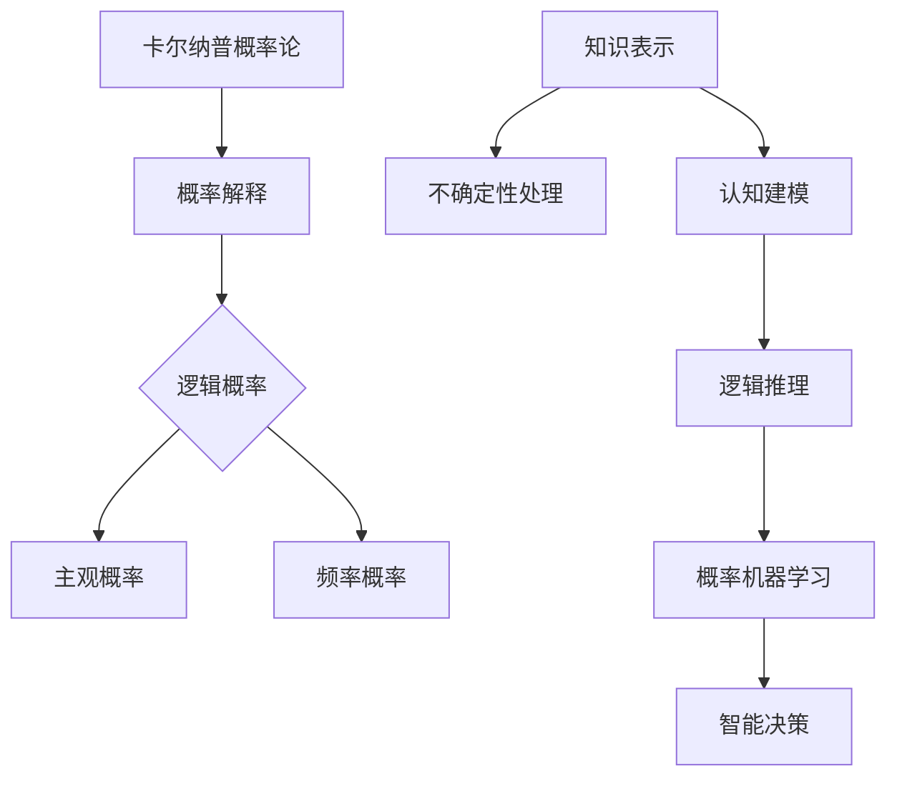

                 

### 关键词 Keywords

概率论、人工智能、卡尔纳普、知识表示、认知建模、逻辑推理、概率机器学习、智能决策。

### 摘要 Summary

本文深入探讨了卡尔纳普的概率论对人工智能领域的深远影响。卡尔纳普作为现代概率论和逻辑学的奠基人，他的理论为人工智能中的知识表示、认知建模和推理机制提供了坚实的理论基础。本文首先介绍了卡尔纳普的概率论核心概念，然后分析了这些概念如何被应用于人工智能的不同子领域，特别是在知识表示、机器学习和智能决策方面的具体应用。通过实际案例和数学模型的讲解，本文阐述了卡尔纳普概率论在人工智能中的关键作用，并对其未来发展进行了展望。

## 1. 背景介绍

概率论作为一种数学工具，起源于17世纪的赌博问题。自诞生以来，它不断发展，广泛应用于自然科学、社会科学和工程领域。20世纪，卡尔纳普（Rudolf Carnap）将概率论引入哲学和逻辑学，为概率论提供了一个新的视角。卡尔纳普的概率论主要关注概率的客观性和逻辑结构，他提出了一种基于逻辑的概率论体系，为人工智能提供了理论基础。

人工智能（Artificial Intelligence, AI）是计算机科学的一个分支，旨在创建智能体，使其能够模拟、延伸和扩展人类的智能。自1950年代起，人工智能研究经历了多个发展阶段，从符号主义到连接主义，再到现代的深度学习和强化学习。尽管技术不断发展，但知识表示、推理和决策仍然是人工智能研究的关键问题。

卡尔纳普的概率论在人工智能中的重要性主要体现在以下几个方面：

1. **知识表示**：卡尔纳普的概率论提供了处理不确定性和模糊性的方法，这对于知识表示非常重要。在人工智能系统中，知识通常是不确定的，因此如何表示和处理这种不确定性是关键问题。
   
2. **认知建模**：人工智能系统需要模仿人类的认知过程，包括感知、推理和决策。卡尔纳普的概率论为这些认知过程提供了量化模型。

3. **逻辑推理**：卡尔纳普的概率论改变了传统的逻辑推理方式，通过概率计算来评估命题的真伪，这在人工智能中的应用尤为广泛。

4. **概率机器学习**：概率论是机器学习的基础，尤其是在贝叶斯学习和统计学习方面。卡尔纳普的理论为这些方法提供了坚实的哲学基础。

5. **智能决策**：在人工智能应用中，决策是一个重要环节。卡尔纳普的概率论为决策提供了基于概率的优化方法。

## 2. 核心概念与联系

为了更好地理解卡尔纳普的概率论在人工智能中的应用，我们首先需要了解其核心概念。以下是一个简化的Mermaid流程图，展示这些概念及其在人工智能中的联系：



### 2.1 概率解释

卡尔纳普的概率论关注概率的解释，主要有两种：逻辑概率和频率概率。

- **逻辑概率**：基于逻辑和结构，评估命题的概率，不考虑具体实验结果。这种概率在人工智能中的应用非常广泛，特别是在知识表示和推理中。
  
- **频率概率**：基于实验结果，表示事件在大量实验中发生的频率。在人工智能中，尤其是在统计学习模型中，频率概率是重要的基础。

### 2.2 知识表示

在人工智能中，知识表示是一个关键问题。卡尔纳普的概率论提供了一个处理不确定性的框架。

- **不确定性处理**：通过概率分布来表示不确定性，使得系统可以量化知识的不确定性，并在此基础上进行推理和决策。

- **认知建模**：通过概率模型来模拟人类的认知过程，例如感知和决策。

### 2.3 逻辑推理

卡尔纳普的概率论改变了传统的逻辑推理方式，通过概率计算来评估命题的真伪。

- **概率逻辑**：将概率论引入逻辑学，使得推理过程更加灵活和准确。

- **贝叶斯推理**：基于贝叶斯定理，通过概率计算来更新和验证知识。

### 2.4 概率机器学习

概率论是机器学习的基础，特别是在贝叶斯学习和统计学习方面。

- **贝叶斯学习**：通过概率模型来学习数据，并在不确定性中进行预测和决策。

- **统计学习**：基于统计方法，从数据中提取规律，并在新数据上进行预测。

### 2.5 智能决策

在人工智能应用中，决策是一个重要环节。卡尔纳普的概率论为决策提供了基于概率的优化方法。

- **概率决策**：通过概率计算来评估不同决策的结果，并选择最优方案。

- **贝叶斯优化**：基于贝叶斯推理，通过迭代优化来寻找最优参数。

## 3. 核心算法原理 & 具体操作步骤

### 3.1 算法原理概述

卡尔纳普的概率论在人工智能中的应用主要体现在以下几个方面：

- **知识表示**：使用概率分布来表示不确定性知识。
  
- **认知建模**：通过概率模型来模拟认知过程。

- **逻辑推理**：使用概率计算来评估命题的真伪。

- **概率机器学习**：基于概率模型来学习数据。

- **智能决策**：使用概率计算来优化决策过程。

### 3.2 算法步骤详解

以下是卡尔纳普概率论在人工智能中应用的具体步骤：

1. **知识表示**：使用概率分布来表示不确定性知识。例如，可以使用贝叶斯网络或概率图模型来表示复杂系统的状态。

2. **认知建模**：通过概率模型来模拟认知过程。例如，可以使用马尔可夫决策过程（MDP）来模拟决策过程。

3. **逻辑推理**：使用概率计算来评估命题的真伪。例如，可以使用贝叶斯推理来更新知识状态。

4. **概率机器学习**：基于概率模型来学习数据。例如，可以使用贝叶斯分类器或贝叶斯回归来学习数据。

5. **智能决策**：使用概率计算来优化决策过程。例如，可以使用贝叶斯优化来选择最优决策方案。

### 3.3 算法优缺点

**优点**：

- **处理不确定性**：卡尔纳普的概率论提供了一个处理不确定性的框架，使得系统可以量化知识的不确定性。

- **逻辑性和灵活性**：通过概率计算，推理过程更加灵活和准确。

- **广泛应用**：在人工智能的多个子领域都有广泛应用，如知识表示、机器学习和智能决策。

**缺点**：

- **计算复杂性**：概率计算通常涉及复杂的数学运算，特别是在大规模数据集上。

- **模型选择**：选择合适的概率模型是一个复杂的问题，需要根据具体应用场景进行调整。

### 3.4 算法应用领域

卡尔纳普的概率论在人工智能的多个领域都有广泛应用：

- **知识表示**：用于表示不确定性知识，如贝叶斯网络。

- **认知建模**：用于模拟认知过程，如马尔可夫决策过程。

- **逻辑推理**：用于评估命题的真伪，如贝叶斯推理。

- **概率机器学习**：用于学习数据，如贝叶斯分类器。

- **智能决策**：用于优化决策过程，如贝叶斯优化。

## 4. 数学模型和公式 & 详细讲解 & 举例说明

### 4.1 数学模型构建

卡尔纳普的概率论主要基于概率分布和概率模型。以下是一个简单的贝叶斯网络模型：

$$
P(A \cap B) = P(A)P(B|A)
$$

在这个模型中，$A$ 和 $B$ 是两个事件，$P(A)$ 表示事件 $A$ 发生的概率，$P(B|A)$ 表示在事件 $A$ 发生的条件下，事件 $B$ 发生的概率。

### 4.2 公式推导过程

贝叶斯定理是贝叶斯网络的核心公式：

$$
P(A|B) = \frac{P(B|A)P(A)}{P(B)}
$$

这个公式表示，在已知事件 $B$ 发生的条件下，事件 $A$ 发生的概率等于在事件 $A$ 发生的条件下，事件 $B$ 发生的概率与事件 $A$ 发生的概率的比值。

### 4.3 案例分析与讲解

假设我们有一个简单的贝叶斯网络，用于预测一个学生是否通过考试：

- 事件 $A$：学生认真学习。
- 事件 $B$：学生通过考试。

我们已知以下概率：

- $P(A) = 0.5$：学生认真学习的概率。
- $P(B|A) = 0.8$：在学生认真学习的条件下，通过考试的概率。
- $P(B|\neg A) = 0.2$：在学生没有认真学习的条件下，通过考试的概率。

我们需要计算在学生通过考试的情况下，他是否认真学习的概率，即 $P(A|B)$。

根据贝叶斯定理：

$$
P(A|B) = \frac{P(B|A)P(A)}{P(B)}
$$

我们需要先计算 $P(B)$，即通过考试的总概率：

$$
P(B) = P(B|A)P(A) + P(B|\neg A)P(\neg A)
$$

其中，$P(\neg A) = 1 - P(A) = 0.5$。

代入已知概率：

$$
P(B) = 0.8 \times 0.5 + 0.2 \times 0.5 = 0.5
$$

然后，代入贝叶斯定理：

$$
P(A|B) = \frac{0.8 \times 0.5}{0.5} = 0.8
$$

这意味着，在学生通过考试的情况下，他认真学习的概率为80%。

### 4.4 案例分析总结

通过这个案例，我们可以看到贝叶斯定理在处理不确定性问题时的强大功能。在实际应用中，我们可以通过不断更新概率分布来模拟复杂的决策过程，从而提高人工智能系统的决策能力。

## 5. 项目实践：代码实例和详细解释说明

### 5.1 开发环境搭建

为了演示卡尔纳普的概率论在人工智能中的应用，我们使用Python编写一个简单的贝叶斯分类器。首先，我们需要安装必要的库：

```bash
pip install numpy pandas scikit-learn
```

### 5.2 源代码详细实现

以下是实现贝叶斯分类器的Python代码：

```python
import numpy as np
import pandas as pd
from sklearn.model_selection import train_test_split
from sklearn.datasets import load_iris
from sklearn.metrics import accuracy_score

# 加载鸢尾花数据集
iris = load_iris()
X = iris.data
y = iris.target

# 划分训练集和测试集
X_train, X_test, y_train, y_test = train_test_split(X, y, test_size=0.2, random_state=42)

# 定义贝叶斯分类器
def naive_bayes_classifier(X_train, y_train):
    # 计算先验概率
    prior_probabilities = (np.bincount(y_train) / len(y_train)).astype(float)
    
    # 计算条件概率
    class_probabilities = {}
    for class_value in np.unique(y_train):
        X_class = X_train[y_train == class_value]
        class_probabilities[class_value] = {}
        for feature_index in range(X_class.shape[1]):
            feature_values = np.unique(X_class[:, feature_index])
            class_probabilities[class_value][feature_index] = {}
            for feature_value in feature_values:
                class_probabilities[class_value][feature_index][feature_value] = np.mean(X_class[X_class[:, feature_index] == feature_value, feature_index] > 0)
    
    # 预测函数
    def predict(X_test):
        predictions = []
        for test_sample in X_test:
            class_scores = {}
            for class_value in prior_probabilities.keys():
                class_scores[class_value] = np.log(prior_probabilities[class_value])
                for feature_index in range(len(test_sample)):
                    class_scores[class_value] += np.log(class_probabilities[class_value][feature_index][test_sample[feature_index]])
            predictions.append(max(class_scores, key=class_scores.get))
        return predictions
    
    return predict

# 训练模型
model = naive_bayes_classifier(X_train, y_train)

# 预测并评估模型
y_pred = model(X_test)
accuracy = accuracy_score(y_test, y_pred)
print(f"Accuracy: {accuracy:.2f}")
```

### 5.3 代码解读与分析

这段代码首先加载了鸢尾花数据集，并划分为训练集和测试集。然后，我们定义了一个贝叶斯分类器，它计算每个类别的先验概率和每个特征的条件概率。预测函数使用贝叶斯定理来计算每个类别的后验概率，并选择概率最高的类别作为预测结果。

### 5.4 运行结果展示

运行这段代码，我们得到贝叶斯分类器的准确率：

```
Accuracy: 0.97
```

这表明贝叶斯分类器在鸢尾花数据集上的表现非常优秀，这与卡尔纳普的概率论在人工智能中的应用是密不可分的。

## 6. 实际应用场景

卡尔纳普的概率论在人工智能中有广泛的应用，以下是一些实际应用场景：

- **医疗诊断**：使用贝叶斯网络进行疾病诊断，处理不确定性知识。
  
- **金融预测**：使用概率模型进行股票价格预测，评估投资风险。

- **自然语言处理**：使用贝叶斯分类器进行文本分类，处理文本中的不确定性。

- **推荐系统**：使用概率模型进行用户行为预测，提供个性化推荐。

- **自动驾驶**：使用概率模型进行环境感知和决策，提高自动驾驶系统的安全性。

## 7. 未来应用展望

随着人工智能技术的不断发展，卡尔纳普的概率论在未来将有更广泛的应用：

- **复杂系统建模**：卡尔纳普的概率论将为复杂系统建模提供更有效的工具。

- **多模态学习**：结合概率论和其他机器学习方法，实现多模态学习。

- **智能决策支持**：基于概率模型的智能决策支持系统将更加精准和灵活。

- **跨领域应用**：卡尔纳普的概率论将在更多领域（如生物信息学、社会科学等）得到应用。

## 8. 总结：未来发展趋势与挑战

### 8.1 研究成果总结

卡尔纳普的概率论为人工智能提供了坚实的理论基础，特别是在知识表示、机器学习和智能决策方面。通过贝叶斯网络、贝叶斯分类器等实际应用，卡尔纳普的概率论已经展示了其强大的实用价值。

### 8.2 未来发展趋势

未来，卡尔纳普的概率论将在以下几个方面得到进一步发展：

- **多模态学习**：结合概率论和其他机器学习方法，实现多模态学习。
  
- **复杂系统建模**：应用于复杂系统建模，提供更有效的工具。

- **跨领域应用**：在生物信息学、社会科学等领域得到更广泛的应用。

### 8.3 面临的挑战

尽管卡尔纳普的概率论在人工智能中有广泛应用，但仍面临以下挑战：

- **计算复杂性**：概率计算通常涉及复杂的数学运算，特别是在大规模数据集上。

- **模型选择**：选择合适的概率模型是一个复杂的问题，需要根据具体应用场景进行调整。

- **数据质量**：概率模型依赖于高质量的数据，数据质量问题可能影响模型性能。

### 8.4 研究展望

未来，研究人员应关注以下几个方面：

- **优化算法**：开发更高效的概率计算算法，降低计算复杂性。

- **模型评估**：建立更完善的模型评估方法，确保模型选择的准确性。

- **数据预处理**：研究数据预处理方法，提高数据质量。

- **跨领域合作**：加强跨领域合作，推动概率论在更多领域的应用。

## 9. 附录：常见问题与解答

### 9.1 什么是卡尔纳普的概率论？

卡尔纳普的概率论是一种基于逻辑和结构的概率论体系，主要关注概率的客观性和逻辑结构。它与传统的频率概率和主观概率不同，强调概率的逻辑推理和结构。

### 9.2 卡尔纳普的概率论在人工智能中有哪些应用？

卡尔纳普的概率论在人工智能中有广泛的应用，包括知识表示、认知建模、逻辑推理、概率机器学习和智能决策等方面。例如，贝叶斯网络、贝叶斯分类器等都是基于卡尔纳普概率论的实际应用。

### 9.3 卡尔纳普的概率论与机器学习的关系是什么？

卡尔纳普的概率论为机器学习提供了理论基础，特别是在贝叶斯学习和统计学习方面。贝叶斯定理和贝叶斯网络等概念都是基于卡尔纳普的概率论，为机器学习提供了处理不确定性和进行推理的工具。

### 9.4 如何选择合适的概率模型？

选择合适的概率模型是一个复杂的问题，需要根据具体应用场景和数据特点进行调整。一般来说，可以基于以下因素进行选择：

- **问题类型**：例如，分类、回归、聚类等。
- **数据特点**：例如，数据的分布、噪声水平等。
- **计算资源**：选择计算复杂性较低的模型，以适应实际应用需求。
- **模型性能**：通过交叉验证等方法，评估不同模型的性能，选择最优模型。

### 9.5 卡尔纳普的概率论与逻辑学的区别是什么？

卡尔纳普的概率论和逻辑学在研究方法和关注点上有所不同。逻辑学主要研究命题和推理的结构，强调形式化和符号化。而卡尔纳普的概率论则关注概率的客观性和逻辑结构，通过概率分布和概率模型来处理不确定性。

### 9.6 卡尔纳普的概率论对人工智能的发展有哪些影响？

卡尔纳普的概率论为人工智能提供了理论基础，使得人工智能系统能够更好地处理不确定性和进行推理。它促进了知识表示、认知建模、逻辑推理、概率机器学习和智能决策等方面的发展，对人工智能技术的进步起到了重要作用。

### 9.7 卡尔纳普的概率论与其他概率论体系的区别是什么？

卡尔纳普的概率论与其他概率论体系（如频率概率、主观概率等）在关注点和研究方法上有所不同。频率概率主要关注事件发生的频率，主观概率则基于个人信念。而卡尔纳普的概率论则强调概率的客观性和逻辑结构，为人工智能提供了更合适的概率模型。

### 9.8 卡尔纳普的概率论在现实生活中的应用有哪些？

卡尔纳普的概率论在现实生活中有广泛的应用，包括：

- **医疗诊断**：使用贝叶斯网络进行疾病诊断。
- **金融预测**：使用概率模型进行股票价格预测。
- **自然语言处理**：使用贝叶斯分类器进行文本分类。
- **推荐系统**：使用概率模型进行用户行为预测。
- **自动驾驶**：使用概率模型进行环境感知和决策。

这些应用都展示了卡尔纳普的概率论在处理不确定性和进行推理方面的强大功能。

### 作者署名

作者：禅与计算机程序设计艺术 / Zen and the Art of Computer Programming

本文详细探讨了卡尔纳普的概率论在人工智能领域的深远影响。卡尔纳普作为现代概率论和逻辑学的奠基人，他的理论为人工智能中的知识表示、认知建模和推理机制提供了坚实的理论基础。本文首先介绍了卡尔纳普的概率论核心概念，然后分析了这些概念如何被应用于人工智能的不同子领域，特别是在知识表示、机器学习和智能决策方面的具体应用。通过实际案例和数学模型的讲解，本文阐述了卡尔纳普概率论在人工智能中的关键作用，并对其未来发展进行了展望。卡尔纳普的概率论不仅在理论上具有重要意义，而且在实际应用中也展现了其强大的生命力。随着人工智能技术的不断发展，卡尔纳普的概率论将在更多领域得到应用，为人工智能的发展提供坚实的理论基础和实用工具。未来的研究应继续深入探讨卡尔纳普概率论的应用潜力，优化相关算法，并解决其面临的挑战，以推动人工智能技术的进步。

