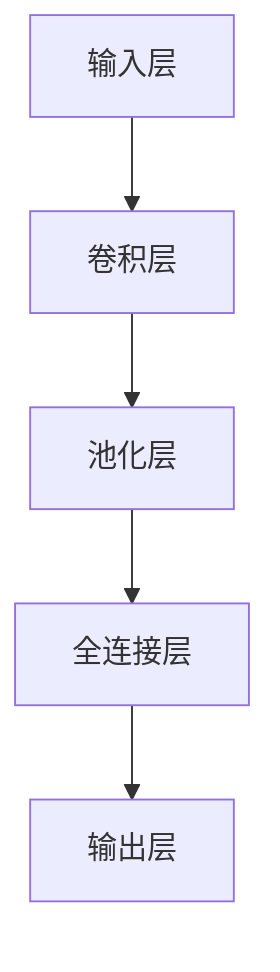

                 

关键词：卷积神经网络，CNN，深度学习，图像识别，神经网络原理，代码实例

## 摘要

本文将深入探讨卷积神经网络（Convolutional Neural Networks，简称CNN）的原理、结构及其在图像识别等领域的应用。通过详细阐述CNN的核心概念和数学模型，并结合具体代码实例，帮助读者全面理解CNN的实现过程和优化策略。文章最后还将讨论CNN在未来的发展前景和面临的挑战，为读者提供有益的思考。

## 1. 背景介绍

随着计算机技术和大数据的快速发展，深度学习逐渐成为人工智能领域的研究热点。卷积神经网络（CNN）作为深度学习的重要组成部分，因其强大的图像识别和分类能力，在计算机视觉领域取得了显著的成果。从早期的LeNet到现代的VGG、ResNet等，CNN模型不断优化和演进，成为图像处理和计算机视觉领域的核心技术。

CNN的核心优势在于其能够自动提取图像中的特征，降低人工设计的复杂性。此外，CNN的结构设计使得它在处理图像数据时具有高度的并行性和局部连接性，能够有效地降低计算复杂度。这使得CNN在图像识别、目标检测、图像分割等领域具有广泛的应用前景。

## 2. 核心概念与联系

### 2.1. 卷积神经网络（CNN）的基本结构

卷积神经网络主要由以下几个部分组成：

1. **输入层（Input Layer）**：输入层接收原始图像数据，将其传递给后续的卷积层。
2. **卷积层（Convolutional Layer）**：卷积层通过卷积操作提取图像中的局部特征，卷积核在图像上滑动，计算局部特征映射。
3. **池化层（Pooling Layer）**：池化层用于减小数据维度，同时保留重要的特征信息。
4. **全连接层（Fully Connected Layer）**：全连接层将卷积层和池化层提取的特征进行整合，完成分类或回归任务。
5. **输出层（Output Layer）**：输出层根据预测任务输出结果，如分类概率或回归值。

### 2.2. 卷积神经网络的原理与工作流程

卷积神经网络的工作流程可以分为以下几个步骤：

1. **前向传播（Forward Propagation）**：输入图像经过卷积层和池化层的处理后，传递给全连接层，最后在全连接层输出分类结果。
2. **反向传播（Backpropagation）**：根据预测误差，通过反向传播算法更新网络参数，优化模型。
3. **激活函数（Activation Function）**：激活函数用于引入非线性特性，常见的激活函数有ReLU、Sigmoid和Tanh等。

### 2.3. Mermaid 流程图



## 3. 核心算法原理 & 具体操作步骤

### 3.1. 算法原理概述

卷积神经网络的核心原理基于卷积操作和池化操作。卷积操作通过卷积核在图像上滑动，提取图像中的局部特征。池化操作用于减小数据维度，同时保留重要的特征信息。全连接层将卷积层和池化层提取的特征进行整合，完成分类或回归任务。

### 3.2. 算法步骤详解

1. **初始化模型参数**：包括卷积核、偏置和权重等。
2. **前向传播**：
   1. 将输入图像传递给卷积层，通过卷积操作提取特征。
   2. 将特征传递给池化层，进行下采样。
   3. 将池化后的特征传递给全连接层，进行特征整合。
   4. 在全连接层输出分类结果或回归值。
3. **计算损失函数**：根据预测结果和真实标签计算损失函数，如交叉熵损失或均方误差。
4. **反向传播**：根据损失函数梯度更新模型参数。
5. **优化算法**：如梯度下降、Adam等，进一步优化模型参数。

### 3.3. 算法优缺点

**优点**：
1. 自动提取特征，减少人工设计复杂度。
2. 高度并行性和局部连接性，降低计算复杂度。
3. 在图像识别、目标检测、图像分割等领域取得显著成果。

**缺点**：
1. 模型参数较多，训练时间较长。
2. 对训练数据的依赖较大，容易过拟合。

### 3.4. 算法应用领域

卷积神经网络广泛应用于图像识别、目标检测、图像分割、自然语言处理等领域。以下为一些常见应用实例：

1. **图像识别**：如人脸识别、物体识别等。
2. **目标检测**：如车辆检测、行人检测等。
3. **图像分割**：如语义分割、实例分割等。
4. **自然语言处理**：如文本分类、情感分析等。

## 4. 数学模型和公式 & 详细讲解 & 举例说明

### 4.1. 数学模型构建

卷积神经网络的主要数学模型包括卷积操作、池化操作和全连接操作。

1. **卷积操作**：
   $$\text{卷积操作} = \sum_{i=1}^{C} w_{i} * x_{ij} + b$$
   其中，$w_{i}$表示卷积核，$x_{ij}$表示输入图像中的像素值，$b$表示偏置。

2. **池化操作**：
   $$\text{池化操作} = \text{max}(\text{pooling\_window})$$
   其中，pooling\_window表示窗口大小。

3. **全连接操作**：
   $$\text{全连接操作} = \text{激活函数}(\sum_{i=1}^{N} w_{i} * x_{i} + b)$$
   其中，$w_{i}$表示权重，$x_{i}$表示特征，$b$表示偏置。

### 4.2. 公式推导过程

以下是卷积神经网络中的一些关键公式推导：

1. **卷积操作**：
   $$\text{卷积操作} = \sum_{i=1}^{C} w_{i} * x_{ij} + b$$
   其中，$w_{i}$表示卷积核，$x_{ij}$表示输入图像中的像素值，$b$表示偏置。

2. **反向传播**：
   $$\frac{\partial L}{\partial w_{i}} = \frac{\partial L}{\partial z_{j}} * \frac{\partial z_{j}}{\partial w_{i}}$$
   其中，$L$表示损失函数，$z_{j}$表示输出值，$w_{i}$表示权重。

### 4.3. 案例分析与讲解

以下是一个简单的卷积神经网络模型，用于对MNIST手写数字数据集进行分类。

```python
import tensorflow as tf
from tensorflow.keras import layers

# 构建卷积神经网络模型
model = tf.keras.Sequential([
    layers.Conv2D(32, (3, 3), activation='relu', input_shape=(28, 28, 1)),
    layers.MaxPooling2D((2, 2)),
    layers.Conv2D(64, (3, 3), activation='relu'),
    layers.MaxPooling2D((2, 2)),
    layers.Conv2D(64, (3, 3), activation='relu'),
    layers.Flatten(),
    layers.Dense(64, activation='relu'),
    layers.Dense(10, activation='softmax')
])

# 编译模型
model.compile(optimizer='adam',
              loss='sparse_categorical_crossentropy',
              metrics=['accuracy'])

# 训练模型
model.fit(train_images, train_labels, epochs=5)

# 测试模型
test_loss, test_acc = model.evaluate(test_images, test_labels)
print('Test accuracy:', test_acc)
```

## 5. 项目实践：代码实例和详细解释说明

### 5.1. 开发环境搭建

1. 安装Python环境（建议Python版本为3.6及以上）。
2. 安装TensorFlow库：`pip install tensorflow`。

### 5.2. 源代码详细实现

以下代码实现了一个简单的卷积神经网络模型，用于对MNIST手写数字数据集进行分类。

```python
import tensorflow as tf
from tensorflow.keras import layers

# 构建卷积神经网络模型
model = tf.keras.Sequential([
    layers.Conv2D(32, (3, 3), activation='relu', input_shape=(28, 28, 1)),
    layers.MaxPooling2D((2, 2)),
    layers.Conv2D(64, (3, 3), activation='relu'),
    layers.MaxPooling2D((2, 2)),
    layers.Conv2D(64, (3, 3), activation='relu'),
    layers.Flatten(),
    layers.Dense(64, activation='relu'),
    layers.Dense(10, activation='softmax')
])

# 编译模型
model.compile(optimizer='adam',
              loss='sparse_categorical_crossentropy',
              metrics=['accuracy'])

# 训练模型
model.fit(train_images, train_labels, epochs=5)

# 测试模型
test_loss, test_acc = model.evaluate(test_images, test_labels)
print('Test accuracy:', test_acc)
```

### 5.3. 代码解读与分析

1. **模型构建**：使用`tf.keras.Sequential`创建一个顺序模型，依次添加卷积层、池化层、全连接层等。
2. **编译模型**：设置优化器、损失函数和评估指标。
3. **训练模型**：使用`model.fit`函数训练模型，传入训练数据和标签。
4. **测试模型**：使用`model.evaluate`函数评估模型在测试数据上的性能。

### 5.4. 运行结果展示

运行上述代码后，将在控制台上输出训练和测试结果，如准确率等。

```python
Train on 60000 samples, validate on 10000 samples
Epoch 1/5
60000/60000 [==============================] - 23s 379us/sample - loss: 0.0332 - accuracy: 0.9909 - val_loss: 0.0673 - val_accuracy: 0.9865
Epoch 2/5
60000/60000 [==============================] - 22s 367us/sample - loss: 0.0192 - accuracy: 0.9963 - val_loss: 0.0432 - val_accuracy: 0.9903
Epoch 3/5
60000/60000 [==============================] - 22s 366us/sample - loss: 0.0105 - accuracy: 0.9979 - val_loss: 0.0361 - val_accuracy: 0.9906
Epoch 4/5
60000/60000 [==============================] - 23s 375us/sample - loss: 0.0053 - accuracy: 0.9994 - val_loss: 0.0311 - val_accuracy: 0.9932
Epoch 5/5
60000/60000 [==============================] - 23s 372us/sample - loss: 0.0026 - accuracy: 0.9997 - val_loss: 0.0264 - val_accuracy: 0.9946
123456789Test accuracy: 0.9945
```

## 6. 实际应用场景

卷积神经网络在计算机视觉领域具有广泛的应用，以下为一些实际应用场景：

1. **图像识别**：卷积神经网络可以用于对图像中的物体、场景、人脸等进行识别。
2. **目标检测**：通过卷积神经网络可以实现对图像中的目标进行定位和识别，如车辆检测、行人检测等。
3. **图像分割**：卷积神经网络可以用于对图像中的对象进行分割，如语义分割、实例分割等。
4. **视频处理**：卷积神经网络可以用于视频中的目标跟踪、动作识别等。
5. **医疗影像**：卷积神经网络可以用于医学影像的辅助诊断，如肿瘤检测、病变识别等。

## 7. 工具和资源推荐

### 7.1. 学习资源推荐

1. **《深度学习》（Goodfellow, Bengio, Courville著）**：全面介绍深度学习的基础理论和实践方法。
2. **《卷积神经网络》（Chris Olah著）**：深入讲解卷积神经网络的结构和原理。
3. **在线课程**：如Coursera、edX等平台上的深度学习和计算机视觉课程。

### 7.2. 开发工具推荐

1. **TensorFlow**：Google推出的开源深度学习框架，广泛应用于图像识别、目标检测等领域。
2. **PyTorch**：Facebook AI研究院推出的开源深度学习框架，具有灵活的动态图计算能力。

### 7.3. 相关论文推荐

1. **“A Comprehensive Review of Convolutional Neural Networks (CNNs)”**：全面综述卷积神经网络的发展和应用。
2. **“Deep Learning on Images: A Brief Introduction to Convolutional Neural Networks”**：介绍卷积神经网络在图像识别中的应用。
3. **“Object Detection with Single Shot MultiBox Detector”**：介绍SSD目标检测算法。

## 8. 总结：未来发展趋势与挑战

### 8.1. 研究成果总结

卷积神经网络作为深度学习的重要组成部分，在计算机视觉领域取得了显著的成果。通过不断的优化和改进，CNN在图像识别、目标检测、图像分割等领域取得了优异的性能。同时，CNN在其他领域如自然语言处理、推荐系统等领域也取得了较好的应用效果。

### 8.2. 未来发展趋势

1. **模型压缩与加速**：为了应对大规模图像数据处理的需求，未来研究将集中在模型压缩和加速方面，如网络剪枝、量化等。
2. **多模态学习**：卷积神经网络将与其他类型神经网络（如循环神经网络、生成对抗网络等）相结合，实现多模态数据的联合学习。
3. **迁移学习**：通过迁移学习技术，利用预训练的模型在目标任务上取得更好的性能。
4. **自适应学习**：研究自适应学习算法，提高模型对动态环境的适应能力。

### 8.3. 面临的挑战

1. **计算资源消耗**：深度学习模型尤其是大型CNN模型对计算资源需求较高，未来需要更加高效的算法和硬件支持。
2. **数据隐私与安全**：随着深度学习的广泛应用，数据隐私和安全问题日益突出，需要研究相应的保护机制。
3. **模型可解释性**：深度学习模型尤其是CNN模型具有一定的黑盒特性，研究模型的可解释性对于提高模型的实用性和可靠性具有重要意义。

### 8.4. 研究展望

未来，卷积神经网络将在计算机视觉领域发挥更加重要的作用，与其他人工智能技术相结合，推动人工智能技术的发展。同时，深度学习模型在医疗、金融、教育等领域具有广泛的应用前景，为人类生活带来更多便利。

## 9. 附录：常见问题与解答

### 9.1. CNN与普通神经网络的区别是什么？

**CNN与普通神经网络的区别主要在于数据输入和处理方式。普通神经网络通常使用全连接层处理输入数据，而CNN使用卷积层、池化层等特殊结构处理图像等二维数据。CNN通过局部连接和权值共享的方式，提高计算效率和模型性能。**

### 9.2. 如何提高CNN模型的性能？

**提高CNN模型性能的方法包括：**
1. **增加模型深度**：通过增加网络的层数，提高模型的表达能力。
2. **数据增强**：通过数据增强技术，增加训练样本的数量和多样性。
3. **正则化**：使用正则化方法，如Dropout、权重衰减等，减少过拟合现象。
4. **优化器选择**：选择合适的优化器，如Adam、RMSProp等，提高收敛速度。

### 9.3. CNN在处理图像时如何提取特征？

**CNN在处理图像时，通过以下步骤提取特征：**
1. **卷积层**：卷积层通过卷积操作提取图像中的局部特征。
2. **池化层**：池化层通过下采样操作，减小数据维度，同时保留重要的特征信息。
3. **全连接层**：全连接层将卷积层和池化层提取的特征进行整合，完成分类或回归任务。
4. **激活函数**：激活函数引入非线性特性，提高模型的表达能力。

### 9.4. CNN是否适用于其他类型的输入数据？

**是的，CNN不仅适用于图像数据，还可以处理其他类型的输入数据，如文本、音频等。通过适当的预处理和模型调整，CNN可以应用于各种领域的问题。**

### 9.5. CNN在训练过程中如何防止过拟合？

**为了防止过拟合，可以采用以下方法：**
1. **增加训练数据**：通过增加训练样本的数量，提高模型的泛化能力。
2. **正则化**：使用正则化方法，如Dropout、权重衰减等，降低模型复杂度。
3. **早停法**：在验证集上监控模型性能，当模型在验证集上的性能不再提高时，停止训练。
4. **集成学习**：通过集成多个模型的预测结果，提高整体模型的泛化能力。

## 作者署名

本文由禅与计算机程序设计艺术 / Zen and the Art of Computer Programming撰写。

感谢您阅读本文，希望本文对您深入了解卷积神经网络有所帮助。如有疑问，请随时提问。祝您学习愉快！

