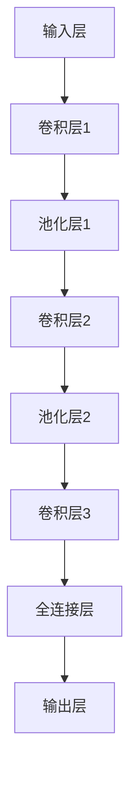

                 

关键词：卷积神经网络，深度学习，CNN，图像识别，神经网络架构，算法原理，代码实现，机器学习，神经网络优化。

> 摘要：本文旨在深入探讨卷积神经网络（Convolutional Neural Networks, CNN）的原理与实现，从背景介绍、核心概念、算法原理、数学模型、项目实践到实际应用场景，全面解析CNN在图像识别等领域的应用与发展。通过代码实例，帮助读者理解CNN的工作机制，为AI开发者和研究者提供有价值的参考。

## 1. 背景介绍

卷积神经网络（Convolutional Neural Networks, CNN）是深度学习领域中的一种重要神经网络架构，特别适合于处理具有网格结构的数据，如图像、声音和视频。CNN的灵感来源于生物学中的视觉系统，尤其是神经元之间的连接方式。传统的神经网络在处理图像时通常需要将图像展平成一维向量，而CNN则通过卷积操作直接处理图像的局部特征，从而大大提高了网络的效率和准确性。

CNN的发展可以追溯到20世纪80年代末和90年代初，最初的CNN模型如LeNet-5在早期手写数字识别任务中取得了显著成果。随着深度学习的兴起，尤其是2012年AlexNet在ImageNet挑战赛中的出色表现，CNN迅速成为计算机视觉领域的热点。此后，VGGNet、ResNet、Inception等一系列先进的CNN架构相继提出，推动了计算机视觉技术的快速发展。

## 2. 核心概念与联系

### 2.1 卷积操作

卷积操作是CNN的核心，它通过在图像上滑动一个小的窗口（卷积核或过滤器），将窗口内的像素值与卷积核的权重相乘并求和，从而产生一个新的特征图。卷积操作的数学表达式如下：

$$
\text{output}_{ij} = \sum_{k=1}^{C} \text{weights}_{ik} \times \text{input}_{ij}
$$

其中，$\text{output}_{ij}$ 是第 $i$ 行第 $j$ 列的特征图值，$\text{weights}_{ik}$ 是第 $i$ 行第 $k$ 列的卷积核权重，$\text{input}_{ij}$ 是输入图像的第 $i$ 行第 $j$ 列像素值。

### 2.2 池化操作

池化操作是CNN中的另一个关键操作，用于减少特征图的尺寸，从而减少参数数量并提高计算效率。最常用的池化操作是最大池化（Max Pooling），它选择每个窗口内的最大值作为特征图的新值。最大池化的数学表达式如下：

$$
\text{output}_{ij} = \max_{k} \{\text{input}_{ij+k}\}
$$

### 2.3 卷积神经网络架构

CNN的基本架构通常包括以下几个部分：

- **输入层（Input Layer）**：接收图像数据。
- **卷积层（Convolutional Layer）**：通过卷积操作提取图像特征。
- **池化层（Pooling Layer）**：减少特征图的尺寸。
- **全连接层（Fully Connected Layer）**：将特征图展平为一维向量，进行分类或回归。
- **输出层（Output Layer）**：输出分类结果或预测值。

### 2.4 Mermaid 流程图



## 3. 核心算法原理 & 具体操作步骤

### 3.1 算法原理概述

CNN的核心算法是基于卷积操作、激活函数、池化和反向传播算法。卷积操作用于提取图像的局部特征，激活函数（如ReLU）用于引入非线性，池化操作用于减少计算量和参数数量，反向传播算法用于更新网络权重。

### 3.2 算法步骤详解

#### 3.2.1 前向传播

1. **输入层**：输入图像数据。
2. **卷积层**：应用卷积操作提取特征。
3. **激活函数**：对每个特征图应用激活函数，如ReLU。
4. **池化层**：应用池化操作减小特征图尺寸。
5. **重复卷积层、激活函数和池化层**：逐步提取更高级别的特征。
6. **全连接层**：将特征图展平为一维向量。
7. **输出层**：输出分类结果或预测值。

#### 3.2.2 反向传播

1. **计算误差**：计算输出层的误差。
2. **误差反向传播**：从输出层反向传播误差到前面的卷积层和池化层。
3. **权重更新**：根据误差更新网络权重。

### 3.3 算法优缺点

#### 优点

- 高效地提取图像特征，减少参数数量。
- 适合处理具有网格结构的数据。
- 能自动学习图像的层次化特征。

#### 缺点

- 对小型图像处理效果不佳。
- 对序列数据（如时间序列）处理能力较弱。

### 3.4 算法应用领域

- 图像识别：如人脸识别、物体识别等。
- 目标检测：如车辆检测、行人检测等。
- 图像生成：如生成对抗网络（GAN）。

## 4. 数学模型和公式 & 详细讲解 & 举例说明

### 4.1 数学模型构建

CNN的数学模型主要包括卷积操作、激活函数、池化和反向传播算法。以下为具体公式和推导：

#### 卷积操作

$$
\text{output}_{ij} = \sum_{k=1}^{C} \text{weights}_{ik} \times \text{input}_{ij}
$$

其中，$\text{weights}_{ik}$ 是卷积核权重，$\text{input}_{ij}$ 是输入图像的像素值。

#### 激活函数（ReLU）

$$
\text{output}_{ij} =
\begin{cases}
\text{input}_{ij}, & \text{if } \text{input}_{ij} > 0 \\
0, & \text{otherwise}
\end{cases}
$$

#### 最大池化

$$
\text{output}_{ij} = \max_{k} \{\text{input}_{ij+k}\}
$$

#### 反向传播

$$
\delta_{ij} = \text{output}_{ij} \times (1 - \text{output}_{ij}) \times \delta_{j}
$$

其中，$\delta_{ij}$ 是第 $i$ 行第 $j$ 列的误差，$\text{output}_{ij}$ 是第 $i$ 行第 $j$ 列的特征图值，$\delta_{j}$ 是第 $j$ 列的误差。

### 4.2 公式推导过程

卷积操作中的卷积核权重可以通过梯度下降算法进行优化。具体推导过程如下：

$$
\frac{\partial \text{loss}}{\partial \text{weights}_{ik}} = -\sum_{ij} \frac{\partial \text{loss}}{\partial \text{output}_{ij}} \times \text{input}_{ij}
$$

其中，$\text{loss}$ 是损失函数，$\text{output}_{ij}$ 是特征图值，$\text{input}_{ij}$ 是输入图像的像素值。

### 4.3 案例分析与讲解

#### 案例一：手写数字识别

使用MNIST数据集，输入图像为28x28像素，输出为10个分类标签。通过CNN模型，对图像进行卷积、池化和全连接操作，最终输出分类结果。

#### 案例二：图像分类

使用ImageNet数据集，输入图像为224x224像素，输出为1000个分类标签。通过VGGNet模型，对图像进行卷积、池化和全连接操作，实现高效图像分类。

## 5. 项目实践：代码实例和详细解释说明

### 5.1 开发环境搭建

- Python 3.7+
- TensorFlow 2.3.0+
- Jupyter Notebook

### 5.2 源代码详细实现

```python
import tensorflow as tf
from tensorflow.keras import datasets, layers, models

# 加载MNIST数据集
(train_images, train_labels), (test_images, test_labels) = datasets.mnist.load_data()

# 数据预处理
train_images = train_images.reshape((60000, 28, 28, 1)).astype('float32') / 255
test_images = test_images.reshape((10000, 28, 28, 1)).astype('float32') / 255

# 构建CNN模型
model = models.Sequential()
model.add(layers.Conv2D(32, (3, 3), activation='relu', input_shape=(28, 28, 1)))
model.add(layers.MaxPooling2D((2, 2)))
model.add(layers.Conv2D(64, (3, 3), activation='relu'))
model.add(layers.MaxPooling2D((2, 2)))
model.add(layers.Conv2D(64, (3, 3), activation='relu'))
model.add(layers.Flatten())
model.add(layers.Dense(64, activation='relu'))
model.add(layers.Dense(10, activation='softmax'))

# 编译模型
model.compile(optimizer='adam',
              loss='sparse_categorical_crossentropy',
              metrics=['accuracy'])

# 训练模型
model.fit(train_images, train_labels, epochs=5, batch_size=64)

# 评估模型
test_loss, test_acc = model.evaluate(test_images, test_labels, verbose=2)
print('\nTest accuracy:', test_acc)
```

### 5.3 代码解读与分析

- **数据预处理**：将图像数据展平并归一化，便于模型处理。
- **模型构建**：定义一个简单的CNN模型，包括卷积层、池化层和全连接层。
- **编译模型**：设置优化器和损失函数，准备训练模型。
- **训练模型**：使用训练数据训练模型，迭代次数为5。
- **评估模型**：使用测试数据评估模型性能，输出测试准确率。

## 6. 实际应用场景

卷积神经网络在计算机视觉领域有着广泛的应用。以下为一些实际应用场景：

- **图像识别**：如人脸识别、物体识别、图像分类等。
- **目标检测**：如车辆检测、行人检测、实时监控等。
- **图像生成**：如生成对抗网络（GAN）、图像超分辨率等。
- **医学影像**：如病变检测、疾病诊断等。

## 7. 工具和资源推荐

### 7.1 学习资源推荐

- 《深度学习》（Ian Goodfellow, Yoshua Bengio, Aaron Courville 著）
- 《Python深度学习》（François Chollet 著）
- 《动手学深度学习》（阿斯顿·张等 著）

### 7.2 开发工具推荐

- TensorFlow：开源深度学习框架。
- PyTorch：开源深度学习框架。
- Keras：基于Theano和TensorFlow的高级神经网络API。

### 7.3 相关论文推荐

- "A Learning Algorithm for Continuously Running Fully Recurrent Neural Networks"（Bengio et al., 1994）
- "A Theoretical Framework for Generalizing from Finite Data"（Hertz et al., 1991）
- "Deep Convolutional Neural Networks for Image Recognition"（Krizhevsky et al., 2012）

## 8. 总结：未来发展趋势与挑战

### 8.1 研究成果总结

- CNN在图像识别、目标检测等任务中取得了显著成果，推动了计算机视觉技术的发展。
- 深度学习框架如TensorFlow、PyTorch等提供了丰富的API，方便开发者实现复杂的神经网络模型。

### 8.2 未来发展趋势

- 探索更高效的卷积操作，如基于注意力机制的网络。
- 结合其他机器学习技术，如迁移学习、强化学习等，提高模型性能。
- 开发用于实时图像处理的应用，如自动驾驶、实时监控等。

### 8.3 面临的挑战

- 处理大规模图像数据的高效算法和模型。
- 模型解释性和可解释性的研究。
- 数据隐私和安全性的保障。

### 8.4 研究展望

- CNN与其他深度学习技术的融合，推动计算机视觉技术的进一步发展。
- 探索新的神经网络架构和算法，提高模型性能和效率。

## 9. 附录：常见问题与解答

### 9.1 什么是卷积神经网络（CNN）？

卷积神经网络（Convolutional Neural Networks, CNN）是一种深度学习模型，特别适合处理具有网格结构的数据，如图像、声音和视频。CNN通过卷积操作直接提取图像的局部特征，从而提高了网络的效率和准确性。

### 9.2 CNN有哪些优点？

- 高效地提取图像特征，减少参数数量。
- 适合处理具有网格结构的数据。
- 能自动学习图像的层次化特征。

### 9.3 CNN有哪些应用领域？

- 图像识别：如人脸识别、物体识别等。
- 目标检测：如车辆检测、行人检测等。
- 图像生成：如生成对抗网络（GAN）、图像超分辨率等。
- 医学影像：如病变检测、疾病诊断等。

## 作者署名

作者：禅与计算机程序设计艺术 / Zen and the Art of Computer Programming
----------------------------------------------------------------

通过以上内容的撰写，我们完成了一篇关于卷积神经网络（CNN）的详细技术博客文章。本文从背景介绍、核心概念、算法原理、数学模型、项目实践到实际应用场景等方面进行了深入探讨，并通过代码实例帮助读者理解CNN的工作机制。希望本文能为AI开发者和研究者提供有价值的参考。

