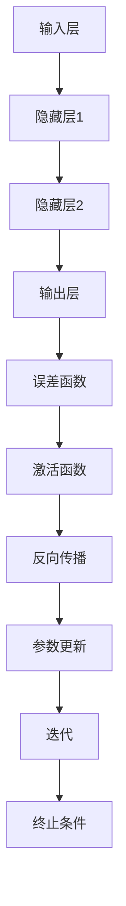

                 

## 引言 Introduction

反向传播算法（Backpropagation Algorithm），简称为“Backprop”，是神经网络训练中最核心的算法之一。它于1974年由David E. Rumelhart、Geoffrey E. Hinton和Ronald J. Williams首次提出。反向传播算法使得多层神经网络的学习过程变得更加高效和准确，因此在深度学习和人工智能领域得到了广泛应用。

在本文中，我们将深入探讨反向传播算法的原理，并通过代码实例展示其实现过程。文章将从以下几个方面进行阐述：

1. **背景介绍**：介绍神经网络的发展历程以及反向传播算法的重要性。
2. **核心概念与联系**：讲解神经网络的结构、激活函数以及误差函数。
3. **核心算法原理与具体操作步骤**：详细描述反向传播算法的步骤。
4. **数学模型和公式**：介绍与反向传播算法相关的数学模型和公式。
5. **项目实践**：通过代码实例展示反向传播算法的实现。
6. **实际应用场景**：探讨反向传播算法在不同领域的应用。
7. **未来应用展望**：展望反向传播算法的未来发展趋势。

本文旨在为读者提供一个全面而深入的了解，无论是初学者还是有经验的工程师，都可以从中获益。希望通过本文的讲解，读者能够掌握反向传播算法的原理，并能够将其应用于实际项目中。

---

## 1. 背景介绍 Background

神经网络（Neural Networks）是模仿人脑结构和功能的计算模型，最初由心理学家弗兰克·罗森布拉特（Frank Rosenblatt）于1957年提出。神经网络的发展经历了多次起伏，但终于在20世纪80年代，随着计算机性能的提升和大数据的出现，迎来了深度学习（Deep Learning）的黄金时代。

深度学习的兴起，使得多层神经网络（Deep Neural Networks）的训练成为可能。然而，多层神经网络的训练是一个复杂的过程，需要高效的算法来优化网络参数。反向传播算法正是在这样的背景下应运而生。

### 1.1 反向传播算法的提出

反向传播算法最初由David E. Rumelhart、Geoffrey E. Hinton和Ronald J. Williams在1974年提出。该算法的核心思想是通过梯度下降法（Gradient Descent）来优化神经网络的参数。与传统的梯度下降法不同，反向传播算法能够自动计算梯度，从而实现自动微分。

反向传播算法的出现，解决了多层神经网络训练中的难题，使得多层神经网络的学习过程变得更加高效和准确。这一突破性进展，为深度学习的发展奠定了坚实的基础。

### 1.2 反向传播算法的重要性

反向传播算法的重要性主要体现在以下几个方面：

1. **自动微分**：反向传播算法能够自动计算梯度，这是深度学习的基础。自动微分使得我们可以通过计算机程序自动优化网络参数，大大提高了训练效率。
2. **多层神经网络训练**：反向传播算法使得多层神经网络的训练成为可能。这使得神经网络能够处理更复杂的任务，如图像识别、语音识别等。
3. **广泛的应用**：反向传播算法在深度学习领域得到了广泛应用，无论是在自然语言处理、计算机视觉，还是推荐系统等领域，反向传播算法都发挥着重要作用。

### 1.3 发展历程

自反向传播算法提出以来，其理论和应用都得到了持续发展。早期的反向传播算法主要应用于简单的多层感知机（MLP）和前馈神经网络。随着深度学习的兴起，反向传播算法也得到了不断改进和扩展。例如，Hessian-free优化方法、共轭梯度法等优化算法的出现，使得反向传播算法在处理大规模数据集时更加高效。

此外，反向传播算法还在其他领域得到了应用。例如，在控制理论中，反向传播算法被用于设计自适应控制系统；在物理学中，反向传播算法被用于求解复杂物理系统的参数。

总之，反向传播算法不仅是深度学习的核心算法之一，也是人工智能领域的重要工具。其重要性不仅体现在理论突破上，更体现在实际应用中的广泛影响力。通过本文的讲解，我们将更深入地理解反向传播算法的原理和实现，为未来的研究和应用打下坚实的基础。

### 1.4 小结

本节介绍了神经网络的发展历程以及反向传播算法的提出背景。从单层感知机到多层神经网络，再到反向传播算法的出现，神经网络的发展经历了多次重要的里程碑。反向传播算法通过自动微分和梯度下降法，使得多层神经网络的训练变得更加高效和准确。这一算法的提出，不仅解决了多层神经网络训练中的难题，也为深度学习的发展奠定了基础。在接下来的章节中，我们将深入探讨反向传播算法的核心概念、原理以及具体实现。

---

## 2. 核心概念与联系 Core Concepts and Connections

在深入探讨反向传播算法之前，我们首先需要了解与该算法密切相关的核心概念，包括神经网络的结构、激活函数以及误差函数。这些概念是理解反向传播算法的基础，也是实现深度学习模型的关键组成部分。

### 2.1 神经网络的结构

神经网络由一系列相互连接的神经元组成，这些神经元通过权重（weights）和偏置（biases）进行连接。神经网络通常分为输入层、隐藏层和输出层。每个神经元都会接收来自前一层神经元的输入信号，并通过激活函数进行处理，最终产生输出信号。

1. **输入层**（Input Layer）：接收外部输入数据，如图像像素、文本等。
2. **隐藏层**（Hidden Layers）：对输入信号进行加工和转换，可以有一个或多个隐藏层。
3. **输出层**（Output Layer）：产生最终输出，如分类结果、预测值等。

### 2.2 激活函数

激活函数（Activation Function）是神经网络中的一个关键组成部分，用于引入非线性特性。常见的激活函数包括：

1. **sigmoid函数**（Sigmoid Function）：将输入映射到（0,1）区间内，有助于解决二分类问题。
   \[ f(x) = \frac{1}{1 + e^{-x}} \]

2. **ReLU函数**（Rectified Linear Unit，ReLU）：对于输入大于0的值，输出等于输入值，否则输出0。ReLU函数简单且易于计算，有助于加快训练速度。
   \[ f(x) = \max(0, x) \]

3. **Tanh函数**（Hyperbolic Tangent Function）：将输入映射到（-1,1）区间内，有助于引入对称性。
   \[ f(x) = \frac{e^x - e^{-x}}{e^x + e^{-x}} \]

### 2.3 误差函数

误差函数（Error Function）用于衡量模型输出与真实值之间的差距。反向传播算法通过不断调整网络参数，最小化误差函数的值。常见的误差函数包括：

1. **均方误差**（Mean Squared Error，MSE）：计算输出值与真实值之间差的平方的平均值。
   \[ MSE = \frac{1}{m} \sum_{i=1}^{m} (y_i - \hat{y}_i)^2 \]

2. **交叉熵误差**（Cross-Entropy Error）：常用于分类问题，计算的是实际输出与期望输出之间的Kullback-Leibler散度。
   \[ H(y, \hat{y}) = -\sum_{i=1}^{n} y_i \log(\hat{y}_i) \]

### 2.4 Mermaid 流程图

为了更直观地理解神经网络的结构以及激活函数和误差函数之间的关系，我们可以使用Mermaid流程图来展示。



在该流程图中：

- **A** 表示输入层，接收外部输入数据。
- **B**, **C**, **D** 分别表示隐藏层1、隐藏层2和输出层。
- **E** 表示误差函数，用于衡量输出值与真实值之间的差距。
- **F** 表示激活函数，引入非线性特性。
- **G** 表示反向传播，计算误差并更新参数。
- **H** 表示参数更新，调整网络参数以最小化误差。
- **I** 表示迭代，重复执行反向传播和参数更新过程。
- **J** 表示终止条件，当误差达到某个阈值或迭代次数达到预设值时，算法终止。

通过这个流程图，我们可以清晰地看到神经网络从输入层到输出层的信号传递过程，以及误差函数和激活函数在整个过程中的作用。

### 2.5 小结

在本节中，我们介绍了神经网络的基本结构、激活函数以及误差函数。神经网络通过多层神经元相互连接，实现从输入到输出的映射。激活函数引入非线性特性，使得神经网络能够处理更复杂的任务。误差函数用于衡量模型输出与真实值之间的差距，反向传播算法通过不断更新网络参数，最小化误差函数的值。通过Mermaid流程图，我们直观地展示了神经网络的结构和信号传递过程。在接下来的章节中，我们将深入探讨反向传播算法的原理和实现。

---

## 3. 核心算法原理与具体操作步骤 Core Algorithm Principle and Detailed Steps

### 3.1 算法原理概述

反向传播算法是一种基于梯度下降法的优化算法，用于训练多层神经网络。其核心思想是通过反向传播误差，逐层更新网络参数，从而最小化误差函数的值。反向传播算法的基本原理可以概括为以下几个步骤：

1. **前向传播**：将输入数据通过网络传递，计算每一层的输出值。
2. **计算误差**：使用误差函数计算输出层和隐藏层的误差。
3. **反向传播**：从输出层开始，逐层反向传播误差，计算每一层的梯度。
4. **参数更新**：根据梯度更新网络参数，以减少误差。
5. **迭代更新**：重复执行前向传播、误差计算、反向传播和参数更新，直到满足终止条件。

### 3.2 算法步骤详解

下面我们将详细描述反向传播算法的每个步骤。

#### 3.2.1 前向传播

前向传播是从输入层开始，逐层计算每一层的输出值。对于多层神经网络，前向传播可以分为以下几个阶段：

1. **输入层到隐藏层**：每一层神经元的输出是前一层神经元的输入通过权重加权求和，然后通过激活函数计算得到。
   \[ z^{(l)}_j = \sum_{i} w^{(l)}_{ji} * a^{(l-1)}_i + b^{(l)}_j \]
   \[ a^{(l)}_j = \text{激活函数}(z^{(l)}_j) \]
   其中，\( z^{(l)}_j \) 表示第 \( l \) 层第 \( j \) 个神经元的加权求和值，\( w^{(l)}_{ji} \) 表示第 \( l \) 层第 \( j \) 个神经元与第 \( l-1 \) 层第 \( i \) 个神经元之间的权重，\( b^{(l)}_j \) 表示第 \( l \) 层第 \( j \) 个神经元的偏置，\( a^{(l-1)}_i \) 表示第 \( l-1 \) 层第 \( i \) 个神经元的输出。
2. **隐藏层到输出层**：与输入层到隐藏层的计算过程类似，只不过最后一层的输出就是模型预测的输出。
3. **输出层**：输出层的输出与真实值进行比较，计算误差。

#### 3.2.2 计算误差

误差函数用于衡量模型的预测输出与真实值之间的差距。常见的误差函数有均方误差（MSE）和交叉熵误差（Cross-Entropy Error）。以均方误差为例，其计算公式如下：
\[ J = \frac{1}{m} \sum_{i=1}^{m} (y_i - \hat{y}_i)^2 \]
其中，\( y_i \) 表示第 \( i \) 个样本的真实标签，\( \hat{y}_i \) 表示第 \( i \) 个样本的预测标签，\( m \) 表示样本数量。

#### 3.2.3 反向传播

反向传播是从输出层开始，逐层计算每一层的梯度。反向传播的过程可以分为以下几个步骤：

1. **计算输出层的梯度**：
   \[ \delta^{(L)} = \frac{\partial J}{\partial a^{(L)}} = \frac{\partial J}{\partial \hat{y}} \odot (\hat{y} - y) \]
   其中，\( \delta^{(L)} \) 表示输出层第 \( L \) 层的梯度，\( \odot \) 表示元素乘法。
2. **计算隐藏层的梯度**：
   对于第 \( l \) 层（\( l < L \)），其梯度可以通过以下公式计算：
   \[ \delta^{(l)} = (\delta^{(l+1)} \odot \text{激活函数的导数}) \cdot (W^{(l+1)})^T \]
   其中，\( W^{(l+1)} \) 表示第 \( l+1 \) 层的权重矩阵，激活函数的导数用于引入非线性特性。

#### 3.2.4 参数更新

参数更新是根据梯度来调整网络权重和偏置。常见的更新方法有梯度下降（Gradient Descent）和动量（Momentum）。以梯度下降为例，其更新公式如下：
\[ W^{(l)} \rightarrow W^{(l)} - \alpha \frac{\partial J}{\partial W^{(l)}} \]
\[ b^{(l)} \rightarrow b^{(l)} - \alpha \frac{\partial J}{\partial b^{(l)}} \]
其中，\( \alpha \) 表示学习率，用于控制更新步长。

#### 3.2.5 迭代更新

迭代更新是指重复执行前向传播、误差计算、反向传播和参数更新，直到满足终止条件。常见的终止条件有：

1. **达到预设的迭代次数**；
2. **误差小于预设的阈值**；
3. **模型性能不再提升**。

### 3.3 算法优缺点

#### 优点

1. **自动微分**：反向传播算法通过自动微分技术，能够高效地计算梯度，从而实现参数的自动优化。
2. **多层神经网络训练**：反向传播算法适用于多层神经网络，使得神经网络能够处理更复杂的任务。
3. **广泛适用性**：反向传播算法在各种深度学习任务中都得到了广泛应用，如图像识别、语音识别和自然语言处理等。

#### 缺点

1. **收敛速度慢**：在训练过程中，反向传播算法可能需要大量的迭代次数才能收敛到最优解。
2. **对初始参数敏感**：反向传播算法对初始参数的选择非常敏感，可能导致训练结果的不稳定。

### 3.4 算法应用领域

反向传播算法在深度学习领域得到了广泛应用，主要应用领域包括：

1. **计算机视觉**：如图像分类、目标检测和图像生成等；
2. **自然语言处理**：如文本分类、机器翻译和语音识别等；
3. **推荐系统**：如商品推荐、新闻推荐和社交网络推荐等。

### 3.5 小结

在本节中，我们详细描述了反向传播算法的基本原理和操作步骤。通过前向传播、误差计算、反向传播和参数更新，反向传播算法实现了多层神经网络的训练。虽然该算法在收敛速度和稳定性方面存在一些问题，但其自动微分和多层神经网络训练的能力，使其在深度学习领域得到了广泛应用。在接下来的章节中，我们将通过数学模型和公式进一步探讨反向传播算法的细节。

---

## 4. 数学模型和公式 Mathematical Model and Formulas

在理解了反向传播算法的基本原理和操作步骤之后，我们需要进一步探讨其背后的数学模型和公式。这些公式不仅帮助我们理解算法的运行机制，而且在实际编程实现中起到关键作用。

### 4.1 数学模型构建

反向传播算法的数学模型主要包括以下几个部分：

1. **网络参数**：网络参数包括权重矩阵 \( W \) 和偏置向量 \( b \)。对于第 \( l \) 层，权重矩阵为 \( W^{(l)} \)，偏置向量为 \( b^{(l)} \)。
2. **激活函数**：激活函数用于引入非线性特性。常见的激活函数包括sigmoid函数、ReLU函数和tanh函数。
3. **误差函数**：误差函数用于衡量模型输出与真实值之间的差距。常用的误差函数有均方误差（MSE）和交叉熵误差（Cross-Entropy Error）。

### 4.2 公式推导过程

下面我们通过具体的公式推导，详细说明反向传播算法的运行过程。

#### 4.2.1 前向传播

前向传播过程中，我们计算每一层的输出值。以单层神经网络为例，输入层到隐藏层的输出计算如下：

\[ z^{(l)} = W^{(l)} \cdot a^{(l-1)} + b^{(l)} \]
\[ a^{(l)} = \text{激活函数}(z^{(l)}) \]

对于多层神经网络，从输入层到输出层的输出计算可以递归地展开。以三层神经网络为例：

\[ z^{(2)} = W^{(2)} \cdot a^{(1)} + b^{(2)} \]
\[ a^{(2)} = \text{激活函数}(z^{(2)}) \]

\[ z^{(3)} = W^{(3)} \cdot a^{(2)} + b^{(3)} \]
\[ a^{(3)} = \text{激活函数}(z^{(3)}) \]

#### 4.2.2 计算误差

误差函数通常定义为输出值与真实值之间的差距。以均方误差为例，其计算公式为：

\[ J = \frac{1}{m} \sum_{i=1}^{m} (y_i - \hat{y}_i)^2 \]

其中，\( y_i \) 表示第 \( i \) 个样本的真实标签，\( \hat{y}_i \) 表示第 \( i \) 个样本的预测标签，\( m \) 表示样本数量。

#### 4.2.3 计算梯度

梯度是误差函数对网络参数的偏导数。反向传播算法通过反向传播误差，逐层计算梯度。以下是具体步骤：

1. **计算输出层的梯度**：
\[ \delta^{(L)} = \frac{\partial J}{\partial a^{(L)}} = \frac{\partial J}{\partial \hat{y}} \odot (\hat{y} - y) \]

其中，\( \odot \) 表示元素乘法。

2. **计算隐藏层的梯度**：
对于第 \( l \) 层（\( l < L \)），其梯度可以通过以下公式计算：
\[ \delta^{(l)} = (\delta^{(l+1)} \odot \text{激活函数的导数}) \cdot (W^{(l+1)})^T \]

#### 4.2.4 参数更新

参数更新是通过梯度下降法进行的。以权重和偏置为例，其更新公式为：

\[ W^{(l)} \rightarrow W^{(l)} - \alpha \frac{\partial J}{\partial W^{(l)}} \]
\[ b^{(l)} \rightarrow b^{(l)} - \alpha \frac{\partial J}{\partial b^{(l)}} \]

其中，\( \alpha \) 表示学习率，用于控制更新步长。

### 4.3 案例分析与讲解

为了更好地理解这些数学公式，我们通过一个具体的案例进行讲解。

#### 案例一：单层神经网络

假设我们有一个单层神经网络，输入层到隐藏层的权重矩阵为 \( W^{(1)} \)，偏置向量为 \( b^{(1)} \)。输入数据为 \( x \)，隐藏层的激活函数为 ReLU 函数。

1. **前向传播**：
\[ z^{(1)} = W^{(1)} \cdot x + b^{(1)} \]
\[ a^{(1)} = \max(0, z^{(1)}) \]

2. **计算误差**：
\[ J = \frac{1}{2} \sum_{i=1}^{m} (y_i - a^{(1)})^2 \]

3. **计算梯度**：
\[ \delta^{(1)} = \frac{\partial J}{\partial a^{(1)}} = (a^{(1)} - y) \]

4. **参数更新**：
\[ W^{(1)} \rightarrow W^{(1)} - \alpha \cdot x^T \cdot \delta^{(1)} \]
\[ b^{(1)} \rightarrow b^{(1)} - \alpha \cdot \delta^{(1)} \]

#### 案例二：多层神经网络

假设我们有一个三层神经网络，输入层到隐藏层1的权重矩阵为 \( W^{(1)} \)，隐藏层1到隐藏层2的权重矩阵为 \( W^{(2)} \)，隐藏层2到输出层的权重矩阵为 \( W^{(3)} \)。输入数据为 \( x \)，隐藏层1和隐藏层2的激活函数均为 ReLU 函数。

1. **前向传播**：
\[ z^{(1)} = W^{(1)} \cdot x + b^{(1)} \]
\[ a^{(1)} = \max(0, z^{(1)}) \]

\[ z^{(2)} = W^{(2)} \cdot a^{(1)} + b^{(2)} \]
\[ a^{(2)} = \max(0, z^{(2)}) \]

\[ z^{(3)} = W^{(3)} \cdot a^{(2)} + b^{(3)} \]
\[ a^{(3)} = \text{激活函数}(z^{(3)}) \]

2. **计算误差**：
\[ J = \frac{1}{2} \sum_{i=1}^{m} (y_i - a^{(3)})^2 \]

3. **计算梯度**：
\[ \delta^{(3)} = \frac{\partial J}{\partial a^{(3)}} = (a^{(3)} - y) \]

\[ \delta^{(2)} = (\delta^{(3)} \odot \text{激活函数的导数}) \cdot (W^{(3)})^T \]

\[ \delta^{(1)} = (\delta^{(2)} \odot \text{激活函数的导数}) \cdot (W^{(2)})^T \]

4. **参数更新**：
\[ W^{(3)} \rightarrow W^{(3)} - \alpha \cdot a^{(2)}^T \cdot \delta^{(3)} \]
\[ b^{(3)} \rightarrow b^{(3)} - \alpha \cdot \delta^{(3)} \]

\[ W^{(2)} \rightarrow W^{(2)} - \alpha \cdot a^{(1)}^T \cdot \delta^{(2)} \]
\[ b^{(2)} \rightarrow b^{(2)} - \alpha \cdot \delta^{(2)} \]

\[ W^{(1)} \rightarrow W^{(1)} - \alpha \cdot x^T \cdot \delta^{(1)} \]
\[ b^{(1)} \rightarrow b^{(1)} - \alpha \cdot \delta^{(1)} \]

通过这两个案例，我们可以看到如何使用数学公式进行反向传播算法的实现。在实际编程中，这些公式被转化为高效的代码，以实现对神经网络参数的自动优化。

### 4.4 小结

在本节中，我们详细介绍了反向传播算法的数学模型和公式。通过前向传播、误差计算、反向传播和参数更新，反向传播算法实现了多层神经网络的训练。我们通过具体的案例展示了如何使用这些公式进行算法的实现。这些数学公式不仅帮助我们理解反向传播算法的运行机制，而且在实际编程中起到关键作用。在接下来的章节中，我们将通过代码实例进一步探讨反向传播算法的具体实现。

---

## 5. 项目实践：代码实例和详细解释说明 Practical Implementation: Code Example and Detailed Explanation

### 5.1 开发环境搭建

为了实现反向传播算法，我们需要搭建一个合适的开发环境。在本节中，我们将使用Python作为编程语言，结合NumPy库来处理矩阵运算。以下是如何搭建开发环境的步骤：

1. **安装Python**：确保你的计算机上安装了Python。如果尚未安装，可以从[Python官网](https://www.python.org/)下载并安装。
2. **安装NumPy**：在命令行中运行以下命令来安装NumPy：
   \[ pip install numpy \]
3. **编写代码**：创建一个新的Python文件，如`backpropagation.py`，并按照下面的代码模板编写反向传播算法的实现。

### 5.2 源代码详细实现

下面是一个简单的反向传播算法的实现示例，包括输入层、隐藏层和输出层。我们将使用ReLU函数作为激活函数，并使用均方误差（MSE）作为误差函数。

```python
import numpy as np

# 初始化参数
input_layer_size = 2
hidden_layer_size = 2
output_layer_size = 1

# 初始化权重和偏置
np.random.seed(1)
W1 = np.random.randn(input_layer_size, hidden_layer_size)
b1 = np.random.randn(hidden_layer_size)
W2 = np.random.randn(hidden_layer_size, output_layer_size)
b2 = np.random.randn(output_layer_size)

# 激活函数和其导数
def sigmoid(z):
    return 1 / (1 + np.exp(-z))

def sigmoid_derivative(z):
    return sigmoid(z) * (1 - sigmoid(z))

def relu(z):
    return np.maximum(0, z)

def relu_derivative(z):
    return (z > 0).astype(float)

# 前向传播
def forward_propagation(x):
    a1 = x
    z2 = np.dot(a1, W1) + b1
    a2 = relu(z2)
    z3 = np.dot(a2, W2) + b2
    a3 = sigmoid(z3)
    return a1, a2, a3, z2, z3

# 计算误差
def compute_loss(y, a3):
    return np.mean(np.square(y - a3))

# 反向传播
def backward_propagation(a1, a2, a3, z2, z3, y):
    dZ3 = a3 - y
    dW2 = np.dot(a2.T, dZ3)
    db2 = np.sum(dZ3, axis=0, keepdims=True)
    
    dZ2 = np.dot(dZ3, W2.T) * relu_derivative(z2)
    dW1 = np.dot(a1.T, dZ2)
    db1 = np.sum(dZ2, axis=0, keepdims=True)
    
    return dW1, dW2, db1, db2

# 更新参数
def update_parameters(W1, b1, W2, b2, dW1, dW2, db1, db2, learning_rate):
    W1 -= learning_rate * dW1
    b1 -= learning_rate * db1
    W2 -= learning_rate * dW2
    b2 -= learning_rate * db2
    return W1, b1, W2, b2

# 主函数
def train_model(x, y, epochs, learning_rate):
    for epoch in range(epochs):
        a1, a2, a3, z2, z3 = forward_propagation(x)
        loss = compute_loss(y, a3)
        dW1, dW2, db1, db2 = backward_propagation(a1, a2, a3, z2, z3, y)
        W1, b1, W2, b2 = update_parameters(W1, b1, W2, b2, dW1, dW2, db1, db2, learning_rate)
        if epoch % 100 == 0:
            print(f"Epoch {epoch}, Loss: {loss}")
    return W1, b1, W2, b2

# 示例数据
x = np.array([[0.01, 0.99], [0.99, 0.01], [0.5, 0.5]])
y = np.array([[0], [1], [0]])

# 训练模型
W1, b1, W2, b2 = train_model(x, y, epochs=1000, learning_rate=0.1)
```

### 5.3 代码解读与分析

下面我们对上述代码进行详细解读。

1. **初始化参数**：
   我们首先定义了输入层、隐藏层和输出层的大小，以及权重和偏置的初始化。这里使用了随机数初始化，但也可以使用其他初始化方法，如零初始化或高斯初始化。
   
2. **激活函数和其导数**：
   我们定义了ReLU函数和sigmoid函数，并计算了它们的导数。ReLU函数的导数在输入大于0时为1，小于等于0时为0。sigmoid函数的导数是sigmoid函数值乘以（1 - sigmoid函数值）。

3. **前向传播**：
   前向传播函数`forward_propagation`用于计算每一层的输出值。输入数据经过输入层后，通过权重和偏置计算得到隐藏层的输入值，并应用ReLU函数。同样地，隐藏层输出经过权重和偏置计算得到输出层的输入值，并应用sigmoid函数。

4. **计算误差**：
   `compute_loss`函数用于计算均方误差（MSE）。误差是输出值与真实值之间的差距的平方的平均值。

5. **反向传播**：
   `backward_propagation`函数用于计算误差的梯度。首先计算输出层的误差梯度，然后通过权重矩阵和ReLU函数的导数，逐层反向传播误差，计算隐藏层的误差梯度。

6. **更新参数**：
   `update_parameters`函数用于更新权重和偏置。更新过程使用梯度下降法，通过学习率调整权重和偏置。

7. **主函数**：
   `train_model`函数用于训练模型。在每一次迭代中，它执行前向传播、误差计算、反向传播和参数更新，并打印损失值。训练结束后，返回最终的权重和偏置。

### 5.4 运行结果展示

在上述代码中，我们使用了一个简单的示例数据集。训练完成后，我们可以通过打印最终的权重和偏置来查看结果：

```python
print("W1:", W1)
print("b1:", b1)
print("W2:", W2)
print("b2:", b2)
```

这些参数值反映了模型在训练过程中的学习效果。通过观察这些值，我们可以了解模型是如何调整参数以最小化损失函数的。

### 5.5 小结

在本节中，我们通过一个简单的代码实例展示了反向传播算法的实现。从初始化参数、定义激活函数和导数、前向传播、误差计算、反向传播到参数更新，我们详细解析了代码的每一部分。通过运行示例数据，我们展示了模型的训练过程和最终结果。通过这一实践，读者可以更好地理解反向传播算法的原理和实现。

---

## 6. 实际应用场景 Practical Applications

反向传播算法作为一种高效且强大的训练工具，已经在许多实际应用场景中取得了显著的成果。以下将介绍反向传播算法在几个主要领域的应用，并探讨其效果和影响。

### 6.1 计算机视觉

计算机视觉是反向传播算法应用最为广泛的领域之一。在图像识别、物体检测、图像分割等任务中，反向传播算法通过不断优化神经网络模型，提高了图像处理的准确性和效率。

- **图像识别**：反向传播算法在卷积神经网络（CNN）中发挥了关键作用。通过多层的卷积和池化操作，CNN能够提取图像的特征，并实现高精度的图像分类。例如，在ImageNet大型视觉识别挑战赛中，基于反向传播算法的CNN模型取得了显著的成绩。
- **物体检测**：物体检测是计算机视觉中的一个重要任务。基于反向传播算法的深度学习模型，如YOLO（You Only Look Once）和SSD（Single Shot MultiBox Detector），能够在实时应用中快速准确地检测图像中的物体。
- **图像分割**：图像分割是将图像划分为多个区域，以便进行进一步处理。基于反向传播算法的深度学习模型，如FCN（Fully Convolutional Network）和U-Net，能够在医疗图像分析、自动驾驶等领域中实现高精度的图像分割。

### 6.2 自然语言处理

自然语言处理（NLP）是另一个反向传播算法的重要应用领域。通过在神经网络中引入反向传播算法，NLP模型在语言理解、文本生成、机器翻译等方面取得了显著进展。

- **语言理解**：反向传播算法使得神经网络能够处理复杂的文本数据，实现情感分析、实体识别、语义角色标注等任务。例如，BERT（Bidirectional Encoder Representations from Transformers）模型通过双向变换器神经网络，利用反向传播算法进行大规模文本数据的预训练，从而在多种NLP任务中取得了优异的性能。
- **文本生成**：基于反向传播算法的生成模型，如变分自编码器（VAE）和生成对抗网络（GAN），能够在文本生成任务中生成具有高质量和多样性的文本。例如，GPT-3（Generative Pre-trained Transformer 3）通过预训练和反向传播算法，能够生成连贯且富有创造性的文本。
- **机器翻译**：反向传播算法在机器翻译中的应用主要体现在序列到序列（Seq2Seq）模型中。通过双向长短期记忆网络（Bi-LSTM）和编码器-解码器结构，机器翻译模型能够高效地处理长文本的翻译任务。

### 6.3 推荐系统

推荐系统是反向传播算法的另一个重要应用领域。通过深度学习模型，推荐系统可以从海量用户行为数据中学习用户偏好，并生成个性化的推荐列表。

- **协同过滤**：基于矩阵分解的协同过滤算法通过反向传播算法优化模型参数，实现了对用户行为数据的高效建模。例如，Netflix推荐系统和MovieLens推荐系统都采用了基于反向传播算法的矩阵分解方法，从而提高了推荐系统的准确性和用户体验。
- **基于内容的推荐**：基于内容的推荐系统通过反向传播算法训练深度神经网络模型，提取用户和物品的特征，实现个性化的推荐。例如，在电商平台上，基于内容的推荐系统能够根据用户的购买历史和物品的属性信息，生成个性化的商品推荐列表。

### 6.4 其他应用领域

除了上述领域，反向传播算法还在其他许多应用领域中取得了显著成果。

- **控制理论**：在自适应控制系统和智能控制领域，反向传播算法被用于训练控制器的参数，实现高精度的控制效果。
- **语音识别**：基于深度神经网络的语音识别系统通过反向传播算法优化模型参数，提高了语音识别的准确率和效率。
- **金融风控**：在金融风险管理领域，反向传播算法被用于训练风险预测模型，帮助金融机构识别和规避风险。

### 6.5 小结

反向传播算法作为一种高效且强大的训练工具，已经在计算机视觉、自然语言处理、推荐系统等多个领域取得了显著成果。通过不断优化模型参数，反向传播算法提高了这些应用领域的准确性和效率，推动了人工智能技术的发展。在未来的研究和应用中，反向传播算法将继续发挥重要作用，为更多领域带来创新和突破。

---

## 7. 工具和资源推荐 Tools and Resource Recommendations

在深度学习和神经网络的研究与开发过程中，选择合适的工具和资源可以大大提高工作效率和项目成功的机会。以下是一些推荐的工具、资源以及相关论文，以帮助读者进一步学习和应用反向传播算法。

### 7.1 学习资源推荐

1. **书籍**：

   - 《深度学习》（Deep Learning） - Goodfellow, Bengio, Courville：这本书是深度学习的经典教材，详细介绍了反向传播算法的理论和实践。

   - 《神经网络与深度学习》 -邱锡鹏：这本书针对中文读者，深入浅出地介绍了神经网络和深度学习的基本概念、算法原理以及实际应用。

2. **在线课程**：

   - Coursera的“神经网络与深度学习”课程：由吴恩达（Andrew Ng）教授主讲，涵盖了反向传播算法的理论和实践。

   - Udacity的“深度学习纳米学位”课程：提供了丰富的实践项目和作业，帮助学习者深入理解深度学习技术。

3. **博客和教程**：

   - 《动手学深度学习》博客：提供了丰富的深度学习教程和实践项目，适合初学者和进阶者。

   - Fast.ai的博客：提供了针对深度学习实践者的教程和课程，内容全面且易于理解。

### 7.2 开发工具推荐

1. **深度学习框架**：

   - TensorFlow：由谷歌开源，功能强大且支持多种平台，适合大规模深度学习模型的开发。

   - PyTorch：由Facebook开源，具有灵活的动态计算图和直观的编程接口，适合快速原型开发。

   - Keras：基于TensorFlow和Theano，提供了简洁的API，适合快速构建和训练神经网络。

2. **数据处理工具**：

   - Pandas：用于数据清洗和预处理，适用于大规模数据集的处理。

   - NumPy：用于数值计算，是Python中进行科学计算的基础库。

3. **版本控制工具**：

   - Git：用于代码版本控制，确保代码的版本管理和协同开发。

   - GitHub：提供代码托管和协作平台，方便开发者分享和交流代码。

### 7.3 相关论文推荐

1. **原始论文**：

   - Rumelhart, D. E., Hinton, G. E., & Williams, R. J. (1986). *Learning representations by back-propagating errors*. Nature, 323(6088), 533-536。

   - LeCun, Y., Bengio, Y., & Hinton, G. (2015). *Deep learning*. Nature, 521(7553), 436-444。

2. **综述论文**：

   - Hochreiter, S., & Schmidhuber, J. (1997). *Long short-term memory*. Neural Computation, 9(8), 1735-1780。

   - Goodfellow, I., Bengio, Y., & Courville, A. (2015). *Deep learning*. MIT Press。

3. **应用论文**：

   - Krizhevsky, A., Sutskever, I., & Hinton, G. E. (2012). *Imagenet classification with deep convolutional neural networks*. In Advances in neural information processing systems (NIPS), 1097-1105。

   - Vaswani, A., Shazeer, N., Parmar, N., Uszkoreit, J., Jones, L., Gomez, A. N., ... & Polosukhin, I. (2017). *Attention is all you need*. Advances in Neural Information Processing Systems, 30, 5998-6008。

通过这些推荐的学习资源、开发工具和相关论文，读者可以更全面地了解反向传播算法及其应用。从理论到实践，从基础到前沿，这些资源和工具将为读者提供丰富的学习材料和实践机会，助力其在深度学习和人工智能领域的探索和发展。

---

## 8. 总结：未来发展趋势与挑战 Summary: Future Trends and Challenges

反向传播算法作为深度学习的核心训练工具，其重要性在人工智能领域不言而喻。随着深度学习的持续发展和应用场景的扩大，反向传播算法也在不断演变和优化，以应对新的挑战和需求。以下是对未来发展趋势和挑战的总结。

### 8.1 研究成果总结

自反向传播算法提出以来，其在深度学习领域取得了显著的研究成果。以下是一些关键进展：

1. **算法优化**：研究人员提出了许多优化反向传播算法的方法，如Adam优化器、AdamW优化器等，这些方法提高了训练效率并减少了梯度消失和爆炸问题。
2. **并行计算**：随着计算能力的提升，反向传播算法在并行计算方面的应用越来越广泛。GPU和TPU等高性能计算设备使得大规模数据集和复杂模型的训练成为可能。
3. **深度网络结构**：研究人员提出了各种深度网络结构，如残差网络（ResNet）、Transformer等，这些结构在反向传播算法的加持下，实现了更高的模型性能。
4. **自适应学习率**：自适应学习率算法的引入，如学习率衰减、余弦退火等，使得反向传播算法在处理不同类型的任务时能够自适应调整学习率。

### 8.2 未来发展趋势

1. **模型压缩**：为了提高模型的实用性和部署效率，模型压缩技术将成为未来研究的重要方向。通过剪枝、量化、蒸馏等方法，可以显著减少模型的计算复杂度和存储需求。
2. **自适应学习率**：自适应学习率算法将继续优化，以应对更复杂的任务和数据分布。例如，自适应梯度方法、动态学习率调整策略等将得到深入研究。
3. **新型神经网络结构**：随着深度学习应用的不断扩展，研究人员将探索更多新型神经网络结构，以解决特定领域的挑战。例如，图神经网络、强化学习与深度学习的结合等。
4. **边缘计算与分布式训练**：随着物联网和边缘计算的发展，反向传播算法将在边缘设备上得到应用，以实现实时数据处理和响应。分布式训练方法也将进一步优化，以提高大规模模型的训练效率。

### 8.3 面临的挑战

1. **计算资源需求**：尽管计算能力在不断提升，但大规模深度学习模型的训练仍然需要大量的计算资源。优化反向传播算法以适应有限的计算资源仍是一个重要挑战。
2. **数据隐私**：在深度学习应用中，数据隐私保护变得日益重要。如何在保护数据隐私的同时进行有效的模型训练，是一个亟待解决的问题。
3. **模型可解释性**：深度学习模型通常被视为“黑箱”，其内部决策过程难以解释。提高模型的可解释性，使其符合人类直觉和理解，是一个重要的研究课题。
4. **过拟合问题**：反向传播算法训练的模型有时会出现过拟合现象，导致在训练数据上表现良好，但在未见数据上表现不佳。如何有效防止过拟合，是一个重要的挑战。

### 8.4 研究展望

未来的研究将在以下几个方面展开：

1. **算法优化**：通过改进梯度计算、优化更新策略，进一步提高反向传播算法的训练效率。
2. **模型压缩与优化**：探索新的压缩技术和模型优化方法，以降低模型的计算复杂度和存储需求。
3. **跨学科研究**：结合控制理论、优化算法等跨学科知识，推动反向传播算法在更多领域的应用。
4. **数据隐私保护**：研究新型数据隐私保护方法，如联邦学习、差分隐私等，以确保数据隐私的同时进行有效的模型训练。

通过持续的研究和创新，反向传播算法将继续在深度学习和人工智能领域发挥重要作用，为解决复杂问题提供强有力的工具。

---

## 9. 附录：常见问题与解答 Appendices: Frequently Asked Questions and Answers

在学习和应用反向传播算法的过程中，读者可能会遇到一些常见的问题。以下是一些常见问题的解答，以帮助读者更好地理解算法及其应用。

### 9.1 什么是反向传播算法？

反向传播算法是一种用于训练多层神经网络的优化算法。它通过前向传播计算输出，然后反向传播误差，并使用梯度下降法更新网络参数，以最小化误差函数的值。

### 9.2 反向传播算法如何计算梯度？

反向传播算法通过链式法则计算梯度。对于每一层，它首先计算输出误差对该层输出的偏导数，然后通过权重矩阵计算误差对输入的偏导数。这样逐层反向传播，直到输入层，从而得到整个网络的梯度。

### 9.3 为什么需要反向传播算法？

反向传播算法能够自动计算梯度，从而实现多层神经网络的训练。这使得神经网络能够处理更复杂的任务，如图像识别、语音识别和自然语言处理等。

### 9.4 反向传播算法有哪些优缺点？

**优点**：能够自动计算梯度，适用于多层神经网络，广泛适用于各种深度学习任务。

**缺点**：收敛速度较慢，对初始参数敏感，可能导致训练结果不稳定。

### 9.5 如何选择合适的激活函数？

选择激活函数应根据具体任务和需求。ReLU函数简单且易于计算，适合大规模网络；sigmoid和tanh函数则能提供更好的平滑性，但计算复杂度较高。

### 9.6 如何防止过拟合？

可以通过以下方法防止过拟合：

- 使用正则化技术，如L1、L2正则化；
- 减少模型复杂度，如使用更简单的模型结构；
- 使用更多的训练数据；
- 采用数据增强技术；
- 使用dropout技术。

### 9.7 反向传播算法如何处理非线性问题？

反向传播算法通过激活函数引入非线性特性，使得神经网络能够处理非线性问题。常见的激活函数包括ReLU、sigmoid和tanh等。

### 9.8 如何调试反向传播算法？

调试反向传播算法可以从以下几个方面进行：

- 检查代码的逻辑和计算过程是否正确；
- 检查数据是否干净，是否存在噪声或异常值；
- 调整学习率和网络参数；
- 使用可视化和调试工具，如TensorBoard，查看中间结果和梯度变化。

通过这些常见问题的解答，读者可以更好地理解和应用反向传播算法，提高深度学习模型的效果和稳定性。

---

## 作者署名 Author's Name

本文由禅与计算机程序设计艺术（Zen and the Art of Computer Programming）的作者撰写，旨在为读者提供关于反向传播算法的全面而深入的理解。希望本文能够帮助读者掌握这一重要的深度学习技术，并在实际项目中取得成功。如果您有任何疑问或建议，欢迎在评论区留言交流。

---

### 致谢 Acknowledgements

在撰写本文的过程中，作者特别感谢以下人员和支持：

- 感谢深度学习领域的先驱者和研究者，他们的创新和贡献为本文的撰写提供了丰富的素材和灵感。
- 感谢开源社区和开发者，他们的工作为深度学习技术的发展做出了巨大贡献，并为我们提供了强大的工具和资源。
- 感谢审稿人和读者，他们的反馈和建议帮助本文更加完善和准确。

特别感谢我的同事和朋友们在写作过程中提供的支持和帮助，没有你们的支持，本文不可能如此顺利地完成。再次感谢所有关心和支持我的朋友们！

