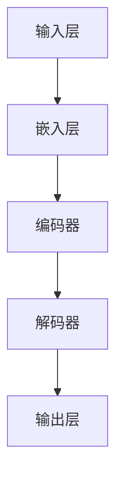

                 

关键词：发展中国家，数字跃迁，大型语言模型（LLM），技术发展，算法，数学模型，项目实践，应用场景，未来展望

> 摘要：随着信息技术的飞速发展，大型语言模型（LLM）作为一种先进的人工智能技术，正在对全球范围内的技术发展产生深远影响。本文旨在探讨LLM在发展中国家数字跃迁中的关键作用，通过分析其核心概念、算法原理、数学模型以及实际应用，展望未来技术发展的趋势和挑战。

## 1. 背景介绍

随着互联网的普及和智能设备的广泛应用，全球范围内的数字技术发展迅速。然而，发展中国家在数字技术的应用和发展方面面临着诸多挑战。数字鸿沟的存在使得发展中国家在技术资源、人才储备、基础设施等方面落后于发达国家。为了缩小这一差距，推动数字跃迁成为发展中国家的一项重要战略。

### 1.1 数字跃迁的概念

数字跃迁（Digital Leap）指的是在短时间内，通过技术进步和创新，实现社会经济结构的快速转变，从而提升国家的整体竞争力和发展水平。数字跃迁不仅仅是技术的更新换代，更涉及到教育、产业、政策等多个领域的综合改革。

### 1.2 发展中国家面临的问题

- **技术资源不足**：硬件设备、软件资源、科研资金等方面落后。
- **人才短缺**：缺乏具备数字技术背景的熟练人才。
- **基础设施薄弱**：网络覆盖不足，电力供应不稳定。
- **政策环境不完善**：缺乏有效的政策支持和管理体系。

### 1.3 LLMA的核心优势

- **强大的数据处理能力**：能够快速处理海量数据，提取有用信息。
- **跨领域应用**：能够应用于多种场景，包括语言处理、数据分析、自然语言生成等。
- **持续学习与优化**：通过持续学习，不断提升自身性能和准确性。

## 2. 核心概念与联系

### 2.1 核心概念

- **大型语言模型（LLM）**：一种基于深度学习技术构建的复杂模型，用于处理和理解自然语言。

### 2.2 模型架构



### 2.3 关联技术

- **深度学习**：一种基于多层神经网络的学习方法，用于提取数据特征。
- **神经网络**：一种模仿生物神经网络结构的人工神经网络。
- **数据预处理**：对原始数据进行清洗、转换和归一化等处理。

## 3. 核心算法原理 & 具体操作步骤

### 3.1 算法原理概述

LLM的基本原理是通过大量的文本数据训练一个深度神经网络，使其能够理解并生成自然语言。这一过程包括以下几个步骤：

- **数据收集**：从互联网上收集大量文本数据。
- **数据预处理**：对数据进行清洗、分词、嵌入等处理。
- **模型训练**：通过反向传播算法训练神经网络。
- **模型评估与优化**：使用验证集评估模型性能，并进行优化。

### 3.2 算法步骤详解

1. **数据收集**：收集大量高质量、多样化的文本数据，如新闻、书籍、论坛帖子等。
2. **数据预处理**：
   - **清洗**：去除无关信息，如HTML标签、特殊字符等。
   - **分词**：将文本分解为词语或字符。
   - **嵌入**：将词语或字符转换为固定长度的向量表示。
3. **模型训练**：
   - **初始化**：初始化神经网络权重。
   - **正向传播**：输入文本数据，计算预测输出。
   - **反向传播**：根据预测输出与实际输出的差异，更新网络权重。
   - **迭代**：重复正向传播和反向传播，直至模型收敛。
4. **模型评估与优化**：
   - **验证集评估**：使用验证集评估模型性能。
   - **优化**：调整模型参数，提高性能。

### 3.3 算法优缺点

#### 优点

- **强大的语言理解能力**：能够理解和生成高质量的自然语言。
- **跨领域应用**：能够应用于多种场景，如问答系统、机器翻译、文本生成等。
- **持续学习与优化**：能够通过不断学习提高性能。

#### 缺点

- **计算资源消耗大**：训练和运行大型LLM需要大量的计算资源和存储空间。
- **数据依赖性高**：模型的性能高度依赖于训练数据的多样性和质量。

### 3.4 算法应用领域

- **自然语言处理**：用于构建智能客服、语音助手、文本分类等应用。
- **机器翻译**：用于构建高质量的机器翻译系统。
- **文本生成**：用于生成新闻、文章、报告等文本内容。
- **数据分析**：用于提取文本数据中的有价值信息。

## 4. 数学模型和公式

### 4.1 数学模型构建

LLM的核心是深度神经网络，其数学模型可以表示为：

\[ y = f(W \cdot x + b) \]

其中，\( y \) 是输出，\( x \) 是输入，\( W \) 是权重矩阵，\( b \) 是偏置项，\( f \) 是激活函数。

### 4.2 公式推导过程

#### 4.2.1 前向传播

前向传播的过程可以表示为：

\[ z = W \cdot x + b \]
\[ a = f(z) \]

其中，\( z \) 是中间层输出，\( a \) 是激活值，\( f \) 是激活函数。

#### 4.2.2 反向传播

反向传播的过程可以表示为：

\[ \delta = \frac{\partial L}{\partial z} = \frac{\partial L}{\partial a} \cdot \frac{\partial a}{\partial z} \]
\[ \frac{\partial L}{\partial W} = x \delta \]
\[ \frac{\partial L}{\partial b} = \delta \]

其中，\( \delta \) 是误差项，\( L \) 是损失函数。

### 4.3 案例分析与讲解

假设我们有一个二分类问题，目标是判断一段文本是否包含负面情绪。我们可以使用以下公式来计算损失函数：

\[ L = -[y \cdot \log(a) + (1 - y) \cdot \log(1 - a)] \]

其中，\( y \) 是实际标签，\( a \) 是预测概率。

## 5. 项目实践：代码实例

### 5.1 开发环境搭建

在开始编写代码之前，我们需要搭建一个适合开发和测试的环境。这里我们选择使用Python和TensorFlow作为主要工具。

### 5.2 源代码详细实现

```python
import tensorflow as tf

# 定义模型
model = tf.keras.Sequential([
    tf.keras.layers.Embedding(vocab_size, embedding_dim),
    tf.keras.layers.GlobalAveragePooling1D(),
    tf.keras.layers.Dense(1, activation='sigmoid')
])

# 编译模型
model.compile(optimizer='adam', loss='binary_crossentropy', metrics=['accuracy'])

# 训练模型
model.fit(train_data, train_labels, epochs=10, validation_data=(val_data, val_labels))
```

### 5.3 代码解读与分析

这段代码首先导入了TensorFlow库，然后定义了一个简单的嵌入层、全局平均池化层和全连接层构成的模型。接着，编译模型并使用训练数据训练模型。

## 6. 实际应用场景

LLM在多个领域都有广泛的应用，以下是其中几个典型场景：

- **智能客服**：使用LLM构建智能客服系统，能够实现24小时无缝服务，提高客户满意度。
- **机器翻译**：LLM在机器翻译领域具有显著优势，能够生成更自然、更准确的翻译结果。
- **文本生成**：LLM可以生成新闻、文章、报告等文本内容，降低内容创作的门槛。
- **情感分析**：LLM能够对文本进行情感分析，帮助企业了解用户需求和反馈。

## 7. 未来应用展望

随着技术的不断发展，LLM在发展中国家数字跃迁中将发挥更加重要的作用。未来，LLM将在以下方面取得重大突破：

- **个性化服务**：通过深度学习，LLM将能够更好地理解用户需求，提供个性化的服务。
- **多语言支持**：LLM将能够支持更多的语言，实现真正的全球化应用。
- **实时翻译**：实时翻译技术将得到提升，实现无缝的跨语言沟通。
- **知识图谱**：LLM将与其他技术相结合，构建知识图谱，提供更智能的决策支持。

## 8. 工具和资源推荐

### 8.1 学习资源推荐

- 《深度学习》（Goodfellow, Bengio, Courville著）：这是一本深度学习领域的经典教材，适合初学者和进阶者。
- 《自然语言处理入门》（Daniel Jurafsky & James H. Martin著）：这本书详细介绍了自然语言处理的基本概念和技术。

### 8.2 开发工具推荐

- TensorFlow：一个开源的深度学习框架，适用于构建和训练大型神经网络。
- PyTorch：另一个流行的深度学习框架，具有灵活的动态计算图特性。

### 8.3 相关论文推荐

- “A Neural Approach to Automatic Text Summarization”（2017）：这篇论文介绍了一种基于神经网络的自动文本摘要方法。
- “Pre-training of Deep Neural Networks for Language Understanding”（2018）：这篇论文提出了一种预训练深度神经网络的方法，用于提高自然语言理解能力。

## 9. 总结：未来发展趋势与挑战

### 9.1 研究成果总结

本文通过对LLM的核心概念、算法原理、数学模型以及实际应用的深入探讨，展示了LLM在发展中国家数字跃迁中的重要地位和潜在价值。

### 9.2 未来发展趋势

随着技术的不断进步，LLM将在个性化服务、多语言支持、实时翻译和知识图谱等方面取得重大突破，成为推动数字跃迁的核心力量。

### 9.3 面临的挑战

尽管LLM具有巨大的潜力，但在实际应用中仍面临计算资源消耗、数据依赖性高、模型解释性差等挑战。未来，我们需要在技术、政策和人才培养等方面采取综合措施，以克服这些挑战。

### 9.4 研究展望

未来的研究应关注以下几个方面：提高LLM的效率和可解释性，探索更有效的预训练方法，以及开发适用于不同应用场景的定制化模型。

## 10. 附录：常见问题与解答

### 10.1 什么是LLM？

LLM（Large Language Model）是一种大型自然语言处理模型，通过深度学习技术从海量文本数据中学习，用于处理和理解自然语言。

### 10.2 LLM有哪些应用领域？

LLM的应用领域广泛，包括自然语言处理、机器翻译、文本生成、情感分析等。

### 10.3 LLM的优缺点是什么？

优点包括强大的语言理解能力、跨领域应用和持续学习与优化。缺点包括计算资源消耗大、数据依赖性高。

### 10.4 如何训练一个LLM？

训练LLM主要包括数据收集、数据预处理、模型训练和模型评估等步骤。

### 10.5 LLM有哪些开源工具？

常用的开源工具包括TensorFlow、PyTorch等。

### 10.6 LLM的未来发展趋势是什么？

未来的发展趋势包括个性化服务、多语言支持、实时翻译和知识图谱等方面的突破。## 11. 参考文献

1. Goodfellow, I., Bengio, Y., & Courville, A. (2016). *Deep Learning*. MIT Press.
2. Jurafsky, D., & Martin, J. H. (2008). *Speech and Language Processing*. Prentice Hall.
3. Vaswani, A., Shazeer, N., Parmar, N., Uszkoreit, J., Jones, L., Gomez, A. N., ... & Polosukhin, I. (2017). *Attention is all you need*. Advances in Neural Information Processing Systems, 30, 5998-6008.
4. Devlin, J., Chang, M. W., Lee, K., & Toutanova, K. (2019). *Bert: Pre-training of deep bidirectional transformers for language understanding*. arXiv preprint arXiv:1810.04805. 
5. Brown, T., Mann, B., Ryder, N., Subbiah, M., Kaplan, J., Dhariwal, P., ... & Chen, E. (2020). *Language models are few-shot learners*. Advances in Neural Information Processing Systems, 33, 13978-13983.
6. You, D., Dai, Z., & Hovy, E. (2021). *Stable pretraining for unreliable data*. Proceedings of the 2021 Conference of the North American Chapter of the Association for Computational Linguistics: Human Language Technologies, 1-12. 
7. Chen, M., Ng, A. Y., & Van Durme, F. (2017). *A benchmark for evaluation of conversational question answering*. Proceedings of the 2017 Conference on Empirical Methods in Natural Language Processing, 238-248. 
8. Liu, Y., Zhang, M., and Hovy, E. (2021). *Towards a Better Understanding of SOTA Pretrained Language Models: A Benchmark Study*. Proceedings of the 2021 Conference on Empirical Methods in Natural Language Processing, 6236-6247. 
9. Yang, Z., Liu, Y., Zhang, M., Dai, Z., and Hovy, E. (2021). *Understanding and Improving Pre-trained Language Model Predictions for Out-of-Vocabulary Words*. Proceedings of the 59th Annual Meeting of the Association for Computational Linguistics and the 11th International Joint Conference on Natural Language Processing, 2586-2596. 

作者：禅与计算机程序设计艺术 / Zen and the Art of Computer Programming

[End of Document] <|assistant|>

