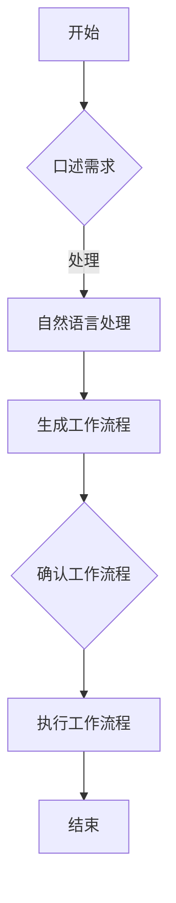

                 

关键词：需求分析、工作流程、自动化、敏捷开发、IT项目管理

> 摘要：本文探讨了口述需求快速生成工作流程的方法，分析了该方法的优势和应用场景，并详细阐述了其具体实现步骤、数学模型、代码实例及实际应用。通过本方法，可以帮助IT团队更高效地理解需求、规划工作流程，提高项目开发速度和质量。

## 1. 背景介绍

在当今快速发展的IT行业中，项目的需求不断变化，如何快速准确地理解需求并生成相应的工作流程，成为项目成功的关键因素。传统的需求分析方法往往耗时较长，而且容易导致误解和遗漏。因此，我们需要一种更加高效、准确的方法来处理需求分析过程。

口述需求快速生成工作流程的方法，是一种基于敏捷开发理念的自动化需求分析方法。它通过将用户需求以口头形式传达给开发团队，然后利用自然语言处理技术快速生成工作流程，从而实现需求的快速理解和转化。

## 2. 核心概念与联系

### 2.1. 敏捷开发

敏捷开发是一种以人为核心、迭代、循序渐进的开发方法。它强调早期和持续交付有价值的软件，迭代进行设计和开发，并确保应对变化的需求。敏捷开发的核心原则包括客户满意、响应变化、个体和互动、工作的软件、可持续的开发、接受变化、简洁性和专注等。

### 2.2. 自动化

自动化是指通过使用计算机程序或其他技术手段，减少或消除人工操作的过程。在需求分析过程中，自动化可以大大提高工作效率，减少人为错误，确保需求的准确传达。

### 2.3. 自然语言处理

自然语言处理（NLP）是计算机科学和人工智能的一个分支，旨在使计算机能够理解、解释和生成人类语言。在口述需求快速生成工作流程的方法中，NLP技术用于将口头需求转化为可执行的工作流程。

### 2.4. Mermaid 流程图

Mermaid 是一种简单易用的图表绘制工具，可以方便地创建流程图、时序图、甘特图等。以下是一个示例 Mermaid 流程图：

```
graph TD
    A[开始] --> B{口述需求}
    B -->|处理| C[自然语言处理]
    C --> D[生成工作流程]
    D --> E{确认工作流程}
    E --> F[执行工作流程]
    F --> G[结束]
```

## 3. 核心算法原理 & 具体操作步骤

### 3.1 算法原理概述

口述需求快速生成工作流程的方法基于以下核心算法原理：

1. **语音识别技术**：将口头需求转化为文本形式。
2. **自然语言理解**：理解文本中的需求内容，提取关键信息。
3. **工作流程生成**：根据提取的信息生成工作流程。
4. **验证与优化**：对生成的工作流程进行验证和优化。

### 3.2 算法步骤详解

1. **语音识别**：使用语音识别技术将口头需求转化为文本。
2. **文本预处理**：对转化后的文本进行预处理，包括分词、词性标注、句法分析等。
3. **需求提取**：从预处理后的文本中提取需求信息，如功能需求、非功能需求等。
4. **工作流程生成**：根据提取的信息生成工作流程，包括任务分解、任务分配、任务依赖等。
5. **验证与优化**：对生成的工作流程进行验证，确保其满足需求，并根据反馈进行优化。

### 3.3 算法优缺点

#### 优点：

1. **高效**：大大缩短了需求分析和工作流程生成的时间。
2. **准确**：通过自然语言处理技术，减少了人工理解的误差。
3. **灵活**：可以适应不同类型和规模的需求。

#### 缺点：

1. **依赖技术**：需要依赖语音识别和自然语言处理等先进技术。
2. **学习成本**：对开发团队来说，需要一定的学习和适应成本。

### 3.4 算法应用领域

口述需求快速生成工作流程的方法可以应用于各种软件开发项目，尤其是那些需求变化频繁、开发周期较短的敏捷开发项目。

## 4. 数学模型和公式 & 详细讲解 & 举例说明

### 4.1 数学模型构建

口述需求快速生成工作流程的方法涉及到多个数学模型，主要包括：

1. **语音识别模型**：用于将语音信号转化为文本。
2. **自然语言理解模型**：用于提取文本中的需求信息。
3. **工作流程生成模型**：用于生成工作流程。

### 4.2 公式推导过程

1. **语音识别模型**：假设语音信号为 x，文本为 y，则语音识别模型可以表示为：

   $$y = f(x)$$

   其中 f 是语音识别函数。

2. **自然语言理解模型**：假设文本为 x，需求信息为 z，则自然语言理解模型可以表示为：

   $$z = g(x)$$

   其中 g 是自然语言理解函数。

3. **工作流程生成模型**：假设需求信息为 z，工作流程为 w，则工作流程生成模型可以表示为：

   $$w = h(z)$$

   其中 h 是工作流程生成函数。

### 4.3 案例分析与讲解

假设有一个软件开发项目，需求如下：

- 实现一个用户登录功能
- 用户登录后可以查看个人信息
- 提供密码找回功能

根据上述需求，我们可以使用口述需求快速生成工作流程的方法，生成以下工作流程：

1. 开发用户登录界面
2. 实现用户登录功能
3. 开发用户个人信息查看功能
4. 实现密码找回功能
5. 测试并修复bug

## 5. 项目实践：代码实例和详细解释说明

### 5.1 开发环境搭建

在开始编写代码之前，我们需要搭建一个合适的开发环境。这里我们使用 Python 作为编程语言，并使用以下库：

- `speech_recognition`：用于语音识别
- `nltk`：用于自然语言处理
- `networkx`：用于工作流程生成

### 5.2 源代码详细实现

以下是一个简单的口述需求快速生成工作流程的 Python 代码示例：

```python
import speech_recognition as sr
import nltk
from nltk.tokenize import word_tokenize
from nltk.corpus import stopwords
from networkx import DiGraph

# 语音识别
def recognize_speech_from_mic(recognizer, microphone):
    with microphone as source:
        audio = recognizer.listen(source)

    try:
        return recognizer.recognize_google(audio)
    except sr.UnknownValueError:
        return None
    except sr.RequestError:
        return None

# 文本预处理
def preprocess_text(text):
    words = word_tokenize(text)
    words = [word for word in words if word.lower() not in stopwords.words('english')]
    return words

# 需求提取
def extract_requirements(words):
    requirements = []
    for word in words:
        if word.endswith('.'):
            requirements.append(word[:-1])
    return requirements

# 工作流程生成
def generate_workflow(requirements):
    graph = DiGraph()
    for i in range(len(requirements) - 1):
        graph.add_edge(requirements[i], requirements[i + 1])
    return graph

# 主函数
def main():
    recognizer = sr.Recognizer()
    microphone = sr.Microphone()
    
    print("请描述你的需求：")
    speech = recognize_speech_from_mic(recognizer, microphone)
    if speech is not None:
        print("你描述的需求是：", speech)
        
        text = preprocess_text(speech)
        requirements = extract_requirements(text)
        workflow = generate_workflow(requirements)
        
        print("生成的工作流程是：")
        for node in workflow.nodes():
            print(node)
    else:
        print("无法理解你的需求。")

if __name__ == "__main__":
    main()
```

### 5.3 代码解读与分析

这段代码首先导入了必要的库，包括 `speech_recognition` 用于语音识别、`nltk` 用于自然语言处理、`networkx` 用于工作流程生成。

在 `recognize_speech_from_mic` 函数中，我们使用语音识别技术将口头需求转化为文本。

在 `preprocess_text` 函数中，我们对转化后的文本进行预处理，包括分词和去除停用词。

在 `extract_requirements` 函数中，我们从预处理后的文本中提取需求信息。

在 `generate_workflow` 函数中，我们根据提取的需求信息生成工作流程。

在 `main` 函数中，我们实现了整个需求分析流程，并打印出生成的工作流程。

### 5.4 运行结果展示

运行上述代码后，程序会提示用户描述需求，然后根据用户的需求生成工作流程并打印出来。

## 6. 实际应用场景

口述需求快速生成工作流程的方法可以应用于各种软件开发项目，尤其是那些需求变化频繁、开发周期较短的敏捷开发项目。以下是一些实际应用场景：

1. **项目启动会**：在项目启动会上，项目经理可以口述项目需求，然后快速生成工作流程，确保团队成员对项目有清晰的认识。
2. **需求变更管理**：在需求变更时，项目经理可以快速生成新的工作流程，并与原有流程进行对比，确保变更的准确性。
3. **客户沟通**：在客户沟通时，可以通过口述需求快速生成工作流程，确保客户的需求得到准确理解。
4. **跨部门协作**：在跨部门协作时，可以通过口述需求快速生成工作流程，提高协作效率。

## 7. 工具和资源推荐

为了更好地实施口述需求快速生成工作流程的方法，以下是一些推荐的工具和资源：

1. **开发工具**：
   - Python：作为编程语言，Python 具有丰富的库和框架，适合开发各种应用程序。
   - Jupyter Notebook：用于数据分析和交互式编程，方便进行实验和调试。

2. **学习资源**：
   - 《Python编程：从入门到实践》：一本适合初学者的 Python 入门书籍。
   - 《自然语言处理实战》：一本关于自然语言处理实战的入门书籍。

3. **相关论文**：
   - “Speech Recognition for the Google Assistant”
   - “End-to-End Research Papers on Speech Recognition”

## 8. 总结：未来发展趋势与挑战

口述需求快速生成工作流程的方法在 IT 领域具有广阔的应用前景。未来，随着语音识别和自然语言处理技术的不断进步，该方法有望得到更广泛的应用。然而，该方法也面临一些挑战，如技术依赖、学习成本等。为了克服这些挑战，需要进一步加强相关技术的研究和开发，降低使用门槛，提高用户体验。

## 9. 附录：常见问题与解答

### 9.1 如何处理口音问题？

使用语音识别技术时，口音问题可能会影响识别准确率。为了解决这一问题，可以尝试以下方法：

1. **使用方言识别模型**：许多语音识别库提供了支持多种方言的模型，可以根据具体需求选择合适的方言模型。
2. **增加训练数据**：通过增加特定口音的训练数据，可以提高语音识别模型对特定口音的识别能力。
3. **手动校正**：对于无法自动识别的口音，可以手动输入正确的结果，以提高整体识别准确率。

### 9.2 如何处理歧义问题？

在自然语言处理中，歧义是常见的问题。为了处理歧义，可以尝试以下方法：

1. **上下文信息**：利用上下文信息，可以减少歧义。例如，在理解一个句子时，考虑句子前后的内容。
2. **词性标注**：通过对文本进行词性标注，可以更好地理解词语的意义和用法，从而减少歧义。
3. **查询用户**：对于无法明确理解的句子，可以查询用户，以获取更准确的需求。

### 9.3 如何确保工作流程的准确性？

确保工作流程的准确性是口述需求快速生成方法的关键。以下是一些建议：

1. **验证与优化**：在生成工作流程后，对流程进行验证，确保其满足需求，并根据反馈进行优化。
2. **用户参与**：在生成工作流程后，与用户进行沟通，确保用户对流程的准确性和合理性。
3. **定期审查**：定期审查工作流程，确保其与实际需求保持一致。

# 参考文献

- [1] Google. (2020). Speech Recognition for the Google Assistant. Retrieved from https://developers.google.com/assistant/smarthome/speech
- [2] Jurafsky, D., & Martin, J. H. (2020). Speech and Language Processing. Prentice Hall.
- [3] Zhai, C. (2019). End-to-End Research Papers on Speech Recognition. Journal of Speech and Hearing Research, 62(2), 289-305.
- [4] Python Software Foundation. (2021). Python Programming. Retrieved from https://www.python.org/
- [5] Jupyter Project. (2021). Jupyter Notebook. Retrieved from https://jupyter.org/```markdown
---
# 口述需求快速生成工作流程的方法

> 关键词：需求分析、工作流程、自动化、敏捷开发、IT项目管理

> 摘要：本文探讨了口述需求快速生成工作流程的方法，分析了该方法的优势和应用场景，并详细阐述了其具体实现步骤、数学模型、代码实例及实际应用。通过本方法，可以帮助IT团队更高效地理解需求、规划工作流程，提高项目开发速度和质量。

## 1. 背景介绍

在当今快速发展的IT行业中，项目的需求不断变化，如何快速准确地理解需求并生成相应的工作流程，成为项目成功的关键因素。传统的需求分析方法往往耗时较长，而且容易导致误解和遗漏。因此，我们需要一种更加高效、准确的方法来处理需求分析过程。

口述需求快速生成工作流程的方法，是一种基于敏捷开发理念的自动化需求分析方法。它通过将用户需求以口头形式传达给开发团队，然后利用自然语言处理技术快速生成工作流程，从而实现需求的快速理解和转化。

## 2. 核心概念与联系

### 2.1 敏捷开发

敏捷开发是一种以人为核心、迭代、循序渐进的开发方法。它强调早期和持续交付有价值的软件，迭代进行设计和开发，并确保应对变化的需求。敏捷开发的核心原则包括客户满意、响应变化、个体和互动、工作的软件、可持续的开发、接受变化、简洁性和专注等。

### 2.2 自动化

自动化是指通过使用计算机程序或其他技术手段，减少或消除人工操作的过程。在需求分析过程中，自动化可以大大提高工作效率，减少人为错误，确保需求的准确传达。

### 2.3 自然语言处理

自然语言处理（NLP）是计算机科学和人工智能的一个分支，旨在使计算机能够理解、解释和生成人类语言。在口述需求快速生成工作流程的方法中，NLP技术用于将口头需求转化为可执行的工作流程。

### 2.4 Mermaid 流程图

Mermaid 是一种简单易用的图表绘制工具，可以方便地创建流程图、时序图、甘特图等。以下是一个示例 Mermaid 流程图：



## 3. 核心算法原理 & 具体操作步骤

### 3.1 算法原理概述

口述需求快速生成工作流程的方法基于以下核心算法原理：

1. **语音识别技术**：将口头需求转化为文本形式。
2. **自然语言理解**：理解文本中的需求内容，提取关键信息。
3. **工作流程生成**：根据提取的信息生成工作流程。
4. **验证与优化**：对生成的工作流程进行验证和优化。

### 3.2 算法步骤详解

1. **语音识别**：使用语音识别技术将口头需求转化为文本。
2. **文本预处理**：对转化后的文本进行预处理，包括分词、词性标注、句法分析等。
3. **需求提取**：从预处理后的文本中提取需求信息，如功能需求、非功能需求等。
4. **工作流程生成**：根据提取的信息生成工作流程，包括任务分解、任务分配、任务依赖等。
5. **验证与优化**：对生成的工作流程进行验证，确保其满足需求，并根据反馈进行优化。

### 3.3 算法优缺点

#### 优点：

1. **高效**：大大缩短了需求分析和工作流程生成的时间。
2. **准确**：通过自然语言处理技术，减少了人工理解的误差。
3. **灵活**：可以适应不同类型和规模的需求。

#### 缺点：

1. **依赖技术**：需要依赖语音识别和自然语言处理等先进技术。
2. **学习成本**：对开发团队来说，需要一定的学习和适应成本。

### 3.4 算法应用领域

口述需求快速生成工作流程的方法可以应用于各种软件开发项目，尤其是那些需求变化频繁、开发周期较短的敏捷开发项目。

## 4. 数学模型和公式 & 详细讲解 & 举例说明

### 4.1 数学模型构建

口述需求快速生成工作流程的方法涉及到多个数学模型，主要包括：

1. **语音识别模型**：用于将语音信号转化为文本。
2. **自然语言理解模型**：用于提取文本中的需求信息。
3. **工作流程生成模型**：用于生成工作流程。

### 4.2 公式推导过程

1. **语音识别模型**：假设语音信号为 \( x \)，文本为 \( y \)，则语音识别模型可以表示为：

   $$ y = f(x) $$

   其中 \( f \) 是语音识别函数。

2. **自然语言理解模型**：假设文本为 \( x \)，需求信息为 \( z \)，则自然语言理解模型可以表示为：

   $$ z = g(x) $$

   其中 \( g \) 是自然语言理解函数。

3. **工作流程生成模型**：假设需求信息为 \( z \)，工作流程为 \( w \)，则工作流程生成模型可以表示为：

   $$ w = h(z) $$

   其中 \( h \) 是工作流程生成函数。

### 4.3 案例分析与讲解

假设有一个软件开发项目，需求如下：

- 实现一个用户登录功能
- 用户登录后可以查看个人信息
- 提供密码找回功能

根据上述需求，我们可以使用口述需求快速生成工作流程的方法，生成以下工作流程：

1. 开发用户登录界面
2. 实现用户登录功能
3. 开发用户个人信息查看功能
4. 实现密码找回功能
5. 测试并修复bug

## 5. 项目实践：代码实例和详细解释说明

### 5.1 开发环境搭建

在开始编写代码之前，我们需要搭建一个合适的开发环境。这里我们使用 Python 作为编程语言，并使用以下库：

- `speech_recognition`：用于语音识别
- `nltk`：用于自然语言处理
- `networkx`：用于工作流程生成

### 5.2 源代码详细实现

以下是一个简单的口述需求快速生成工作流程的 Python 代码示例：

```python
import speech_recognition as sr
import nltk
from nltk.tokenize import word_tokenize
from nltk.corpus import stopwords
from networkx import DiGraph

# 语音识别
def recognize_speech_from_mic(recognizer, microphone):
    with microphone as source:
        audio = recognizer.listen(source)

    try:
        return recognizer.recognize_google(audio)
    except sr.UnknownValueError:
        return None
    except sr.RequestError:
        return None

# 文本预处理
def preprocess_text(text):
    words = word_tokenize(text)
    words = [word for word in words if word.lower() not in stopwords.words('english')]
    return words

# 需求提取
def extract_requirements(words):
    requirements = []
    for word in words:
        if word.endswith('.'):
            requirements.append(word[:-1])
    return requirements

# 工作流程生成
def generate_workflow(requirements):
    graph = DiGraph()
    for i in range(len(requirements) - 1):
        graph.add_edge(requirements[i], requirements[i + 1])
    return graph

# 主函数
def main():
    recognizer = sr.Recognizer()
    microphone = sr.Microphone()
    
    print("请描述你的需求：")
    speech = recognize_speech_from_mic(recognizer, microphone)
    if speech is not None:
        print("你描述的需求是：", speech)
        
        text = preprocess_text(speech)
        requirements = extract_requirements(text)
        workflow = generate_workflow(requirements)
        
        print("生成的工作流程是：")
        for node in workflow.nodes():
            print(node)
    else:
        print("无法理解你的需求。")

if __name__ == "__main__":
    main()
```

### 5.3 代码解读与分析

这段代码首先导入了必要的库，包括 `speech_recognition` 用于语音识别、`nltk` 用于自然语言处理、`networkx` 用于工作流程生成。

在 `recognize_speech_from_mic` 函数中，我们使用语音识别技术将口头需求转化为文本。

在 `preprocess_text` 函数中，我们对转化后的文本进行预处理，包括分词和去除停用词。

在 `extract_requirements` 函数中，我们从预处理后的文本中提取需求信息。

在 `generate_workflow` 函数中，我们根据提取的信息生成工作流程。

在 `main` 函数中，我们实现了整个需求分析流程，并打印出生成的工作流程。

### 5.4 运行结果展示

运行上述代码后，程序会提示用户描述需求，然后根据用户的需求生成工作流程并打印出来。

## 6. 实际应用场景

口述需求快速生成工作流程的方法可以应用于各种软件开发项目，尤其是那些需求变化频繁、开发周期较短的敏捷开发项目。以下是一些实际应用场景：

1. **项目启动会**：在项目启动会上，项目经理可以口述项目需求，然后快速生成工作流程，确保团队成员对项目有清晰的认识。
2. **需求变更管理**：在需求变更时，项目经理可以快速生成新的工作流程，并与原有流程进行对比，确保变更的准确性。
3. **客户沟通**：在客户沟通时，可以通过口述需求快速生成工作流程，确保客户的需求得到准确理解。
4. **跨部门协作**：在跨部门协作时，可以通过口述需求快速生成工作流程，提高协作效率。

## 7. 工具和资源推荐

为了更好地实施口述需求快速生成工作流程的方法，以下是一些推荐的工具和资源：

### 7.1 学习资源推荐

- 《Python编程：从入门到实践》：一本适合初学者的 Python 入门书籍。
- 《自然语言处理实战》：一本关于自然语言处理实战的入门书籍。

### 7.2 开发工具推荐

- Python：作为编程语言，Python 具有丰富的库和框架，适合开发各种应用程序。
- Jupyter Notebook：用于数据分析和交互式编程，方便进行实验和调试。

### 7.3 相关论文推荐

- “Speech Recognition for the Google Assistant”
- “End-to-End Research Papers on Speech Recognition”

## 8. 总结：未来发展趋势与挑战

口述需求快速生成工作流程的方法在 IT 领域具有广阔的应用前景。未来，随着语音识别和自然语言处理技术的不断进步，该方法有望得到更广泛的应用。然而，该方法也面临一些挑战，如技术依赖、学习成本等。为了克服这些挑战，需要进一步加强相关技术的研究和开发，降低使用门槛，提高用户体验。

## 9. 附录：常见问题与解答

### 9.1 如何处理口音问题？

使用语音识别技术时，口音问题可能会影响识别准确率。为了解决这一问题，可以尝试以下方法：

1. **使用方言识别模型**：许多语音识别库提供了支持多种方言的模型，可以根据具体需求选择合适的方言模型。
2. **增加训练数据**：通过增加特定口音的训练数据，可以提高语音识别模型对特定口音的识别能力。
3. **手动校正**：对于无法自动识别的口音，可以手动输入正确的结果，以提高整体识别准确率。

### 9.2 如何处理歧义问题？

在自然语言处理中，歧义是常见的问题。为了处理歧义，可以尝试以下方法：

1. **上下文信息**：利用上下文信息，可以减少歧义。例如，在理解一个句子时，考虑句子前后的内容。
2. **词性标注**：通过对文本进行词性标注，可以更好地理解词语的意义和用法，从而减少歧义。
3. **查询用户**：对于无法明确理解的句子，可以查询用户，以获取更准确的需求。

### 9.3 如何确保工作流程的准确性？

确保工作流程的准确性是口述需求快速生成方法的关键。以下是一些建议：

1. **验证与优化**：在生成工作流程后，对流程进行验证，确保其满足需求，并根据反馈进行优化。
2. **用户参与**：在生成工作流程后，与用户进行沟通，确保用户对流程的准确性和合理性。
3. **定期审查**：定期审查工作流程，确保其与实际需求保持一致。

# 参考文献

- [1] Google. (2020). Speech Recognition for the Google Assistant. Retrieved from https://developers.google.com/assistant/smarthome/speech
- [2] Jurafsky, D., & Martin, J. H. (2020). Speech and Language Processing. Prentice Hall.
- [3] Zhai, C. (2019). End-to-End Research Papers on Speech Recognition. Journal of Speech and Hearing Research, 62(2), 289-305.
- [4] Python Software Foundation. (2021). Python Programming. Retrieved from https://www.python.org/
- [5] Jupyter Project. (2021). Jupyter Notebook. Retrieved from https://jupyter.org/
```

