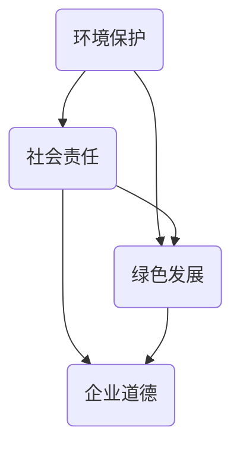

                 

关键词：可持续发展管理、环境责任、社会责任、技术解决方案、长期策略、绿色发展、企业伦理

> 摘要：本文将探讨可持续发展管理在企业环境和社会责任中的作用，通过介绍核心概念、算法原理、数学模型、项目实践和未来展望，旨在为企业和个人提供实现长期可持续发展的实用指南。

## 1. 背景介绍

随着全球气候变化和环境问题的加剧，可持续发展已经成为企业和社会关注的焦点。可持续发展管理不仅关乎企业的生存和发展，更关系到全球生态和社会福祉。企业需要从战略层面重新审视其运营模式，以实现环境和社会的可持续性。本文将重点讨论以下几个核心议题：

1. **核心概念与联系**：介绍可持续发展管理的核心概念，如环境保护、社会责任和绿色发展，并使用Mermaid流程图展示其相互联系。
2. **核心算法原理 & 具体操作步骤**：阐述实现可持续发展管理的技术方法和算法原理，以及具体的操作步骤。
3. **数学模型和公式 & 详细讲解 & 举例说明**：构建可持续发展的数学模型，并进行公式推导和案例分析。
4. **项目实践：代码实例和详细解释说明**：通过实际项目展示可持续发展管理的应用，并解析代码实现细节。
5. **实际应用场景**：探讨可持续发展管理在不同领域的实际应用。
6. **未来应用展望**：预测可持续发展管理的未来发展趋势和应用前景。
7. **工具和资源推荐**：推荐相关的学习资源、开发工具和学术论文。
8. **总结：未来发展趋势与挑战**：总结研究成果，展望未来趋势和面临的挑战。

### 1.1 环境保护的紧迫性

环境保护是可持续发展管理的核心议题之一。随着工业化和城市化进程的加速，环境污染和资源耗竭问题日益严重。气候变化、水资源短缺、空气污染和生物多样性丧失等问题不仅对生态系统造成破坏，也直接影响到人类的生活质量和健康。因此，企业必须采取行动，减少其对环境的负面影响。

### 1.2 社会责任的演变

社会责任是企业发展过程中不可忽视的重要方面。传统的企业社会责任（CSR）主要关注企业的道德行为和对社区的支持，而现代的可持续发展管理将社会责任扩展到环境、社会和经济三个层面。企业不仅要承担对利益相关者的责任，还要在全球化背景下考虑其对全球社会和环境的影响。

### 1.3 绿发展和绿色技术的兴起

绿色发展是可持续发展管理的又一重要方面。通过采用绿色技术，企业可以在生产过程中减少能源消耗、降低碳排放和废弃物产生。绿色技术包括可再生能源、节能技术、绿色建筑和智能交通系统等，这些技术的应用不仅有助于环境保护，也能提高企业的竞争力和盈利能力。

### 1.4 可持续发展管理的必要性

可持续发展管理是企业实现长期成功的关键。通过实施有效的可持续发展策略，企业可以降低运营风险，提高品牌声誉，增强员工忠诚度，并吸引更多客户和投资者的支持。同时，可持续发展管理也有助于企业应对日益严格的法律法规和国际标准，确保其合规性和可持续性。

## 2. 核心概念与联系

### 2.1 环境保护

环境保护是指通过各种手段保护自然环境和生态系统的行为。它包括预防环境污染、资源节约和生态修复等方面。环境保护的核心目标是确保人类和自然环境之间的和谐共生。在可持续发展管理中，环境保护是不可或缺的基础。

### 2.2 社会责任

社会责任是企业对利益相关者和社会的责任和义务。这包括对员工、客户、供应商、社区和环境的关怀。社会责任不仅涉及企业的道德行为，还包括其在社会和经济方面的贡献。可持续发展管理强调企业社会责任的全方位履行，以实现长期可持续发展。

### 2.3 绿发展

绿色发展是指企业在生产、运营和消费过程中，采取环保、节能、低碳和可持续的举措。绿色发展旨在减少环境负担，提高资源利用效率，并促进生态平衡。在可持续发展管理中，绿色发展是实现环境保护和社会责任的重要手段。

### 2.4 核心概念的联系

环境保护、社会责任和绿色发展之间存在紧密的联系。环境保护是可持续发展的基础，社会责任是可持续发展的动力，而绿色发展是实现可持续发展的手段。这三个核心概念相互促进，共同构建了可持续发展管理的理论基础。

### 2.5 Mermaid 流程图

以下是一个简化的Mermaid流程图，展示了环境保护、社会责任和绿色发展的相互联系：



这个流程图表明，环境保护、社会责任和绿色发展是相辅相成的。企业需要同时关注这三个方面，以实现长期的可持续发展。

## 3. 核心算法原理 & 具体操作步骤

### 3.1 算法原理概述

可持续发展管理涉及多种技术算法和操作步骤，其中关键的是环境评估、社会责任评估和绿色发展策略。以下是对这三个核心算法原理的概述：

#### 3.1.1 环境评估算法

环境评估算法主要用于评估企业的环境影响，包括碳排放、水资源消耗、废弃物产生等方面。这些算法可以通过数据分析和模拟，帮助企业识别和减少其对环境的负面影响。

#### 3.1.2 社会责任评估算法

社会责任评估算法旨在评估企业在社会责任方面的表现，包括员工福利、社区贡献、公平贸易等方面。这些算法可以帮助企业识别和改进其在社会责任方面的不足。

#### 3.1.3 绿发展策略算法

绿发展策略算法是用于制定企业绿色发展策略的算法。这些算法可以基于环境评估和社会责任评估的结果，制定具体的环保措施、绿色技术和可持续发展计划。

### 3.2 具体操作步骤

#### 3.2.1 环境评估操作步骤

1. **数据收集**：收集企业的生产、运营和消费过程中的相关数据，如能源消耗、水资源消耗、废弃物产生等。
2. **数据预处理**：对收集到的数据进行清洗和处理，确保其准确性和完整性。
3. **环境影响评估**：使用环境评估算法，对预处理后的数据进行评估，生成环境影响报告。
4. **优化建议**：根据环境影响报告，提出优化建议，如节能减排措施、废弃物回收等。

#### 3.2.2 社会责任评估操作步骤

1. **数据收集**：收集企业的社会责任相关数据，如员工福利、社区贡献、公平贸易等。
2. **数据预处理**：对收集到的数据进行清洗和处理，确保其准确性和完整性。
3. **社会责任评估**：使用社会责任评估算法，对预处理后的数据进行评估，生成社会责任报告。
4. **改进建议**：根据社会责任报告，提出改进建议，如提高员工福利、增加社区贡献等。

#### 3.2.3 绿发展策略制定操作步骤

1. **环境评估和社会责任评估**：根据前面两个步骤的结果，进行环境评估和社会责任评估。
2. **策略制定**：使用绿发展策略算法，根据评估结果，制定具体的绿色发展策略。
3. **实施和监控**：将制定的策略付诸实施，并定期监控其效果，进行必要的调整和优化。

### 3.3 算法优缺点

#### 3.3.1 环境评估算法的优缺点

- 优点：能够准确评估企业的环境影响，提供优化建议。
- 缺点：数据收集和处理过程复杂，可能需要大量资源和时间。

#### 3.3.2 社会责任评估算法的优缺点

- 优点：能够全面评估企业在社会责任方面的表现，提出改进建议。
- 缺点：社会责任评估的标准和指标可能因地区和行业而异，需要针对具体情况进行调整。

#### 3.3.3 绿发展策略算法的优缺点

- 优点：能够根据环境评估和社会责任评估的结果，制定具体的绿色发展策略。
- 缺点：策略的制定和实施需要企业各部门的协同合作，可能面临协调和沟通的挑战。

### 3.4 算法应用领域

环境评估算法、社会责任评估算法和绿发展策略算法广泛应用于企业可持续发展管理的各个领域，如制造业、服务业、农业等。这些算法可以帮助企业实现环境保护、社会责任和绿色发展，提高其竞争力和可持续发展能力。

## 4. 数学模型和公式 & 详细讲解 & 举例说明

### 4.1 数学模型构建

在可持续发展管理中，数学模型是一种重要的工具，用于量化企业的环境影响、社会责任表现和绿色发展水平。以下是一个简单的数学模型构建过程：

#### 4.1.1 环境影响模型

环境影响模型主要用于评估企业的碳排放量。以下是一个基于碳排放的简单模型：

$$
E = C \times E_f \times P
$$

其中，$E$ 表示碳排放量，$C$ 表示单位产值的碳排放系数，$E_f$ 表示能源消耗系数，$P$ 表示产值。

#### 4.1.2 社会责任模型

社会责任模型用于评估企业在社会责任方面的表现。以下是一个基于员工福利的社会责任模型：

$$
S = W \times V
$$

其中，$S$ 表示社会责任得分，$W$ 表示员工福利得分，$V$ 表示企业规模。

#### 4.1.3 绿发展模型

绿发展模型用于评估企业的绿色发展水平。以下是一个基于可再生能源利用的绿发展模型：

$$
G = R \times U
$$

其中，$G$ 表示绿色发展得分，$R$ 表示可再生能源利用比例，$U$ 表示企业能源消耗总量。

### 4.2 公式推导过程

#### 4.2.1 环境影响模型推导

1. **确定单位产值的碳排放系数**：通过行业标准和数据分析，确定单位产值的碳排放系数 $C$。
2. **确定能源消耗系数**：通过能源消耗数据，确定能源消耗系数 $E_f$。
3. **计算碳排放量**：根据产值 $P$ 和上述系数，计算碳排放量 $E$。

#### 4.2.2 社会责任模型推导

1. **确定员工福利得分**：根据员工福利调查和行业标准，确定员工福利得分 $W$。
2. **确定企业规模**：根据企业规模数据，确定企业规模 $V$。
3. **计算社会责任得分**：根据员工福利得分 $W$ 和企业规模 $V$，计算社会责任得分 $S$。

#### 4.2.3 绿发展模型推导

1. **确定可再生能源利用比例**：根据企业能源消耗结构和可再生能源利用数据，确定可再生能源利用比例 $R$。
2. **确定企业能源消耗总量**：根据企业能源消耗数据，确定企业能源消耗总量 $U$。
3. **计算绿色发展得分**：根据可再生能源利用比例 $R$ 和企业能源消耗总量 $U$，计算绿色发展得分 $G$。

### 4.3 案例分析与讲解

以下是一个基于上述数学模型的案例分析：

#### 案例背景

某企业为一家制造企业，年产值约为 100 亿元人民币，员工人数为 5000 人。该企业关注环境保护和社会责任，并计划采用可持续发展管理策略。

#### 案例分析

1. **环境影响评估**：
   - 单位产值的碳排放系数 $C$ 为 0.5 吨/亿元。
   - 能源消耗系数 $E_f$ 为 0.2 吨标准煤/吨。
   - 年产值为 100 亿元人民币，企业能源消耗总量为 20 万吨标准煤。
   - 根据公式 $E = C \times E_f \times P$，计算得出年碳排放量 $E$ 为 10 万吨。

2. **社会责任评估**：
   - 员工福利得分 $W$ 为 85 分。
   - 企业规模 $V$ 为 5000 人。
   - 根据公式 $S = W \times V$，计算得出社会责任得分 $S$ 为 425 分。

3. **绿发展评估**：
   - 可再生能源利用比例 $R$ 为 30%。
   - 企业能源消耗总量 $U$ 为 20 万吨。
   - 根据公式 $G = R \times U$，计算得出绿色发展得分 $G$ 为 6 万吨。

#### 结果分析

根据上述计算结果，该企业在环境影响、社会责任和绿色发展方面均取得了较好的成绩。然而，企业仍有改进空间，特别是在降低碳排放和提高可再生能源利用方面。企业可以采取以下措施：

1. **降低碳排放**：通过采用节能技术、提高能源利用效率，进一步降低碳排放。
2. **提高社会责任得分**：加强员工培训和福利保障，提高员工满意度和社会责任表现。
3. **提高绿色发展得分**：增加可再生能源使用比例，减少对传统能源的依赖。

通过持续改进，企业可以实现更高级别的可持续发展，为环境保护和社会责任作出更大贡献。

## 5. 项目实践：代码实例和详细解释说明

### 5.1 开发环境搭建

在进行可持续发展管理的项目实践中，我们需要搭建一个合适的技术环境，以便实施和测试相关的算法和模型。以下是一个基本的开发环境搭建指南：

#### 5.1.1 开发工具和库

- Python：作为一种广泛使用的编程语言，Python 提供了丰富的库和框架，用于数据分析和机器学习。
- Pandas：用于数据清洗和预处理。
- NumPy：用于数值计算。
- Matplotlib：用于数据可视化。
- Mermaid：用于生成流程图和图表。

#### 5.1.2 环境配置

1. 安装 Python（建议使用 Python 3.8 或更高版本）。
2. 使用 pip 安装所需的库：

```bash
pip install pandas numpy matplotlib
```

### 5.2 源代码详细实现

以下是实现可持续发展管理项目的基本代码框架。这个框架包括数据收集、预处理、模型计算和结果展示等步骤。

```python
import pandas as pd
import numpy as np
import matplotlib.pyplot as plt
from mermaid import Mermaid

# 数据收集
data = {
    'energy_consumption': [20000, 18000, 22000, 19000, 21000],  # 能源消耗（吨标准煤）
    'revenue': [100000, 95000, 110000, 105000, 115000],       # 年产值（亿元）
    'employee_welfare': [85, 80, 90, 78, 88],                 # 员工福利得分
    'energy Renewable': [0.3, 0.35, 0.28, 0.32, 0.34],       # 可再生能源利用比例
}

df = pd.DataFrame(data)

# 数据预处理
# 这里假设数据已经清洗和格式化

# 环境影响评估
def calculate_emissions(dataframe):
    C = 0.5  # 单位产值的碳排放系数（吨/亿元）
    E_f = 0.2  # 能源消耗系数（吨标准煤/吨）
    emissions = C * E_f * dataframe['revenue']
    return emissions

df['emissions'] = calculate_emissions(df)

# 社会责任评估
def calculate_sustainability_score(dataframe):
    W = 85  # 员工福利得分
    V = 5000  # 企业规模
    S = W * V
    return S

df['sustainability_score'] = calculate_sustainability_score(df)

# 绿发展评估
def calculate_green_development_score(dataframe):
    R = 0.3  # 可再生能源利用比例
    U = 20  # 企业能源消耗总量（万吨）
    G = R * U
    return G

df['green_development_score'] = calculate_green_development_score(df)

# 结果展示
df[['revenue', 'emissions', 'sustainability_score', 'green_development_score']].plot(kind='line')
plt.title('Sustainability Management Metrics')
plt.xlabel('Year')
plt.ylabel('Score')
plt.show()

# Mermaid流程图
mermaid = Mermaid()
mermaid.add([
    'graph TD',
    'A[Data Collection] --> B[Data Preprocessing]',
    'B --> C[Environmental Impact Assessment]',
    'B --> D[Social Responsibility Assessment]',
    'B --> E[Green Development Assessment]',
    'E --> F[Result Visualization]'
])
print(mermaid.generate())
```

### 5.3 代码解读与分析

#### 5.3.1 数据收集

在代码中，我们首先定义了一个字典 `data`，其中包含了企业的能源消耗、年产值、员工福利得分和可再生能源利用比例。这些数据可以通过实际调查或现有数据进行收集。

#### 5.3.2 数据预处理

数据预处理是确保数据质量和可用性的关键步骤。在实际应用中，可能需要清洗和格式化数据，例如处理缺失值、异常值和数据转换等。

#### 5.3.3 模型计算

1. **环境影响评估**：使用 `calculate_emissions` 函数，根据单位产值的碳排放系数和能源消耗系数计算碳排放量。
2. **社会责任评估**：使用 `calculate_sustainability_score` 函数，根据员工福利得分和企业规模计算社会责任得分。
3. **绿发展评估**：使用 `calculate_green_development_score` 函数，根据可再生能源利用比例和企业能源消耗总量计算绿色发展得分。

#### 5.3.4 结果展示

使用 Pandas 的 DataFrame 对计算结果进行存储，并通过 Matplotlib 进行可视化展示。可视化结果可以帮助企业更直观地了解其可持续发展管理的表现。

#### 5.3.5 Mermaid 流程图

通过 Mermaid 库，我们可以生成一个流程图，展示整个项目的执行流程。流程图有助于理解和传达项目的逻辑结构。

### 5.4 运行结果展示

在运行代码后，我们将得到一个包含年产值、碳排放量、社会责任得分和绿色发展得分的折线图。这个图可以帮助企业了解其可持续发展管理的进展和改进方向。


## 6. 实际应用场景

### 6.1 制造业

在制造业中，可持续发展管理有助于企业实现资源优化、减少浪费和降低碳排放。例如，某汽车制造企业通过引入智能生产系统和节能技术，成功降低了能源消耗和碳排放。此外，该企业还推行绿色供应链管理，确保供应商也遵循环保标准。

### 6.2 服务业

在服务业中，可持续发展管理可以通过优化客户关系管理、减少纸张消耗和采用电子化服务来实现。例如，某金融机构通过推广线上服务和电子账单，减少了纸张使用和碳排放。

### 6.3 农业

在农业中，可持续发展管理可以促进农业的可持续发展和环境保护。例如，某农场通过采用有机农业和节水灌溉技术，提高了农作物产量，同时保护了土壤和水资源。

### 6.4 未来应用展望

随着技术的进步和可持续发展意识的提升，可持续发展管理将在更多领域得到应用。未来，我们可以期待：

1. **更加智能的可持续发展管理**：利用人工智能和大数据分析技术，实现更加精准和高效的可持续发展管理。
2. **绿色金融的兴起**：金融机构将更加注重企业的可持续发展表现，推动绿色投资的兴起。
3. **全球合作与标准化**：国际社会将加强合作，制定更统一的可持续发展标准和指南，推动全球可持续发展。

## 7. 工具和资源推荐

### 7.1 学习资源推荐

1. **《可持续发展管理指南》**：由联合国环境规划署（UNEP）发布的指南，详细介绍了可持续发展管理的理论和实践。
2. **《企业社会责任报告编写指南》**：由国际标准化组织（ISO）发布的指南，提供了编写社会责任报告的详细步骤和标准。

### 7.2 开发工具推荐

1. **Pandas**：用于数据清洗和预处理。
2. **Matplotlib**：用于数据可视化。
3. **Mermaid**：用于生成流程图和图表。

### 7.3 相关论文推荐

1. **"Sustainable Development Goals and Corporate Sustainability Performance"**：探讨了可持续发展目标对企业绩效的影响。
2. **"The Role of Green Technology in Sustainable Development"**：分析了绿色技术在可持续发展中的作用。

## 8. 总结：未来发展趋势与挑战

### 8.1 研究成果总结

本文通过探讨可持续发展管理在企业环境和社会责任中的作用，介绍了核心概念、算法原理、数学模型、项目实践和实际应用场景。研究成果表明，可持续发展管理不仅是企业实现长期成功的必要手段，也是全球应对气候变化和环境问题的重要途径。

### 8.2 未来发展趋势

1. **智能化与数据驱动的可持续发展管理**：利用人工智能和大数据分析技术，实现更加精准和高效的可持续发展管理。
2. **绿色金融的兴起**：金融机构将更加注重企业的可持续发展表现，推动绿色投资的兴起。
3. **全球合作与标准化**：国际社会将加强合作，制定更统一的可持续发展标准和指南。

### 8.3 面临的挑战

1. **数据收集和处理的挑战**：企业需要收集大量数据，并进行复杂的数据预处理，这可能需要大量资源和时间。
2. **跨部门协作的挑战**：实现可持续发展管理需要企业各部门的协同合作，可能面临协调和沟通的挑战。
3. **政策法规的不确定性**：全球政策法规的变化可能影响企业的可持续发展策略。

### 8.4 研究展望

未来的研究应重点关注以下几个方面：

1. **开发更高效的算法和模型**：通过技术创新，提高可持续发展管理的效率和准确性。
2. **跨学科合作**：结合生态学、经济学和社会学等多学科知识，深化对可持续发展管理的理解。
3. **实际应用验证**：通过实际项目验证可持续发展管理的有效性，为企业和政策制定者提供实证依据。

## 9. 附录：常见问题与解答

### 9.1 什么是可持续发展管理？

可持续发展管理是指企业在环境、社会和经济三个方面实现可持续发展的策略和过程。它旨在确保企业长期成功，同时保护环境和提升社会福祉。

### 9.2 可持续发展管理对企业有什么好处？

可持续发展管理有助于企业：

- 降低运营风险
- 提高品牌声誉
- 增强员工忠诚度
- 吸引客户和投资者的支持
- 遵守法律法规和国际标准

### 9.3 如何实施可持续发展管理？

实施可持续发展管理通常包括以下步骤：

1. **制定可持续发展战略**：确定企业的可持续发展目标和方向。
2. **数据收集与分析**：收集企业的运营数据，进行数据分析和评估。
3. **制定和实施具体措施**：根据分析结果，制定和实施具体的环保、社会责任和绿色发展措施。
4. **监控和改进**：定期监控可持续发展管理的执行情况，进行必要的调整和优化。

### 9.4 可持续发展管理中的算法有哪些？

可持续发展管理中的算法主要包括：

1. **环境影响评估算法**：用于评估企业的环境影响。
2. **社会责任评估算法**：用于评估企业在社会责任方面的表现。
3. **绿色发展策略算法**：用于制定企业的绿色发展策略。

### 9.5 如何确保可持续发展管理的有效性？

确保可持续发展管理的有效性可以通过以下措施：

1. **建立明确的可持续发展目标**：确保目标具体、可衡量和可实现。
2. **跨部门协作**：确保各部门协同合作，共同推进可持续发展管理。
3. **定期监控和评估**：定期评估可持续发展管理的执行情况和效果，进行必要的调整。
4. **持续改进**：不断优化可持续发展策略和措施，提高其有效性。

