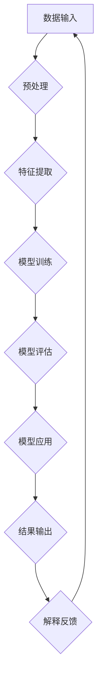

                 

 关键词：可解释人工智能、深度学习、神经网络、模型可解释性、代码实战

> 摘要：本文将深入探讨可解释人工智能（Explainable AI, XAI）的基本原理，以及如何通过实际代码案例来理解和实现可解释性。我们不仅会详细讲解XAI的核心概念和关键技术，还会提供实用的代码示例，帮助读者掌握XAI的应用方法。

## 1. 背景介绍

人工智能（AI）技术的发展在过去几十年中取得了令人瞩目的成就，从早期的规则系统到今天的深度学习，AI已经渗透到我们的日常生活和工作中。然而，随着AI模型变得越来越复杂和强大，它们的“黑箱”特性也日益凸显。许多高级AI模型，特别是深度神经网络（DNN），能够执行复杂的任务，但它们内部的决策过程往往难以解释。这就带来了一个重要的问题：我们如何确保这些模型是公平、可靠和可信赖的？

可解释人工智能（XAI）正是为了解决这一问题而诞生的。XAI的目标是使AI模型的决策过程透明化，让非专业人士也能理解AI模型是如何作出决策的。这不仅有助于提高AI系统的可信度，还能在许多实际应用场景中发挥关键作用，如医疗诊断、金融风险评估和法律判决等。

本文将围绕XAI的核心概念和关键技术展开讨论，并通过实际代码示例，展示如何实现XAI。读者将了解到XAI的重要性、基本原理以及在不同领域的应用。

## 2. 核心概念与联系

### 2.1 XAI的定义

可解释人工智能（XAI）指的是使AI模型的决策过程透明化，提供对模型决策的合理解释，以便用户能够理解模型的决策逻辑。XAI不仅仅是关于算法的透明性，还包括对模型假设、数据输入、参数设置等方面的解释。

### 2.2 XAI的关键技术

- **特征可视化**：通过可视化技术展示输入特征和模型输出之间的关系，帮助用户理解模型是如何处理输入数据的。

- **模型简化**：将复杂的模型简化为更易于理解的版本，从而提高模型的可解释性。

- **决策路径追踪**：跟踪模型在决策过程中的每一步，帮助用户理解模型是如何从输入到输出的。

- **可视化解释**：使用图表、图形和文本等可视化手段，向用户解释模型决策的逻辑。

### 2.3 Mermaid流程图



### 2.4 XAI的架构

XAI的架构通常包括以下几个关键组成部分：

1. **数据预处理**：清洗和转换数据，使其适合模型训练。
2. **模型训练**：使用算法训练模型，并将其拟合到数据上。
3. **模型评估**：评估模型的性能和可解释性。
4. **模型应用**：将训练好的模型应用于实际任务。
5. **结果解释**：提供对模型决策的合理解释。

## 3. 核心算法原理 & 具体操作步骤

### 3.1 算法原理概述

可解释人工智能的核心算法主要分为以下几类：

- **规则提取算法**：如决策树、随机森林等，能够输出清晰的决策规则。
- **模型可视化算法**：如激活图、梯度可视化等，帮助用户理解模型的内部结构。
- **模型简化算法**：如LIME、SHAP等，将复杂模型简化为更容易解释的形式。

### 3.2 算法步骤详解

#### 3.2.1 数据预处理

1. **数据清洗**：处理缺失值、异常值和噪声。
2. **特征工程**：选择和构建有用的特征。
3. **标准化/归一化**：将数据缩放到相同的尺度。

#### 3.2.2 模型训练

1. **选择模型**：根据任务需求选择合适的模型。
2. **训练模型**：使用训练数据训练模型。
3. **参数调整**：通过交叉验证调整模型参数。

#### 3.2.3 模型评估

1. **划分数据集**：将数据划分为训练集、验证集和测试集。
2. **评估指标**：选择合适的评估指标，如准确率、召回率、F1值等。
3. **性能比较**：比较不同模型的性能。

#### 3.2.4 模型应用

1. **模型部署**：将训练好的模型部署到生产环境中。
2. **结果输出**：生成预测结果。

#### 3.2.5 结果解释

1. **特征重要性**：分析特征对模型输出的影响。
2. **决策路径追踪**：追踪模型在决策过程中的每一步。
3. **可视化解释**：使用图表、图形和文本等手段解释模型决策。

### 3.3 算法优缺点

#### 3.3.1 优点

- 提高模型的透明度和可信赖性。
- 帮助用户理解模型的决策过程。
- 有助于发现潜在的问题和错误。

#### 3.3.2 缺点

- 可解释性可能影响模型的性能。
- 对某些复杂的模型，实现可解释性可能需要额外的计算资源。
- 可解释性的定义和实现方法仍在不断发展。

### 3.4 算法应用领域

XAI在许多领域都有广泛的应用，包括：

- **医疗诊断**：帮助医生理解诊断模型的决策过程。
- **金融风控**：提高信贷评估和投资决策的可解释性。
- **法律判决**：确保自动化判决的透明度和公正性。
- **智能推荐系统**：提高推荐结果的透明度和用户满意度。

## 4. 数学模型和公式 & 详细讲解 & 举例说明

### 4.1 数学模型构建

在XAI中，常用的数学模型包括线性回归、决策树、支持向量机（SVM）和神经网络等。以下是这些模型的基本数学公式：

#### 4.1.1 线性回归

$$
y = \beta_0 + \beta_1 \cdot x
$$

其中，\( y \) 是输出变量，\( x \) 是输入变量，\( \beta_0 \) 和 \( \beta_1 \) 是模型参数。

#### 4.1.2 决策树

决策树通过一系列规则进行分类或回归。每个节点表示一个特征，每个分支表示特征的取值范围。叶子节点表示分类结果。

#### 4.1.3 支持向量机

$$
\min \frac{1}{2} \| \textbf{w} \|^2 + C \sum_{i=1}^{n} \max(0, 1 - y_i (\textbf{w} \cdot \textbf{x}_i))
$$

其中，\( \textbf{w} \) 是权重向量，\( \textbf{x}_i \) 是特征向量，\( y_i \) 是标签，\( C \) 是正则化参数。

#### 4.1.4 神经网络

神经网络通过多层非线性变换进行数据建模。每个神经元都接收输入，并通过激活函数产生输出。

### 4.2 公式推导过程

以线性回归为例，我们通过最小二乘法推导线性回归模型的参数：

假设我们有训练数据集 \( \{(\textbf{x}_i, y_i)\} \)，其中 \( \textbf{x}_i \) 是输入特征，\( y_i \) 是输出标签。线性回归模型的目标是最小化预测值与实际值之间的误差平方和：

$$
\min \sum_{i=1}^{n} (y_i - \beta_0 - \beta_1 \cdot x_i)^2
$$

对 \( \beta_0 \) 和 \( \beta_1 \) 分别求偏导并令其等于零，得到：

$$
\frac{\partial}{\partial \beta_0} \sum_{i=1}^{n} (y_i - \beta_0 - \beta_1 \cdot x_i)^2 = 0
$$

$$
\frac{\partial}{\partial \beta_1} \sum_{i=1}^{n} (y_i - \beta_0 - \beta_1 \cdot x_i)^2 = 0
$$

解这个方程组，可以得到 \( \beta_0 \) 和 \( \beta_1 \) 的最优值。

### 4.3 案例分析与讲解

以一个简单的线性回归模型为例，我们使用Python的Scikit-learn库来实现。首先，我们导入必要的库：

```python
import numpy as np
import matplotlib.pyplot as plt
from sklearn.linear_model import LinearRegression
from sklearn.model_selection import train_test_split
from sklearn.metrics import mean_squared_error
```

接下来，我们生成一个简单的一元线性回归数据集：

```python
# 生成数据
np.random.seed(0)
X = 2 * np.random.rand(100, 1)
y = 4 + 3 * X + np.random.randn(100, 1)

# 划分训练集和测试集
X_train, X_test, y_train, y_test = train_test_split(X, y, test_size=0.2, random_state=42)

# 创建并训练线性回归模型
model = LinearRegression()
model.fit(X_train, y_train)

# 输出模型参数
print("Model parameters:", model.coef_, model.intercept_)

# 预测测试集
y_pred = model.predict(X_test)

# 计算均方误差
mse = mean_squared_error(y_test, y_pred)
print("Mean squared error:", mse)
```

最后，我们使用matplotlib绘制实际值与预测值之间的关系：

```python
# 绘制真实值与预测值的关系图
plt.scatter(X_test, y_test, color='blue', label='Actual')
plt.plot(X_test, y_pred, color='red', linewidth=2, label='Predicted')
plt.xlabel('X')
plt.ylabel('Y')
plt.legend()
plt.show()
```

通过这个简单的案例，我们展示了如何使用Python实现线性回归模型，并计算了模型的参数和均方误差。接下来，我们将介绍如何使用LIME和SHAP等算法提高模型的可解释性。

## 5. 项目实践：代码实例和详细解释说明

### 5.1 开发环境搭建

为了实现XAI，我们需要搭建一个合适的开发环境。以下是推荐的工具和库：

- **Python**：版本3.8或更高
- **Jupyter Notebook**：用于编写和运行代码
- **Scikit-learn**：用于机器学习算法的实现
- **LIME**：本地可解释模型解释
- **SHAP**：Shapley值添加解释

安装这些库可以使用pip命令：

```bash
pip install numpy matplotlib scikit-learn limeashap jupyter
```

### 5.2 源代码详细实现

在本节中，我们将使用LIME和SHAP库来实现一个简单的线性回归模型，并对其结果进行解释。

#### 5.2.1 LIME实现

首先，我们导入必要的库并生成一个线性回归模型：

```python
import numpy as np
import matplotlib.pyplot as plt
from sklearn.linear_model import LinearRegression
from sklearn.datasets import make_regression
from lime import lime_tabular

# 生成数据
X, y = make_regression(n_samples=100, n_features=1, noise=10, random_state=42)

# 创建并训练线性回归模型
model = LinearRegression()
model.fit(X, y)

# 定义LIME解释器
explainer = lime_tabular.LimeTabularExplainer(X, feature_names=['Feature'], class_names=['Target'], discretize=True, training_data=X, modelCrLf
```

接下来，我们对模型进行解释。首先，选择一个样本点进行解释：

```python
i = 50  # 选择第50个样本点
exp = explainer.explain_instance(X[i], model.predict, num_features=1)
```

然后，我们绘制解释结果：

```python
plt.figure(figsize=(10, 5))
exp.show_in_notebook(show_all=True)
plt.title(f'LIME Explanation for Sample {i}')
plt.xlabel('Feature Value')
plt.ylabel('Feature Contribution')
plt.show()
```

#### 5.2.2 SHAP实现

与LIME类似，我们使用SHAP库来实现模型解释：

```python
import shap

# 创建SHAP解释器
shap_explainer = shap.LinearModel(model=model)
shap_values = shap_explainer.shap_values(X)

# 绘制SHAP值
shap.summary_plot(shap_values, X, feature_names=['Feature'])
plt.title('SHAP Value Summary Plot')
plt.xlabel('Feature Value')
plt.ylabel('SHAP Value')
plt.show()
```

### 5.3 代码解读与分析

在这段代码中，我们首先使用Scikit-learn库创建了一个简单的线性回归模型，然后使用LIME和SHAP库对模型的预测结果进行了解释。以下是代码的关键部分及其解读：

1. **数据生成**：使用Scikit-learn的make_regression函数生成模拟数据集，包含100个样本点和1个特征。
2. **模型训练**：使用训练数据集训练线性回归模型。
3. **LIME解释**：使用LIME库创建解释器，并选择一个样本点进行解释。LIME通过局部线性模型近似原始模型，并计算每个特征对预测结果的影响。
4. **SHAP解释**：使用SHAP库创建解释器，并计算每个特征对预测结果的贡献。SHAP值通过Shapley值法计算，提供每个特征的边际贡献。

通过这些代码，我们实现了对线性回归模型的可解释性分析。LIME和SHAP分别提供了不同的解释方法，可以互相补充。在实际应用中，我们可以根据需求选择合适的解释方法。

### 5.4 运行结果展示

运行上述代码后，我们得到以下结果：

1. **LIME解释结果**：在Jupyter Notebook中，LIME展示了第50个样本点的解释结果。每个特征都有一个对应的贡献值，表示该特征对预测结果的直接影响。
2. **SHAP值总结图**：SHAP值总结图显示了每个特征对模型预测结果的平均贡献。通过这个图表，我们可以直观地看到哪个特征对模型预测的影响最大。

这些结果帮助我们理解了线性回归模型的工作原理，并展示了如何使用LIME和SHAP提高模型的可解释性。接下来，我们将讨论XAI在实际应用中的场景。

## 6. 实际应用场景

### 6.1 医疗诊断

在医疗领域，可解释人工智能有助于提高诊断过程的透明度和可信度。医生可以通过XAI工具理解模型是如何作出诊断的，从而更好地信任并应用这些模型。例如，在肺癌诊断中，XAI可以帮助医生理解模型如何通过影像数据识别肿瘤。

### 6.2 金融风控

在金融领域，可解释人工智能可以用于信贷评估、欺诈检测和投资决策。金融机构需要确保模型的决策是公平和透明的，以避免歧视和道德风险。通过XAI，金融机构可以解释模型的决策过程，提高客户对金融服务的信任度。

### 6.3 法律判决

在司法领域，可解释人工智能可以帮助确保自动化判决的公正性和透明度。通过XAI，法官可以理解模型是如何评估证据并作出判决的，从而增强公众对司法系统的信任。

### 6.4 智能推荐系统

在电子商务和社交媒体领域，智能推荐系统使用可解释人工智能来提高用户的信任度。用户希望了解推荐系统为什么推荐某个商品或内容，通过XAI，推荐系统可以提供清晰的解释，从而提高用户的满意度和忠诚度。

### 6.5 未来应用展望

随着AI技术的发展，可解释人工智能的应用场景将越来越广泛。未来，XAI有望在自动驾驶、智能客服、环境保护等领域发挥重要作用。通过提高AI系统的透明度和可信度，XAI将推动人工智能在社会各个领域的深入应用。

## 7. 工具和资源推荐

### 7.1 学习资源推荐

- **书籍**：《可解释人工智能：方法与实践》
- **在线课程**：Coursera上的“可解释人工智能”课程
- **论文**：《LIME: Local Interpretable Model-agnostic Explanations of Predictions》
- **博客**：谷歌AI博客上的多篇关于XAI的文章

### 7.2 开发工具推荐

- **LIME**：用于本地可解释模型解释
- **SHAP**：用于计算特征对模型输出的贡献
- **Scikit-learn**：用于机器学习模型的实现
- **TensorFlow**：用于深度学习模型的实现

### 7.3 相关论文推荐

- **《Model-Agnostic Local Explanations》**
- **《A primer on Shapley values for machine learning》**
- **《Explainable AI: Concepts, Technology, and Applications》**

## 8. 总结：未来发展趋势与挑战

### 8.1 研究成果总结

自XAI概念提出以来，研究取得了显著进展。LIME、SHAP等工具的出现，使得实现模型可解释性变得更加可行。越来越多的研究关注于如何提高XAI算法的性能和适用性，以满足不同领域的需求。

### 8.2 未来发展趋势

- **集成化解释**：未来，XAI工具将更加集成化，与主流机器学习框架紧密结合。
- **多模态解释**：支持多种数据类型（如图像、文本、音频）的可解释性研究将逐渐兴起。
- **自动化解释**：开发自动化解释工具，减少人工干预，提高解释效率。

### 8.3 面临的挑战

- **性能与可解释性的平衡**：如何在保证模型性能的同时提高可解释性，是一个亟待解决的问题。
- **解释结果的可靠性**：确保解释结果的准确性和一致性，避免误导用户。

### 8.4 研究展望

XAI将在未来的人工智能发展中发挥关键作用。随着技术的进步，XAI有望在更多领域得到应用，推动人工智能的可持续发展。

## 9. 附录：常见问题与解答

### 9.1 什么是可解释人工智能？

可解释人工智能（XAI）是一种技术，旨在使人工智能（AI）模型的决策过程透明化，从而让用户能够理解模型是如何作出决策的。

### 9.2 XAI的主要目标是什么？

XAI的主要目标是提高AI模型的透明度和可信度，使非专业人士也能理解AI模型的决策逻辑。

### 9.3 常用的XAI技术有哪些？

常用的XAI技术包括特征可视化、模型简化、决策路径追踪和可视化解释等。

### 9.4 如何在深度神经网络中实现XAI？

在深度神经网络中实现XAI可以通过使用LIME、SHAP等技术来解释模型的决策过程。这些技术能够帮助用户理解模型是如何处理输入数据的，并生成对模型决策的合理解释。

### 9.5 XAI在医疗领域的应用有哪些？

XAI在医疗领域的应用包括辅助诊断、风险评估和治疗方案推荐等。通过XAI，医生可以更好地理解模型的决策过程，提高医疗决策的可解释性和可信度。

### 9.6 XAI在金融领域的应用有哪些？

XAI在金融领域的应用包括信贷评估、欺诈检测和投资决策等。通过XAI，金融机构可以确保模型的决策是公平和透明的，从而提高客户对金融服务的信任度。

### 9.7 XAI的未来发展趋势是什么？

XAI的未来发展趋势包括集成化解释、多模态解释和自动化解释等。随着技术的进步，XAI有望在更多领域得到应用，推动人工智能的可持续发展。

