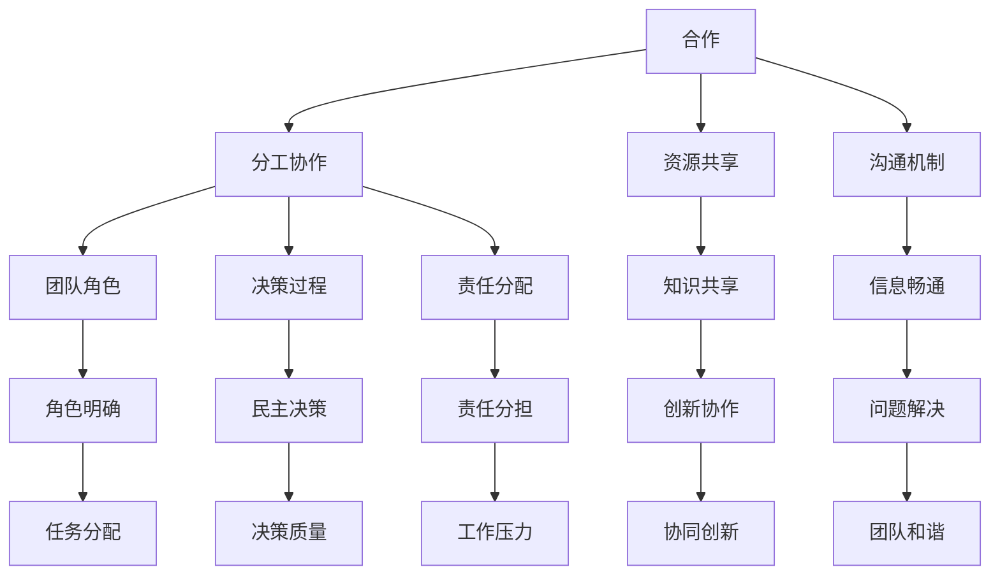

                 

在现代社会，技术发展迅猛，IT行业作为其中最具活力的领域之一，需要大量的专业人才共同协作才能推动项目的发展和创新。在这个背景下，如何有效地进行合作和团队协作，成为了一个至关重要的议题。本文旨在探讨合作和团队协作在IT行业中的重要性，阐述其核心概念与原理，并通过具体实例分析，提出一些实际操作步骤和策略。

## 文章关键词

- 合作
- 团队协作
- IT行业
- 程序设计
- 项目管理
- 沟通技巧
- 决策过程

## 文章摘要

本文首先介绍了合作和团队协作在IT行业中的重要性，探讨了其核心概念和原理，并通过Mermaid流程图展示了合作和团队协作的基本架构。随后，文章详细阐述了核心算法原理和具体操作步骤，分析了算法的优缺点及其应用领域。接着，文章通过数学模型和公式详细讲解了合作和团队协作中的决策过程和责任分配。随后，文章通过实际项目实例，展示了如何在实际环境中进行有效的合作和团队协作。最后，文章提出了未来应用展望，并推荐了一些学习资源和开发工具。

## 1. 背景介绍

在IT行业，项目往往需要多个成员协同工作，以实现复杂的功能和系统。无论是软件开发、网络构建、数据分析，还是人工智能应用，都需要团队成员之间的密切合作。然而，团队合作并非易事，它需要成员之间相互理解、信任和支持，以及高效的沟通和协作机制。

合作和团队协作的重要性体现在以下几个方面：

1. **知识共享**：团队成员可以分享各自的专业知识和经验，形成知识库，从而提高项目的整体效率和质量。
2. **协同创新**：团队成员共同探讨问题，集思广益，往往能够产生更好的解决方案和创新点。
3. **责任分担**：在团队中，成员可以共同承担责任，减轻个人的工作压力，提高工作效率。
4. **提高凝聚力**：成功的团队协作可以增强团队成员之间的凝聚力，促进团队和谐发展。

然而，团队合作也存在一些挑战，如沟通障碍、角色冲突、资源分配不均等。因此，理解合作和团队协作的核心概念和原理，掌握有效的合作技巧和策略，对于实现共同目标至关重要。

## 2. 核心概念与联系

### 2.1. 合作

合作是指多个个体为了共同的目标而协同工作。在IT行业中，合作通常涉及以下核心概念：

- **分工协作**：根据每个人的专业特长和技能，进行合理的分工，确保每个成员都能发挥自己的优势。
- **资源共享**：团队成员可以共享工具、技术文档、代码库等资源，提高工作效率。
- **沟通机制**：建立有效的沟通渠道，确保信息畅通无阻，及时解决项目中遇到的问题。

### 2.2. 团队协作

团队协作是指在团队内部，成员之间紧密合作，共同完成项目任务。团队协作的核心概念包括：

- **团队角色**：明确每个成员的角色和职责，确保项目任务的顺利进行。
- **决策过程**：建立民主的决策机制，让团队成员参与决策，提高决策质量。
- **责任分配**：明确团队成员的责任，确保每个人都知道自己的职责和任务。

### 2.3. 合作与团队协作的联系

合作和团队协作是相辅相成的，合作是团队协作的基础，而团队协作则是合作的深化。通过有效的合作，团队成员可以共享资源、知识和经验，从而更好地进行团队协作。而通过团队协作，成员之间可以形成紧密的合作关系，共同实现项目目标。

### 2.4. Mermaid流程图

下面是一个描述合作和团队协作基本架构的Mermaid流程图：



通过这个流程图，我们可以清晰地看到合作和团队协作的核心概念及其相互联系。

## 3. 核心算法原理 & 具体操作步骤

### 3.1. 算法原理概述

在IT行业中，有效的团队协作往往依赖于一些核心算法原理，这些原理可以帮助团队在决策过程中提高效率和准确性。以下是几个关键算法原理的概述：

1. **决策树算法**：用于在多个备选方案中选择最佳方案，基于条件概率和期望值进行决策。
2. **动态规划算法**：通过将复杂问题分解为更小的子问题，并利用子问题的解来构建原问题的解，从而优化决策过程。
3. **图论算法**：用于分析网络结构和路径优化，如最短路径算法、最小生成树算法等，帮助团队优化资源分配和任务调度。

### 3.2. 算法步骤详解

下面以决策树算法为例，详细讲解其操作步骤：

1. **问题定义**：明确需要解决的问题，例如在多个开发任务中选择优先级最高的任务。
2. **特征提取**：从问题中提取关键特征，例如任务的时间、成本、复杂度等。
3. **决策树构建**：根据特征和条件概率，构建决策树，每个节点表示一个决策点，每个分支表示一个决策结果。
4. **路径选择**：从根节点开始，根据每个节点的分支条件，逐步向下选择路径，直到叶节点，得到最终的决策结果。
5. **结果评估**：评估决策结果的有效性，根据需要调整决策树或特征，提高决策质量。

### 3.3. 算法优缺点

决策树算法具有以下优点：

- **直观易懂**：决策树的图形表示使决策过程易于理解和解释。
- **易于实现**：算法结构简单，易于编程实现。
- **可解释性**：每个决策点和分支都有明确的依据，便于团队讨论和调整。

然而，决策树算法也存在一些缺点：

- **过拟合**：在特征过多或数据量不足的情况下，决策树可能会出现过拟合现象，导致决策结果不准确。
- **计算复杂度**：在处理大量数据时，决策树的构建和路径选择可能需要较高的计算资源。

### 3.4. 算法应用领域

决策树算法在IT行业的多个领域都有广泛应用，例如：

- **项目管理**：用于任务优先级排序和资源分配。
- **软件工程**：用于需求分析和设计决策。
- **数据挖掘**：用于模式识别和分类问题。

通过这些算法原理和操作步骤，团队可以在决策过程中更加科学和高效，从而提高项目的成功率和团队协作的效率。

## 4. 数学模型和公式 & 详细讲解 & 举例说明

### 4.1. 数学模型构建

在合作和团队协作中，数学模型可以用来描述团队成员之间的协作关系、决策过程和责任分配。一个简单的数学模型可以是基于博弈论的合作博弈模型。在这个模型中，团队成员被视为参与者，每个参与者都有一定的资源和能力，以及一个目标函数。目标函数可以定义为最大化团队总效用或最小化团队总成本。

### 4.2. 公式推导过程

合作博弈的基本公式如下：

\[ \Omega = \{ (X, Y) | X, Y \text{ are strategies of two players} \} \]

\[ u_i(X, Y) = \sum_{j \in N} w_{ij} x_j y_j \]

其中：

- \( \Omega \) 是策略空间，表示两个参与者可以选择的所有策略组合。
- \( u_i(X, Y) \) 是参与者 \( i \) 的效用函数，表示参与者 \( i \) 在策略组合 \( (X, Y) \) 下的效用。
- \( w_{ij} \) 是参与者 \( i \) 和参与者 \( j \) 之间的权重系数，表示参与者 \( i \) 对参与者 \( j \) 的依赖程度。
- \( x_j \) 和 \( y_j \) 分别是参与者 \( i \) 和参与者 \( j \) 的策略。

### 4.3. 案例分析与讲解

假设有两个参与者 \( A \) 和 \( B \)，他们的效用函数如下：

\[ u_A(X, Y) = 3x y \]

\[ u_B(X, Y) = 2x y \]

权重系数 \( w_{AB} \) 和 \( w_{BA} \) 分别为1，表示两者相互独立。

为了最大化总效用，我们可以计算以下策略组合的效用：

- \( (X, Y) = (1, 1) \)：\( u_A(1, 1) = 3 \)，\( u_B(1, 1) = 2 \)，总效用为5。
- \( (X, Y) = (1, 0) \)：\( u_A(1, 0) = 0 \)，\( u_B(1, 0) = 2 \)，总效用为2。
- \( (X, Y) = (0, 1) \)：\( u_A(0, 1) = 0 \)，\( u_B(0, 1) = 2 \)，总效用为2。
- \( (X, Y) = (0, 0) \)：\( u_A(0, 0) = 0 \)，\( u_B(0, 0) = 0 \)，总效用为0。

从上面的计算可以看出，策略组合 \( (1, 1) \) 能够最大化总效用。这表明，当参与者 \( A \) 和 \( B \) 都选择协作时，总效用最高。这个案例说明了在合作和团队协作中，通过数学模型和公式可以有效地分析决策过程和策略选择。

## 5. 项目实践：代码实例和详细解释说明

### 5.1. 开发环境搭建

在本节中，我们将使用Python作为开发语言，结合Git进行版本控制，搭建一个简单的合作和团队协作的示例项目。以下是在Linux环境中搭建开发环境的基本步骤：

1. **安装Python**：
   ```bash
   sudo apt update
   sudo apt install python3 python3-pip
   ```

2. **安装Git**：
   ```bash
   sudo apt install git
   ```

3. **创建虚拟环境**：
   ```bash
   python3 -m venv venv
   source venv/bin/activate
   ```

4. **安装必要库**：
   ```bash
   pip install flask pandas
   ```

### 5.2. 源代码详细实现

以下是一个简单的Flask Web应用示例，用于模拟团队协作中的任务分配和进度跟踪。

```python
from flask import Flask, request, jsonify
import pandas as pd

app = Flask(__name__)

# 假设任务数据存储在CSV文件中
tasks = pd.read_csv('tasks.csv')

@app.route('/tasks', methods=['GET', 'POST'])
def task_management():
    if request.method == 'POST':
        # 添加新任务
        task_data = request.json
        tasks = tasks.append(task_data, ignore_index=True)
        tasks.to_csv('tasks.csv', index=False)
        return jsonify({'message': 'Task added successfully.'}), 201

    else:
        # 获取任务列表
        return jsonify(tasks.to_dict(orient='records')), 200

@app.route('/tasks/<int:task_id>', methods=['PUT', 'DELETE'])
def task_operation(task_id):
    if request.method == 'PUT':
        # 更新任务进度
        task_data = request.json
        tasks.loc[tasks['id'] == task_id, 'status'] = task_data['status']
        tasks.to_csv('tasks.csv', index=False)
        return jsonify({'message': 'Task updated successfully.'}), 200

    elif request.method == 'DELETE':
        # 删除任务
        tasks = tasks[tasks['id'] != task_id]
        tasks.to_csv('tasks.csv', index=False)
        return jsonify({'message': 'Task deleted successfully.'}), 200

if __name__ == '__main__':
    app.run(debug=True)
```

### 5.3. 代码解读与分析

上述代码是一个简单的任务管理Web应用，它提供了以下功能：

- **添加任务**：通过POST请求向/tasks端点提交任务数据，将新任务添加到任务列表中。
- **获取任务列表**：通过GET请求从/tasks端点获取当前的任务列表。
- **更新任务进度**：通过PUT请求向/tasks/<task_id>端点提交更新后的任务状态。
- **删除任务**：通过DELETE请求从/tasks/<task_id>端点删除指定的任务。

这个应用通过Flask框架搭建，结合Pandas库处理任务数据，实现了基本的任务管理功能。在实际项目中，可以根据需求扩展功能，如任务优先级排序、任务分配等。

### 5.4. 运行结果展示

以下是运行结果展示：

1. **添加任务**：

```bash
curl -X POST -H "Content-Type: application/json" -d '{"id": 1, "name": "Task 1", "status": "pending"}' http://127.0.0.1:5000/tasks
```

返回结果：

```json
{
  "message": "Task added successfully."
}
```

2. **获取任务列表**：

```bash
curl -X GET http://127.0.0.1:5000/tasks
```

返回结果：

```json
[
  {
    "id": 1,
    "name": "Task 1",
    "status": "pending"
  }
]
```

3. **更新任务进度**：

```bash
curl -X PUT -H "Content-Type: application/json" -d '{"status": "completed"}' http://127.0.0.1:5000/tasks/1
```

返回结果：

```json
{
  "message": "Task updated successfully."
}
```

4. **删除任务**：

```bash
curl -X DELETE http://127.0.0.1:5000/tasks/1
```

返回结果：

```json
{
  "message": "Task deleted successfully."
}
```

通过这个简单的示例，我们可以看到如何利用代码实现团队协作中的任务管理功能，为团队协作提供了有效的工具支持。

## 6. 实际应用场景

### 6.1. 软件开发

在软件开发过程中，团队协作是确保项目按时交付和质量的关键。通过使用版本控制系统（如Git），团队成员可以协作开发，实时同步代码，确保代码的一致性和完整性。协作工具（如JIRA、Trello等）可以帮助团队管理任务和进度，确保每个成员都知道自己的职责和任务。此外，代码审查和测试流程也可以帮助团队发现和修复潜在的问题，提高代码质量。

### 6.2. 项目管理

在项目管理中，有效的团队协作可以确保项目目标的实现。项目经理需要与团队成员密切合作，制定项目计划，分配任务，监控进度，确保项目按计划进行。使用项目管理工具（如Microsoft Project、Asana等），项目经理可以更好地协调团队工作，跟踪项目进度，及时解决项目中出现的问题。此外，定期的团队会议和沟通也是确保项目顺利进行的重要手段。

### 6.3. 数据分析

在数据分析项目中，团队协作尤为重要。数据分析师需要与业务部门、技术团队等多个部门进行沟通，确保数据的准确性和完整性。通过使用数据协作平台（如Tableau、Looker等），团队成员可以实时查看和分析数据，共同探讨和解决问题。此外，数据仓库和大数据技术也支持团队协作，提供强大的数据处理和分析能力，帮助团队更好地理解业务需求，制定数据驱动的决策。

### 6.4. 未来应用展望

随着人工智能和物联网技术的发展，未来团队协作将在更多领域得到应用。例如，在智能城市和智能工厂中，团队协作将支持复杂系统的实时监控和优化。通过使用人工智能算法和数据分析技术，团队可以更高效地协作，实现智能决策和自动化操作。此外，虚拟现实（VR）和增强现实（AR）技术的应用，也将为团队协作提供新的交互方式，使团队成员可以在虚拟环境中实时沟通和协作，不受地理位置的限制。

## 7. 工具和资源推荐

### 7.1. 学习资源推荐

- **在线课程**：Coursera、edX、Udemy等平台提供了丰富的IT和团队合作相关课程。
- **技术博客**：GitHub、Medium、Stack Overflow等平台上有很多关于团队协作和IT技术的优质博客文章。
- **书籍**：《软件团队协作：方法、工具与实践》（"Team Collaboration in Software Development"）、《敏捷开发：实践指南》（"Agile Project Management: Creating Successful Teams"）等。

### 7.2. 开发工具推荐

- **版本控制系统**：Git、SVN、Mercurial等。
- **项目管理工具**：JIRA、Trello、Asana、Microsoft Project等。
- **协作工具**：Slack、Microsoft Teams、Zoom等。
- **代码审查工具**：Gerrit、GitLab、Bitbucket等。

### 7.3. 相关论文推荐

- **《分布式系统设计原则》**（"Design Principles for Distributed Systems"）
- **《基于角色的访问控制模型》**（"Role-Based Access Control Models"）
- **《敏捷团队协作实践》**（"Agile Team Collaboration Practices"）
- **《协同工作与虚拟团队》**（"Collaboration and Virtual Teams"）

## 8. 总结：未来发展趋势与挑战

### 8.1. 研究成果总结

近年来，随着人工智能、大数据和云计算等技术的发展，团队合作和协作工具在IT行业中得到了广泛应用。研究成果表明，有效的团队合作可以提高项目效率、质量和团队凝聚力。团队协作工具和技术，如版本控制系统、项目管理工具和协作平台，已经成为现代软件开发和项目管理不可或缺的一部分。

### 8.2. 未来发展趋势

未来，团队协作和协作工具将继续发展，呈现出以下趋势：

- **智能化**：人工智能技术将进一步提升团队协作的智能化水平，自动分析项目数据，提供决策支持。
- **云端化**：随着云计算技术的成熟，更多团队协作工具将迁移到云端，实现更高效的资源共享和协作。
- **多样化**：虚拟现实（VR）和增强现实（AR）技术的应用将带来多样化的协作方式，支持异地团队和远程协作。
- **定制化**：根据不同团队和项目的需求，提供更加定制化的协作工具和解决方案。

### 8.3. 面临的挑战

尽管团队协作和协作工具取得了显著成果，但未来仍面临以下挑战：

- **数据安全与隐私**：随着团队协作工具的数据量增加，数据安全和隐私保护成为重要挑战。
- **适应多样性**：不同团队和项目对协作工具的需求不同，如何提供适应多样性的解决方案是一个难题。
- **技术更新**：随着技术的快速发展，团队协作工具需要不断更新和升级，以保持竞争力。
- **培训与普及**：如何有效地培训和普及协作工具，让团队成员都能熟练使用，是一个长期任务。

### 8.4. 研究展望

未来，研究团队协作和协作工具的方向应包括以下几个方面：

- **跨领域融合**：将不同领域的技术（如人工智能、大数据、云计算等）融合到团队协作中，提供更全面的解决方案。
- **用户研究**：深入了解用户需求和行为，设计更人性化的协作工具，提高用户体验。
- **标准化**：制定统一的团队协作工具标准和规范，提高工具的兼容性和互操作性。
- **持续优化**：不断优化团队协作流程和工具，提高团队协作效率和效果。

总之，随着技术的不断发展，团队协作和协作工具将在未来发挥更加重要的作用，推动IT行业和各个领域的创新和发展。

## 9. 附录：常见问题与解答

### 9.1. 如何选择合适的协作工具？

**答**：选择合适的协作工具需要考虑以下几个因素：

- **团队规模**：小团队可以选择简单的工具，如Slack；大型团队则需要功能更强大的工具，如Microsoft Teams。
- **工作流程**：根据团队的工作流程和需求，选择能够支持相应工作流程的协作工具。
- **预算**：考虑团队的预算，选择性价比高的协作工具。
- **兼容性**：确保协作工具与其他现有系统和工具兼容。

### 9.2. 团队协作中的沟通障碍有哪些？

**答**：团队协作中的沟通障碍包括：

- **信息过载**：信息过多导致难以筛选和处理重要信息。
- **沟通方式不当**：使用不恰当的沟通方式，如只通过电子邮件或即时消息，可能导致信息传递不准确。
- **文化差异**：跨文化团队在沟通时可能存在语言、文化习惯等方面的差异。
- **角色冲突**：团队成员的角色和职责不明确，可能导致沟通不畅。

### 9.3. 如何解决团队协作中的冲突？

**答**：

- **提前预防**：在项目开始时，明确团队成员的角色和职责，制定明确的沟通规则。
- **积极沟通**：鼓励团队成员积极表达意见，尊重彼此的观点。
- **公正调解**：当出现冲突时，及时进行调解，确保公正处理。
- **培训与指导**：为团队成员提供沟通和冲突解决的培训，提高他们的沟通技能和解决问题的能力。

通过上述方法，可以有效解决团队协作中的冲突，促进团队的和谐发展。

### 结束语

合作和团队协作在IT行业中扮演着至关重要的角色，它不仅提高了项目的效率和质量，还增强了团队的凝聚力和创新能力。本文通过对合作和团队协作的核心概念、算法原理、实际应用场景以及未来发展趋势的探讨，为读者提供了一种全面的视角来理解和实践团队协作。希望本文能对读者在团队协作方面的实践提供有益的参考和启示。作者：禅与计算机程序设计艺术 / Zen and the Art of Computer Programming。

