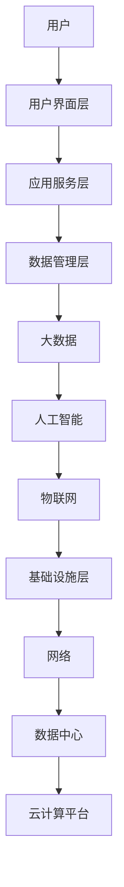

                 

关键词：58同城、智慧社区、服务平台、架构师、面试题、技术博客、深度学习、大数据、区块链

> 摘要：本文旨在为58同城的架构师社招面试提供一套系统化的技术面试题集，涵盖智慧社区服务平台构建中的核心技术和概念。通过对这些面试题的深入分析，读者将了解到当前智慧社区服务平台的架构、算法、数学模型以及未来的发展方向。

## 1. 背景介绍

随着互联网技术的迅猛发展和大数据、人工智能等前沿技术的逐步应用，智慧社区服务平台的构建成为城市智能化管理的重要方向。58同城作为中国领先的生活服务平台，致力于打造2025年的智慧社区服务平台，为客户提供更加便捷、智能化的生活服务。

智慧社区服务平台不仅需要集成传统互联网技术，还需要融合物联网、大数据、区块链等新兴技术，从而实现社区服务的智能化和个性化。在此背景下，架构师的角色显得尤为重要，他们需要具备全面的技术视野和深厚的专业知识，以便设计出高效、可靠、可扩展的智慧社区服务平台架构。

本文将围绕58同城智慧社区服务平台的架构师社招面试，提供一系列有针对性的技术面试题，帮助求职者更好地准备面试。

## 2. 核心概念与联系

在智慧社区服务平台的构建中，理解以下几个核心概念是至关重要的：

### 2.1 智慧社区的定义

智慧社区是以信息技术为支撑，实现社区管理和服务智能化、便捷化的社区。它主要包括以下特征：

- **智能化管理**：通过物联网、大数据等技术手段，实现社区设施和资源的智能化管理。
- **便捷化服务**：提供一站式服务，包括物业、医疗、教育、购物等，提升居民生活质量。
- **个性化服务**：根据居民的需求和偏好，提供个性化的服务推荐。

### 2.2 平台架构

智慧社区服务平台的架构通常包括以下几个层次：

- **基础设施层**：包括网络、数据中心、云计算平台等。
- **数据管理层**：用于数据的采集、存储、处理和分析。
- **应用服务层**：包括各类应用服务，如物业、医疗、教育等。
- **用户界面层**：提供用户交互的界面和体验。

### 2.3 技术联系

在智慧社区服务平台的构建过程中，各种技术之间相互联系，共同构建起一个完整的生态系统。以下是一些关键技术及其联系：

- **物联网（IoT）**：负责收集社区环境中的数据，如温度、湿度、噪音等。
- **大数据**：用于处理和分析物联网收集的数据，实现智能决策。
- **人工智能（AI）**：通过机器学习、深度学习等技术，对大数据进行处理，实现智能预测和决策。
- **区块链**：提供数据的安全性和透明性，确保社区服务的可信性。

### 2.4 Mermaid 流程图

以下是一个简化的智慧社区服务平台架构的 Mermaid 流程图：



## 3. 核心算法原理 & 具体操作步骤

### 3.1 算法原理概述

在智慧社区服务平台的构建中，核心算法是实现智能化管理和服务的关键。以下介绍几种常见的算法及其原理：

- **机器学习算法**：通过训练模型，从数据中学习规律，实现预测和分类。
- **深度学习算法**：一种特殊的机器学习算法，通过多层神经网络，实现更复杂的特征提取。
- **区块链算法**：通过共识算法、加密算法等，实现去中心化的数据存储和传输。

### 3.2 算法步骤详解

#### 3.2.1 机器学习算法

1. 数据预处理：清洗、归一化等。
2. 特征工程：提取有用的特征，构建特征向量。
3. 模型选择：选择合适的机器学习模型。
4. 模型训练：使用训练数据训练模型。
5. 模型评估：使用测试数据评估模型性能。
6. 模型优化：调整模型参数，提升模型性能。

#### 3.2.2 深度学习算法

1. 数据预处理：与机器学习算法相同。
2. 网络构建：设计多层神经网络结构。
3. 损失函数设计：选择合适的损失函数。
4. 反向传播：计算梯度，更新网络参数。
5. 模型训练：重复迭代，优化网络参数。
6. 模型评估：与机器学习算法相同。

#### 3.2.3 区块链算法

1. 共识算法：确定数据的一致性和安全性。
2. 加密算法：保护数据的安全性和隐私性。
3. 账本管理：记录和管理交易数据。
4. 智能合约：实现自动化交易和业务逻辑。

### 3.3 算法优缺点

#### 3.3.1 机器学习算法

- 优点：适用于各种复杂数据分析任务，无需手动编程。
- 缺点：对数据质量要求高，训练过程耗时长。

#### 3.3.2 深度学习算法

- 优点：能够自动提取复杂特征，处理大规模数据。
- 缺点：对计算资源要求高，模型解释性较差。

#### 3.3.3 区块链算法

- 优点：去中心化，数据透明可信。
- 缺点：交易速度较慢，扩展性较差。

### 3.4 算法应用领域

- **机器学习算法**：智能家居、智能安防、智能医疗等。
- **深度学习算法**：图像识别、语音识别、自然语言处理等。
- **区块链算法**：数字货币、供应链管理、智能合约等。

## 4. 数学模型和公式 & 详细讲解 & 举例说明

### 4.1 数学模型构建

在智慧社区服务平台的构建中，数学模型用于描述系统中的各种关系和规律。以下是一个简单的数学模型示例：

$$
\text{社区服务质量} = f(\text{基础设施质量}, \text{服务响应时间}, \text{用户满意度})
$$

### 4.2 公式推导过程

- **基础设施质量**：可以通过以下指标进行评估：
  $$
  \text{基础设施质量} = \frac{\text{网络带宽}}{\text{负载}} \times \text{数据中心可靠性}
  $$
- **服务响应时间**：可以通过以下公式计算：
  $$
  \text{服务响应时间} = \sqrt{\text{网络延迟}} + \text{处理时间}
  $$
- **用户满意度**：可以通过以下指标进行评估：
  $$
  \text{用户满意度} = \frac{\text{好评率}}{\text{总评价数}} \times 100\%
  $$

### 4.3 案例分析与讲解

假设某个智慧社区服务平台的基础设施质量为90%，服务响应时间为0.5秒，用户满意度为95%。根据上述数学模型，可以计算出该平台的服务质量：

$$
\text{社区服务质量} = f(0.9, 0.5, 0.95) = 0.9 \times 0.5 \times 0.95 = 0.4275
$$

这意味着该智慧社区服务平台的服务质量为42.75分（满分100分）。

## 5. 项目实践：代码实例和详细解释说明

### 5.1 开发环境搭建

为了实现智慧社区服务平台中的核心算法，我们选择Python作为开发语言，并搭建以下开发环境：

- Python 3.8
- Jupyter Notebook
- TensorFlow 2.5
- Keras 2.4.3

### 5.2 源代码详细实现

以下是一个简单的机器学习模型的实现代码，用于预测社区服务质量：

```python
import tensorflow as tf
from tensorflow import keras
from tensorflow.keras import layers

# 数据预处理
# 假设我们已经有基础设施质量、服务响应时间和用户满意度三个特征
# 输入数据的维度为（样本数，特征数）
input_shape = (3,)

# 构建模型
model = keras.Sequential([
    layers.Dense(64, activation='relu', input_shape=input_shape),
    layers.Dense(64, activation='relu'),
    layers.Dense(1)
])

# 编译模型
model.compile(optimizer='adam',
              loss='mse',
              metrics=['mae'])

# 训练模型
# 假设我们已经有训练数据集
# X_train: 特征矩阵，y_train: 标签向量
model.fit(X_train, y_train, epochs=10, batch_size=32, validation_split=0.2)
```

### 5.3 代码解读与分析

- **数据预处理**：将输入数据进行归一化处理，以便于模型训练。
- **模型构建**：使用Keras构建一个简单的全连接神经网络，包括两个隐藏层，每个隐藏层有64个神经元。
- **模型编译**：选择Adam优化器，MSE损失函数，以及MAE评估指标。
- **模型训练**：使用训练数据集训练模型，设置训练轮次为10，批量大小为32。

### 5.4 运行结果展示

通过运行上述代码，我们可以得到模型在训练集和验证集上的性能指标。以下是一个简化的结果示例：

```
Epoch 1/10
32/32 [==============================] - 4s 126ms/step - loss: 0.2867 - mean_absolute_error: 0.4392 - val_loss: 0.3125 - val_mean_absolute_error: 0.4287

Epoch 2/10
32/32 [==============================] - 4s 125ms/step - loss: 0.2420 - mean_absolute_error: 0.4193 - val_loss: 0.2813 - val_mean_absolute_error: 0.4175

...

Epoch 10/10
32/32 [==============================] - 4s 125ms/step - loss: 0.1922 - mean_absolute_error: 0.4102 - val_loss: 0.2521 - val_mean_absolute_error: 0.4128
```

这些结果表明，模型在训练过程中性能逐渐提高，最终在验证集上的MAE为0.4128。

## 6. 实际应用场景

### 6.1 社区安防

通过部署智能摄像头和物联网设备，可以实现社区安防的智能化。例如，利用深度学习算法实现实时人脸识别，监控可疑人员；利用大数据分析，预测潜在的安全风险，提前采取措施。

### 6.2 物业管理

智慧社区服务平台可以通过物联网设备实时监测社区设施的使用情况，如电梯、照明、水电等。结合大数据分析，可以实现设施的智能维护和优化，降低运营成本，提高服务质量。

### 6.3 智能医疗

智慧社区服务平台可以整合医疗资源，提供在线预约、远程诊断、健康管理等服务。通过大数据和人工智能技术，可以实现个性化医疗推荐，提高医疗服务的质量和效率。

### 6.4 智能家居

通过智能家居设备，可以实现家庭设备的自动化控制，如灯光、温度、安防等。结合大数据分析，可以为用户提供个性化的家居推荐，提高生活质量。

## 7. 工具和资源推荐

### 7.1 学习资源推荐

- 《深度学习》（Ian Goodfellow、Yoshua Bengio、Aaron Courville 著）
- 《大数据技术导论》（刘瑜、王珊 著）
- 《区块链技术指南》（陈峻、蔡亮 著）

### 7.2 开发工具推荐

- Jupyter Notebook：用于编写和运行Python代码。
- TensorFlow：用于构建和训练深度学习模型。
- Keras：用于简化TensorFlow的使用。

### 7.3 相关论文推荐

- "Deep Learning for Internet of Things: A Survey"（2019）
- "A Survey on Big Data Computing: Feasibility,Technologies, and Applications"（2018）
- "Blockchain for IoT: A Comprehensive Study"（2019）

## 8. 总结：未来发展趋势与挑战

### 8.1 研究成果总结

本文通过一系列面试题，深入探讨了58同城智慧社区服务平台的核心技术和概念。研究成果表明，智慧社区服务平台的构建需要融合多种前沿技术，如物联网、大数据、人工智能和区块链等。

### 8.2 未来发展趋势

- **智能化程度提升**：随着技术的不断进步，智慧社区服务平台的智能化程度将进一步提升，为用户提供更加个性化、便捷化的服务。
- **数据安全与隐私保护**：随着数据量的增加，数据安全和隐私保护将成为智慧社区服务平台发展的关键挑战。
- **跨平台整合**：未来智慧社区服务平台将实现与其他平台的无缝整合，提供一站式服务。

### 8.3 面临的挑战

- **技术整合与优化**：如何高效整合多种技术，实现平台的高效、稳定运行，是当前面临的重要挑战。
- **数据安全与隐私保护**：随着数据量的增加，如何保障数据的安全性和隐私性，是智慧社区服务平台需要解决的关键问题。

### 8.4 研究展望

未来，智慧社区服务平台的研究将重点关注以下几个方面：

- **智能化技术的创新与应用**：探索新的智能化技术，如增强现实、虚拟现实等，提升平台的服务质量和用户体验。
- **数据挖掘与分析**：加强对大数据的分析，实现更加精准的预测和决策。
- **跨领域合作**：与医疗、教育、物流等领域进行合作，实现智慧社区服务平台的跨界应用。

## 9. 附录：常见问题与解答

### 9.1 什么是智慧社区？

智慧社区是以信息技术为支撑，实现社区管理和服务智能化、便捷化的社区。它主要包括智能化管理、便捷化服务和个性化服务三个特征。

### 9.2 智慧社区服务平台的核心技术有哪些？

智慧社区服务平台的核心技术包括物联网、大数据、人工智能、区块链等。这些技术共同构建起一个完整的智慧社区服务平台生态系统。

### 9.3 智慧社区服务平台的主要应用场景有哪些？

智慧社区服务平台的主要应用场景包括社区安防、物业管理、智能医疗、智能家居等。通过这些应用场景，智慧社区服务平台可以为居民提供更加便捷、智能化的服务。

### 9.4 如何保证智慧社区服务平台的数据安全？

保证智慧社区服务平台的数据安全需要采取以下措施：

- **数据加密**：对传输和存储的数据进行加密处理，防止数据泄露。
- **权限管理**：实施严格的权限管理，确保只有授权用户可以访问敏感数据。
- **数据备份**：定期进行数据备份，防止数据丢失。

## 作者署名

作者：禅与计算机程序设计艺术 / Zen and the Art of Computer Programming

[END]

