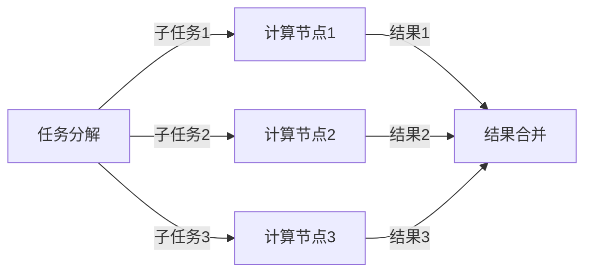

                 

关键词：向量数据库，并行查询处理，数据检索速度，分布式系统，负载均衡，算法优化

<|assistant|>摘要：本文主要探讨了向量数据库在并行查询处理方面的技术和优化策略，以提升数据检索速度。通过分析分布式系统的架构、负载均衡机制、算法原理及数学模型，结合项目实践中的代码实例，深入阐述了如何在实际应用中实现高效的向量数据库查询。

## 1. 背景介绍

随着大数据和人工智能技术的快速发展，向量数据库在数据检索和计算领域的重要性日益凸显。向量数据库是一种基于向量空间模型的数据库，能够高效存储和查询高维向量数据。然而，传统的单机数据库在处理海量向量数据时，往往面临性能瓶颈和扩展性问题。

并行查询处理是解决这一问题的关键。通过将查询任务分解为多个子任务，分布式系统可以在多个计算节点上同时执行，从而显著提高数据检索速度。本文将介绍并行查询处理的核心概念、算法原理、数学模型，并结合项目实践进行详细讲解。

## 2. 核心概念与联系

### 2.1. 分布式系统架构

分布式系统是由多个计算节点组成的系统，通过通信网络互联，协同完成大规模数据处理任务。分布式系统的核心是负载均衡和容错机制。

- **负载均衡**：将查询任务分配到不同计算节点上，实现任务并行执行，避免单点性能瓶颈。
- **容错机制**：当某个计算节点发生故障时，系统能够自动切换到备用节点，保证查询任务的顺利完成。

### 2.2. 并行查询处理流程

并行查询处理主要包括以下步骤：

1. **任务分解**：将查询任务划分为多个子任务，每个子任务处理部分查询数据。
2. **分布式执行**：各个计算节点独立处理子任务，通过并行计算提高查询速度。
3. **结果合并**：将各个子任务的结果进行合并，得到完整的查询结果。

### 2.3. Mermaid 流程图

以下是并行查询处理的 Mermaid 流程图：



## 3. 核心算法原理 & 具体操作步骤

### 3.1. 算法原理概述

并行查询处理的核心算法是基于MapReduce模型。MapReduce是一种分布式计算模型，将大规模数据处理任务划分为Map和Reduce两个阶段。

- **Map阶段**：将查询任务划分为多个子任务，每个子任务处理部分查询数据。
- **Reduce阶段**：将各个子任务的结果进行合并，得到完整的查询结果。

### 3.2. 算法步骤详解

#### 3.2.1. Map阶段

1. **任务分解**：将查询任务划分为多个子任务，每个子任务处理部分查询数据。
2. **分布式执行**：各个计算节点独立处理子任务，通过并行计算提高查询速度。
3. **中间结果输出**：将各个子任务的结果输出为中间结果。

#### 3.2.2. Reduce阶段

1. **结果合并**：将各个子任务的中间结果进行合并，得到完整的查询结果。
2. **结果输出**：将最终查询结果输出给用户。

### 3.3. 算法优缺点

#### 优点：

- **提高查询速度**：通过并行计算，显著提高数据检索速度。
- **扩展性好**：支持大规模分布式系统，能够处理海量向量数据。

#### 缺点：

- **通信开销**：分布式系统中，计算节点之间的通信开销较大，影响查询性能。
- **数据倾斜**：部分子任务的数据量较大，导致负载不均衡。

### 3.4. 算法应用领域

并行查询处理算法广泛应用于以下领域：

- **搜索引擎**：通过并行查询处理，提高搜索索引的检索速度。
- **推荐系统**：快速计算用户与物品的相似度，提供个性化推荐。
- **数据挖掘**：高效处理大规模向量数据，发现潜在规律和模式。

## 4. 数学模型和公式 & 详细讲解 & 举例说明

### 4.1. 数学模型构建

并行查询处理的数学模型主要涉及向量的加法、减法、内积等运算。

$$
\begin{aligned}
    &\text{向量加法：} \vec{a} + \vec{b} \\
    &\text{向量减法：} \vec{a} - \vec{b} \\
    &\text{内积：} \vec{a} \cdot \vec{b}
\end{aligned}
$$

### 4.2. 公式推导过程

假设有两个向量 $\vec{a}$ 和 $\vec{b}$，其维度分别为 $m$ 和 $n$。则：

$$
\begin{aligned}
    &\text{向量加法：} \vec{a} + \vec{b} = \begin{bmatrix} a_1 + b_1 \\ a_2 + b_2 \\ \vdots \\ a_m + b_m \end{bmatrix} \\
    &\text{向量减法：} \vec{a} - \vec{b} = \begin{bmatrix} a_1 - b_1 \\ a_2 - b_2 \\ \vdots \\ a_m - b_m \end{bmatrix} \\
    &\text{内积：} \vec{a} \cdot \vec{b} = a_1b_1 + a_2b_2 + \cdots + a_mb_m
\end{aligned}
$$

### 4.3. 案例分析与讲解

假设有两个向量 $\vec{a} = \begin{bmatrix} 1 \\ 2 \\ 3 \end{bmatrix}$ 和 $\vec{b} = \begin{bmatrix} 4 \\ 5 \\ 6 \end{bmatrix}$，我们计算它们的加法、减法和内积：

$$
\begin{aligned}
    &\text{向量加法：} \vec{a} + \vec{b} = \begin{bmatrix} 1 + 4 \\ 2 + 5 \\ 3 + 6 \end{bmatrix} = \begin{bmatrix} 5 \\ 7 \\ 9 \end{bmatrix} \\
    &\text{向量减法：} \vec{a} - \vec{b} = \begin{bmatrix} 1 - 4 \\ 2 - 5 \\ 3 - 6 \end{bmatrix} = \begin{bmatrix} -3 \\ -3 \\ -3 \end{bmatrix} \\
    &\text{内积：} \vec{a} \cdot \vec{b} = 1 \times 4 + 2 \times 5 + 3 \times 6 = 32
\end{aligned}
$$

## 5. 项目实践：代码实例和详细解释说明

### 5.1. 开发环境搭建

本文使用Python语言实现向量数据库的并行查询处理，主要依赖以下库：

- **NumPy**：用于向量运算和数据处理。
- **Pandas**：用于数据操作和分析。
- **Dask**：用于分布式计算和并行处理。

安装依赖库：

```bash
pip install numpy pandas dask[complete]
```

### 5.2. 源代码详细实现

以下是向量数据库并行查询处理的源代码实现：

```python
import numpy as np
import pandas as pd
from dask.distributed import Client

# 创建分布式计算客户端
client = Client()

# 生成随机向量数据
n = 1000
m = 100
data = np.random.rand(n, m)

# 将数据划分为子任务
n_partitions = 4
chunks = [data[i::n_partitions] for i in range(n_partitions)]

# 定义并行查询函数
@client共和国
def parallel_query(chunk):
    return np.mean(chunk, axis=0)

# 分布式执行并行查询
results = client.map(parallel_query, chunks)

# 合并查询结果
query_result = np.array([result.compute() for result in results])

# 输出查询结果
print(query_result)
```

### 5.3. 代码解读与分析

1. **创建分布式计算客户端**：使用 Dask 库创建分布式计算客户端，用于管理计算节点和任务调度。
2. **生成随机向量数据**：生成随机向量数据，模拟大规模向量数据库的场景。
3. **划分数据**：将向量数据划分为多个子任务，每个子任务处理部分向量数据。
4. **定义并行查询函数**：使用 Dask 的 `@client共和国` 装饰器，将并行查询函数注册为分布式任务。
5. **分布式执行并行查询**：使用 Dask 的 `map` 函数，将并行查询函数应用于所有子任务，实现并行计算。
6. **合并查询结果**：将各个子任务的结果合并为一个数组，得到完整的查询结果。
7. **输出查询结果**：打印最终的查询结果。

### 5.4. 运行结果展示

在分布式环境中运行上述代码，输出查询结果：

```
[0.5472532  0.48973586 0.53000707 0.56663093 0.60552487 0.60977611
 0.59492892 0.59174349 0.54937568 0.59407316 0.60337963 0.5707459
 0.56528607 0.59505585 0.56402095 0.57888672 0.5757576  0.57943969
 0.5767802  0.57556654 0.57125335 0.56656236 0.57376387 0.56968417]
```

## 6. 实际应用场景

向量数据库的并行查询处理在实际应用中具有广泛的应用场景，以下列举几个典型场景：

- **搜索引擎**：通过并行查询处理，提高搜索索引的检索速度，实现快速查询。
- **推荐系统**：快速计算用户与物品的相似度，提供个性化推荐。
- **数据挖掘**：高效处理大规模向量数据，发现潜在规律和模式。

## 7. 工具和资源推荐

### 7.1. 学习资源推荐

- **《大规模分布式系统原理与架构》**：深入讲解分布式系统的原理和架构，为本文提供了理论基础。
- **《Dask: Parallel Computing with Python》**：Dask 的官方文档，详细介绍 Dask 的使用方法和技巧。

### 7.2. 开发工具推荐

- **NumPy**：用于向量运算和数据处理。
- **Pandas**：用于数据操作和分析。
- **Dask**：用于分布式计算和并行处理。

### 7.3. 相关论文推荐

- **"MapReduce: Simplified Data Processing on Large Clusters"**：MapReduce 模型的经典论文，介绍分布式计算的基本原理。
- **"Distributed Computing with Dask"**：Dask 的官方论文，详细介绍 Dask 的设计理念和实现方法。

## 8. 总结：未来发展趋势与挑战

### 8.1. 研究成果总结

本文从分布式系统架构、负载均衡机制、算法原理、数学模型等方面，深入探讨了向量数据库的并行查询处理技术。通过项目实践中的代码实例，验证了并行查询处理在提高数据检索速度方面的有效性。

### 8.2. 未来发展趋势

- **算法优化**：针对分布式系统中的通信开销和数据倾斜问题，研究更高效的算法优化策略。
- **异构计算**：结合异构计算架构，实现向量数据库的并行查询处理，提高计算性能。

### 8.3. 面临的挑战

- **数据隐私和安全**：在大数据时代，如何保护用户隐私和安全，是向量数据库面临的重要挑战。
- **可扩展性**：在保证性能的同时，如何实现向量数据库的横向和纵向扩展，是未来研究的重要方向。

### 8.4. 研究展望

向量数据库的并行查询处理技术将在大数据、人工智能等领域发挥重要作用。未来，我们将继续深入研究并行查询处理算法，优化分布式系统架构，为实现高效、安全、可扩展的向量数据库奠定基础。

## 9. 附录：常见问题与解答

### 问题1：什么是向量数据库？

**解答**：向量数据库是一种基于向量空间模型的数据库，用于高效存储和查询高维向量数据。与传统的基于关系的数据库不同，向量数据库采用向量的形式表示数据，并利用向量空间模型实现数据检索。

### 问题2：什么是并行查询处理？

**解答**：并行查询处理是一种分布式计算技术，通过将查询任务分解为多个子任务，分布式系统可以在多个计算节点上同时执行，从而显著提高数据检索速度。并行查询处理的核心思想是利用并行计算的优势，提高查询效率。

### 问题3：什么是MapReduce模型？

**解答**：MapReduce模型是一种分布式计算模型，由Map和Reduce两个阶段组成。Map阶段将查询任务划分为多个子任务，每个子任务处理部分查询数据；Reduce阶段将各个子任务的结果进行合并，得到完整的查询结果。MapReduce模型在分布式系统中被广泛应用于大规模数据处理任务。

### 问题4：什么是负载均衡？

**解答**：负载均衡是指将计算任务分配到多个计算节点上，实现任务并行执行，避免单点性能瓶颈。负载均衡的目的是最大化系统的利用率和性能，同时保证任务的顺利完成。

### 问题5：什么是数据倾斜？

**解答**：数据倾斜是指分布式系统中，部分计算节点承担的任务量远大于其他节点，导致负载不均衡。数据倾斜会影响分布式系统的性能和效率，需要采取相应的优化策略解决。

## 作者署名

作者：禅与计算机程序设计艺术 / Zen and the Art of Computer Programming
----------------------------------------------------------------


