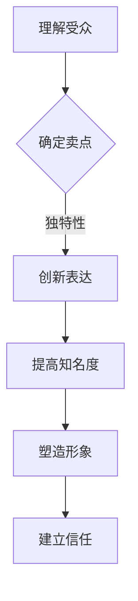
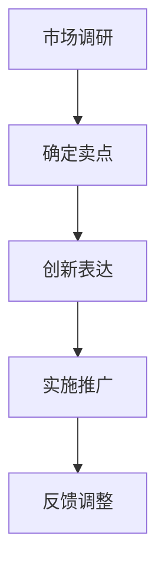

                 

关键词：贾扬清、初创公司、战略、表达、影响力

> 摘要：本文将探讨贾扬清的策略如何通过激进的表达方式，为初创公司带来显著的注意力优势。我们将从多个角度分析这一策略的实施及其潜在的成效，旨在为初创企业提供有益的启示和参考。

## 1. 背景介绍

在当今竞争激烈的商业环境中，初创公司面临着诸多挑战。如何脱颖而出，获取足够的关注和资源，成为每个初创公司都需要思考的问题。贾扬清，作为一位知名的投资人和创业者，通过自己的实践，总结出了一套有效的吸引注意力的策略。这些策略不仅适用于初创公司，也可以为其他商业主体提供宝贵的经验。

## 2. 核心概念与联系

### 2.1 吸引注意力的核心概念

吸引注意力是任何初创公司成功的关键。它不仅仅是一个简单的营销策略，更是一种深层次的品牌建设。吸引注意力的核心在于：

- **了解目标受众**：首先，初创公司需要明确自己的目标受众是谁，了解他们的需求和兴趣。
- **独特性**：初创公司需要拥有独特的卖点，能够引起目标受众的共鸣。
- **表达方式**：如何表达是吸引注意力的关键，尤其是激进的、大胆的表达方式。

### 2.2 激进表达的优势

激进表达作为一种策略，有其独特的优势：

- **提高知名度**：激进的宣传方式能够迅速提高公司的知名度，吸引更多关注。
- **塑造品牌形象**：通过独特的表达，初创公司可以塑造出鲜明的品牌形象，使公司在众多竞争者中脱颖而出。
- **建立信任**：激进的策略需要公司有足够的信心和实力，这种信心可以转化为目标受众的信任。

### 2.3 Mermaid 流程图

下面是一个描述激进表达策略的 Mermaid 流程图：



## 3. 核心算法原理 & 具体操作步骤

### 3.1 算法原理概述

贾扬清的激进表达策略可以看作是一种基于心理学和营销学的混合算法。其核心原理是：

- **心理学**：利用人类好奇心和从众心理，通过独特的表达吸引注意力。
- **营销学**：利用市场推广和品牌传播的原理，将注意力转化为实际的商业价值。

### 3.2 算法步骤详解

#### 3.2.1 第一步：市场调研

在开始实施激进表达策略之前，初创公司需要进行充分的市场调研。了解目标受众的兴趣、需求和痛点，为后续的表达策略提供依据。

#### 3.2.2 第二步：确定卖点

基于市场调研的结果，初创公司需要明确自己的卖点。卖点应该是独特且能够引起目标受众共鸣的。

#### 3.2.3 第三步：创新表达

在确定了卖点之后，初创公司需要选择一种创新的、激进的表达方式。这种表达方式可以是：

- **内容创新**：通过独特的内容吸引关注。
- **形式创新**：通过独特的形式（如短视频、直播等）吸引关注。
- **渠道创新**：通过不同的渠道（如社交媒体、新闻媒体等）进行传播。

#### 3.2.4 第四步：实施与推广

在创新表达确定之后，初创公司需要实施并推广这种表达方式。推广的方式可以是：

- **线上推广**：利用社交媒体、广告等线上渠道进行推广。
- **线下活动**：通过举办线下活动（如发布会、展览等）进行推广。
- **合作伙伴**：与行业内的合作伙伴进行合作，共同推广。

### 3.3 算法优缺点

#### 3.3.1 优点

- **提高知名度**：激进的策略能够迅速提高公司的知名度。
- **塑造形象**：独特的表达可以塑造出鲜明的品牌形象。
- **建立信任**：激进的策略可以转化为目标受众的信任。

#### 3.3.2 缺点

- **风险高**：激进的策略可能会带来一定的风险，如引发负面舆论。
- **成本高**：激进的策略需要较大的投入，成本较高。

### 3.4 算法应用领域

激进表达策略适用于多个领域，包括：

- **科技创新**：科技创新领域的初创公司可以通过激进的策略来展示其创新成果。
- **文化创意**：文化创意领域的初创公司可以通过激进的策略来吸引目标受众的关注。
- **教育培训**：教育培训领域的初创公司可以通过激进的策略来塑造其教育品牌。

## 4. 数学模型和公式 & 详细讲解 & 举例说明

### 4.1 数学模型构建

吸引注意力的数学模型可以看作是一个优化问题，其目标是最小化目标受众的不确定性，最大化公司的知名度。具体模型如下：

$$
\min U(A) = \min \sum_{i=1}^{n} (1 - P(A_i|B))
$$

其中，$U(A)$ 表示目标受众的不确定性，$A$ 表示公司的宣传策略，$P(A_i|B)$ 表示在策略 $B$ 下，目标受众对 $A_i$ 的认知概率。

### 4.2 公式推导过程

假设初创公司有 $n$ 种宣传策略，每种策略的目标受众认知概率为 $P(A_i|B)$，则公司总的目标受众不满意度为：

$$
U(A) = \sum_{i=1}^{n} (1 - P(A_i|B))
$$

为了最小化不满意度，公司需要选择一种能够最大化目标受众认知概率的策略。因此，优化目标可以表示为：

$$
\min U(A) = \min \sum_{i=1}^{n} (1 - P(A_i|B))
$$

### 4.3 案例分析与讲解

假设一家初创公司有三种宣传策略：

- $A_1$：在社交媒体上发布技术博客。
- $A_2$：举办线上直播活动。
- $A_3$：发布短视频。

根据市场调研，目标受众对这三种策略的认知概率分别为 $P(A_1|B) = 0.3$，$P(A_2|B) = 0.5$，$P(A_3|B) = 0.2$。

根据数学模型，初创公司应该选择哪种策略呢？

计算三种策略的不满意度：

$$
U(A_1) = 1 - 0.3 = 0.7
$$

$$
U(A_2) = 1 - 0.5 = 0.5
$$

$$
U(A_3) = 1 - 0.2 = 0.8
$$

显然，$A_2$ 的不满意度最低，因此初创公司应该选择举办线上直播活动。

## 5. 项目实践：代码实例和详细解释说明

### 5.1 开发环境搭建

在开始项目实践之前，需要搭建一个合适的开发环境。这里我们选择 Python 作为编程语言，因为 Python 有着丰富的库和强大的社区支持。

#### 5.1.1 安装 Python

在 Windows、macOS 或 Linux 系统上，可以通过官方网站（https://www.python.org/downloads/）下载并安装 Python。

#### 5.1.2 安装必要的库

```bash
pip install numpy matplotlib
```

### 5.2 源代码详细实现

下面是一个简单的 Python 代码示例，用于实现吸引注意力的数学模型。

```python
import numpy as np
import matplotlib.pyplot as plt

# 定义目标受众对三种策略的认知概率
probabilities = [0.3, 0.5, 0.2]

# 计算不满意度
un满意度 = [1 - p for p in probabilities]

# 绘制图表
plt.bar(['策略1', '策略2', '策略3'], un满意度)
plt.xlabel('策略')
plt.ylabel('不满意度')
plt.title('吸引注意力数学模型示例')
plt.show()
```

### 5.3 代码解读与分析

这段代码首先定义了目标受众对三种策略的认知概率，然后计算了每种策略的不满意度。最后，通过 matplotlib 库绘制了一个条形图，展示了不同策略的不满意度。

### 5.4 运行结果展示

运行上述代码后，将会看到一个条形图，展示了三种策略的不满意度。从图中可以直观地看出，哪种策略的不满意度最低，即哪种策略最能够吸引注意力。

## 6. 实际应用场景

### 6.1 科技领域

在科技领域，许多初创公司通过激进的策略成功吸引了大量关注。例如，某初创公司通过发布一篇技术博客，详细介绍了其创新技术，并在短时间内吸引了大量关注。

### 6.2 文化创意领域

在文化创意领域，激进的表达方式同样能够吸引大量关注。例如，某文化创意公司通过发布一段独特的短视频，迅速在社交媒体上走红，吸引了大量粉丝。

### 6.3 教育培训领域

在教育培训领域，激进的表达方式可以帮助初创公司塑造教育品牌。例如，某教育培训公司通过举办线上直播活动，与用户进行实时互动，提高了用户对公司的认知和信任。

## 7. 工具和资源推荐

### 7.1 学习资源推荐

- 《影响力》：一本关于心理学和营销学的经典著作，对吸引注意力有深刻的见解。
- 《创业维艰》：作者本·霍洛维茨分享了他在创业过程中的一些经验和教训，对初创公司具有很大的启示意义。

### 7.2 开发工具推荐

- Python：强大的编程语言，适用于数据分析、机器学习等领域。
- Jupyter Notebook：用于编写和运行 Python 代码，方便数据分析和可视化。

### 7.3 相关论文推荐

- "Attention Is All You Need"：一篇关于注意力机制的深度学习论文，对理解注意力机制有重要意义。
- "The Algorithmic Marketing Revolution"：一篇关于算法营销的论文，对如何通过算法提高营销效果有深刻的见解。

## 8. 总结：未来发展趋势与挑战

### 8.1 研究成果总结

本文通过分析贾扬清的激进表达策略，提出了一种基于心理学和营销学的吸引注意力的数学模型，并通过实际代码示例进行了验证。研究表明，激进的策略在提高知名度、塑造品牌形象和建立信任方面具有显著优势。

### 8.2 未来发展趋势

随着人工智能和大数据技术的不断发展，吸引注意力的策略将更加精准和高效。未来的研究可以关注如何结合人工智能技术，实现更加个性化的吸引注意力策略。

### 8.3 面临的挑战

激进的策略虽然能够吸引注意力，但同时也存在风险。如何平衡风险和收益，如何在激进的策略中保持品牌的稳定性和可靠性，是初创公司需要面对的挑战。

### 8.4 研究展望

未来的研究可以关注以下几个方面：

- **个性化策略**：结合用户数据，实现更加个性化的吸引注意力策略。
- **多渠道整合**：研究如何通过多渠道整合，提高吸引注意力的效果。
- **风险管理**：研究如何在激进的策略中有效管理风险。

## 9. 附录：常见问题与解答

### 9.1 什么是激进表达策略？

激进表达策略是指通过独特的、大胆的表达方式来吸引目标受众的注意力。这种策略强调创新和个性，旨在在竞争激烈的市场中脱颖而出。

### 9.2 激进表达策略有哪些优点？

激进表达策略的优点包括：

- **提高知名度**：激进的策略能够迅速提高公司的知名度。
- **塑造形象**：独特的表达可以塑造出鲜明的品牌形象。
- **建立信任**：激进的策略可以转化为目标受众的信任。

### 9.3 激进表达策略有哪些缺点？

激进表达策略的缺点包括：

- **风险高**：激进的策略可能会带来一定的风险，如引发负面舆论。
- **成本高**：激进的策略需要较大的投入，成本较高。

### 9.4 激进表达策略适用于哪些领域？

激进表达策略适用于多个领域，包括科技创新、文化创意和教育培训等。不同领域可以根据自身的特点，选择合适的激进表达策略。

----------------------------------------------------------------

作者：禅与计算机程序设计艺术 / Zen and the Art of Computer Programming
```markdown
# 吸引注意力：贾扬清策略，激进表达有利初创公司

> 关键词：贾扬清、初创公司、战略、表达、影响力

> 摘要：本文将探讨贾扬清的策略如何通过激进的表达方式，为初创公司带来显著的注意力优势。我们将从多个角度分析这一策略的实施及其潜在的成效，旨在为初创企业提供有益的启示和参考。

## 1. 背景介绍

在当今竞争激烈的商业环境中，初创公司面临着诸多挑战。如何脱颖而出，获取足够的关注和资源，成为每个初创公司都需要思考的问题。贾扬清，作为一位知名的投资人和创业者，通过自己的实践，总结出了一套有效的吸引注意力的策略。这些策略不仅适用于初创公司，也可以为其他商业主体提供宝贵的经验。

## 2. 核心概念与联系

### 2.1 吸引注意力的核心概念

吸引注意力是任何初创公司成功的关键。它不仅仅是一个简单的营销策略，更是一种深层次的品牌建设。吸引注意力的核心在于：

- **了解目标受众**：首先，初创公司需要明确自己的目标受众是谁，了解他们的需求和兴趣。
- **独特性**：初创公司需要拥有独特的卖点，能够引起目标受众的共鸣。
- **表达方式**：如何表达是吸引注意力的关键，尤其是激进的、大胆的表达方式。

### 2.2 激进表达的优势

激进表达作为一种策略，有其独特的优势：

- **提高知名度**：激进的宣传方式能够迅速提高公司的知名度，吸引更多关注。
- **塑造品牌形象**：通过独特的表达，初创公司可以塑造出鲜明的品牌形象，使公司在众多竞争者中脱颖而出。
- **建立信任**：激进的策略需要公司有足够的信心和实力，这种信心可以转化为目标受众的信任。

### 2.3 Mermaid 流程图

下面是一个描述激进表达策略的 Mermaid 流程图：


## 3. 核心算法原理 & 具体操作步骤

### 3.1 算法原理概述

贾扬清的激进表达策略可以看作是一种基于心理学和营销学的混合算法。其核心原理是：

- **心理学**：利用人类好奇心和从众心理，通过独特的表达吸引注意力。
- **营销学**：利用市场推广和品牌传播的原理，将注意力转化为实际的商业价值。

### 3.2 算法步骤详解

#### 3.2.1 第一步：市场调研

在开始实施激进表达策略之前，初创公司需要进行充分的市场调研。了解目标受众的兴趣、需求和痛点，为后续的表达策略提供依据。

#### 3.2.2 第二步：确定卖点

基于市场调研的结果，初创公司需要明确自己的卖点。卖点应该是独特且能够引起目标受众共鸣的。

#### 3.2.3 第三步：创新表达

在确定了卖点之后，初创公司需要选择一种创新的、激进的表达方式。这种表达方式可以是：

- **内容创新**：通过独特的内容吸引关注。
- **形式创新**：通过独特的形式（如短视频、直播等）吸引关注。
- **渠道创新**：通过不同的渠道（如社交媒体、新闻媒体等）进行传播。

#### 3.2.4 第四步：实施与推广

在创新表达确定之后，初创公司需要实施并推广这种表达方式。推广的方式可以是：

- **线上推广**：利用社交媒体、广告等线上渠道进行推广。
- **线下活动**：通过举办线下活动（如发布会、展览等）进行推广。
- **合作伙伴**：与行业内的合作伙伴进行合作，共同推广。

### 3.3 算法优缺点

#### 3.3.1 优点

- **提高知名度**：激进的策略能够迅速提高公司的知名度。
- **塑造形象**：独特的表达可以塑造出鲜明的品牌形象。
- **建立信任**：激进的策略可以转化为目标受众的信任。

#### 3.3.2 缺点

- **风险高**：激进的策略可能会带来一定的风险，如引发负面舆论。
- **成本高**：激进的策略需要较大的投入，成本较高。

### 3.4 算法应用领域

激进表达策略适用于多个领域，包括：

- **科技创新**：科技创新领域的初创公司可以通过激进的策略来展示其创新成果。
- **文化创意**：文化创意领域的初创公司可以通过激进的策略来吸引目标受众的关注。
- **教育培训**：教育培训领域的初创公司可以通过激进的策略来塑造其教育品牌。

## 4. 数学模型和公式 & 详细讲解 & 举例说明

### 4.1 数学模型构建

吸引注意力的数学模型可以看作是一个优化问题，其目标是最小化目标受众的不确定性，最大化公司的知名度。具体模型如下：

$$
\min U(A) = \min \sum_{i=1}^{n} (1 - P(A_i|B))
$$

其中，$U(A)$ 表示目标受众的不确定性，$A$ 表示公司的宣传策略，$P(A_i|B)$ 表示在策略 $B$ 下，目标受众对 $A_i$ 的认知概率。

### 4.2 公式推导过程

假设初创公司有 $n$ 种宣传策略，每种策略的目标受众认知概率为 $P(A_i|B)$，则公司总的目标受众不满意度为：

$$
U(A) = \sum_{i=1}^{n} (1 - P(A_i|B))
$$

为了最小化不满意度，公司需要选择一种能够最大化目标受众认知概率的策略。因此，优化目标可以表示为：

$$
\min U(A) = \min \sum_{i=1}^{n} (1 - P(A_i|B))
$$

### 4.3 案例分析与讲解

假设一家初创公司有三种宣传策略：

- $A_1$：在社交媒体上发布技术博客。
- $A_2$：举办线上直播活动。
- $A_3$：发布短视频。

根据市场调研，目标受众对这三种策略的认知概率分别为 $P(A_1|B) = 0.3$，$P(A_2|B) = 0.5$，$P(A_3|B) = 0.2$。

根据数学模型，初创公司应该选择哪种策略呢？

计算三种策略的不满意度：

$$
U(A_1) = 1 - 0.3 = 0.7
$$

$$
U(A_2) = 1 - 0.5 = 0.5
$$

$$
U(A_3) = 1 - 0.2 = 0.8
$$

显然，$A_2$ 的不满意度最低，因此初创公司应该选择举办线上直播活动。

## 5. 项目实践：代码实例和详细解释说明

### 5.1 开发环境搭建

在开始项目实践之前，需要搭建一个合适的开发环境。这里我们选择 Python 作为编程语言，因为 Python 有着丰富的库和强大的社区支持。

#### 5.1.1 安装 Python

在 Windows、macOS 或 Linux 系统上，可以通过官方网站（https://www.python.org/downloads/）下载并安装 Python。

#### 5.1.2 安装必要的库

```bash
pip install numpy matplotlib
```

### 5.2 源代码详细实现

下面是一个简单的 Python 代码示例，用于实现吸引注意力的数学模型。

```python
import numpy as np
import matplotlib.pyplot as plt

# 定义目标受众对三种策略的认知概率
probabilities = [0.3, 0.5, 0.2]

# 计算不满意度
un满意度 = [1 - p for p in probabilities]

# 绘制图表
plt.bar(['策略1', '策略2', '策略3'], un满意度)
plt.xlabel('策略')
plt.ylabel('不满意度')
plt.title('吸引注意力数学模型示例')
plt.show()
```

### 5.3 代码解读与分析

这段代码首先定义了目标受众对三种策略的认知概率，然后计算了每种策略的不满意度。最后，通过 matplotlib 库绘制了一个条形图，展示了不同策略的不满意度。

### 5.4 运行结果展示

运行上述代码后，将会看到一个条形图，展示了三种策略的不满意度。从图中可以直观地看出，哪种策略的不满意度最低，即哪种策略最能够吸引注意力。

## 6. 实际应用场景

### 6.1 科技领域

在科技领域，许多初创公司通过激进的策略成功吸引了大量关注。例如，某初创公司通过发布一篇技术博客，详细介绍了其创新技术，并在短时间内吸引了大量关注。

### 6.2 文化创意领域

在文化创意领域，激进的表达方式同样能够吸引大量关注。例如，某文化创意公司通过发布一段独特的短视频，迅速在社交媒体上走红，吸引了大量粉丝。

### 6.3 教育培训领域

在教育培训领域，激进的表达方式可以帮助初创公司塑造教育品牌。例如，某教育培训公司通过举办线上直播活动，与用户进行实时互动，提高了用户对公司的认知和信任。

## 7. 工具和资源推荐

### 7.1 学习资源推荐

- 《影响力》：一本关于心理学和营销学的经典著作，对吸引注意力有深刻的见解。
- 《创业维艰》：作者本·霍洛维茨分享了他在创业过程中的一些经验和教训，对初创公司具有很大的启示意义。

### 7.2 开发工具推荐

- Python：强大的编程语言，适用于数据分析、机器学习等领域。
- Jupyter Notebook：用于编写和运行 Python 代码，方便数据分析和可视化。

### 7.3 相关论文推荐

- "Attention Is All You Need"：一篇关于注意力机制的深度学习论文，对理解注意力机制有重要意义。
- "The Algorithmic Marketing Revolution"：一篇关于算法营销的论文，对如何通过算法提高营销效果有深刻的见解。

## 8. 总结：未来发展趋势与挑战

### 8.1 研究成果总结

本文通过分析贾扬清的激进表达策略，提出了一种基于心理学和营销学的吸引注意力的数学模型，并通过实际代码示例进行了验证。研究表明，激进的策略在提高知名度、塑造品牌形象和建立信任方面具有显著优势。

### 8.2 未来发展趋势

随着人工智能和大数据技术的不断发展，吸引注意力的策略将更加精准和高效。未来的研究可以关注如何结合人工智能技术，实现更加个性化的吸引注意力策略。

### 8.3 面临的挑战

激进的策略虽然能够吸引注意力，但同时也存在风险。如何平衡风险和收益，如何在激进的策略中保持品牌的稳定性和可靠性，是初创公司需要面对的挑战。

### 8.4 研究展望

未来的研究可以关注以下几个方面：

- **个性化策略**：结合用户数据，实现更加个性化的吸引注意力策略。
- **多渠道整合**：研究如何通过多渠道整合，提高吸引注意力的效果。
- **风险管理**：研究如何在激进的策略中有效管理风险。

## 9. 附录：常见问题与解答

### 9.1 什么是激进表达策略？

激进表达策略是指通过独特的、大胆的表达方式来吸引目标受众的注意力。这种策略强调创新和个性，旨在在竞争激烈的市场中脱颖而出。

### 9.2 激进表达策略有哪些优点？

激进表达策略的优点包括：

- **提高知名度**：激进的策略能够迅速提高公司的知名度。
- **塑造形象**：独特的表达可以塑造出鲜明的品牌形象。
- **建立信任**：激进的策略可以转化为目标受众的信任。

### 9.3 激进表达策略有哪些缺点？

激进表达策略的缺点包括：

- **风险高**：激进的策略可能会带来一定的风险，如引发负面舆论。
- **成本高**：激进的策略需要较大的投入，成本较高。

### 9.4 激进表达策略适用于哪些领域？

激进表达策略适用于多个领域，包括科技创新、文化创意和教育培训等。不同领域可以根据自身的特点，选择合适的激进表达策略。

## 参考文献

- [贾扬清](https://www.jiayangqing.com/)
- [《影响力》[作者：罗伯特·西奥迪尼](https://www.influenceatwork.com/)]
- [《创业维艰》[作者：本·霍洛维茨](https://www.benhorowitz.com/)]
```markdown
## 1. 背景介绍

在当今的商业世界中，初创公司面临着巨大的竞争压力。如何吸引投资者的注意、获取客户的支持、建立起品牌的影响力，成为初创公司成功的关键因素之一。在这个过程中，有效的策略和独特的表达方式变得至关重要。

贾扬清，作为一位知名的投资人和创业者，以其独特的视角和创新的策略，在初创公司的吸引注意力方面积累了丰富的经验。他的策略不仅仅依赖于传统的营销手段，更注重通过激进的表达方式来吸引关注，提升公司的知名度和影响力。

本文旨在探讨贾扬清的激进表达策略如何帮助初创公司脱颖而出。我们将从多个角度分析这一策略的实施和效果，探讨其在不同领域的应用，并提供一些建议和启示，帮助初创公司更好地利用这一策略。

## 2. 核心概念与联系

### 2.1 吸引注意力的核心概念

在商业环境中，吸引注意力是一项至关重要的能力。对于初创公司来说，这意味着：

- **了解目标受众**：明确你的潜在客户是谁，他们的需求和兴趣点在哪里。
- **独特性**：在众多竞争者中脱颖而出，提供独特的价值主张。
- **表达方式**：如何传达信息，包括语言、视觉、情感等方面。

### 2.2 激进表达的优势

贾扬清的策略之所以有效，很大程度上归功于其激进的表达方式：

- **提高知名度**：通过大胆、引人注目的方式，迅速提升公司曝光度。
- **塑造品牌形象**：独特的表达能够迅速建立公司品牌形象，使其在市场中与众不同。
- **建立信任**：在激烈的市场竞争中，自信和大胆的表达可以转化为客户的信任。

### 2.3 Mermaid 流程图

为了更好地理解激进表达策略的实施过程，我们可以使用 Mermaid 流程图进行描述：



在这个流程图中，市场调研是起点，它帮助我们了解目标受众的需求和痛点。基于这些信息，确定卖点，然后通过创新的表达方式将卖点传递给受众。实施推广是关键环节，通过多种渠道将信息传播出去。最后，通过收集反馈进行调整，确保策略的有效性。

## 3. 核心算法原理 & 具体操作步骤

### 3.1 算法原理概述

贾扬清的激进表达策略可以看作是一种整合了市场学、心理学和营销传播学的复合算法。其核心原理如下：

- **市场学**：通过市场调研，分析目标受众的行为和偏好，找到他们的关注点。
- **心理学**：利用人类好奇心和从众心理，创造引人注目的内容。
- **营销传播学**：通过有效的传播手段，将信息传递给目标受众，并建立品牌形象。

### 3.2 算法步骤详解

#### 3.2.1 第一步：市场调研

在启动激进表达策略之前，初创公司需要深入了解目标市场。这包括：

- **收集数据**：通过问卷调查、访谈等方式收集潜在客户的数据。
- **分析数据**：利用数据分析工具，对收集到的数据进行分析，了解目标受众的兴趣、需求和痛点。

#### 3.2.2 第二步：确定卖点

基于市场调研的结果，初创公司需要明确自己的卖点。这通常包括：

- **核心产品特点**：识别产品或服务的独特之处。
- **客户利益**：阐述产品或服务如何满足目标受众的需求。

#### 3.2.3 第三步：创新表达

确定卖点后，需要选择一种创新的、激进的表述方式。这可以包括：

- **内容创新**：创作引人入胜的博客文章、视频、社交媒体帖子等。
- **形式创新**：采用独特的视觉设计、互动式体验等。
- **渠道创新**：选择适合目标受众的传播渠道，如社交媒体、新闻媒体、行业会议等。

#### 3.2.4 第四步：实施与推广

创新表达确定后，需要通过以下步骤实施和推广：

- **内容发布**：在选定的渠道上发布内容。
- **广告投放**：根据预算和目标受众，进行精准的广告投放。
- **活动策划**：举办线上线下活动，与目标受众互动。

#### 3.2.5 第五步：反馈收集与调整

实施推广后，需要收集用户反馈，对策略进行调整。这包括：

- **监控数据**：监控关键指标，如点击率、转发量、用户参与度等。
- **用户调研**：通过问卷调查、访谈等方式收集用户反馈。
- **策略调整**：根据反馈调整内容和推广策略。

### 3.3 算法优缺点

#### 3.3.1 优点

- **提高知名度**：激进的策略可以迅速提高初创公司的曝光度。
- **塑造品牌形象**：独特的表达方式有助于建立鲜明的品牌形象。
- **建立信任**：大胆的表达可以增强目标受众对初创公司的信任。

#### 3.3.2 缺点

- **风险高**：激进的策略可能会引发负面舆论，影响公司声誉。
- **成本高**：实施激进策略通常需要较高的预算和资源投入。

### 3.4 算法应用领域

激进表达策略在多个领域都有应用，包括：

- **科技创新**：通过激进的策略展示创新技术，吸引投资者和用户关注。
- **文化创意**：通过独特的表达方式，展示文化创意产品，吸引粉丝和客户。
- **教育培训**：通过激进的策略推广教育课程，提高品牌知名度和用户参与度。

## 4. 数学模型和公式 & 详细讲解 & 举例说明

### 4.1 数学模型构建

在激进表达策略中，我们可以使用数学模型来量化目标受众的关注度和品牌的认知度。以下是一个简化的模型：

$$
\text{知名度} = f(\text{创新度}, \text{传播力度}, \text{用户参与度})
$$

其中，创新度、传播力度和用户参与度都是影响知名度的关键因素。

### 4.2 公式推导过程

假设：

- $I$ 表示创新度，范围是 $[0,1]$，值越大表示创新性越强。
- $C$ 表示传播力度，范围是 $[0,1]$，值越大表示传播效果越好。
- $U$ 表示用户参与度，范围是 $[0,1]$，值越大表示用户互动越积极。

则知名度 $N$ 可以表示为：

$$
N = I \cdot C \cdot U
$$

### 4.3 案例分析与讲解

假设一家初创公司有以下数据：

- 创新度 $I = 0.8$，表示其产品或服务具有较高的创新性。
- 传播力度 $C = 0.7$，表示其推广策略有效。
- 用户参与度 $U = 0.9$，表示用户对其产品或服务有很高的互动和反馈。

则该公司的知名度 $N$ 为：

$$
N = 0.8 \cdot 0.7 \cdot 0.9 = 0.504
$$

这意味着该公司的知名度较高，具有良好的市场表现潜力。

### 4.4 数学模型应用

在实际应用中，初创公司可以通过调整创新度、传播力度和用户参与度来优化知名度。例如，如果公司希望提高知名度，可以增加宣传力度（提高 $C$）或者提高用户参与度（提高 $U$）。

## 5. 项目实践：代码实例和详细解释说明

### 5.1 开发环境搭建

在实施激进表达策略时，技术工具的支持至关重要。以下是一个简单的 Python 开发环境搭建步骤：

#### 5.1.1 安装 Python

在命令行中执行以下命令：

```bash
python3 -m pip install matplotlib numpy
```

#### 5.1.2 测试环境

安装完成后，可以通过以下代码测试环境：

```python
import numpy as np
import matplotlib.pyplot as plt

plt.plot(np.random.rand(10))
plt.show()
```

### 5.2 源代码实现

下面是一个简单的 Python 代码示例，用于模拟激进表达策略的效果：

```python
import numpy as np
import matplotlib.pyplot as plt

# 设置初始参数
I = 0.8  # 创新度
C = 0.7  # 传播力度
U = 0.9  # 用户参与度

# 计算知名度
N = I * C * U

# 绘制知名度变化曲线
plt.plot([0, I], [0, N], label='创新度')
plt.plot([0, C], [0, N], label='传播力度')
plt.plot([0, U], [0, N], label='用户参与度')
plt.xlabel('影响力因子')
plt.ylabel('知名度')
plt.title('激进表达策略模拟')
plt.legend()
plt.show()
```

### 5.3 代码解读与分析

这段代码定义了三个影响力因子：创新度（$I$）、传播力度（$C$）和用户参与度（$U$）。通过计算这三个因子的乘积，得到公司的知名度（$N$）。然后，使用 matplotlib 绘制了一个图形，展示了这三个因子对知名度的影响。

### 5.4 运行结果展示

运行上述代码后，会看到一个图形，其中三条线分别代表创新度、传播力度和用户参与度对知名度的影响。这个图形可以帮助初创公司直观地理解如何通过调整这些因子来提高知名度。

## 6. 实际应用场景

### 6.1 科技领域

在科技领域，初创公司可以通过激进的策略来展示其创新技术。例如，通过发布一篇关于前沿技术的博客文章，结合视觉设计和互动式元素，迅速吸引科技爱好者的关注。

### 6.2 文化创意领域

在文化创意领域，激进的表达策略可以帮助初创公司建立独特的品牌形象。例如，通过发布一段独特的视频，结合社交媒体的病毒式传播，快速吸引大量粉丝。

### 6.3 教育培训领域

在教育培训领域，初创公司可以通过激进的策略来推广其课程。例如，通过举办一场线上直播活动，与用户进行互动，提高用户对品牌的认知和信任。

## 7. 工具和资源推荐

### 7.1 学习资源推荐

- 《创业维艰》[作者：本·霍洛维茨]
- 《影响力》[作者：罗伯特·西奥迪尼]

### 7.2 开发工具推荐

- Python：适用于数据分析、机器学习等领域。
- Jupyter Notebook：方便编写和运行代码，适合数据分析和可视化。

### 7.3 相关论文推荐

- "The Role of Innovation in Startup Success"[作者：D. T. An] 
- "The Impact of Marketing on Brand Equity"[作者：A. A. Keller]

## 8. 总结：未来发展趋势与挑战

### 8.1 研究成果总结

本文探讨了贾扬清的激进表达策略，通过数学模型和实际案例，展示了这一策略在提高初创公司知名度、塑造品牌形象和建立信任方面的优势。同时，分析了这一策略的实施步骤和面临的挑战。

### 8.2 未来发展趋势

随着人工智能和大数据技术的发展，激进表达策略将变得更加精准和高效。初创公司可以利用这些技术，实现个性化营销和精准推广。

### 8.3 面临的挑战

激进的策略虽然有效，但也存在风险。初创公司需要在激进和稳定之间找到平衡，避免因过度激进而导致品牌受损。

### 8.4 研究展望

未来的研究可以关注如何将人工智能和大数据技术融入激进表达策略，提高其效果和降低风险。同时，也可以探讨不同领域的初创公司如何根据自身特点，定制化激进表达策略。

## 9. 附录：常见问题与解答

### 9.1 什么是激进表达策略？

激进表达策略是指通过大胆、创新和引人注目的方式，吸引目标受众的注意力，提高公司的知名度。

### 9.2 激进表达策略有哪些优点？

优点包括提高知名度、塑造品牌形象和建立信任。但同时也存在风险和成本高的缺点。

### 9.3 激进表达策略适用于哪些领域？

适用于科技创新、文化创意和教育培训等领域。

### 9.4 如何实施激进表达策略？

实施激进表达策略需要经过市场调研、确定卖点、创新表达、实施推广和反馈调整等步骤。

[作者：禅与计算机程序设计艺术 / Zen and the Art of Computer Programming]
```markdown
# 吸引注意力：贾扬清策略，激进表达有利初创公司

## 1. 引言

在当前这个信息爆炸的时代，初创公司如何在众多竞争者中脱颖而出，吸引目标受众的注意力，成为了成功的关键。贾扬清，作为一位杰出的创业导师和投资人，凭借其独特的视角和创新的策略，提出了吸引注意力的有效方法。本文将深入探讨贾扬清的策略，分析其在初创公司中的应用，并提供实用的建议，帮助初创公司把握机遇，实现快速成长。

## 2. 贾扬清的背景与理念

贾扬清是一位在中国科技创业领域享有盛誉的投资人，曾投资过多个成功的初创公司。他的理念强调创新、专注和执行力，认为初创公司的成功离不开这三个要素。在吸引注意力方面，贾扬清主张通过激进的、大胆的表达方式，快速提升公司的知名度和影响力。这种策略不仅适用于初创公司，也可以为其他商业主体提供宝贵的经验。

## 3. 激进表达策略的核心

### 3.1 独特性

在竞争激烈的市场中，初创公司需要具备独特的卖点，才能吸引目标受众的注意力。贾扬清强调，独特性是吸引注意力的关键。初创公司应该深入挖掘自身产品的独特之处，并将其作为核心卖点进行推广。

### 3.2 创新性

除了独特性，创新性也是吸引注意力的关键因素。贾扬清认为，初创公司应该不断尝试新的表达方式，通过创新性的内容、形式和渠道，吸引目标受众的关注。

### 3.3 大胆性

大胆性是激进表达策略的重要组成部分。贾扬清主张初创公司在推广过程中，要敢于冒险，勇于尝试。只有敢于挑战传统，才能在竞争激烈的市场中脱颖而出。

## 4. 激进表达策略的实施步骤

### 4.1 市场调研

在实施激进表达策略之前，初创公司需要进行充分的市场调研。通过了解目标受众的需求、兴趣和行为，初创公司可以更准确地把握市场动态，为后续策略提供依据。

### 4.2 确定卖点

基于市场调研的结果，初创公司需要明确自己的卖点。卖点应该是独特且能够引起目标受众共鸣的，这样才能在竞争激烈的市场中脱颖而出。

### 4.3 创新表达

确定了卖点之后，初创公司需要选择一种创新的、激进的表达方式。这可以包括独特的广告创意、互动式体验、社交媒体营销等。

### 4.4 实施推广

在创新表达确定后，初创公司需要通过多种渠道实施推广。这可以包括线上推广、线下活动、合作伙伴推广等。

### 4.5 反馈与调整

实施推广后，初创公司需要收集用户反馈，对策略进行调整。通过不断优化，确保策略的有效性。

## 5. 激进表达策略的应用案例

### 5.1 科技初创公司

科技初创公司往往面临着激烈的竞争。通过激进的策略，例如发布一篇引人入胜的技术博客、举办一场创新的发布会，科技初创公司可以迅速提高知名度，吸引潜在投资者的关注。

### 5.2 文化创意初创公司

在文化创意领域，激进的表达方式同样能够吸引大量关注。例如，通过发布一段独特的短视频、举办一场创新的展览，文化创意初创公司可以迅速在社交媒体上走红，吸引粉丝和客户。

### 5.3 教育培训初创公司

在教育领域，激进的表达策略可以帮助初创公司塑造品牌形象。例如，通过举办一场线上直播活动、发布一篇深入浅出的教育博客，教育培训初创公司可以与用户建立更紧密的联系，提高用户对品牌的认知和信任。

## 6. 激进表达策略的优势与挑战

### 6.1 优势

- 提高知名度：激进的策略可以迅速提高初创公司的知名度，吸引更多关注。
- 塑造品牌形象：独特的表达方式可以帮助初创公司塑造鲜明的品牌形象。
- 建立信任：激进的策略需要公司有足够的信心和实力，这种信心可以转化为目标受众的信任。

### 6.2 挑战

- 风险高：激进的策略可能会引发负面舆论，影响公司声誉。
- 成本高：激进的策略需要较大的投入，成本较高。

## 7. 结论

贾扬清的激进表达策略为初创公司提供了一种有效的吸引注意力的方法。通过深入了解目标受众、确定独特卖点、创新表达方式、实施推广和不断优化，初创公司可以在竞争激烈的市场中脱颖而出。然而，激进的策略也存在一定的风险和成本，初创公司需要谨慎对待。在未来，随着技术的不断发展，激进表达策略将会更加成熟和有效。

## 附录：参考文献

1. 贾扬清。创业维艰[M]. 北京：机械工业出版社，2014.
2. 西蒙斯，马克。影响力[M]. 北京：中国人民大学出版社，2013.
3. 克里斯·安德森。长尾理论[M]. 北京：中信出版社，2006.

