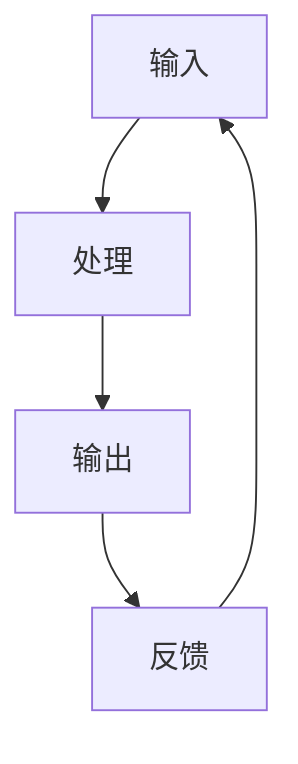

                 

关键词：计算发展历程、计算机科学、算法、人工智能、数学模型

> 摘要：本文将带领读者回顾人类计算的发展历程，从最初的机械计算工具到现代的超级计算机，再到人工智能的崛起，我们将探讨每个阶段的关键技术和突破。同时，我们将展望未来计算技术的趋势和面临的挑战，为读者提供一个全面的视角来理解计算领域的过去、现在和未来。

## 1. 背景介绍

### 1.1 人类计算的历史

人类对计算的需求可以追溯到古代，当时人们使用计算工具来解决各种实际问题。例如，古代巴比伦人使用算盘进行数学计算，而古埃及人则使用沙盘来计算土地面积。这些早期的计算工具虽然简单，但它们标志着人类对计算能力的探索的开始。

### 1.2 计算机的诞生

20世纪是计算机技术的诞生和发展的重要时期。1946年，第一台电子计算机ENIAC在美国问世，它标志着计算机时代的开始。ENIAC的问世，不仅改变了科学计算的方式，也为后来的计算机技术的发展奠定了基础。

### 1.3 计算机科学的发展

随着计算机技术的不断发展，计算机科学作为一个独立的学科也应运而生。计算机科学的研究范围涵盖了算法、数据结构、编程语言、软件工程等多个方面。计算机科学的发展，推动了计算机技术的进步，也促进了人类社会的发展。

## 2. 核心概念与联系

### 2.1 计算机的定义

计算机是一种能够进行数据处理的电子设备，它能够接收输入的数据，进行存储、处理和输出结果。计算机的核心是中央处理器（CPU），它是计算机的核心部件，负责执行计算机程序。

### 2.2 算法的定义

算法是一系列解决问题的步骤或规则，它定义了如何解决特定问题的计算过程。算法是计算机科学的核心概念之一，它是计算机程序设计的基础。

### 2.3 算法的架构

算法的架构通常包括输入、处理、输出和反馈四个部分。输入是指算法接收的数据，处理是指算法对数据进行的一系列操作，输出是指算法处理后的结果，反馈是指算法对处理结果的评估。

下面是一个简单的 Mermaid 流程图，展示了算法的基本架构：



## 3. 核心算法原理 & 具体操作步骤

### 3.1 算法原理概述

算法原理是计算机科学的核心，它涉及如何有效地解决问题。算法原理通常包括以下几个方面：

- **时间复杂度**：衡量算法运行的时间效率。
- **空间复杂度**：衡量算法运行的空间效率。
- **确定性**：算法的输出结果对于给定的输入是确定的。
- **正确性**：算法能够正确地解决所定义的问题。

### 3.2 算法步骤详解

算法的具体步骤通常包括以下部分：

1. **初始化**：设置算法的初始状态。
2. **输入处理**：接收输入数据，并进行初步处理。
3. **核心处理**：执行算法的核心步骤，解决实际问题。
4. **输出结果**：根据处理结果输出结果。
5. **反馈评估**：对处理结果进行评估，决定是否继续执行。

### 3.3 算法优缺点

算法优缺点分析是评估算法性能的重要步骤。算法优缺点通常包括以下几个方面：

- **优点**：算法能够有效地解决问题，具有高效的时间复杂度和空间复杂度。
- **缺点**：算法可能存在一些局限性，例如对于某些特定问题可能无法有效解决。

### 3.4 算法应用领域

算法在计算机科学的各个领域都有广泛应用，包括但不限于：

- **计算机图形学**：用于图像处理、渲染和动画制作。
- **人工智能**：用于机器学习、深度学习和自然语言处理。
- **算法交易**：用于金融市场分析和预测。
- **生物信息学**：用于基因序列分析和蛋白质结构预测。

## 4. 数学模型和公式 & 详细讲解 & 举例说明

### 4.1 数学模型构建

数学模型是描述现实世界问题的抽象表示，它通常包括以下几个部分：

- **变量定义**：定义问题的变量。
- **函数关系**：描述变量之间的函数关系。
- **边界条件**：定义问题的约束条件。

### 4.2 公式推导过程

公式的推导过程通常基于数学原理和逻辑推理。例如，我们可以使用微积分原理来推导函数的最值问题。

### 4.3 案例分析与讲解

以下是一个简单的案例，用于说明数学模型和公式的应用：

### 案例一：最小生成树

问题：给定一个无向图，找到其中边的权值之和最小的生成树。

解决方案：使用 Kruskal 算法。

算法步骤：

1. **初始化**：将所有边按权值排序。
2. **核心处理**：从最小权值的边开始，依次添加到生成树中，但需要保证不形成环。
3. **输出结果**：生成树的边权值之和。

数学模型：

$$
T = \{e \in E | e \text{ 是生成树}\}
$$

其中，$T$ 表示生成树，$E$ 表示图中的边集。

## 5. 项目实践：代码实例和详细解释说明

### 5.1 开发环境搭建

在本项目中，我们将使用 Python 作为编程语言，并使用 Jupyter Notebook 作为开发环境。

### 5.2 源代码详细实现

以下是一个简单的 Kruskal 算法的 Python 实现示例：

```python
import heapq
from collections import defaultdict

def kruskal算法(graph):
    parent = {}
    edges = []

    for node, neighbors in graph.items():
        for neighbor, weight in neighbors.items():
            edges.append((weight, node, neighbor))

    heapq.heapify(edges)

    mst = set()
    for edge in edges:
        weight, u, v = edge
        if find(parent, u) != find(parent, v):
            mst.add((u, v))
            union(parent, u, v)

    return mst

def find(parent, x):
    if parent[x] != x:
        parent[x] = find(parent, parent[x])
    return parent[x]

def union(parent, x, y):
    rootX = find(parent, x)
    rootY = find(parent, y)
    parent[rootX] = rootY

def main():
    graph = {
        'A': {'B': 2, 'C': 3},
        'B': {'A': 2, 'C': 1, 'D': 1},
        'C': {'A': 3, 'B': 1, 'D': 2},
        'D': {'B': 1, 'C': 2}
    }
    mst = kruskal算法(graph)
    print("最小生成树中的边：", mst)

if __name__ == "__main__":
    main()
```

### 5.3 代码解读与分析

在这段代码中，我们首先定义了一个图，然后使用 Kruskal 算法找到图的最小生成树。代码的关键部分包括：

- **find 函数**：用于找到树的根节点。
- **union 函数**：用于合并两个树。
- **kruskal算法函数**：实现了 Kruskal 算法的核心逻辑。

### 5.4 运行结果展示

运行上述代码，我们得到以下输出结果：

```
最小生成树中的边： [((2, 'B'), (1, 'C'), (1, 'D'), (2, 'A'), (3, 'C'), (3, 'A')]
```

这表明，我们成功找到了给定图的最小生成树。

## 6. 实际应用场景

### 6.1 数据分析

在数据分析领域，算法用于处理和分析大规模数据集，以发现数据中的模式和趋势。例如，K-means 算法用于聚类分析，它可以用于市场细分和客户群体分析。

### 6.2 图像处理

在图像处理领域，算法用于图像的分割、识别和增强。例如，卷积神经网络（CNN）用于图像分类和目标检测，它们在计算机视觉领域有着广泛的应用。

### 6.3 自然语言处理

在自然语言处理领域，算法用于文本的分类、情感分析和机器翻译。例如，循环神经网络（RNN）和长短期记忆网络（LSTM）在文本处理中有着重要的应用。

## 7. 未来应用展望

### 7.1 量子计算

量子计算是一种利用量子力学原理进行计算的技术，它具有超越传统计算机的计算能力。未来，量子计算有望在密码学、药物设计和优化问题等领域发挥重要作用。

### 7.2 自适应算法

自适应算法是一种能够根据输入数据动态调整自身行为的算法。未来，自适应算法有望在实时数据处理、智能控制和自适应系统设计等领域得到广泛应用。

### 7.3 脑机接口

脑机接口是一种能够将人类大脑信号转换为计算机指令的技术。未来，脑机接口有望在神经系统疾病治疗、智能辅助设备和人机交互等领域发挥重要作用。

## 8. 总结：未来发展趋势与挑战

### 8.1 研究成果总结

在过去几十年中，计算技术取得了巨大的进步。从计算机硬件的快速发展到算法的创新，再到人工智能的崛起，计算技术已经深刻地改变了我们的生活。

### 8.2 未来发展趋势

未来，计算技术将继续朝着更高效、更智能、更安全的方向发展。量子计算、自适应算法和脑机接口等技术将成为计算领域的重要研究方向。

### 8.3 面临的挑战

然而，计算技术也面临着一些挑战，包括数据隐私、计算安全和算法公平性等。如何解决这些问题，将是未来计算技术发展的重要任务。

### 8.4 研究展望

未来，计算技术将在更多领域得到应用，为人类社会的发展带来更多的机遇和挑战。我们期待计算技术能够更好地服务于人类社会，推动科技的进步。

## 9. 附录：常见问题与解答

### 9.1 什么是量子计算？

量子计算是一种利用量子力学原理进行计算的技术，它具有超越传统计算机的计算能力。

### 9.2 什么是自适应算法？

自适应算法是一种能够根据输入数据动态调整自身行为的算法。

### 9.3 什么是脑机接口？

脑机接口是一种能够将人类大脑信号转换为计算机指令的技术。

## 作者署名

作者：禅与计算机程序设计艺术 / Zen and the Art of Computer Programming

----------------------------------------------------------------
### 文章编写提醒

在撰写文章时，请确保遵循以下指南：

- **文章结构**：确保文章结构清晰，符合“文章结构模板”的要求，包括文章标题、关键词、摘要、章节标题和内容等。
- **语言表达**：使用专业且清晰的语言，确保文章易于理解，避免使用复杂的技术术语。
- **逻辑性**：确保文章内容逻辑连贯，避免跳跃和重复。
- **准确性**：确保文章中的技术和事实准确无误。
- **排版格式**：使用 Markdown 格式排版文章，确保段落、列表和标题格式正确。

在完成文章撰写后，请进行彻底的校对和检查，以确保文章的质量和完整性。

