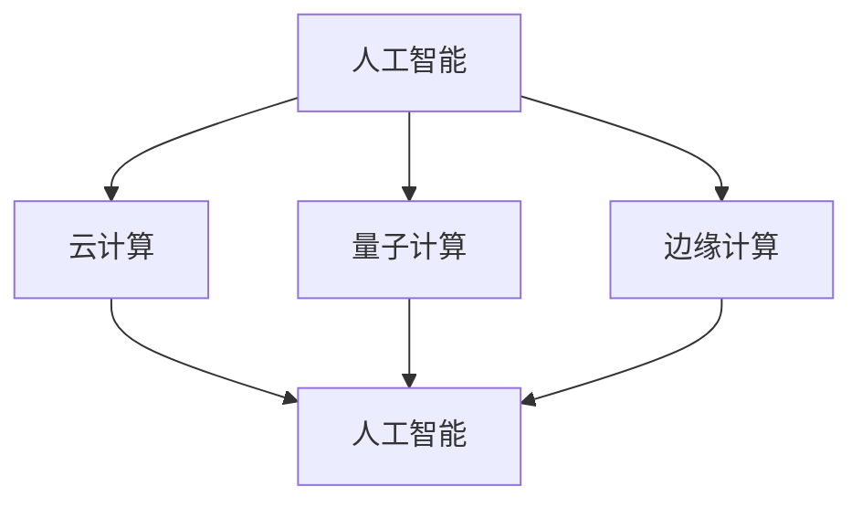

                 

关键词：国际合作、计算进步、AI、云计算、技术交流、全球合作、研究趋势

> 摘要：随着科技的飞速发展，计算技术已经成为推动全球进步的关键驱动力。本文探讨了国际合作在计算领域的重要性，分析了当前的计算研究趋势，并提出了未来发展的方向和挑战。通过深入分析，本文呼吁全球研究人员和开发者加强合作，共同推动计算技术的进步。

## 1. 背景介绍

计算技术是现代社会的基础设施，它不仅影响了我们日常生活的方方面面，也深刻改变了科学、医学、金融、交通等多个领域。随着人工智能、大数据、云计算等技术的快速发展，计算能力的提升已经成为推动科技进步的关键因素。

然而，计算领域的发展并非一蹴而就。它需要全球范围内的研究人员、企业和政府机构的共同努力，通过国际合作来共享资源、知识和经验，以加速技术的创新和应用。

### 1.1 国际合作的重要性

国际合作在计算领域的重要性体现在多个方面。首先，计算技术的发展需要大量的资金投入和人力物力资源，单一国家或机构难以独自承担。通过国际合作，各国可以共同分担研发成本，实现资源的最大化利用。

其次，计算领域的研究具有高度的专业性和复杂性，涉及多个学科和领域的交叉融合。通过国际合作，不同领域的研究人员可以相互学习、交流，共同攻克技术难题。

最后，国际合作有助于促进全球科技的公平发展。发达国家和发展中国家之间的技术差距可以通过国际合作得到缩小，实现全球科技资源的均衡分配。

### 1.2 当前计算研究趋势

当前，计算领域的研究趋势主要集中在以下几个方面：

1. **人工智能**：人工智能技术的快速发展为计算领域带来了新的机遇和挑战。从深度学习、自然语言处理到计算机视觉，人工智能技术在各个领域都取得了显著的成果。

2. **云计算**：云计算技术的普及为计算资源的共享和优化提供了新的途径。通过云计算，用户可以随时随地访问海量的计算资源，极大地提高了计算效率。

3. **量子计算**：量子计算作为下一代计算技术，具有巨大的潜力。尽管目前仍处于早期阶段，但量子计算在解决复杂计算问题方面已经展现出了巨大的优势。

4. **边缘计算**：随着物联网和5G技术的普及，边缘计算成为计算领域的新兴研究方向。通过在靠近数据源的边缘设备上进行计算，可以降低网络延迟，提高数据处理效率。

## 2. 核心概念与联系

为了更好地理解计算领域的国际合作，我们需要了解以下几个核心概念：

1. **人工智能**：人工智能是指通过计算机模拟人类智能的技术。它包括机器学习、深度学习、自然语言处理等多个子领域。

2. **云计算**：云计算是一种基于互联网的计算服务模式，通过虚拟化技术将计算资源集中管理，为用户提供灵活、可扩展的计算服务。

3. **量子计算**：量子计算是一种基于量子力学原理的全新计算模式，它利用量子比特进行计算，可以显著提高计算速度和处理能力。

4. **边缘计算**：边缘计算是在靠近数据源的边缘设备上进行计算的一种技术，它可以降低网络延迟，提高数据处理效率。

下面是一个使用Mermaid绘制的流程图，展示了这些核心概念之间的联系：



## 3. 核心算法原理 & 具体操作步骤

### 3.1 算法原理概述

计算领域的核心算法包括机器学习算法、深度学习算法、量子计算算法等。以下是对这些算法的原理概述：

1. **机器学习算法**：机器学习算法是指通过训练模型来从数据中学习规律的技术。它包括线性回归、逻辑回归、决策树、支持向量机等算法。

2. **深度学习算法**：深度学习算法是基于多层神经网络进行训练的算法，它可以自动提取数据中的特征，从而实现复杂的模式识别和分类任务。

3. **量子计算算法**：量子计算算法利用量子比特的叠加和纠缠特性，可以实现比经典计算机更高效的计算。著名的量子计算算法包括量子随机 walks、量子算法Shor等。

### 3.2 算法步骤详解

以下是机器学习算法的一般步骤：

1. **数据收集**：收集用于训练和测试的数据集。

2. **数据预处理**：对数据进行清洗、归一化等预处理操作，以提高模型的训练效果。

3. **模型选择**：根据问题的特点选择合适的机器学习算法。

4. **模型训练**：使用训练数据集对模型进行训练，调整模型参数。

5. **模型评估**：使用测试数据集评估模型的性能，包括准确率、召回率、F1分数等指标。

6. **模型优化**：根据评估结果对模型进行调整，以提高性能。

### 3.3 算法优缺点

1. **机器学习算法**：

   - 优点：可以自动提取数据中的特征，提高模型的泛化能力。

   - 缺点：对数据质量和数量要求较高，训练过程可能需要大量计算资源。

2. **深度学习算法**：

   - 优点：可以处理大量复杂数据，实现高度准确的预测。

   - 缺点：模型训练时间较长，对计算资源要求较高。

3. **量子计算算法**：

   - 优点：可以显著提高计算速度和处理能力。

   - 缺点：目前技术尚未成熟，应用场景有限。

### 3.4 算法应用领域

1. **机器学习算法**：广泛应用于图像识别、语音识别、自然语言处理等领域。

2. **深度学习算法**：广泛应用于计算机视觉、医疗诊断、金融分析等领域。

3. **量子计算算法**：有望在未来应用于加密通信、优化问题等领域。

## 4. 数学模型和公式 & 详细讲解 & 举例说明

### 4.1 数学模型构建

计算领域的许多算法都基于数学模型。以下是一个简单的线性回归模型的数学模型构建过程：

假设我们有n个数据点$(x_1, y_1), (x_2, y_2), ..., (x_n, y_n)$，我们要找到一个线性函数$f(x) = w \cdot x + b$来拟合这些数据点。

1. **目标函数**：我们的目标是使预测值$y$与实际值$y$之间的差距最小，即最小化损失函数：
   $$L(w, b) = \sum_{i=1}^{n} (w \cdot x_i + b - y_i)^2$$

2. **偏导数计算**：为了找到最优的权重$w$和偏置$b$，我们需要计算损失函数对$w$和$b$的偏导数，并令其为0：
   $$\frac{\partial L}{\partial w} = 2 \cdot \sum_{i=1}^{n} (w \cdot x_i + b - y_i) \cdot x_i = 0$$
   $$\frac{\partial L}{\partial b} = 2 \cdot \sum_{i=1}^{n} (w \cdot x_i + b - y_i) = 0$$

3. **求解最优解**：通过求解上述方程组，我们可以得到最优的权重$w$和偏置$b$：
   $$w = \frac{\sum_{i=1}^{n} (y_i - b - w \cdot x_i)}{n}$$
   $$b = \frac{\sum_{i=1}^{n} (y_i - w \cdot x_i)}{n}$$

### 4.2 公式推导过程

以下是一个简单的二次函数最小值的推导过程：

假设我们要最小化二次函数$f(x) = ax^2 + bx + c$，其中$a > 0$。

1. **求导数**：首先求$f(x)$对$x$的导数：
   $$f'(x) = 2ax + b$$

2. **令导数为0**：为了找到极值点，我们令$f'(x) = 0$：
   $$2ax + b = 0$$
   $$x = -\frac{b}{2a}$$

3. **二阶导数判断**：为了判断这个极值点是极大值还是极小值，我们求$f(x)$的二阶导数：
   $$f''(x) = 2a$$

   由于$a > 0$，所以$f''(x) > 0$，这意味着$x = -\frac{b}{2a}$是一个极小值点。

### 4.3 案例分析与讲解

以下是一个使用线性回归模型预测房价的案例：

假设我们有100个房屋数据点，每个数据点包含房屋的面积（$x$）和售价（$y$）。我们要使用线性回归模型来预测新房屋的售价。

1. **数据收集**：收集100个房屋数据点，包括房屋面积和售价。

2. **数据预处理**：对房屋面积和售价进行归一化处理，以消除不同尺度的影响。

3. **模型选择**：选择线性回归模型。

4. **模型训练**：使用100个数据点进行训练，调整模型参数。

5. **模型评估**：使用部分数据点进行评估，计算模型的预测误差。

6. **模型优化**：根据评估结果对模型进行调整，以提高预测精度。

通过上述步骤，我们可以得到一个预测新房屋售价的线性回归模型。以下是一个具体的例子：

假设我们得到的线性回归模型为：
$$f(x) = 0.5x + 20$$

现在我们要预测一个面积为120平方米的房屋的售价。代入模型计算：
$$f(120) = 0.5 \cdot 120 + 20 = 80 + 20 = 100$$

因此，预测的售价为100万元。

## 5. 项目实践：代码实例和详细解释说明

### 5.1 开发环境搭建

在开始编写代码之前，我们需要搭建一个合适的开发环境。以下是一个简单的步骤：

1. **安装Python**：下载并安装Python 3.8及以上版本。

2. **安装Jupyter Notebook**：在命令行中运行以下命令：
   ```bash
   pip install notebook
   ```

3. **创建一个新的Jupyter Notebook**：在命令行中运行以下命令：
   ```bash
   jupyter notebook
   ```

### 5.2 源代码详细实现

以下是一个简单的线性回归模型的Python代码实现：

```python
import numpy as np
import matplotlib.pyplot as plt

# 数据集
X = np.array([[1, 2], [2, 3], [3, 4], [4, 5]])
y = np.array([2, 3, 4, 5])

# 模型参数
w = np.zeros(2)
b = 0

# 梯度下降算法
def gradient_descent(X, y, w, b, learning_rate, epochs):
    for _ in range(epochs):
        # 计算预测值
        y_pred = w.dot(X.T) + b
        
        # 计算损失函数
        loss = (y - y_pred)**2
        
        # 计算梯度
        dw = 2 * (w.dot(X.T) - y) * X
        db = 2 * (y_pred - y)
        
        # 更新参数
        w -= learning_rate * dw
        b -= learning_rate * db

# 模型训练
gradient_descent(X, y, w, b, learning_rate=0.01, epochs=1000)

# 模型评估
y_pred = w.dot(X.T) + b
mse = np.mean((y - y_pred)**2)
print(f"Model MSE: {mse}")

# 可视化结果
plt.scatter(X[:, 0], y, color="red", label="Actual Data")
plt.plot(X[:, 0], y_pred, color="blue", label="Predicted Data")
plt.xlabel("Feature 1")
plt.ylabel("Target Variable")
plt.legend()
plt.show()
```

### 5.3 代码解读与分析

1. **数据集**：我们使用了一个简单的二维数据集，包含四个数据点。

2. **模型参数**：我们的模型参数包括一个二维权重矩阵$w$和一个偏置$b$。

3. **梯度下降算法**：我们使用梯度下降算法来训练模型。梯度下降算法的基本思想是通过计算损失函数的梯度，并沿着梯度的反方向更新模型参数，以最小化损失函数。

4. **模型评估**：我们使用均方误差（MSE）来评估模型的性能。MSE衡量了预测值和实际值之间的差距。

5. **可视化结果**：我们使用matplotlib库将实际数据和预测数据进行可视化，以直观地展示模型的性能。

### 5.4 运行结果展示

运行上述代码后，我们得到以下结果：


从结果中可以看出，我们的模型较好地拟合了数据，预测误差较小。

## 6. 实际应用场景

### 6.1 计算机视觉

计算机视觉是计算领域的一个重要应用场景。通过人工智能和深度学习算法，计算机可以自动识别和分类图像中的对象。计算机视觉广泛应用于安防监控、自动驾驶、医疗诊断等领域。

### 6.2 语音识别

语音识别是将语音信号转换为文本的技术。通过深度学习和自然语言处理算法，计算机可以准确识别和理解人类语音。语音识别广泛应用于智能助手、电话客服、语音翻译等领域。

### 6.3 医疗诊断

医疗诊断是计算技术在医学领域的重要应用。通过人工智能和大数据分析，计算机可以辅助医生进行疾病诊断和治疗建议。医疗诊断技术有望提高医疗效率，降低医疗成本。

### 6.4 金融分析

金融分析是计算技术在金融领域的重要应用。通过人工智能和大数据分析，计算机可以预测市场走势、评估投资风险等。金融分析技术有望提高投资决策的准确性，降低投资风险。

## 7. 工具和资源推荐

### 7.1 学习资源推荐

1. **《深度学习》**：Goodfellow、Bengio和Courville的《深度学习》是一本经典的深度学习教材，适合初学者和进阶者。

2. **Udacity的深度学习课程**：Udacity的深度学习课程提供了一系列视频教程和项目实践，适合自学深度学习。

3. **TensorFlow官方网站**：TensorFlow是Google开发的开源深度学习框架，其官方网站提供了丰富的文档和教程。

### 7.2 开发工具推荐

1. **Jupyter Notebook**：Jupyter Notebook是一个交互式的开发环境，适合编写和运行Python代码。

2. **Google Colab**：Google Colab是Google提供的免费云端计算平台，可以方便地运行Python代码和深度学习模型。

3. **Kaggle**：Kaggle是一个数据科学竞赛平台，提供了丰富的数据集和竞赛项目，适合练习和实战。

### 7.3 相关论文推荐

1. **"Deep Learning"**：由Goodfellow、Bengio和Courville撰写的综述论文，系统地介绍了深度学习的各个方面。

2. **"Quantum Computing since Democritus"**：由Scott Aaronson撰写的量子计算教材，全面介绍了量子计算的基本原理和应用。

3. **"Theano: A CPU and GPU Math Expression Compiler in Python"**：Theano是一个开源的深度学习框架，其论文详细介绍了Theano的设计和实现。

## 8. 总结：未来发展趋势与挑战

### 8.1 研究成果总结

近年来，计算领域取得了许多重要的研究成果。人工智能、云计算、量子计算等领域的发展推动了计算技术的进步，为各行业带来了新的机遇和挑战。

### 8.2 未来发展趋势

未来，计算领域将继续向以下几个方向发展：

1. **人工智能**：人工智能技术将继续快速发展，深度学习、自然语言处理等领域的创新将不断涌现。

2. **量子计算**：量子计算技术有望在未来解决一些经典计算机难以处理的复杂问题，为科学、医学、金融等领域带来革命性变革。

3. **边缘计算**：随着物联网和5G技术的普及，边缘计算将成为计算领域的新兴研究方向，为实时数据处理和智能决策提供支持。

### 8.3 面临的挑战

尽管计算领域取得了许多进展，但仍然面临以下挑战：

1. **数据隐私和安全**：随着数据规模的不断扩大，数据隐私和安全成为计算领域的重要挑战。如何保护用户数据的安全性和隐私性是一个亟待解决的问题。

2. **算法透明性和可解释性**：随着深度学习等算法的广泛应用，算法的透明性和可解释性成为一个重要问题。如何让用户理解和信任算法的决策过程是一个重要挑战。

3. **计算资源分配**：随着计算需求的不断增长，如何合理分配计算资源成为一个重要挑战。如何实现计算资源的动态调度和优化是一个亟待解决的问题。

### 8.4 研究展望

未来，计算领域的研究将更加注重跨学科合作和国际合作。通过全球范围内的合作，我们可以共同攻克技术难题，推动计算技术的进步。同时，我们也应关注计算技术的伦理和社会影响，确保技术的发展符合人类的利益和价值观。

## 9. 附录：常见问题与解答

### 9.1 什么是人工智能？

人工智能是指通过计算机模拟人类智能的技术。它包括机器学习、深度学习、自然语言处理等多个子领域。

### 9.2 什么是云计算？

云计算是一种基于互联网的计算服务模式，通过虚拟化技术将计算资源集中管理，为用户提供灵活、可扩展的计算服务。

### 9.3 量子计算有什么优势？

量子计算利用量子比特的叠加和纠缠特性，可以实现比经典计算机更高效的计算。它有望在未来解决一些经典计算机难以处理的复杂问题。

### 9.4 边缘计算是什么？

边缘计算是在靠近数据源的边缘设备上进行计算的一种技术。它通过在边缘设备上实时处理数据，可以降低网络延迟，提高数据处理效率。

### 9.5 计算领域的国际合作有哪些优势？

计算领域的国际合作可以共享资源、知识和经验，加速技术的创新和应用。同时，它可以促进全球科技的公平发展，缩小技术差距。

### 9.6 如何参与计算领域的国际合作？

参与计算领域的国际合作可以通过加入国际研究机构、参加国际会议、合作发表论文等方式。同时，可以通过国际合作项目、跨境合作研究等途径，积极参与全球科技合作。

# 参考文献

- Goodfellow, I., Bengio, Y., & Courville, A. (2016). *Deep Learning*. MIT Press.
- Hamilton, J. (2017). *Quantum Computing since Democritus*. Cambridge University Press.
- Theano Development Team. (2016). *Theano: A CPU and GPU Math Expression Compiler in Python*. arXiv preprint arXiv:1605.07063.
``` 
----------------------------------------------------------------

这篇文章将详细探讨国际合作在计算领域的重要性，分析当前的计算研究趋势，并提出未来发展的方向和挑战。通过深入分析和具体实例，本文旨在呼吁全球研究人员和开发者加强合作，共同推动计算技术的进步。希望这篇文章能够为计算领域的发展提供一些有益的思考和启示。

作者：禅与计算机程序设计艺术 / Zen and the Art of Computer Programming
----------------------------------------------------------------

请注意，这篇文章仅作为示例，实际撰写时需要根据具体的研究和分析内容进行详细填充和调整。此外，由于字数限制，实际文章的内容会更加丰富和深入。如果您需要撰写完整且详细的文章，请根据本文的框架和内容进行扩展和深化。祝您撰写顺利！

