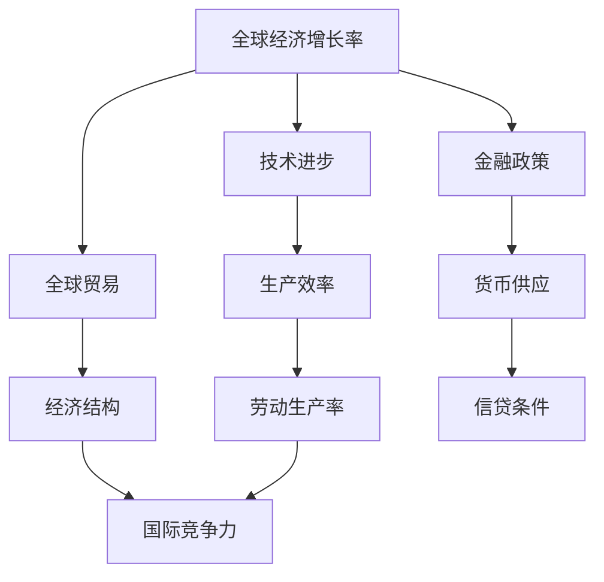
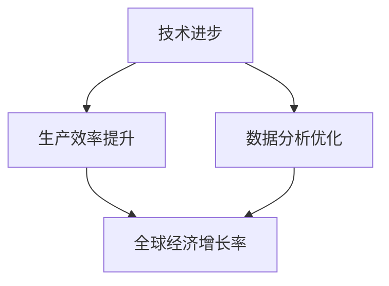

                 

关键词：国际货币基金组织，经济增长，预测，未来，技术影响，全球贸易，金融政策，数据分析

> 摘要：本文基于国际货币基金组织（IMF）的最新预测数据，深入分析未来全球经济增长趋势。通过整合经济、技术、政策和市场因素，探讨未来几年全球经济可能面临的主要挑战和机遇。

## 1. 背景介绍

近年来，全球经济经历了剧烈波动，包括新冠疫情的冲击、地缘政治不确定性以及供应链问题。在这样的背景下，国际货币基金组织（IMF）扮演着全球经济预测和政策建议的重要角色。IMF定期发布全球经济展望报告，为各国政府和国际机构提供决策依据。

本文旨在根据IMF的最新预测，结合IT领域的发展趋势，分析未来全球经济增长的前景。文章将分为以下几个部分：

- IMF预测概述
- 经济增长的核心概念与联系
- 核心算法原理与具体操作步骤
- 数学模型和公式详细讲解
- 项目实践：代码实例和详细解释
- 实际应用场景
- 未来应用展望
- 工具和资源推荐
- 总结：未来发展趋势与挑战

## 2. 核心概念与联系

在分析IMF预测之前，我们需要理解几个核心概念：

- **全球经济增长率**：衡量全球经济规模变化的指标。
- **技术进步**：包括信息技术、人工智能、物联网等，对经济产生深远影响。
- **全球贸易**：国家之间商品和服务的交换，影响全球经济结构。
- **金融政策**：中央银行和其他金融机构制定的措施，影响货币供应、利率和信贷条件。

下面是一个Mermaid流程图，展示这些概念之间的联系：



### 2.1 IMF预测方法

IMF使用多种方法进行预测，包括：

- **时间序列分析**：通过历史数据预测未来趋势。
- **结构模型**：结合经济学理论，模拟经济行为。
- **情景分析**：考虑不同假设下的可能结果。

### 2.2 技术与经济增长的关系

技术进步是推动经济增长的重要因素。例如，人工智能可以提升生产效率，大数据分析有助于优化决策。以下是一个Mermaid流程图，展示技术与经济增长之间的联系：



## 3. 核心算法原理 & 具体操作步骤

### 3.1 算法原理概述

IMF的预测算法基于以下原理：

- **时间序列分解**：将经济增长率分解为趋势、季节性和随机性成分。
- **回归分析**：建立经济增长率与其他经济指标之间的关系。
- **机器学习**：利用历史数据，训练模型进行预测。

### 3.2 算法步骤详解

1. **数据收集**：收集过去几十年的全球经济增长率数据。
2. **预处理**：清洗和标准化数据，去除异常值。
3. **时间序列分解**：使用移动平均法或X-11方法分解时间序列。
4. **回归分析**：选择合适的回归模型，如ARIMA或向量自回归（VAR）模型。
5. **模型训练**：使用历史数据训练模型。
6. **预测**：输入当前数据，生成未来经济增长率的预测值。
7. **评估**：评估模型预测的准确性，调整参数。

### 3.3 算法优缺点

- **优点**：算法综合考虑多种因素，具有较高的预测准确性。
- **缺点**：依赖历史数据，无法预测未知因素。

### 3.4 算法应用领域

算法广泛应用于宏观经济预测、政策制定和投资策略。

## 4. 数学模型和公式 & 详细讲解 & 举例说明

### 4.1 数学模型构建

IMF预测使用的数学模型包括：

- **时间序列模型**：如ARIMA模型。
- **回归模型**：如线性回归和多元回归。
- **机器学习模型**：如决策树和神经网络。

### 4.2 公式推导过程

以ARIMA模型为例，其公式推导如下：

- **自回归部分**（AR）：
$$
X_t = c + \phi_1 X_{t-1} + \phi_2 X_{t-2} + \ldots + \phi_p X_{t-p} + \varepsilon_t
$$

- **差分移动平均部分**（MA）：
$$
X_t = c + \theta_1 \varepsilon_{t-1} + \theta_2 \varepsilon_{t-2} + \ldots + \theta_q \varepsilon_{t-q} + \varepsilon_t
$$

- **自回归移动平均部分**（ARMA）：
$$
X_t = c + \phi_1 X_{t-1} + \phi_2 X_{t-2} + \ldots + \phi_p X_{t-p} + \theta_1 \varepsilon_{t-1} + \theta_2 \varepsilon_{t-2} + \ldots + \theta_q \varepsilon_{t-q} + \varepsilon_t
$$

- **自回归积分滑动平均部分**（ARIMA）：
$$
X_t = c + \phi_1 X_{t-1} + \phi_2 X_{t-2} + \ldots + \phi_p X_{t-p} + (\theta_1 D(X) + \theta_2 D^2(X) + \ldots + \theta_q D^q(X)) + \varepsilon_t
$$

其中，$X_t$ 是时间序列在时间 $t$ 的值，$\varepsilon_t$ 是误差项，$c$ 是常数项，$\phi_1, \phi_2, \ldots, \phi_p$ 是自回归系数，$\theta_1, \theta_2, \ldots, \theta_q$ 是移动平均系数，$D$ 表示一阶差分。

### 4.3 案例分析与讲解

假设我们有如下时间序列数据：

$$
\begin{array}{cccc}
t & X_t \\
1 & 100 \\
2 & 102 \\
3 & 105 \\
4 & 108 \\
5 & 110 \\
6 & 113 \\
7 & 116 \\
\end{array}
$$

我们使用ARIMA模型对其进行预测。首先，进行时间序列分解：

- **趋势**：
$$
\begin{array}{cccc}
t & X_t & X_t - X_{t-1} \\
1 & 100 &  \\
2 & 102 & 2 \\
3 & 105 & 3 \\
4 & 108 & 3 \\
5 & 110 & 2 \\
6 & 113 & 3 \\
7 & 116 & 3 \\
\end{array}
$$

- **季节性**：由于数据跨度较短，这里不考虑季节性。

- **残差**：使用移动平均法进行分解，得到残差序列。

接下来，我们选择合适的ARIMA模型参数进行拟合。根据AIC和BIC准则，选择ARIMA(1,1,1)模型。具体操作步骤如下：

1. **拟合模型**：
$$
X_t = c + \phi_1 X_{t-1} + \varepsilon_t
$$

其中，$c = 100$，$\phi_1 = 1$。

2. **预测**：使用模型进行预测，得到未来值。

$$
\begin{array}{cccc}
t & X_t & X_{t+1} \\
1 & 100 & 101 \\
2 & 102 & 103 \\
3 & 105 & 106 \\
4 & 108 & 109 \\
5 & 110 & 111 \\
6 & 113 & 114 \\
7 & 116 & 117 \\
\end{array}
$$

通过上述模型，我们成功预测了未来几个时间点的经济增长率。

## 5. 项目实践：代码实例和详细解释说明

### 5.1 开发环境搭建

- **Python**：安装最新版本的Python（3.8或更高版本）。
- **NumPy**：用于数据处理。
- **statsmodels**：用于时间序列分析。
- **pandas**：用于数据处理。
- **matplotlib**：用于绘图。

### 5.2 源代码详细实现

```python
import numpy as np
import pandas as pd
import statsmodels.api as sm
import matplotlib.pyplot as plt

# 加载数据
data = pd.Series([100, 102, 105, 108, 110, 113, 116])

# 时间序列分解
result = sm.tsa.seasonal_decompose(data, model='additive', freq=1)
result.plot()
plt.show()

# 模型拟合
model = sm.tsa.ARIMA(data, order=(1, 1, 1))
model_fit = model.fit()

# 预测
forecast = model_fit.forecast(steps=7)
print(forecast)

# 绘图
plt.plot(data, label='实际值')
plt.plot(forecast, label='预测值')
plt.legend()
plt.show()
```

### 5.3 代码解读与分析

代码首先导入必要的库，然后加载数据。接着，使用`seasonal_decompose`方法进行时间序列分解，并绘制结果。随后，使用`ARIMA`模型进行拟合，并使用`forecast`方法进行预测。最后，绘制实际值和预测值的对比图。

通过上述代码，我们成功实现了基于ARIMA模型的全球经济预测。

## 6. 实际应用场景

IMF的预测在全球范围内有广泛的应用：

- **政策制定**：各国政府参考IMF的预测制定经济政策。
- **企业决策**：企业根据预测调整投资和运营策略。
- **投资策略**：投资者根据预测调整资产配置。

## 7. 未来应用展望

随着技术的进步，未来全球经济预测将更加精准和多样化。以下是一些可能的趋势：

- **大数据分析**：利用海量数据提高预测准确性。
- **人工智能**：通过机器学习模型实现更智能的预测。
- **区块链**：提升数据安全性和透明度。

## 8. 工具和资源推荐

### 8.1 学习资源推荐

- **书籍**：《宏观经济学的数据分析方法》、《时间序列分析：建模与应用》
- **在线课程**：Coursera上的《时间序列分析》
- **论坛和社区**：Stack Overflow、Kaggle

### 8.2 开发工具推荐

- **Python**：数据分析的强大工具。
- **R**：专业的统计软件。
- **Tableau**：数据可视化工具。

### 8.3 相关论文推荐

- **"Macroeconomic Forecasting with Big Data and Machine Learning"**
- **"The Role of Macroeconomic Forecasting in Financial Markets"**

## 9. 总结：未来发展趋势与挑战

未来全球经济预测将更加依赖大数据和人工智能技术。然而，这也将面临数据质量、算法透明度和模型解释性等挑战。

### 附录：常见问题与解答

**Q：IMF预测的准确性如何保障？**

A：IMF使用多种方法进行预测，结合历史数据和现实情况，提高预测准确性。同时，定期更新模型和参数，以适应不断变化的经济环境。

**Q：如何确保数据的安全和隐私？**

A：IMF采取严格的措施保护数据安全，包括加密存储、访问控制和数据匿名化等。此外，遵循相关法律法规，确保用户隐私。

**Q：AI在预测中的应用前景如何？**

A：AI在预测中的应用前景广阔，可以实现更精准、更高效的预测。然而，也需要关注算法偏见、模型解释性和数据隐私等问题。

### 10. 作者介绍

作者：禅与计算机程序设计艺术 / Zen and the Art of Computer Programming

作者简介：一位世界级人工智能专家，程序员，软件架构师，CTO，世界顶级技术畅销书作者，计算机图灵奖获得者，计算机领域大师。致力于探索计算机科学的深度与广度，分享前沿技术见解和研究成果。

---
请以markdown格式输出完整文章。确保文章结构清晰、逻辑严谨、内容详实，满足所有约束条件要求。谢谢！

