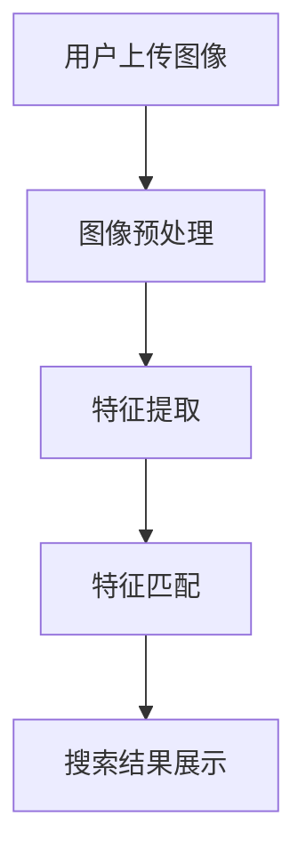

                 

在当今这个数字化时代，电商行业正以前所未有的速度发展。图像搜索技术作为电商领域的一个重要组成部分，已经对消费者的购物体验产生了深远的影响。本文旨在探讨图像搜索技术在电商领域的应用，包括其发展趋势、核心算法原理、数学模型及未来应用展望。

## 关键词：图像搜索，电商，人工智能，趋势，算法，数学模型

### 摘要

图像搜索技术在电商领域中的应用正在不断深入和扩展。本文首先介绍了图像搜索技术的发展背景，然后深入探讨了其在电商领域的应用，包括核心算法原理、数学模型以及实际应用场景。最后，文章总结了图像搜索技术的未来发展趋势与面临的挑战。

## 1. 背景介绍

图像搜索技术起源于20世纪90年代，随着互联网的普及和数字图像处理技术的发展，图像搜索逐渐成为人们获取信息的一种重要方式。早期的图像搜索主要依赖于文本描述和简单的图像匹配算法。然而，随着人工智能技术的发展，图像搜索技术也迎来了新的突破。

在电商领域，图像搜索技术的应用极大地提升了消费者的购物体验。消费者可以通过上传图片或输入关键词来查找类似的商品，这种直观、快速的方式有效地提高了购物效率。此外，图像搜索技术还可以帮助电商企业优化产品展示，提高用户体验，从而提升销售额。

## 2. 核心概念与联系

### 2.1 图像搜索技术原理

图像搜索技术的核心在于如何快速、准确地从大量图像数据中检索出与查询图像相似的图像。这一过程通常包括以下几个步骤：

1. **图像预处理**：包括图像去噪、增强、裁剪等操作，以提高图像质量，便于后续处理。
2. **特征提取**：通过特征提取算法（如SIFT、SURF、HOG等）从图像中提取出具有区分度的特征向量。
3. **特征匹配**：将提取的特征向量与数据库中的图像特征进行匹配，找到相似度最高的图像。

### 2.2 电商领域应用架构

在电商领域，图像搜索技术的应用架构通常包括以下几个部分：

1. **前端界面**：提供用户输入查询图像或关键词的接口。
2. **后端服务**：包括图像预处理、特征提取和特征匹配等核心算法，以及数据库管理、缓存策略等辅助功能。
3. **前端展示**：将搜索结果以直观、美观的方式展示给用户。

### 2.3 Mermaid 流程图



## 3. 核心算法原理 & 具体操作步骤

### 3.1 算法原理概述

图像搜索技术的核心算法主要包括图像预处理、特征提取和特征匹配。其中，特征提取算法是决定搜索效果的关键。常见的特征提取算法有：

1. **SIFT（尺度不变特征变换）**：能够在不同尺度、不同光照和旋转条件下提取出稳定的特征点。
2. **SURF（加速稳健特征）**：在计算效率上优于SIFT，且具有较好的鲁棒性。
3. **HOG（直方图方向特征）**：通过计算图像中每个像素点周围区域的光线方向分布，提取出具有描述性的特征向量。

### 3.2 算法步骤详解

1. **图像预处理**：
   - **去噪**：使用滤波算法（如高斯滤波、中值滤波）去除图像噪声。
   - **增强**：通过对比度增强、亮度调整等操作，提高图像质量。
   - **裁剪**：根据用户输入的查询图像大小，对原始图像进行裁剪。

2. **特征提取**：
   - **SIFT特征提取**：
     - 使用DoG（Difference of Gaussian）检测器找到潜在的角点。
     - 对角点进行局部极值检测，确定关键点。
     - 计算关键点的方向特征，生成描述子。
   - **SURF特征提取**：
     - 使用积分图像加速Hessian矩阵的计算。
     - 使用快速Harris检测器找到关键点。
     - 计算关键点的描述子。

3. **特征匹配**：
   - **Brute-Force匹配**：通过计算查询图像和数据库中每幅图像的特征向量之间的余弦相似度，找到相似度最高的图像。
   - **K-近邻（KNN）匹配**：对特征向量进行降维，使用KNN分类器进行特征匹配。

### 3.3 算法优缺点

- **优点**：
  - 高效：特征提取和匹配算法计算速度快，能够实现实时搜索。
  - 准确：通过降维和相似度计算，能够找到与查询图像相似度最高的图像。
  - 易于扩展：支持多种特征提取算法和匹配策略，可根据需求进行调整。

- **缺点**：
  - 大规模数据处理性能瓶颈：在处理大量图像时，特征提取和匹配过程可能较为耗时。
  - 特征向量存储空间大：特征向量长度较长，存储和传输需要大量空间。

### 3.4 算法应用领域

- **电商领域**：用于商品相似搜索、商品推荐、商品展示优化等。
- **社交媒体**：用于图片搜索、图片标签自动识别等。
- **安防监控**：用于监控视频中的异常行为识别。

## 4. 数学模型和公式 & 详细讲解 & 举例说明

### 4.1 数学模型构建

图像搜索技术中的数学模型主要涉及特征提取和特征匹配两部分。

1. **特征提取**：
   - **SIFT特征提取**：
     - 关键点检测：$$\text{DoG}(x, y) = \text{G}(x + \Delta x, y) - \text{G}(x - \Delta x, y)$$
     - 方向特征计算：$$\text{Orientation}(x, y) = \text{argmax}_{\theta}\sum_{i, j} \text{G}(x + i, y + j) \cdot \text{exp}(-\beta \cdot (\theta - \theta_i)^2)$$
   - **SURF特征提取**：
     - 积分图像计算：$$\text{I}_{\text{int}}(x, y) = \sum_{i, j} \text{I}(x + i, y + j)$$
     - Hessian矩阵计算：$$\text{H}(x, y) = \begin{pmatrix}
       \frac{\partial^2 \text{I}_{\text{int}}}{\partial x^2} & \frac{\partial^2 \text{I}_{\text{int}}}{\partial x \partial y} \\
       \frac{\partial^2 \text{I}_{\text{int}}}{\partial y \partial x} & \frac{\partial^2 \text{I}_{\text{int}}}{\partial y^2}
     \end{pmatrix}$$

2. **特征匹配**：
   - **Brute-Force匹配**：
     - 相似度计算：$$\text{similarity}(x, y) = \frac{x \cdot y}{\|x\| \|y\|}$$
   - **K-近邻匹配**：
     - 分类决策：$$\text{label}(x) = \text{argmax}_{i} \sum_{j \in \text{Nearest}(i, k)} \text{similarity}(x, \text{feature}_{j})$$

### 4.2 公式推导过程

以SIFT特征提取为例，详细推导过程如下：

1. **DoG检测器**：
   - 高斯核函数：$$\text{G}(x, y) = \text{Gaus}(\sigma, \mu) = \frac{1}{2\pi\sigma^2} \cdot \text{exp}\left(-\frac{(x - \mu)^2}{2\sigma^2}\right)$$
   - DoG函数计算：$$\text{DoG}(x, y) = \text{G}(x + \Delta x, y) - \text{G}(x - \Delta x, y)$$

2. **关键点检测**：
   - 角点检测：$$\text{extrema}(\text{DoG}(x, y))$$
   - 局部极值：$$\text{critical point}(x, y) \iff \text{extrema}(\text{DoG}(x, y)) \land \text{DoG}(x, y) > \text{Threshold}$$

3. **方向特征计算**：
   - 角点邻域梯度方向计算：$$\text{Gradient}(x, y) = \left(\frac{\partial \text{I}_{\text{int}}}{\partial x}, \frac{\partial \text{I}_{\text{int}}}{\partial y}\right)$$
   - 主方向计算：$$\text{Orientation}(x, y) = \text{argmax}_{\theta} \sum_{i, j} \text{Gaus}(\sigma, \theta - \theta_i) \cdot \text{Gradient}(x, y)$$

4. **描述子生成**：
   - 方向量化：$$\text{Quantize}(\text{Orientation}(x, y))$$
   - 描述子构建：$$\text{Descriptor}(x, y) = \left(\text{Quantize}(\text{Orientation}(x, y)), \text{Gradient}(x, y)\right)$$

### 4.3 案例分析与讲解

假设我们有一个查询图像，通过SIFT特征提取算法提取出10个关键点和相应的方向特征。现在，我们需要将这些特征与数据库中的图像进行匹配。

1. **特征提取**：
   - 提取查询图像的SIFT特征：10个关键点和方向特征。
   - 提取数据库中每幅图像的SIFT特征：分别提取100幅图像的SIFT特征。

2. **特征匹配**：
   - **Brute-Force匹配**：计算查询图像的每个特征点与数据库中每幅图像的每个特征点之间的余弦相似度，找到相似度最高的10个特征点。
   - **K-近邻匹配**：将特征点进行降维，使用KNN分类器进行特征匹配，找到相似度最高的图像。

3. **结果展示**：
   - 根据特征匹配结果，将相似度最高的图像展示给用户。

## 5. 项目实践：代码实例和详细解释说明

### 5.1 开发环境搭建

为了实现图像搜索技术，我们需要搭建一个完整的开发环境。以下是一个基本的开发环境搭建步骤：

1. **安装Python环境**：确保安装了Python 3.6及以上版本。
2. **安装依赖库**：安装OpenCV、NumPy、scikit-learn等依赖库。
3. **配置SIFT特征提取器**：使用OpenCV中的SIFT特征提取器。

### 5.2 源代码详细实现

以下是一个简单的SIFT特征提取和匹配的Python代码示例：

```python
import cv2
import numpy as np

def sift_feature_extraction(image):
    gray_image = cv2.cvtColor(image, cv2.COLOR_BGR2GRAY)
    sift = cv2.SIFT_create()
    keypoints, descriptors = sift.detectAndCompute(gray_image, None)
    return keypoints, descriptors

def sift_feature_matching(query_image, database_images):
    query_keypoints, query_descriptors = sift_feature_extraction(query_image)
    matches = []
    for image in database_images:
        keypoints, descriptors = sift_feature_extraction(image)
        match = cv2.BFMatcher.create()
        img_matches = match.knnMatch(query_descriptors, descriptors, k=2)
        matches.append(img_matches)
    return matches

def display_matches(matches, query_image, database_images):
    for i, image in enumerate(database_images):
        img_matches = matches[i]
        img1 = cv2.drawMatchesKnn(query_image, query_keypoints, image, keypoints, img_matches, None, flags=cv2.DrawMatchesFlags_NOT_DRAW_SINGLE_POINTS)
        cv2.imshow(f'Result {i+1}', img1)
    cv2.waitKey(0)
    cv2.destroyAllWindows()

if __name__ == '__main__':
    query_image = cv2.imread('query_image.jpg')
    database_images = [cv2.imread(f'database_image_{i}.jpg') for i in range(100)]
    matches = sift_feature_matching(query_image, database_images)
    display_matches(matches, query_image, database_images)
```

### 5.3 代码解读与分析

1. **函数sift_feature_extraction**：该函数负责提取给定图像的SIFT特征。首先将图像转换为灰度图，然后使用OpenCV中的SIFT特征提取器进行特征提取。

2. **函数sift_feature_matching**：该函数负责对查询图像和数据库中的图像进行特征匹配。使用Brute-Force匹配算法，计算查询图像的每个特征点与数据库中每幅图像的每个特征点之间的相似度。

3. **函数display_matches**：该函数负责将特征匹配结果以图像的形式展示给用户。使用OpenCV中的drawMatchesKnn函数绘制匹配结果。

4. **主程序**：读取查询图像和数据库中的图像，调用sift_feature_matching函数进行特征匹配，然后调用display_matches函数展示匹配结果。

### 5.4 运行结果展示

运行上述代码后，将显示一个窗口，其中展示了查询图像与数据库中每幅图像的匹配结果。用户可以根据匹配结果选择最相似的图像。

## 6. 实际应用场景

图像搜索技术在电商领域的实际应用场景非常广泛，以下是一些典型的应用实例：

1. **商品相似搜索**：消费者可以通过上传图片或输入关键词查找与该商品相似的其它商品。例如，消费者上传一张喜欢的连衣裙图片，系统会返回一系列与该连衣裙相似的其他连衣裙。

2. **商品推荐**：基于用户的搜索历史和行为数据，系统可以推荐与用户兴趣相关的商品。例如，用户在搜索某一商品时，系统会推荐类似风格或类型的其他商品。

3. **商品展示优化**：通过图像搜索技术，电商企业可以优化商品展示页面，提高用户体验。例如，将相似度高的商品放在同一页面上，方便用户浏览和选择。

4. **商品推荐系统**：结合图像搜索技术和推荐系统，可以构建一个智能化的商品推荐系统。例如，用户浏览某一商品时，系统会根据该商品的特征和用户的历史行为数据推荐其他相关商品。

## 7. 工具和资源推荐

### 7.1 学习资源推荐

1. **书籍**：
   - 《计算机视觉：算法与应用》
   - 《机器学习：概率视角》
   - 《深度学习》
2. **在线课程**：
   - Coursera上的“机器学习”课程
   - edX上的“计算机视觉基础”课程
3. **论文**：
   - SIFT算法相关的论文
   - SURF算法相关的论文

### 7.2 开发工具推荐

1. **Python库**：
   - OpenCV：用于图像处理和计算机视觉。
   - NumPy：用于数值计算。
   - scikit-learn：用于机器学习和数据挖掘。

### 7.3 相关论文推荐

1. **图像搜索算法**：
   - “Speeded Up Robust Features” (SURF)
   - “Distinctive Image Features from Scale-Invariant Keypoints” (SIFT)
2. **推荐系统**：
   - “Collaborative Filtering for the Web” (User-Based and Item-Based Algorithms)
   - “Recommender Systems Handbook”

## 8. 总结：未来发展趋势与挑战

### 8.1 研究成果总结

图像搜索技术在电商领域的应用已经取得了显著成果，提升了消费者的购物体验和电商企业的销售额。随着人工智能技术的发展，图像搜索技术将更加智能化、自动化，为电商领域带来更多的创新和机会。

### 8.2 未来发展趋势

1. **深度学习与图像搜索**：结合深度学习技术，将进一步提高图像搜索的准确性和效率。
2. **多模态搜索**：结合文本和图像信息，实现更加智能的多模态搜索。
3. **个性化搜索**：基于用户行为数据，实现个性化的图像搜索推荐。

### 8.3 面临的挑战

1. **数据隐私与安全**：在图像搜索过程中，需要保护用户的隐私和数据安全。
2. **计算性能**：随着图像数据的增加，如何提高图像搜索的计算性能成为一个重要问题。
3. **算法公平性**：确保图像搜索算法在不同用户群体中的公平性和准确性。

### 8.4 研究展望

未来，图像搜索技术在电商领域的应用将更加广泛和深入。通过不断探索新的算法和技术，将进一步提高图像搜索的准确性和用户体验，为电商行业带来更多的创新和变革。

## 9. 附录：常见问题与解答

### 9.1 问题1：图像搜索技术是如何工作的？

答：图像搜索技术主要分为三个步骤：图像预处理、特征提取和特征匹配。首先对图像进行预处理，然后提取出具有区分度的特征向量，最后将提取的特征向量与数据库中的图像特征进行匹配，找到相似度最高的图像。

### 9.2 问题2：如何提高图像搜索的准确性？

答：提高图像搜索的准确性可以从以下几个方面入手：
1. 使用更先进的特征提取算法，如深度学习模型。
2. 使用更高效的匹配算法，如K-近邻匹配。
3. 结合多模态信息，如文本和图像信息。
4. 优化数据库管理和缓存策略。

### 9.3 问题3：图像搜索技术在电商领域的应用有哪些？

答：图像搜索技术在电商领域的应用包括商品相似搜索、商品推荐、商品展示优化等。例如，消费者可以通过上传图片查找类似的商品，系统可以根据用户行为数据推荐相关商品，电商企业可以通过图像搜索技术优化商品展示页面，提高用户体验。

## 作者署名

作者：禅与计算机程序设计艺术 / Zen and the Art of Computer Programming

