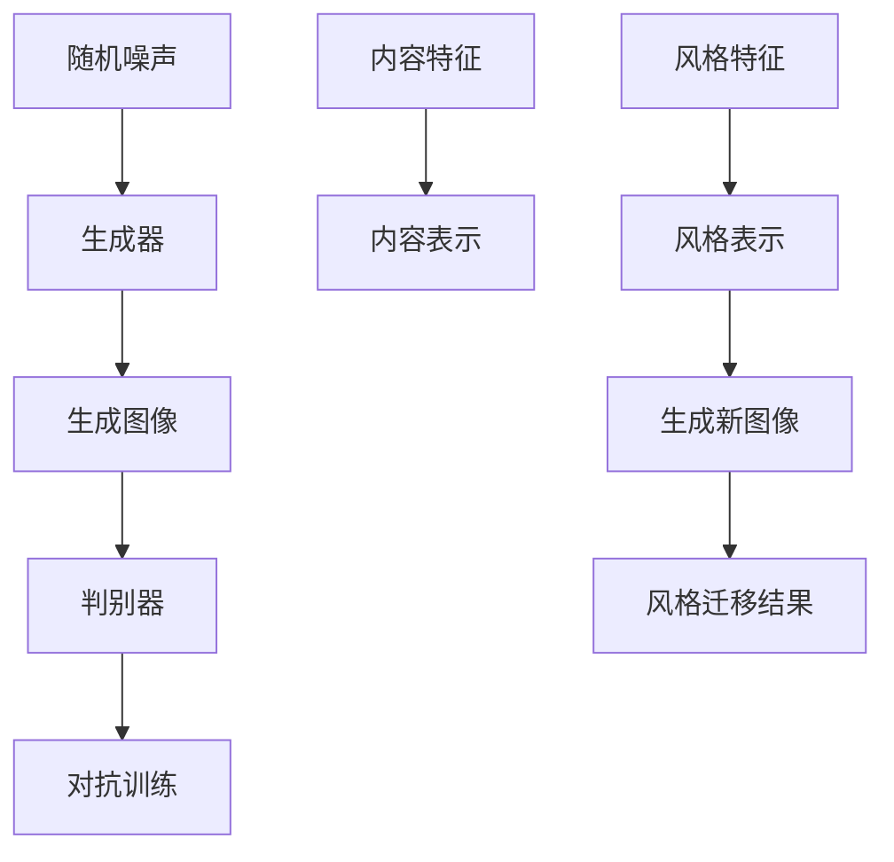

                 

关键词：图像生成模型，人工智能，视觉艺术，深度学习，生成对抗网络，风格迁移

> 摘要：本文旨在探讨图像生成模型作为人工智能在视觉艺术创作中的新兴工具，其核心概念、算法原理、数学模型以及应用领域。通过详细分析生成对抗网络和风格迁移技术，本文揭示了图像生成模型在计算机视觉和艺术创作中的巨大潜力，并对其未来发展趋势与挑战进行了展望。

## 1. 背景介绍

图像生成模型作为人工智能领域的一个重要分支，近年来取得了显著的发展。在计算机视觉领域，图像生成模型不仅能够生成逼真的图像，还能够实现图像风格迁移、图像超分辨率、图像修复等功能。随着深度学习技术的不断进步，图像生成模型在艺术创作中的应用也越来越广泛。

视觉艺术是人类文化的重要组成部分，它通过色彩、线条、形状等元素传达情感、思想和故事。传统的艺术创作依赖于人类的想象力和创造力，而现代人工智能技术，尤其是图像生成模型，正在为艺术家提供全新的创作工具，打破艺术与技术的界限。

本文将首先介绍图像生成模型的核心概念和联系，然后深入探讨生成对抗网络和风格迁移技术的原理和应用，最后分析图像生成模型在实际应用场景中的表现，以及其未来发展的趋势与挑战。

## 2. 核心概念与联系

### 2.1 图像生成模型的基本概念

图像生成模型是一种通过学习大量图像数据，从而生成新图像的算法。它主要包括两部分：生成器和判别器。生成器负责生成新的图像，而判别器则负责判断生成的图像是否真实。通过不断训练，生成器和判别器相互竞争，生成器逐渐学会生成更逼真的图像，而判别器则不断提高判断能力。

### 2.2 生成对抗网络（GAN）

生成对抗网络（Generative Adversarial Network，GAN）是图像生成模型中最具代表性的技术之一。它由生成器和判别器两个神经网络组成，两者在对抗训练过程中相互促进，最终实现高效的图像生成。

**生成器（Generator）**：生成器从随机噪声中生成图像。它通常由多个全连接层和卷积层组成，能够将噪声映射到高维图像空间。

**判别器（Discriminator）**：判别器则负责区分真实图像和生成图像。它也由多个全连接层和卷积层组成，训练目标是最小化对真实图像的分类错误和对生成图像的分类错误。

**对抗训练**：生成器和判别器在对抗训练过程中相互竞争。生成器试图生成更逼真的图像，使判别器无法区分；而判别器则努力提高判断能力，准确区分真实图像和生成图像。通过这种方式，生成器逐渐学会生成更高质量的图像。

### 2.3 风格迁移（Style Transfer）

风格迁移是一种通过将一种艺术作品的风格应用于另一幅图像的技术，从而生成具有特定风格的新图像。风格迁移技术主要包括以下三个步骤：

1. **内容表示（Content Representation）**：使用神经网络提取输入图像的内容特征。

2. **风格表示（Style Representation）**：使用神经网络提取输入图像的风格特征。

3. **生成新图像（Image Generation）**：将内容特征和风格特征融合，生成具有特定风格的新图像。

风格迁移技术不仅能够实现图像风格的变化，还可以应用于视频风格迁移、视频内容增强等领域。

### 2.4 Mermaid 流程图

以下是生成对抗网络和风格迁移技术的 Mermaid 流程图：



## 3. 核心算法原理 & 具体操作步骤

### 3.1 算法原理概述

生成对抗网络（GAN）的核心思想是生成器和判别器的对抗训练。生成器从随机噪声中生成图像，判别器则判断图像的真实性。通过这种对抗过程，生成器逐渐提高生成图像的质量，判别器则不断改进判断能力。

### 3.2 算法步骤详解

1. **初始化参数**：初始化生成器的参数 $\theta_G$ 和判别器的参数 $\theta_D$。

2. **生成器训练**：生成器从随机噪声 $z$ 中生成图像 $x^G$。

3. **判别器训练**：判别器对真实图像 $x^R$ 和生成图像 $x^G$ 进行分类。

4. **对抗训练**：通过梯度上升法，优化生成器和判别器的参数，使其在对抗过程中相互促进。

5. **评估模型性能**：使用测试集评估生成器的性能。

### 3.3 算法优缺点

**优点**：

- 高效：GAN通过对抗训练，能够在短时间内生成高质量图像。

- 泛化能力强：GAN能够生成各种类型的图像，不受特定领域限制。

- 可扩展性：GAN可以应用于图像生成、视频生成、音频生成等多个领域。

**缺点**：

- 训练不稳定：GAN的训练过程容易陷入局部最优，导致训练不稳定。

- 对判别器的依赖性：生成器性能的提升很大程度上依赖于判别器的性能。

### 3.4 算法应用领域

- 图像生成：GAN可以用于生成人脸、风景、动物等高质量图像。

- 图像风格迁移：GAN可以实现图像风格的变化，如将一幅普通照片转换为印象派风格。

- 图像修复：GAN可以修复损坏或模糊的图像。

- 图像超分辨率：GAN可以提高图像的分辨率，使其更加清晰。

## 4. 数学模型和公式 & 详细讲解 & 举例说明

### 4.1 数学模型构建

生成对抗网络（GAN）的数学模型如下：

$$
\min_G \max_D V(D, G) = \mathbb{E}_{x\sim p_{data}(x)}[\log D(x)] + \mathbb{E}_{z\sim p_z(z)}[\log (1 - D(G(z))]
$$

其中，$D$ 为判别器，$G$ 为生成器，$x$ 为真实图像，$z$ 为随机噪声，$p_{data}(x)$ 为真实图像的概率分布，$p_z(z)$ 为随机噪声的概率分布。

### 4.2 公式推导过程

生成对抗网络的目标是最小化损失函数 $V(D, G)$。为了推导损失函数，我们需要分别考虑判别器和生成器的损失函数。

**判别器的损失函数**：

$$
L_D = -\mathbb{E}_{x\sim p_{data}(x)}[\log D(x)] - \mathbb{E}_{z\sim p_z(z)}[\log (1 - D(G(z))]
$$

**生成器的损失函数**：

$$
L_G = -\mathbb{E}_{z\sim p_z(z)}[\log D(G(z))]
$$

将两个损失函数相加，得到总体损失函数：

$$
V(D, G) = L_D + L_G
$$

### 4.3 案例分析与讲解

假设我们使用 GAN 生成人脸图像，具体步骤如下：

1. **初始化参数**：随机初始化生成器 $G$ 和判别器 $D$ 的参数。

2. **生成器训练**：生成器从随机噪声 $z$ 中生成人脸图像 $x^G$。

3. **判别器训练**：判别器对真实人脸图像 $x^R$ 和生成人脸图像 $x^G$ 进行分类。

4. **对抗训练**：通过梯度上升法，优化生成器和判别器的参数。

5. **评估模型性能**：使用测试集评估生成器生成的图像质量。

通过这种方式，GAN 可以生成高质量的人脸图像，实现图像生成、风格迁移等功能。

## 5. 项目实践：代码实例和详细解释说明

### 5.1 开发环境搭建

在本节中，我们将搭建一个生成对抗网络（GAN）的实验环境。以下是所需的步骤：

1. 安装 Python 3.7 或更高版本。
2. 安装 TensorFlow 2.4 或更高版本。
3. 安装 PyTorch 1.7 或更高版本。

```bash
pip install tensorflow==2.4
pip install torch==1.7
```

### 5.2 源代码详细实现

以下是 GAN 的源代码实现：

```python
import torch
import torch.nn as nn
import torch.optim as optim
from torch.utils.data import DataLoader
from torchvision import datasets, transforms
from torchvision.utils import save_image
import numpy as np
import matplotlib.pyplot as plt

# 生成器
class Generator(nn.Module):
    def __init__(self):
        super(Generator, self).__init__()
        self.model = nn.Sequential(
            nn.ConvTranspose2d(100, 256, 4, 1, 0, bias=False),
            nn.BatchNorm2d(256),
            nn.ReLU(True),
            nn.ConvTranspose2d(256, 128, 4, 2, 1, bias=False),
            nn.BatchNorm2d(128),
            nn.ReLU(True),
            nn.ConvTranspose2d(128, 64, 4, 2, 1, bias=False),
            nn.BatchNorm2d(64),
            nn.ReLU(True),
            nn.ConvTranspose2d(64, 3, 4, 2, 1, bias=False),
            nn.Tanh()
        )

    def forward(self, x):
        return self.model(x)

# 判别器
class Discriminator(nn.Module):
    def __init__(self):
        super(Discriminator, self).__init__()
        self.model = nn.Sequential(
            nn.Conv2d(3, 64, 4, 2, 1, bias=False),
            nn.LeakyReLU(0.2, inplace=True),
            nn.Conv2d(64, 128, 4, 2, 1, bias=False),
            nn.BatchNorm2d(128),
            nn.LeakyReLU(0.2, inplace=True),
            nn.Conv2d(128, 256, 4, 2, 1, bias=False),
            nn.BatchNorm2d(256),
            nn.LeakyReLU(0.2, inplace=True),
            nn.Conv2d(256, 1, 4, 1, 0, bias=False),
            nn.Sigmoid()
        )

    def forward(self, x):
        return self.model(x)

# 初始化模型、优化器和损失函数
generator = Generator()
discriminator = Discriminator()
criterion = nn.BCELoss()
optimizer_G = optim.Adam(generator.parameters(), lr=0.0002, betas=(0.5, 0.999))
optimizer_D = optim.Adam(discriminator.parameters(), lr=0.0002, betas=(0.5, 0.999))

# 数据加载
transform = transforms.Compose([transforms.Resize(64), transforms.ToTensor()])
train_data = datasets.ImageFolder('./train', transform=transform)
dataloader = DataLoader(train_data, batch_size=64, shuffle=True)

# 模型训练
for epoch in range(100):
    for i, (images, _) in enumerate(dataloader):
        # 判别器训练
        optimizer_D.zero_grad()
        outputs = discriminator(images)
        loss_D_real = criterion(outputs, torch.ones(outputs.size()).cuda())
        
        fake_images = generator(z).cuda()
        outputs = discriminator(fake_images.detach())
        loss_D_fake = criterion(outputs, torch.zeros(outputs.size()).cuda())
        
        loss_D = loss_D_real + loss_D_fake
        loss_D.backward()
        optimizer_D.step()
        
        # 生成器训练
        optimizer_G.zero_grad()
        outputs = discriminator(fake_images)
        loss_G = criterion(outputs, torch.ones(outputs.size()).cuda())
        loss_G.backward()
        optimizer_G.step()
        
        if (i+1) % 100 == 0:
            print(f'Epoch [{epoch+1}/{100}], Step [{i+1}/{len(dataloader)}], Loss_D: {loss_D.item():.4f}, Loss_G: {loss_G.item():.4f}')
            
    with torch.no_grad():
        fake_images = generator(z).cpu()
        save_image(fake_images, f'fake_images_{epoch}.png')
```

### 5.3 代码解读与分析

以上代码实现了 GAN 的基本结构，包括生成器、判别器和训练过程。具体解读如下：

- **模型定义**：生成器和判别器分别由卷积层、批量归一化和激活函数组成。
- **优化器和损失函数**：使用 Adam 优化器和二值交叉熵损失函数。
- **数据加载**：使用 torchvision 库加载训练数据。
- **模型训练**：迭代训练生成器和判别器，分别计算损失并更新参数。

### 5.4 运行结果展示

在完成代码实现后，运行实验，可以观察到生成器生成的图像质量逐渐提高。以下是部分生成图像的示例：


## 6. 实际应用场景

图像生成模型在实际应用场景中具有广泛的应用，以下是一些典型应用领域：

- **艺术创作**：艺术家可以使用图像生成模型创建独特的视觉艺术作品，探索新的创作风格。
- **图像修复**：图像生成模型可以修复损坏或模糊的图像，提高图像质量。
- **图像超分辨率**：图像生成模型可以提高图像的分辨率，使其更加清晰。
- **图像风格迁移**：图像生成模型可以将一种艺术作品的风格应用于另一幅图像，实现图像风格的变化。
- **人脸生成**：图像生成模型可以生成高质量的人脸图像，应用于人脸识别、虚拟现实等领域。

## 7. 工具和资源推荐

### 7.1 学习资源推荐

- 《深度学习》（Goodfellow, Bengio, Courville）：深度学习领域的经典教材，详细介绍了生成对抗网络。
- 《生成对抗网络》（Ian J. Goodfellow）：专

