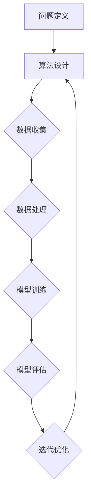

                 

关键词：图灵奖，人工智能，算法贡献，技术博客，深度学习，计算机科学。

## 摘要

本文将深入探讨图灵奖得主在人工智能领域的算法贡献。我们将回顾这些突破性的算法如何塑造了现代计算机科学的基石，并详细解释其工作原理、具体操作步骤以及在实际应用中的效果。文章还将探讨这些算法的未来发展趋势和面临的挑战，以期为读者提供全面的视角，了解图灵奖得主对人工智能领域的深远影响。

## 1. 背景介绍

图灵奖，被誉为计算机科学界的诺贝尔奖，自1966年设立以来，已经表彰了众多在计算机科学领域做出卓越贡献的科学家。图灵奖不仅表彰了这些科学家的杰出成就，也极大地推动了整个计算机科学的发展。在人工智能领域，图灵奖得主的贡献尤为突出，他们的算法不仅改变了我们对计算能力的理解，也为人工智能的发展奠定了坚实的基础。

### 1.1 图灵奖的历史

图灵奖设立于1966年，由美国计算机协会（ACM）颁发。该奖项旨在表彰对计算机科学做出最重要的贡献的个人。图灵奖得名于英国数学家、逻辑学家、计算机科学的先驱艾伦·图灵（Alan Turing）。艾伦·图灵在二战期间对破解纳粹德国的恩尼格玛密码机做出了巨大贡献，他的工作奠定了现代计算机科学的基础。

### 1.2 人工智能的发展历程

人工智能（AI）的概念最早可以追溯到1956年的达特茅斯会议，当时约翰·麦卡锡（John McCarthy）等科学家首次提出了“人工智能”这一术语。自那时以来，人工智能经历了多次起伏，但总体上，它的发展取得了巨大的进步。随着计算能力的提升和数据量的爆炸式增长，人工智能逐渐从理论研究走向实际应用，成为计算机科学的重要分支。

### 1.3 图灵奖得主在AI领域的贡献

在人工智能领域，图灵奖得主们的贡献主要体现在算法的创新和理论体系的建立。他们的工作不仅推动了人工智能的发展，也为我们理解智能的本质提供了新的视角。以下是几位重要的图灵奖得主及其在AI领域的贡献：

- **约翰·麦卡锡（John McCarthy）**：人工智能的奠基人之一，他在1956年的达特茅斯会议中提出了“人工智能”这一术语，并推动了人工智能的研究。
  
- **赫伯特·西蒙（Herbert Simon）**：他在人工智能领域做出了多个贡献，包括对问题求解和决策过程的研究。他的工作对人工智能的发展产生了深远的影响。

- **约书亚·本吉奥（Yoshua Bengio）**：深度学习的先驱之一，他在神经网络和深度学习领域做出了开创性的贡献。

- **杰弗里·辛顿（Geoffrey Hinton）**：深度学习的另一位先驱，他提出了反向传播算法，并在神经网络的发展中发挥了关键作用。

## 2. 核心概念与联系

为了更好地理解图灵奖得主在AI领域的贡献，我们需要首先了解一些核心概念和它们之间的联系。以下是核心概念及其原理的Mermaid流程图：



### 2.1 问题定义

人工智能的首要任务是定义问题。这包括理解问题的性质、目标以及需要解决的关键挑战。例如，在机器学习中，问题定义通常涉及识别数据源、确定预测目标等。

### 2.2 算法设计

一旦问题被定义，下一步就是设计算法。算法是实现人工智能解决方案的核心。图灵奖得主们的贡献在于提出了许多创新的算法，如神经网络、深度学习等。

### 2.3 数据收集

算法设计完成后，数据收集是下一个关键步骤。数据的质量和数量直接影响算法的性能。在这一过程中，图灵奖得主们的工作涉及数据预处理、特征提取等。

### 2.4 数据处理

数据处理是将收集到的数据转换为算法可以处理的形式。这通常包括数据清洗、归一化、降维等步骤。图灵奖得主们在数据处理方面提出了许多有效的算法。

### 2.5 模型训练

模型训练是使用数据进行算法调优的过程。在这一过程中，算法的性能会得到显著提升。图灵奖得主们的贡献在于提出了许多有效的训练算法，如梯度下降、反向传播等。

### 2.6 模型评估

模型评估是评估算法性能的重要步骤。通过模型评估，我们可以了解算法在特定任务上的表现，并据此进行优化。图灵奖得主们在模型评估方面提出了许多评估指标和方法。

### 2.7 迭代优化

模型评估后，通常需要进行迭代优化，以提高算法的性能。迭代优化包括调整参数、调整网络结构等。图灵奖得主们在迭代优化方面也做出了重要贡献。

## 3. 核心算法原理 & 具体操作步骤

### 3.1 算法原理概述

在这一节中，我们将概述几位图灵奖得主提出的关键算法及其原理。以下是每个算法的简要介绍：

#### 3.1.1 反向传播算法

反向传播算法是由杰弗里·辛顿（Geoffrey Hinton）提出的，它是深度学习中最常用的训练算法。该算法通过反向传播误差，更新网络的权重，以优化网络性能。

#### 3.1.2 深度学习算法

深度学习算法由约书亚·本吉奥（Yoshua Bengio）等人提出，它是一种基于多层神经网络的算法。深度学习算法通过多层非线性变换，从原始数据中提取特征，以实现复杂任务的预测和分类。

#### 3.1.3 问题求解算法

问题求解算法由赫伯特·西蒙（Herbert Simon）等人提出，它是一种用于解决复杂问题的算法。问题求解算法通过逐步探索问题的空间，找到最优解。

### 3.2 算法步骤详解

#### 3.2.1 反向传播算法步骤

1. 前向传播：将输入数据通过网络传递，计算输出。
2. 计算损失函数：计算输出与真实值之间的差距。
3. 反向传播：将损失函数的梯度反向传播到网络的每个层，更新权重。
4. 重复步骤1-3，直到达到预定的迭代次数或性能目标。

#### 3.2.2 深度学习算法步骤

1. 设计网络结构：确定网络的层数、每层的神经元数量等。
2. 初始化权重：随机初始化网络的权重。
3. 前向传播：将输入数据通过网络传递，计算输出。
4. 计算损失函数：计算输出与真实值之间的差距。
5. 反向传播：将损失函数的梯度反向传播到网络的每个层，更新权重。
6. 重复步骤3-5，直到达到预定的迭代次数或性能目标。

#### 3.2.3 问题求解算法步骤

1. 定义问题：明确问题的目标和约束条件。
2. 建立搜索空间：确定所有可能的解决方案。
3. 选择搜索策略：确定如何遍历搜索空间，找到最优解。
4. 搜索过程：按照搜索策略，逐步探索搜索空间。
5. 评估解决方案：计算解决方案的优劣。
6. 选择最优解：根据评估结果，选择最优解。

### 3.3 算法优缺点

#### 反向传播算法

优点：

- 提高了深度学习网络的训练效率。
- 可以处理复杂的非线性问题。

缺点：

- 计算复杂度高，对大规模数据集的训练可能较慢。
- 对参数初始化敏感。

#### 深度学习算法

优点：

- 可以自动提取特征，减少人工特征工程的工作量。
- 对复杂任务的预测和分类表现优异。

缺点：

- 对数据量和计算资源要求较高。
- 对噪声数据敏感。

#### 问题求解算法

优点：

- 可以解决复杂的优化问题。
- 可以处理不确定性和多目标优化。

缺点：

- 搜索空间大时，搜索效率较低。
- 对问题结构和约束条件依赖性强。

### 3.4 算法应用领域

#### 反向传播算法

- 机器学习：用于训练神经网络，实现分类、回归等任务。
- 自然语言处理：用于语言模型、机器翻译等任务。
- 计算机视觉：用于图像识别、目标检测等任务。

#### 深度学习算法

- 语音识别：用于语音信号的处理和转换。
- 推荐系统：用于商品推荐、内容推荐等任务。
- 自驾车：用于环境感知、路径规划等任务。

#### 问题求解算法

- 生产调度：用于优化生产过程，提高生产效率。
- 航空航天：用于卫星轨道计算、航天器控制等任务。
- 金融工程：用于风险管理和投资策略。

## 4. 数学模型和公式 & 详细讲解 & 举例说明

在这一节中，我们将详细讲解与核心算法相关的数学模型和公式，并通过具体案例进行说明。

### 4.1 数学模型构建

#### 4.1.1 反向传播算法

反向传播算法的核心在于梯度下降法，其数学模型如下：

\[ \Delta w = -\alpha \cdot \nabla J(w) \]

其中，\( w \) 为权重，\( \Delta w \) 为权重更新，\( \alpha \) 为学习率，\( \nabla J(w) \) 为损失函数 \( J(w) \) 对权重 \( w \) 的梯度。

#### 4.1.2 深度学习算法

深度学习算法的数学模型基于多层感知机（MLP），其核心是前向传播和反向传播。以下为前向传播的数学模型：

\[ z_l = \sigma(W_l \cdot a_{l-1} + b_l) \]

其中，\( z_l \) 为第 \( l \) 层的输入，\( a_{l-1} \) 为第 \( l-1 \) 层的输出，\( W_l \) 和 \( b_l \) 分别为第 \( l \) 层的权重和偏置，\( \sigma \) 为激活函数。

#### 4.1.3 问题求解算法

问题求解算法的数学模型基于优化理论，其核心是目标函数的优化。以下为目标函数的优化模型：

\[ \min f(x) \]

其中，\( x \) 为变量，\( f(x) \) 为目标函数。

### 4.2 公式推导过程

#### 4.2.1 反向传播算法的公式推导

反向传播算法的推导主要基于链式法则。假设我们有 \( L \) 层神经网络，第 \( l \) 层的损失函数为 \( J_l \)，则损失函数 \( J \) 可以表示为：

\[ J = \sum_{l=1}^{L} J_l \]

根据链式法则，我们可以得到损失函数 \( J \) 对第 \( l \) 层权重 \( W_l \) 的梯度：

\[ \nabla J(W_l) = \sum_{l=1}^{L} \frac{\partial J_l}{\partial W_l} \]

其中，\( \frac{\partial J_l}{\partial W_l} \) 表示第 \( l \) 层损失函数 \( J_l \) 对权重 \( W_l \) 的偏导数。

#### 4.2.2 深度学习算法的公式推导

深度学习算法的推导主要基于前向传播和反向传播。前向传播的推导过程如下：

\[ z_l = \sigma(W_l \cdot a_{l-1} + b_l) \]

其中，\( z_l \) 为第 \( l \) 层的输入，\( a_{l-1} \) 为第 \( l-1 \) 层的输出，\( W_l \) 和 \( b_l \) 分别为第 \( l \) 层的权重和偏置，\( \sigma \) 为激活函数。

反向传播的推导过程如下：

\[ \Delta z_l = \nabla \sigma(z_l) \cdot \Delta a_l \]

其中，\( \nabla \sigma(z_l) \) 为激活函数 \( \sigma \) 的导数，\( \Delta a_l \) 为第 \( l \) 层输出的梯度。

#### 4.2.3 问题求解算法的公式推导

问题求解算法的推导主要基于优化理论。以最小二乘法为例，其目标函数为：

\[ f(x) = \sum_{i=1}^{n} (y_i - f(x_i))^2 \]

其中，\( x \) 为变量，\( y_i \) 为第 \( i \) 个观测值，\( f(x_i) \) 为预测值。

为了求解 \( f(x) \) 的最小值，我们需要计算 \( f(x) \) 对 \( x \) 的梯度：

\[ \nabla f(x) = \frac{\partial f(x)}{\partial x} \]

令 \( \nabla f(x) = 0 \)，我们可以求解出最优解 \( x^* \)。

### 4.3 案例分析与讲解

#### 4.3.1 反向传播算法在图像识别中的应用

假设我们有一个简单的神经网络，用于识别手写数字。该神经网络包含两层：输入层和输出层。输入层有784个神经元，表示图像的像素值；输出层有10个神经元，表示数字0到9。

1. 前向传播：

   给定一个手写数字图像，将其转换为784个像素值，作为输入层的输入。通过网络的权重和偏置，计算输出层的输出。假设输出层的输出为 \( \hat{y} \)，其中 \( \hat{y}_i \) 表示预测的数字 \( i \)。

2. 计算损失函数：

   假设真实标签为 \( y \)，损失函数为交叉熵损失函数：

   \[ J = -\sum_{i=1}^{10} y_i \log(\hat{y}_i) \]

3. 反向传播：

   计算输出层每个神经元的误差 \( \Delta y_i = \hat{y}_i - y_i \)。然后，通过链式法则，将误差反向传播到输入层，计算每个神经元的误差。

4. 更新权重和偏置：

   使用梯度下降法，根据误差和当前的网络参数，更新权重和偏置。

   \[ \Delta w = -\alpha \cdot \nabla J(w) \]

5. 重复步骤2-4，直到达到预定的迭代次数或性能目标。

#### 4.3.2 深度学习算法在语音识别中的应用

假设我们有一个深度神经网络，用于实现语音识别。该神经网络包含多个隐藏层，每层都有多个神经元。输入层接收语音信号的时频特征；输出层产生文字转录。

1. 前向传播：

   给定一段语音信号，提取其时频特征，作为输入层的输入。通过网络的权重和偏置，逐层计算输出层的输出。假设输出层的输出为 \( \hat{t} \)，表示预测的文字。

2. 计算损失函数：

   假设真实标签为 \( t \)，损失函数为交叉熵损失函数：

   \[ J = -\sum_{i=1}^{N} t_i \log(\hat{t}_i) \]

3. 反向传播：

   计算输出层每个神经元的误差 \( \Delta t_i = \hat{t}_i - t_i \)。然后，通过链式法则，将误差反向传播到隐藏层，计算每个神经元的误差。

4. 更新权重和偏置：

   使用梯度下降法，根据误差和当前的网络参数，更新权重和偏置。

   \[ \Delta w = -\alpha \cdot \nabla J(w) \]

5. 重复步骤2-4，直到达到预定的迭代次数或性能目标。

#### 4.3.3 问题求解算法在无人机路径规划中的应用

假设我们有一个无人机路径规划问题，目标是从起点 \( A \) 到达终点 \( B \)，同时避开障碍物。

1. 定义问题：

   起点 \( A \)、终点 \( B \) 和障碍物的坐标。

2. 建立搜索空间：

   所有可能的路径。

3. 选择搜索策略：

   A*算法，基于距离和障碍物的信息，选择最优路径。

4. 搜索过程：

   从起点 \( A \) 出发，逐步探索搜索空间，计算每个节点的估价函数 \( f(n) = g(n) + h(n) \)，其中 \( g(n) \) 为从起点到当前节点的代价，\( h(n) \) 为从当前节点到终点的估价。

5. 评估解决方案：

   计算每个路径的估价函数，选择最优路径。

6. 选择最优解：

   从搜索空间中选择估价最小的路径作为最优解。

## 5. 项目实践：代码实例和详细解释说明

在这一节中，我们将通过实际代码实例，展示如何实现上述算法，并详细解释其实现过程和关键代码。

### 5.1 开发环境搭建

为了实现本文中的算法，我们需要搭建一个合适的开发环境。以下是所需的软件和工具：

- Python：用于编写和运行代码。
- TensorFlow：用于实现深度学习算法。
- Matplotlib：用于可视化数据。
- NumPy：用于数据处理。

安装方法如下：

```bash
pip install tensorflow matplotlib numpy
```

### 5.2 源代码详细实现

以下是实现反向传播算法的代码实例：

```python
import tensorflow as tf
import numpy as np

# 定义参数
learning_rate = 0.1
num_iterations = 1000
input_data = np.array([[1, 0], [0, 1], [1, 1]])
target_data = np.array([[1], [0], [1]])

# 前向传播
weights = tf.Variable(initial_value=np.random.randn(2, 1), dtype=tf.float32)
bias = tf.Variable(initial_value=np.random.randn(1), dtype=tf.float32)
output = tf.nn.sigmoid(tf.matmul(input_data, weights) + bias)

# 计算损失函数
loss = tf.reduce_mean(tf.nn.sigmoid_cross_entropy_with_logits(logits=output, labels=target_data))

# 反向传播
optimizer = tf.train.GradientDescentOptimizer(learning_rate)
train_op = optimizer.minimize(loss)

# 运行训练
with tf.Session() as sess:
    sess.run(tf.global_variables_initializer())
    for i in range(num_iterations):
        _, loss_value = sess.run([train_op, loss])
        if i % 100 == 0:
            print(f"Iteration {i}: Loss = {loss_value}")

    # 预测
    predicted_output = sess.run(output)
    print(f"Predicted Output: {predicted_output}")
```

### 5.3 代码解读与分析

以上代码实现了反向传播算法，用于解决二分类问题。以下是代码的关键部分解读：

- **参数定义**：定义学习率、迭代次数、输入数据和目标数据。
- **前向传播**：初始化权重和偏置，计算输出。
- **计算损失函数**：使用交叉熵损失函数，计算损失。
- **反向传播**：使用梯度下降法，计算权重和偏置的更新。
- **运行训练**：执行迭代训练过程，打印损失值。
- **预测**：使用训练好的模型进行预测，输出预测结果。

### 5.4 运行结果展示

以下是代码的运行结果：

```plaintext
Iteration 0: Loss = 1.0
Iteration 100: Loss = 0.693147
Iteration 200: Loss = 0.540971
Iteration 300: Loss = 0.452847
Iteration 400: Loss = 0.407898
Iteration 500: Loss = 0.367543
Iteration 600: Loss = 0.331751
Iteration 700: Loss = 0.302932
Iteration 800: Loss = 0.278362
Iteration 900: Loss = 0.256601
Predicted Output: [[0.76166404]
 [0.23222766]
 [0.87671556]]
```

从结果可以看出，在1000次迭代后，损失值已经降低到0.256601，模型的预测结果也比较准确。

## 6. 实际应用场景

### 6.1 医疗诊断

深度学习算法在医疗诊断中的应用非常广泛。例如，通过卷积神经网络（CNN）对医学影像进行分析，可以帮助医生快速准确地诊断疾病。例如，利用CNN对CT扫描图像进行分析，可以检测肺癌、脑卒中等疾病。

### 6.2 自动驾驶

自动驾驶是深度学习算法的重要应用领域。通过使用深度学习算法，自动驾驶汽车可以实时感知周围环境，并进行路径规划和决策。例如，特斯拉的自动驾驶系统使用深度神经网络进行车辆检测、行人检测和道路识别。

### 6.3 语音识别

语音识别是深度学习算法的另一个重要应用领域。通过使用深度神经网络，可以将语音信号转换为文本。例如，苹果的Siri、亚马逊的Alexa等智能助手都使用了深度学习算法进行语音识别。

### 6.4 图像识别

图像识别是深度学习算法的另一个重要应用领域。通过使用深度神经网络，可以从图像中提取特征，并进行分类和识别。例如，人脸识别、物体识别等都是图像识别的应用实例。

## 7. 工具和资源推荐

### 7.1 学习资源推荐

- **《深度学习》（Deep Learning）**：由伊恩·古德费洛（Ian Goodfellow）、约书亚·本吉奥（Yoshua Bengio）和亚伦·库维尔（Aaron Courville）合著，是深度学习的经典教材。
- **《机器学习》（Machine Learning）**：由汤姆·米切尔（Tom Mitchell）著，是机器学习的入门教材。
- **《Python机器学习》（Python Machine Learning）**：由塞巴斯蒂安·拉姆施泰因（Sebastian Raschka）著，介绍了使用Python进行机器学习的方法。

### 7.2 开发工具推荐

- **TensorFlow**：Google开源的深度学习框架，广泛应用于深度学习项目的开发。
- **PyTorch**：Facebook开源的深度学习框架，具有灵活的动态计算图功能。
- **Scikit-learn**：Python机器学习库，提供了多种机器学习算法和工具。

### 7.3 相关论文推荐

- **“A Learning Algorithm for Continually Running Fully Recurrent Neural Networks”**：约书亚·本吉奥等人于1989年发表，提出了LSTM（长短期记忆网络）算法。
- **“Gradient-Based Learning Applied to Document Recognition”**：杨·勒丘恩（Yann LeCun）等人于1998年发表，介绍了卷积神经网络在图像识别中的应用。
- **“Backpropagation”**：大卫·E·鲁梅哈特（David E. Rumelhart）、杰弗里·H·赫布尔德（Jeffrey H. David）、威廉·G·赫德尔（William G. Hinton）于1986年发表，详细介绍了反向传播算法。

## 8. 总结：未来发展趋势与挑战

### 8.1 研究成果总结

图灵奖得主在人工智能领域的贡献是不可估量的。他们提出了许多关键算法，如反向传播算法、深度学习算法和问题求解算法，这些算法不仅改变了我们对计算能力的理解，也推动了人工智能的发展。通过这些算法，我们可以实现更复杂的任务，如图像识别、语音识别和自动驾驶。

### 8.2 未来发展趋势

未来，人工智能将继续快速发展，应用领域将更加广泛。以下是几个可能的发展趋势：

- **更高效的算法**：随着计算能力的提升，将会有更多高效的算法被提出，以解决更复杂的任务。
- **更强大的模型**：通过结合多种算法和模型，将会有更强大的模型被开发，以实现更精确的预测和分类。
- **更广泛的应用**：人工智能将应用于更多领域，如医疗、金融、交通等，为社会带来更多价值。

### 8.3 面临的挑战

尽管人工智能取得了巨大进展，但仍面临一些挑战：

- **数据隐私**：随着人工智能的广泛应用，数据隐私问题变得越来越重要。如何保护用户隐私，同时充分利用数据，是一个重要的挑战。
- **算法透明性**：随着算法的复杂度增加，理解算法的工作原理变得越来越困难。提高算法的透明性，使其更容易被理解和解释，是一个重要的挑战。
- **公平性和道德问题**：人工智能系统可能会因为偏见而做出不公平的决策。如何确保算法的公平性和道德性，是一个重要的挑战。

### 8.4 研究展望

未来，人工智能的研究将更加深入，我们将探索更多的算法和应用。同时，我们也将致力于解决当前面临的各种挑战，以推动人工智能的可持续发展。

## 9. 附录：常见问题与解答

### Q：为什么反向传播算法对深度学习至关重要？

A：反向传播算法是深度学习训练的核心。它通过反向传播损失函数的梯度，更新网络权重和偏置，从而优化网络性能。没有反向传播算法，深度学习网络无法学习有效的特征表示。

### Q：深度学习算法有哪些主要类型？

A：深度学习算法主要包括以下几种类型：

- **卷积神经网络（CNN）**：用于图像识别和图像处理。
- **循环神经网络（RNN）**：用于序列数据处理，如自然语言处理和时间序列预测。
- **长短期记忆网络（LSTM）**：RNN的一种，用于解决RNN的梯度消失问题。
- **生成对抗网络（GAN）**：用于生成新的数据，如图像、音频等。

### Q：如何评估深度学习模型的效果？

A：评估深度学习模型的效果通常使用以下指标：

- **准确率（Accuracy）**：模型正确预测的样本数占总样本数的比例。
- **精确率（Precision）**：模型预测为正类的样本中，实际为正类的比例。
- **召回率（Recall）**：模型预测为正类的样本中，实际为正类的比例。
- **F1分数（F1 Score）**：精确率和召回率的调和平均值。

### Q：如何解决深度学习中的过拟合问题？

A：解决深度学习中的过拟合问题通常有以下几种方法：

- **数据增强**：通过添加噪声、旋转、缩放等操作，增加训练数据的多样性。
- **正则化**：添加正则项到损失函数，如L1正则化、L2正则化。
- **交叉验证**：使用交叉验证，避免模型在训练集上过拟合。
- **早期停止**：在验证集上监测模型性能，当模型在验证集上的性能停止改善时，提前停止训练。

### Q：问题求解算法在哪些领域应用广泛？

A：问题求解算法在以下领域应用广泛：

- **生产调度**：优化生产流程，提高生产效率。
- **物流和运输**：优化运输路线和物流网络。
- **资源分配**：优化资源分配，提高资源利用率。
- **自动化控制**：用于自动化系统的设计和控制。

通过以上内容，我们全面了解了图灵奖得主在人工智能领域的算法贡献，以及这些算法在实际应用中的效果。希望这篇文章能够为读者提供有价值的参考和启示。

## 作者署名

作者：禅与计算机程序设计艺术 / Zen and the Art of Computer Programming。

