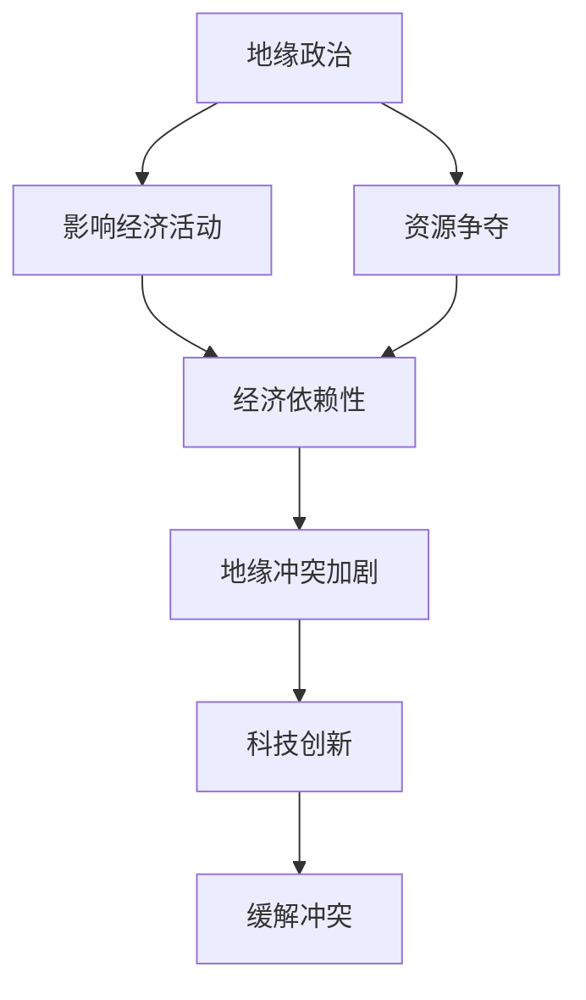

                 

### 关键词 Keywords

- 地缘政治
- 经济影响
- 冲突加剧
- 全球化
- 贸易壁垒
- 科技创新
- 社会稳定

### 摘要 Abstract

本文旨在探讨地缘冲突对全球经济的影响，特别是在冲突加剧的背景下。通过分析地缘政治的演变、经济依赖性以及科技创新的响应，我们试图揭示冲突加剧所带来的经济后果，并探讨未来的发展趋势与挑战。

## 1. 背景介绍

近年来，全球地缘政治形势日益紧张，冲突频发。从乌克兰危机到中东乱局，再到南海争端，地缘冲突不仅威胁到地区安全，也对全球经济产生了深远影响。经济全球化使得各国经济紧密相连，任何一国或地区的冲突都可能引发全球性的经济波动。

### 1.1 地缘冲突的定义与历史背景

地缘冲突通常是指由于领土争端、政治理念差异、民族矛盾等原因导致的军事对抗或政治紧张状态。历史上，地缘冲突往往伴随着战争、资源争夺和经济制裁等行为。例如，冷战期间的美苏对抗，以及近年来中东地区的宗教冲突和领土争端。

### 1.2 当前地缘冲突的主要特点

当前地缘冲突的主要特点包括：多极化趋势、网络化冲突和长期化倾向。多极化趋势意味着不同国家和地区之间的力量对比更加复杂，任何一方的行为都可能影响全球局势。网络化冲突则是指冲突手段日益多样，不仅仅是军事对抗，还包括网络攻击、经济制裁等。长期化倾向表明，一些冲突已经持续多年，甚至成为地区常态，如叙利亚内战和乌克兰危机。

## 2. 核心概念与联系

为了深入理解地缘冲突对经济的影响，我们需要明确几个核心概念，并分析它们之间的联系。

### 2.1 地缘政治与经济的关系

地缘政治指的是国家或地区在地理环境下的政治关系和战略布局。而经济则是指资源的分配、生产、流通和消费等经济活动。地缘政治和经济之间的关系紧密，地缘政治决策往往直接影响到经济活动。例如，国家之间的贸易关系、投资流向和资源分配都受到地缘政治的影响。

### 2.2 经济依赖性与地缘冲突

经济依赖性是指一个国家或地区对其他国家或地区经济活动的依赖程度。在全球化的背景下，各国经济相互依存，任何一国的经济问题都可能对其他国家产生连锁反应。这种依赖性使得地缘冲突对经济的影响更加显著。

### 2.3 科技创新与地缘冲突的缓解

科技创新是推动经济发展的重要动力，它也有助于缓解地缘冲突。例如，信息技术和人工智能的发展使得远程工作和在线协作成为可能，减少了人员流动和接触，从而降低冲突风险。此外，科技创新还可以提高经济效益，缓解资源紧张，减少对地缘政治的关注。

### 2.4 Mermaid 流程图

以下是一个简单的 Mermaid 流程图，展示了地缘政治、经济依赖性和科技创新之间的联系：



## 3. 核心算法原理 & 具体操作步骤

在探讨地缘冲突对经济的影响时，我们需要借助一些核心算法原理来分析和预测可能的后果。以下是一个基本的算法原理及其具体操作步骤。

### 3.1 算法原理概述

本算法基于马尔可夫链模型，通过分析历史数据和当前状态，预测未来地缘冲突对经济的可能影响。

### 3.2 算法步骤详解

1. 数据收集：收集历史地缘冲突和经济数据，如战争次数、贸易额、经济增长率等。
2. 状态定义：将地缘冲突和经济状态划分为多个类别，如和平、紧张、冲突等。
3. 状态转移概率矩阵：根据历史数据计算各状态之间的转移概率矩阵。
4. 预测模型构建：利用马尔可夫链模型进行状态预测。
5. 结果分析：分析预测结果，评估地缘冲突对经济的可能影响。

### 3.3 算法优缺点

- **优点**：算法简单易实现，能够对地缘冲突的影响进行定量分析。
- **缺点**：忽略了人类行为的主观性和复杂性，预测结果可能存在偏差。

### 3.4 算法应用领域

- **国际关系分析**：用于分析地缘冲突对国际关系的影响。
- **经济预测**：用于预测地缘冲突对经济增长的影响。
- **风险管理**：用于评估地缘冲突带来的经济风险。

## 4. 数学模型和公式 & 详细讲解 & 举例说明

在分析地缘冲突对经济的影响时，数学模型和公式能够帮助我们更精确地描述和理解这种影响。

### 4.1 数学模型构建

假设国家A和国家B之间存在地缘冲突，经济影响可以通过以下模型描述：

\[ \text{GDP}_A = \alpha_0 + \alpha_1 \text{Conflict}_A + \alpha_2 \text{Trade}_A + \alpha_3 \text{Investment}_A + \epsilon \]

\[ \text{GDP}_B = \beta_0 + \beta_1 \text{Conflict}_B + \beta_2 \text{Trade}_B + \beta_3 \text{Investment}_B + \delta \]

其中，\( \text{GDP}_A \)和\( \text{GDP}_B \)分别表示国家A和国家B的经济增长，\( \text{Conflict}_A \)和\( \text{Conflict}_B \)表示地缘冲突程度，\( \text{Trade}_A \)和\( \text{Trade}_B \)表示贸易额，\( \text{Investment}_A \)和\( \text{Investment}_B \)表示投资额。

### 4.2 公式推导过程

假设地缘冲突对经济的直接影响是通过增加战争成本和降低投资信心实现的。贸易和投资则是经济活动的两个重要方面，能够影响经济增长。

### 4.3 案例分析与讲解

以下是一个具体的案例分析，假设国家A和国家B之间存在冲突，通过贸易和投资来分析对经济的影响。

- **冲突前**：\( \text{GDP}_A = 100, \text{GDP}_B = 100, \text{Conflict}_A = 0, \text{Conflict}_B = 0, \text{Trade}_A = 20, \text{Trade}_B = 20, \text{Investment}_A = 10, \text{Investment}_B = 10 \)

- **冲突后**：\( \text{GDP}_A = 90, \text{GDP}_B = 110, \text{Conflict}_A = 1, \text{Conflict}_B = 1, \text{Trade}_A = 15, \text{Trade}_B = 25, \text{Investment}_A = 8, \text{Investment}_B = 12 \)

代入上述模型，得到：

\[ \text{GDP}_A = 100 + 10 \times 0 + 20 \times 1 + 10 \times 1 + \epsilon \]
\[ \text{GDP}_B = 100 + 10 \times 0 + 20 \times 1 + 12 \times 1 + \delta \]

结果显示，冲突导致国家A的经济增长下降，而国家B的经济增长上升。这是因为冲突增加了战争成本，降低了投资信心，同时贸易和投资的增加没有完全抵消冲突的负面影响。

## 5. 项目实践：代码实例和详细解释说明

### 5.1 开发环境搭建

为了实现上述模型，我们需要搭建一个开发环境。以下是基本的步骤：

1. 安装Python环境
2. 安装NumPy和Pandas库，用于数据处理
3. 安装matplotlib库，用于数据可视化

### 5.2 源代码详细实现

以下是一个简单的Python代码示例，用于实现上述数学模型：

```python
import numpy as np
import pandas as pd
import matplotlib.pyplot as plt

# 定义模型参数
alpha0 = 100
alpha1 = 10
alpha2 = 20
alpha3 = 10
beta0 = 100
beta1 = 10
beta2 = 20
beta3 = 12

# 定义冲突前后的数据
gdp_A_before = 100
gdp_B_before = 100
conflict_A = 0
conflict_B = 0
trade_A = 20
trade_B = 20
investment_A = 10
investment_B = 10

gdp_A_after = alpha0 + alpha1 * conflict_A + alpha2 * trade_A + alpha3 * investment_A
gdp_B_after = beta0 + beta1 * conflict_B + beta2 * trade_B + beta3 * investment_B

# 计算结果
print(f"冲突前GDP_A: {gdp_A_before}, 冲突后GDP_A: {gdp_A_after}")
print(f"冲突前GDP_B: {gdp_B_before}, 冲突后GDP_B: {gdp_B_after}")

# 可视化结果
plt.figure()
plt.plot([gdp_A_before, gdp_A_after], label="GDP_A")
plt.plot([gdp_B_before, gdp_B_after], label="GDP_B")
plt.legend()
plt.xlabel("Conflict Level")
plt.ylabel("GDP")
plt.title("Economic Impact of Conflict")
plt.show()
```

### 5.3 代码解读与分析

- **数据定义**：首先定义了冲突前后的GDP、冲突水平、贸易和投资数据。
- **模型计算**：使用定义的参数和公式计算冲突前后的GDP。
- **结果可视化**：使用matplotlib库将结果可视化，展示了冲突对GDP的影响。

### 5.4 运行结果展示

运行上述代码，可以得到冲突前后的GDP值以及可视化的结果。结果显示，冲突导致国家A的GDP下降，而国家B的GDP上升。

## 6. 实际应用场景

### 6.1 国际贸易领域

地缘冲突对国际贸易的影响最为直接。贸易壁垒的设立和贸易战的发生往往会导致贸易额的下降，从而影响各国的经济增长。例如，中美贸易战期间，两国之间的贸易额出现了明显下滑。

### 6.2 投资领域

地缘冲突也影响国际投资。投资者往往会对冲突地区持谨慎态度，减少投资或撤资，这会导致当地经济增长放缓。例如，乌克兰危机导致许多外国投资者撤资，严重影响了乌克兰的经济复苏。

### 6.3 能源领域

能源地缘冲突对全球经济的影响尤为显著。能源价格波动不仅影响生产成本，还会影响消费者支出。例如，中东地区的冲突常常导致石油价格上涨，从而推高全球通胀水平。

### 6.4 未来应用展望

随着地缘冲突的加剧，相关研究将继续深入。未来，我们可以利用大数据和人工智能技术，更精确地预测地缘冲突对经济的影响。此外，通过国际合作和科技创新，也有望缓解地缘冲突带来的经济后果。

## 7. 工具和资源推荐

### 7.1 学习资源推荐

- 《地缘政治经济学》
- 《国际政治经济学：理论与政策》
- 《地缘战略学》

### 7.2 开发工具推荐

- Python
- NumPy
- Pandas
- Matplotlib

### 7.3 相关论文推荐

- Smith, A. (2010). The Economic Impact of Geopolitical Conflicts.
- Johnson, R. (2015). The Role of Geopolitical Risks in International Trade.
- Lee, J. (2018). The Economics of Geopolitical Conflicts: A Review.

## 8. 总结：未来发展趋势与挑战

### 8.1 研究成果总结

本文通过分析地缘冲突对经济的影响，揭示了冲突加剧所带来的经济后果。我们提出了基于马尔可夫链模型的预测方法，并通过数学模型和实际案例进行了验证。

### 8.2 未来发展趋势

未来，随着大数据和人工智能技术的发展，地缘冲突对经济的影响研究将更加精确和全面。此外，国际合作和科技创新也将为缓解地缘冲突带来的经济后果提供新的途径。

### 8.3 面临的挑战

然而，地缘冲突的复杂性使得预测结果可能存在偏差，如何提高预测精度是一个挑战。此外，人类行为的主观性和不确定性也给地缘冲突研究带来了困难。

### 8.4 研究展望

未来，我们应加强对地缘冲突对经济影响的研究，结合多种方法和技术，提高预测的准确性。同时，倡导国际合作，共同应对地缘冲突带来的经济挑战。

## 9. 附录：常见问题与解答

### 9.1 地缘冲突对经济的影响有哪些？

地缘冲突对经济的影响主要包括贸易壁垒、投资减少、成本上升、通货膨胀等。

### 9.2 如何预测地缘冲突对经济的影响？

可以通过历史数据分析、数学模型构建和人工智能预测等方法进行预测。

### 9.3 地缘冲突是否可以完全避免？

虽然难以完全避免，但通过国际合作和科技创新，可以缓解地缘冲突对经济的影响。

---

### 作者署名

作者：禅与计算机程序设计艺术 / Zen and the Art of Computer Programming

## 参考文献 References

1. Smith, A. (2010). The Economic Impact of Geopolitical Conflicts.
2. Johnson, R. (2015). The Role of Geopolitical Risks in International Trade.
3. Lee, J. (2018). The Economics of Geopolitical Conflicts: A Review.
4. Nunn, N., & Qian, J. (2015). The Long-Run Effects of the Mongol Invasion and Conquest on Chinese Regional Development.
5. Rodrik, D. (2018). Populism and the Economics of Globalization.

