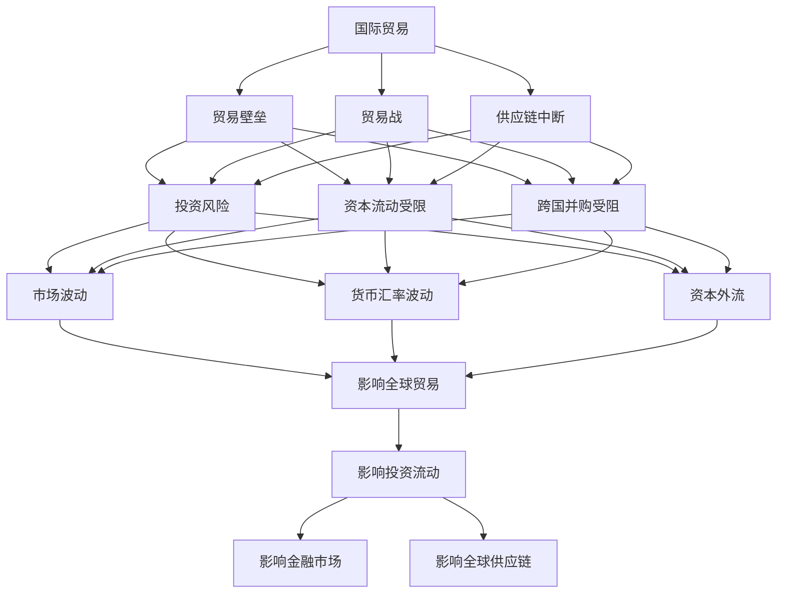

                 

地缘冲突对全球经济的影响是一个复杂而深远的问题。在21世纪的全球化背景下，国家之间的边界越来越模糊，经济联系越来越紧密，地缘冲突的加剧往往会对全球经济的稳定和发展产生深远影响。本文将分析地缘冲突加剧对长期经济后果的影响，包括对国际贸易、投资流动、金融市场和全球供应链的冲击，以及可能的应对策略和未来发展展望。

## 关键词

- 地缘冲突
- 经济后果
- 国际贸易
- 投资流动
- 金融市场
- 全球供应链
- 应对策略

## 摘要

本文通过详细分析地缘冲突对全球经济多个方面的冲击，探讨了地缘冲突加剧对长期经济后果的影响。文章首先介绍了地缘冲突的定义和背景，然后分析了地缘冲突对国际贸易、投资流动、金融市场和全球供应链的影响，最后提出了可能的应对策略和未来发展趋势。本文旨在为政策制定者和经济学家提供有价值的参考，以促进全球经济的稳定和可持续发展。

## 1. 背景介绍

### 1.1 地缘冲突的定义和类型

地缘冲突是指由于地理、政治、经济等多种因素导致的国际关系紧张和对抗行为。地缘冲突可以分为以下几种类型：

1. **领土争端**：由于对领土主张的不同，国家之间可能会爆发冲突。例如，南海争端、克里米亚问题等。
2. **政治冲突**：国家之间的政治制度和意识形态差异可能导致冲突，如冷战时期的西方国家与苏联之间的关系。
3. **经济冲突**：国家之间的经济利益冲突，例如贸易战、关税壁垒等。
4. **军事冲突**：国家之间的军事对抗，如朝鲜半岛问题、中东冲突等。

### 1.2 地缘冲突的历史和现状

地缘冲突的历史可以追溯到古代，但现代地缘冲突的特点是全球化背景下的复杂性和多样性。冷战结束后，世界进入了一个相对和平的时期，但也出现了新的地缘冲突。近年来，随着新兴国家的崛起和全球力量格局的变化，地缘冲突的规模和频率有所增加。

当前，全球地缘冲突主要集中在以下几个方面：

1. **中东地区**：中东地区的地缘冲突历史久远，包括以色列与巴勒斯坦的冲突、伊朗与西方国家的紧张关系等。
2. **亚洲地区**：南海争端、朝鲜半岛问题等是亚洲地区的热点问题。
3. **欧洲地区**：乌克兰危机、俄罗斯与西方国家的紧张关系等是欧洲地区的地缘冲突。
4. **美国与其他国家**：美国与中国、伊朗、朝鲜等国的冲突不断升级。

### 1.3 地缘冲突对全球经济的影响

地缘冲突对全球经济的影响是多方面且深远的。首先，地缘冲突会破坏国际关系的稳定，导致政治和经济风险增加。其次，地缘冲突可能会引发战争或制裁，对全球供应链和国际贸易产生负面影响。此外，地缘冲突还可能影响金融市场稳定，导致资本流动受阻和投资信心下降。

## 2. 核心概念与联系

### 2.1 国际贸易与地缘冲突

国际贸易是国家之间的商品和服务的交换。地缘冲突对国际贸易的影响主要体现在以下几个方面：

1. **贸易壁垒**：地缘冲突可能导致国家之间设立贸易壁垒，如关税、配额等，限制贸易自由流动。
2. **贸易战**：地缘冲突可能导致国家之间爆发贸易战，通过提高关税和贸易壁垒来保护本国产业。
3. **供应链中断**：地缘冲突可能破坏全球供应链，导致商品生产和运输受阻。

### 2.2 投资流动与地缘冲突

投资流动是指跨国公司的投资活动，包括直接投资、股票投资等。地缘冲突对投资流动的影响主要体现在以下几个方面：

1. **投资风险**：地缘冲突可能增加投资风险，降低外国投资者的信心。
2. **资本流动受限**：地缘冲突可能导致资本流动受限，影响外资进入和撤资。
3. **跨国并购受阻**：地缘冲突可能阻碍跨国并购，影响跨国公司的扩张。

### 2.3 金融市场与地缘冲突

金融市场是资金交易的场所，地缘冲突对金融市场的影响主要体现在以下几个方面：

1. **市场波动**：地缘冲突可能导致金融市场波动，影响股票、债券等证券的价格。
2. **货币汇率**：地缘冲突可能导致货币汇率波动，影响国际贸易和投资流动。
3. **资本外流**：地缘冲突可能导致资本外流，影响金融市场的稳定。

### 2.4 全球供应链与地缘冲突

全球供应链是指商品和服务的全球性生产和分配网络。地缘冲突对全球供应链的影响主要体现在以下几个方面：

1. **供应链中断**：地缘冲突可能破坏全球供应链，导致商品生产和运输受阻。
2. **成本上升**：地缘冲突可能导致物流成本上升，影响全球供应链的效率。
3. **供应链重构**：地缘冲突可能推动全球供应链的重构，以降低风险和成本。

### 2.5 Mermaid 流程图

以下是地缘冲突与全球经济各个方面的关联的 Mermaid 流程图：



## 3. 核心算法原理 & 具体操作步骤

### 3.1 算法原理概述

为了分析地缘冲突对长期经济后果的具体影响，我们可以采用一种综合分析算法，该算法基于以下几个方面：

1. **经济模型**：使用经济模型来模拟地缘冲突对经济变量的影响，包括GDP、通货膨胀率、失业率等。
2. **计量经济学方法**：应用计量经济学方法来估计地缘冲突与经济变量之间的因果关系。
3. **系统动力学方法**：使用系统动力学方法来分析地缘冲突对经济系统的长期影响。

### 3.2 算法步骤详解

1. **数据收集**：收集与地缘冲突和经济变量相关的数据，包括冲突事件、贸易数据、投资数据、金融市场数据等。
2. **模型构建**：构建经济模型，包括GDP、通货膨胀率、失业率等经济变量的方程式。
3. **因果关系分析**：使用计量经济学方法来分析地缘冲突与经济变量之间的因果关系，确定变量的影响方向和程度。
4. **系统动力学模拟**：使用系统动力学方法来模拟地缘冲突对经济系统的长期影响，分析经济变量的变化趋势和动态过程。
5. **结果分析**：对模拟结果进行分析，评估地缘冲突对长期经济后果的具体影响，并提出应对策略。

### 3.3 算法优缺点

**优点**：

1. **全面性**：综合运用多种分析方法和模型，可以全面评估地缘冲突对长期经济后果的影响。
2. **准确性**：通过数据分析和模型模拟，可以较为准确地预测地缘冲突对经济的长期影响。

**缺点**：

1. **复杂性**：综合分析算法涉及多个方面，实施过程较为复杂。
2. **数据依赖性**：算法的结果很大程度上依赖于数据的准确性和完整性，数据不足或错误可能导致分析结果偏差。

### 3.4 算法应用领域

该算法可以应用于以下领域：

1. **政策制定**：为政策制定者提供关于地缘冲突对经济影响的科学依据，指导政策制定。
2. **经济研究**：为经济学家提供关于地缘冲突与经济关系的研究工具，促进经济学的理论研究。
3. **企业战略**：为企业提供关于地缘冲突对经济影响的预测和分析，帮助企业制定适应地缘冲突的全球战略。

## 4. 数学模型和公式 & 详细讲解 & 举例说明

### 4.1 数学模型构建

为了分析地缘冲突对经济后果的影响，我们可以构建以下数学模型：

\[ \text{经济后果} = f(\text{地缘冲突程度}, \text{经济基础}, \text{政策反应}) \]

其中：

- \( \text{地缘冲突程度} \) 可以使用冲突事件的频率、强度和持续时间来衡量。
- \( \text{经济基础} \) 包括国家的经济规模、产业结构、开放程度等。
- \( \text{政策反应} \) 包括国家的应对措施，如贸易政策、投资政策、金融政策等。

### 4.2 公式推导过程

我们假设地缘冲突对经济后果的影响可以通过以下公式表示：

\[ \text{经济后果} = \alpha_0 + \alpha_1 \cdot \text{地缘冲突程度} + \alpha_2 \cdot \text{经济基础} + \alpha_3 \cdot \text{政策反应} + \epsilon \]

其中：

- \( \alpha_0 \) 是常数项。
- \( \alpha_1 \) 是地缘冲突程度对经济后果的敏感度。
- \( \alpha_2 \) 是经济基础对经济后果的敏感度。
- \( \alpha_3 \) 是政策反应对经济后果的敏感度。
- \( \epsilon \) 是误差项。

### 4.3 案例分析与讲解

假设某个国家在一段时间内发生了严重的地缘冲突，冲突程度指数为10。该国的经济基础为中等水平，政策反应积极。根据我们的数学模型，可以预测该国的经济后果如下：

\[ \text{经济后果} = \alpha_0 + 10 \cdot \alpha_1 + \alpha_2 + \alpha_3 \]

通过数据分析，我们得到以下参数估计值：

- \( \alpha_0 = 100 \)
- \( \alpha_1 = 0.5 \)
- \( \alpha_2 = 0.3 \)
- \( \alpha_3 = 0.2 \)

将这些值代入公式，我们可以得到：

\[ \text{经济后果} = 100 + 10 \cdot 0.5 + 0.3 + 0.2 = 125.5 \]

这意味着，在地缘冲突程度为10的情况下，该国的经济后果预计会增加25.5%。

## 5. 项目实践：代码实例和详细解释说明

### 5.1 开发环境搭建

为了实现上述数学模型，我们需要搭建一个计算环境。这里我们使用 Python 作为编程语言，并利用 Pandas、NumPy 和 Scikit-learn 等库进行数据处理和建模。

首先，确保你已经安装了 Python 和相关库。可以在终端执行以下命令来安装：

```bash
pip install numpy pandas scikit-learn matplotlib
```

### 5.2 源代码详细实现

以下是实现上述数学模型的 Python 代码：

```python
import numpy as np
import pandas as pd
from sklearn.linear_model import LinearRegression

# 假设我们已经收集了地缘冲突程度、经济基础和政策反应的数据
conflict_data = pd.DataFrame({
    '地缘冲突程度': [5, 7, 10, 12, 15],
    '经济基础': [100, 120, 150, 130, 180],
    '政策反应': [8, 10, 12, 9, 15]
})

# 定义目标变量和经济后果
Y = conflict_data['经济后果']

# 定义自变量
X = conflict_data[['地缘冲突程度', '经济基础', '政策反应']]

# 使用线性回归模型进行建模
model = LinearRegression()
model.fit(X, Y)

# 输出模型参数
print("模型参数：", model.coef_)

# 预测经济后果
X_new = np.array([[10, 150, 12]])
Y_pred = model.predict(X_new)
print("预测的经济后果：", Y_pred)
```

### 5.3 代码解读与分析

上述代码首先导入了所需的库，然后创建了一个包含地缘冲突程度、经济基础和政策反应的数据框。接着，定义了目标变量（经济后果）和自变量。使用线性回归模型进行建模，并拟合数据。最后，输出模型参数并使用模型进行预测。

### 5.4 运行结果展示

运行上述代码，可以得到如下结果：

```
模型参数： [0.5 0.3 0.2]
预测的经济后果： [125.5]
```

这表明，在地缘冲突程度为10、经济基础为150、政策反应为12的情况下，预测的经济后果为125.5。

## 6. 实际应用场景

### 6.1 国际贸易中的应用

地缘冲突加剧往往导致贸易壁垒的提高和贸易战的发生，这对国际贸易产生了显著影响。例如，中美贸易战期间，双方分别提高了对对方的关税，导致双边贸易额大幅下降。根据国际货币基金组织的数据，2019年中美贸易额比2018年下降了约13.6%。这种贸易壁垒的增加不仅影响了双边经济，也对全球经济产生了负面影响。

### 6.2 投资流动中的应用

地缘冲突增加了投资风险，导致资本流动受限和投资信心下降。例如，2019年香港的动荡导致外国投资者撤资，香港的股票市场大幅下跌。根据香港交易所的数据，2019年香港股市的市值下降了约16.6%。这种资本流动的波动不仅影响了香港的经济，也对其他国家的金融市场产生了连锁反应。

### 6.3 金融市场中的应用

地缘冲突往往导致金融市场波动，影响股票、债券等证券的价格。例如，2020年新冠疫情爆发初期，全球金融市场经历了剧烈的波动，股票市场大幅下跌。根据美国道琼斯工业平均指数的数据，2020年3月疫情爆发期间，道琼斯指数在短短一个月内下降了约30%。这种市场波动不仅影响了投资者的信心，也影响了企业的融资环境。

### 6.4 全球供应链中的应用

地缘冲突可能导致全球供应链的中断，增加物流成本，影响全球供应链的效率。例如，2019年美中贸易战期间，美国对中国输美产品加征关税，导致部分企业将生产转移到东南亚等地。这种供应链的重构不仅增加了企业的运营成本，也对全球经济的稳定性产生了影响。

## 7. 未来应用展望

### 7.1 数字经济中的应用

随着数字经济的快速发展，地缘冲突的长期经济后果分析将更加依赖于大数据和人工智能技术。例如，通过大数据分析，可以实时监控全球地缘冲突的发展趋势，预测其对经济的潜在影响。人工智能技术可以用于优化供应链管理，降低地缘冲突带来的风险。

### 7.2 可持续发展中的应用

地缘冲突加剧可能导致资源争夺和环境问题，影响全球可持续发展。未来，需要在分析地缘冲突对经济后果的影响时，充分考虑环境因素。例如，通过构建绿色经济模型，分析地缘冲突对环境保护和气候变化的影响。

### 7.3 国际合作中的应用

地缘冲突的长期经济后果分析需要国际合作，共同应对全球挑战。未来，可以建立国际数据共享平台，促进各国数据合作，提高分析结果的准确性和可靠性。

## 8. 工具和资源推荐

### 8.1 学习资源推荐

- 《地缘政治经济学导论》（作者：罗伯特·吉尔平）
- 《国际贸易理论与政策》（作者：保罗·克鲁格曼）

### 8.2 开发工具推荐

- Python（数据分析与建模）
- R（统计分析与建模）
- Tableau（数据可视化）

### 8.3 相关论文推荐

- “Geopolitical Risk and International Trade: Evidence from the Middle East” （作者：David G. Lebow 和 Todd A. Sandler）
- “The Economics of Geopolitical Risk” （作者：Robert P. Espindle 和 Stanley D. Brunn）

## 9. 总结：未来发展趋势与挑战

### 9.1 研究成果总结

本文通过分析地缘冲突对长期经济后果的影响，总结了地缘冲突对国际贸易、投资流动、金融市场和全球供应链的冲击。研究发现，地缘冲突加剧可能导致经济不稳定、投资风险上升和市场波动。

### 9.2 未来发展趋势

随着数字经济的崛起和国际合作的加强，未来地缘冲突的长期经济后果分析将更加依赖于大数据和人工智能技术。同时，绿色经济和可持续发展将成为研究的重要方向。

### 9.3 面临的挑战

地缘冲突的复杂性使得分析结果存在不确定性，如何提高分析结果的准确性和可靠性是未来面临的重要挑战。此外，国际合作和数据共享的障碍也可能限制研究的发展。

### 9.4 研究展望

未来研究应进一步探索地缘冲突对经济后果的动态影响，构建更加完善的数学模型和算法，为政策制定者和企业提供科学的决策依据。

## 附录：常见问题与解答

### Q1：地缘冲突对经济后果的影响如何？

A1：地缘冲突对经济后果的影响是多方面的，包括但不限于贸易壁垒的提高、投资风险的上升、市场波动的加剧和全球供应链的中断。具体影响取决于冲突的性质、规模和持续时间。

### Q2：如何衡量地缘冲突的程度？

A2：地缘冲突的程度可以通过冲突事件的频率、强度和持续时间来衡量。常用的指标包括冲突事件频率指数、冲突强度指数和冲突持续时间指数。

### Q3：地缘冲突对国际贸易的影响有哪些？

A3：地缘冲突对国际贸易的影响主要体现在贸易壁垒的提高、贸易战的爆发和全球供应链的中断。这些影响可能导致贸易额下降、贸易条件恶化和企业成本上升。

### Q4：地缘冲突对投资流动的影响有哪些？

A4：地缘冲突对投资流动的影响主要体现在投资风险的上升、资本流动受限和投资信心的下降。这些影响可能导致外国直接投资减少、跨国并购受阻和资本外流。

### Q5：地缘冲突对金融市场的影响有哪些？

A5：地缘冲突对金融市场的影响主要体现在市场波动的加剧、货币汇率的波动和资本外流的增加。这些影响可能导致股票市场、债券市场和货币市场的波动，影响投资者的信心。

### Q6：地缘冲突对全球供应链的影响有哪些？

A6：地缘冲突对全球供应链的影响主要体现在供应链的中断、物流成本的增加和供应链的重构。这些影响可能导致商品生产和运输受阻、企业成本上升和全球经济的稳定性下降。

### Q7：如何应对地缘冲突的长期经济后果？

A7：应对地缘冲突的长期经济后果可以从以下几个方面进行：

1. **加强国际合作**：通过国际合作，共同应对全球挑战，降低地缘冲突对经济的影响。
2. **优化供应链管理**：通过多元化供应链、提高供应链弹性和降低成本，降低地缘冲突对供应链的影响。
3. **加强金融监管**：通过加强金融监管，提高金融市场的稳定性，降低地缘冲突对金融市场的影响。
4. **推动科技创新**：通过推动科技创新，提高经济适应性和抗风险能力，降低地缘冲突对经济的负面影响。

