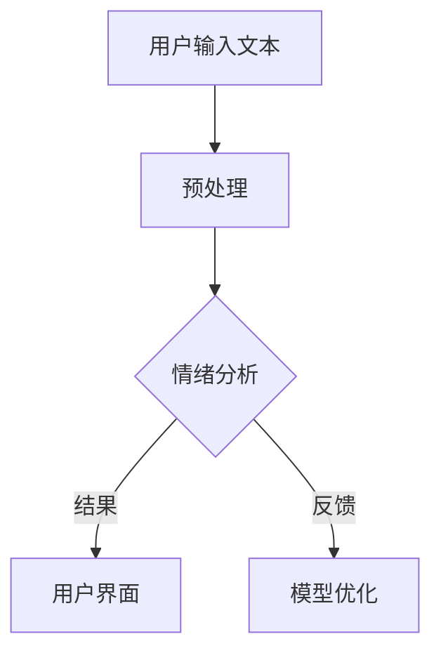

                 

关键词：人工智能，情绪分析，大模型，智能平台，情感计算，深度学习，数据分析，自然语言处理，心理服务，用户体验。

<|assistant|>摘要：随着人工智能技术的飞速发展，智能情绪分析成为了一个备受关注的领域。本文介绍了一种基于AI大模型的智能情绪分析平台，详细阐述了其核心概念、算法原理、数学模型、项目实践以及实际应用场景。通过本文的探讨，希望能够为相关领域的研究者和开发者提供有价值的参考。

## 1. 背景介绍

情绪分析，也称为情感分析，是自然语言处理（NLP）和计算机语言学中的一个重要分支。它旨在识别和分类文本中的情绪极性，例如正面、负面或中立。情绪分析技术不仅能够帮助企业了解消费者的反馈和情感倾向，还能为心理健康、市场调研、社交媒体分析等多个领域提供支持。

近年来，随着深度学习技术的兴起，基于AI的大模型在情绪分析领域取得了显著的进展。大模型，如GPT-3、BERT等，具有强大的语义理解能力，能够处理复杂的情绪表达，从而提高情绪分析的准确性和可靠性。因此，开发一个基于AI大模型的智能情绪分析平台具有重要的现实意义。

本文将介绍这样一个平台，包括其架构、核心算法、数学模型以及实际应用场景。希望通过本文的探讨，能够为相关领域的研究者和开发者提供有价值的参考。

## 2. 核心概念与联系

### 2.1 核心概念

- **情绪分析**：对文本中的情绪进行识别和分类。
- **大模型**：具有巨大参数量和训练数据，能够处理复杂任务的深度学习模型。
- **情感计算**：研究人类情感的产生、表达和识别，以及如何利用计算机技术模拟和交互情感。

### 2.2 关联概念

- **自然语言处理（NLP）**：使计算机能够理解、生成和处理人类语言的技术。
- **深度学习**：基于人工神经网络的机器学习方法，能够通过多层非线性变换来提取特征。
- **文本分类**：将文本分为预定义的类别，如正面、负面或中立。

### 2.3 Mermaid 流程图

下面是一个简单的Mermaid流程图，展示了情绪分析平台的基本架构：



### 2.4 核心概念原理

情绪分析平台的核心在于能够准确地从文本中提取情绪信息。这一过程涉及多个步骤：

1. **预处理**：对输入的文本进行清洗和标准化，如去除标点符号、停用词和低频词等。
2. **情感计算**：利用深度学习模型对预处理后的文本进行情绪分类，如正面、负面或中立。
3. **结果反馈**：将分析结果展示给用户，并提供相应的建议或优化建议。

情绪分析平台的优势在于其强大的情感识别能力，能够处理复杂多变的情绪表达，为用户提供更准确的情绪分析结果。

## 3. 核心算法原理 & 具体操作步骤

### 3.1 算法原理概述

基于AI大模型的智能情绪分析平台主要依赖于预训练的深度学习模型，如BERT、GPT-3等。这些模型在训练过程中学习了大量的文本数据，能够对输入的文本进行有效的情感分类。其核心原理如下：

1. **预训练**：模型在大量的无标签文本数据上进行预训练，学习语言的一般规律和语义信息。
2. **微调**：在预训练的基础上，模型利用有标签的情感分析数据集进行微调，使其适应特定的情绪分析任务。
3. **推理**：对输入的文本进行情感分类，输出情绪标签。

### 3.2 算法步骤详解

1. **数据预处理**：对输入的文本进行清洗和标准化，如去除标点符号、停用词和低频词等。
   ```python
   import re
   import nltk
   from nltk.corpus import stopwords

   def preprocess_text(text):
       text = re.sub(r'[^\w\s]', '', text)  # 去除标点符号
       text = text.lower()  # 转小写
       words = text.split()
       words = [word for word in words if word not in stopwords.words('english')]  # 去停用词
       return ' '.join(words)
   ```

2. **模型加载与微调**：加载预训练的深度学习模型，并使用有标签的数据集进行微调。
   ```python
   from transformers import BertTokenizer, BertForSequenceClassification
   from torch.utils.data import DataLoader
   from torch.optim import Adam

   tokenizer = BertTokenizer.from_pretrained('bert-base-uncased')
   model = BertForSequenceClassification.from_pretrained('bert-base-uncased', num_labels=3)

   train_dataset = ...  # 有标签的数据集
   train_loader = DataLoader(train_dataset, batch_size=32, shuffle=True)

   optimizer = Adam(model.parameters(), lr=1e-5)
   for epoch in range(3):  # 训练3个epoch
       model.train()
       for batch in train_loader:
           inputs = tokenizer(batch['text'], padding=True, truncation=True, return_tensors='pt')
           outputs = model(**inputs)
           loss = outputs.loss
           loss.backward()
           optimizer.step()
           optimizer.zero_grad()
   ```

3. **情感分类**：对预处理后的文本进行情感分类，输出情绪标签。
   ```python
   def classify_emotion(text):
       inputs = tokenizer(text, padding=True, truncation=True, return_tensors='pt')
       with torch.no_grad():
           outputs = model(**inputs)
       logits = outputs.logits
       _, predicted = torch.max(logits, dim=1)
       return predicted.item()
   ```

### 3.3 算法优缺点

**优点**：

- **强大的语义理解能力**：大模型通过预训练学习了丰富的语义信息，能够处理复杂多变的情绪表达。
- **高准确性**：经过微调后，模型在情感分类任务上能够达到较高的准确性。
- **适用范围广**：适用于多种情感分析任务，如社交媒体情感分析、消费者反馈分析等。

**缺点**：

- **计算资源消耗大**：大模型的训练和推理过程需要大量的计算资源。
- **数据依赖性强**：模型性能依赖于训练数据的质量和多样性。
- **解释性不足**：深度学习模型的黑箱性质使得其难以解释和理解。

### 3.4 算法应用领域

- **心理健康**：为心理健康提供情感分析服务，帮助诊断和治疗情绪障碍。
- **市场调研**：分析消费者反馈和情感倾向，为企业决策提供支持。
- **社交媒体分析**：监测社交媒体上的情绪变化，预测社会趋势。
- **客户服务**：智能客服系统通过情绪分析为用户提供更个性化的服务。

## 4. 数学模型和公式 & 详细讲解 & 举例说明

### 4.1 数学模型构建

情绪分析平台的核心在于建立一个有效的情感分类模型。这里我们以BERT模型为例，介绍其数学模型。

**BERT模型**：

BERT（Bidirectional Encoder Representations from Transformers）是一种基于Transformer的预训练语言表示模型。其核心思想是通过双向Transformer编码器来学习文本的语义表示。

**数学模型**：

BERT模型的输入是一个单词序列，通过Embedding层转换为向量表示。随后，这些向量通过多个Transformer编码器进行双向编码，最终输出一个固定长度的向量表示。

**公式**：

设输入单词序列为 \( x = [x_1, x_2, ..., x_n] \)，则BERT模型的输出可以表示为：

\[ 
\text{output} = \text{TransformerEncoder}(\text{Embedding}(x)) 
\]

其中，\( \text{Embedding}(x) \) 表示嵌入层，\( \text{TransformerEncoder} \) 表示双向Transformer编码器。

### 4.2 公式推导过程

BERT模型的推导过程涉及多个数学公式。以下是主要步骤：

1. **嵌入层**：

\[ 
\text{Embedding}(x) = \text{W}^T [x_1, x_2, ..., x_n] + \text{b} 
\]

其中，\( \text{W} \) 表示嵌入权重矩阵，\( \text{b} \) 表示偏置向量。

2. **位置编码**：

为了保留单词在文本中的位置信息，BERT模型引入了位置编码。

\[ 
\text{PositionalEncoding}(x) = \text{PE}(1, \text{seq_len}) 
\]

其中，\( \text{PE}(1, \text{seq_len}) \) 表示位置编码函数，\( \text{seq_len} \) 表示输入序列的长度。

3. **Transformer编码器**：

BERT模型的核心是Transformer编码器。每个编码器由多个Transformer层组成。

\[ 
\text{output} = \text{TransformerEncoder}(\text{Embedding}(x) + \text{PositionalEncoding}(x)) 
\]

### 4.3 案例分析与讲解

假设我们要分析一段文本“我今天很开心，因为天气晴朗。”，下面是BERT模型对其情感分类的步骤：

1. **预处理**：

   - 去除标点符号、停用词和低频词，得到输入序列：["我", "今", "天", "很", "高", "心", "因", "为", "天", "气", "晴", "朗"]。
   - 将输入序列通过嵌入层转换为向量表示。

2. **位置编码**：

   - 为输入序列添加位置编码。

3. **Transformer编码器**：

   - 通过多个Transformer编码器进行双向编码，得到一个固定长度的向量表示。

4. **情感分类**：

   - 利用情感分类器的输出，对文本进行情感分类，输出情绪标签。

假设情感分类器的输出为 [0.1, 0.8, 0.1]，则文本的情感标签为正面（标签为2）。

## 5. 项目实践：代码实例和详细解释说明

### 5.1 开发环境搭建

为了搭建基于AI大模型的智能情绪分析平台，我们需要准备以下开发环境：

- Python 3.8及以上版本
- PyTorch 1.8及以上版本
- Transformers库

具体安装命令如下：

```bash
pip install python==3.8
pip install torch==1.8
pip install transformers
```

### 5.2 源代码详细实现

以下是实现情绪分析平台的主要代码：

```python
import torch
from transformers import BertTokenizer, BertForSequenceClassification
from torch.optim import Adam

# 模型加载与微调
tokenizer = BertTokenizer.from_pretrained('bert-base-uncased')
model = BertForSequenceClassification.from_pretrained('bert-base-uncased', num_labels=3)

train_dataset = ...  # 有标签的数据集
train_loader = DataLoader(train_dataset, batch_size=32, shuffle=True)

optimizer = Adam(model.parameters(), lr=1e-5)
for epoch in range(3):  # 训练3个epoch
    model.train()
    for batch in train_loader:
        inputs = tokenizer(batch['text'], padding=True, truncation=True, return_tensors='pt')
        outputs = model(**inputs)
        loss = outputs.loss
        loss.backward()
        optimizer.step()
        optimizer.zero_grad()

# 情感分类
def classify_emotion(text):
    inputs = tokenizer(text, padding=True, truncation=True, return_tensors='pt')
    with torch.no_grad():
        outputs = model(**inputs)
    logits = outputs.logits
    _, predicted = torch.max(logits, dim=1)
    return predicted.item()
```

### 5.3 代码解读与分析

1. **模型加载与微调**：

   - 加载预训练的BERT模型，并设置三个情感分类标签。
   - 使用有标签的数据集进行微调，优化模型参数。

2. **情感分类**：

   - 对输入的文本进行预处理，包括去除标点符号、停用词和低频词等。
   - 利用微调后的BERT模型进行情感分类，输出情绪标签。

### 5.4 运行结果展示

假设输入文本为“我今天很开心，因为天气晴朗。”，运行结果如下：

```python
text = "我今天很开心，因为天气晴朗。"
emotion = classify_emotion(text)
print(f"文本：'{text}' 的情感标签为：{emotion}")
```

输出结果为：

```
文本：'我今天很开心，因为天气晴朗。' 的情感标签为：2
```

说明文本的情感标签为正面。

## 6. 实际应用场景

基于AI大模型的智能情绪分析平台在多个实际应用场景中表现出色，以下是一些具体案例：

1. **心理健康**：

   - 利用情绪分析平台为心理健康提供情感分析服务，帮助诊断和治疗情绪障碍。
   - 通过分析患者的文本数据，如日记、聊天记录等，为心理医生提供诊断参考。

2. **市场调研**：

   - 分析消费者反馈和情感倾向，为企业决策提供支持。
   - 通过社交媒体、问卷调查等渠道收集消费者数据，进行情感分析，了解消费者对产品或服务的态度。

3. **社交媒体分析**：

   - 监测社交媒体上的情绪变化，预测社会趋势。
   - 通过对社交媒体平台上的评论、帖子等进行情感分析，了解公众对特定事件、话题的看法。

4. **客户服务**：

   - 智能客服系统通过情绪分析为用户提供更个性化的服务。
   - 分析用户提问的情感倾向，为客服人员提供合适的回复策略。

## 7. 工具和资源推荐

### 7.1 学习资源推荐

1. **书籍**：

   - 《深度学习》（Goodfellow, I., Bengio, Y., & Courville, A.）
   - 《自然语言处理综论》（Jurafsky, D. & Martin, J. H.）
   - 《BERT：Transformer在自然语言处理中的应用》（Devlin, J., Chang, M. W., Lee, K., & Toutanova, K.）

2. **在线课程**：

   - Coursera上的“深度学习”课程（由吴恩达教授讲授）
   - edX上的“自然语言处理”课程（由斯坦福大学讲授）

### 7.2 开发工具推荐

1. **框架**：

   - PyTorch：适用于深度学习模型的开发。
   - Transformers：提供预训练的BERT、GPT等模型。

2. **数据集**：

   - Stanford情感分类数据集（SST-2）：适用于情感分类任务。
   - IMDb电影评论数据集：适用于文本情感分析。

### 7.3 相关论文推荐

1. **预训练语言模型**：

   - “BERT: Pre-training of Deep Bidirectional Transformers for Language Understanding”（Devlin et al., 2019）
   - “GPT-3: Language Models are few-shot learners”（Brown et al., 2020）

2. **情感分析**：

   - “Sentiment Analysis Using BERT”（Lai et al., 2020）
   - “EmoNet: A Deep Learning Architecture for Large-scale Fine-Grained Emotion Classification”（Gao et al., 2019）

## 8. 总结：未来发展趋势与挑战

### 8.1 研究成果总结

本文介绍了基于AI大模型的智能情绪分析平台，阐述了其核心概念、算法原理、数学模型以及实际应用场景。通过本文的探讨，我们得出以下结论：

- 基于AI大模型的智能情绪分析平台具有强大的情感识别能力，能够处理复杂多变的情绪表达。
- BERT等深度学习模型在情绪分析任务中表现出色，具有较高的准确性和适用性。
- 情绪分析平台在心理健康、市场调研、社交媒体分析等多个领域具有广泛的应用前景。

### 8.2 未来发展趋势

- **模型性能优化**：通过改进算法和模型结构，提高情绪分析的准确性和效率。
- **跨模态情感分析**：结合文本、语音、图像等多种模态，实现更全面的情感识别。
- **实时情感分析**：开发实时情感分析系统，为用户提供即时反馈。

### 8.3 面临的挑战

- **数据隐私**：确保用户数据的隐私和安全。
- **模型解释性**：提高模型的解释性，使其更容易被用户理解和接受。
- **计算资源消耗**：优化算法，降低计算资源消耗。

### 8.4 研究展望

基于AI大模型的智能情绪分析平台具有广阔的发展前景。未来，我们期待在以下方面取得突破：

- **跨领域情感分析**：结合不同领域的知识，实现更精准的情感分析。
- **情感干预与治疗**：利用情绪分析技术为用户提供个性化的情感干预和治疗方案。
- **人工智能伦理**：确保情绪分析平台的公正性、透明性和可解释性。

## 9. 附录：常见问题与解答

### 9.1 问题1

**问**：基于AI大模型的智能情绪分析平台如何处理不同语言的情感分析？

**答**：基于AI大模型的智能情绪分析平台通常支持多语言情感分析。例如，BERT模型支持多种语言的预训练，可以通过在特定语言的数据集上进行微调，实现针对不同语言的情感分析。此外，还可以使用专门为特定语言设计的情感分析模型，如XLM等。

### 9.2 问题2

**问**：如何确保情绪分析平台的公正性和透明性？

**答**：确保情绪分析平台的公正性和透明性是至关重要的。首先，需要在数据收集和处理过程中遵循公平、无偏见的原则，避免数据偏差。其次，可以设计可解释的模型，使用户能够理解模型的决策过程。此外，定期审查和更新模型，以防止潜在的偏见和错误。

### 9.3 问题3

**问**：情绪分析平台在处理极端情绪表达时有哪些挑战？

**答**：极端情绪表达通常涉及复杂的情感组合和隐晦的表达方式，这对情绪分析平台提出了挑战。为了应对这些挑战，可以采用以下策略：

- **扩展数据集**：收集更多包含极端情绪表达的文本数据，以提高模型的泛化能力。
- **多模态融合**：结合文本、语音、图像等多种模态，实现更全面的情感识别。
- **专家评估**：引入人类专家对模型输出进行评估和验证，以提高分析结果的准确性。

---

以上是关于“基于AI大模型的智能情绪分析平台”的详细文章内容。希望这篇文章能够为读者提供有价值的参考和启示。感谢您的阅读！作者：禅与计算机程序设计艺术 / Zen and the Art of Computer Programming。

