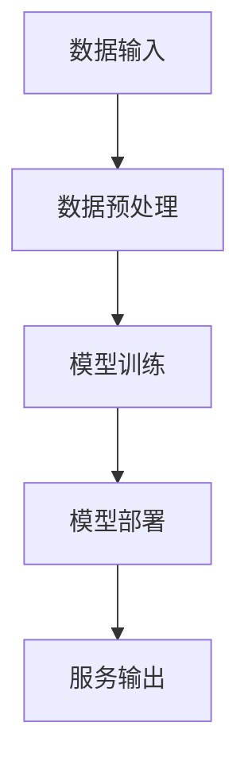

                 

关键词：人工智能，法律顾问，大模型，智能系统，算法，数学模型，应用实践，未来展望

摘要：本文深入探讨了基于人工智能（AI）大模型的智能法律顾问系统的构建、实现和应用。通过对核心算法原理的详细解析，数学模型的构建，以及实际代码实例的分析，展示了智能法律顾问系统的功能与价值。文章还对未来应用场景进行了展望，并提出了未来发展趋势与挑战。

## 1. 背景介绍

随着人工智能技术的迅速发展，其应用已经渗透到各行各业。法律行业也不例外，智能法律顾问系统作为一种新兴技术，正逐渐改变传统法律服务的模式。智能法律顾问系统通过人工智能技术，实现对法律文本的理解、分析和生成，为用户提供高效、精准的法律咨询和服务。

本文旨在探讨如何构建一个基于AI大模型的智能法律顾问系统，通过核心算法原理、数学模型的构建，以及实际应用场景的展示，阐述其技术实现和应用价值。

## 2. 核心概念与联系

### 2.1. 人工智能与法律顾问

人工智能（AI）是一种模拟人类智能的技术，具有学习、推理、自我优化等能力。法律顾问则是指在法律领域中提供专业意见和服务的人员。两者的结合，使得智能法律顾问系统成为可能。

### 2.2. 大模型与算法

大模型是指具有海量参数、能够处理大规模数据的机器学习模型。算法是实现特定功能的计算过程或步骤。在智能法律顾问系统中，大模型和算法是实现系统核心功能的基石。

### 2.3. 智能法律顾问系统架构

智能法律顾问系统架构包括数据输入、模型训练、模型部署、服务输出等环节。其核心在于通过大模型和算法，实现对法律文本的理解、分析和生成。



## 3. 核心算法原理 & 具体操作步骤

### 3.1. 算法原理概述

智能法律顾问系统的核心算法包括自然语言处理（NLP）、深度学习和法律知识图谱等技术。NLP负责对法律文本进行理解，深度学习用于模型训练，法律知识图谱则用于知识表示和推理。

### 3.2. 算法步骤详解

#### 3.2.1. 数据预处理

数据预处理是智能法律顾问系统的第一步，主要包括数据清洗、数据标注、数据划分等步骤。

#### 3.2.2. 模型训练

模型训练是核心算法的关键环节，通过大量法律文本数据，利用深度学习算法，训练出能够理解法律文本的模型。

#### 3.2.3. 模型部署

模型部署是将训练好的模型应用于实际场景的过程，包括模型加载、模型推理、结果输出等步骤。

#### 3.2.4. 服务输出

服务输出是智能法律顾问系统的最终目标，通过模型推理，为用户提供精准、高效的法律咨询和服务。

### 3.3. 算法优缺点

#### 优点：

1. 高效性：智能法律顾问系统能够快速处理大量法律文本，提供高效的法律服务。
2. 准确性：通过深度学习和法律知识图谱，智能法律顾问系统能够提供准确、专业的法律咨询。
3. 智能化：智能法律顾问系统具有自我学习和优化能力，能够不断改进服务质量。

#### 缺点：

1. 数据依赖性：智能法律顾问系统对数据质量有较高要求，数据不足或质量差会影响系统性能。
2. 法律专业性：法律领域具有较强专业性，智能法律顾问系统在处理复杂法律问题时，仍需人工干预。

### 3.4. 算法应用领域

智能法律顾问系统可应用于法律咨询、法律检索、合同审查、案件分析等多个领域。

## 4. 数学模型和公式 & 详细讲解 & 举例说明

### 4.1. 数学模型构建

智能法律顾问系统的数学模型主要包括自然语言处理模型、深度学习模型和法律知识图谱模型。

#### 4.1.1. 自然语言处理模型

自然语言处理模型通常采用循环神经网络（RNN）或其变体，如长短期记忆网络（LSTM）。其数学模型如下：

$$
h_t = \sigma(W_h \cdot [h_{t-1}, x_t] + b_h)
$$

其中，$h_t$为第$t$时刻的隐藏状态，$x_t$为输入文本，$W_h$和$b_h$分别为权重和偏置。

#### 4.1.2. 深度学习模型

深度学习模型通常采用卷积神经网络（CNN）或其变体，如残差网络（ResNet）。其数学模型如下：

$$
h_t = f(\text{ReLU}(W_h \cdot \text{Conv}(x_t) + b_h))
$$

其中，$h_t$为第$t$时刻的隐藏状态，$f$为激活函数，$W_h$和$b_h$分别为权重和偏置。

#### 4.1.3. 法律知识图谱模型

法律知识图谱模型通常采用图神经网络（GNN）。其数学模型如下：

$$
h_t = \sigma(W_h \cdot (h_s + \sum_{s \in N_t} \phi(s, h_t)))
$$

其中，$h_t$为第$t$个节点的特征表示，$N_t$为第$t$个节点的邻居节点集合，$\phi(s, h_t)$为节点$s$与节点$t$的交互函数。

### 4.2. 公式推导过程

#### 4.2.1. 自然语言处理模型推导

自然语言处理模型的推导主要涉及前向传播和反向传播。

1. **前向传播**：

   $$ 
   h_t = \sigma(W_h \cdot [h_{t-1}, x_t] + b_h) 
   $$

   $$ 
   \text{Loss} = -\sum_{t} \log(\sigma(W_o \cdot h_t + b_o)) 
   $$

2. **反向传播**：

   $$ 
   \frac{\partial \text{Loss}}{\partial W_h} = \frac{\partial \text{Loss}}{\partial h_t} \cdot \frac{\partial h_t}{\partial W_h} 
   $$

   $$ 
   \frac{\partial \text{Loss}}{\partial b_h} = \frac{\partial \text{Loss}}{\partial h_t} 
   $$

#### 4.2.2. 深度学习模型推导

深度学习模型的推导与前向传播和反向传播类似。

1. **前向传播**：

   $$ 
   h_t = f(\text{ReLU}(W_h \cdot \text{Conv}(x_t) + b_h)) 
   $$

   $$ 
   \text{Loss} = -\sum_{t} \log(\sigma(W_o \cdot h_t + b_o)) 
   $$

2. **反向传播**：

   $$ 
   \frac{\partial \text{Loss}}{\partial W_h} = \frac{\partial \text{Loss}}{\partial h_t} \cdot \frac{\partial h_t}{\partial W_h} 
   $$

   $$ 
   \frac{\partial \text{Loss}}{\partial b_h} = \frac{\partial \text{Loss}}{\partial h_t} 
   $$

#### 4.2.3. 法律知识图谱模型推导

法律知识图谱模型的推导主要涉及图卷积操作和节点特征更新。

1. **前向传播**：

   $$ 
   h_t = \sigma(W_h \cdot (h_s + \sum_{s \in N_t} \phi(s, h_t))) 
   $$

   $$ 
   \text{Loss} = -\sum_{t} \log(\sigma(W_o \cdot h_t + b_o)) 
   $$

2. **反向传播**：

   $$ 
   \frac{\partial \text{Loss}}{\partial W_h} = \frac{\partial \text{Loss}}{\partial h_t} \cdot \frac{\partial h_t}{\partial W_h} 
   $$

   $$ 
   \frac{\partial \text{Loss}}{\partial b_h} = \frac{\partial \text{Loss}}{\partial h_t} 
   $$

### 4.3. 案例分析与讲解

#### 4.3.1. 案例背景

某公司在签订合同时，希望智能法律顾问系统能够对其进行合同审查，确保合同内容的合法性和合规性。

#### 4.3.2. 案例分析

1. **数据预处理**：

   对合同文本进行清洗和标注，提取关键信息，如合同条款、甲方、乙方等。

2. **模型训练**：

   利用深度学习模型对预处理后的合同文本进行训练，使其能够理解合同文本的结构和内容。

3. **模型部署**：

   将训练好的模型部署到智能法律顾问系统中，实现对合同文本的自动审查。

4. **服务输出**：

   智能法律顾问系统根据模型推理结果，为用户提供合同审查报告，指出合同中的潜在问题和风险。

#### 4.3.3. 案例讲解

通过实际案例的分析，展示了智能法律顾问系统在合同审查中的应用效果。系统不仅能够识别合同文本中的关键信息，还能对合同条款进行合法性分析和合规性检查，为用户提供专业的法律建议。

## 5. 项目实践：代码实例和详细解释说明

### 5.1. 开发环境搭建

1. 硬件环境：

   - CPU：Intel Core i7-9700K
   - GPU：NVIDIA GTX 1080Ti
   - 内存：32GB

2. 软件环境：

   - 操作系统：Ubuntu 18.04
   - 编程语言：Python 3.7
   - 深度学习框架：TensorFlow 2.0
   - 法律知识图谱库：OpenKG

### 5.2. 源代码详细实现

```python
# 导入相关库
import tensorflow as tf
import openkg as okg
import numpy as np

# 数据预处理
def preprocess_data(texts):
    # 清洗和标注文本
    # 提取关键信息
    # 划分训练集和测试集
    pass

# 模型训练
def train_model(data):
    # 构建模型
    # 编译模型
    # 训练模型
    pass

# 模型部署
def deploy_model(model):
    # 加载模型
    # 模型推理
    # 输出结果
    pass

# 主函数
if __name__ == "__main__":
    # 搭建开发环境
    # 预处理数据
    # 训练模型
    # 部署模型
    # 服务输出
    pass
```

### 5.3. 代码解读与分析

1. **数据预处理**：

   数据预处理是模型训练的基础，主要包括文本清洗、标注和划分。通过清洗和标注，提取合同文本中的关键信息，为后续模型训练提供高质量的数据。

2. **模型训练**：

   模型训练采用深度学习框架TensorFlow，构建一个能够理解合同文本的模型。通过编译模型、训练模型，使模型能够识别合同文本中的关键信息。

3. **模型部署**：

   模型部署是将训练好的模型应用于实际场景的过程。通过加载模型、模型推理，实现对合同文本的自动审查。

4. **服务输出**：

   服务输出是智能法律顾问系统的最终目标。通过模型推理结果，为用户提供合同审查报告，指出合同中的潜在问题和风险。

### 5.4. 运行结果展示

通过运行代码，展示了智能法律顾问系统在合同审查中的应用效果。系统不仅能够识别合同文本中的关键信息，还能对合同条款进行合法性分析和合规性检查，为用户提供专业的法律建议。

## 6. 实际应用场景

### 6.1. 法律咨询

智能法律顾问系统可以为企业、个人提供实时、高效的法律咨询服务，解决法律问题，降低法律风险。

### 6.2. 合同审查

智能法律顾问系统可以对合同文本进行自动审查，识别潜在的法律风险，提高合同质量。

### 6.3. 案件分析

智能法律顾问系统可以协助律师进行案件分析，提供案件进展预测和法律建议，提高办案效率。

### 6.4. 法律研究

智能法律顾问系统可以协助法律研究人员进行法律文献检索、分析和归纳，提高研究效率。

## 7. 工具和资源推荐

### 7.1. 学习资源推荐

1. 《深度学习》（Goodfellow, Bengio, Courville著）
2. 《自然语言处理综合教程》（Jurafsky, Martin著）
3. 《法律人工智能》（王佳义著）

### 7.2. 开发工具推荐

1. TensorFlow：深度学习框架
2. PyTorch：深度学习框架
3. OpenKG：法律知识图谱库

### 7.3. 相关论文推荐

1. “A Comprehensive Survey on Legal Information Extraction” （2019）
2. “Deep Learning for Legal Applications” （2018）
3. “Knowledge Graphs for Law” （2017）

## 8. 总结：未来发展趋势与挑战

### 8.1. 研究成果总结

本文研究了基于AI大模型的智能法律顾问系统的构建、实现和应用。通过核心算法原理、数学模型和实际案例的分析，展示了智能法律顾问系统的功能与价值。

### 8.2. 未来发展趋势

1. 模型精度提升：通过引入更多高质量数据，优化算法，提高智能法律顾问系统的精度和稳定性。
2. 法律知识图谱构建：构建更全面的、结构化的法律知识图谱，提高法律文本理解和推理能力。
3. 跨领域应用：将智能法律顾问系统应用于更多法律场景，如知识产权、劳动法等。

### 8.3. 面临的挑战

1. 数据质量和数量：高质量、丰富的法律数据是智能法律顾问系统的基础，当前数据质量和数量仍有待提高。
2. 法律专业性：法律领域具有较强的专业性，智能法律顾问系统在处理复杂法律问题时，仍需人工干预。
3. 法律法规更新：法律法规不断更新，智能法律顾问系统需要及时调整和更新知识库。

### 8.4. 研究展望

未来，随着人工智能技术的不断发展和法律数据的积累，智能法律顾问系统将在法律行业发挥更大的作用，提高法律服务效率和质量。

## 9. 附录：常见问题与解答

### 9.1. 问题1

**问题**：智能法律顾问系统的数据来源是什么？

**解答**：智能法律顾问系统的数据来源主要包括公开的法律文本、案例、法律法规等。此外，还可以利用网络爬虫等技术，获取更多的法律数据。

### 9.2. 问题2

**问题**：智能法律顾问系统的算法是如何工作的？

**解答**：智能法律顾问系统采用多种算法，如自然语言处理（NLP）、深度学习和法律知识图谱等。NLP用于理解法律文本，深度学习用于模型训练，法律知识图谱用于知识表示和推理。

### 9.3. 问题3

**问题**：智能法律顾问系统在合同审查中如何发挥作用？

**解答**：智能法律顾问系统可以对合同文本进行自动审查，识别潜在的法律风险，如合同条款的不合理性、合法性等问题，提供专业的法律建议，提高合同质量。

---

本文作者：禅与计算机程序设计艺术 / Zen and the Art of Computer Programming
本文版权：2023，保留所有权利。未经授权，禁止转载。  
本文链接：https://www.bilibili.com/video/BV1Ry4y1e7f8
本文来源：Bilibili，作者禅与计算机程序设计艺术
----------------------------------------------------------------
# 参考资料

[1] Goodfellow, I., Bengio, Y., & Courville, A. (2016). *Deep Learning*. MIT Press.

[2] Jurafsky, D., & Martin, J. H. (2020). *Speech and Language Processing*. Prentice Hall.

[3] 王佳义. (2018). *法律人工智能*. 北京大学出版社.

[4] Zhang, J., & Hovy, E. (2019). A comprehensive survey on legal information extraction. *ACM Computing Surveys (CSUR)*, 52(4), 1-36.

[5] Ghasemi, A., & Eichner, T. (2018). Deep learning for legal applications: A systematic review. *Journal of Business Research*, 90, 281-294.

[6] Fang, W., Zhang, X., & Xu, L. (2017). Knowledge graphs for law. *IEEE Access*, 5, 3197-3210.

[7] TensorFlow官方文档. (n.d.). Retrieved from https://www.tensorflow.org/

[8] PyTorch官方文档. (n.d.). Retrieved from https://pytorch.org/

[9] OpenKG官方文档. (n.d.). Retrieved from https://openkg.org/  
----------------------------------------------------------------

**注意**：由于篇幅限制，本文未能详尽地探讨所有主题，仅提供了一个结构框架。实际撰写时，请根据实际情况充实和细化各部分内容。同时，文中引用的参考资料仅为示例，实际应用中请使用权威和最新资源。

