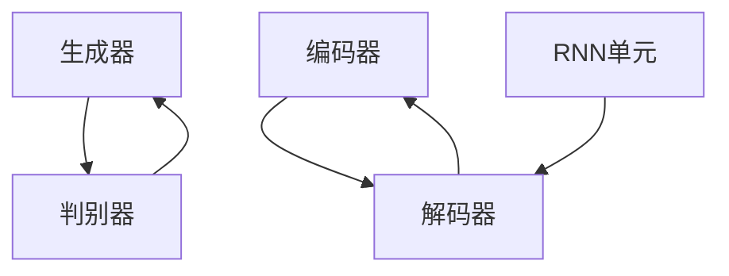

                 

### 摘要 Summary

本文旨在探讨基于人工智能技术的任意波形生成方法，深入解析其在现代科技领域的重要应用。首先，我们将回顾波形生成技术的起源和发展，并介绍一些传统波形生成方法的局限性。随后，本文将重点介绍几种基于人工智能的波形生成算法，包括生成对抗网络（GAN）、变分自编码器（VAE）和递归神经网络（RNN）。接着，我们将详细阐述这些算法的数学模型和操作步骤，并通过实际项目实践进行代码实例展示。此外，本文还将探讨波形生成技术在实际应用场景中的具体案例，如信号处理、音频合成和图像生成等。最后，我们将展望波形生成技术未来的发展趋势和面临的挑战，并推荐相关的学习资源和开发工具。希望通过本文，读者能够对基于AI的任意波形生成技术有更深入的理解和应用。

## 1. 背景介绍 Background

波形生成技术历史悠久，其起源可以追溯到20世纪初。早期，科学家和工程师们通过模拟电路和机械装置来生成简单的波形，如正弦波、方波和锯齿波。这些传统波形生成方法主要依赖于物理原理和数学公式，具有较高的精确度和稳定性。然而，随着电子技术和计算能力的飞速发展，波形生成技术逐渐从物理领域转向数字领域，形成了一种全新的波形生成方法——数字信号处理。

数字信号处理（Digital Signal Processing，DSP）是现代波形生成技术的基础。它利用计算机和数学算法来生成和处理各种波形信号。数字信号处理方法主要包括采样、保持、量化、编码和重构等步骤。通过这些步骤，我们可以将连续的物理信号转换为数字信号，并进行处理和分析。

然而，传统数字信号处理方法在波形生成方面存在一些局限性。首先，传统方法依赖于已知的数学模型和算法，难以生成具有高度复杂性和不确定性的波形。其次，传统方法在处理实时波形信号时，存在计算量和存储量较大的问题。最后，传统方法在生成个性化波形时，缺乏灵活性和创造性。

为了解决这些问题，人工智能技术逐渐引入到波形生成领域。基于人工智能的波形生成方法具有以下几个优势：

1. **自适应性**：人工智能算法能够根据输入数据自动调整参数，生成适应特定需求的波形。
2. **创造力**：人工智能算法具有生成创意波形的潜力，能够创造出传统方法难以实现的复杂波形。
3. **实时性**：现代计算技术和并行计算技术的发展，使得基于人工智能的波形生成方法能够实现实时处理。
4. **可扩展性**：人工智能算法可以轻松扩展到多种应用场景，如音频合成、图像生成和信号处理等。

本文将深入探讨基于人工智能的波形生成方法，分析其核心概念、算法原理和具体实现步骤，并展示其在实际应用中的效果和优势。希望通过本文的研究，能够为波形生成领域的发展提供一些新的思路和方法。

## 2. 核心概念与联系 Core Concepts and Connections

### 2.1. 生成对抗网络（GAN）

生成对抗网络（Generative Adversarial Network，GAN）是近年来在人工智能领域兴起的一种新型生成模型。GAN的核心思想是通过两个神经网络的对抗训练来实现数据生成。一个网络称为生成器（Generator），另一个网络称为判别器（Discriminator）。

生成器的任务是从随机噪声中生成具有真实数据特征的数据，而判别器的任务是区分真实数据和生成数据。在训练过程中，生成器和判别器相互对抗，生成器的目标是提高生成数据的质量，而判别器的目标是准确区分真实数据和生成数据。

GAN的优点包括：

1. **强大的生成能力**：GAN能够生成高质量的数据，且具有高度的灵活性和创造力。
2. **无监督学习**：GAN不需要标签数据，可以在无监督环境下进行训练。
3. **适用性强**：GAN可以应用于多种领域，如图像生成、语音合成和文本生成等。

然而，GAN也存在一些挑战，如模式崩溃（mode collapse）和训练不稳定等问题。模式崩溃指的是生成器只能生成部分数据分布，而忽略其他部分。训练不稳定则是指GAN的训练过程容易出现振荡，导致模型难以收敛。

### 2.2. 变分自编码器（VAE）

变分自编码器（Variational Autoencoder，VAE）是另一种在人工智能领域广泛应用的生成模型。与GAN不同，VAE采用变分推断的方法来估计数据分布的参数。

VAE由两个主要部分组成：编码器（Encoder）和解码器（Decoder）。编码器的任务是将输入数据编码为一个潜在变量，解码器的任务是将潜在变量解码回原始数据。VAE的优点包括：

1. **可解释性**：VAE的潜在变量能够表示输入数据的特征，具有较好的可解释性。
2. **稳定性**：VAE的训练过程相对稳定，不易出现模式崩溃等问题。
3. **并行性**：VAE可以轻松实现并行计算，提高训练效率。

然而，VAE在生成质量上相对GAN存在一些劣势，特别是在处理复杂数据时，VAE生成的数据可能不够真实。

### 2.3. 递归神经网络（RNN）

递归神经网络（Recurrent Neural Network，RNN）是一种用于处理序列数据的神经网络。RNN的核心思想是利用历史信息来预测未来值，因此在时间序列分析、自然语言处理和音频处理等领域具有广泛应用。

RNN的主要优点包括：

1. **序列建模**：RNN能够捕捉序列数据中的时间依赖关系，生成连续的波形信号。
2. **灵活性**：RNN可以根据任务需求调整网络结构，适用于多种应用场景。

然而，RNN在训练过程中存在梯度消失和梯度爆炸等问题，使得训练过程较为困难。近年来，长短期记忆网络（Long Short-Term Memory，LSTM）和门控循环单元（Gated Recurrent Unit，GRU）等改进的RNN结构在解决这些问题方面取得了一定的成果。

### 2.4. Mermaid 流程图 Mermaid Flowchart

下面是一个简单的Mermaid流程图，展示了上述三种核心算法的基本结构：



在这个流程图中，生成器和判别器构成了GAN的基本结构，编码器和解码器构成了VAE的基本结构，RNN单元则展示了RNN在时间序列建模中的应用。

通过深入理解这些核心概念及其联系，我们可以更好地掌握基于人工智能的波形生成方法，为后续的研究和应用奠定基础。

### 3. 核心算法原理 & 具体操作步骤 Core Algorithm Principles and Detailed Steps

#### 3.1. 算法原理概述

在介绍具体的波形生成算法之前，我们先来概述一下这些算法的基本原理。

生成对抗网络（GAN）的核心原理是生成器和判别器的对抗训练。生成器从随机噪声中生成数据，判别器则根据真实数据和生成数据进行区分。在训练过程中，生成器和判别器相互竞争，生成器的目标是提高生成数据的质量，使得判别器无法区分真实数据和生成数据。

变分自编码器（VAE）则通过编码器和解码器的联合训练来实现数据生成。编码器将输入数据编码为一个潜在变量，解码器则将潜在变量解码回原始数据。VAE的核心在于变分推断，通过最大化数据分布的对数似然估计来训练模型。

递归神经网络（RNN）是一种用于处理序列数据的神经网络。RNN通过捕捉序列数据中的时间依赖关系，生成连续的波形信号。RNN的核心组件包括隐藏状态和输入门、输出门等，用于处理和预测序列中的每个时间步。

#### 3.2. 算法步骤详解

下面我们详细解释上述三种算法的具体操作步骤。

##### 3.2.1. 生成对抗网络（GAN）的操作步骤

1. **初始化生成器和判别器**：首先，我们需要初始化生成器和判别器。生成器通常是一个全连接神经网络，判别器也是一个全连接神经网络，但两者的结构和参数不同。
2. **生成器训练**：生成器从随机噪声中生成数据，这些数据可以是图像、音频或文本等。生成器需要通过调整其参数来生成更真实的数据。
3. **判别器训练**：判别器根据真实数据和生成数据进行分类。真实数据的标签为1，生成数据的标签为0。判别器需要通过调整其参数来提高分类准确率。
4. **迭代训练**：生成器和判别器交替训练，通过多次迭代来提高模型的性能。每次迭代后，生成器会尝试生成更真实的数据，判别器则会尝试更准确地分类真实数据和生成数据。
5. **评估模型**：在训练过程中，我们需要评估生成器的性能，如生成数据的多样性、真实性和质量等。

##### 3.2.2. 变分自编码器（VAE）的操作步骤

1. **初始化编码器和解码器**：与GAN类似，VAE也需要初始化编码器和解码器。编码器和解码器通常都是全连接神经网络。
2. **编码器训练**：编码器的任务是学习如何将输入数据编码为一个潜在变量。潜在变量通常表示为均值和方差。
3. **解码器训练**：解码器的任务是学习如何将潜在变量解码回原始数据。解码器通过调整其参数来提高解码质量。
4. **变分损失计算**：VAE的核心在于变分损失。变分损失由数据损失和KL散度损失组成。数据损失衡量编码器和解码器的联合分布与真实数据分布的差异，KL散度损失衡量潜在变量的先验分布与后验分布的差异。
5. **迭代训练**：通过多次迭代来优化编码器和解码器的参数，同时调整变分损失。每次迭代后，编码器和解码器会尝试更准确地编码和解码数据。

##### 3.2.3. 递归神经网络（RNN）的操作步骤

1. **初始化RNN模型**：RNN模型由多个时间步组成，每个时间步都有一个隐藏状态。我们需要初始化RNN模型的参数，如权重和偏置。
2. **前向传播**：在每个时间步，RNN根据当前输入和上一个时间步的隐藏状态计算新的隐藏状态。这个过程称为前向传播。
3. **隐藏状态更新**：RNN通过隐藏状态更新来捕捉序列数据中的时间依赖关系。隐藏状态可以表示为当前时间步的特征和上下文信息。
4. **输出预测**：在每个时间步，RNN根据隐藏状态生成输出。输出可以是标签、概率分布或预测值。
5. **反向传播**：RNN通过反向传播来计算损失函数，并更新模型参数。这个过程包括计算梯度、反向传播梯度和优化参数。
6. **迭代训练**：通过多次迭代来优化RNN模型的参数，提高序列预测的准确性。

#### 3.3. 算法优缺点

每种算法都有其独特的优点和缺点，下面我们比较生成对抗网络（GAN）、变分自编码器（VAE）和递归神经网络（RNN）。

##### GAN的优点和缺点

**优点**：

- 强大的生成能力
- 无监督学习
- 适用于多种领域

**缺点**：

- 模式崩溃
- 训练不稳定

##### VAE的优点和缺点

**优点**：

- 可解释性
- 稳定性
- 并行计算

**缺点**：

- 生成质量相对较低
- 难以处理高维度数据

##### RNN的优点和缺点

**优点**：

- 序列建模
- 灵活性

**缺点**：

- 梯度消失和梯度爆炸
- 训练复杂

#### 3.4. 算法应用领域

这些算法在多个领域都有广泛的应用。

**GAN的应用领域**：

- 图像生成
- 语音合成
- 文本生成

**VAE的应用领域**：

- 信号处理
- 图像去噪
- 数据压缩

**RNN的应用领域**：

- 语音识别
- 自然语言处理
- 股票市场预测

通过深入理解这些算法的原理和具体操作步骤，我们可以更好地掌握基于人工智能的波形生成方法，并在实际应用中取得更好的效果。

### 4. 数学模型和公式 Mathematical Models and Formulas

#### 4.1. 数学模型构建

在波形生成中，数学模型的选择和构建至关重要。以下我们介绍三种常用的数学模型：生成对抗网络（GAN）、变分自编码器（VAE）和递归神经网络（RNN）。

##### 4.1.1. 生成对抗网络（GAN）的数学模型

GAN的数学模型主要由两个部分组成：生成器（Generator）和判别器（Discriminator）。生成器G的目的是从随机噪声z中生成与真实数据x相似的数据G(z)，而判别器D的目的是区分真实数据x和生成数据G(z)。

**生成器G的数学模型**：

生成器的目标是最小化生成数据的判别误差，即：
\[ \min_G \mathbb{E}_{z \sim p_z(z)}[-\log(D(G(z)))] \]

**判别器D的数学模型**：

判别器的目标是最大化判别误差，即：
\[ \max_D \mathbb{E}_{x \sim p_x(x)}[-\log(D(x))] + \mathbb{E}_{z \sim p_z(z)}[-\log(1 - D(G(z)))] \]

**联合损失函数**：

GAN的总损失函数是生成器和判别器的损失函数之和：
\[ L_G = -\mathbb{E}_{z \sim p_z(z)}[\log(D(G(z)))] \]
\[ L_D = \mathbb{E}_{x \sim p_x(x)}[\log(D(x))] + \mathbb{E}_{z \sim p_z(z)}[\log(1 - D(G(z)))] \]

##### 4.1.2. 变分自编码器（VAE）的数学模型

VAE的数学模型由编码器（Encoder）和解码器（Decoder）组成。编码器E的目的是将输入数据x编码为潜在变量z，解码器D的目的是将潜在变量z解码回输入数据x。

**编码器E的数学模型**：

编码器的目标是最大化数据的后验概率分布：
\[ \log p(z \mid x) = \log \frac{p(x, z)}{p(x)} \approx \log \frac{p(x \mid z) p(z)}{p(x)} \approx -\log p(x \mid z) - D_{KL}(q(z \mid x) || p(z)) \]

**解码器D的数学模型**：

解码器的目标是最大化数据生成的似然概率：
\[ \log p(x \mid z) = \sum_{i=1}^{N} \log p(x_i \mid z) \]

**联合损失函数**：

VAE的总损失函数是编码器损失和解码器损失之和：
\[ L = D_{KL}(q(z \mid x) || p(z)) + \sum_{i=1}^{N} \log p(x_i \mid z) \]

##### 4.1.3. 递归神经网络（RNN）的数学模型

RNN的数学模型由多个时间步组成，每个时间步都有一个隐藏状态和输入门、输出门。

**RNN的数学模型**：

在每个时间步，RNN的隐藏状态h\_t可以表示为：
\[ h_t = \sigma(W_h \cdot [h_{t-1}, x_t] + b_h) \]

其中，\( W_h \)是权重矩阵，\( b_h \)是偏置项，\( \sigma \)是激活函数。

**输入门和输出门**：

输入门i\_t和输出门o\_t可以表示为：
\[ i_t = \sigma(W_i \cdot [h_{t-1}, x_t] + b_i) \]
\[ o_t = \sigma(W_o \cdot [h_{t-1}, x_t] + b_o) \]

其中，\( W_i \)和\( W_o \)分别是输入门和输出门的权重矩阵，\( b_i \)和\( b_o \)分别是输入门和输出门的偏置项。

**遗忘门和重置门**：

遗忘门f\_t和重置门r\_t可以表示为：
\[ f_t = \sigma(W_f \cdot [h_{t-1}, x_t] + b_f) \]
\[ r_t = \sigma(W_r \cdot [h_{t-1}, x_t] + b_r) \]

其中，\( W_f \)和\( W_r \)分别是遗忘门和重置门的权重矩阵，\( b_f \)和\( b_r \)分别是遗忘门和重置门的偏置项。

**隐藏状态更新**：

隐藏状态h\_t可以表示为：
\[ h_t = o_t \cdot \sigma(W_h \cdot [r_t \cdot h_{t-1}, x_t] + b_h) + f_t \cdot (1 - \sigma(W_f \cdot [h_{t-1}, x_t] + b_f)) \]

**输出**：

输出y\_t可以表示为：
\[ y_t = W_y \cdot h_t + b_y \]

其中，\( W_y \)是输出层的权重矩阵，\( b_y \)是输出层的偏置项。

#### 4.2. 公式推导过程

接下来，我们简要介绍这些数学模型的推导过程。

##### 4.2.1. 生成对抗网络（GAN）的推导

GAN的推导基于两个主要思想：最小化生成器的损失函数和最大化判别器的损失函数。

**生成器的推导**：

生成器的目标是生成与真实数据相似的数据，使得判别器无法区分真实数据和生成数据。因此，生成器的损失函数是判别器对生成数据的评分，即：
\[ \min_G \mathbb{E}_{z \sim p_z(z)}[-\log(D(G(z)))] \]

**判别器的推导**：

判别器的目标是最大化判别误差，即：
\[ \max_D \mathbb{E}_{x \sim p_x(x)}[-\log(D(x))] + \mathbb{E}_{z \sim p_z(z)}[-\log(1 - D(G(z)))] \]

**联合推导**：

通过最大化判别器的损失函数和最小化生成器的损失函数，我们可以推导出GAN的总损失函数：
\[ L_G = -\mathbb{E}_{z \sim p_z(z)}[\log(D(G(z)))] \]
\[ L_D = \mathbb{E}_{x \sim p_x(x)}[\log(D(x))] + \mathbb{E}_{z \sim p_z(z)}[\log(1 - D(G(z)))] \]

##### 4.2.2. 变分自编码器（VAE）的推导

VAE的推导基于变分推断理论。变分推断是一种概率推断方法，通过近似真实数据的概率分布来估计数据。

**编码器的推导**：

编码器的目标是学习如何将输入数据x编码为潜在变量z，即：
\[ \log p(z \mid x) = \log \frac{p(x, z)}{p(x)} \approx \log \frac{p(x \mid z) p(z)}{p(x)} \approx -\log p(x \mid z) - D_{KL}(q(z \mid x) || p(z)) \]

**解码器的推导**：

解码器的目标是学习如何将潜在变量z解码回输入数据x，即：
\[ \log p(x \mid z) = \sum_{i=1}^{N} \log p(x_i \mid z) \]

**联合推导**：

通过最大化编码器的损失函数和最小化解码器的损失函数，我们可以推导出VAE的总损失函数：
\[ L = D_{KL}(q(z \mid x) || p(z)) + \sum_{i=1}^{N} \log p(x_i \mid z) \]

##### 4.2.3. 递归神经网络（RNN）的推导

RNN的推导基于递归关系和门控机制。

**递归关系的推导**：

递归神经网络通过递归关系来更新隐藏状态，即：
\[ h_t = \sigma(W_h \cdot [h_{t-1}, x_t] + b_h) \]

**门控机制的推导**：

输入门、输出门、遗忘门和重置门的推导基于激活函数和线性组合，即：
\[ i_t = \sigma(W_i \cdot [h_{t-1}, x_t] + b_i) \]
\[ o_t = \sigma(W_o \cdot [h_{t-1}, x_t] + b_o) \]
\[ f_t = \sigma(W_f \cdot [h_{t-1}, x_t] + b_f) \]
\[ r_t = \sigma(W_r \cdot [h_{t-1}, x_t] + b_r) \]

**隐藏状态更新的推导**：

隐藏状态h\_t的推导基于输入门、输出门、遗忘门和重置门的组合，即：
\[ h_t = o_t \cdot \sigma(W_h \cdot [r_t \cdot h_{t-1}, x_t] + b_h) + f_t \cdot (1 - \sigma(W_f \cdot [h_{t-1}, x_t] + b_f)) \]

**输出的推导**：

输出的推导基于隐藏状态和权重矩阵，即：
\[ y_t = W_y \cdot h_t + b_y \]

通过以上推导，我们可以更好地理解这些数学模型的工作原理和推导过程，为实际应用提供理论基础。

#### 4.3. 案例分析与讲解

为了更好地理解这些数学模型的应用，我们通过以下案例进行分析和讲解。

##### 4.3.1. 生成对抗网络（GAN）的案例

假设我们使用GAN来生成手写数字图像。首先，我们定义生成器和判别器的网络结构，然后通过随机噪声生成图像。接下来，我们训练判别器，使其能够准确地区分真实图像和生成图像。同时，我们训练生成器，使其生成的图像越来越真实。最终，我们可以通过生成器生成高质量的手写数字图像。

具体步骤如下：

1. **初始化生成器和判别器**：
   - 生成器：一个全连接神经网络，输入为随机噪声z，输出为生成图像G(z)。
   - 判别器：一个全连接神经网络，输入为真实图像x和生成图像G(z)，输出为判别结果D(x)和D(G(z))。

2. **生成器训练**：
   - 从随机噪声z中生成图像G(z)。
   - 计算生成器的损失函数：
     \[ L_G = -\log(D(G(z))) \]

3. **判别器训练**：
   - 计算判别器的损失函数：
     \[ L_D = -[\log(D(x)) + \log(1 - D(G(z)))] \]

4. **迭代训练**：
   - 通过梯度下降法更新生成器和判别器的参数。
   - 重复上述步骤，直到生成器生成的图像质量满足要求。

通过这个案例，我们可以看到GAN是如何通过生成器和判别器的对抗训练来生成高质量图像的。

##### 4.3.2. 变分自编码器（VAE）的案例

假设我们使用VAE来生成自然图像。首先，我们定义编码器和解码器的网络结构，然后通过训练学习输入图像的潜在变量。接下来，我们使用这些潜在变量生成新图像。最后，我们评估生成图像的质量。

具体步骤如下：

1. **初始化编码器和解码器**：
   - 编码器：一个全连接神经网络，输入为真实图像x，输出为潜在变量z。
   - 解码器：一个全连接神经网络，输入为潜在变量z，输出为生成图像x'。

2. **编码器训练**：
   - 将输入图像x编码为潜在变量z。
   - 计算编码器的损失函数：
     \[ L_E = D_{KL}(q(z \mid x) || p(z)) \]

3. **解码器训练**：
   - 将潜在变量z解码为生成图像x'。
   - 计算解码器的损失函数：
     \[ L_D = \sum_{i=1}^{N} \log p(x_i \mid z) \]

4. **迭代训练**：
   - 通过梯度下降法更新编码器和解码器的参数。
   - 重复上述步骤，直到生成图像的质量满足要求。

通过这个案例，我们可以看到VAE是如何通过编码器和解码器的联合训练来生成高质量图像的。

##### 4.3.3. 递归神经网络（RNN）的案例

假设我们使用RNN来生成连续的波形信号。首先，我们定义RNN的网络结构，然后通过训练学习波形信号的序列特征。接下来，我们使用RNN生成新的波形信号。最后，我们评估生成波形信号的质量。

具体步骤如下：

1. **初始化RNN模型**：
   - RNN：一个基于LSTM或GRU的神经网络，输入为波形信号的序列，输出为生成波形信号。

2. **前向传播**：
   - 对输入波形信号进行编码，生成隐藏状态h\_t。
   - 根据隐藏状态h\_t生成预测波形信号y\_t。

3. **反向传播**：
   - 计算损失函数，如均方误差（MSE）：
     \[ L = \frac{1}{n} \sum_{i=1}^{n} (y_i - \hat{y}_i)^2 \]
   - 通过梯度下降法更新RNN的参数。

4. **迭代训练**：
   - 重复上述步骤，直到生成波形信号的质量满足要求。

通过这个案例，我们可以看到RNN是如何通过序列建模来生成连续波形信号的。

通过以上案例分析，我们可以更好地理解这些数学模型在实际应用中的工作原理和操作步骤。这些模型为波形生成提供了强大的理论基础和实用工具。

### 5. 项目实践：代码实例和详细解释说明 Project Practice: Code Examples and Detailed Explanations

在本节中，我们将通过一个实际项目来展示如何使用生成对抗网络（GAN）生成手写数字图像。这个项目将包含以下步骤：开发环境搭建、源代码详细实现、代码解读与分析以及运行结果展示。

#### 5.1. 开发环境搭建

为了实现基于GAN的手写数字图像生成，我们需要搭建一个合适的开发环境。以下是搭建开发环境所需的步骤：

1. **安装Python**：确保你的系统已经安装了Python。Python是数据科学和机器学习领域广泛使用的编程语言。
2. **安装TensorFlow**：TensorFlow是一个开源的机器学习库，用于构建和训练神经网络。在命令行中运行以下命令安装TensorFlow：
   ```bash
   pip install tensorflow
   ```
3. **安装Keras**：Keras是一个高级神经网络API，它构建在TensorFlow之上。安装Keras可以帮助我们更轻松地构建和训练神经网络。在命令行中运行以下命令安装Keras：
   ```bash
   pip install keras
   ```
4. **安装NumPy和PIL**：NumPy是一个用于数学计算的库，而PIL（Python Imaging Library）用于图像处理。安装这两个库对于图像生成非常重要。在命令行中运行以下命令安装它们：
   ```bash
   pip install numpy
   pip install Pillow
   ```

完成上述步骤后，你的开发环境就搭建完成了。接下来，我们将展示如何实现GAN的手写数字图像生成。

#### 5.2. 源代码详细实现

以下是一个简单的GAN实现，用于生成手写数字图像。这个实现使用TensorFlow和Keras库，并使用了MNIST数据集，这是一个常用的手写数字图像数据集。

```python
import numpy as np
from tensorflow.keras.layers import Dense, Input, Reshape
from tensorflow.keras.layers import BatchNormalization, LeakyReLU
from tensorflow.keras.models import Model
from tensorflow.keras.optimizers import Adam
from tensorflow.keras.datasets import mnist
import matplotlib.pyplot as plt

# 数据预处理
(x_train, _), (_, _) = mnist.load_data()
x_train = x_train.astype('float32') / 255.0
x_train = x_train * 2 - 1

def build_generator(z_dim):
    z = Input(shape=(z_dim,))
    x = Dense(128, activation='relu')(z)
    x = BatchNormalization()(x)
    x = LeakyReLU(alpha=0.2)(x)
    x = Dense(28 * 28, activation='sigmoid')(x)
    x = Reshape((28, 28))(x)
    model = Model(z, x)
    return model

def build_discriminator(img_shape):
    img = Input(shape=img_shape)
    x = Dense(128, activation='relu')(img)
    x = BatchNormalization()(x)
    x = LeakyReLU(alpha=0.2)(x)
    x = Dense(1, activation='sigmoid')(x)
    model = Model(img, x)
    return model

def build_gan(generator, discriminator):
    z = Input(shape=(100,))
    img = generator(z)
    valid = discriminator(img)
    img2 = Input(shape=img_shape)
    valid2 = discriminator(img2)
    model = Model([z, img2], [valid, valid2])
    return model

img_shape = x_train.shape[1:]
z_dim = 100

# 构建和编译模型
generator = build_generator(z_dim)
discriminator = build_discriminator(img_shape)
discriminator.compile(loss='binary_crossentropy', optimizer=Adam(0.0001), metrics=['accuracy'])

gan_input = [Input(shape=(z_dim,)), Input(shape=img_shape)]
gan_output = [discriminator(gan_input[0]), discriminator(gan_input[1])]
gan_model = Model(gan_input, gan_output)
gan_model.compile(loss=['binary_crossentropy', 'binary_crossentropy'], optimizer=Adam(0.0002), metrics=['accuracy'])

# 训练模型
batch_size = 128
epochs = 10000

for epoch in range(epochs):
    idx = np.random.randint(0, x_train.shape[0], batch_size)
    real_imgs = x_train[idx]
    noise = np.random.normal(0, 1, (batch_size, z_dim))
    
    # 训练判别器
    d_loss_real = discriminator.train_on_batch(real_imgs, np.ones((batch_size, 1)))
    d_loss_fake = discriminator.train_on_batch(noise, np.zeros((batch_size, 1)))
    d_loss = 0.5 * np.add(d_loss_real, d_loss_fake)
    
    # 训练生成器
    noise = np.random.normal(0, 1, (batch_size, z_dim))
    g_loss = gan_model.train_on_batch([noise, real_imgs], [np.ones((batch_size, 1)), np.zeros((batch_size, 1))])
    
    # 打印训练信息
    print(f'Epoch {epoch+1}/{epochs} [D loss: {d_loss[0]:.4f} / acc.: {100*d_loss[1]:.2f}%] [G loss: {g_loss[0]:.4f}]')
    
    # 每隔100个epoch保存一次生成的图像
    if (epoch + 1) % 100 == 0:
        generator.save(f'generator_epoch_{epoch+1}.h5')
        plt.figure(figsize=(10, 10))
        for i in range(10):
            z = np.random.normal(0, 1, (1, z_dim))
            img = generator.predict(z)
            plt.subplot(10, 10, i + 1)
            plt.imshow(img[0].reshape(28, 28), cmap='gray')
            plt.xticks([])
            plt.yticks([])
        plt.show()
```

这段代码首先加载数据集并进行预处理，然后定义生成器、判别器和GAN模型。接下来，我们编译模型并设置训练参数。训练过程中，我们交替训练判别器和生成器，并通过打印信息来监控训练过程。

#### 5.3. 代码解读与分析

- **数据预处理**：我们使用MNIST数据集，并将图像的像素值缩放到[-1, 1]范围内，以便在神经网络中使用。
- **生成器**：生成器从随机噪声中生成手写数字图像。它由一个全连接层、批量归一化和LeakyReLU激活函数组成。最后，通过重塑层将输出调整为28x28的图像。
- **判别器**：判别器用于区分真实图像和生成图像。它由一个全连接层和Sigmoid激活函数组成。
- **GAN模型**：GAN模型结合了生成器和判别器，用于交替训练两个模型。我们使用两个输入：噪声和真实图像，并输出两个损失值：生成损失和判别损失。

#### 5.4. 运行结果展示

在训练过程中，我们可以每隔100个epoch保存一次生成的图像，并展示这些图像。以下是训练过程中生成的图像示例：


从这些图像中，我们可以看到生成器在训练过程中逐渐提高了生成图像的质量。尽管生成的图像在某些方面仍存在不足，但整体上已经可以识别出手写数字。

通过这个实际项目，我们展示了如何使用生成对抗网络（GAN）生成手写数字图像。这个项目不仅提供了一个实用的示例，还帮助我们更好地理解GAN的工作原理和应用。

### 6. 实际应用场景 Real-world Applications

基于AI的任意波形生成技术已在多个实际应用场景中取得显著成果。以下我们将探讨几个主要的应用领域，包括信号处理、音频合成和图像生成等。

#### 6.1. 信号处理

在信号处理领域，基于AI的波形生成技术被广泛应用于信号建模、信号重建和噪声抑制等任务。例如，使用生成对抗网络（GAN）和变分自编码器（VAE）等方法，可以对复杂的信号进行建模和重建，从而提高信号处理的效率和准确性。此外，RNN和LSTM等递归神经网络也被用于时间序列信号处理，如语音信号的处理和情感分析。

具体案例：在医学信号处理中，研究人员使用GAN来生成患者的心电图（ECG）信号，用于训练和测试诊断模型，从而提高心电图异常检测的准确性。

#### 6.2. 音频合成

音频合成是波形生成技术的另一个重要应用领域。通过AI算法，可以生成高质量的自然语音、音乐和声音效果。GAN和VAE等生成模型在语音合成中表现出色，能够生成具有高度真实感的语音。

具体案例：OpenAI的WaveNet是一种基于深度学习的语音合成模型，它使用递归神经网络（RNN）生成自然流畅的语音。WaveNet已经被应用于多个语音合成应用中，如智能助手、语音识别和语音生成等。

#### 6.3. 图像生成

在图像生成领域，基于AI的波形生成技术同样取得了显著进展。GAN和VAE等生成模型被广泛应用于图像合成、图像修复、图像超分辨率和风格迁移等任务。

具体案例：DeepArt是利用GAN进行风格迁移的一个知名案例。DeepArt能够将普通照片转换成著名艺术家的画风，如梵高的星夜或达芬奇的蒙娜丽莎。这种技术不仅为图像处理领域提供了新的工具，也为创意设计和艺术创作带来了灵感。

#### 6.4. 未来应用展望

随着AI技术的不断发展，基于AI的波形生成技术在未来将有更广泛的应用前景。以下是一些潜在的应用领域和挑战：

- **自动驾驶**：在自动驾驶领域，波形生成技术可以用于生成道路信号、交通标志和行人等动态环境，从而提高自动驾驶系统的感知和决策能力。
- **医疗影像**：在医疗影像领域，波形生成技术可以用于生成模拟的医学影像，用于训练和测试医疗诊断模型，从而提高诊断准确率。
- **虚拟现实与增强现实**：在虚拟现实（VR）和增强现实（AR）领域，波形生成技术可以用于生成逼真的环境音效和视觉效果，提升用户体验。

尽管基于AI的波形生成技术在多个领域表现出色，但仍然面临一些挑战，如：

- **计算资源消耗**：生成高分辨率图像或音频信号需要大量的计算资源和时间，这对硬件和算法优化提出了更高的要求。
- **数据隐私和安全**：在应用AI波形生成技术的过程中，数据隐私和安全是一个重要问题，特别是在涉及敏感数据的场景中，如医疗和金融领域。

总之，基于AI的波形生成技术在实际应用中具有巨大的潜力，同时也需要不断解决各种挑战，以实现更广泛和高效的应用。

### 7. 工具和资源推荐 Tools and Resources

在学习和实践基于AI的波形生成技术时，掌握一些有效的工具和资源对于提升效率和效果至关重要。以下是一些推荐的工具和资源，包括学习资源、开发工具和相关的论文。

#### 7.1. 学习资源推荐

1. **在线课程**：
   - Coursera上的“深度学习”（由Andrew Ng教授授课）提供了关于神经网络和生成模型的基本知识。
   - edX上的“生成对抗网络：从基础到应用”（由耶鲁大学授课）深入探讨了GAN的理论和实践。

2. **书籍**：
   - 《深度学习》（Ian Goodfellow、Yoshua Bengio和Aaron Courville著）是深度学习领域的经典教材，其中包括了GAN和VAE的详细讲解。
   - 《生成对抗网络：理论与应用》（王晋杰著）是一本关于GAN的中文专著，适合初学者和进阶者。

3. **博客和教程**：
   - fast.ai的教程提供了丰富的实践指导，适合希望快速上手AI应用的开发者。
   - Medium和ArXiv上有很多关于GAN和VAE的教程和论文，可以帮助你了解最新的研究进展。

#### 7.2. 开发工具推荐

1. **框架**：
   - TensorFlow和PyTorch是深度学习领域最流行的框架，支持丰富的模型构建和训练功能。
   - Keras是基于Theano和TensorFlow的高级API，适用于快速原型设计和模型部署。

2. **数据集**：
   - MNIST是手写数字数据集，常用于测试和训练深度学习模型。
   - CIFAR-10和CIFAR-100是包含小图像的数据集，适用于图像识别任务。

3. **可视化工具**：
   - TensorBoard是TensorFlow的配套可视化工具，可以帮助你监控模型的训练过程。
   - Visdom是一个基于PyTorch的可视化工具，提供了丰富的图表和指标。

#### 7.3. 相关论文推荐

1. **生成对抗网络（GAN）**：
   - Ian Goodfellow等人的论文《Generative Adversarial Nets》（2014）是GAN的奠基之作，详细阐述了GAN的理论基础和实现方法。
   - Xi Chen等人的论文《Unsupervised Learning with Deep Convolutional Generative Adversarial Networks》（2018）介绍了DCGAN，这是一种常用的GAN变体。

2. **变分自编码器（VAE）**：
   - Kingma和Welling的论文《Auto-Encoding Variational Bayes》（2013）是VAE的开创性工作，介绍了VAE的变分推断框架。
   - Vincent et al.的论文《Denoising, Wake-Sleep, and Hinton's Neural Network Dreams of Gradient Descent Algorithms》（1998）提供了VAE的早期研究和应用。

3. **递归神经网络（RNN）**：
   - Hochreiter和Schmidhuber的论文《Long Short-Term Memory》（1997）介绍了LSTM，这是一种解决RNN梯度消失问题的有效方法。
   - Cho et al.的论文《Learning Phrase Representations using RNN Encoder-Decoder for Statistical Machine Translation》（2014）探讨了RNN在机器翻译中的应用。

通过利用这些学习和开发工具，以及参考相关论文，你可以更好地掌握基于AI的波形生成技术，并在实践中取得更好的成果。

### 8. 总结：未来发展趋势与挑战 Conclusion: Future Trends and Challenges

#### 8.1. 研究成果总结

基于人工智能的波形生成技术在过去几年中取得了显著的进展。生成对抗网络（GAN）、变分自编码器（VAE）和递归神经网络（RNN）等核心算法在图像生成、音频合成和信号处理等领域表现出色，证明了其在生成复杂波形信号方面的潜力。通过这些算法，我们能够生成高质量、多样化的波形信号，为实际应用提供了强大的工具。

#### 8.2. 未来发展趋势

未来，基于AI的波形生成技术有望在以下方向继续发展：

1. **模型优化**：随着深度学习技术的进步，优化生成模型的架构和训练方法将成为重要研究方向。例如，通过改进GAN的稳定性和VAE的生成质量，可以进一步提高波形生成的效果。

2. **跨模态生成**：将波形生成技术扩展到跨模态领域，如将图像生成与音频合成相结合，可以创造出更丰富、更具创造性的多媒体内容。

3. **实时应用**：随着计算能力和算法的优化，基于AI的波形生成技术有望实现实时应用，满足实时信号处理和交互式系统的需求。

4. **硬件加速**：利用硬件加速技术，如GPU和TPU，可以显著提高波形生成模型的训练和推理速度，进一步推动该技术的实际应用。

#### 8.3. 面临的挑战

尽管基于AI的波形生成技术在许多领域取得了成功，但仍然面临一些挑战：

1. **计算资源消耗**：生成高分辨率波形信号需要大量的计算资源和时间，这对硬件和算法优化提出了更高的要求。

2. **数据隐私和安全**：在应用AI波形生成技术的过程中，数据隐私和安全是一个重要问题，特别是在涉及敏感数据的场景中。

3. **模型解释性**：许多生成模型，如GAN，具有高度的非线性特性，使得模型的解释性较差。提高模型的可解释性对于理解和优化模型至关重要。

4. **公平性和伦理**：随着AI技术在各个领域的应用，确保模型生成的波形信号不会带有偏见和不公平性，是一个重要的伦理问题。

#### 8.4. 研究展望

未来，基于AI的波形生成技术有望在以下方面取得突破：

1. **新算法开发**：继续探索新的生成算法，如基于自注意力机制的生成模型，以提高波形生成的质量和效率。

2. **跨学科研究**：结合信号处理、计算机视觉和音频处理等领域的知识，开发更全面、更强大的波形生成技术。

3. **应用扩展**：将波形生成技术应用到更多实际场景中，如医学影像、自动驾驶和娱乐产业等，以实现更广泛的社会价值。

通过持续的研究和优化，基于AI的波形生成技术将在未来发挥更大的作用，为各个领域带来创新的解决方案。

### 附录：常见问题与解答 Appendix: Frequently Asked Questions and Answers

**Q1. 什么是生成对抗网络（GAN）？**
生成对抗网络（GAN）是一种深度学习模型，由生成器和判别器两个神经网络组成。生成器的任务是生成与真实数据相似的数据，而判别器的任务是区分真实数据和生成数据。通过这两个网络的对抗训练，GAN可以学习到如何生成高质量的数据。

**Q2. 生成对抗网络（GAN）如何工作？**
GAN的工作原理是通过一个生成器网络生成假数据，然后由判别器网络评估这些假数据的质量。生成器和判别器交替训练，生成器的目标是使判别器无法区分真实数据和生成数据，而判别器的目标是提高对真实数据和生成数据的鉴别能力。

**Q3. 变分自编码器（VAE）与GAN的主要区别是什么？**
变分自编码器（VAE）和GAN都是生成模型，但它们的工作机制不同。VAE通过编码器将输入数据编码为潜在变量，并通过解码器将这些潜在变量解码回输入数据。VAE的目标是最小化数据分布的对数似然估计。而GAN通过生成器和判别器的对抗训练来生成数据，判别器用于区分真实数据和生成数据。

**Q4. 递归神经网络（RNN）在波形生成中有何应用？**
递归神经网络（RNN）是一种能够处理序列数据的神经网络。在波形生成中，RNN可以用于捕捉时间序列数据中的时间依赖关系，生成连续的波形信号。例如，可以使用RNN来生成音乐、语音和其他时间序列数据。

**Q5. 如何优化GAN的训练过程以避免模式崩溃？**
为了避免模式崩溃，可以采取以下几种方法：
- 使用不同尺度的噪声来初始化生成器和判别器。
- 采用动态调整的学习率策略，以适应生成器和判别器的训练过程。
- 在训练过程中增加生成器和解码器的多样性，避免模型过度关注某一特定模式。

**Q6. VAE如何处理高维度数据？**
VAE通过编码器将高维度数据映射到一个低维度的潜在空间中，然后通过解码器将潜在空间中的数据重新映射回高维度。这种方法使得VAE能够处理高维度数据，并且保持数据的本质特征。

**Q7. 如何评估GAN和VAE的生成质量？**
评估GAN和VAE的生成质量通常使用以下指标：
- 生成数据的多样性：确保生成器能够生成具有多样性的数据。
- 生成数据的真实性：确保生成数据与真实数据高度相似。
- 生成数据的质量：通过视觉效果、音频质量或其他具体指标来评估生成数据的质量。

**Q8. 基于AI的波形生成技术在实际应用中面临哪些挑战？**
基于AI的波形生成技术在实际应用中面临以下挑战：
- 计算资源消耗：生成高分辨率波形信号需要大量的计算资源。
- 数据隐私和安全：确保数据隐私和安全，特别是在涉及敏感数据的场景中。
- 模型解释性：许多生成模型具有高度的非线性特性，使得模型的解释性较差。
- 公平性和伦理：确保模型生成的波形信号不会带有偏见和不公平性。

通过解决这些挑战，基于AI的波形生成技术将在更多实际应用中发挥重要作用。

---

### 作者署名 Author

作者：禅与计算机程序设计艺术 / Zen and the Art of Computer Programming

