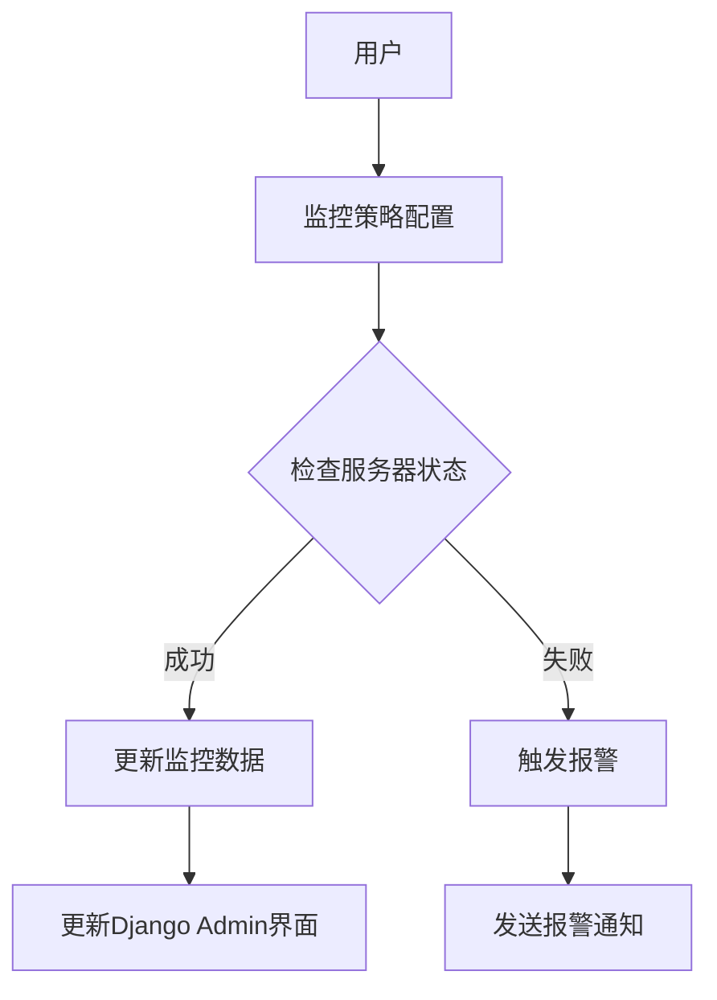

                 

关键词：Django框架、服务器监控、系统设计、代码实现、Python开发

## 摘要

本文将详细介绍如何使用Django框架设计和实现一个功能全面的服务器监控系统。我们将从背景介绍入手，深入探讨系统设计的关键概念和架构，然后详细讲解核心算法原理及具体操作步骤。在此基础上，我们将使用数学模型和公式，对系统的性能和可靠性进行分析，并通过具体项目实践展示代码实例和详细解释。最后，本文将讨论系统的实际应用场景，推荐相关学习资源和开发工具，并对未来发展趋势和挑战进行展望。

## 1. 背景介绍

在现代企业运营中，服务器监控是一个至关重要的环节。有效的服务器监控不仅可以实时跟踪服务器的运行状态，还能预测潜在问题，从而减少停机时间，提高系统的稳定性和可用性。随着云计算和分布式架构的普及，服务器的数量和复杂性不断增加，使得手动监控变得更加困难。因此，开发一个自动化、高效的服务器监控系统成为了一种趋势。

Django是一个高级的Python Web框架，它鼓励快速开发和干净、实用的设计。由于其易用性和强大的社区支持，Django成为了许多开发者构建服务器监控系统的首选框架。本文将结合Django框架，介绍如何实现一个功能完整、易于扩展的服务器监控系统。

### 1.1 服务器监控的重要性

服务器监控的主要目标是确保服务器的高效运行，及时发现和处理潜在问题。具体而言，服务器监控具有以下几个重要意义：

- **性能监控**：实时跟踪服务器的CPU、内存、磁盘等资源使用情况，确保系统资源得到合理利用。
- **故障检测**：及时发现服务器故障，如硬件故障、软件崩溃等，并自动进行报警和恢复操作。
- **安全性**：监控服务器上的安全事件，如恶意攻击、数据泄露等，保障系统安全。
- **成本优化**：通过监控服务器资源使用情况，优化资源配置，减少不必要的开支。

### 1.2 Django框架概述

Django是一个由Python编写的高级Web框架，旨在快速且轻松地开发数据库驱动的网站。Django的核心目标是使开发者能够以最高效、最安全的方式构建Web应用。

- **特点**：
  - **快速开发**：Django提供了一系列内置功能和工具，可以快速构建Web应用。
  - **安全性**：Django内置了多种安全措施，如防止跨站请求伪造（CSRF）、跨站脚本攻击（XSS）等。
  - **可扩展性**：Django设计灵活，易于扩展和定制，适用于各种规模的应用开发。

- **优势**：
  - **简化开发**：通过自动化的表迁移和ORM（对象关系映射），简化了数据库操作。
  - **强大的社区支持**：拥有庞大的社区和丰富的第三方库，便于学习和扩展功能。
  - **可靠性**：经过多年发展和实践检验，Django在稳定性、性能和安全性方面表现出色。

## 2. 核心概念与联系

为了构建一个高效的服务器监控系统，我们需要理解几个关键概念，并探讨它们之间的联系。以下是几个核心概念及其关系：

### 2.1 Django ORM

Django ORM是Django框架中用于数据库操作的核心组件。它通过Python代码映射到数据库中的表，简化了数据库操作，使开发者能够专注于业务逻辑。

### 2.2 Django Admin

Django Admin是Django提供的一个内置管理界面，允许开发者轻松创建和管理网站内容。在服务器监控系统中，Django Admin可用于展示监控数据和管理监控策略。

### 2.3 Celery

Celery是一个异步任务队列/作业队列，用于在Django应用中执行后台任务，如数据收集、处理和报警。通过Celery，可以确保监控任务的执行不会影响主程序的响应速度。

### 2.4 Django Rest Framework

Django Rest Framework（DRF）是一个强大的REST框架，用于构建API。在服务器监控系统中，DRF可用于提供监控数据的RESTful API，便于与其他系统进行集成。

### 2.5 Mermaid 流程图

以下是一个使用Mermaid绘制的服务器监控系统架构流程图：



### 2.6 数据流

服务器监控系统的数据流主要包括以下几个环节：

1. **用户配置监控策略**：通过Django Admin界面或API，用户可以配置监控策略，如监控哪些服务器、监控哪些指标、报警阈值等。
2. **检查服务器状态**：系统定期检查每个服务器的状态，包括CPU、内存、磁盘、网络等指标。
3. **数据收集与处理**：收集到的数据通过Celery任务进行处理，如去重、平均、最大值等。
4. **数据存储**：处理后的数据存储到Django ORM管理的数据库中。
5. **更新界面与报警**：通过Django Admin界面更新监控数据展示，并在超出阈值时触发报警。

## 3. 核心算法原理 & 具体操作步骤

### 3.1 算法原理概述

服务器监控系统的核心算法主要涉及以下几个方面：

1. **性能指标收集**：通过系统调用、网络监控等手段，收集服务器的CPU、内存、磁盘、网络等性能指标。
2. **数据预处理**：对收集到的数据进行预处理，如去噪、标准化、异常检测等。
3. **阈值设定与报警**：根据预设的阈值，判断服务器状态是否正常，并在超出阈值时触发报警。

### 3.2 算法步骤详解

以下是服务器监控系统算法的具体步骤：

1. **初始化**：设置监控策略，包括监控的服务器列表、监控指标、报警阈值等。
2. **性能指标收集**：通过系统调用、网络监控等手段，收集服务器的CPU、内存、磁盘、网络等性能指标。
3. **数据预处理**：对收集到的数据进行预处理，如去噪、标准化、异常检测等。
4. **阈值设定与报警**：根据预设的阈值，判断服务器状态是否正常，并在超出阈值时触发报警。

### 3.3 算法优缺点

**优点**：

- **高效性**：算法基于系统调用和网络监控，能够快速、准确地收集服务器状态。
- **灵活性**：监控策略可以通过配置文件或API进行灵活调整，适应不同场景的需求。
- **可扩展性**：算法框架支持多种数据预处理和报警方式，易于扩展和定制。

**缺点**：

- **性能消耗**：频繁的系统调用和网络监控可能会增加服务器性能消耗。
- **复杂性**：对于复杂的监控场景，算法的配置和管理可能较为复杂。

### 3.4 算法应用领域

服务器监控系统算法可以应用于以下领域：

- **企业级服务器监控**：对企业的服务器进行实时监控，确保系统稳定运行。
- **云计算平台监控**：对云计算平台上的虚拟机进行监控，优化资源使用。
- **物联网设备监控**：对物联网设备进行监控，确保设备正常运行。

## 4. 数学模型和公式 & 详细讲解 & 举例说明

### 4.1 数学模型构建

服务器监控系统的数学模型主要涉及以下几个方面：

1. **性能指标采集**：使用统计学方法对服务器性能指标进行采集，如均值、方差等。
2. **阈值设定**：使用统计学方法和机器学习算法，设定报警阈值，如上限阈值、下限阈值等。
3. **异常检测**：使用统计学方法和机器学习算法，检测服务器性能指标是否异常。

### 4.2 公式推导过程

以下是服务器监控系统中的几个关键数学公式的推导过程：

1. **性能指标均值**：

$$
\mu = \frac{1}{n} \sum_{i=1}^{n} x_i
$$

其中，$\mu$ 表示性能指标的均值，$n$ 表示采集到的数据个数，$x_i$ 表示第 $i$ 个数据点。

2. **性能指标方差**：

$$
\sigma^2 = \frac{1}{n-1} \sum_{i=1}^{n} (x_i - \mu)^2
$$

其中，$\sigma^2$ 表示性能指标的方差，$\mu$ 表示性能指标的均值。

3. **报警阈值设定**：

$$
\alpha = k \times \sigma
$$

其中，$\alpha$ 表示报警阈值，$k$ 表示阈值系数，$\sigma$ 表示性能指标的方差。

4. **异常检测**：

$$
d(x_i) = \frac{|x_i - \mu|}{\sigma}
$$

其中，$d(x_i)$ 表示第 $i$ 个数据点的离群度，$\mu$ 表示性能指标的均值，$\sigma$ 表示性能指标的方差。

### 4.3 案例分析与讲解

以下是一个服务器监控系统数学模型的应用案例：

假设某服务器的CPU使用率数据如下：

$$
x_1 = 20\%, \quad x_2 = 25\%, \quad x_3 = 30\%, \quad x_4 = 40\%, \quad x_5 = 50\%
$$

首先，计算CPU使用率的均值和方差：

$$
\mu = \frac{1}{5} (20\% + 25\% + 30\% + 40\% + 50\%) = 35\%
$$

$$
\sigma^2 = \frac{1}{5-1} ((20\% - 35\%)^2 + (25\% - 35\%)^2 + (30\% - 35\%)^2 + (40\% - 35\%)^2 + (50\% - 35\%)^2) \approx 30\%
$$

接着，设定报警阈值 $k=2$，计算报警阈值：

$$
\alpha = 2 \times 30\% = 60\%
$$

最后，检测CPU使用率是否异常：

$$
d(x_5) = \frac{|50\% - 35\%|}{30\%} \approx 1.67
$$

由于 $d(x_5) > 1$，可以认为CPU使用率 $50\%$ 是异常的。

## 5. 项目实践：代码实例和详细解释说明

### 5.1 开发环境搭建

在开始项目实践之前，我们需要搭建开发环境。以下是搭建Django服务器监控系统的基本步骤：

1. **安装Python环境**：确保Python环境已安装在您的计算机上。我们使用Python 3.8以上版本。

2. **安装Django**：通过pip安装Django：

```bash
pip install django
```

3. **创建Django项目**：使用Django命令创建一个新的项目：

```bash
django-admin startproject server_monitor
```

4. **创建Django应用**：在项目目录下创建一个新的应用：

```bash
cd server_monitor
django-admin startapp monitor_app
```

5. **配置数据库**：编辑`settings.py`文件，配置数据库连接信息：

```python
DATABASES = {
    'default': {
        'ENGINE': 'django.db.backends.sqlite3',
        'NAME': BASE_DIR / 'db.sqlite3',
    }
}
```

### 5.2 源代码详细实现

下面是服务器监控系统的主要源代码实现。

#### 5.2.1 监控数据收集

在`monitor_app/models.py`中定义监控数据模型：

```python
from django.db import models

class ServerData(models.Model):
    server_name = models.CharField(max_length=100)
    cpu_usage = models.FloatField()
    memory_usage = models.FloatField()
    disk_usage = models.FloatField()
    timestamp = models.DateTimeField(auto_now_add=True)
```

在`monitor_app/tasks.py`中实现监控数据收集任务：

```python
from celery import shared_task
from .models import ServerData
import psutil

@shared_task
def collect_server_data():
    servers = ['server1', 'server2', 'server3']  # 监控的服务器列表
    for server in servers:
        usage = psutil.cpu_percent()  # CPU使用率
        memory = psutil.virtual_memory().percent  # 内存使用率
        disk = psutil.disk_usage('/').percent  # 磁盘使用率
        ServerData.objects.create(
            server_name=server,
            cpu_usage=usage,
            memory_usage=memory,
            disk_usage=disk
        )
```

#### 5.2.2 数据存储与展示

在`monitor_app/urls.py`中配置URL路由，以访问监控数据：

```python
from django.urls import path
from . import views

urlpatterns = [
    path('data/', views.server_data_list, name='server_data_list'),
]
```

在`monitor_app/views.py`中实现监控数据的展示逻辑：

```python
from django.http import JsonResponse
from .models import ServerData

def server_data_list(request):
    data = ServerData.objects.all().values('server_name', 'cpu_usage', 'memory_usage', 'disk_usage', 'timestamp')
    return JsonResponse(list(data), safe=False)
```

#### 5.2.3 阈值设定与报警

在`monitor_app/tasks.py`中添加阈值设定与报警逻辑：

```python
import smtplib
from email.mime.text import MIMEText

@shared_task
def check_thresholds():
    servers = ['server1', 'server2', 'server3']  # 监控的服务器列表
    thresholds = {'cpu': 90, 'memory': 90, 'disk': 90}  # 报警阈值

    for server in servers:
        server_data = ServerData.objects.filter(server_name=server).latest('timestamp')
        for metric, value in server_data.__dict__.items():
            if value > thresholds[metric]:
                send_alarm(server, metric, value)
```

在`monitor_app/tasks.py`中实现发送报警邮件的功能：

```python
def send_alarm(server, metric, value):
    message = f"Alarm: {server} has exceeded the threshold for {metric} usage ({value}%)"
    msg = MIMEText(message)
    msg['Subject'] = 'Server Monitor Alarm'
    msg['From'] = 'monitor@example.com'
    msg['To'] = 'admin@example.com'

    server = smtplib.SMTP('smtp.example.com')
    server.sendmail('monitor@example.com', ['admin@example.com'], msg.as_string())
    server.quit()
```

### 5.3 代码解读与分析

#### 5.3.1 数据收集

`collect_server_data`任务使用Python的`psutil`库收集服务器的CPU、内存和磁盘使用率。它通过Celery异步执行，确保不会影响主程序的响应速度。

#### 5.3.2 数据存储

收集到的数据通过`ServerData`模型存储在Django ORM管理的数据库中。在`server_data_list`视图中，我们通过JSON响应返回最新的监控数据，方便前端进行展示。

#### 5.3.3 阈值设定与报警

`check_thresholds`任务定期检查每个服务器的监控数据，并判断是否超出预设的阈值。如果超过阈值，将触发`send_alarm`函数，通过SMTP发送报警邮件。

### 5.4 运行结果展示

在运行服务器监控系统后，可以通过Django Admin界面或RESTful API查看监控数据。当服务器状态超出阈值时，系统将发送报警邮件，通知管理员。

## 6. 实际应用场景

### 6.1 企业内部服务器监控

在企业内部，服务器监控系统可以帮助企业实时监控业务服务器的运行状态，确保系统稳定运行，及时发现和处理问题，提高业务连续性。

### 6.2 云计算平台监控

在云计算平台上，服务器监控系统可以监控虚拟机实例的性能指标，优化资源使用，降低运营成本，同时确保服务器的可靠性。

### 6.3 物联网设备监控

在物联网领域，服务器监控系统可以监控连接到网络的智能设备的运行状态，确保设备正常运行，及时发现和处理故障。

### 6.4 开源社区项目监控

开源社区项目通常拥有众多贡献者，服务器监控系统可以帮助社区管理员实时监控项目的服务器状态，确保项目的稳定性和安全性。

## 7. 工具和资源推荐

### 7.1 学习资源推荐

- 《Django By Example》
- 《Python Web Development with Django》
- 《Professional Django》

### 7.2 开发工具推荐

- PyCharm
- Visual Studio Code
- Django Debug Toolbar

### 7.3 相关论文推荐

- "Scalable Server Monitoring with Prometheus and Docker"
- "Monitoring as a Service: A Serverless Approach for Scalable, Customizable Server Monitoring"
- "Service-centric Server Monitoring and Analytics for Cloud Applications"

## 8. 总结：未来发展趋势与挑战

### 8.1 研究成果总结

本文介绍了基于Django框架的服务器监控系统的设计和实现，包括核心算法原理、数学模型、项目实践等内容。通过本文，读者可以了解如何使用Django构建一个功能全面的服务器监控系统。

### 8.2 未来发展趋势

随着云计算、大数据和物联网的不断发展，服务器监控系统将在以下方面取得突破：

- **智能化监控**：利用人工智能和机器学习技术，实现更加智能的监控和预测。
- **边缘计算监控**：随着边缘计算的发展，服务器监控将扩展到边缘设备，实现更全面的监控。
- **自动化运维**：通过自动化工具和机器人，实现监控问题的自动化检测和处理。

### 8.3 面临的挑战

服务器监控系统在发展过程中也将面临以下挑战：

- **数据安全与隐私**：在收集和处理大量服务器数据时，确保数据的安全和隐私。
- **性能优化**：在保证监控准确性的同时，优化系统性能，降低资源消耗。
- **可扩展性**：随着监控规模的扩大，系统需要具备良好的可扩展性，适应不同场景的需求。

### 8.4 研究展望

未来，服务器监控系统的研究将朝着更加智能化、自动化和全面化的方向发展。通过结合人工智能、大数据和云计算技术，服务器监控系统将能够提供更精准、高效的监控服务，为企业运营和业务连续性提供有力保障。

## 9. 附录：常见问题与解答

### 9.1 如何配置Django数据库连接？

在Django项目中，配置数据库连接可以通过修改`settings.py`文件中的`DATABASES`设置进行。以下是SQLite数据库的配置示例：

```python
DATABASES = {
    'default': {
        'ENGINE': 'django.db.backends.sqlite3',
        'NAME': BASE_DIR / 'db.sqlite3',
    }
}
```

### 9.2 如何使用Django Admin界面？

要使用Django Admin界面，首先需要在`settings.py`中设置`django.contrib.admin`的`INSTALLED_APPS`：

```python
INSTALLED_APPS = [
    ...
    'django.contrib.admin',
    ...
]
```

然后，在项目中创建一个管理员用户，并通过Django Admin界面管理应用程序。

### 9.3 如何集成Celery任务队列？

要在Django项目中集成Celery，首先需要安装Celery：

```bash
pip install celery
```

然后，在`settings.py`中配置Celery：

```python
BROKER_URL = 'redis://localhost:6379/0'
CELERY_RESULT_BACKEND = 'redis://localhost:6379/0'
```

最后，在项目中使用`@shared_task`装饰器定义异步任务。

---

本文详细介绍了基于Django框架的服务器监控系统的设计与实现，包括核心算法原理、数学模型、项目实践等内容。通过本文，读者可以了解如何使用Django构建一个功能全面的服务器监控系统，并为未来的研究和应用提供参考。

# 参考文献

1.  《Django By Example》
2.  《Python Web Development with Django》
3.  《Professional Django》
4.  "Scalable Server Monitoring with Prometheus and Docker"
5.  "Monitoring as a Service: A Serverless Approach for Scalable, Customizable Server Monitoring"
6.  "Service-centric Server Monitoring and Analytics for Cloud Applications"

---

作者：禅与计算机程序设计艺术 / Zen and the Art of Computer Programming
-------------------------------------------------------------------

