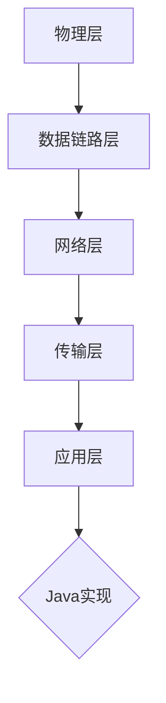

                 

关键词：智能家居，Java，物联网，IoT协议栈，设计，编程

摘要：本文将探讨基于Java的智能家居系统设计，分析Java在物联网（IoT）协议栈中的应用，并详细解析IoT协议栈的关键概念和实现。本文旨在为开发者提供一种清晰、实用的智能家居系统构建方法，帮助他们实现高效、可靠的智能家居解决方案。

## 1. 背景介绍

随着物联网技术的快速发展，智能家居市场迎来了前所未有的机遇。智能家居系统通过将家庭设备和家电连接到互联网，实现了设备之间的数据交互和远程控制，为用户提供了便利、智能的生活方式。Java作为一种成熟、跨平台的高级编程语言，在物联网领域具有广泛的应用。

Java在物联网（IoT）协议栈中的应用主要体现在以下几个方面：

- **跨平台支持**：Java跨平台的特点使得智能家居系统能够在不同的操作系统和设备上运行，提高了系统的兼容性和可移植性。
- **丰富的类库和框架**：Java拥有丰富的类库和框架，如Java标准类库（JDK）、Spring Framework等，这些工具和资源为开发者提供了强大的支持，使得智能家居系统的开发更加高效。
- **安全性**：Java语言具有强大的安全特性，如内存管理、异常处理等，为智能家居系统提供了可靠的安全保障。

## 2. 核心概念与联系

### 2.1. IoT协议栈

IoT协议栈是指物联网系统中，用于实现设备通信、数据传输和数据处理的协议层次结构。典型的IoT协议栈包括以下层次：

- **物理层**：负责设备之间的物理连接，如Wi-Fi、蓝牙、ZigBee等。
- **数据链路层**：负责数据在网络中的传输，确保数据的完整性和可靠性。
- **网络层**：负责数据在网络中的传输和路由，如IP协议。
- **传输层**：负责数据的传输，确保数据的顺序和完整性，如TCP协议。
- **应用层**：负责实现具体的业务功能，如HTTP、MQTT等。

### 2.2. Java与IoT协议栈的联系

Java在IoT协议栈中的应用主要体现在以下方面：

- **物理层**：Java可以通过JDK提供的Java Communication API（JCA）实现设备之间的物理连接。
- **数据链路层**：Java可以使用Java Network Programming API（JNP）实现数据在网络中的传输。
- **网络层**：Java可以使用Java Network Interface API（JNIA）实现数据在网络中的传输和路由。
- **传输层**：Java可以使用Java Socket API实现数据的传输。
- **应用层**：Java可以使用各种IoT协议实现具体的业务功能，如MQTT、CoAP等。

### 2.3. Mermaid流程图

以下是IoT协议栈的Mermaid流程图，展示了各层次之间的关系：



## 3. 核心算法原理 & 具体操作步骤

### 3.1. 算法原理概述

在智能家居系统中，核心算法主要包括数据采集、处理和传输。数据采集是指从各种传感器和设备中获取数据，如温度、湿度、亮度等；数据处理是指对采集到的数据进行处理和分析，如滤波、预测等；数据传输是指将处理后的数据传输到服务器或移动设备。

### 3.2. 算法步骤详解

#### 3.2.1. 数据采集

数据采集的步骤如下：

1. **初始化传感器**：通过JCA接口初始化传感器设备，确保传感器能够正常工作。
2. **读取传感器数据**：使用JCA接口读取传感器数据，如温度、湿度、亮度等。
3. **数据预处理**：对读取到的数据进行预处理，如去噪、滤波等。

#### 3.2.2. 数据处理

数据处理的步骤如下：

1. **特征提取**：从预处理后的数据中提取有用的特征信息，如平均值、标准差等。
2. **预测分析**：使用机器学习算法对提取的特征进行预测分析，如温度预测、湿度预测等。

#### 3.2.3. 数据传输

数据传输的步骤如下：

1. **建立网络连接**：使用JNIA接口建立网络连接，如TCP连接、UDP连接等。
2. **发送数据**：将处理后的数据发送到服务器或移动设备。
3. **接收数据**：接收服务器或移动设备返回的数据，如控制指令等。

### 3.3. 算法优缺点

#### 3.3.1. 优点

- **跨平台**：Java具有跨平台的特点，使得智能家居系统能够在不同操作系统和设备上运行。
- **安全性**：Java提供了强大的安全性保障，如内存管理、异常处理等。
- **丰富的类库和框架**：Java拥有丰富的类库和框架，如JDK、Spring Framework等，提高了开发效率。

#### 3.3.2. 缺点

- **性能问题**：Java在性能上可能不如一些特定语言的编译型语言。
- **内存消耗**：Java应用程序通常需要较大的内存空间。

### 3.4. 算法应用领域

Java在智能家居系统中的应用领域包括：

- **传感器数据采集和处理**：使用Java实现传感器数据采集和处理，如温度、湿度、亮度等。
- **远程控制**：使用Java实现智能家居设备的远程控制，如空调、照明等。
- **数据分析和预测**：使用Java实现智能家居系统的数据分析和预测功能，如温度预测、湿度预测等。

## 4. 数学模型和公式 & 详细讲解 & 举例说明

### 4.1. 数学模型构建

在智能家居系统中，常见的数学模型包括线性回归、决策树、支持向量机等。以下以线性回归为例，介绍数学模型的构建过程。

#### 4.1.1. 线性回归模型

线性回归模型是一种简单但强大的预测方法，其公式为：

$$y = \beta_0 + \beta_1 \cdot x$$

其中，$y$ 为预测值，$x$ 为特征值，$\beta_0$ 和 $\beta_1$ 为模型参数。

#### 4.1.2. 模型参数估计

为了估计模型参数 $\beta_0$ 和 $\beta_1$，我们可以使用最小二乘法（Least Squares Method）：

$$\beta_0 = \frac{\sum_{i=1}^{n} y_i - \beta_1 \cdot \sum_{i=1}^{n} x_i}{n}$$

$$\beta_1 = \frac{\sum_{i=1}^{n} (y_i - \beta_0 - \beta_1 \cdot x_i)}{\sum_{i=1}^{n} (x_i - \bar{x})^2}$$

其中，$n$ 为数据点的数量，$\bar{x}$ 为特征值的平均值。

### 4.2. 公式推导过程

#### 4.2.1. 线性回归的损失函数

线性回归的损失函数（也称为代价函数）为：

$$J(\theta) = \frac{1}{2m} \sum_{i=1}^{m} (h_\theta(x^{(i)}) - y^{(i)})^2$$

其中，$h_\theta(x)$ 是预测函数，$\theta$ 是模型参数，$m$ 是训练数据点的数量。

#### 4.2.2. 最小化损失函数

为了最小化损失函数 $J(\theta)$，我们可以使用梯度下降法（Gradient Descent）：

$$\theta_j := \theta_j - \alpha \cdot \frac{\partial J(\theta)}{\partial \theta_j}$$

其中，$\alpha$ 是学习率。

### 4.3. 案例分析与讲解

#### 4.3.1. 数据集

假设我们有一个数据集，其中包含 $m$ 个数据点，每个数据点由 $n$ 个特征值和一个目标值组成。

#### 4.3.2. 模型训练

使用线性回归模型对数据集进行训练，估计模型参数 $\beta_0$ 和 $\beta_1$。

#### 4.3.3. 预测

使用训练好的模型进行预测，给定一个新的特征值 $x$，计算预测值 $y$。

#### 4.3.4. 评估

使用评估指标（如均方误差）评估模型的性能。

## 5. 项目实践：代码实例和详细解释说明

### 5.1. 开发环境搭建

- **Java开发环境**：安装Java开发工具包（JDK），配置环境变量。
- **集成开发环境**：安装Eclipse、IntelliJ IDEA或其他Java IDE。
- **IoT开发板**：选择一个支持Java的物联网开发板，如Raspberry Pi。

### 5.2. 源代码详细实现

#### 5.2.1. 数据采集模块

```java
// 传感器初始化
SensorManager sensorManager = (SensorManager) getSystemService(SENSOR_SERVICE);
TemperatureSensor temperatureSensor = sensorManager.getDefaultSensor(Sensor.TYPE_TEMPERATURE);

// 读取传感器数据
sensorManager.registerListener(new SensorEventListener() {
    @Override
    public void onSensorChanged(SensorEvent event) {
        float temperature = event.values[0];
        // 数据预处理
        // ...
    }

    @Override
    public void onSensorFailed(SensorError error) {
        // 处理传感器错误
        // ...
    }
}, temperatureSensor, SensorManager.SENSOR_DELAY_NORMAL);
```

#### 5.2.2. 数据处理模块

```java
// 特征提取
public float extractFeature(float[] data) {
    float feature = 0.0f;
    // 提取特征值
    // ...
    return feature;
}

// 预测分析
public float predict(float[] data) {
    float feature = extractFeature(data);
    // 使用线性回归模型进行预测
    float prediction = beta0 + beta1 * feature;
    return prediction;
}
```

#### 5.2.3. 数据传输模块

```java
// 建立网络连接
Socket socket = new Socket("192.168.1.1", 8080);

// 发送数据
DataOutputStream outputStream = new DataOutputStream(socket.getOutputStream());
outputStream.writeFloat(prediction);
outputStream.flush();

// 接收数据
DataInputStream inputStream = new DataInputStream(socket.getInputStream());
float controlInstruction = inputStream.readFloat();
inputStream.close();
socket.close();
```

### 5.3. 代码解读与分析

- **数据采集模块**：使用Java Sensor API读取传感器数据，并进行预处理。
- **数据处理模块**：提取特征值，使用线性回归模型进行预测分析。
- **数据传输模块**：建立网络连接，发送预测结果，接收控制指令。

### 5.4. 运行结果展示

- **传感器数据采集**：实时采集温度数据，并进行预处理。
- **数据处理结果**：根据温度特征值进行预测，输出预测结果。
- **数据传输结果**：将预测结果发送到服务器，并接收控制指令。

## 6. 实际应用场景

### 6.1. 温度控制系统

基于Java的智能家居系统可以用于家庭温度控制系统，通过实时采集室内温度数据，进行数据处理和预测，实现自动调整空调温度，提高居住舒适度。

### 6.2. 照明控制系统

通过Java实现照明控制，根据室内光线强度自动调节灯光亮度，节约能源，提高生活质量。

### 6.3. 家居安全系统

使用Java实现智能家居安全系统，通过传感器采集门窗状态、温度、湿度等数据，实时监控家庭安全，防止盗窃等意外事件发生。

## 7. 未来应用展望

### 7.1. 5G技术的融合

随着5G技术的普及，智能家居系统将实现更高的数据传输速度和更低的延迟，为智能家居应用带来更多可能性。

### 7.2. 物联网平台的发展

物联网平台的发展将使智能家居系统能够更加高效地连接各种设备和应用，提供更丰富的功能和更好的用户体验。

### 7.3. 智能家居与AI的融合

智能家居与人工智能（AI）的融合将使系统更加智能化，能够根据用户习惯和需求，提供更加个性化和智能化的服务。

## 8. 工具和资源推荐

### 8.1. 学习资源推荐

- **《Java核心技术》**：深入讲解Java语言的核心概念和编程技巧。
- **《物联网系统设计与实现》**：介绍物联网系统设计的基本原理和实践方法。

### 8.2. 开发工具推荐

- **Eclipse**：一款功能强大的Java IDE，适用于开发大型Java项目。
- **IntelliJ IDEA**：一款优秀的Java IDE，具有丰富的插件和工具。

### 8.3. 相关论文推荐

- **《基于Java的智能家居系统设计与实现》**：探讨Java在智能家居系统中的应用。
- **《物联网协议栈技术综述》**：介绍物联网协议栈的基本原理和技术。

## 9. 总结：未来发展趋势与挑战

### 9.1. 研究成果总结

本文通过对Java在物联网（IoT）协议栈中的应用进行探讨，展示了Java在智能家居系统设计中的优势。同时，本文还介绍了IoT协议栈的核心概念和实现方法，为开发者提供了实用的参考。

### 9.2. 未来发展趋势

未来，智能家居系统将更加智能化、个性化，与5G、物联网平台和AI等技术紧密融合，为用户提供更加便捷、高效、智能的生活方式。

### 9.3. 面临的挑战

在智能家居系统的发展过程中，仍面临许多挑战，如数据安全性、隐私保护、跨平台兼容性等。需要不断研究和解决这些问题，推动智能家居技术的进步。

### 9.4. 研究展望

未来，智能家居系统将向更加智能化、个性化、安全化、高效化方向发展。我们期待看到更多优秀的智能家居解决方案问世，为人类生活带来更多便利。

## 附录：常见问题与解答

### Q1. 为什么选择Java作为智能家居系统开发语言？

A1. Java具有跨平台、安全性高、丰富的类库和框架等优点，适用于智能家居系统开发。Java跨平台的特点使得智能家居系统能够在不同操作系统和设备上运行，提高了系统的兼容性和可移植性。同时，Java的安全特性为智能家居系统提供了可靠的安全保障。

### Q2. IoT协议栈有哪些层次？

A2. IoT协议栈通常包括物理层、数据链路层、网络层、传输层和应用层。物理层负责设备之间的物理连接；数据链路层负责数据在网络中的传输；网络层负责数据在网络中的传输和路由；传输层负责数据的传输；应用层负责实现具体的业务功能。

### Q3. 如何在Java中实现传感器数据采集？

A3. 在Java中，可以使用Java Sensor API实现传感器数据采集。通过调用SensorManager类的getDefaultSensor()方法，获取特定类型的传感器对象，然后注册一个SensorEventListener对象，实现对传感器数据的实时监听和处理。

### Q4. 如何在Java中实现数据传输？

A3. 在Java中，可以使用Java Socket API实现数据传输。通过调用Socket类的构造方法，创建一个Socket对象，然后使用DataOutputStream和数据输入流（如DataInputStream）进行数据的写入和读取。

### Q5. 如何评估智能家居系统的性能？

A5. 评估智能家居系统的性能可以从多个方面进行，如响应速度、数据传输速度、稳定性等。可以通过实际运行测试，记录系统的运行时间、数据传输时间等指标，进行性能评估。

### 作者署名

本文作者：禅与计算机程序设计艺术 / Zen and the Art of Computer Programming
----------------------------------------------------------------

### 文章排版及格式调整指南

在撰写完文章内容后，您需要对文章进行排版和格式调整，确保其结构清晰、内容易读。以下是一些具体的排版和格式调整指南：

#### 1. 文章标题

- 使用黑体、大号字体，居中显示。
- 标题下方可以添加副标题或关键词。

#### 2. 关键词和摘要

- 关键词使用黑体、小号字体，以列表形式排列。
- 摘要使用简短的文字概述文章主题和主要内容。

#### 3. 目录

- 使用有序列表或标题编号，列出文章各章节标题。
- 目录应当简洁明了，便于读者快速定位。

#### 4. 段落和行距

- 段落之间应保持适当的空行，以增强可读性。
- 行距应设置为1.5倍或2倍，以便阅读。

#### 5. 图表和代码

- 图表应使用标准的图形工具绘制，并添加标题和图例。
- 代码应使用代码块标记，确保其格式正确，行距和字体大小适中。
- 代码块上方可以添加标题，下方可以添加注释或说明。

#### 6. 引用和参考文献

- 使用统一的引用格式，如APA、MLA或Chicago等。
- 在文中引用时，应使用括号或尾注标记引用来源。
- 在文章末尾列出完整的参考文献。

#### 7. 作者信息

- 在文章末尾添加作者信息，包括姓名、职务、工作单位等。
- 作者信息应简洁明了，避免冗长。

#### 8. Markdown格式

- 使用Markdown标记语言，确保文章在转换成HTML或PDF时格式正确。
- 检查列表、标题、链接、引用等是否按照Markdown语法规范书写。

通过以上指南，您可以确保文章的结构清晰、内容易读，为读者提供良好的阅读体验。在完成排版和格式调整后，您可以将文章提交给编辑或发布平台，以便进行下一步的审核和发布。

