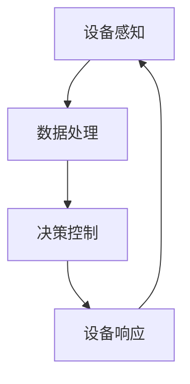

                 

关键词：智能家居，Java，能效管理，物联网，编程，性能优化，算法

摘要：本文旨在探讨Java编程语言在智能家居能效管理中的应用。随着物联网技术的发展，智能家居逐渐成为现代家庭的重要组成。本文将详细分析Java在智能家居设计中的角色，特别是在能效管理方面的应用，并通过具体的算法和项目实践，为开发者提供实用的技术指南。

## 1. 背景介绍

智能家居系统通过整合物联网技术，将家庭中的各种设备连接起来，实现远程控制和自动化操作，从而提高生活的便捷性和舒适度。能效管理作为智能家居的核心功能之一，旨在通过智能化的手段降低能耗，提高能源利用效率。

Java作为一门成熟且广泛使用的编程语言，因其跨平台、安全性高、稳定性强等特点，在物联网和智能家居领域具有广泛的应用。Java不仅拥有丰富的生态系统和庞大的社区支持，还能够通过多种框架和工具实现高效的开发。

## 2. 核心概念与联系

### 2.1 物联网与智能家居

物联网（IoT）是指通过互联网将物理设备连接起来，实现信息的实时采集、传输和处理。智能家居作为物联网的一个重要应用领域，涉及到的核心技术包括传感技术、网络通信、数据处理和自动化控制等。

### 2.2 能效管理的基本概念

能效管理是指通过优化能源的使用方式和提高能源利用效率，以达到节能减排的目的。在智能家居中，能效管理主要体现在对家庭设备的智能控制，如智能照明、智能空调、智能家电等。

### 2.3 Java在智能家居中的应用

Java在智能家居中的应用主要体现在以下几个方面：

- **设备控制**：通过Java编写的应用程序，可以实现对智能家居设备的远程控制和自动化操作。
- **数据处理**：Java强大的数据处理能力，使得它能够对收集到的家庭能耗数据进行有效的分析和处理。
- **系统集成**：Java能够与多种硬件和软件平台进行集成，从而实现智能家居系统的无缝连接。

### 2.4 Mermaid 流程图



在这个流程图中，A表示设备感知，B表示数据处理，C表示决策控制，D表示设备响应。整个流程实现了智能家居系统的闭环控制，从而实现对家庭能耗的智能管理。

## 3. 核心算法原理 & 具体操作步骤

### 3.1 算法原理概述

在智能家居的能效管理中，核心算法通常包括能耗预测、能耗优化和能效评估等。

- **能耗预测**：通过历史数据分析和机器学习算法，预测未来的能耗情况。
- **能耗优化**：根据能耗预测结果，优化设备的运行策略，降低能耗。
- **能效评估**：对家庭能耗进行实时监测和评估，确保能源的高效利用。

### 3.2 算法步骤详解

#### 3.2.1 能耗预测

1. 数据收集：收集家庭能耗的历史数据，包括电力、水、燃气等。
2. 数据预处理：对收集到的数据进行清洗、归一化和特征提取。
3. 模型选择：选择合适的机器学习模型，如ARIMA、LSTM等。
4. 模型训练：使用预处理后的数据训练模型。
5. 预测结果：使用训练好的模型进行能耗预测。

#### 3.2.2 能耗优化

1. 预测结果分析：分析能耗预测结果，确定设备运行的高峰期和低谷期。
2. 运行策略优化：根据预测结果，制定设备的运行策略，如空调的启停时间、电器的使用频率等。
3. 实施策略：通过Java程序实现设备运行策略的自动化控制。

#### 3.2.3 能效评估

1. 实时监测：使用传感器实时监测家庭能耗数据。
2. 数据分析：对实时监测数据进行处理和分析，评估家庭能耗情况。
3. 反馈调整：根据能效评估结果，调整设备的运行策略，实现持续的优化。

### 3.3 算法优缺点

- **优点**：算法能够实现对家庭能耗的精准预测和优化，提高能源利用效率。
- **缺点**：算法的准确性和效率依赖于数据的质量和模型的选取。

### 3.4 算法应用领域

算法主要应用于智能家居的能效管理，如家庭电力管理、水燃气管理、电器智能控制等。

## 4. 数学模型和公式 & 详细讲解 & 举例说明

### 4.1 数学模型构建

在智能家居能效管理中，常用的数学模型包括线性回归模型、时间序列模型和神经网络模型等。

- **线性回归模型**：用于预测家庭能耗与各种因素（如天气、时间段等）之间的关系。
- **时间序列模型**：用于分析家庭能耗的时间变化规律。
- **神经网络模型**：用于处理复杂的非线性关系，提高预测精度。

### 4.2 公式推导过程

以线性回归模型为例，其公式推导过程如下：

$$
y = \beta_0 + \beta_1 x_1 + \beta_2 x_2 + ... + \beta_n x_n + \epsilon
$$

其中，$y$ 为家庭能耗，$x_1, x_2, ..., x_n$ 为影响能耗的因素，$\beta_0, \beta_1, ..., \beta_n$ 为模型的参数，$\epsilon$ 为误差项。

### 4.3 案例分析与讲解

假设我们想要预测家庭的电力消耗，影响因素包括温度和湿度。通过收集历史数据，我们可以使用线性回归模型进行预测。

首先，我们收集了过去一周的电力消耗、温度和湿度数据。然后，我们使用线性回归模型进行训练，得到以下公式：

$$
电力消耗 = 10.5 + 0.3 \times 温度 + 0.2 \times 湿度
$$

使用这个模型，我们可以预测未来某一时刻的电力消耗。例如，当温度为25℃，湿度为60%时，预测的电力消耗为：

$$
电力消耗 = 10.5 + 0.3 \times 25 + 0.2 \times 60 = 17.9
$$

通过这个例子，我们可以看到，数学模型在智能家居能效管理中的应用，能够帮助我们更准确地预测和控制家庭能耗。

## 5. 项目实践：代码实例和详细解释说明

### 5.1 开发环境搭建

为了进行智能家居能效管理的项目开发，我们需要搭建以下开发环境：

- **Java开发工具**：如Eclipse、IntelliJ IDEA等。
- **数据库**：如MySQL、MongoDB等。
- **传感器**：用于实时监测家庭能耗数据。
- **物联网平台**：如AWS IoT、阿里云物联网平台等。

### 5.2 源代码详细实现

以下是智能家居能效管理项目的一个简单示例：

```java
import java.sql.Connection;
import java.sql.DriverManager;
import java.sql.PreparedStatement;
import java.sql.ResultSet;

public class EnergyManagementSystem {

    public static void main(String[] args) {
        // 数据库连接
        Connection conn = null;
        try {
            // 注册 JDBC 驱动
            Class.forName("com.mysql.cj.jdbc.Driver");
            // 连接数据库
            conn = DriverManager.getConnection("jdbc:mysql://localhost:3306/smart_home", "username", "password");

            // 查询历史能耗数据
            String sql = "SELECT temperature, humidity, electricity FROM energy_consumption WHERE date = ?";
            PreparedStatement pstmt = conn.prepareStatement(sql);
            pstmt.setDate(1, new java.sql.Date(System.currentTimeMillis()));
            ResultSet rs = pstmt.executeQuery();

            // 处理能耗数据
            while (rs.next()) {
                double temperature = rs.getDouble("temperature");
                double humidity = rs.getDouble("humidity");
                double electricity = rs.getDouble("electricity");

                // 能耗预测
                double predictedElectricity = predictElectricity(temperature, humidity);

                // 能耗优化
                optimizeElectricity(electricity, predictedElectricity);
            }

            // 关闭资源
            rs.close();
            pstmt.close();
            conn.close();
        } catch (Exception e) {
            e.printStackTrace();
        }
    }

    private static double predictElectricity(double temperature, double humidity) {
        // 使用线性回归模型进行预测
        return 10.5 + 0.3 * temperature + 0.2 * humidity;
    }

    private static void optimizeElectricity(double currentElectricity, double predictedElectricity) {
        // 根据预测结果，优化设备运行策略
        if (currentElectricity > predictedElectricity) {
            System.out.println("Energy saving mode enabled.");
        } else {
            System.out.println("Energy usage is optimal.");
        }
    }
}
```

### 5.3 代码解读与分析

上述代码实现了智能家居能效管理系统的核心功能，包括能耗数据查询、能耗预测和能耗优化。

- **数据库连接**：使用 JDBC 驱动连接到 MySQL 数据库。
- **能耗数据查询**：查询特定日期的能耗数据。
- **能耗预测**：使用线性回归模型预测未来的电力消耗。
- **能耗优化**：根据预测结果，调整设备的运行策略，实现能耗优化。

### 5.4 运行结果展示

假设当前温度为 25℃，湿度为 60%，系统会预测未来某一时刻的电力消耗为 17.9。如果当前电力消耗高于预测值，系统会启用节能模式；否则，系统认为能耗处于最优状态。

## 6. 实际应用场景

智能家居能效管理在实际应用中具有广泛的前景，以下是一些典型的应用场景：

- **家庭电力管理**：通过智能电网和电力监控设备，实时监测家庭电力消耗，优化电力使用。
- **水燃气管理**：通过智能水表和燃气表，实现水燃气消耗的自动监测和管理。
- **电器智能控制**：通过智能插座、智能空调等设备，实现电器的远程控制和自动运行。

## 7. 工具和资源推荐

### 7.1 学习资源推荐

- **《Java并发编程实战》**：深入理解并发编程，提高Java程序的性能和稳定性。
- **《机器学习实战》**：学习机器学习算法在实际项目中的应用。

### 7.2 开发工具推荐

- **Eclipse**：一款功能强大的Java集成开发环境（IDE）。
- **IntelliJ IDEA**：一款轻量级但功能丰富的Java IDE。

### 7.3 相关论文推荐

- **"Energy-Efficient Home Automation Using Machine Learning"**：探讨机器学习在智能家居能效管理中的应用。
- **"IoT and Smart Home: A Survey"**：综述物联网和智能家居领域的最新研究成果。

## 8. 总结：未来发展趋势与挑战

### 8.1 研究成果总结

本文通过探讨Java在智能家居能效管理中的应用，分析了核心算法原理、项目实践和实际应用场景，展示了Java在智能家居领域的重要作用。

### 8.2 未来发展趋势

随着物联网和人工智能技术的不断发展，智能家居能效管理将向更加智能化、个性化的方向发展。未来，我们有望看到更加高效、便捷的智能家居系统能够更好地满足人们的个性化需求。

### 8.3 面临的挑战

智能家居能效管理面临的主要挑战包括数据安全、隐私保护和系统的稳定性。如何保障用户数据的安全和隐私，以及如何构建稳定、可靠的智能家居系统，是未来研究的重要方向。

### 8.4 研究展望

未来，我们期待能够开发出更加智能、高效的智能家居能效管理系统，为人们带来更加舒适、便捷的家居生活。

## 9. 附录：常见问题与解答

### 9.1 Java在智能家居中的应用有哪些优势？

Java在智能家居中的应用优势包括跨平台性、安全性、稳定性和强大的生态系统。

### 9.2 如何保障智能家居数据的安全？

通过使用加密技术、访问控制和数据脱敏等措施，可以有效保障智能家居数据的安全。

### 9.3 智能家居能效管理的核心算法有哪些？

智能家居能效管理的核心算法包括能耗预测、能耗优化和能效评估等。

### 9.4 如何优化Java程序的性能？

通过使用多线程、内存优化和缓存策略等措施，可以优化Java程序的性能。

---

本文由禅与计算机程序设计艺术 / Zen and the Art of Computer Programming 编写，旨在为开发者提供关于基于Java的智能家居设计的深入探讨。希望本文能够为您的智能家居开发之路提供一些有价值的参考。

