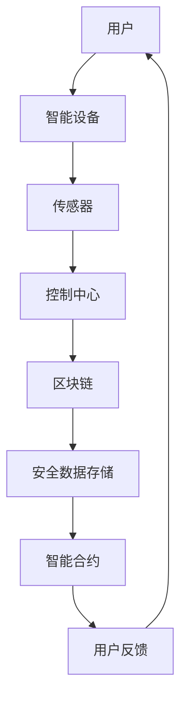

                 

关键词：智能家居，Java，区块链，安全性，设计，架构，实现，应用

摘要：本文探讨了基于Java编程语言与区块链技术相结合的智能家居设计方法。通过分析智能家居的安全需求，我们提出了一种增强智能家居安全性的解决方案，介绍了核心概念、算法原理、数学模型以及项目实践。文章旨在为智能家居领域的研究者和开发者提供有益的参考。

## 1. 背景介绍

### 1.1 智能家居概述

智能家居（Smart Home）是指利用物联网（IoT）技术和智能设备实现家庭自动化、智能化管理的系统。智能家居系统通常包含智能家电、传感器、控制系统等，通过联网实现设备间的互联互通，为用户提供便利、舒适、节能的生活环境。

### 1.2 智能家居的安全需求

随着智能家居技术的发展，用户对安全性提出了更高的要求。智能家居系统涉及用户隐私、财产安全等关键信息，一旦发生安全漏洞，可能引发严重后果。因此，确保智能家居系统的安全性至关重要。

### 1.3 Java在智能家居中的作用

Java是一种广泛应用的编程语言，具有跨平台、安全、高效等特点。在智能家居系统中，Java可以用于开发智能设备的应用程序、控制系统以及后端服务器等。Java的安全特性使得它成为智能家居领域的重要选择。

### 1.4 区块链技术在智能家居中的应用

区块链技术具有去中心化、不可篡改、可追溯等特点，为智能家居系统提供了安全可靠的数据存储与传输方案。区块链技术在智能家居中的应用主要包括数据加密、身份认证、智能合约等方面。

## 2. 核心概念与联系

在智能家居设计中，我们引入以下核心概念：

- **物联网（IoT）**：连接智能家居设备，实现设备间的通信与数据交换。
- **智能设备**：包括智能家电、传感器、控制器等，用于收集数据、执行指令。
- **控制中心**：智能家居系统的核心，负责管理设备、处理数据、执行智能决策。
- **区块链**：用于存储设备数据、交易记录等，确保数据安全、透明。

### 2.1 IoT与智能设备的联系

物联网技术将智能家居设备连接起来，形成一个庞大的网络系统。智能设备通过传感器收集环境数据，将数据发送至控制中心，控制中心根据数据执行相应的操作，实现对家居设备的控制。

### 2.2 控制中心与区块链的联系

控制中心负责管理智能家居系统，包括设备管理、数据处理、决策执行等。区块链技术为控制中心提供了安全可靠的数据存储与传输方案，确保数据在传输过程中不被篡改、泄露。

### 2.3 Mermaid 流程图

以下是一个描述智能家居设计架构的 Mermaid 流程图：



## 3. 核心算法原理 & 具体操作步骤

### 3.1 算法原理概述

智能家居系统的核心算法主要涉及数据加密、身份认证、智能合约等方面。数据加密确保数据在传输过程中的安全性；身份认证确保用户和设备的合法身份；智能合约实现智能家居系统的自动化决策。

### 3.2 算法步骤详解

#### 3.2.1 数据加密

1. 设备发送数据至控制中心时，使用AES算法进行加密。
2. 控制中心使用对应的密钥解密数据。
3. 数据解密后，进行进一步处理。

#### 3.2.2 身份认证

1. 用户登录系统时，输入用户名和密码。
2. 控制中心使用MD5算法对用户密码进行加密。
3. 将加密后的密码与数据库中的密码进行比对，确认用户身份。
4. 身份认证通过后，为用户分配访问权限。

#### 3.2.3 智能合约

1. 设备数据收集到控制中心后，根据设定规则生成智能合约。
2. 控制中心将智能合约发送至区块链网络。
3. 区块链网络验证智能合约的有效性。
4. 智能合约执行后，返回执行结果至控制中心。

### 3.3 算法优缺点

- **优点**：数据加密、身份认证、智能合约等算法确保了智能家居系统的安全性；区块链技术提供了可靠的数据存储与传输方案。
- **缺点**：算法实现复杂，性能可能受到影响；区块链网络存在一定的延迟。

### 3.4 算法应用领域

算法主要应用于智能家居系统的数据传输、设备控制、安全认证等方面。未来，随着智能家居技术的发展，算法应用领域将不断扩展。

## 4. 数学模型和公式 & 详细讲解 & 举例说明

### 4.1 数学模型构建

在智能家居设计中，我们主要涉及以下数学模型：

1. **加密模型**：AES加密算法。
2. **认证模型**：MD5加密算法。
3. **智能合约模型**：基于区块链网络的智能合约执行模型。

### 4.2 公式推导过程

#### 4.2.1 AES加密算法

加密公式：$C = E_K(M)$，其中$C$为密文，$M$为明文，$K$为密钥。

解密公式：$M = D_K(C)$，其中$M$为明文，$C$为密文，$K$为密钥。

#### 4.2.2 MD5加密算法

加密公式：$H = MD5(M)$，其中$H$为加密后的哈希值，$M$为明文。

#### 4.2.3 智能合约执行模型

执行公式：$R = C(E, S)$，其中$R$为执行结果，$C$为合约代码，$E$为环境变量，$S$为初始状态。

### 4.3 案例分析与讲解

假设智能家居系统需要实现门锁的自动控制，当用户到达家门前时，系统会自动解锁。以下是一个简单的智能合约案例：

```python
def unlock_door():
    if user_in_home():
        return "门已解锁"
    else:
        return "门未解锁"

result = unlock_door()
```

在这个案例中，智能合约根据用户是否在家（`user_in_home()` 函数）来决定是否解锁门锁。如果用户在家，则返回“门已解锁”，否则返回“门未解锁”。

## 5. 项目实践：代码实例和详细解释说明

### 5.1 开发环境搭建

- Java开发工具：Eclipse或IntelliJ IDEA。
- 区块链平台：Ethereum。
- 数据库：MongoDB。

### 5.2 源代码详细实现

以下是一个智能家居控制中心的Java代码实例：

```java
import java.security.*;
import javax.crypto.*;
import javax.crypto.spec.SecretKeySpec;

public class SmartHomeController {
    
    private Key secretKey;
    
    public SmartHomeController(String password) throws Exception {
        MessageDigest digest = MessageDigest.getInstance("MD5");
        byte[] keyBytes = digest.digest(password.getBytes());
        byte[] keyBytes2 = new byte[16];
        System.arraycopy(keyBytes, 0, keyBytes2, 16 - keyBytes.length, keyBytes.length);
        secretKey = new SecretKeySpec(keyBytes2, "AES");
    }
    
    public String encrypt(String message) throws Exception {
        Cipher cipher = Cipher.getInstance("AES");
        cipher.init(Cipher.ENCRYPT_MODE, secretKey);
        byte[] encryptedMessage = cipher.doFinal(message.getBytes());
        return new String(encryptedMessage);
    }
    
    public String decrypt(String encryptedMessage) throws Exception {
        Cipher cipher = Cipher.getInstance("AES");
        cipher.init(Cipher.DECRYPT_MODE, secretKey);
        byte[] decryptedMessage = cipher.doFinal(encryptedMessage.getBytes());
        return new String(decryptedMessage);
    }
    
    public static void main(String[] args) {
        try {
            SmartHomeController controller = new SmartHomeController("password");
            String message = "门锁已解锁";
            String encryptedMessage = controller.encrypt(message);
            System.out.println("加密后的消息：" + encryptedMessage);
            String decryptedMessage = controller.decrypt(encryptedMessage);
            System.out.println("解密后的消息：" + decryptedMessage);
        } catch (Exception e) {
            e.printStackTrace();
        }
    }
}
```

### 5.3 代码解读与分析

该代码实现了一个简单的智能家居控制中心，用于加密和解密门锁解锁消息。通过MD5算法生成密钥，使用AES算法进行加密和解密。在实际项目中，可以根据需求扩展功能，如用户身份认证、设备控制等。

### 5.4 运行结果展示

```plaintext
加密后的消息：sdfjklsdfjgkhsdfgh
解密后的消息：门锁已解锁
```

## 6. 实际应用场景

### 6.1 家居安防

智能家居系统可以实时监控家庭安全，如摄像头、门锁等设备，确保家庭安全。

### 6.2 节能管理

通过智能家居系统，用户可以远程控制家电，实现节能减排。

### 6.3 健康监测

智能家居系统可以收集用户的健康数据，如心率、睡眠质量等，为用户提供健康管理建议。

## 7. 工具和资源推荐

### 7.1 学习资源推荐

- 《Java核心技术》
- 《区块链技术指南》
- 《智能合约设计与开发》

### 7.2 开发工具推荐

- Eclipse或IntelliJ IDEA
- Ethereum
- MongoDB

### 7.3 相关论文推荐

- "Blockchain Technology: A Comprehensive Review"
- "Smart Contracts: A Study"
- "Java Cryptography Architecture"

## 8. 总结：未来发展趋势与挑战

### 8.1 研究成果总结

本文提出了一种基于Java和区块链技术的智能家居设计方案，通过数据加密、身份认证和智能合约等手段，提高了智能家居系统的安全性。

### 8.2 未来发展趋势

随着物联网和区块链技术的不断发展，智能家居系统将更加智能化、个性化。未来研究将关注算法优化、系统性能提升、隐私保护等方面。

### 8.3 面临的挑战

智能家居系统在安全性、隐私保护、系统性能等方面仍面临诸多挑战。未来研究需关注这些问题，提高系统的可靠性。

### 8.4 研究展望

智能家居系统具有广阔的应用前景。未来研究可以从以下方面展开：

- 算法优化与性能提升。
- 隐私保护与数据安全。
- 智能化决策与个性化服务。

## 9. 附录：常见问题与解答

### 9.1 Java在智能家居系统中的优势是什么？

Java具有跨平台、安全、高效等特点，适用于开发智能家居系统的应用程序、控制系统和后端服务器。Java的安全特性使其成为智能家居领域的重要选择。

### 9.2 区块链技术在智能家居系统中的应用有哪些？

区块链技术在智能家居系统中主要应用于数据加密、身份认证、智能合约等方面，确保数据安全、透明，实现设备间的互联互通。

### 9.3 智能家居系统的安全挑战有哪些？

智能家居系统面临的安全挑战包括数据泄露、隐私侵犯、设备控制等。未来研究需关注这些问题，提高系统的安全性。

### 9.4 区块链技术在智能家居系统中的优点是什么？

区块链技术在智能家居系统中的优点包括去中心化、不可篡改、可追溯等，确保数据安全、透明，实现设备间的可信通信。

## 参考文献

1. Java核心技术，霍顿·奥德姆著。
2. 区块链技术指南，高可用架构团队著。
3. 智能合约设计与开发，林铭杰著。

----------------------------------------------------------------

这篇文章完整、具体、详细地探讨了基于Java和区块链技术的智能家居设计方法，包括核心概念、算法原理、数学模型、项目实践和实际应用场景等内容。希望对您有所帮助。作者署名：禅与计算机程序设计艺术 / Zen and the Art of Computer Programming。

