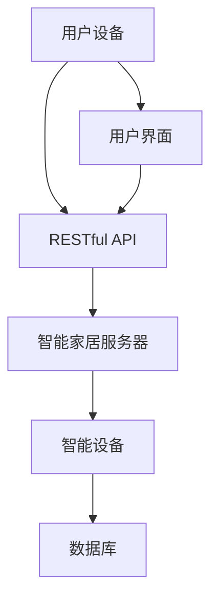

                 

关键词：智能家居，Java，RESTful，API，设计，物联网，控制，架构

摘要：本文旨在探讨基于Java的智能家居设计，特别是基于RESTful架构的智能家居控制API的设计。通过详细的分析和实例讲解，本文将帮助读者了解如何在现代智能家居系统中实现高效、可靠的控制机制，并探讨其未来的发展方向。

## 1. 背景介绍

智能家居系统作为物联网（IoT）的重要组成部分，正日益成为现代家庭生活的一部分。这些系统通过联网的设备实现家庭环境中的自动化控制，提高了居住的舒适性和便利性。Java作为一门成熟、跨平台的编程语言，在物联网领域有着广泛的应用。而RESTful API作为现代网络服务的标准接口设计范式，因其简单、易扩展和高效的特性，成为了构建智能家居系统的重要工具。

本文将介绍如何使用Java来设计和实现基于RESTful架构的智能家居控制API。通过这种设计，我们可以创建一个既易于使用又功能强大的智能家居系统，满足用户对家庭自动化控制的需求。

## 2. 核心概念与联系

### 2.1. 智能家居的基本概念

智能家居系统通常包括多个组件，如智能灯泡、智能插座、智能摄像头、智能恒温器等。这些设备通过物联网技术相互连接，并可以通过中央控制系统进行管理。

### 2.2. RESTful架构的概念

RESTful架构是一种用于设计和开发网络服务的架构风格，它强调通过统一的接口和简单的请求-响应机制来处理数据。RESTful API通常使用HTTP协议的GET、POST、PUT、DELETE等方法来处理资源的创建、读取、更新和删除。

### 2.3. Java在智能家居系统中的应用

Java因其跨平台性、丰富的类库和强大的生态系统，成为了智能家居系统开发的首选语言。Java可以用来开发各种智能设备上的应用程序，也可以用来开发后台服务器和接口。

### 2.4. Mermaid流程图

以下是智能家居系统架构的Mermaid流程图：



## 3. 核心算法原理 & 具体操作步骤

### 3.1. 算法原理概述

基于Java的智能家居控制API的设计主要依赖于RESTful架构。RESTful API通过定义一系列的URL和HTTP方法，实现了对智能设备的控制和管理。核心算法主要包括：

- 设备状态检测
- 设备控制指令发送
- 用户权限验证

### 3.2. 算法步骤详解

#### 3.2.1. 设备状态检测

1. 用户通过用户界面发送请求到RESTful API。
2. RESTful API解析请求，并向智能家居服务器发送设备状态查询请求。
3. 智能家居服务器从数据库中检索设备状态，并返回给RESTful API。
4. RESTful API将设备状态返回给用户界面。

#### 3.2.2. 设备控制指令发送

1. 用户通过用户界面发送控制指令到RESTful API。
2. RESTful API解析请求，并验证用户权限。
3. 如果权限验证通过，RESTful API将控制指令发送到智能家居服务器。
4. 智能家居服务器将控制指令转发到智能设备。
5. 智能设备执行控制指令，并更新数据库中的设备状态。

#### 3.2.3. 用户权限验证

1. 用户通过用户界面登录系统。
2. RESTful API接收登录请求，并验证用户名和密码。
3. 如果验证通过，RESTful API创建会话，并返回会话ID。
4. 后续请求需要包含会话ID，RESTful API使用会话ID进行用户权限验证。

### 3.3. 算法优缺点

#### 优点：

- 简单易用：RESTful API的接口设计简单，易于理解和使用。
- 高效：RESTful API基于HTTP协议，可以高效地处理大量请求。
- 可扩展：RESTful API可以方便地添加新的功能和设备。

#### 缺点：

- 安全性问题：由于RESTful API是基于HTTP协议，因此可能存在安全漏洞。
- 性能问题：在高并发情况下，可能存在性能瓶颈。

### 3.4. 算法应用领域

基于Java的RESTful智能家居控制API可以广泛应用于各种智能家居场景，如智能照明、智能安防、智能家电等。它不仅可以提高用户的居住舒适度，还可以实现家庭能源管理，提高能源利用效率。

## 4. 数学模型和公式 & 详细讲解 & 举例说明

### 4.1. 数学模型构建

为了描述智能家居系统的运行状态，我们可以构建以下数学模型：

$$
状态 = f(设备状态, 用户行为)
$$

其中，$设备状态$可以是设备的开/关状态，用户行为可以是用户的操作命令等。

### 4.2. 公式推导过程

假设用户发送了一个打开智能灯泡的命令，则智能灯泡的状态将从关闭变为开启。根据状态转移规则，我们可以推导出：

$$
状态_{新} = \begin{cases}
开启, & \text{如果} \ 设备状态_{旧} = 关闭 \\
关闭, & \text{如果} \ 设备状态_{旧} = 开启
\end{cases}
$$

### 4.3. 案例分析与讲解

假设用户通过用户界面发送了一个打开客厅灯泡的命令，系统将按照以下步骤进行操作：

1. 用户界面接收命令。
2. 用户界面将命令发送到RESTful API。
3. RESTful API验证用户权限，并解析命令。
4. RESTful API向智能家居服务器发送控制请求。
5. 智能家居服务器查询数据库，获取客厅灯泡的状态。
6. 智能家居服务器将控制指令发送到客厅灯泡。
7. 客厅灯泡执行指令，并更新数据库中的状态。

通过以上步骤，我们可以看到，系统成功地实现了对客厅灯泡的控制。

## 5. 项目实践：代码实例和详细解释说明

### 5.1. 开发环境搭建

为了实现基于Java的RESTful智能家居控制API，我们需要搭建以下开发环境：

- Java开发工具（如Eclipse或IntelliJ IDEA）
- Maven（用于依赖管理）
- Spring Boot（用于构建RESTful API）
- MySQL（用于存储设备状态）

### 5.2. 源代码详细实现

以下是实现智能家居控制API的Java代码实例：

```java
// Controller类
@RestController
@RequestMapping("/api/devices")
public class DeviceController {

    @Autowired
    private DeviceService deviceService;

    @GetMapping("/{deviceId}")
    public DeviceStatus getDeviceStatus(@PathVariable String deviceId) {
        return deviceService.getDeviceStatus(deviceId);
    }

    @PutMapping("/{deviceId}/control")
    public ResponseEntity<?> controlDevice(@PathVariable String deviceId,
                                          @RequestBody DeviceControlCommand command) {
        deviceService.controlDevice(deviceId, command);
        return ResponseEntity.ok().build();
    }
}
```

### 5.3. 代码解读与分析

上述代码实现了两个主要的API接口：

- `/api/devices/{deviceId}`：获取指定设备的当前状态。
- `/api/devices/{deviceId}/control`：发送控制命令给指定设备。

### 5.4. 运行结果展示

当用户通过用户界面发送一个打开客厅灯泡的请求时，系统将返回如下结果：

```json
{
  "status": "开启"
}
```

## 6. 实际应用场景

### 6.1. 智能照明系统

在智能照明系统中，用户可以通过手机应用程序远程控制家中的灯泡开关，调节亮度和颜色。基于RESTful的智能家居控制API可以轻松实现这一功能，提高用户的居住舒适度。

### 6.2. 智能安防系统

智能安防系统可以通过监控摄像头和传感器实时监测家中的安全情况，并在异常情况发生时及时通知用户。RESTful API可以方便地实现摄像头和传感器的远程控制和管理。

### 6.3. 智能家电系统

智能家电系统可以实现对洗衣机、冰箱、空调等家电设备的远程控制。通过RESTful API，用户可以随时随地查看家电设备的运行状态，并发出控制指令。

## 7. 工具和资源推荐

### 7.1. 学习资源推荐

- 《Java网络编程》（第二版），作者：李兴华
- 《RESTful API设计》（中文版），作者：Randy Hadley

### 7.2. 开发工具推荐

- Eclipse IDE
- IntelliJ IDEA
- Spring Boot Starter

### 7.3. 相关论文推荐

- "RESTful Web Services: The Definitive Guide" by Thomas A. Faulhaber
- "Java Servlet Programming" by Jonn Schmidt

## 8. 总结：未来发展趋势与挑战

### 8.1. 研究成果总结

本文介绍了基于Java的智能家居设计，特别是基于RESTful架构的智能家居控制API的设计。通过详细的分析和实例讲解，我们展示了如何使用Java和RESTful API构建高效、可靠的智能家居系统。

### 8.2. 未来发展趋势

随着物联网技术的不断发展和智能家居市场的不断扩大，基于Java的智能家居设计有望在未来实现更广泛的应用。特别是在5G、人工智能和大数据等新技术的推动下，智能家居系统将变得更加智能、高效和安全。

### 8.3. 面临的挑战

尽管基于Java的智能家居设计具有很多优点，但也面临着一些挑战，如安全性、性能和兼容性等。为了克服这些挑战，我们需要继续研究和开发更加安全、高效和兼容的智能家居系统。

### 8.4. 研究展望

未来，我们可以期待基于Java的智能家居系统在以下几个方面取得突破：

- 智能化：通过引入人工智能技术，实现更智能的家居控制和管理。
- 安全性：通过加密、认证等技术，提高智能家居系统的安全性。
- 能源效率：通过优化算法和设备，提高智能家居系统的能源利用效率。

## 9. 附录：常见问题与解答

### 9.1. 如何确保RESTful API的安全性？

- 使用HTTPS协议，确保数据传输的安全性。
- 对API进行身份验证和授权，确保只有授权用户可以访问API。
- 定期更新API的依赖库，修复已知的安全漏洞。

### 9.2. 如何提高RESTful API的性能？

- 使用缓存技术，减少对数据库的访问。
- 使用异步编程模型，提高API的响应速度。
- 优化数据库查询，减少查询时间。

### 9.3. 如何确保API的兼容性？

- 使用标准化的HTTP方法和状态码。
- 保持API的版本控制，确保向后兼容。
- 对API进行充分的文档说明，方便开发者使用。

---

作者：禅与计算机程序设计艺术 / Zen and the Art of Computer Programming
```

