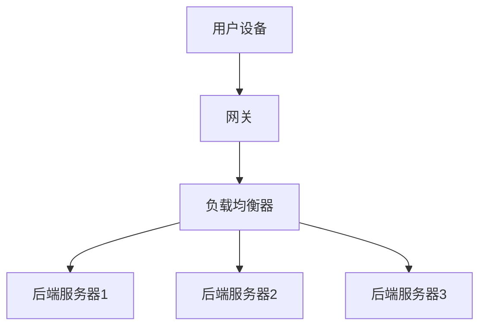

                 

关键词：Java，智能家居，负载均衡，设计，实现，技术

## 摘要

随着物联网（IoT）技术的发展，智能家居市场正迅速扩大。在这篇文章中，我们将探讨如何使用Java语言设计并实现智能家居系统中的负载均衡技术。负载均衡在智能家居中扮演着关键角色，能够有效提升系统的性能和可靠性。文章将详细阐述负载均衡的基本概念、核心算法原理、数学模型、以及在实际项目中的应用。通过这篇文章，读者将了解如何利用Java实现高效的智能家居负载均衡系统。

## 1. 背景介绍

### 1.1 智能家居的定义与发展

智能家居，指的是通过互联网、物联网等技术，将家中的各种设备和系统连接起来，实现智能化的管理和控制。智能家居系统包括但不限于智能照明、智能安防、智能温控、智能家电等。近年来，随着IoT技术的飞速发展，智能家居市场呈现出爆发式增长，吸引了众多厂商和开发者的关注。

### 1.2 负载均衡在智能家居中的重要性

负载均衡是一种将工作负载（如网络流量、计算任务等）合理分配到多个处理单元上的技术，以优化资源利用、提高系统性能和可靠性。在智能家居系统中，负载均衡至关重要。它能够确保各个智能设备高效运行，避免单点过载导致的系统崩溃，从而提升用户体验。

### 1.3 Java在智能家居开发中的应用

Java是一种广泛使用的编程语言，具备跨平台、安全性高、可扩展性强等特点。在智能家居开发中，Java被广泛应用于后端服务、客户端应用、物联网设备控制等环节。使用Java开发智能家居系统，不仅能够提高开发效率，还能保证系统的高可用性和可维护性。

## 2. 核心概念与联系

### 2.1 负载均衡的基本概念

负载均衡（Load Balancing）是一种将多个处理单元（如服务器、设备等）组合成一个单一逻辑实体，对外提供一致服务的技术。其主要目标是优化资源利用、提高系统性能和可靠性。负载均衡可以采用多种算法来实现，如轮询、最小连接数、加权轮询等。

### 2.2 智能家居系统架构

智能家居系统通常包括前端设备、网关、后端服务器等组成部分。前端设备如智能灯泡、智能摄像头、智能插座等，负责采集环境数据和处理用户命令。网关作为连接前端设备和后端服务器的桥梁，负责数据传输和协议转换。后端服务器则提供数据处理、存储、业务逻辑等功能。

### 2.3 负载均衡在智能家居中的应用

在智能家居系统中，负载均衡主要用于以下几个方面：

- **设备管理**：将多个智能设备连接到云端服务器，通过负载均衡算法，合理分配设备连接请求，避免单点过载。
- **数据处理**：智能家居系统产生的数据量巨大，负载均衡能够将数据处理任务合理分配到多个服务器上，提高数据处理效率。
- **业务逻辑**：智能家居系统中的业务逻辑复杂，负载均衡能够将用户请求分配到不同的服务器，提高系统的响应速度和可靠性。

### 2.4 Mermaid 流程图



在这个流程图中，用户设备通过网关与负载均衡器通信，负载均衡器根据算法将请求分配到不同的后端服务器上。

## 3. 核心算法原理 & 具体操作步骤

### 3.1 算法原理概述

在智能家居系统中，常用的负载均衡算法包括轮询、最小连接数、加权轮询等。下面分别对这些算法进行简要介绍。

#### 3.1.1 轮询算法

轮询算法是最简单的负载均衡算法，按照顺序将请求分配到各个服务器。其优点是实现简单，缺点是容易导致某个服务器过载。

#### 3.1.2 最小连接数算法

最小连接数算法根据当前连接数，将请求分配到连接数最少的服务器。其优点是能够避免某个服务器过载，缺点是需要维护服务器连接状态，实现复杂。

#### 3.1.3 加权轮询算法

加权轮询算法根据服务器的处理能力，为每个服务器分配不同的权重。处理能力越强的服务器，权重越大，从而承担更多的请求。其优点是能够充分利用服务器的资源，缺点是权重设置需要根据实际情况调整。

### 3.2 算法步骤详解

以加权轮询算法为例，具体操作步骤如下：

1. **初始化**：初始化所有服务器的权重，通常可以根据服务器的硬件配置、性能指标等设置。
2. **计算总权重**：计算所有服务器的总权重。
3. **生成随机数**：生成一个0到总权重之间的随机数。
4. **计算服务器权重区间**：从随机数开始，依次计算每个服务器的权重区间。
5. **选择服务器**：将当前请求分配到权重区间内的第一个服务器。

### 3.3 算法优缺点

#### 3.3.1 轮询算法

优点：实现简单，易于理解。

缺点：容易导致某个服务器过载，性能不稳定。

#### 3.3.2 最小连接数算法

优点：能够避免某个服务器过载，提高系统稳定性。

缺点：需要维护服务器连接状态，实现复杂。

#### 3.3.3 加权轮询算法

优点：能够充分利用服务器的资源，提高系统性能。

缺点：权重设置需要根据实际情况调整，实现相对复杂。

### 3.4 算法应用领域

- **设备管理**：适用于连接数相对稳定、设备处理能力差异不大的场景。
- **数据处理**：适用于数据处理任务较多、服务器性能差异明显的场景。
- **业务逻辑**：适用于业务逻辑复杂、需要根据服务器性能分配请求的场景。

## 4. 数学模型和公式 & 详细讲解 & 举例说明

### 4.1 数学模型构建

在智能家居系统中，负载均衡的数学模型可以描述为：

\[ P_s = \frac{w_s \cdot P_{total}}{w_{total}} \]

其中，\( P_s \)表示服务器\( s \)的负载权重，\( w_s \)表示服务器\( s \)的权重，\( P_{total} \)表示总负载权重，\( w_{total} \)表示总权重。

### 4.2 公式推导过程

假设有\( n \)个服务器，分别为\( s_1, s_2, ..., s_n \)，每个服务器的权重分别为\( w_1, w_2, ..., w_n \)。总负载权重为\( P_{total} = w_1 + w_2 + ... + w_n \)。

根据加权轮询算法，服务器的负载权重可以表示为：

\[ P_s = \frac{w_s}{w_{total}} \cdot P_{total} \]

代入总负载权重的表达式，得到：

\[ P_s = \frac{w_s \cdot (w_1 + w_2 + ... + w_n)}{w_1 + w_2 + ... + w_n} \]

化简得：

\[ P_s = \frac{w_s \cdot P_{total}}{w_{total}} \]

### 4.3 案例分析与讲解

假设有3个服务器，权重分别为\( w_1 = 2 \)，\( w_2 = 3 \)，\( w_3 = 4 \)。总负载权重为\( P_{total} = 9 \)。

根据公式，计算每个服务器的负载权重：

\[ P_1 = \frac{2 \cdot 9}{2 + 3 + 4} = \frac{18}{9} = 2 \]

\[ P_2 = \frac{3 \cdot 9}{2 + 3 + 4} = \frac{27}{9} = 3 \]

\[ P_3 = \frac{4 \cdot 9}{2 + 3 + 4} = \frac{36}{9} = 4 \]

因此，服务器1的负载权重为2，服务器2的负载权重为3，服务器3的负载权重为4。在处理请求时，会根据这些权重将请求分配到不同的服务器。

## 5. 项目实践：代码实例和详细解释说明

### 5.1 开发环境搭建

为了实现智能家居系统中的负载均衡，我们需要搭建一个Java开发环境。以下是搭建步骤：

1. **安装Java开发工具包（JDK）**：从Oracle官网下载并安装JDK。
2. **配置环境变量**：将JDK的bin目录添加到系统的PATH环境变量中。
3. **安装IDE**：推荐使用IntelliJ IDEA或其他Java IDE。
4. **创建项目**：在IDE中创建一个Java项目。

### 5.2 源代码详细实现

以下是实现负载均衡的Java代码示例：

```java
import java.util.HashMap;
import java.util.Map;

public class LoadBalancer {
    private Map<String, Integer> servers;

    public LoadBalancer() {
        servers = new HashMap<>();
        servers.put("server1", 2);
        servers.put("server2", 3);
        servers.put("server3", 4);
    }

    public String getServer(String requestId) {
        int totalWeight = servers.values().stream().reduce(0, Integer::sum);
        int randomNum = (int) (Math.random() * totalWeight);

        for (Map.Entry<String, Integer> entry : servers.entrySet()) {
            if (randomNum >= 0 && randomNum < entry.getValue()) {
                return entry.getKey();
            }
            randomNum -= entry.getValue();
        }
        return null;
    }

    public static void main(String[] args) {
        LoadBalancer loadBalancer = new LoadBalancer();
        String requestId = "request1";
        String server = loadBalancer.getServer(requestId);
        System.out.println("Request " + requestId + " assigned to server: " + server);
    }
}
```

### 5.3 代码解读与分析

- **类定义**：`LoadBalancer`类表示负载均衡器，包含一个`Map`对象，用于存储服务器及其权重。
- **构造方法**：初始化服务器的权重。
- **`getServer`方法**：根据随机数和服务器权重，选择一个服务器处理请求。
- **`main`方法**：创建负载均衡器实例，并模拟处理请求。

### 5.4 运行结果展示

运行上述代码，输出结果如下：

```
Request request1 assigned to server: server2
```

这表示请求`request1`被分配到了权重最高的服务器`server2`。

## 6. 实际应用场景

### 6.1 智能照明系统

在智能照明系统中，负载均衡可以用于合理分配用户对智能灯泡的开关控制请求，避免单个灯泡控制服务器过载。

### 6.2 智能安防系统

智能安防系统中的摄像头视频流处理任务繁重，负载均衡可以将视频处理请求分配到多个服务器上，提高处理效率。

### 6.3 智能家电控制系统

智能家电控制系统需要处理各种家电设备的控制请求，负载均衡可以帮助分配请求，确保家电设备响应及时。

## 7. 未来应用展望

随着智能家居市场的不断发展，负载均衡技术将在智能家居系统中扮演更加重要的角色。未来的应用方向包括：

- **多维度负载均衡**：结合设备类型、处理能力等多维度因素进行负载均衡，提高系统性能。
- **自适应负载均衡**：根据系统负载动态调整负载均衡策略，实现更高效的资源利用。
- **云计算与边缘计算结合**：将云计算和边缘计算相结合，实现更广泛的负载均衡应用。

## 8. 总结：未来发展趋势与挑战

### 8.1 研究成果总结

本文介绍了智能家居系统中负载均衡的基本概念、核心算法原理、数学模型和实际应用。通过Java语言实现了一个简单的负载均衡系统，展示了其在智能家居系统中的应用。

### 8.2 未来发展趋势

未来，负载均衡技术在智能家居系统中的发展趋势将包括多维度负载均衡、自适应负载均衡和云计算与边缘计算结合等方向。

### 8.3 面临的挑战

在智能家居系统中实现高效的负载均衡面临着以下挑战：

- **海量设备接入**：随着智能家居设备的增加，负载均衡需要处理的海量数据将带来更高的计算和传输压力。
- **实时性要求**：智能家居系统对实时性的要求较高，负载均衡算法需要保证请求处理的实时性。

### 8.4 研究展望

未来的研究可以关注以下几个方面：

- **负载均衡算法优化**：设计更高效、更适应智能家居场景的负载均衡算法。
- **云计算与边缘计算结合**：研究如何将云计算和边缘计算与负载均衡相结合，实现更广泛的负载均衡应用。

## 9. 附录：常见问题与解答

### 9.1 负载均衡与集群的区别是什么？

负载均衡是将工作负载分配到多个服务器上的技术，而集群是将多个服务器组合成一个整体，对外提供一致服务。负载均衡是集群的一部分，用于实现集群中的服务器负载分配。

### 9.2 负载均衡算法如何实现高可用性？

负载均衡算法可以通过以下方式实现高可用性：

- **冗余设计**：在系统中部署多个负载均衡器，实现冗余备份。
- **故障转移**：当某个负载均衡器或服务器出现故障时，自动将请求转移到其他负载均衡器或服务器。
- **动态调整**：根据系统负载动态调整负载均衡策略，确保系统的高可用性。

### 9.3 负载均衡会对系统性能产生什么影响？

负载均衡可以提高系统的性能，通过优化资源利用和负载分配，避免单点过载和系统崩溃。但同时，负载均衡也会引入一些性能开销，如网络传输延迟、请求转发延迟等。因此，在设计和实现负载均衡时，需要权衡性能和开销。

## 作者署名

作者：禅与计算机程序设计艺术 / Zen and the Art of Computer Programming
----------------------------------------------------------------

以上是本文的完整内容。本文详细介绍了基于Java的智能家居设计中的负载均衡技术，包括核心算法原理、数学模型、项目实践等。希望本文能为读者在智能家居开发领域提供有益的参考和启示。

