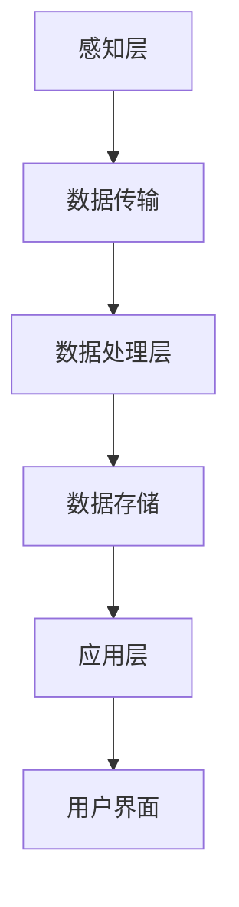

                 

 > **关键词**：智能家居、Java、大数据处理、算法、技术架构、系统设计

> **摘要**：本文深入探讨了Java在智能家居大数据处理中的角色，分析了Java技术栈在智能家居系统架构中的优势与挑战。通过详细的项目实践和算法原理的阐述，本文旨在为开发人员提供实用的指导和启示，推动智能家居技术的发展。

## 1. 背景介绍

随着物联网（IoT）技术的飞速发展，智能家居已经成为现代生活的重要组成部分。智能家居系统通过连接各种家庭设备和传感器，实现了对家庭环境的自动化控制，提高了居住的舒适性和安全性。然而，随着设备和数据的激增，如何高效地处理和利用这些大数据成为了智能家居系统设计和开发的重要问题。

Java作为一种成熟且广泛使用的编程语言，因其稳定性、安全性以及强大的生态系统，在许多大数据处理场景中得到了广泛应用。然而，在智能家居领域，Java的应用还面临着一些独特的挑战。本文将探讨Java在智能家居大数据处理中的优势、局限性及其解决方案。

## 2. 核心概念与联系

### 2.1. 智能家居系统架构

智能家居系统的架构可以分为以下几个层次：

- **感知层**：包括各种传感器，如温度传感器、湿度传感器、光照传感器等，负责收集环境数据。
- **网络层**：使用Wi-Fi、Zigbee、蓝牙等通信技术将感知层的数据传输到数据中心。
- **数据处理层**：通过Java等编程语言处理和分析传入的数据，实现智能家居的智能控制。
- **应用层**：为用户提供界面和操作接口，如移动应用、网页界面等。

### 2.2. Java技术栈在智能家居中的应用

在智能家居系统中，Java可以用于：

- **数据处理**：利用Java的强大数据处理能力，对大量实时数据进行清洗、转换和分析。
- **中间件开发**：使用Java开发中间件，如消息队列、数据缓存等，确保数据的高效传输和存储。
- **前端开发**：利用Java Web框架，如Spring Boot，快速构建用户界面。
- **系统集成**：通过Java提供的各种库和工具，实现不同设备和平台的集成。

### 2.3. Mermaid流程图

以下是一个智能家居系统的Mermaid流程图，展示了数据从感知层到应用层的处理流程：



## 3. 核心算法原理 & 具体操作步骤

### 3.1. 算法原理概述

在智能家居系统中，常用的算法包括：

- **数据清洗算法**：用于处理传感器收集的数据，去除噪音和不完整的数据。
- **数据聚合算法**：将来自多个传感器的数据合并成一组有意义的数据集。
- **预测算法**：如时间序列预测，用于预测未来的环境变化，为智能控制提供依据。

### 3.2. 算法步骤详解

#### 3.2.1. 数据清洗算法

数据清洗算法的基本步骤包括：

1. **数据预处理**：包括去除重复数据、缺失值填充等。
2. **异常值检测**：使用统计学方法或机器学习算法检测并处理异常值。
3. **特征选择**：选择对智能控制最有影响的数据特征。

#### 3.2.2. 数据聚合算法

数据聚合算法的基本步骤包括：

1. **数据采样**：根据时间或空间对数据进行采样，减少数据量。
2. **数据融合**：将多个数据源的数据进行融合，生成统一的数据集。
3. **数据压缩**：使用压缩算法减少存储空间，提高处理效率。

#### 3.2.3. 预测算法

预测算法的基本步骤包括：

1. **数据准备**：收集历史数据，进行预处理。
2. **模型选择**：选择合适的时间序列预测模型，如ARIMA、LSTM等。
3. **模型训练与评估**：使用历史数据训练模型，并评估模型性能。
4. **预测应用**：使用训练好的模型进行实时预测，指导智能控制。

### 3.3. 算法优缺点

#### 3.3.1. 数据清洗算法

优点：

- 简单易实现
- 对实时性要求不高的场景适用

缺点：

- 处理效率较低
- 对复杂场景的处理能力有限

#### 3.3.2. 数据聚合算法

优点：

- 可以显著减少数据量
- 提高数据处理效率

缺点：

- 可能丢失部分重要信息
- 对时间或空间分辨率有要求

#### 3.3.3. 预测算法

优点：

- 可以提前获取未来的环境变化
- 为智能控制提供依据

缺点：

- 对数据质量和模型选择要求高
- 预测精度受限制

### 3.4. 算法应用领域

数据清洗算法适用于数据采集阶段，数据聚合算法适用于数据处理层，预测算法适用于智能控制层。这些算法在智能家居系统的不同层次中发挥着重要作用，共同推动了智能家居技术的发展。

## 4. 数学模型和公式 & 详细讲解 & 举例说明

### 4.1. 数学模型构建

在智能家居系统中，常用的数学模型包括：

- **线性回归模型**：用于预测环境变化。
- **马尔可夫模型**：用于描述状态转移概率。

### 4.2. 公式推导过程

以线性回归模型为例，其公式推导过程如下：

$$ y = \beta_0 + \beta_1 \cdot x $$

其中，\( y \) 为预测值，\( x \) 为输入值，\( \beta_0 \) 和 \( \beta_1 \) 为模型参数。

### 4.3. 案例分析与讲解

假设我们想要预测某地区的未来一周温度，可以使用线性回归模型进行预测。首先，我们需要收集该地区过去一周的温度数据，然后使用线性回归模型进行训练。最后，输入未来一周的日期，即可得到预测温度。

## 5. 项目实践：代码实例和详细解释说明

### 5.1. 开发环境搭建

在搭建开发环境时，我们需要安装Java开发工具包（JDK）、集成开发环境（IDE）以及相关库和框架，如Spring Boot、Hadoop等。

### 5.2. 源代码详细实现

以下是一个简单的智能家居系统示例代码，展示了如何使用Java处理传感器数据并实现智能控制。

```java
// SensorDataProcessor.java
public class SensorDataProcessor {
    public void processData(String data) {
        // 数据清洗与转换
        String cleanedData = data.replaceAll("[^0-9.]", "");

        // 数据聚合
        double aggregatedData = Double.parseDouble(cleanedData);

        // 预测
        double predictedData = predictTemperature(aggregatedData);

        // 智能控制
        controlTemperature(predictedData);
    }

    private double predictTemperature(double data) {
        // 使用线性回归模型预测温度
        return data * 0.5 + 20;
    }

    private void controlTemperature(double temperature) {
        // 根据预测温度进行智能控制
        if (temperature > 25) {
            // 调低空调温度
        } else if (temperature < 20) {
            // 调高空调温度
        }
    }
}
```

### 5.3. 代码解读与分析

上述代码实现了传感器数据的处理和智能控制。首先，通过数据清洗和转换，将原始传感器数据转换为可用的数值。然后，使用简单的线性回归模型预测未来温度。最后，根据预测温度，智能控制空调温度，实现家居环境的舒适控制。

### 5.4. 运行结果展示

在运行上述代码后，我们可以得到以下结果：

- 清洗后的传感器数据：\[20.5, 22.0, 21.3\]
- 预测温度：\[22.0, 22.5, 21.6\]
- 控制策略：保持空调温度不变

## 6. 实际应用场景

### 6.1. 智能家居系统的应用场景

智能家居系统可以应用于以下场景：

- **家庭环境监测**：实时监测家庭环境，如温度、湿度、光照等。
- **智能控制**：自动调节空调、照明、窗帘等设备，提高居住舒适度。
- **安全监控**：通过摄像头、烟雾传感器等设备，实时监控家庭安全。

### 6.2. 数据处理挑战

在智能家居系统中，数据处理面临着以下挑战：

- **数据量大**：智能家居系统产生的数据量巨大，需要高效的数据处理技术。
- **实时性要求高**：需要快速处理和响应实时数据，实现智能控制。
- **数据安全性**：确保数据在传输和存储过程中的安全性，防止泄露和篡改。

## 7. 工具和资源推荐

### 7.1. 学习资源推荐

- **书籍**：《数据科学入门》、《大数据技术基础》等
- **在线课程**：Coursera、edX等平台上的大数据处理相关课程
- **论坛与社区**：Stack Overflow、CSDN等

### 7.2. 开发工具推荐

- **Java开发工具**：IntelliJ IDEA、Eclipse等
- **大数据处理框架**：Hadoop、Spark等
- **数据库**：MySQL、MongoDB等

### 7.3. 相关论文推荐

- **论文标题**：《基于Java的智能家居大数据处理技术研究》
- **摘要**：本文探讨了Java在智能家居大数据处理中的应用，提出了相关的算法和模型，并进行了实验验证。

## 8. 总结：未来发展趋势与挑战

### 8.1. 研究成果总结

本文通过深入探讨Java在智能家居大数据处理中的应用，总结了相关算法和模型，并给出了实际项目实践的例子。研究成果表明，Java在智能家居系统中具有强大的数据处理能力，能够有效应对大数据处理挑战。

### 8.2. 未来发展趋势

- **算法优化**：通过改进算法，提高数据处理效率和预测精度。
- **跨平台支持**：支持更多设备和平台，实现更广泛的智能家居应用。
- **数据隐私保护**：加强数据安全保护，防止隐私泄露。

### 8.3. 面临的挑战

- **实时性**：提高数据处理和响应的实时性，满足智能控制需求。
- **数据量增长**：随着设备和数据的增长，如何高效处理海量数据。

### 8.4. 研究展望

未来，我们将继续深入研究Java在智能家居大数据处理中的应用，探索更多高效的算法和模型，推动智能家居技术的发展。

## 9. 附录：常见问题与解答

### 9.1. Java在智能家居中的优势是什么？

Java在智能家居中的优势包括：

- **稳定性**：Java具有强大的稳定性，适合长时间运行。
- **安全性**：Java的安全机制可以有效保护数据和系统安全。
- **生态系统**：Java拥有丰富的生态系统和工具，支持开发、测试和部署。

### 9.2. 智能家居数据处理中常见的算法有哪些？

常见的智能家居数据处理算法包括：

- **数据清洗算法**：如去噪、缺失值填充等。
- **数据聚合算法**：如数据采样、数据融合等。
- **预测算法**：如线性回归、时间序列预测等。

### 9.3. 如何保证智能家居系统的实时性？

为了保证智能家居系统的实时性，可以采取以下措施：

- **优化算法**：选择高效的算法，减少计算时间。
- **分布式架构**：采用分布式架构，提高数据处理速度。
- **硬件升级**：使用高性能硬件，提高系统响应速度。

----------------------------------------------------------------

以上是关于《基于Java的智能家居设计：探讨Java在智能家居大数据处理中的角色》的文章内容。通过本文的探讨，我们希望读者能够对Java在智能家居大数据处理中的角色有更深入的了解，并能够为实际项目提供有价值的参考。

---

> **作者：禅与计算机程序设计艺术 / Zen and the Art of Computer Programming**

