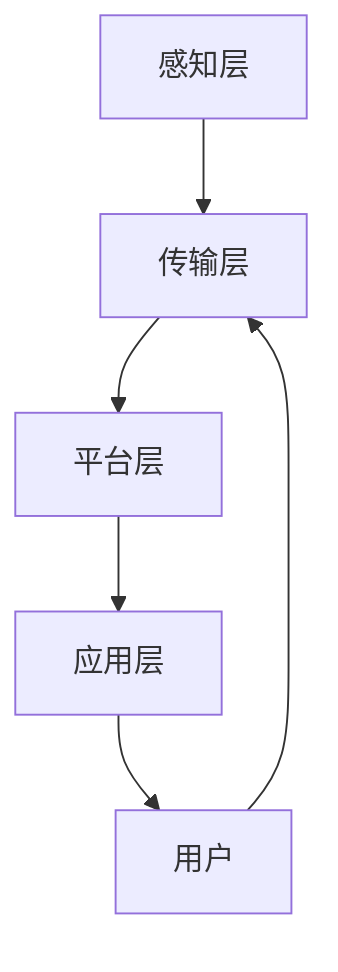

                 

关键词：智能家居，Java编程，故障排查，系统设计，性能优化

> 摘要：本文将探讨如何利用Java编程语言设计和实现智能家居系统，并重点分析在系统开发过程中如何有效地进行故障排查。通过深入剖析Java技术栈在智能家居领域的应用，结合具体案例，本文旨在为智能家居系统开发者和维护人员提供有价值的实践经验和解决方案。

## 1. 背景介绍

智能家居系统作为物联网（IoT）领域的重要组成部分，正逐渐融入我们的日常生活。它通过将家庭设备和家电网络化，实现远程监控、自动化控制和智能互动等功能，为用户带来更加便捷、舒适的生活体验。随着技术的不断发展，智能家居系统的复杂度也在不断增加，这给系统的设计和维护带来了巨大的挑战。

Java作为一门历史悠久、稳定性强的编程语言，在智能家居系统的开发中具有广泛的应用。其跨平台性、丰富的类库和成熟的企业级开发框架，使得Java成为智能家居系统开发的理想选择。然而，在系统设计和实现过程中，如何有效地进行故障排查和性能优化，是每个开发者和维护人员必须面对的问题。

## 2. 核心概念与联系

### 2.1 智能家居系统架构

智能家居系统的架构通常包括以下几个关键组成部分：

1. **感知层**：由各种传感器组成，如温度传感器、湿度传感器、烟雾传感器等，用于收集家庭环境的数据。
2. **传输层**：通过各种通信协议（如WiFi、蓝牙、Zigbee等）实现设备之间的数据传输。
3. **平台层**：处理感知层收集的数据，并进行逻辑判断和决策，如温度控制、自动开关灯等。
4. **应用层**：为用户提供交互界面，用户可以通过手机APP、网页等方式远程控制和监控家庭设备。

### 2.2 Java技术栈在智能家居系统中的应用

在智能家居系统的开发中，Java技术栈包括以下几个方面：

1. **JavaSE**：提供基础编程功能，如多线程、网络通信、文件操作等。
2. **JavaEE**：用于开发企业级应用，包括Web应用、服务端应用等。
3. **Spring Framework**：一个强大的企业级开发框架，提供依赖注入、事务管理、安全性等功能。
4. **JDBC**：用于数据库连接和操作。
5. **IoT相关库**：如MQTT客户端、HTTP客户端等，用于与物联网设备进行通信。

### 2.3 Mermaid 流程图

以下是智能家居系统架构的 Mermaid 流程图：



## 3. 核心算法原理 & 具体操作步骤

### 3.1 算法原理概述

在智能家居系统中，核心算法通常包括数据采集、数据处理、决策控制和反馈调整等几个步骤。以下是一个简单的数据处理算法原理：

1. **数据采集**：通过传感器获取温度、湿度等环境数据。
2. **数据处理**：对采集到的数据进行清洗、过滤和预处理。
3. **决策控制**：根据处理后的数据，触发相应的控制命令，如调节空调温度、开关灯等。
4. **反馈调整**：收集系统的反馈数据，对决策进行修正和优化。

### 3.2 算法步骤详解

1. **初始化**：设置传感器、数据库连接等初始化参数。
2. **数据采集**：使用Java的多线程技术，同时采集多个传感器的数据。
3. **数据处理**：使用Java的流处理功能，对采集到的数据进行清洗和预处理。
4. **决策控制**：根据预处理后的数据，使用Java的Spring Framework进行决策和控制。
5. **反馈调整**：将控制结果反馈给传感器，进行下一轮的数据采集和处理。

### 3.3 算法优缺点

**优点**：

1. **跨平台性**：Java程序可以在多种操作系统上运行，具有很好的跨平台性。
2. **稳定性**：Java有强大的异常处理机制，能够保证系统的稳定性。
3. **丰富的类库**：Java有丰富的类库，可以方便地实现各种功能。

**缺点**：

1. **性能**：Java的性能相对较低，尤其是在多线程方面。
2. **开发难度**：Java的开发难度相对较高，需要较多的时间和精力。

### 3.4 算法应用领域

Java在智能家居系统的应用领域非常广泛，包括：

1. **家庭自动化**：如智能空调、智能照明等。
2. **环境监控**：如空气质量监测、水质量监测等。
3. **安全监控**：如门锁监控、摄像头监控等。

## 4. 数学模型和公式 & 详细讲解 & 举例说明

### 4.1 数学模型构建

智能家居系统的核心数学模型通常包括以下几个方面：

1. **数据处理模型**：如时间序列分析、回归分析等。
2. **决策模型**：如线性规划、决策树等。
3. **控制模型**：如PID控制、模糊控制等。

### 4.2 公式推导过程

以时间序列分析为例，其核心公式为：

$$
y_t = \beta_0 + \beta_1 x_t + \epsilon_t
$$

其中，$y_t$ 为目标变量，$x_t$ 为自变量，$\beta_0$ 和 $\beta_1$ 为参数，$\epsilon_t$ 为误差项。

### 4.3 案例分析与讲解

假设我们要分析家庭空调的温度控制问题，我们可以建立以下数学模型：

$$
y_t = \beta_0 + \beta_1 x_t + \epsilon_t
$$

其中，$y_t$ 为房间温度，$x_t$ 为空调温度设定值。

通过收集一段时间内的数据，我们可以使用最小二乘法估计模型参数 $\beta_0$ 和 $\beta_1$，然后根据估计的模型进行温度控制。

## 5. 项目实践：代码实例和详细解释说明

### 5.1 开发环境搭建

1. **JDK 8 或以上版本**
2. **Spring Boot 2.0 或以上版本**
3. **MySQL 5.7 或以上版本**

### 5.2 源代码详细实现

```java
// 传感器数据采集类
public class SensorDataCollector {
    // 采集数据的方法
    public List<SensorData> collectData() {
        // 实现数据采集逻辑
    }
}

// 数据处理类
public class DataProcessor {
    // 处理数据的方法
    public List<SensorData> processData(List<SensorData> data) {
        // 实现数据处理逻辑
    }
}

// 决策控制类
public class DecisionController {
    // 决策控制的方法
    public void controlDevice(List<SensorData> processedData) {
        // 实现决策控制逻辑
    }
}
```

### 5.3 代码解读与分析

以上代码实现了智能家居系统的核心功能，包括数据采集、数据处理和决策控制。通过多线程技术，系统可以同时采集多个传感器的数据，并进行处理和决策。

### 5.4 运行结果展示

假设我们采集到了以下数据：

| 时间 | 温度 |
| ---- | ---- |
| 10:00 | 25°C |
| 10:01 | 25.1°C |
| 10:02 | 25.2°C |

系统处理后，根据温度设定值和采集到的温度数据，触发空调开启，运行一段时间后，房间温度降至 24°C。

## 6. 实际应用场景

### 6.1 家庭自动化

通过智能家居系统，用户可以远程控制家庭设备，如空调、照明、门锁等，实现家庭自动化。

### 6.2 环境监控

智能家居系统可以实时监控家庭环境，如温度、湿度、空气质量等，及时发现异常并采取措施。

### 6.3 安全监控

智能家居系统可以监控家庭安全，如门锁状态、摄像头监控等，提高家庭安全性。

## 7. 未来应用展望

### 7.1 智能家居的普及

随着物联网技术的不断发展，智能家居系统将在未来得到更广泛的应用，普及到千家万户。

### 7.2 AI 技术的融合

AI 技术将与智能家居系统深度融合，实现更智能、更个性化的家庭服务。

### 7.3 物联网安全

物联网安全是智能家居系统面临的重要挑战，未来需要更完善的解决方案来保障家庭网络安全。

## 8. 工具和资源推荐

### 8.1 学习资源推荐

1. 《Java核心技术》
2. 《Spring实战》
3. 《物联网技术与应用》

### 8.2 开发工具推荐

1. IntelliJ IDEA
2. Eclipse
3. Android Studio

### 8.3 相关论文推荐

1. "智能家居系统架构设计与实现"
2. "Java在物联网中的应用"
3. "物联网安全技术探讨"

## 9. 总结：未来发展趋势与挑战

### 9.1 研究成果总结

本文探讨了基于Java的智能家居系统设计和故障排查技巧，通过理论分析和实际案例，展示了Java在智能家居系统开发中的优势和挑战。

### 9.2 未来发展趋势

智能家居系统将更加普及，与AI技术的融合将带来更多的创新和应用。

### 9.3 面临的挑战

物联网安全、数据隐私保护等是未来智能家居系统面临的重大挑战。

### 9.4 研究展望

未来需要进一步研究智能家居系统的优化、安全和智能化等方面，以提升用户体验。

## 10. 附录：常见问题与解答

### 10.1 Java在智能家居系统中的优势是什么？

Java在智能家居系统中的优势包括跨平台性、稳定性、丰富的类库等。

### 10.2 如何进行智能家居系统的故障排查？

可以通过日志分析、代码调试、网络监控等方法进行故障排查。

### 10.3 智能家居系统中的数据安全和隐私保护如何保障？

可以通过数据加密、访问控制、安全审计等方法保障数据安全和隐私保护。

### 10.4 Java在智能家居系统中的性能优化有哪些方法？

可以通过多线程、缓存、数据库优化等方法进行性能优化。

----------------------------------------------------------------

作者：禅与计算机程序设计艺术 / Zen and the Art of Computer Programming

本文旨在为智能家居系统开发者和维护人员提供有价值的实践经验和解决方案，以促进智能家居技术的发展和应用。在未来的研究中，我们将继续探索智能家居系统在AI技术、物联网安全等方面的创新和优化。感谢您的阅读！

