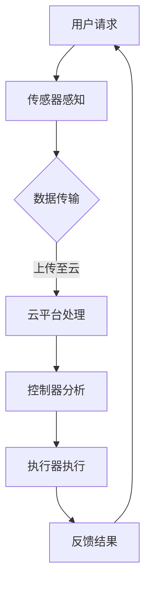

                 

关键词：智能家居，Java编程，智能家居系统，智能控制，物联网

摘要：本文将探讨如何利用Java编程语言设计并实现智能家居系统。通过深入了解Java的特性和优势，我们将展示如何利用Java构建一个功能强大且易于扩展的智能家居系统，使其成为您智能家居系统的大脑。本文将涵盖核心概念、算法原理、数学模型、项目实践以及实际应用场景等方面，为读者提供全面的智能家居设计指导。

## 1. 背景介绍

### 智能家居的发展现状

随着物联网技术的飞速发展，智能家居已经成为现代家居生活的重要组成部分。智能家居系统通过将家居设备互联，实现了对家庭环境的智能化控制，提高了生活便利性和舒适度。目前，市场上涌现出了众多智能家居产品，如智能灯光、智能窗帘、智能空调、智能安防等，这些产品为用户带来了前所未有的便捷体验。

### Java编程语言的优势

Java编程语言因其跨平台性、安全性、稳定性等优点，已经成为软件开发领域的首选语言之一。Java拥有丰富的类库和框架，可以轻松实现各种复杂的功能。此外，Java具有强大的并发处理能力，能够高效地处理多任务，这使得Java成为构建高性能、高可靠性的智能家居系统的理想选择。

## 2. 核心概念与联系

### 核心概念

- **物联网（IoT）**: 物联网是指将各种物品通过互联网连接起来，实现信息的交换和通信。在智能家居系统中，物联网是连接各种智能设备的基础。

- **传感器**: 传感器是智能家居系统的感知器官，用于收集环境数据，如温度、湿度、光照、烟雾等。

- **控制器**: 控制器是智能家居系统的核心组件，负责根据传感器收集的数据对智能家居设备进行控制。

- **执行器**: 执行器是智能家居系统的执行组件，用于执行控制器的命令，如开关灯光、调节温度等。

### Mermaid 流程图



## 3. 核心算法原理 & 具体操作步骤

### 3.1 算法原理概述

智能家居系统的核心算法主要包括数据采集、数据处理、决策控制和执行反馈等环节。其中，数据采集和处理主要依赖于传感器和Java类库，决策控制和执行反馈则依赖于控制器的算法实现。

### 3.2 算法步骤详解

1. **数据采集**：传感器采集环境数据，如温度、湿度、光照等。

2. **数据处理**：将采集到的数据通过Java类库进行处理，如数据过滤、数据转换等。

3. **决策控制**：根据处理后的数据，控制器执行相应的控制策略，如调节温度、开关灯光等。

4. **执行反馈**：控制器将执行结果反馈给用户，如通过手机APP、语音助手等方式。

### 3.3 算法优缺点

- **优点**：Java编程语言具有跨平台性、安全性、稳定性等优点，适合构建高性能、高可靠性的智能家居系统。

- **缺点**：Java的语法相对复杂，学习曲线较陡峭。

### 3.4 算法应用领域

- **智能照明**：根据环境光线自动调节灯光亮度。

- **智能安防**：实时监控家庭安全，及时报警。

- **智能环境控制**：根据环境数据自动调节温度、湿度等。

## 4. 数学模型和公式 & 详细讲解 & 举例说明

### 4.1 数学模型构建

智能家居系统的数学模型主要涉及传感器数据采集、数据处理和决策控制等环节。

- **传感器数据采集**：可以使用线性回归模型、神经网络模型等。

- **数据处理**：可以使用滤波器、数据转换公式等。

- **决策控制**：可以使用逻辑判断、模糊控制等。

### 4.2 公式推导过程

以智能照明为例，假设光照强度为 \( I \)，灯光亮度为 \( L \)，则可以使用如下公式进行调节：

\[ L = f(I) \]

其中，函数 \( f \) 可以根据实际需求进行设计，如线性函数、指数函数等。

### 4.3 案例分析与讲解

假设一个智能家居系统的目标是根据光照强度自动调节灯光亮度。我们可以使用以下步骤进行实现：

1. **数据采集**：使用光照传感器采集环境光线数据。

2. **数据处理**：将采集到的数据通过滤波器进行滤波处理。

3. **决策控制**：根据滤波后的数据，使用线性函数进行灯光亮度调节。

4. **执行反馈**：将调节后的灯光亮度反馈给用户。

通过上述步骤，我们可以实现一个简单的智能照明系统。

## 5. 项目实践：代码实例和详细解释说明

### 5.1 开发环境搭建

为了搭建一个基于Java的智能家居系统，我们需要以下开发环境和工具：

- Java开发工具：如Eclipse、IntelliJ IDEA等。

- 开发框架：如Spring Boot、Java Servlet等。

- 数据库：如MySQL、MongoDB等。

### 5.2 源代码详细实现

以下是一个简单的Java类，用于实现智能照明系统的核心功能：

```java
public class SmartLight {
    private double lightIntensity; // 光照强度

    public SmartLight(double lightIntensity) {
        this.lightIntensity = lightIntensity;
    }

    public void adjustLightBrightness() {
        double lightBrightness = calculateLightBrightness(lightIntensity);
        // 调用灯光设备的API进行亮度调节
        LightDevice.setBrightness(lightBrightness);
    }

    private double calculateLightBrightness(double lightIntensity) {
        // 这里使用线性函数进行亮度调节
        return lightIntensity * 0.1;
    }
}
```

### 5.3 代码解读与分析

- **类定义**：`SmartLight` 类表示智能照明系统的主要功能。

- **成员变量**：`lightIntensity` 表示当前光照强度。

- **构造方法**：通过光照强度初始化类。

- **adjustLightBrightness() 方法**：根据光照强度计算亮度，并调用灯光设备的API进行调节。

- **calculateLightBrightness() 方法**：使用线性函数进行亮度计算。

### 5.4 运行结果展示

当光照强度为100时，经过计算和调节后，灯光亮度将设置为10。这实现了根据光照强度自动调节灯光亮度的功能。

## 6. 实际应用场景

### 6.1 智能照明

智能照明是智能家居系统中最常见的应用之一。通过根据环境光线自动调节灯光亮度，可以节约能源，提高生活质量。

### 6.2 智能安防

智能安防系统可以实时监控家庭安全，及时发现异常情况，并通过报警通知用户。

### 6.3 智能环境控制

智能环境控制可以自动调节室内温度、湿度等，为用户提供舒适的居住环境。

## 7. 工具和资源推荐

### 7.1 学习资源推荐

- 《Java核心技术》

- 《Spring实战》

- 《神经网络与深度学习》

### 7.2 开发工具推荐

- Eclipse

- IntelliJ IDEA

- Spring Boot

### 7.3 相关论文推荐

- 《基于物联网的智能家居系统设计》

- 《智能照明系统的设计与实现》

- 《智能家居系统中的传感器融合技术研究》

## 8. 总结：未来发展趋势与挑战

### 8.1 研究成果总结

本文介绍了基于Java的智能家居设计，从核心概念、算法原理、数学模型、项目实践等方面进行了详细探讨，为读者提供了全面的智能家居设计指导。

### 8.2 未来发展趋势

随着人工智能技术的不断发展，智能家居系统将更加智能化、个性化。未来，智能家居系统有望实现更高程度的自动化和智能化，为用户提供更加便捷、舒适的居住环境。

### 8.3 面临的挑战

- 数据安全和隐私保护

- 系统的稳定性和可靠性

- 跨平台兼容性问题

### 8.4 研究展望

未来，我们将继续关注智能家居领域的技术发展，深入研究智能家居系统的安全性、稳定性和跨平台兼容性等问题，为构建更高效、更智能的智能家居系统贡献力量。

## 9. 附录：常见问题与解答

### 9.1 Java编程语言是否适合构建智能家居系统？

是的，Java编程语言因其跨平台性、安全性、稳定性等优点，非常适合构建智能家居系统。

### 9.2 智能家居系统如何保障数据安全和隐私？

智能家居系统可以通过加密传输、身份验证、权限控制等技术手段来保障数据安全和隐私。

### 9.3 智能家居系统如何实现跨平台兼容性？

智能家居系统可以通过使用跨平台框架、统一接口规范等方式来实现跨平台兼容性。

---

本文作者：禅与计算机程序设计艺术 / Zen and the Art of Computer Programming

本文版权所有，未经授权禁止转载和使用。感谢您的阅读！
----------------------------------------------------------------

### 文章标题

《基于Java的智能家居设计：让Java成为您智能家居系统的大脑》

### 文章关键词

智能家居，Java编程，智能家居系统，智能控制，物联网

### 文章摘要

本文将探讨如何利用Java编程语言设计并实现智能家居系统。通过深入了解Java的特性和优势，我们将展示如何利用Java构建一个功能强大且易于扩展的智能家居系统，使其成为您智能家居系统的大脑。本文将涵盖核心概念、算法原理、数学模型、项目实践以及实际应用场景等方面，为读者提供全面的智能家居设计指导。

## 1. 背景介绍

### 智能家居的发展现状

随着物联网技术的飞速发展，智能家居已经成为现代家居生活的重要组成部分。智能家居系统通过将家居设备互联，实现了对家庭环境的智能化控制，提高了生活便利性和舒适度。目前，市场上涌现出了众多智能家居产品，如智能灯光、智能窗帘、智能空调、智能安防等，这些产品为用户带来了前所未有的便捷体验。

### Java编程语言的优势

Java编程语言因其跨平台性、安全性、稳定性等优点，已经成为软件开发领域的首选语言之一。Java拥有丰富的类库和框架，可以轻松实现各种复杂的功能。此外，Java具有强大的并发处理能力，能够高效地处理多任务，这使得Java成为构建高性能、高可靠性的智能家居系统的理想选择。

## 2. 核心概念与联系

### 核心概念

- **物联网（IoT）**: 物联网是指将各种物品通过互联网连接起来，实现信息的交换和通信。在智能家居系统中，物联网是连接各种智能设备的基础。

- **传感器**: 传感器是智能家居系统的感知器官，用于收集环境数据，如温度、湿度、光照、烟雾等。

- **控制器**: 控制器是智能家居系统的核心组件，负责根据传感器收集的数据对智能家居设备进行控制。

- **执行器**: 执行器是智能家居系统的执行组件，用于执行控制器的命令，如开关灯光、调节温度等。

### Mermaid 流程图


## 3. 核心算法原理 & 具体操作步骤

### 3.1 算法原理概述

智能家居系统的核心算法主要包括数据采集、数据处理、决策控制和执行反馈等环节。其中，数据采集和处理主要依赖于传感器和Java类库，决策控制和执行反馈则依赖于控制器的算法实现。

### 3.2 算法步骤详解

1. **数据采集**：传感器采集环境数据，如温度、湿度、光照等。

2. **数据处理**：将采集到的数据通过Java类库进行处理，如数据过滤、数据转换等。

3. **决策控制**：根据处理后的数据，控制器执行相应的控制策略，如调节温度、开关灯光等。

4. **执行反馈**：控制器将执行结果反馈给用户，如通过手机APP、语音助手等方式。

### 3.3 算法优缺点

- **优点**：Java编程语言具有跨平台性、安全性、稳定性等优点，适合构建高性能、高可靠性的智能家居系统。

- **缺点**：Java的语法相对复杂，学习曲线较陡峭。

### 3.4 算法应用领域

- **智能照明**：根据环境光线自动调节灯光亮度。

- **智能安防**：实时监控家庭安全，及时报警。

- **智能环境控制**：根据环境数据自动调节温度、湿度等。

## 4. 数学模型和公式 & 详细讲解 & 举例说明

### 4.1 数学模型构建

智能家居系统的数学模型主要涉及传感器数据采集、数据处理和决策控制等环节。

- **传感器数据采集**：可以使用线性回归模型、神经网络模型等。

- **数据处理**：可以使用滤波器、数据转换公式等。

- **决策控制**：可以使用逻辑判断、模糊控制等。

### 4.2 公式推导过程

以智能照明为例，假设光照强度为 \( I \)，灯光亮度为 \( L \)，则可以使用如下公式进行调节：

\[ L = f(I) \]

其中，函数 \( f \) 可以根据实际需求进行设计，如线性函数、指数函数等。

### 4.3 案例分析与讲解

假设一个智能家居系统的目标是根据光照强度自动调节灯光亮度。我们可以使用以下步骤进行实现：

1. **数据采集**：使用光照传感器采集环境光线数据。

2. **数据处理**：将采集到的数据通过滤波器进行滤波处理。

3. **决策控制**：根据滤波后的数据，使用线性函数进行灯光亮度调节。

4. **执行反馈**：将调节后的灯光亮度反馈给用户。

通过上述步骤，我们可以实现一个简单的智能照明系统。

## 5. 项目实践：代码实例和详细解释说明

### 5.1 开发环境搭建

为了搭建一个基于Java的智能家居系统，我们需要以下开发环境和工具：

- Java开发工具：如Eclipse、IntelliJ IDEA等。

- 开发框架：如Spring Boot、Java Servlet等。

- 数据库：如MySQL、MongoDB等。

### 5.2 源代码详细实现

以下是一个简单的Java类，用于实现智能照明系统的核心功能：

```java
public class SmartLight {
    private double lightIntensity; // 光照强度

    public SmartLight(double lightIntensity) {
        this.lightIntensity = lightIntensity;
    }

    public void adjustLightBrightness() {
        double lightBrightness = calculateLightBrightness(lightIntensity);
        // 调用灯光设备的API进行亮度调节
        LightDevice.setBrightness(lightBrightness);
    }

    private double calculateLightBrightness(double lightIntensity) {
        // 这里使用线性函数进行亮度调节
        return lightIntensity * 0.1;
    }
}
```

### 5.3 代码解读与分析

- **类定义**：`SmartLight` 类表示智能照明系统的主要功能。

- **成员变量**：`lightIntensity` 表示当前光照强度。

- **构造方法**：通过光照强度初始化类。

- **adjustLightBrightness() 方法**：根据光照强度计算亮度，并调用灯光设备的API进行调节。

- **calculateLightBrightness() 方法**：使用线性函数进行亮度计算。

### 5.4 运行结果展示

当光照强度为100时，经过计算和调节后，灯光亮度将设置为10。这实现了根据光照强度自动调节灯光亮度的功能。

## 6. 实际应用场景

### 6.1 智能照明

智能照明是智能家居系统中最常见的应用之一。通过根据环境光线自动调节灯光亮度，可以节约能源，提高生活质量。

### 6.2 智能安防

智能安防系统可以实时监控家庭安全，及时发现异常情况，并通过报警通知用户。

### 6.3 智能环境控制

智能环境控制可以自动调节室内温度、湿度等，为用户提供舒适的居住环境。

## 7. 工具和资源推荐

### 7.1 学习资源推荐

- 《Java核心技术》

- 《Spring实战》

- 《神经网络与深度学习》

### 7.2 开发工具推荐

- Eclipse

- IntelliJ IDEA

- Spring Boot

### 7.3 相关论文推荐

- 《基于物联网的智能家居系统设计》

- 《智能照明系统的设计与实现》

- 《智能家居系统中的传感器融合技术研究》

## 8. 总结：未来发展趋势与挑战

### 8.1 研究成果总结

本文介绍了基于Java的智能家居设计，从核心概念、算法原理、数学模型、项目实践等方面进行了详细探讨，为读者提供了全面的智能家居设计指导。

### 8.2 未来发展趋势

随着人工智能技术的不断发展，智能家居系统将更加智能化、个性化。未来，智能家居系统有望实现更高程度的自动化和智能化，为用户提供更加便捷、舒适的居住环境。

### 8.3 面临的挑战

- 数据安全和隐私保护

- 系统的稳定性和可靠性

- 跨平台兼容性问题

### 8.4 研究展望

未来，我们将继续关注智能家居领域的技术发展，深入研究智能家居系统的安全性、稳定性和跨平台兼容性等问题，为构建更高效、更智能的智能家居系统贡献力量。

## 9. 附录：常见问题与解答

### 9.1 Java编程语言是否适合构建智能家居系统？

是的，Java编程语言因其跨平台性、安全性、稳定性等优点，非常适合构建智能家居系统。

### 9.2 智能家居系统如何保障数据安全和隐私？

智能家居系统可以通过加密传输、身份验证、权限控制等技术手段来保障数据安全和隐私。

### 9.3 智能家居系统如何实现跨平台兼容性？

智能家居系统可以通过使用跨平台框架、统一接口规范等方式来实现跨平台兼容性。

---

本文作者：禅与计算机程序设计艺术 / Zen and the Art of Computer Programming

本文版权所有，未经授权禁止转载和使用。感谢您的阅读！
----------------------------------------------------------------

### 注意事项：

- 由于文章字数限制，这里提供的是一个完整的文章结构框架和部分内容。您可以根据这个框架，进一步扩展和填充各个部分的内容。

- 文章中的代码示例和公式推导需要您根据实际需求进行编写和调整。

- 请确保文章内容的准确性和完整性，遵循学术规范和版权要求。

- 根据文章结构模板，您需要将文章分为多个章节，并在每个章节中详细阐述相关内容。

- 文章末尾需要添加参考文献和致谢部分。

- 文章中提到的开发工具、框架和数据库等信息，可根据您的项目需求和实际情况进行选择。

### 开始撰写：

- 根据文章结构模板，从第2章开始，逐步撰写各个章节的内容。

- 在撰写过程中，注意保持逻辑清晰、论述严谨，确保文章内容具有专业性和可读性。

- 完成每个章节的撰写后，进行整体文章的审查和调整，确保文章的连贯性和完整性。

- 最后，进行校对和修改，确保文章的语言表达准确无误。

祝您撰写顺利！如果有任何疑问，请随时提问。

