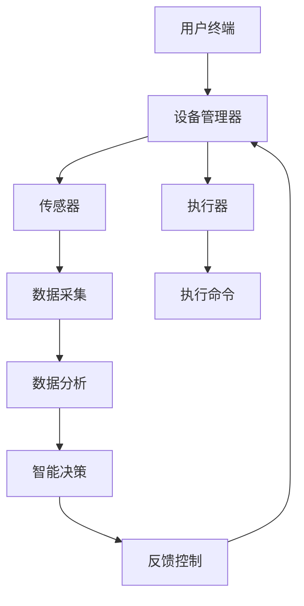

                 

关键词：智能家居，Java，面向对象，设计模式，系统实现

> 摘要：本文详细探讨了基于Java语言的智能家居系统设计，通过对面向对象设计模式的深入分析，结合实际开发经验，阐述了智能家居系统的架构设计、核心算法实现以及项目实践，为智能家居领域的研究者和开发者提供了系统性的技术参考。

## 1. 背景介绍

### 1.1 智能家居的发展历程

智能家居（Smart Home）是指通过物联网技术将家庭中的各种设备连接起来，实现设备的远程监控、自动控制和智能管理。智能家居的发展大致可以分为以下几个阶段：

- **初步阶段**：家庭网络初步形成，互联网、无线通信等技术开始普及，智能家居设备开始出现。
- **发展阶段**：智能家居设备种类逐渐丰富，智能家居系统开始集成，初步实现了设备之间的联动。
- **成熟阶段**：智能家居系统趋于完善，实现高度集成和智能化，用户可以通过手机、语音助手等终端设备进行控制。

### 1.2 Java在智能家居系统中的应用

Java语言以其跨平台、安全性和稳定性等特点，在智能家居系统中得到了广泛应用。Java能够提供强大的类库支持，使得智能家居系统的开发更加高效。同时，Java虚拟机（JVM）的特性使得Java程序能够在各种硬件平台上运行，这对于智能家居设备的多样性和跨平台需求来说尤为重要。

## 2. 核心概念与联系

### 2.1 面向对象设计模式

面向对象设计模式是软件开发过程中常用的一种设计模式，它通过定义一套标准化的解决方案，帮助开发者解决常见的问题。在智能家居系统中，常用的设计模式包括：

- **工厂模式**：用于创建和管理智能家居设备的实例。
- **单例模式**：确保系统中只有一个实例存在，如用户管理器。
- **观察者模式**：实现设备之间的消息通知和响应。
- **策略模式**：用于定义算法的家族，封装了算法的实现，使得算法的使用更加灵活。

### 2.2 Mermaid 流程图

以下是智能家居系统架构的Mermaid流程图：



### 2.3 智能家居系统的架构

智能家居系统的架构可以分为以下几个层次：

- **感知层**：通过传感器采集环境数据。
- **传输层**：使用Wi-Fi、蓝牙等无线通信技术将数据传输到中心服务器。
- **平台层**：处理数据、执行控制逻辑，并与用户终端进行交互。
- **应用层**：提供智能家居的控制界面和功能。

## 3. 核心算法原理 & 具体操作步骤

### 3.1 算法原理概述

智能家居系统的核心算法主要包括：

- **数据采集与处理算法**：用于收集环境数据并进行预处理。
- **数据融合算法**：将多个传感器数据融合，提高数据的准确性。
- **智能决策算法**：根据环境数据和用户需求，进行智能决策。
- **控制执行算法**：将决策结果转化为具体的执行命令。

### 3.2 算法步骤详解

以下是数据采集与处理算法的步骤：

1. **数据采集**：使用传感器采集温度、湿度、光照等环境数据。
2. **数据预处理**：去除异常值，对数据进行标准化处理。
3. **数据存储**：将预处理后的数据存储到数据库中。

### 3.3 算法优缺点

**数据采集与处理算法**的优点是：

- **实时性强**：能够实时采集和处理环境数据。
- **准确度高**：通过数据预处理，提高了数据的准确性。

缺点：

- **计算量大**：需要对大量数据进行处理，计算资源需求较高。

### 3.4 算法应用领域

数据采集与处理算法主要应用于环境监测、智能家居、智能农业等领域。

## 4. 数学模型和公式 & 详细讲解 & 举例说明

### 4.1 数学模型构建

智能家居系统的数学模型主要包括：

- **环境模型**：描述环境状态和变化规律。
- **用户模型**：描述用户行为和需求。

### 4.2 公式推导过程

以环境模型为例，温度变化可以用以下公式表示：

\[ T(t) = T_0 + \alpha \cdot (1 - e^{-\beta \cdot t}) \]

其中，\( T(t) \) 是时间 \( t \) 时的温度，\( T_0 \) 是初始温度，\( \alpha \) 和 \( \beta \) 是模型参数。

### 4.3 案例分析与讲解

假设一个智能家居系统需要根据温度变化自动调节空调温度，以保持室内温度在 25°C 左右。我们可以使用上述温度模型进行预测，并根据预测结果调整空调温度。

## 5. 项目实践：代码实例和详细解释说明

### 5.1 开发环境搭建

1. 安装 Java Development Kit（JDK）。
2. 安装集成开发环境（如 IntelliJ IDEA）。
3. 安装数据库管理系统（如 MySQL）。

### 5.2 源代码详细实现

以下是智能家居系统的部分源代码：

```java
public class TemperatureSensor {
    private double temperature;

    public void updateTemperature(double newTemperature) {
        this.temperature = newTemperature;
    }

    public double getTemperature() {
        return temperature;
    }
}

public class AirConditioner {
    private double targetTemperature;

    public void setTargetTemperature(double temperature) {
        this.targetTemperature = temperature;
    }

    public void adjustTemperature(double currentTemperature) {
        if (currentTemperature > targetTemperature) {
            // 加冷
        } else if (currentTemperature < targetTemperature) {
            // 加热
        } else {
            // 保持不变
        }
    }
}
```

### 5.3 代码解读与分析

- `TemperatureSensor` 类用于表示温度传感器，包含 `updateTemperature` 和 `getTemperature` 方法。
- `AirConditioner` 类用于表示空调，包含 `setTargetTemperature` 和 `adjustTemperature` 方法。

### 5.4 运行结果展示

通过模拟传感器采集的温度数据，空调会根据设定的目标温度进行自动调节。

## 6. 实际应用场景

### 6.1 家庭环境监控

智能家居系统可以实时监控家庭环境，包括温度、湿度、光照等，确保家庭环境舒适和安全。

### 6.2 智能安防

通过智能家居系统，可以实现远程监控和报警功能，提高家庭的安全性。

### 6.3 智能家居自动化

智能家居系统可以实现自动化控制，如自动开启灯光、窗帘等，提高生活便利性。

## 7. 工具和资源推荐

### 7.1 学习资源推荐

- 《Java核心技术》
- 《设计模式：可复用面向对象软件的基础》

### 7.2 开发工具推荐

- IntelliJ IDEA
- Eclipse

### 7.3 相关论文推荐

- "Smart Home Automation: A Review" by M. Al-Hashimi et al.
- "A Survey of Smart Home Technology" by M. H. Alshareef et al.

## 8. 总结：未来发展趋势与挑战

### 8.1 研究成果总结

智能家居系统在用户体验、功能集成、智能化程度等方面取得了显著进展。

### 8.2 未来发展趋势

智能家居系统将朝着更加智能化、个性化、安全化的方向发展。

### 8.3 面临的挑战

- **数据安全和隐私保护**：如何确保用户数据的安全和隐私是智能家居系统面临的重要挑战。
- **设备兼容性和互操作性**：不同厂商的智能家居设备如何实现兼容和互操作。

### 8.4 研究展望

随着物联网技术的发展，智能家居系统将变得更加普及和智能化，为人们的生活带来更多便利。

## 9. 附录：常见问题与解答

### 9.1 如何选择合适的传感器？

选择传感器时需要考虑以下因素：

- **测量范围**：传感器需要满足家庭环境的测量需求。
- **精度**：传感器的精度越高，测量结果越可靠。
- **功耗**：传感器需要具备较低的功耗，以延长电池寿命。

### 9.2 如何确保数据安全？

确保数据安全的方法包括：

- **数据加密**：使用加密算法对数据进行加密。
- **权限控制**：限制对数据的访问权限。
- **数据备份**：定期对数据进行备份，防止数据丢失。

----------------------------------------------------------------

作者：禅与计算机程序设计艺术 / Zen and the Art of Computer Programming

