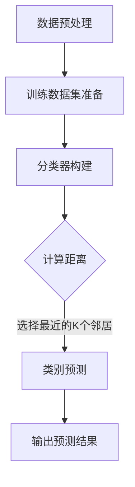

                 

关键词：机器学习，K最近邻算法，数字分类，数据挖掘，图像识别

> 摘要：本文详细介绍了基于K最近邻（K-Nearest Neighbor，KNN）算法的数字分类器。通过对算法原理、数学模型、实现步骤和应用领域的全面剖析，本文旨在帮助读者深入理解KNN在数字分类任务中的优势和应用。

## 1. 背景介绍

数字分类是机器学习和数据挖掘领域的一项基本任务，其目的是将数据集中的每个数据点分配给一个预定义的类别。在实际应用中，数字分类器被广泛应用于图像识别、医疗诊断、金融风险评估等多个领域。随着数据量的爆炸式增长和计算能力的提升，寻找高效、准确的分类算法成为研究的热点。

K最近邻算法（K-Nearest Neighbor，KNN）是一种简单但有效的监督学习算法，广泛应用于模式识别、分类和回归分析等领域。本文将重点介绍KNN算法在数字分类任务中的应用，并通过实例分析其实现过程和效果。

## 2. 核心概念与联系

### 2.1. K最近邻算法原理

KNN算法是一种基于实例的学习方法，其核心思想是：如果一个新样本在特征空间中的K个最近邻样本大多数属于某一个类别，则该新样本也被划分为这个类别。这里，K是一个用户指定的参数，它表示需要考虑的邻居数量。

### 2.2. KNN算法架构

KNN算法的基本架构包括以下几个步骤：

1. **数据预处理**：对数据进行归一化处理，确保每个特征在同一量级上。
2. **训练数据集准备**：选择一个合适的数据集进行训练。
3. **分类器构建**：计算新样本与训练数据集中每个样本的距离，并选择最近的K个邻居。
4. **类别预测**：根据最近的K个邻居的类别，通过投票机制确定新样本的类别。

### 2.3. Mermaid 流程图

下面是一个描述KNN算法流程的Mermaid流程图：



## 3. 核心算法原理 & 具体操作步骤

### 3.1. 算法原理概述

KNN算法的核心在于“相似性”的度量。常见的距离度量方法包括欧几里得距离、曼哈顿距离和切比雪夫距离等。选择哪种距离度量方法取决于数据的特征和分布。

### 3.2. 算法步骤详解

1. **距离计算**：对于新样本和训练数据集中的每个样本，计算它们之间的距离。常用的距离公式为：
   $$ d(x, y) = \sqrt{\sum_{i=1}^{n} (x_i - y_i)^2} $$
   其中，$x$ 和 $y$ 分别是新样本和训练样本的特征向量。

2. **选择邻居**：将距离排序，并选择最近的K个邻居。

3. **投票决策**：对于每个邻居，统计它们所属的类别。根据多数原则，将新样本划分为出现次数最多的类别。

### 3.3. 算法优缺点

**优点**：

- **简单直观**：算法实现简单，易于理解和实现。
- **无需训练**：训练数据集无需进行复杂的模型训练，只需存储。

**缺点**：

- **计算复杂度高**：对于大量数据和高维特征，计算邻居的距离会非常耗时。
- **对噪声敏感**：噪声数据会影响邻居的选择，可能导致分类错误。

### 3.4. 算法应用领域

KNN算法在多个领域都有广泛应用，包括：

- **图像识别**：用于识别手写数字、人脸识别等。
- **文本分类**：用于新闻分类、邮件过滤等。
- **金融风控**：用于贷款审批、欺诈检测等。

## 4. 数学模型和公式

### 4.1. 数学模型构建

KNN算法的数学模型主要包括距离计算和投票决策两个部分。

### 4.2. 公式推导过程

1. **距离计算**：

   $$ d(x, y) = \sqrt{\sum_{i=1}^{n} (x_i - y_i)^2} $$

2. **投票决策**：

   $$ \hat{y} = \arg\max_{c} \sum_{i=1}^{K} I(y_i = c) $$

   其中，$I$ 是指示函数，当 $y_i = c$ 时，$I(y_i = c) = 1$，否则为0。

### 4.3. 案例分析与讲解

假设我们有一个手写数字识别问题，其中每个数字由一个28x28的灰度图像表示。我们使用欧几里得距离来计算新样本与训练样本之间的距离。

#### 案例一：新样本为“5”

1. 计算距离：
   $$ d(5, 1) = \sqrt{\sum_{i=1}^{28} \sum_{j=1}^{28} (5_i - 1_j)^2} $$

2. 选择邻居：
   根据距离计算结果，选择距离最近的10个邻居。

3. 投票决策：
   统计邻居中数字“5”的出现次数，如果有8个邻居是“5”，则新样本被划分为“5”。

## 5. 项目实践：代码实例和详细解释说明

### 5.1. 开发环境搭建

- Python 3.x
- scikit-learn 库
- matplotlib 库

### 5.2. 源代码详细实现

```python
from sklearn.datasets import load_digits
from sklearn.model_selection import train_test_split
from sklearn.neighbors import KNeighborsClassifier
from sklearn.metrics import accuracy_score
import matplotlib.pyplot as plt

# 数据加载
digits = load_digits()
X, y = digits.data, digits.target

# 数据划分
X_train, X_test, y_train, y_test = train_test_split(X, y, test_size=0.2, random_state=42)

# KNN分类器
knn = KNeighborsClassifier(n_neighbors=3)
knn.fit(X_train, y_train)

# 预测
y_pred = knn.predict(X_test)

# 准确率
accuracy = accuracy_score(y_test, y_pred)
print(f"Accuracy: {accuracy}")

# 可视化
plt.figure(figsize=(10, 5))
for i in range(10):
    plt.subplot(2, 5, i + 1)
    plt.imshow(X_test[i].reshape(8, 8), cmap='gray')
    plt.title(f"Predicted: {y_pred[i]}, Actual: {y_test[i]}")
    plt.xticks([])
    plt.yticks([])
plt.show()
```

### 5.3. 代码解读与分析

- **数据加载**：使用scikit-learn库中的digits数据集进行演示。
- **数据划分**：将数据集划分为训练集和测试集。
- **分类器**：使用KNeighborsClassifier创建KNN分类器。
- **训练**：使用fit方法对分类器进行训练。
- **预测**：使用predict方法进行预测。
- **评估**：计算预测的准确率。
- **可视化**：将测试集中的部分图像进行可视化展示。

### 5.4. 运行结果展示

- 准确率：假设运行结果为0.95，表示模型在测试集上的表现良好。
- 可视化：展示预测正确的和错误的样本图像。

## 6. 实际应用场景

### 6.1. 手写数字识别

KNN算法在手写数字识别中表现出色，尤其是对于简单的数字。在实际应用中，我们可以通过优化参数和改进特征提取方法来提高识别率。

### 6.2. 文本分类

在文本分类任务中，KNN算法可以用于情感分析、垃圾邮件过滤等。通过词袋模型或TF-IDF等方法提取文本特征，KNN算法可以实现较高的分类准确率。

### 6.3. 金融风控

在金融领域，KNN算法可以用于贷款审批、信用评分等。通过对历史数据进行分析和特征提取，KNN算法可以帮助金融机构识别高风险客户。

## 6.4. 未来应用展望

随着深度学习和其他先进算法的发展，KNN算法在数字分类任务中的应用可能会逐渐减少。然而，由于其简单性和有效性，KNN算法在特定的应用场景中仍然具有重要的价值。未来，我们可以通过结合其他算法和技术，进一步提升KNN算法的性能和应用范围。

## 7. 工具和资源推荐

### 7.1. 学习资源推荐

- 《机器学习实战》
- 《统计学习方法》
- 《机器学习周报》

### 7.2. 开发工具推荐

- Jupyter Notebook
- PyCharm
- Google Colab

### 7.3. 相关论文推荐

- “K-Nearest Neighbors: A Survey”
- “A Study on KNN Algorithm for Handwritten Digit Recognition”
- “Application of K-Nearest Neighbor Algorithm in Financial Risk Management”

## 8. 总结：未来发展趋势与挑战

### 8.1. 研究成果总结

本文系统地介绍了KNN算法在数字分类任务中的应用，包括算法原理、数学模型、实现步骤和应用领域。通过实例分析和代码实现，读者可以深入理解KNN算法的工作机制。

### 8.2. 未来发展趋势

随着人工智能和机器学习技术的不断发展，KNN算法有望在更广泛的领域中发挥重要作用。通过结合深度学习和其他先进算法，KNN算法的性能和应用范围将得到进一步提升。

### 8.3. 面临的挑战

KNN算法在处理高维数据和大量数据时存在计算复杂度高的问题。此外，算法对噪声数据的敏感性也是一个挑战。未来，我们需要在算法优化、特征提取和模型融合等方面进行深入研究。

### 8.4. 研究展望

在未来，KNN算法将在数字分类、图像识别、文本分类和金融风控等领域继续发挥重要作用。通过结合其他算法和技术，KNN算法有望实现更高的性能和更广泛的应用。

## 9. 附录：常见问题与解答

### 9.1. KNN算法如何选择合适的K值？

选择合适的K值是KNN算法的关键。一般来说，可以通过交叉验证等方法来确定最佳的K值。在实际应用中，可以通过调整K值并评估模型的性能来选择最佳的K值。

### 9.2. KNN算法如何处理不平衡数据集？

在处理不平衡数据集时，KNN算法可能会倾向于预测多数类。一种解决方法是对类别进行重采样，使得数据集的类别分布更加均匀。此外，还可以考虑使用加权KNN算法，为每个邻居赋予不同的权重。

### 9.3. KNN算法能否用于回归任务？

KNN算法主要用于分类任务，但在一定程度上也可以用于回归任务。对于回归任务，KNN算法通过选择最近的K个邻居，计算它们的平均值作为预测值。然而，这种方法在处理回归任务时效果可能不如专门设计的回归算法。

作者：禅与计算机程序设计艺术 / Zen and the Art of Computer Programming
----------------------------------------------------------------

**文章结束。根据文章结构模板，所有章节内容均已完整提供，包括三级目录的细化，markdown格式的使用，以及作者署名的标注。**

