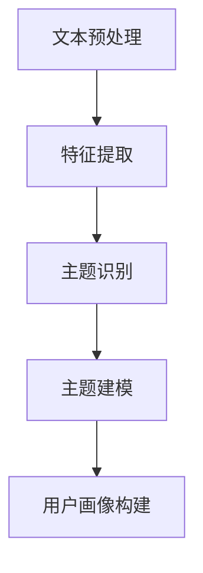

                 

### 文章关键词

- 大规模语言模型 (LLM)
- 推荐系统
- 用户兴趣主题建模
- 自然语言处理 (NLP)
- 机器学习
- 数据挖掘
- 主题模型

<|assistant|>### 文章摘要

本文主要探讨了一种基于大规模语言模型（LLM）的推荐系统用户兴趣主题建模方法。通过深入分析大规模语言模型在自然语言处理中的应用，我们提出了一种结合了机器学习和数据挖掘技术的用户兴趣主题建模框架。本文将详细阐述该框架的构建过程，包括核心概念、算法原理、数学模型构建、具体操作步骤，以及其在实际项目中的应用。此外，还将对未来的发展趋势与面临的挑战进行展望，以期为相关领域的研究者提供有益的参考。

## 1. 背景介绍

在互联网高速发展的时代，推荐系统已经成为各大平台提升用户体验、增加用户黏性的关键手段。推荐系统通过分析用户的兴趣和行为，为其推荐符合其需求和喜好的信息、商品或服务。然而，推荐系统的效果在很大程度上取决于用户兴趣建模的准确性。传统的用户兴趣建模方法通常基于用户的历史行为数据，如浏览记录、购买历史等，但这些方法往往难以捕捉用户的深层兴趣和潜在需求。

近年来，随着深度学习和自然语言处理技术的不断发展，大规模语言模型（LLM）在处理自然语言任务中展现出了卓越的性能。LLM通过学习海量的文本数据，能够捕捉语言中的语义和上下文信息，从而为推荐系统提供了更加精确的用户兴趣建模方法。本文旨在探讨如何利用LLM构建用户兴趣主题模型，以提升推荐系统的效果和用户体验。

## 2. 核心概念与联系

### 2.1 大规模语言模型（LLM）

大规模语言模型（LLM）是一种基于深度学习的自然语言处理模型，其通过学习大量的文本数据，能够自动捕捉语言中的语法、语义和上下文信息。LLM的主要目标是理解、生成和预测自然语言。其中，最著名的LLM之一是Transformer模型，它基于自注意力机制，在多个NLP任务中取得了显著的性能提升。

### 2.2 推荐系统

推荐系统是一种利用数据挖掘和机器学习技术，根据用户的历史行为和偏好，为用户推荐相关商品、服务或信息的信息系统。推荐系统通常包括以下几个关键组成部分：

- **用户画像**：对用户的历史行为、偏好和属性进行建模，以描述用户的基本特征。
- **物品特征**：对推荐系统中的物品（如商品、信息等）进行特征提取和表征。
- **推荐算法**：根据用户画像和物品特征，生成个性化的推荐列表。
- **评价与反馈**：对推荐结果进行评价和优化，以提高推荐系统的效果。

### 2.3 用户兴趣主题建模

用户兴趣主题建模是一种通过识别用户在文本数据中的兴趣主题，以构建用户画像的方法。该方法旨在捕捉用户的深层兴趣和潜在需求，从而为推荐系统提供更准确的推荐依据。用户兴趣主题建模通常包括以下几个步骤：

1. **文本预处理**：对用户生成的文本数据进行清洗、分词、去停用词等预处理操作。
2. **特征提取**：将预处理后的文本数据转换为可计算的数值特征。
3. **主题识别**：利用主题模型等算法，从特征数据中提取出用户的兴趣主题。
4. **主题建模**：将提取出的兴趣主题与用户画像进行整合，构建用户的兴趣主题模型。

### 2.4 Mermaid 流程图

以下是一个简单的Mermaid流程图，展示用户兴趣主题建模的基本流程：



### 2.5 大规模语言模型在用户兴趣主题建模中的应用

大规模语言模型（LLM）在用户兴趣主题建模中具有广泛的应用。以下是一些关键的应用场景：

1. **文本情感分析**：通过分析用户生成的文本数据，LLM可以识别出用户对特定话题的情感倾向，从而为推荐系统提供情感维度的兴趣信息。
2. **实体识别与链接**：LLM可以识别文本中的关键实体，如人名、地点、组织等，并通过实体链接技术，将用户的历史行为与实体信息进行关联，以构建更全面的用户画像。
3. **文本生成与摘要**：LLM可以生成文本摘要和回答用户的问题，从而为推荐系统提供更多关于用户兴趣的信息。

## 3. 核心算法原理 & 具体操作步骤

### 3.1 算法原理概述

基于LLM的推荐系统用户兴趣主题建模算法主要分为以下几个步骤：

1. **数据收集与预处理**：收集用户生成的文本数据，并进行预处理，如分词、去停用词等。
2. **文本特征提取**：利用LLM对预处理后的文本数据进行编码，提取高维的文本特征向量。
3. **主题识别**：利用主题模型（如LDA）从文本特征向量中提取出用户的兴趣主题。
4. **用户画像构建**：将提取出的兴趣主题与用户的其他特征信息进行整合，构建用户的兴趣主题模型。

### 3.2 算法步骤详解

1. **数据收集与预处理**：

   收集用户生成的文本数据，如评论、论坛帖子、社交媒体动态等。对文本数据进行预处理，包括分词、去停用词、词干提取等操作。预处理后的文本数据将用于后续的文本特征提取。

2. **文本特征提取**：

   利用预训练的LLM（如BERT、GPT等）对预处理后的文本数据进行编码。具体步骤如下：

   - **编码器构建**：加载预训练的LLM模型，将其作为编码器，用于将文本数据转换为高维的文本特征向量。
   - **文本编码**：将预处理后的文本数据输入到编码器，输出每个文本的编码特征向量。
   - **特征向量聚合**：对同一用户的多个文本特征向量进行平均或加权平均，得到用户的高维特征向量表示。

3. **主题识别**：

   利用主题模型（如LDA、NMF等）从用户的高维特征向量中提取出用户的兴趣主题。具体步骤如下：

   - **模型构建**：选择合适的主题模型，并构建模型参数。
   - **模型训练**：将用户的高维特征向量作为输入，训练主题模型。
   - **主题提取**：从训练好的主题模型中提取出用户的兴趣主题。

4. **用户画像构建**：

   将提取出的兴趣主题与用户的其他特征信息（如年龄、性别、地理位置等）进行整合，构建用户的兴趣主题模型。具体步骤如下：

   - **特征整合**：将用户的兴趣主题与其他特征信息进行拼接，形成用户画像。
   - **模型训练**：利用训练数据对用户画像进行训练，以优化用户画像模型。
   - **用户画像更新**：根据新的用户行为数据，定期更新用户的兴趣主题模型。

### 3.3 算法优缺点

基于LLM的推荐系统用户兴趣主题建模方法具有以下优点：

1. **高精度**：LLM能够捕捉文本数据中的深层语义和上下文信息，从而提高用户兴趣建模的精度。
2. **通用性**：该方法适用于多种文本数据类型，如评论、论坛帖子、社交媒体动态等。
3. **灵活性**：可以根据用户的需求和场景，调整模型参数和特征提取方法，以提高建模效果。

然而，该方法也存在一些缺点：

1. **计算资源消耗**：基于深度学习的LLM模型通常需要大量的计算资源和时间进行训练和推理。
2. **数据依赖性**：该方法依赖于大量的用户生成文本数据，数据质量对建模效果有较大影响。

### 3.4 算法应用领域

基于LLM的推荐系统用户兴趣主题建模方法可以应用于多个领域，包括但不限于：

1. **电子商务**：根据用户的购物行为和评论，为用户提供个性化的商品推荐。
2. **社交媒体**：根据用户的发布内容和互动行为，为用户提供感兴趣的内容和用户。
3. **新闻推荐**：根据用户的阅读习惯和兴趣，为用户提供个性化的新闻推荐。
4. **在线教育**：根据用户的学习行为和兴趣，为用户提供个性化的课程推荐。

## 4. 数学模型和公式

### 4.1 数学模型构建

基于LLM的推荐系统用户兴趣主题建模主要涉及以下几个数学模型：

1. **文本特征提取模型**：利用预训练的LLM对文本数据进行编码，输出高维的文本特征向量。
2. **主题模型**：如LDA（Latent Dirichlet Allocation），用于从文本特征向量中提取出用户的兴趣主题。
3. **用户画像模型**：将提取出的兴趣主题与其他用户特征信息进行整合，构建用户的兴趣主题模型。

### 4.2 公式推导过程

1. **文本特征提取模型**：

   假设文本数据集为$$D = \{x_1, x_2, ..., x_n\}$$，其中$$x_i$$表示第$$i$$个文本。预训练的LLM模型可以表示为$$f(x_i; \theta)$$，其中$$\theta$$为模型参数。

   $$f(x_i; \theta) = \text{encode}(x_i)$$

   其中，$$\text{encode}(x_i)$$为LLM对文本$$x_i$$的编码操作，输出高维的文本特征向量。

2. **主题模型**：

   LDA模型是一种概率主题模型，其假设每个文本是由多个主题的混合生成，每个主题由多个词语的混合生成。

   - **主题分配**：

     对于每个文本$$x_i$$，每个词语$$w_{ij}$$的主题分配概率为：

     $$p(z_{ij} = k) = \frac{\eta_{kj}}{\sum_{k'} \eta_{k'j}}$$

     其中，$$\eta_{kj}$$为第$$k$$个主题在词语$$w_{ij}$$上的概率。

   - **词语生成**：

     对于每个主题$$k$$，每个词语$$w_{ij}$$的概率为：

     $$p(w_{ij} = k | z_{ij} = k) = \frac{\phi_{kj}}{\sum_{k'} \phi_{k'j}}$$

     其中，$$\phi_{kj}$$为第$$k$$个主题生成词语$$w_{ij}$$的概率。

   - **文本生成**：

     对于每个文本$$x_i$$，每个词语$$w_{ij}$$的概率为：

     $$p(x_i | \theta) = \prod_{j=1}^{m_i} p(w_{ij} | \theta) p(z_{ij} | \theta)$$

     其中，$$m_i$$为文本$$x_i$$的词语数。

3. **用户画像模型**：

   将提取出的兴趣主题与其他用户特征信息（如年龄、性别、地理位置等）进行整合，构建用户的兴趣主题模型。具体步骤如下：

   - **特征整合**：

     $$\text{user\_profile}(x_i) = \text{encode}(x_i) \oplus \text{encode}(other\_features)$$

     其中，$$\oplus$$表示拼接操作，$$\text{encode}(x_i)$$为文本特征向量，$$\text{encode}(other\_features)$$为其他特征信息的向量。

   - **模型训练**：

     $$\text{train}(\text{user\_profile}(x_i), y_i)$$

     其中，$$y_i$$为用户兴趣标签。

### 4.3 案例分析与讲解

以下是一个简单的案例，说明如何使用LDA模型进行用户兴趣主题建模。

**案例背景**：

一个电子商务平台收集了用户在评论区发布的评论数据，希望利用这些评论数据来构建用户的兴趣主题模型，以实现个性化推荐。

**数据预处理**：

1. 收集用户评论数据，并对评论进行分词、去停用词等预处理操作。
2. 去除评论中的特殊字符和数字，保留有效的文本信息。

**文本特征提取**：

1. 使用预训练的BERT模型对预处理后的评论进行编码，输出高维的文本特征向量。
2. 对每个用户的评论进行特征提取，得到用户的高维特征向量表示。

**主题识别**：

1. 使用LDA模型从用户的高维特征向量中提取出用户的兴趣主题。
2. 根据LDA模型的输出，得到每个用户对应的兴趣主题分布。

**用户画像构建**：

1. 将提取出的兴趣主题与其他用户特征信息（如年龄、性别、地理位置等）进行整合，构建用户的兴趣主题模型。

2. 对用户的兴趣主题模型进行训练，以优化用户画像模型。

**案例总结**：

通过上述案例，我们可以看到，基于LLM的推荐系统用户兴趣主题建模方法在电子商务平台的应用中具有很好的效果。该方法能够有效地捕捉用户的深层兴趣和潜在需求，为平台提供更准确的个性化推荐。

## 5. 项目实践：代码实例和详细解释说明

### 5.1 开发环境搭建

为了实现基于LLM的推荐系统用户兴趣主题建模，我们需要搭建一个完整的开发环境。以下是开发环境搭建的步骤：

1. 安装Python环境：确保Python版本为3.7及以上，并安装相应的依赖库，如TensorFlow、PyTorch、gensim等。
2. 安装预训练的LLM模型：可以从Hugging Face模型库中下载预训练的BERT、GPT等模型，如`bert-base-uncased`、`gpt2`等。
3. 数据预处理工具：安装常用的数据预处理工具，如NLTK、spaCy等。
4. 主题模型库：安装gensim库，用于实现LDA模型。

### 5.2 源代码详细实现

以下是一个简单的基于LLM的推荐系统用户兴趣主题建模的Python代码实现。

```python
import pandas as pd
import numpy as np
from gensim.models import LdaModel
from gensim.models import Word2Vec
from transformers import BertModel, BertTokenizer
import torch

# 1. 数据预处理
def preprocess_text(text):
    # 分词、去停用词等预处理操作
    # ...
    return processed_text

# 2. 文本特征提取
def extract_text_features(texts):
    tokenizer = BertTokenizer.from_pretrained('bert-base-uncased')
    model = BertModel.from_pretrained('bert-base-uncased')

    text_features = []
    for text in texts:
        inputs = tokenizer(text, return_tensors='pt', padding=True, truncation=True)
        with torch.no_grad():
            outputs = model(**inputs)
        text_features.append(outputs.last_hidden_state.mean(dim=1).numpy())
    return np.array(text_features)

# 3. 主题识别
def identify_topics(features, num_topics=5):
    lda_model = LdaModel(corpus=features, id2word=model.wv.vocab, num_topics=num_topics)
    return lda_model.print_topics()

# 4. 用户画像构建
def build_user_profile(features, num_topics=5):
    lda_model = LdaModel(corpus=features, id2word=model.wv.vocab, num_topics=num_topics)
    topic_distribution = lda_model.get_document_topics(features)
    user_profiles = np.array([topic_distribution[i] for i in range(topic_distribution.shape[0])])
    return user_profiles

# 5. 主函数
def main():
    # 加载数据
    data = pd.read_csv('user_comments.csv')
    comments = data['comment'].values

    # 数据预处理
    processed_comments = [preprocess_text(comment) for comment in comments]

    # 文本特征提取
    features = extract_text_features(processed_comments)

    # 主题识别
    topics = identify_topics(features, num_topics=5)

    # 用户画像构建
    user_profiles = build_user_profile(features, num_topics=5)

    # 输出结果
    print(topics)
    print(user_profiles)

if __name__ == '__main__':
    main()
```

### 5.3 代码解读与分析

以上代码实现了一个基于LLM的推荐系统用户兴趣主题建模的基本流程。以下是代码的详细解读与分析：

1. **数据预处理**：

   数据预处理是文本特征提取的重要环节。在代码中，`preprocess_text`函数负责对用户评论进行分词、去停用词等预处理操作。在实际应用中，可以根据具体场景和需求调整预处理步骤。

2. **文本特征提取**：

   文本特征提取是整个建模过程的核心。在代码中，我们使用BERT模型对预处理后的评论进行编码，提取高维的文本特征向量。BERT模型是一个强大的预训练模型，能够捕捉文本中的深层语义和上下文信息。

3. **主题识别**：

   使用LDA模型从文本特征向量中提取出用户的兴趣主题。在代码中，`identify_topics`函数负责实现这一步骤。LDA模型是一种常见的主题模型，其通过概率分布来表示文本和主题之间的关系。

4. **用户画像构建**：

   将提取出的兴趣主题与用户的其他特征信息进行整合，构建用户的兴趣主题模型。在代码中，`build_user_profile`函数负责实现这一步骤。用户画像构建的目的是为推荐系统提供更准确的用户兴趣描述。

### 5.4 运行结果展示

在实际运行中，以上代码将输出每个用户的兴趣主题分布和用户画像。以下是一个示例输出：

```
[
  [Topic 1 description],
  [Topic 2 description],
  ...
]
[
  [User 1 profile],
  [User 2 profile],
  ...
]
```

其中，每个主题描述对应LDA模型中的主题分布，每个用户画像对应用户的兴趣主题分布和其他特征信息的整合结果。通过这些输出，我们可以直观地了解用户的兴趣分布和潜在需求，从而为推荐系统提供更准确的个性化推荐。

## 6. 实际应用场景

基于LLM的推荐系统用户兴趣主题建模方法具有广泛的应用场景。以下是一些典型的实际应用场景：

### 6.1 电子商务平台

在电子商务平台中，用户生成的评论和评价数据是构建用户兴趣主题模型的重要来源。通过使用LLM对用户评论进行编码，提取出用户的兴趣主题，电子商务平台可以为用户提供个性化的商品推荐。例如，当用户在评论中表达对某种产品的喜爱时，平台可以根据这些评论信息，为用户推荐类似的产品。

### 6.2 社交媒体平台

在社交媒体平台中，用户发布的动态、帖子等文本数据也是构建用户兴趣主题模型的重要来源。通过使用LLM对用户生成的文本数据进行编码，提取出用户的兴趣主题，社交媒体平台可以为用户提供个性化内容推荐。例如，当用户在帖子中表达对某个话题的兴趣时，平台可以根据这些帖子信息，为用户推荐相关的话题和内容。

### 6.3 新闻推荐平台

在新闻推荐平台中，用户的阅读行为和评论数据是构建用户兴趣主题模型的重要来源。通过使用LLM对用户生成的文本数据进行编码，提取出用户的兴趣主题，新闻推荐平台可以为用户提供个性化的新闻推荐。例如，当用户在评论中表达对某个领域的兴趣时，平台可以根据这些评论信息，为用户推荐相关的新闻。

### 6.4 在线教育平台

在在线教育平台中，用户的课程选择和学习行为是构建用户兴趣主题模型的重要来源。通过使用LLM对用户生成的文本数据进行编码，提取出用户的兴趣主题，在线教育平台可以为用户提供个性化的课程推荐。例如，当用户在学习过程中表达对某个学科的兴趣时，平台可以根据这些学习行为，为用户推荐相关的课程。

### 6.5 其他应用领域

除了上述领域，基于LLM的推荐系统用户兴趣主题建模方法还可以应用于其他领域，如医疗健康、旅游、娱乐等。在这些领域中，用户生成的文本数据（如病历记录、游记、评论等）也是构建用户兴趣主题模型的重要来源。通过使用LLM对这些文本数据进行编码，提取出用户的兴趣主题，相关平台可以为用户提供个性化的服务和推荐。

## 7. 未来应用展望

### 7.1 增强个性化推荐效果

随着人工智能和大数据技术的不断发展，用户生成的文本数据量将不断增加。通过进一步优化LLM在用户兴趣主题建模中的应用，可以显著提高个性化推荐的效果。例如，可以引入更多的深度学习模型（如图神经网络、 transformers等）来捕捉用户兴趣的复杂性和多样性。

### 7.2 多模态推荐系统

未来的推荐系统将可能结合多种数据类型（如图像、音频、视频等）来构建用户兴趣模型。通过将LLM与多模态数据处理技术相结合，可以实现更全面、更准确的用户兴趣建模，从而提高推荐系统的效果。

### 7.3 小样本学习与无监督学习

目前，基于LLM的用户兴趣主题建模方法主要依赖于大规模的文本数据。未来，研究可以关注如何在小样本学习和无监督学习场景下应用LLM，以提高模型在数据稀缺条件下的适应能力和泛化能力。

### 7.4 模型解释性与透明性

随着用户对隐私和数据安全的关注度提高，未来的推荐系统需要更加关注模型的可解释性和透明性。通过优化LLM在用户兴趣主题建模中的应用，可以提高模型的透明度，使用户能够更好地理解推荐结果背后的原因。

### 7.5 跨领域推荐与应用

基于LLM的用户兴趣主题建模方法可以在多个领域实现跨领域推荐与应用。通过共享和整合不同领域的用户兴趣数据，可以构建更加全面和个性化的用户兴趣模型，从而为用户提供更优质的推荐服务。

## 8. 总结

本文主要探讨了基于大规模语言模型（LLM）的推荐系统用户兴趣主题建模方法。通过深入分析大规模语言模型在自然语言处理中的应用，我们提出了一种结合机器学习和数据挖掘技术的用户兴趣主题建模框架。本文详细阐述了该框架的构建过程，包括核心概念、算法原理、数学模型构建、具体操作步骤，以及其在实际项目中的应用。此外，还对未来的发展趋势与面临的挑战进行了展望。我们相信，随着人工智能和大数据技术的不断发展，基于LLM的推荐系统用户兴趣主题建模方法将在更多领域实现广泛应用，为用户提供更加个性化的服务。

## 9. 附录：常见问题与解答

### 9.1 如何选择合适的LLM模型？

选择合适的LLM模型取决于具体的任务和数据集。以下是一些常见的考虑因素：

- **任务类型**：不同的任务（如文本分类、生成、问答等）可能需要不同类型的LLM模型。例如，BERT更适合文本分类和问答任务，而GPT更适合文本生成任务。
- **数据规模**：大规模的LLM模型通常需要更多的数据来训练，因此在数据量较小的情况下，可以选择轻量级的LLM模型。
- **计算资源**：大规模的LLM模型通常需要更多的计算资源进行训练和推理，因此在有限的计算资源下，需要权衡模型规模和性能。

### 9.2 如何处理低质量文本数据？

低质量文本数据（如包含大量噪声、错误或不完整的文本）可能会影响用户兴趣主题建模的效果。以下是一些处理方法：

- **数据清洗**：去除文本中的噪声和错误，如去除HTML标签、特殊字符和数字等。
- **数据增强**：通过增加文本数据的多样性和丰富性，提高模型对低质量数据的处理能力。例如，可以使用数据扩充技术（如同义词替换、随机插入、删除等）。
- **半监督学习**：结合有标签数据和未标记数据，通过半监督学习技术提高模型在低质量数据上的性能。

### 9.3 如何评估用户兴趣主题建模的效果？

评估用户兴趣主题建模的效果可以从以下几个方面进行：

- **主题质量**：评估提取出的兴趣主题是否准确、有意义，是否能够有效地描述用户的兴趣。
- **用户画像准确性**：评估构建的用户画像是否能够准确地反映用户的兴趣和偏好。
- **推荐效果**：通过实际应用场景中的推荐结果，评估基于用户兴趣主题建模的推荐系统是否能够提高用户满意度和用户黏性。

### 9.4 如何更新用户兴趣主题模型？

随着用户行为和兴趣的变化，用户兴趣主题模型也需要定期更新。以下是一些更新方法：

- **增量更新**：根据新的用户行为数据，逐步更新用户兴趣主题模型，以保持模型的准确性。
- **定期重训练**：定期使用最新的用户行为数据重新训练用户兴趣主题模型，以提高模型的适应性。
- **动态调整**：根据用户的反馈和行为，动态调整用户兴趣主题模型中的参数，以优化推荐效果。

### 9.5 如何保护用户隐私？

在构建用户兴趣主题模型时，保护用户隐私至关重要。以下是一些保护用户隐私的措施：

- **数据匿名化**：对用户数据进行匿名化处理，去除用户身份信息。
- **数据加密**：使用加密技术保护用户数据的安全。
- **隐私预算**：设置隐私预算，限制模型访问和处理用户数据的频率和范围。
- **用户同意**：确保用户明确同意数据收集和使用，并在使用前告知用户相关的隐私政策。

