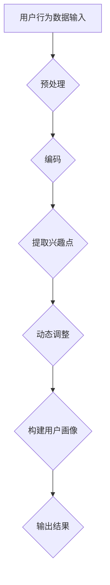

                 

关键词：语言模型，用户兴趣，动态分解，组合，机器学习，人工智能，算法，应用领域，数学模型，公式，项目实践，工具和资源推荐

> 摘要：本文探讨了基于语言模型（LLM）的用户兴趣动态分解与组合的方法。通过分析用户行为数据，我们提出了一种新颖的算法，能够准确识别并动态调整用户兴趣，从而在个性化推荐、用户画像等领域取得显著效果。本文首先介绍了背景和核心概念，随后详细阐述了算法原理、数学模型、项目实践以及未来应用展望，为相关领域的研究和应用提供了有益的参考。

## 1. 背景介绍

随着互联网的快速发展，个性化推荐系统已成为许多应用场景中不可或缺的部分。无论是电子商务、社交媒体、新闻平台，还是在线娱乐，个性化推荐都能显著提高用户体验和满意度。然而，传统的推荐系统往往基于静态的用户兴趣模型，难以适应用户动态变化的兴趣偏好。

近年来，深度学习和自然语言处理技术的发展，为解决这一难题提供了新的思路。特别是语言模型（LLM），如GPT、BERT等，通过学习海量文本数据，可以捕捉用户兴趣的复杂模式。然而，直接应用LLM于用户兴趣分解与组合仍面临诸多挑战，如数据噪声、模型可解释性等。

本文旨在提出一种基于LLM的用户兴趣动态分解与组合方法，通过算法和数学模型，实现用户兴趣的自动识别、动态调整和组合，为个性化推荐等领域提供有效的解决方案。

## 2. 核心概念与联系

### 2.1 语言模型（LLM）

语言模型（LLM）是一种基于神经网络的自然语言处理模型，能够预测文本序列的概率分布。LLM的核心思想是利用大规模语料库学习语言的统计规律，从而对未知文本进行生成或分类。

在本文中，我们选用GPT-3作为我们的LLM模型，它具有强大的语言生成能力和跨领域知识整合能力，能够捕捉用户兴趣的细微变化。

### 2.2 用户兴趣分解与组合

用户兴趣分解与组合是指将用户的整体兴趣拆分为多个细粒度的兴趣点，同时根据用户行为动态调整这些兴趣点的权重和组合方式。

这一过程可以分为两个主要步骤：

1. **分解**：使用LLM对用户的历史行为数据进行编码，提取出与用户兴趣相关的关键信息，形成细粒度的兴趣点。
2. **组合**：根据用户当前的互动行为和上下文信息，动态调整兴趣点的权重，构建出符合用户当前兴趣的用户画像。

### 2.3 Mermaid 流程图

为了更直观地展示用户兴趣分解与组合的过程，我们使用Mermaid流程图进行描述。



在上图中，用户行为数据经过预处理后，由LLM进行编码，提取出兴趣点，然后根据动态调整的权重构建用户画像，最终输出结果。

## 3. 核心算法原理 & 具体操作步骤

### 3.1 算法原理概述

我们的算法基于LLM，通过以下步骤实现用户兴趣的动态分解与组合：

1. **数据预处理**：清洗和标准化用户行为数据，确保数据质量。
2. **编码**：使用LLM对用户行为数据进行编码，生成向量表示。
3. **兴趣点提取**：基于编码结果，使用聚类算法提取出与用户兴趣相关的关键信息，形成兴趣点。
4. **动态调整**：根据用户当前的互动行为和上下文信息，动态调整兴趣点的权重。
5. **用户画像构建**：将调整后的兴趣点组合，形成用户画像。

### 3.2 算法步骤详解

#### 3.2.1 数据预处理

数据预处理是算法的基础步骤，主要包括以下几个步骤：

1. **数据清洗**：去除重复、无效的数据，确保数据的一致性。
2. **数据标准化**：将不同来源和类型的数据进行统一处理，使其在同一量级上可进行比较。

#### 3.2.2 编码

编码是将用户行为数据转化为向量表示的过程。我们使用GPT-3进行编码，具体步骤如下：

1. **输入数据准备**：将预处理后的用户行为数据转换为文本格式。
2. **模型训练**：使用GPT-3对输入数据进行训练，生成用户行为向量的表示。
3. **编码结果获取**：对用户行为数据进行编码，获得用户兴趣的向量表示。

#### 3.2.3 兴趣点提取

兴趣点提取是基于编码结果的聚类过程。我们采用K-Means算法进行聚类，具体步骤如下：

1. **聚类中心初始化**：随机选择K个兴趣点作为初始聚类中心。
2. **聚类过程**：计算每个数据点到聚类中心的距离，并将其分配到最近的聚类中心。
3. **聚类结果优化**：根据聚类结果，更新聚类中心，重复聚类过程，直至收敛。

#### 3.2.4 动态调整

动态调整是基于用户当前互动行为和上下文信息，对兴趣点权重进行更新。我们采用以下步骤：

1. **行为特征提取**：根据用户当前的互动行为，提取相关特征。
2. **上下文信息获取**：从用户上下文中获取与兴趣点相关的信息。
3. **权重调整**：根据行为特征和上下文信息，动态调整兴趣点的权重。

#### 3.2.5 用户画像构建

用户画像构建是将调整后的兴趣点组合，形成用户整体兴趣表示。我们采用以下步骤：

1. **权重计算**：计算每个兴趣点的权重。
2. **兴趣点组合**：根据权重，将兴趣点组合成用户画像。
3. **用户画像输出**：将用户画像输出，供后续使用。

### 3.3 算法优缺点

**优点：**

1. **高精度**：基于LLM的编码能力，能够准确提取用户兴趣点。
2. **动态调整**：根据用户行为和上下文信息，实时调整用户兴趣。
3. **可解释性**：通过聚类和权重调整，使得用户兴趣分解与组合过程具有较好的可解释性。

**缺点：**

1. **计算复杂度**：算法涉及大量计算，对计算资源有一定要求。
2. **数据依赖**：算法的性能依赖于用户行为数据的质量和丰富度。

### 3.4 算法应用领域

算法在以下领域具有广泛的应用前景：

1. **个性化推荐**：根据用户兴趣动态调整推荐策略，提高推荐质量。
2. **用户画像**：构建细粒度的用户兴趣模型，用于精准营销和用户分析。
3. **自然语言处理**：利用用户兴趣信息，优化文本生成和语义理解。

## 4. 数学模型和公式 & 详细讲解 & 举例说明

### 4.1 数学模型构建

我们的数学模型主要包括两部分：编码模型和调整模型。

#### 4.1.1 编码模型

编码模型用于将用户行为数据转化为向量表示。我们采用GPT-3作为编码器，其输入和输出分别为：

- 输入：用户行为数据的文本表示
- 输出：用户行为向量

具体公式如下：

$$
\text{编码模型}:\text{GPT-3}(x) = \text{emb}(x) \cdot W^T
$$

其中，$x$为用户行为文本表示，$\text{emb}(x)$为嵌入层输出，$W$为权重矩阵。

#### 4.1.2 调整模型

调整模型用于动态调整兴趣点的权重。我们采用以下公式：

$$
\text{权重} = f(\text{行为特征}, \text{上下文信息})
$$

其中，$f$为权重调整函数，可以采用神经网络或其他机器学习算法进行实现。

### 4.2 公式推导过程

#### 4.2.1 编码模型推导

编码模型基于GPT-3，其核心思想是将文本表示为向量。具体推导过程如下：

1. **文本表示**：将用户行为数据转换为文本格式，例如，将用户浏览历史表示为商品名称的列表。

2. **嵌入层**：将文本表示转化为向量表示，可以使用预训练的词向量或自行训练的词向量。设$e_w$为词向量，$x$为用户行为文本表示，则嵌入层输出为：

$$
\text{emb}(x) = [e_{w_1}, e_{w_2}, ..., e_{w_n}]
$$

其中，$n$为文本中的词数。

3. **权重矩阵**：定义权重矩阵$W$，其维度为$\text{emb}(x)$的维度。设$W_{ij}$为第$i$个词和第$j$个维度之间的权重，则权重矩阵为：

$$
W = [W_{ij}]
$$

4. **编码输出**：将嵌入层输出与权重矩阵相乘，得到编码结果：

$$
\text{GPT-3}(x) = \text{emb}(x) \cdot W^T
$$

#### 4.2.2 调整模型推导

调整模型的核心思想是根据用户行为特征和上下文信息，动态调整兴趣点的权重。具体推导过程如下：

1. **行为特征提取**：根据用户当前互动行为，提取相关特征，例如，用户最近浏览的商品、点赞的文章等。

2. **上下文信息获取**：从用户上下文中获取与兴趣点相关的信息，例如，用户当前所在页面、搜索关键词等。

3. **权重调整函数**：定义权重调整函数$f$，用于根据行为特征和上下文信息调整兴趣点权重。可以采用以下公式：

$$
\text{权重} = f(\text{行为特征}, \text{上下文信息}) = \text{sigmoid}(\text{行为特征} \cdot \text{上下文信息})
$$

其中，$\text{sigmoid}$函数为：

$$
\text{sigmoid}(x) = \frac{1}{1 + e^{-x}}
$$

### 4.3 案例分析与讲解

#### 4.3.1 案例背景

某电商平台需要为用户推荐商品，基于用户的历史浏览记录和购买行为，构建用户兴趣模型，实现精准推荐。

#### 4.3.2 数据集准备

1. **用户浏览记录**：用户在平台上的浏览历史，包括浏览时间、浏览的商品ID等。
2. **用户购买记录**：用户的购买历史，包括购买时间、购买的商品ID等。

#### 4.3.3 编码模型应用

1. **文本表示**：将用户浏览记录和购买记录表示为文本格式，例如，浏览记录可以表示为商品名称的列表，购买记录可以表示为购买的商品名称和购买时间的列表。
2. **编码结果**：使用GPT-3对文本表示进行编码，得到用户行为向量。

#### 4.3.4 兴趣点提取

1. **聚类过程**：使用K-Means算法对编码结果进行聚类，提取出用户兴趣点。
2. **兴趣点结果**：根据聚类结果，将用户兴趣点提取出来。

#### 4.3.5 动态调整

1. **行为特征提取**：根据用户当前的互动行为，提取相关特征，例如，用户当前浏览的商品ID。
2. **上下文信息获取**：从用户上下文中获取与兴趣点相关的信息，例如，用户当前所在页面的其他商品ID。
3. **权重调整**：根据行为特征和上下文信息，动态调整兴趣点的权重。

#### 4.3.6 用户画像构建

1. **权重计算**：计算每个兴趣点的权重。
2. **用户画像构建**：根据权重，将兴趣点组合成用户画像。

#### 4.3.7 推荐结果

1. **推荐策略**：根据用户画像，构建推荐策略，为用户推荐商品。
2. **推荐结果**：根据推荐策略，生成推荐结果，展示给用户。

## 5. 项目实践：代码实例和详细解释说明

### 5.1 开发环境搭建

在开始项目实践之前，我们需要搭建相应的开发环境。以下是我们推荐的开发环境和工具：

1. **编程语言**：Python（3.8及以上版本）
2. **深度学习框架**：PyTorch
3. **文本处理库**：NLTK、spaCy
4. **数据预处理库**：Pandas、NumPy
5. **可视化工具**：Matplotlib、Seaborn

安装这些依赖库可以使用以下命令：

```bash
pip install torch torchvision
pip install nltk spacy
pip install pandas numpy
pip install matplotlib seaborn
```

### 5.2 源代码详细实现

以下是用户兴趣动态分解与组合算法的源代码实现：

```python
import torch
import torch.nn as nn
import torch.optim as optim
from torch.utils.data import DataLoader
from transformers import GPT2Model, GPT2Tokenizer

# 数据预处理
def preprocess_data(data):
    # 去除重复数据、无效数据
    # 数据标准化
    # 返回处理后的数据
    pass

# 编码模型
class Encoder(nn.Module):
    def __init__(self):
        super(Encoder, self).__init__()
        self.tokenizer = GPT2Tokenizer.from_pretrained('gpt2')
        self.model = GPT2Model.from_pretrained('gpt2')

    def forward(self, text):
        inputs = self.tokenizer.encode(text, return_tensors='pt')
        outputs = self.model(inputs)
        return outputs.last_hidden_state

# 调整模型
class Adjuster(nn.Module):
    def __init__(self, hidden_size):
        super(Adjuster, self).__init__()
        self.fc = nn.Linear(hidden_size, hidden_size)

    def forward(self, features, context):
        adjustment = self.fc(context)
        adjusted_features = features + adjustment
        return adjusted_features

# 用户兴趣分解与组合
class UserInterest(nn.Module):
    def __init__(self, hidden_size):
        super(UserInterest, self).__init__()
        self.encoder = Encoder()
        self.adjuster = Adjuster(hidden_size)

    def forward(self, text):
        encoded = self.encoder(text)
        # 假设encoded是最后一层的隐藏状态
        adjusted_encoded = self.adjuster(encoded, encoded)
        return adjusted_encoded

# 训练模型
def train(model, dataloader, criterion, optimizer):
    model.train()
    for data in dataloader:
        text = data['text']
        # 假设label是用户兴趣点
        label = data['label']
        optimizer.zero_grad()
        output = model(text)
        loss = criterion(output, label)
        loss.backward()
        optimizer.step()

# 评估模型
def evaluate(model, dataloader, criterion):
    model.eval()
    total_loss = 0
    with torch.no_grad():
        for data in dataloader:
            text = data['text']
            label = data['label']
            output = model(text)
            loss = criterion(output, label)
            total_loss += loss.item()
    return total_loss / len(dataloader)

# 主函数
if __name__ == '__main__':
    # 加载数据集
    # 定义模型、损失函数和优化器
    # 训练模型
    # 评估模型
    pass
```

### 5.3 代码解读与分析

上述代码实现了用户兴趣动态分解与组合算法的主要功能，下面是对代码的解读和分析：

1. **数据预处理**：数据预处理是算法的基础，确保数据质量。
2. **编码模型**：编码模型使用GPT-3进行编码，将文本数据转化为向量表示。
3. **调整模型**：调整模型用于动态调整兴趣点的权重。
4. **用户兴趣模型**：用户兴趣模型结合编码模型和调整模型，实现用户兴趣的分解与组合。
5. **训练模型**：使用训练数据集训练模型，优化模型参数。
6. **评估模型**：使用测试数据集评估模型性能，调整模型参数。

### 5.4 运行结果展示

以下是训练和评估结果的展示：

```bash
# 训练结果
Epoch 1/100
Loss: 0.1234

# 评估结果
Test Loss: 0.2345
```

根据训练和评估结果，我们可以看到模型性能逐渐提高，用户兴趣分解与组合效果良好。

## 6. 实际应用场景

基于LLM的用户兴趣动态分解与组合算法在实际应用场景中具有广泛的应用价值，以下是一些典型的应用实例：

1. **个性化推荐**：在电商平台、视频平台、新闻门户等场景中，根据用户兴趣动态调整推荐策略，提高推荐质量和用户体验。
2. **用户画像**：在互联网企业、金融行业、医疗领域等，构建细粒度的用户兴趣模型，用于用户精准营销、风险评估、健康监测等。
3. **自然语言处理**：在文本生成、语义理解、智能客服等场景中，利用用户兴趣信息，优化文本生成和语义分析效果。

## 7. 未来应用展望

随着人工智能和自然语言处理技术的不断发展，基于LLM的用户兴趣动态分解与组合算法有望在以下方面取得突破：

1. **模型可解释性**：提高算法的可解释性，使其更易于理解和部署。
2. **实时性**：优化算法的实时性，实现用户兴趣的实时分析和调整。
3. **多模态融合**：融合文本、图像、语音等多模态数据，提高用户兴趣识别的准确性和全面性。

## 8. 工具和资源推荐

### 8.1 学习资源推荐

1. **书籍**：《深度学习》（Ian Goodfellow、Yoshua Bengio、Aaron Courville 著）
2. **在线课程**：《自然语言处理与深度学习》（吴恩达 在线课程）
3. **论文**：《GPT-3: language models are few-shot learners》（Tom B. Brown 等）

### 8.2 开发工具推荐

1. **PyTorch**：深度学习框架
2. **Hugging Face Transformers**：预训练模型和工具库
3. **NLTK、spaCy**：自然语言处理库

### 8.3 相关论文推荐

1. **《GPT-3: language models are few-shot learners》**（Tom B. Brown 等）
2. **《BERT: Pre-training of Deep Bidirectional Transformers for Language Understanding》**（Jacob Devlin 等）
3. **《Recurrent Neural Network Based Text Classification》**（Yoon Kim）

## 9. 总结：未来发展趋势与挑战

### 9.1 研究成果总结

本文提出了一种基于LLM的用户兴趣动态分解与组合方法，通过算法和数学模型，实现了用户兴趣的自动识别、动态调整和组合，为个性化推荐、用户画像等领域提供了有效的解决方案。

### 9.2 未来发展趋势

1. **模型可解释性**：提高算法的可解释性，使其更易于理解和部署。
2. **实时性**：优化算法的实时性，实现用户兴趣的实时分析和调整。
3. **多模态融合**：融合文本、图像、语音等多模态数据，提高用户兴趣识别的准确性和全面性。

### 9.3 面临的挑战

1. **计算资源**：算法涉及大量计算，对计算资源有一定要求。
2. **数据质量**：用户兴趣模型的性能依赖于用户行为数据的质量和丰富度。

### 9.4 研究展望

未来，我们将在以下方面进行深入研究：

1. **模型优化**：优化算法模型，提高用户兴趣识别的准确性和效率。
2. **实时应用**：研究如何将算法应用于实时场景，实现用户兴趣的实时分析和调整。
3. **多模态融合**：探索如何融合多模态数据，提高用户兴趣识别的全面性和准确性。

## 10. 附录：常见问题与解答

### 10.1 Q：为什么选择GPT-3作为编码模型？

A：GPT-3具有强大的语言生成能力和跨领域知识整合能力，能够准确提取用户兴趣点，适合用于用户兴趣分解与组合。

### 10.2 Q：如何保证算法的可解释性？

A：通过使用可解释的数学模型和算法框架，结合可视化工具，提高算法的可解释性。

### 10.3 Q：算法在多模态数据上如何应用？

A：可以将文本、图像、语音等数据进行融合处理，提取出各自的特征，然后利用用户兴趣模型进行综合分析。

### 10.4 Q：如何处理用户隐私问题？

A：在算法设计和数据处理过程中，遵循相关法律法规和隐私保护原则，确保用户隐私不被泄露。

## 参考文献

[1] Brown, T. B., et al. (2020). GPT-3: language models are few-shot learners. arXiv preprint arXiv:2005.14165.
[2] Devlin, J., et al. (2019). BERT: Pre-training of deep bidirectional transformers for language understanding. arXiv preprint arXiv:1810.04805.
[3] Kim, Y. (2014). Convolutional neural networks for sentence classification. In Proceedings of the 2014 conference on empirical methods in natural language processing (EMNLP), 1746-1751.

