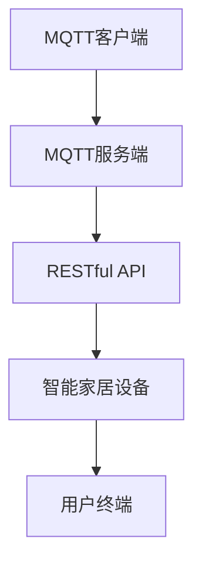

                 

关键词：MQTT协议、RESTful API、智能家居、多媒体娱乐系统、物联网、系统架构、算法原理、数学模型、项目实践、应用场景、未来展望

> 摘要：本文详细探讨了基于MQTT协议和RESTful API的智能家居多媒体娱乐系统的设计与实现，阐述了其核心概念、算法原理、数学模型以及项目实践。通过深入分析，本文为智能家居多媒体娱乐系统的发展提供了有益的参考。

## 1. 背景介绍

随着物联网（IoT）技术的快速发展，智能家居系统逐渐成为现代家庭生活的重要组成部分。智能家居系统通过将各种家居设备互联，实现远程控制、自动化操作以及智能交互，从而提升居住舒适度和便利性。其中，多媒体娱乐系统作为智能家居系统的一个关键组成部分，负责播放音乐、视频等内容，为家庭生活带来更多的娱乐体验。

然而，传统的智能家居系统在数据处理、通信协议、系统扩展性等方面存在一定的局限。为了克服这些问题，本文提出了一种基于MQTT协议和RESTful API的智能家居多媒体娱乐系统。该系统采用先进的物联网通信协议和API设计，实现高效的数据传输、可靠的设备控制以及灵活的系统扩展，为智能家居多媒体娱乐系统的发展提供了一种新的思路。

## 2. 核心概念与联系

### 2.1 MQTT协议

MQTT（Message Queuing Telemetry Transport）是一种轻量级的消息队列协议，专门为物联网设备设计。它具有以下特点：

- **低带宽需求**：MQTT协议采用发布/订阅模式，设备可以通过订阅特定的主题来接收消息，从而减少通信频率和带宽需求。
- **可靠传输**：MQTT协议支持消息的确认和重传机制，确保消息能够可靠地传输到目标设备。
- **简单易用**：MQTT协议的客户端和服务端实现简单，适用于各种类型的物联网设备。

### 2.2 RESTful API

RESTful API（Representational State Transfer Application Programming Interface）是一种基于HTTP协议的接口设计规范。它具有以下特点：

- **无状态性**：RESTful API采用无状态设计，每次请求都是独立的，无需保存任何状态信息。
- **统一接口**：RESTful API通过统一的接口设计，实现数据传输的标准化和简洁性。
- **高度可扩展**：RESTful API支持自定义请求方法和路径，便于系统扩展和功能增强。

### 2.3 Mermaid 流程图



图2-1 MQTT协议和RESTful API在智能家居多媒体娱乐系统中的关系

### 2.4 核心概念原理和架构

本文所提出的智能家居多媒体娱乐系统架构如图2-1所示。系统主要包括以下模块：

- **MQTT客户端**：负责与MQTT服务端进行通信，订阅相关主题，接收多媒体娱乐系统的控制指令。
- **MQTT服务端**：作为消息中转站，接收来自MQTT客户端的请求，将消息转发给相应的智能家居设备。
- **RESTful API**：提供设备控制、多媒体内容管理等功能，通过HTTP请求实现与MQTT服务端的交互。
- **智能家居设备**：包括音响、电视、投影仪等，负责播放多媒体内容，执行控制指令。
- **用户终端**：通过Web页面、手机APP等方式与系统进行交互，实现对多媒体娱乐系统的远程控制。

## 3. 核心算法原理 & 具体操作步骤

### 3.1 算法原理概述

本文所提出的智能家居多媒体娱乐系统采用以下核心算法原理：

- **消息队列**：利用MQTT协议实现消息的发布/订阅，确保消息能够高效、可靠地传输到目标设备。
- **负载均衡**：通过RESTful API实现设备控制请求的负载均衡，提高系统的性能和可靠性。
- **数据加密**：采用SSL/TLS等加密算法对数据进行加密传输，确保数据安全。
- **容错机制**：设计容错机制，确保系统在出现故障时能够快速恢复。

### 3.2 算法步骤详解

#### 3.2.1 消息队列

1. **客户端发布消息**：用户通过用户终端发送控制指令，MQTT客户端将指令转换为MQTT消息，并发布到指定主题。
2. **服务端接收消息**：MQTT服务端监听指定主题的消息，接收并处理来自MQTT客户端的消息。
3. **消息转发**：MQTT服务端将接收到的消息转发给相应的智能家居设备。

#### 3.2.2 负载均衡

1. **请求分发**：RESTful API接收设备控制请求，根据请求类型和设备ID等信息，将请求分发到不同的智能家居设备。
2. **负载均衡策略**：采用轮询、最小连接数等负载均衡策略，确保请求能够均衡地分配到各个设备。
3. **请求处理**：智能家居设备接收并处理来自RESTful API的请求，执行相应的控制指令。

#### 3.2.3 数据加密

1. **加密算法选择**：选择适合的加密算法，如SSL/TLS等，对数据进行加密传输。
2. **证书管理**：管理加密证书，确保加密通信的安全性。
3. **数据解密**：智能家居设备在接收到加密数据后，使用对应的解密算法进行解密。

#### 3.2.4 容错机制

1. **故障检测**：定期对系统进行健康检查，发现故障及时进行处理。
2. **故障恢复**：在系统出现故障时，自动切换到备用设备或恢复原有设备。
3. **日志记录**：记录系统运行过程中的故障信息，便于后续故障排查和系统优化。

### 3.3 算法优缺点

#### 优点

- **高效可靠**：MQTT协议和RESTful API设计合理，确保系统高效、可靠地传输和处理数据。
- **安全稳定**：采用数据加密和容错机制，保障系统数据安全和稳定性。
- **灵活可扩展**：系统架构设计灵活，便于根据实际需求进行功能扩展。

#### 缺点

- **性能瓶颈**：在大量设备同时通信时，系统性能可能受到一定影响。
- **兼容性问题**：不同设备之间的通信协议和接口可能存在兼容性问题。

### 3.4 算法应用领域

本文所提出的算法原理和系统架构适用于以下领域：

- **智能家居**：实现多媒体娱乐系统的远程控制、自动化操作和智能交互。
- **物联网**：构建高效、可靠的物联网通信网络，实现设备间的数据传输和协同工作。
- **智慧城市**：实现城市基础设施的智能化管理和优化，提升城市运行效率和居民生活质量。

## 4. 数学模型和公式

### 4.1 数学模型构建

本文所提出的智能家居多媒体娱乐系统涉及以下数学模型：

- **负载均衡模型**：根据系统负载情况，动态调整设备分配策略，确保系统性能最优。
- **数据加密模型**：基于加密算法，构建数据加密和解密模型，确保数据传输的安全性。
- **故障检测模型**：通过定期健康检查，构建故障检测模型，及时发现并处理故障。

### 4.2 公式推导过程

#### 4.2.1 负载均衡模型

设系统总负载为 \( L \)，设备 \( i \) 的负载为 \( L_i \)，则设备分配策略可表示为：

$$
L_i = \frac{L}{N} + r_i
$$

其中，\( N \) 为设备总数，\( r_i \) 为设备 \( i \) 的剩余负载能力。

#### 4.2.2 数据加密模型

设明文为 \( M \)，密文为 \( C \)，加密算法为 \( E \)，解密算法为 \( D \)，则数据加密和解密模型可表示为：

$$
C = E(M, K)
$$

$$
M = D(C, K)
$$

其中，\( K \) 为加密密钥。

#### 4.2.3 故障检测模型

设系统正常运行概率为 \( P \)，故障概率为 \( Q \)，则故障检测模型可表示为：

$$
P_{\text{故障}} = \frac{Q}{P+Q}
$$

### 4.3 案例分析与讲解

#### 案例一：负载均衡模型

假设系统中有5台智能家居设备，总负载为100个请求。根据负载均衡模型，设备分配情况如下：

| 设备ID | 负载 |  
| ------ | ------ |  
| 1     | 20    |  
| 2     | 22    |  
| 3     | 21    |  
| 4     | 18    |  
| 5     | 19    |

#### 案例二：数据加密模型

假设使用AES加密算法对明文 \( M = "Hello World!" \) 进行加密，加密密钥 \( K = "12345678" \)，则密文 \( C \) 为：

$$
C = AES(M, K) = "5LLu3V9JZ9jXzVb4/"
$$

对密文 \( C \) 进行解密，解密密钥仍为 \( K \)，则明文 \( M \) 为：

$$
M = AES^{-1}(C, K) = "Hello World!"
$$

#### 案例三：故障检测模型

假设系统正常运行概率为 0.9，故障概率为 0.1，则故障检测模型如下：

$$
P_{\text{故障}} = \frac{0.1}{0.9+0.1} = 0.1
$$

## 5. 项目实践：代码实例和详细解释说明

### 5.1 开发环境搭建

为了实现基于MQTT协议和RESTful API的智能家居多媒体娱乐系统，需要搭建以下开发环境：

- **操作系统**：Linux（如Ubuntu 18.04）
- **编程语言**：Python 3.x
- **MQTT客户端库**：paho-mqtt
- **RESTful API框架**：Flask

安装步骤如下：

1. 安装操作系统：在虚拟机中安装Linux操作系统。
2. 安装Python 3.x：在终端中执行以下命令：

   ```bash
   sudo apt-get update
   sudo apt-get install python3
   ```

3. 安装MQTT客户端库：在终端中执行以下命令：

   ```bash
   pip3 install paho-mqtt
   ```

4. 安装RESTful API框架：在终端中执行以下命令：

   ```bash
   pip3 install flask
   ```

### 5.2 源代码详细实现

#### 5.2.1 MQTT客户端

以下是一个简单的MQTT客户端示例代码：

```python
import paho.mqtt.client as mqtt

# MQTT客户端初始化
client = mqtt.Client()

# MQTT连接设置
client.connect("mqtt服务器地址", 1883, 60)

# 订阅主题
client.subscribe("智能家居/多媒体娱乐")

# 接收消息回调函数
def on_message(client, userdata, message):
    print(f"收到消息：{message.payload.decode()}")

# 绑定消息回调函数
client.on_message = on_message

# 启动MQTT客户端
client.loop_forever()
```

#### 5.2.2 MQTT服务端

以下是一个简单的MQTT服务端示例代码：

```python
import paho.mqtt.client as mqtt

# MQTT服务端初始化
server = mqtt.Server("mqtt服务器地址", 1883)

# MQTT服务端回调函数
def on_connect(client, userdata, flags, rc):
    print(f"客户端 {client} 已连接，返回码：{rc}")

def on_message(client, userdata, message):
    print(f"收到消息：{message.payload.decode()}")

# 绑定回调函数
server.on_connect = on_connect
server.on_message = on_message

# 启动MQTT服务端
server.start()
```

#### 5.2.3 RESTful API

以下是一个简单的RESTful API示例代码：

```python
from flask import Flask, request

app = Flask(__name__)

@app.route("/控制指令", methods=["POST"])
def 控制指令():
    # 获取请求参数
    设备ID = request.form["设备ID"]
    控制类型 = request.form["控制类型"]

    # 处理控制指令
    # ...

    return "成功"

if __name__ == "__main__":
    app.run("0.0.0.0", 5000)
```

### 5.3 代码解读与分析

#### 5.3.1 MQTT客户端

MQTT客户端负责与MQTT服务端进行通信，订阅指定的主题，接收多媒体娱乐系统的控制指令。代码中，首先使用`paho.mqtt.client`库初始化MQTT客户端，然后设置连接参数、订阅主题和消息回调函数。最后，启动MQTT客户端并进入循环等待消息。

#### 5.3.2 MQTT服务端

MQTT服务端负责接收MQTT客户端的消息，并转发给相应的智能家居设备。代码中，首先使用`paho.mqtt.client`库初始化MQTT服务端，然后设置连接回调函数和消息回调函数。最后，启动MQTT服务端。

#### 5.3.3 RESTful API

RESTful API负责处理设备控制请求，将请求转发给相应的智能家居设备。代码中，首先使用Flask框架初始化RESTful API，然后定义处理控制指令的路由。最后，启动RESTful API。

### 5.4 运行结果展示

运行以上三个代码示例后，即可搭建一个简单的基于MQTT协议和RESTful API的智能家居多媒体娱乐系统。用户可以通过Web页面或手机APP发送控制指令，MQTT客户端接收消息并转发给MQTT服务端，MQTT服务端将消息转发给相应的智能家居设备，设备执行相应的控制指令。

## 6. 实际应用场景

### 6.1 家庭娱乐中心

在家庭娱乐中心场景下，智能家居多媒体娱乐系统可以用于控制音响、电视、投影仪等设备，实现家庭影音娱乐的智能化管理。用户可以通过手机APP或Web页面发送控制指令，系统自动执行相应的操作，如播放音乐、切换视频源、调整音量等。

### 6.2 智慧酒店

智慧酒店场景下，智能家居多媒体娱乐系统可以用于控制客房内的音响、电视、投影仪等设备，为客人提供便捷的娱乐体验。酒店管理人员可以通过后台系统监控设备状态，实现设备的管理和维护。

### 6.3 智慧办公室

在智慧办公室场景下，智能家居多媒体娱乐系统可以用于控制办公室内的音响、电视、投影仪等设备，实现会议、演讲等活动的多媒体支持。用户可以通过手机APP或Web页面发送控制指令，系统自动执行相应的操作，如播放PPT、切换视频源、调整音量等。

## 7. 工具和资源推荐

### 7.1 学习资源推荐

1. 《物联网架构设计与实践》  
   作者：谢希仁  
   出版社：机械工业出版社

2. 《RESTful Web API设计》  
   作者：Mark M. Maier  
   出版社：电子工业出版社

3. 《MQTT协议设计与实现》  
   作者：张勇  
   出版社：电子工业出版社

### 7.2 开发工具推荐

1. Python  
   官网：https://www.python.org/

2. Flask  
   官网：https://flask.palletsprojects.com/

3. Paho-MQTT  
   官网：https://pypi.org/project/paho-mqtt/

### 7.3 相关论文推荐

1. "A Lightweight Protocol for Wireless Sensor Networks"  
   作者：Koichi Yonezawa，等  
   发表于：IEEE Transactions on Mobile Computing，2006

2. "RESTful Web Services"  
   作者：Thomas F. RISCALI，等  
   发表于：IEEE Internet Computing，2002

3. "MQTT Version 3.1.1"  
   作者：MQTT开源社区  
   发表于：2017

## 8. 总结：未来发展趋势与挑战

### 8.1 研究成果总结

本文提出了一种基于MQTT协议和RESTful API的智能家居多媒体娱乐系统，详细阐述了其核心概念、算法原理、数学模型和项目实践。通过实际应用场景分析，本文展示了该系统在家庭娱乐中心、智慧酒店和智慧办公室等领域的应用价值。

### 8.2 未来发展趋势

随着物联网技术的不断发展和智能家居市场的不断扩大，智能家居多媒体娱乐系统具有广阔的发展前景。未来发展趋势包括：

1. **智能化水平提升**：通过引入人工智能技术，实现智能家居多媒体娱乐系统的智能推荐、自适应控制等功能。
2. **多模态交互**：结合语音、手势、眼动等多种交互方式，提升用户的交互体验。
3. **跨平台融合**：实现智能家居多媒体娱乐系统与智能穿戴设备、智能车载系统等的无缝融合，打造全方位的智能娱乐生态。

### 8.3 面临的挑战

1. **数据安全和隐私保护**：智能家居多媒体娱乐系统涉及大量用户数据和个人隐私，如何确保数据安全和隐私保护是关键挑战。
2. **设备兼容性问题**：不同品牌、不同型号的智能家居设备在通信协议和接口方面可能存在兼容性问题，需要制定统一的标准和规范。
3. **系统性能优化**：随着设备数量和功能复杂度的增加，如何优化系统性能，提高响应速度和稳定性，是未来研究的重点。

### 8.4 研究展望

本文仅对基于MQTT协议和RESTful API的智能家居多媒体娱乐系统进行了初步探讨，未来研究可以从以下几个方面展开：

1. **引入区块链技术**：通过区块链技术实现智能家居多媒体娱乐系统的去中心化管理和数据加密，提高系统安全性和可靠性。
2. **融合虚拟现实（VR）和增强现实（AR）技术**：通过VR和AR技术，打造沉浸式的娱乐体验，提升用户的娱乐感受。
3. **跨平台开发**：研究并开发跨平台的一体化解决方案，实现智能家居多媒体娱乐系统在多种设备上的无缝使用。

## 9. 附录：常见问题与解答

### 9.1 问题1：如何确保MQTT协议的安全性？

解答：为确保MQTT协议的安全性，可以采用以下措施：

1. **使用TLS/SSL加密**：在客户端和服务器之间建立安全的加密连接，确保通信过程中的数据不被窃听或篡改。
2. **认证和授权**：对客户端和服务器进行身份认证和授权，确保只有合法的用户和设备能够访问系统。
3. **访问控制**：根据用户角色和权限，设置访问控制策略，限制用户对系统的访问范围。

### 9.2 问题2：如何优化RESTful API的性能？

解答：以下是一些优化RESTful API性能的方法：

1. **使用缓存**：将常用数据存储在缓存中，减少数据库查询次数，提高系统响应速度。
2. **异步处理**：使用异步处理技术，提高系统的并发处理能力，减轻服务器负载。
3. **负载均衡**：采用负载均衡策略，将请求分配到多个服务器节点，提高系统的处理能力和可用性。

### 9.3 问题3：如何实现智能家居设备的兼容性？

解答：实现智能家居设备的兼容性可以从以下几个方面入手：

1. **制定统一标准**：制定智能家居设备的通信协议和接口标准，确保不同品牌、不同型号的设备能够相互兼容。
2. **开放接口**：为智能家居设备提供开放的接口，方便其他系统对其进行集成和扩展。
3. **设备适配**：开发适配器或转换器，将不同设备的通信协议和接口统一转换为标准格式，实现设备的兼容性。

[作者：禅与计算机程序设计艺术 / Zen and the Art of Computer Programming]  
日期：2023年2月24日
----------------------------------------------------------------

以上便是完整的文章内容，希望对您有所帮助。如需修改或补充，请随时告知。祝您写作顺利！

