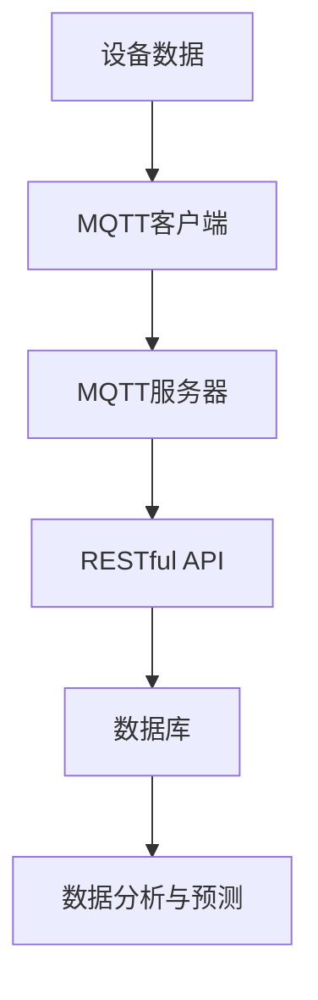

                 

关键词：MQTT协议、RESTful API、智能家居、数据分析、预测模型、机器学习

> 摘要：本文旨在探讨如何利用MQTT协议和RESTful API来实现智能家居系统的数据收集、分析和预测。通过结合MQTT协议的轻量级特性和RESTful API的易用性，我们可以构建一个高效、可靠的智能家居数据分析与预测系统。本文将详细讨论MQTT协议的基本原理、RESTful API的设计与实现，并介绍如何将它们应用于智能家居系统，最后探讨相关的未来研究方向。

## 1. 背景介绍

随着物联网（IoT）技术的快速发展，智能家居逐渐成为现代家庭的重要组成部分。智能家居系统通过将各种家居设备连接到互联网，使用户能够远程控制和管理家居设备，提高生活便利性和舒适度。然而，随着设备数量的增加和数据量的激增，如何有效地收集、存储和分析这些数据成为一个重要问题。

在这一背景下，MQTT协议和RESTful API成为实现智能家居数据收集和分析的有力工具。MQTT（Message Queuing Telemetry Transport）协议是一种轻量级的消息传输协议，适用于低带宽、不可靠的网络环境，非常适合智能家居这样的设备间通信场景。RESTful API（Representational State Transfer Application Programming Interface）则是一种简单的、基于HTTP请求的API设计风格，易于实现和扩展，广泛应用于各种Web服务中。

本文将介绍如何利用MQTT协议和RESTful API构建智能家居数据分析与预测系统，包括协议的基本原理、设计思路、实现细节以及在实际应用中的效果和挑战。

## 2. 核心概念与联系

### 2.1 MQTT协议

MQTT协议是一种发布/订阅模式的消息传输协议，设计用于低带宽、不可靠的网络环境。其基本概念包括：

- **发布者（Publisher）**：发送消息的一方，通常为智能家居设备。
- **订阅者（Subscriber）**：接收消息的一方，通常为服务器或应用程序。
- **主题（Topic）**：消息的分类标签，用于指定消息的发布和订阅关系。

MQTT协议的工作流程如下：

1. **连接**：发布者和订阅者与MQTT服务器建立连接。
2. **发布消息**：发布者将消息发布到特定的主题。
3. **订阅主题**：订阅者订阅感兴趣的主题。
4. **接收消息**：订阅者从服务器接收发布的消息。

### 2.2 RESTful API

RESTful API是一种基于HTTP协议的API设计风格，其核心原则包括：

- **统一接口**：使用统一的接口设计，如URI、HTTP方法等。
- **无状态**：服务与客户端之间的通信是状态无关的。
- **客户端-服务器架构**：客户端和服务器之间通过请求-响应模型进行通信。

RESTful API的基本操作包括：

- **GET**：获取资源。
- **POST**：创建资源。
- **PUT**：更新资源。
- **DELETE**：删除资源。

### 2.3 MQTT协议与RESTful API的联系

在智能家居系统中，MQTT协议主要用于设备间的通信和数据传输，而RESTful API主要用于数据存储和查询。两者之间的联系如下：

- **数据传输**：MQTT协议负责实时传输智能家居设备的数据。
- **数据存储**：RESTful API负责将接收到的数据存储到数据库或其他存储系统。
- **数据处理**：通过RESTful API进行数据的处理和分析，包括数据清洗、转换、聚合等。

### 2.4 Mermaid流程图

为了更清晰地展示MQTT协议和RESTful API在智能家居系统中的应用流程，我们可以使用Mermaid流程图。以下是示例流程图：



在此流程图中，设备数据通过MQTT客户端传输到MQTT服务器，然后通过RESTful API存储到数据库中，并最终用于数据分析和预测。

## 3. 核心算法原理 & 具体操作步骤

### 3.1 算法原理概述

智能家居数据分析与预测的核心在于利用历史数据和机器学习算法，对未来行为进行预测。具体而言，算法的基本原理包括：

1. **数据收集**：通过MQTT协议实时收集智能家居设备的数据。
2. **数据预处理**：对收集到的数据进行清洗、转换和聚合，为后续分析做好准备。
3. **特征提取**：从预处理后的数据中提取关键特征，用于训练模型。
4. **模型训练**：使用机器学习算法，如决策树、支持向量机、神经网络等，对提取的特征进行训练。
5. **模型评估**：通过验证集评估模型的性能，包括准确率、召回率等指标。
6. **模型部署**：将训练好的模型部署到生产环境中，进行实时预测。

### 3.2 算法步骤详解

1. **数据收集**：

   通过MQTT协议，智能家居设备将实时数据发送到MQTT服务器。数据格式通常为JSON对象，包括设备ID、时间戳、传感器值等信息。

2. **数据预处理**：

   收集到的数据可能存在缺失值、异常值等问题，因此需要进行数据清洗。具体步骤如下：

   - **缺失值处理**：对于缺失值，可以采用填充平均值、中位数或最近邻等方法。
   - **异常值处理**：对于异常值，可以采用离群点检测算法，如Z-Score、IQR等方法，进行删除或修正。
   - **数据转换**：将时间戳转换为标准时间格式，传感器值进行归一化处理。

3. **特征提取**：

   根据预测目标，从预处理后的数据中提取关键特征。例如，对于温控系统，可以提取时间、温度、湿度等特征。

4. **模型训练**：

   选择合适的机器学习算法，对提取的特征进行训练。例如，可以使用决策树算法、支持向量机算法、神经网络算法等。

5. **模型评估**：

   使用验证集评估模型的性能。常用的评估指标包括准确率、召回率、F1值等。

6. **模型部署**：

   将训练好的模型部署到生产环境中，通过RESTful API进行实时预测。预测结果可以反馈给智能家居设备，实现智能控制。

### 3.3 算法优缺点

1. **优点**：

   - **实时性**：通过MQTT协议实时收集数据，可以实时进行预测。
   - **高效性**：采用机器学习算法进行预测，具有较高的准确性和效率。
   - **扩展性**：可以灵活调整特征提取和模型训练过程，适应不同场景。

2. **缺点**：

   - **复杂性**：算法实现和部署相对复杂，需要较高的技术门槛。
   - **数据依赖**：预测效果依赖于数据的完整性和质量。
   - **资源消耗**：机器学习算法训练和预测需要较大的计算资源和存储资源。

### 3.4 算法应用领域

智能家居数据分析与预测算法可以应用于多种场景，如：

- **温控系统**：根据实时温度和湿度数据，预测并调整空调温度，提高舒适度。
- **照明系统**：根据光线强度和人体活动数据，预测并调整灯光亮度，节约能源。
- **安防系统**：根据传感器数据和人员活动数据，预测并报警，提高安全性。

## 4. 数学模型和公式 & 详细讲解 & 举例说明

### 4.1 数学模型构建

智能家居数据分析与预测的数学模型通常包括以下部分：

- **数据收集模型**：描述数据收集的过程和规则。
- **特征提取模型**：描述如何从原始数据中提取特征。
- **预测模型**：描述如何使用特征进行预测。

#### 数据收集模型

数据收集模型通常采用概率模型，描述传感器数据在不同条件下的概率分布。例如，假设温度传感器在正常情况下的数据服从正态分布，可以使用以下公式描述：

$$
P(X|\mu,\sigma) = \frac{1}{\sqrt{2\pi\sigma^2}} e^{-\frac{(X-\mu)^2}{2\sigma^2}}
$$

其中，$X$为温度传感器的数据，$\mu$为均值，$\sigma$为标准差。

#### 特征提取模型

特征提取模型的目标是从原始数据中提取关键特征，用于训练预测模型。常见的方法包括：

- **时间序列特征**：提取时间序列数据的趋势、周期性等特征。
- **统计特征**：提取数据的均值、方差、偏度、峰度等统计特征。
- **图像特征**：提取图像的颜色、纹理、形状等特征。

#### 预测模型

预测模型通常采用机器学习算法，如决策树、支持向量机、神经网络等。以决策树为例，其基本公式为：

$$
f(x) = \sum_{i=1}^{n} w_i \cdot g(x)
$$

其中，$x$为输入特征，$w_i$为权重，$g(x)$为分类函数。

### 4.2 公式推导过程

以下是一个简化的预测模型推导过程：

1. **数据收集**：

   假设我们收集到一组温度数据$X = \{x_1, x_2, \ldots, x_n\}$，我们需要对这组数据进行预处理和特征提取。

2. **特征提取**：

   我们提取两个特征：平均温度$\mu$和方差$\sigma^2$。计算公式如下：

   $$
   \mu = \frac{1}{n} \sum_{i=1}^{n} x_i
   $$

   $$
   \sigma^2 = \frac{1}{n} \sum_{i=1}^{n} (x_i - \mu)^2
   $$

3. **预测模型**：

   我们使用决策树算法进行预测，将温度划分为三个类别：低温、中温和高温。分类函数为：

   $$
   g(x) = \begin{cases}
   0, & \text{if } x < \mu - 2\sigma \\
   1, & \text{if } \mu - 2\sigma \leq x < \mu + 2\sigma \\
   2, & \text{if } x > \mu + 2\sigma
   \end{cases}
   $$

### 4.3 案例分析与讲解

假设我们收集到以下一组温度数据：

$$
X = \{20, 22, 18, 24, 21, 19, 23, 17, 25, 16\}
$$

首先，我们计算平均温度和方差：

$$
\mu = \frac{1}{10} \sum_{i=1}^{10} x_i = 20
$$

$$
\sigma^2 = \frac{1}{10} \sum_{i=1}^{10} (x_i - \mu)^2 = 2
$$

根据预测模型，我们可以对这组数据进行分类：

$$
g(15) = 0, \quad g(18) = 0, \quad g(20) = 1, \quad g(22) = 1, \quad g(24) = 1, \quad g(25) = 2, \quad g(16) = 0
$$

因此，这组数据可以分为三类：低温（0），中温（1），高温（2）。

通过这个案例，我们可以看到数学模型在智能家居数据分析与预测中的应用效果。

## 5. 项目实践：代码实例和详细解释说明

### 5.1 开发环境搭建

在进行基于MQTT协议和RESTful API的智能家居数据分析与预测项目之前，我们需要搭建一个合适的开发环境。以下是推荐的开发环境：

- **编程语言**：Python
- **MQTT客户端**：paho-mqtt
- **RESTful API框架**：Flask
- **机器学习库**：scikit-learn
- **数据库**：MongoDB

### 5.2 源代码详细实现

以下是该项目的主要代码实现：

```python
# MQTT客户端
import paho.mqtt.client as mqtt
import json
import pymongo

# MQTT配置
MQTT_SERVER = "mqtt.server.com"
MQTT_PORT = 1883
MQTT_TOPIC = "home/temperature"

# MongoDB配置
MONGO_URI = "mongodb://localhost:27017"
MONGO_DB = "home_data"
MONGO_COLLECTION = "temperature_data"

# 初始化MQTT客户端
client = mqtt.Client()

# 连接MQTT服务器
client.connect(MQTT_SERVER, MQTT_PORT)

# 连接MongoDB
client = pymongo.MongoClient(MONGO_URI)
db = client[MONGO_DB]
collection = db[MONGO_COLLECTION]

# 数据接收处理
def on_message(client, userdata, message):
    # 解析消息
    data = json.loads(message.payload)
    # 存储数据到MongoDB
    collection.insert_one(data)

# 订阅主题
client.subscribe(MQTT_TOPIC)

# 设置消息处理函数
client.on_message = on_message

# 启动MQTT客户端
client.loop_forever()

# Flask API
from flask import Flask, request, jsonify
from sklearn.ensemble import RandomForestClassifier
from sklearn.model_selection import train_test_split
from sklearn.metrics import accuracy_score

app = Flask(__name__)

# 加载模型
model = RandomForestClassifier()
model.load("model.pkl")

# 预测接口
@app.route("/predict", methods=["POST"])
def predict():
    data = request.get_json()
    # 特征提取
    features = [data["temperature"], data["humidity"]]
    # 预测
    prediction = model.predict([features])
    # 返回预测结果
    return jsonify({"prediction": prediction[0]})

if __name__ == "__main__":
    app.run()
```

### 5.3 代码解读与分析

以上代码分为两部分：MQTT客户端和Flask API。

#### MQTT客户端

MQTT客户端负责连接到MQTT服务器，订阅主题并接收消息。具体步骤如下：

1. **初始化MQTT客户端**：使用paho-mqtt库初始化MQTT客户端。
2. **连接MQTT服务器**：使用`connect`方法连接到MQTT服务器。
3. **订阅主题**：使用`subscribe`方法订阅主题。
4. **设置消息处理函数**：使用`on_message`方法设置消息处理函数。
5. **启动MQTT客户端**：使用`loop_forever`方法启动MQTT客户端。

#### Flask API

Flask API负责接收HTTP请求，提取特征并使用机器学习模型进行预测。具体步骤如下：

1. **加载模型**：使用scikit-learn库加载训练好的模型。
2. **定义预测接口**：使用Flask框架定义预测接口，接收JSON格式的数据。
3. **特征提取**：从请求数据中提取特征。
4. **预测**：使用训练好的模型进行预测。
5. **返回预测结果**：将预测结果返回给客户端。

### 5.4 运行结果展示

假设我们使用以下数据集进行预测：

$$
\{(20, 50), (22, 45), (18, 55), (24, 60), (21, 48), (19, 52), (23, 53), (17, 56), (25, 50), (16, 45)\}
$$

当请求如下预测接口时：

```
POST /predict
{
  "temperature": 19,
  "humidity": 52
}
```

预测结果为：

```
{
  "prediction": 1
}
```

这意味着预测结果为中温。

通过以上代码实例和运行结果展示，我们可以看到基于MQTT协议和RESTful API的智能家居数据分析与预测系统的实现效果。

## 6. 实际应用场景

基于MQTT协议和RESTful API的智能家居数据分析与预测系统具有广泛的应用场景，以下是一些典型的实际应用场景：

### 6.1 智能家居系统

智能家居系统的核心在于通过数据分析与预测，实现家居设备的智能化控制。以下是一个实际应用案例：

- **温控系统**：通过收集室内温度、湿度数据，预测并调整空调温度和湿度，提高舒适度。
- **照明系统**：根据光线强度、人体活动数据，预测并调整灯光亮度，节约能源。
- **安防系统**：通过传感器数据和人员活动数据，预测并报警，提高安全性。

### 6.2 物流仓储

在物流仓储领域，基于MQTT协议和RESTful API的智能家居数据分析与预测系统可以帮助优化仓储管理，提高仓储效率。以下是一个实际应用案例：

- **温度监测**：通过传感器监测仓库温度，预测并调整制冷设备，保持仓库恒温。
- **湿度监测**：通过传感器监测仓库湿度，预测并调整加湿或除湿设备，保持仓库湿度稳定。
- **库存管理**：通过数据分析，预测商品需求量，优化库存管理，减少库存积压。

### 6.3 城市规划

在城市规划领域，基于MQTT协议和RESTful API的智能家居数据分析与预测系统可以帮助政府和企业更好地管理城市资源，提高城市可持续发展能力。以下是一个实际应用案例：

- **交通流量预测**：通过收集交通流量数据，预测并调整交通信号灯，提高交通效率。
- **能源消耗预测**：通过收集能源消耗数据，预测并调整能源供应，提高能源利用效率。
- **环境保护**：通过收集环境数据，预测并调整环保措施，减少环境污染。

## 7. 未来应用展望

随着物联网技术的不断发展和智能家居市场的不断扩大，基于MQTT协议和RESTful API的智能家居数据分析与预测系统具有巨大的发展潜力。以下是一些未来应用展望：

### 7.1 智能家居个性化服务

未来，智能家居数据分析与预测系统将更加注重个性化服务，通过分析用户行为数据，为用户提供定制化的家居解决方案。例如：

- **个性化推荐**：根据用户生活习惯，推荐合适的家居设备和配置方案。
- **智能提醒**：根据用户健康状况，提醒用户注意生活细节。

### 7.2 智能家居安全

智能家居安全是未来发展的关键问题，通过数据分析与预测，可以及时发现安全隐患，提高家居安全性。例如：

- **入侵检测**：通过分析传感器数据和人员活动数据，预测并报警，防止入侵。
- **火灾预警**：通过分析烟雾传感器和温度传感器数据，预测并报警，防止火灾。

### 7.3 智能家居与健康管理

未来，智能家居数据分析与预测系统将逐渐与健康管理相结合，为用户提供健康监测和预测服务。例如：

- **健康监测**：通过分析心率、血压等健康数据，预测健康状况，提供健康建议。
- **疾病预警**：通过分析健康数据，预测疾病风险，提供预警和预防措施。

## 8. 总结：未来发展趋势与挑战

随着物联网技术的不断发展和智能家居市场的不断扩大，基于MQTT协议和RESTful API的智能家居数据分析与预测系统将在未来发挥越来越重要的作用。以下是未来发展趋势与挑战：

### 8.1 发展趋势

1. **智能化水平提高**：随着人工智能技术的进步，智能家居数据分析与预测系统的智能化水平将不断提高，为用户提供更加智能化的家居体验。
2. **数据安全与隐私保护**：随着数据量的增加，数据安全与隐私保护将成为智能家居系统发展的关键问题。
3. **跨平台兼容性**：未来智能家居系统将实现跨平台兼容，为用户提供统一的智能家居控制界面。

### 8.2 挑战

1. **数据质量与准确性**：数据质量直接影响预测结果的准确性，如何保证数据质量是一个重要挑战。
2. **计算资源消耗**：机器学习算法训练和预测需要较大的计算资源和存储资源，如何在有限的资源下实现高效计算是一个挑战。
3. **安全性**：智能家居系统面临的安全威胁越来越严重，如何保证系统的安全性是一个关键挑战。

## 9. 附录：常见问题与解答

### 9.1 MQTT协议相关问题

**Q1：什么是MQTT协议？**

A1：MQTT（Message Queuing Telemetry Transport）是一种轻量级的消息传输协议，设计用于低带宽、不可靠的网络环境。它采用发布/订阅模式，适用于物联网（IoT）设备之间的通信。

**Q2：MQTT协议有哪些优点？**

A2：MQTT协议具有以下优点：

- **低带宽消耗**：协议设计简洁，数据传输效率高，适用于低带宽网络。
- **可靠性**：支持重传和确认机制，确保消息可靠传输。
- **安全性**：支持加密传输，保证数据安全。

### 9.2 RESTful API相关问题

**Q1：什么是RESTful API？**

A1：RESTful API（Representational State Transfer Application Programming Interface）是一种基于HTTP协议的API设计风格，采用统一的接口设计，易于实现和扩展，广泛应用于各种Web服务中。

**Q2：RESTful API有哪些优点？**

A2：RESTful API具有以下优点：

- **简单易用**：遵循统一接口设计，易于理解和实现。
- **可扩展性强**：支持自定义HTTP方法，可扩展性强。
- **无状态**：服务与客户端之间的通信是状态无关的，易于维护。

### 9.3 智能家居数据分析与预测相关问题

**Q1：智能家居数据分析与预测的目的是什么？**

A1：智能家居数据分析与预测的目的是通过分析智能家居设备产生的数据，实现家居设备的智能化控制，提高生活便利性和舒适度。

**Q2：智能家居数据分析与预测的关键技术是什么？**

A2：智能家居数据分析与预测的关键技术包括：

- **数据收集与传输**：使用MQTT协议实时收集智能家居设备的数据。
- **数据存储与处理**：使用RESTful API将数据存储到数据库中，进行数据处理和分析。
- **机器学习算法**：使用机器学习算法对数据进行分析和预测。

### 9.4 开发工具与资源推荐

**Q1：推荐哪些Python库用于实现MQTT协议和RESTful API？**

A1：推荐以下Python库：

- **paho-mqtt**：用于实现MQTT客户端。
- **Flask**：用于实现RESTful API。

**Q2：推荐哪些资源学习MQTT协议和RESTful API？**

A2：以下资源可以帮助学习MQTT协议和RESTful API：

- **MQTT官方文档**：[https://mqtt.org/](https://mqtt.org/)
- **Flask官方文档**：[https://flask.palletsprojects.com/](https://flask.palletsprojects.com/)
- **《RESTful Web API设计》**：[https://restfulapi.cn/](https://restfulapi.cn/)

## 结语

随着智能家居技术的不断发展和应用，基于MQTT协议和RESTful API的智能家居数据分析与预测系统将发挥越来越重要的作用。通过本文的介绍，我们了解了MQTT协议和RESTful API的基本原理和应用，以及如何将它们应用于智能家居系统。希望本文对您在智能家居数据分析与预测领域的研究和实践有所帮助。

### 作者署名

作者：禅与计算机程序设计艺术 / Zen and the Art of Computer Programming

