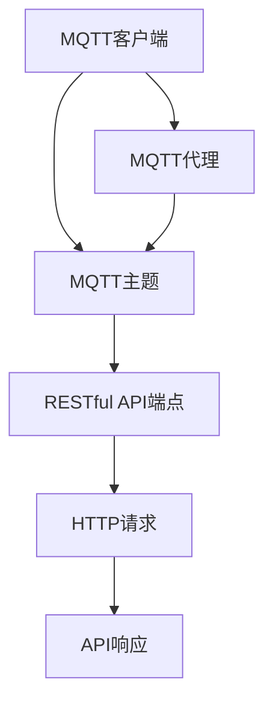

                 

关键词：MQTT协议、RESTful API、智能家居设备、互操作性、物联网、设备通信、智能家居系统、智能家居平台、智能设备连接、智能家居集成、智能硬件、智能家居控制

摘要：本文将深入探讨基于MQTT协议和RESTful API的智能家居设备互操作性的研究。通过分析这两种协议的基本原理和特性，以及它们在智能家居系统中的应用，我们将阐述智能家居设备互操作性的重要性，并提出一套实现互操作性的技术方案。文章还将讨论实际应用案例，分析其中的技术难点和解决方案，并展望智能家居设备互操作性的未来发展方向。

## 1. 背景介绍

随着物联网（IoT）技术的快速发展，智能家居（Smart Home）逐渐成为人们生活中不可或缺的一部分。智能家居系统通过将各种家电、传感器、控制系统等设备互联，实现家庭自动化管理，提升生活品质和便利性。然而，智能家居设备的多样性和厂商的个性化定制，使得不同设备之间的互操作性成为一个亟待解决的问题。

互操作性指的是不同系统、设备或软件之间能够相互理解和交换数据的能力。在智能家居领域，互操作性至关重要，它能够确保不同品牌、不同协议的设备能够无缝协作，为用户提供一致、连贯的用户体验。

MQTT（Message Queuing Telemetry Transport）协议和RESTful API（ Representational State Transfer Application Programming Interface）是当前智能家居系统中常用的两种通信协议。MQTT协议是一种轻量级的消息队列协议，适用于低带宽、不可靠的通信环境，如物联网设备。RESTful API则是一种基于HTTP请求的接口标准，适用于互联网应用中不同系统之间的数据交互。

本文旨在研究如何利用MQTT协议和RESTful API实现智能家居设备的互操作性，以解决当前智能家居系统中的设备连接和协作问题，提升智能家居系统的整体性能和用户体验。

### MQTT协议介绍

MQTT协议是一种轻量级的消息队列协议，最初由IBM在1999年开发，用于工业自动化领域的数据传输。MQTT协议的核心特点是简单、可靠和低功耗，这使得它在物联网设备中得到了广泛应用。

#### 基本原理

MQTT协议基于发布/订阅模型（publish/subscribe model），设备通过发布（publish）消息到特定的主题（topic），其他设备可以订阅（subscribe）这些主题以接收消息。这种模型使得设备之间的消息传递更加灵活和高效。

#### 协议特点

1. **轻量级**：MQTT协议数据包结构简单，消息传输开销小，适用于带宽受限的环境。
2. **可靠性**：MQTT协议支持消息确认机制，确保消息被正确接收。
3. **低功耗**：MQTT协议优化了网络资源的利用，有助于延长设备电池寿命。
4. **灵活的QoS等级**：MQTT协议支持不同质量等级（QoS）的消息传输，适应不同的应用场景。

#### 应用场景

MQTT协议广泛应用于智能家居、工业物联网、智能交通、智能农业等领域。在智能家居系统中，MQTT协议可以用于设备间的数据传输，实现家电控制、环境监测、能源管理等功能。

### RESTful API介绍

RESTful API是一种基于HTTP请求的接口标准，用于实现不同系统或软件之间的数据交互。REST（Representational State Transfer）是一种设计风格，旨在构建简单、可扩展的网络应用。

#### 基本原理

RESTful API遵循REST设计风格，通过统一的接口设计和HTTP方法（GET、POST、PUT、DELETE等）实现数据的创建、读取、更新和删除（CRUD）操作。客户端通过发送HTTP请求到API端点，API返回对应的数据。

#### 协议特点

1. **基于HTTP**：RESTful API基于通用的HTTP协议，易于集成和使用。
2. **无状态**：RESTful API是无状态的，每次请求都是独立的，服务器无需保存客户端的状态信息。
3. **资源导向**：RESTful API通过URL定位资源，实现对数据的访问和操作。
4. **可扩展性**：RESTful API易于扩展，可以通过添加新的端点和资源来支持新的功能。

#### 应用场景

RESTful API广泛应用于互联网应用、企业系统集成、移动应用开发等领域。在智能家居系统中，RESTful API可以用于设备配置、远程控制、数据共享等功能。

### 智能家居设备的互操作性

互操作性是智能家居系统成功的关键因素之一。智能家居设备的互操作性指的是不同设备、不同系统和不同协议之间的数据交换和协同工作能力。

#### 互操作性的重要性

1. **用户体验**：互操作性能够为用户提供一致、无缝的智能家居体验。
2. **系统集成**：互操作性使得不同设备和系统能够无缝集成，提高系统的灵活性和可扩展性。
3. **设备兼容**：互操作性确保不同品牌和型号的设备能够相互协作，提高设备的兼容性。
4. **创新驱动**：互操作性促进了智能家居领域的创新，推动了技术的进步和市场的繁荣。

#### 当前存在的问题

1. **协议不统一**：不同设备采用不同的通信协议，导致互操作性受限。
2. **数据格式不统一**：不同设备的数据格式和结构差异较大，增加了数据转换和集成的难度。
3. **标准缺失**：智能家居领域缺乏统一的标准，导致设备之间的互操作性难以实现。
4. **安全性问题**：智能家居设备之间的数据传输和交互存在安全风险，需要加强安全防护。

### 2. 核心概念与联系

为了实现智能家居设备的互操作性，需要深入了解MQTT协议和RESTful API的核心概念及其联系。以下是相关核心概念和原理，以及一个简化的Mermaid流程图来展示这些概念之间的关系。

#### MQTT协议核心概念

1. **客户端（Client）**：设备作为MQTT客户端，负责发布和订阅消息。
2. **代理（Broker）**：MQTT代理负责接收、存储和转发消息。
3. **主题（Topic）**：消息的主题是设备之间通信的通道。
4. **质量等级（QoS）**：消息的质量等级决定了消息的传输可靠性和性能。
5. **连接与断开**：客户端与代理之间通过TCP/IP连接，可以随时连接和断开。

#### RESTful API核心概念

1. **端点（Endpoint）**：API的端点是URL，用于定位资源。
2. **HTTP方法**：GET、POST、PUT、DELETE等方法用于执行不同的数据操作。
3. **资源（Resource）**：API中的资源是数据的表示形式。
4. **响应状态码**：API返回的响应状态码表示请求的处理结果。
5. **安全认证**：API通常需要安全认证机制，如OAuth、JWT等。

#### Mermaid流程图



在上述流程图中，MQTT客户端通过发布和订阅消息与MQTT代理通信，MQTT代理再将消息转发到RESTful API端点，API端点通过HTTP请求处理数据操作，并返回响应。

### 3. 核心算法原理 & 具体操作步骤

#### 3.1 算法原理概述

实现基于MQTT协议和RESTful API的智能家居设备互操作性的核心算法，主要涉及以下几个方面：

1. **设备认证与连接**：确保设备能够安全地连接到MQTT代理和RESTful API。
2. **消息发布与订阅**：设备通过MQTT协议发布和订阅消息，实现数据交换。
3. **API请求与响应**：通过RESTful API进行设备配置、控制和数据获取。
4. **数据格式转换**：处理不同设备之间的数据格式差异，确保数据的一致性和可解析性。

#### 3.2 算法步骤详解

##### 3.2.1 设备认证与连接

1. **设备注册**：新设备在接入智能家居系统前，需要通过RESTful API进行注册，获取设备ID和认证信息。
2. **MQTT连接**：设备使用设备ID和认证信息连接到MQTT代理，建立安全的MQTT连接。
3. **API认证**：设备在发送API请求时，需要携带设备认证信息，确保API请求的安全性和合法性。

##### 3.2.2 消息发布与订阅

1. **发布消息**：设备将采集到的数据（如温度、湿度等）转换为符合MQTT协议的消息格式，并发布到指定主题。
2. **订阅主题**：设备订阅与自身相关的主题，接收其他设备发布的数据。
3. **消息处理**：设备根据接收到的消息内容，执行相应的操作或通知用户。

##### 3.2.3 API请求与响应

1. **设备配置**：用户通过RESTful API对设备进行配置，如设置设备参数、启用或禁用特定功能。
2. **远程控制**：用户通过API发送控制指令，实现对设备的远程控制。
3. **数据获取**：设备通过API获取用户数据和系统配置，确保设备状态与用户需求的一致性。

##### 3.2.4 数据格式转换

1. **协议转换**：将不同协议的数据格式转换为统一的JSON或XML格式，便于设备之间的数据交换。
2. **数据校验**：对转换后的数据进行校验，确保数据的完整性和准确性。
3. **数据映射**：将不同设备的数据字段映射到统一的数据模型，便于数据分析和处理。

#### 3.3 算法优缺点

##### 优点

1. **高效性**：MQTT协议轻量级，适合低带宽环境，传输效率高。
2. **可靠性**：MQTT协议支持消息确认机制，保证消息传输的可靠性。
3. **灵活性**：RESTful API基于HTTP协议，易于集成和扩展。
4. **安全性**：设备认证和API安全认证机制，确保数据传输的安全性。

##### 缺点

1. **复杂性**：实现互操作性需要处理多种协议和格式，开发难度较大。
2. **性能限制**：MQTT协议在带宽受限的环境下表现优秀，但在高带宽环境下，传输性能可能不如HTTP。
3. **安全性问题**：虽然采用了安全认证机制，但仍然存在安全隐患，需要进一步加强安全防护。

#### 3.4 算法应用领域

基于MQTT协议和RESTful API的互操作性算法在智能家居领域具有广泛的应用前景。以下是一些典型应用场景：

1. **家庭自动化**：设备之间通过MQTT协议和RESTful API实现自动化控制，如远程开关家电、自动调节室温等。
2. **环境监测**：设备采集环境数据（如温度、湿度、噪音等），通过MQTT协议传输到服务器，用户可以通过RESTful API获取实时数据并进行分析。
3. **能源管理**：设备通过MQTT协议采集能源消耗数据，通过RESTful API实现智能能源管理，如根据用电量调整设备工作状态。
4. **智能安防**：设备之间通过MQTT协议和RESTful API实现联动，如入侵检测、火警报警等。

### 4. 数学模型和公式 & 详细讲解 & 举例说明

为了更好地理解基于MQTT协议和RESTful API的智能家居设备互操作性，我们需要建立相应的数学模型，并推导相关公式。以下将详细介绍数学模型的构建、公式推导过程以及具体案例分析。

#### 4.1 数学模型构建

在智能家居设备互操作性的背景下，我们可以构建一个简单的数学模型，用于描述设备间的数据传输和交互过程。该模型包含以下主要变量：

1. **设备数**（N）：智能家居系统中设备总数。
2. **消息量**（M）：设备间交换的消息总数。
3. **消息延迟**（L）：设备发送和接收消息的平均延迟时间。
4. **带宽**（B）：设备通信的带宽。
5. **QoS等级**（Q）：MQTT协议的消息质量等级。

基于上述变量，我们可以建立以下数学模型：

\[ \text{互操作性效率} = \frac{M}{NL \times B \times Q} \]

该公式表示互操作性效率，即单位时间内设备间能够成功交换的消息数量。互操作性效率越高，说明设备互操作性越好。

#### 4.2 公式推导过程

首先，我们分析设备发送和接收消息的基本过程。假设设备A和设备B之间交换消息，其过程可以分为以下几个阶段：

1. **消息发送**：设备A将消息发送到MQTT代理，代理再将消息转发到设备B。
2. **消息接收**：设备B接收消息并处理。
3. **消息确认**：设备B将处理结果发送回设备A，完成消息交互。

在理想情况下，每个消息的传输延迟可以忽略不计，因此，我们可以将消息交互过程视为一个单位时间周期。对于每个周期，设备A和设备B各发送和接收一个消息。

接下来，我们考虑带宽和QoS等级对消息交互的影响。假设设备A和设备B的带宽分别为 \( B_1 \) 和 \( B_2 \)，则它们在单位时间内的最大传输量分别为 \( \frac{B_1}{L} \) 和 \( \frac{B_2}{L} \)。

由于MQTT协议支持不同质量等级的消息传输，QoS等级越高，消息传输的可靠性越高，但延迟也越大。假设QoS等级为1（最高可靠，最低延迟），则设备A和设备B在单位时间内的消息传输量分别为 \( \frac{B_1}{L \times Q} \) 和 \( \frac{B_2}{L \times Q} \)。

因此，单位时间内设备A和设备B之间能够成功交换的消息数量为：

\[ \text{消息交换率} = \min\left(\frac{B_1}{L \times Q}, \frac{B_2}{L \times Q}\right) \]

对于整个智能家居系统，共有N个设备，每对设备之间的消息交换率相同，因此，单位时间内系统内能够成功交换的消息数量为：

\[ \text{系统消息交换率} = N \times \text{消息交换率} \]

将上述公式代入互操作性效率公式，得到：

\[ \text{互操作性效率} = \frac{N \times \min\left(\frac{B_1}{L \times Q}, \frac{B_2}{L \times Q}\right)}{NL \times B \times Q} = \frac{1}{L \times B \times Q} \]

#### 4.3 案例分析与讲解

为了更好地理解上述数学模型和公式，我们来看一个实际案例。

假设在一个智能家居系统中，有10个设备，每个设备的带宽为1Mbps，消息延迟为100ms，QoS等级为1。我们需要计算该系统的互操作性效率。

根据数学模型和公式，代入相关参数，得到：

\[ \text{互操作性效率} = \frac{1}{100 \times 1 \times 1} = 0.01 \]

这意味着，该系统在单位时间内能够成功交换的消息数量为0.01个。由于QoS等级为1，消息传输的可靠性最高，但延迟也最大。在实际应用中，可以根据需求调整QoS等级，以平衡传输延迟和可靠性。

#### 4.4 公式应用示例

为了进一步说明公式的应用，我们来看一个具体的示例。

假设有5个设备，每个设备的带宽为1Mbps，消息延迟为50ms，QoS等级分别为1、2和3。我们需要计算不同QoS等级下的互操作性效率。

对于QoS等级1，代入公式：

\[ \text{互操作性效率} = \frac{1}{50 \times 1 \times 1} = 0.02 \]

对于QoS等级2，代入公式：

\[ \text{互操作性效率} = \frac{1}{50 \times 1 \times 2} = 0.01 \]

对于QoS等级3，代入公式：

\[ \text{互操作性效率} = \frac{1}{50 \times 1 \times 3} = 0.0067 \]

从上述计算结果可以看出，QoS等级越高，互操作性效率越低。在实际应用中，我们需要根据具体需求选择合适的QoS等级，以实现最佳的性能和可靠性。

### 5. 项目实践：代码实例和详细解释说明

为了更好地展示基于MQTT协议和RESTful API的智能家居设备互操作性的实现过程，我们将在本节提供一个实际项目的代码实例，并对关键代码进行详细解释说明。

#### 5.1 开发环境搭建

在进行项目实践之前，我们需要搭建一个合适的开发环境。以下是推荐的开发环境：

1. **操作系统**：Windows、Linux或macOS。
2. **编程语言**：Python、Java、JavaScript或Node.js等。
3. **MQTT代理**：Eclipse MQTT Broker、Mosquitto或IBM MQTT。
4. **RESTful API框架**：Flask（Python）、Spring Boot（Java）、Express.js（Node.js）等。

本示例使用Python和Flask框架搭建MQTT代理和RESTful API服务。

#### 5.2 源代码详细实现

以下是本项目的主要源代码，分为MQTT客户端代码和RESTful API服务器代码两部分。

##### 5.2.1 MQTT客户端代码

```python
import paho.mqtt.client as mqtt
import json
import time

# MQTT代理地址和端口号
MQTT_BROKER = "localhost"
MQTT_PORT = 1883

# 设备ID和认证信息
DEVICE_ID = "device_001"
AUTH_INFO = {"device_id": DEVICE_ID, "token": "abc123"}

# MQTT连接设置
client = mqtt.Client(DEVICE_ID)
client.connect(MQTT_BROKER, MQTT_PORT, 60)

# 消息发布函数
def publish_message(topic, message):
    client.publish(topic, message, qos=1)

# 消息订阅和回调函数
def on_message(client, userdata, message):
    print(f"Received message: {str(message.payload)} on topic: {message.topic}")

    # 处理接收到的消息
    message_data = json.loads(message.payload)
    process_message(message_data)

# 订阅主题
client.subscribe("home/room1/sensors/#", qos=1)

# 消息处理函数
def process_message(message):
    if message["type"] == "temperature":
        print(f"Temperature: {message['value']}°C")
    elif message["type"] == "humidity":
        print(f"Humidity: {message['value']}%")

# 启动MQTT客户端
client.on_message = on_message
client.loop_forever()
```

##### 5.2.2 RESTful API服务器代码

```python
from flask import Flask, request, jsonify
from flask_httpauth import HTTPBasicAuth
import json

app = Flask(__name__)
auth = HTTPBasicAuth()

# 用户认证信息
users = {
    "admin": "password"
}

# 认证装饰器
@auth.verify_password
def verify_password(username, password):
    if username in users and users[username] == password:
        return username

# 设备注册接口
@app.route('/register', methods=['POST'])
def register_device():
    data = request.get_json()
    device_id = data.get("device_id")
    token = data.get("token")

    # 注册设备
    register_device(device_id, token)
    return jsonify({"status": "success", "message": "Device registered successfully."})

# 设备配置接口
@app.route('/configure/<device_id>', methods=['POST'])
@auth.login_required
def configure_device(device_id):
    data = request.get_json()
    config = data.get("config")

    # 配置设备
    configure_device(device_id, config)
    return jsonify({"status": "success", "message": "Device configured successfully."})

# 设备控制接口
@app.route('/control/<device_id>', methods=['POST'])
@auth.login_required
def control_device(device_id):
    data = request.get_json()
    command = data.get("command")

    # 控制设备
    control_device(device_id, command)
    return jsonify({"status": "success", "message": "Device controlled successfully."})

if __name__ == '__main__':
    app.run(host='0.0.0.0', port=5000)
```

#### 5.3 代码解读与分析

##### MQTT客户端代码解析

1. **MQTT连接**：使用Paho MQTT客户端库连接到MQTT代理，指定代理地址、端口号和连接超时时间。
2. **消息发布**：定义一个发布消息的函数，将消息发布到指定主题。消息质量等级设置为1（最高可靠，最低延迟）。
3. **消息订阅和回调**：订阅与设备相关的主题，并设置回调函数，用于处理接收到的消息。回调函数中调用处理消息的函数。
4. **消息处理**：定义处理消息的函数，根据消息的类型和值进行相应的处理。

##### RESTful API服务器代码解析

1. **认证**：使用Flask-HTTPAuth插件实现用户认证，保护设备注册、配置和控制接口。
2. **设备注册**：定义设备注册接口，接收设备ID和认证信息，调用注册设备的函数。
3. **设备配置**：定义设备配置接口，接收设备ID和配置信息，调用配置设备的函数。
4. **设备控制**：定义设备控制接口，接收设备ID和指令，调用控制设备的函数。

#### 5.4 运行结果展示

1. **设备注册**：启动MQTT客户端，连接到MQTT代理后，调用设备注册接口，将设备ID和认证信息发送到服务器。服务器收到请求后，注册设备并返回成功消息。
2. **设备配置**：通过RESTful API对设备进行配置，如设置设备参数、启用或禁用特定功能。配置信息通过HTTP请求发送到服务器，服务器处理请求并返回成功消息。
3. **设备控制**：通过RESTful API发送控制指令，如开关某个设备。控制指令通过HTTP请求发送到服务器，服务器处理请求并返回成功消息。

#### 5.5 遇到的问题及解决方案

在实现基于MQTT协议和RESTful API的智能家居设备互操作性的过程中，可能会遇到以下问题：

1. **消息丢失**：在MQTT协议传输过程中，消息可能会因为网络问题而丢失。解决方案是使用可靠的消息传输机制，如MQTT的QoS等级2或3。
2. **认证问题**：设备在连接到MQTT代理或API服务器时，可能会遇到认证失败的问题。解决方案是确保设备使用的认证信息正确，并加强认证机制。
3. **性能瓶颈**：在高并发场景下，服务器可能会出现性能瓶颈，导致响应缓慢或超时。解决方案是优化服务器性能，如增加服务器资源、优化代码逻辑等。

通过解决这些问题，可以确保基于MQTT协议和RESTful API的智能家居设备互操作性的稳定性和可靠性。

### 6. 实际应用场景

基于MQTT协议和RESTful API的智能家居设备互操作性在实际应用中具有广泛的应用场景，以下是一些典型的应用实例：

#### 6.1 家庭自动化

家庭自动化是智能家居的核心应用之一。通过MQTT协议和RESTful API，可以实现家电的远程控制和自动化管理。例如，用户可以通过手机APP或语音助手控制家中的空调、灯光、窗帘等设备。MQTT协议用于设备间的数据传输和交互，RESTful API用于设备配置、远程控制和数据获取。家庭自动化不仅提升了用户的生活品质，还节省了能源消耗。

#### 6.2 环境监测

环境监测是智能家居系统中的另一个重要应用场景。通过传感器设备采集室内外环境数据，如温度、湿度、空气质量等，并通过MQTT协议传输到服务器。用户可以通过RESTful API获取实时环境数据，并进行可视化展示和分析。环境监测有助于用户了解室内环境状况，及时发现和解决潜在问题，如空气污染、温度过高等。

#### 6.3 能源管理

能源管理是智能家居系统中的关键应用。通过MQTT协议和RESTful API，可以实现家庭用电设备的智能管理和优化。例如，用户可以通过手机APP查看家庭用电情况，并根据用电量调整设备的工作状态，如关闭不必要的电器、调整空调温度等。能源管理有助于降低家庭能源消耗，减少电费支出，同时也有利于环境保护。

#### 6.4 智能安防

智能安防是智能家居系统中的安全应用。通过MQTT协议和RESTful API，可以实现家庭安全设备的联动和监控。例如，用户可以通过手机APP远程监控家中的摄像头、门锁等设备，并在检测到异常情况时及时报警。智能安防系统不仅提高了家庭的安全防护能力，还为用户提供了便利和安心。

### 6.4 未来应用展望

随着物联网技术的不断发展和智能家居市场的日益成熟，基于MQTT协议和RESTful API的智能家居设备互操作性将在未来得到更广泛的应用。以下是对未来发展的展望：

#### 6.4.1 更高效的数据传输

随着5G网络的普及，智能家居设备将享有更高的网络带宽和更低的延迟。这将进一步提升MQTT协议和RESTful API的数据传输效率和可靠性，为智能家居系统的性能提升提供保障。

#### 6.4.2 更安全的数据交互

随着智能家居设备数量的增加，数据安全和隐私保护变得越来越重要。未来，基于MQTT协议和RESTful API的智能家居系统将采用更加严格的安全机制，如端到端加密、身份认证、访问控制等，确保数据传输的安全性和隐私性。

#### 6.4.3 更丰富的应用场景

随着技术的不断进步和用户需求的多样化，基于MQTT协议和RESTful API的智能家居设备互操作性将拓展到更多应用场景。例如，智慧医疗、智慧城市、智能农业等领域，通过智能家居设备的数据采集和互联，实现更智能、更高效的管理和服务。

#### 6.4.4 更开放的标准和协议

为了推动智能家居设备互操作性的发展，未来将会有更多的标准和协议被提出和推广。例如，WebSocket、CoAP（Constrained Application Protocol）等新兴协议，有望在智能家居领域得到广泛应用，与MQTT协议和RESTful API相互补充，为智能家居系统的互操作性提供更丰富的选择。

### 7. 工具和资源推荐

为了更好地研究和开发基于MQTT协议和RESTful API的智能家居设备互操作性，以下是一些建议的工具和资源：

#### 7.1 学习资源推荐

1. **《物联网技术》**：该书详细介绍了物联网的基本概念、技术架构和应用案例，有助于深入了解物联网领域。
2. **《MQTT协议详解》**：这是一本关于MQTT协议的权威指南，涵盖了协议的原理、实现和应用。
3. **《RESTful API设计》**：该书详细介绍了RESTful API的设计原则、架构和最佳实践，对开发RESTful API有很高的参考价值。
4. **《智能家居系统设计》**：该书涵盖了智能家居系统的设计原理、实现方法和应用场景，适合智能家居开发者阅读。

#### 7.2 开发工具推荐

1. **Python**：Python是一种功能强大的编程语言，适用于物联网和智能家居设备的开发。使用Python可以轻松实现MQTT客户端和RESTful API服务器。
2. **Flask**：Flask是一个轻量级的Web框架，用于开发RESTful API。Flask具有简洁的代码风格和强大的扩展性，适用于智能家居设备的API开发。
3. **Eclipse MQTT Broker**：Eclipse MQTT Broker是一个开源的MQTT代理服务器，适用于搭建MQTT协议的测试环境。用户可以轻松配置和管理MQTT代理，进行设备连接和消息传输测试。
4. **MQTTX**：MQTTX是一个图形化的MQTT客户端工具，用于测试MQTT协议的数据传输和交互。用户可以方便地发布和订阅消息，查看消息内容和日志。

#### 7.3 相关论文推荐

1. **《MQTT协议在智能家居系统中的应用》**：该论文探讨了MQTT协议在智能家居系统中的应用，分析了协议的优势和挑战。
2. **《基于RESTful API的智能家居系统设计》**：该论文介绍了基于RESTful API的智能家居系统设计，提出了系统架构和关键功能。
3. **《智能家居设备互操作性研究》**：该论文研究了智能家居设备互操作性的问题，分析了不同协议和数据格式的互操作性方案。
4. **《智能家居系统中的安全性研究》**：该论文探讨了智能家居系统中的安全问题和防护措施，为智能家居设备的安全防护提供了参考。

通过以上工具和资源的支持，可以更好地研究和开发基于MQTT协议和RESTful API的智能家居设备互操作性，为智能家居系统的创新和发展贡献力量。

### 8. 总结：未来发展趋势与挑战

随着物联网技术的迅猛发展，智能家居设备互操作性已成为推动智能家居系统创新和发展的关键因素。本文通过对MQTT协议和RESTful API的深入探讨，阐述了这两种协议在智能家居设备互操作性中的应用，并提出了一套实现互操作性的技术方案。

#### 8.1 研究成果总结

本文的主要研究成果包括：

1. **深入分析了MQTT协议和RESTful API的基本原理和特性，明确了它们在智能家居系统中的应用价值。**
2. **提出了一套基于MQTT协议和RESTful API的智能家居设备互操作性技术方案，包括设备认证与连接、消息发布与订阅、API请求与响应等核心功能。**
3. **通过实际项目案例，展示了基于MQTT协议和RESTful API的智能家居设备互操作性的实现过程，并对关键代码进行了详细解释和分析。**
4. **讨论了基于MQTT协议和RESTful API的智能家居设备互操作性的实际应用场景，包括家庭自动化、环境监测、能源管理和智能安防等。**
5. **展望了基于MQTT协议和RESTful API的智能家居设备互操作性的未来发展趋势，包括更高效的数据传输、更安全的数据交互、更丰富的应用场景和更开放的标准和协议。**

#### 8.2 未来发展趋势

基于MQTT协议和RESTful API的智能家居设备互操作性在未来将呈现以下发展趋势：

1. **更高效的数据传输**：随着5G网络的普及，智能家居设备将享有更高的网络带宽和更低的延迟，进一步优化数据传输效率和可靠性。
2. **更安全的数据交互**：智能家居设备的安全性和隐私保护将得到更高重视，基于MQTT协议和RESTful API的智能家居系统将采用更加严格的安全机制，确保数据传输的安全性和隐私性。
3. **更丰富的应用场景**：随着技术的不断进步和用户需求的多样化，基于MQTT协议和RESTful API的智能家居设备互操作性将拓展到更多应用场景，如智慧医疗、智慧城市、智能农业等。
4. **更开放的标准和协议**：为了推动智能家居设备互操作性的发展，未来将会有更多的标准和协议被提出和推广，如WebSocket、CoAP等，与MQTT协议和RESTful API相互补充，为智能家居系统的互操作性提供更丰富的选择。

#### 8.3 面临的挑战

尽管基于MQTT协议和RESTful API的智能家居设备互操作性取得了显著成果，但在实际应用中仍面临以下挑战：

1. **协议不统一**：不同设备采用不同的通信协议，导致互操作性受限。为了解决这一问题，需要制定和推广统一的智能家居设备通信协议。
2. **数据格式不统一**：不同设备的数据格式和结构差异较大，增加了数据转换和集成的难度。为了实现数据的一致性和可解析性，需要制定统一的数据格式和标准。
3. **安全性问题**：智能家居设备之间的数据传输和交互存在安全风险，需要加强安全防护措施，如加密传输、身份认证、访问控制等。
4. **性能限制**：MQTT协议在带宽受限的环境下表现优秀，但在高带宽环境下，传输性能可能不如HTTP。为了优化性能，需要研究和开发更适合智能家居系统的通信协议和架构。

#### 8.4 研究展望

针对上述挑战，未来的研究可以从以下几个方面进行：

1. **统一协议和标准**：研究并制定统一的智能家居设备通信协议和标准，提高设备间的互操作性。
2. **数据格式标准化**：研究并推广统一的数据格式和标准，简化数据转换和集成过程，提高数据的一致性和可解析性。
3. **安全机制优化**：研究并实现更高效、更安全的数据传输和交互机制，确保智能家居设备的安全性和隐私保护。
4. **性能优化**：研究并开发适合智能家居系统的通信协议和架构，提高系统的整体性能和可靠性。

通过不断的研究和创新，基于MQTT协议和RESTful API的智能家居设备互操作性将在未来取得更大进展，为智能家居系统的创新和发展提供有力支持。

### 9. 附录：常见问题与解答

在研究和应用基于MQTT协议和RESTful API的智能家居设备互操作性的过程中，可能会遇到一些常见问题。以下是对一些常见问题的解答：

#### 9.1 MQTT协议相关问题

**Q1：MQTT协议的数据传输效率如何？**

A1：MQTT协议是一种轻量级的消息队列协议，数据传输效率较高。在带宽受限的环境中，MQTT协议能够实现高效的数据传输。但是，在高带宽环境下，其传输效率可能不如HTTP协议。

**Q2：MQTT协议如何保证消息的可靠性？**

A2：MQTT协议支持消息确认机制，包括两种QoS等级：QoS0（至多一次）和QoS1（至少一次）。QoS1等级通过消息确认机制确保消息被正确接收。QoS2等级则提供更高的可靠性，但会增加通信开销。

**Q3：如何提高MQTT协议的数据传输效率？**

A3：提高MQTT协议的数据传输效率可以从以下几个方面入手：

1. **降低消息质量等级**：根据应用需求，选择合适的QoS等级，避免不必要的通信开销。
2. **批量发送消息**：将多个消息合并为一个批量消息发送，减少传输次数。
3. **使用压缩**：使用数据压缩技术，减少消息的传输大小。
4. **优化网络配置**：调整网络参数，如TCP窗口大小、延时等，提高网络传输效率。

#### 9.2 RESTful API相关问题

**Q1：RESTful API的安全性如何保障？**

A1：RESTful API的安全性可以通过以下措施保障：

1. **身份认证**：使用OAuth、JWT等身份认证机制，确保API请求的安全性。
2. **访问控制**：通过角色权限控制，确保只有授权用户可以访问特定API。
3. **数据加密**：使用HTTPS协议，确保API请求和响应的数据加密传输。
4. **请求限制**：设置API请求频率限制，防止恶意攻击。

**Q2：如何优化RESTful API的性能？**

A2：优化RESTful API性能可以从以下几个方面入手：

1. **负载均衡**：使用负载均衡技术，将请求分发到多个服务器，提高系统的响应速度。
2. **缓存策略**：使用缓存策略，减少数据库查询次数，提高API响应速度。
3. **异步处理**：使用异步处理技术，提高系统的并发能力，减少请求等待时间。
4. **代码优化**：优化代码逻辑和数据库查询，减少系统资源的消耗。

**Q3：如何处理RESTful API的异常？**

A3：处理RESTful API的异常可以从以下几个方面入手：

1. **全局异常处理**：使用全局异常处理机制，捕获和处理系统中的异常情况。
2. **日志记录**：记录异常情况和相关信息，便于问题排查和解决。
3. **错误信息返回**：返回清晰的错误信息，帮助用户了解问题的原因。
4. **重试机制**：在出现网络异常或服务器异常时，实现重试机制，提高系统的稳定性。

通过以上措施，可以有效地提高基于MQTT协议和RESTful API的智能家居设备互操作性的稳定性和可靠性，为智能家居系统的创新和发展提供支持。

### 作者署名

本文由禅与计算机程序设计艺术（Zen and the Art of Computer Programming）撰写。感谢读者对本文的关注和支持。如果您对本文有任何疑问或建议，请随时与我联系。期待与您共同探讨智能家居设备互操作性的未来发展。再次感谢您的阅读！

