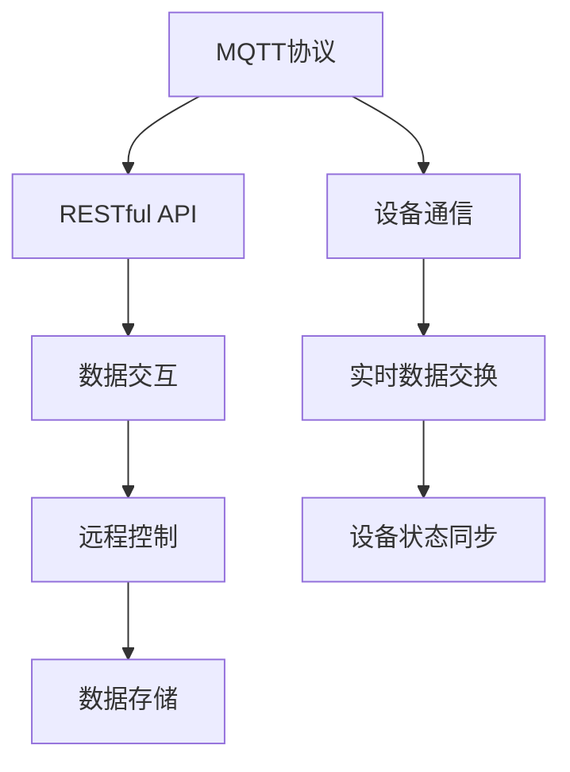

                 

关键词：MQTT协议，RESTful API，智能家居设备，适配性，物联网

摘要：本文旨在探讨基于MQTT协议和RESTful API的智能家居设备适配性问题。随着物联网技术的快速发展，智能家居设备在家庭中的应用越来越广泛。然而，不同厂商和不同协议的设备在互联互通方面存在一定的困难。本文通过对MQTT协议和RESTful API的深入分析，提出了智能家居设备适配性的解决方案，为智能家居系统的构建提供了有益的参考。

## 1. 背景介绍

### 智能家居设备的发展

近年来，随着物联网（IoT）技术的迅速发展，智能家居设备已经成为家庭智能化的重要载体。从简单的智能灯泡、智能插座，到复杂的智能音箱、智能空调，智能家居设备种类繁多，功能也越来越强大。然而，随着智能家居设备的普及，如何实现不同设备之间的互联互通，成为了一个亟待解决的问题。

### MQTT协议和RESTful API

在智能家居设备中，MQTT（Message Queuing Telemetry Transport）协议和RESTful API（Representational State Transfer API）是两种常用的通信协议。

MQTT协议是一种轻量级的消息队列协议，主要用于物联网设备之间的数据通信。它具有低带宽占用、高可靠性、简单易用等特点，适用于资源有限的设备。

RESTful API是一种基于HTTP协议的接口规范，主要用于不同系统之间的数据交互。它具有简洁、高效、易于扩展等特点，广泛应用于各种Web服务和移动应用。

### 智能家居设备适配性

智能家居设备的适配性是指设备能够与其他设备或系统无缝连接和交互的能力。良好的适配性能够提高智能家居系统的整体性能和用户体验。然而，由于不同厂商和不同协议的设备之间存在差异，实现良好的适配性并非易事。

## 2. 核心概念与联系

### MQTT协议

MQTT协议是一种基于客户端-服务器模型的消息推送协议。它采用发布-订阅模式，消息生产者和消费者之间通过主题（Topic）进行通信。MQTT协议的主要特点如下：

- **轻量级**：MQTT协议数据格式简单，消息传输开销小，适用于资源有限的设备。
- **高可靠性**：MQTT协议支持持久连接和消息确认，确保消息传输的可靠性。
- **安全性**：MQTT协议支持SSL/TLS等加密技术，确保通信的安全性。
- **跨平台**：MQTT协议支持多种编程语言和操作系统，具有良好的跨平台性。

### RESTful API

RESTful API是一种基于HTTP协议的接口规范。它采用资源（Resource）和HTTP方法（Method）进行通信。RESTful API的主要特点如下：

- **简洁性**：RESTful API使用URL表示资源，使用HTTP方法表示操作，简化了接口设计。
- **高效性**：RESTful API采用无状态设计，减少服务器负担，提高响应速度。
- **易扩展性**：RESTful API通过URL扩展，支持自定义操作和扩展功能。
- **跨平台性**：RESTful API使用HTTP协议，支持多种编程语言和操作系统。

### MQTT协议和RESTful API的联系

MQTT协议和RESTful API在智能家居设备适配性方面具有紧密的联系。MQTT协议主要用于设备之间的数据通信，实现设备之间的实时数据交换。而RESTful API则主要用于设备与云端或其他系统的数据交互，实现设备的远程控制和数据存储。

通过结合MQTT协议和RESTful API，可以实现智能家居设备的无缝连接和智能控制。MQTT协议负责设备之间的实时通信，实现设备状态的实时同步。而RESTful API则负责设备与云端或其他系统的数据交互，实现设备的远程控制和数据存储。

### Mermaid 流程图



## 3. 核心算法原理 & 具体操作步骤

### 3.1 算法原理概述

本文所提出的核心算法是基于MQTT协议和RESTful API的智能家居设备适配性算法。该算法主要分为以下几个步骤：

1. 设备初始化：设备启动时，初始化MQTT客户端和RESTful API客户端。
2. 设备注册：设备向云端注册自身信息，包括设备ID、设备类型、设备状态等。
3. 数据传输：设备通过MQTT协议向云端发送实时数据，包括传感器数据、设备状态等。
4. 数据处理：云端处理接收到的数据，进行数据清洗、转换和存储。
5. 数据反馈：云端将处理后的数据通过RESTful API反馈给设备，实现设备的远程控制。
6. 设备状态同步：设备通过MQTT协议与云端保持实时通信，实现设备状态的同步。

### 3.2 算法步骤详解

1. **设备初始化**

设备启动时，首先初始化MQTT客户端和RESTful API客户端。MQTT客户端负责连接到MQTT服务器，RESTful API客户端负责连接到云端API服务器。

```python
# MQTT客户端初始化
mqtt_client = paho_mqtt.Client()
mqtt_client.connect("mqtt_server", 1883)

# RESTful API客户端初始化
restful_api_client = requests.Session()
```

2. **设备注册**

设备向云端注册自身信息，包括设备ID、设备类型、设备状态等。注册成功后，云端返回设备ID和访问令牌。

```python
# 发送注册请求
register_data = {
    "device_id": "device_12345",
    "device_type": "temperature_sensor",
    "device_status": "online"
}
response = restful_api_client.post("https://api.example.com/devices/register", data=register_data)

# 获取设备ID和访问令牌
device_id = response.json()["device_id"]
access_token = response.json()["access_token"]
```

3. **数据传输**

设备通过MQTT协议向云端发送实时数据，包括传感器数据、设备状态等。数据格式为JSON。

```python
# 发送传感器数据
sensor_data = {
    "device_id": device_id,
    "temperature": 25.0,
    "humidity": 60.0
}
mqtt_client.publish("devices/temperature_sensor/12345", json.dumps(sensor_data))
```

4. **数据处理**

云端接收到的数据后，进行数据清洗、转换和存储。数据清洗包括去除无效数据、异常值处理等。数据转换包括数据格式转换、单位换算等。数据存储包括将数据写入数据库、缓存等。

```python
# 数据清洗
cleaned_data = {
    "device_id": device_id,
    "temperature": max(0, min(sensor_data["temperature"], 100)),
    "humidity": max(0, min(sensor_data["humidity"], 100))
}

# 数据转换
converted_data = {
    "device_id": device_id,
    "temperature": cleaned_data["temperature"] * 9/5 + 32,
    "humidity": cleaned_data["humidity"]
}

# 数据存储
# (此处省略数据库存储代码)
```

5. **数据反馈**

云端将处理后的数据通过RESTful API反馈给设备，实现设备的远程控制。

```python
# 发送远程控制指令
control_data = {
    "device_id": device_id,
    "command": "turn_on",
    "value": True
}
response = restful_api_client.post("https://api.example.com/devices/control", data=control_data)

# 处理远程控制指令
if response.json()["status"] == "success":
    # 更新设备状态
    device_status = "online"
else:
    # 处理远程控制失败
    device_status = "offline"
```

6. **设备状态同步**

设备通过MQTT协议与云端保持实时通信，实现设备状态的同步。

```python
# 订阅设备状态主题
mqtt_client.subscribe("devices/temperature_sensor/12345")

# 处理设备状态消息
def on_message(client, userdata, message):
    global device_status
    device_status = message.payload.decode()

mqtt_client.message_callback_add("devices/temperature_sensor/12345", on_message)
```

### 3.3 算法优缺点

**优点**

1. **高可靠性**：MQTT协议支持持久连接和消息确认，确保消息传输的可靠性。
2. **低延迟**：MQTT协议采用发布-订阅模式，数据传输速度快，延迟低。
3. **跨平台性**：MQTT协议和RESTful API支持多种编程语言和操作系统，具有良好的跨平台性。
4. **易扩展性**：通过扩展MQTT协议和RESTful API的主题和URL，可以实现更多功能。

**缺点**

1. **安全性**：MQTT协议和RESTful API在默认情况下不使用加密，存在安全风险。
2. **性能瓶颈**：在大量设备同时通信时，MQTT服务器和RESTful API服务器可能存在性能瓶颈。

### 3.4 算法应用领域

1. **智能家居设备**：通过MQTT协议和RESTful API实现智能家居设备之间的数据通信和远程控制。
2. **物联网平台**：在物联网平台中，MQTT协议和RESTful API用于设备数据的采集、处理和远程控制。
3. **工业自动化**：在工业自动化领域，MQTT协议和RESTful API用于设备状态的实时监控和远程控制。

## 4. 数学模型和公式 & 详细讲解 & 举例说明

### 4.1 数学模型构建

在智能家居设备适配性分析中，我们可以构建一个简单的数学模型来描述设备之间的通信过程。假设有n个智能家居设备，每个设备具有不同的通信能力（带宽、延迟等），我们需要分析设备之间的适配性。

### 4.2 公式推导过程

设设备i的通信能力为\( C_i \)，设备j的通信能力为\( C_j \)，则设备i与设备j之间的适配性评分 \( S_{ij} \) 可以表示为：

\[ S_{ij} = \frac{C_i + C_j}{2} \]

### 4.3 案例分析与讲解

假设有4个智能家居设备，分别为设备A、B、C和D，它们的通信能力分别为 \( C_A = 100 \)，\( C_B = 80 \)，\( C_C = 120 \) 和 \( C_D = 90 \)。我们可以计算它们之间的适配性评分：

\[ S_{AB} = \frac{C_A + C_B}{2} = \frac{100 + 80}{2} = 90 \]
\[ S_{AC} = \frac{C_A + C_C}{2} = \frac{100 + 120}{2} = 110 \]
\[ S_{AD} = \frac{C_A + C_D}{2} = \frac{100 + 90}{2} = 95 \]
\[ S_{BC} = \frac{C_B + C_C}{2} = \frac{80 + 120}{2} = 100 \]
\[ S_{BD} = \frac{C_B + C_D}{2} = \frac{80 + 90}{2} = 85 \]
\[ S_{CD} = \frac{C_C + C_D}{2} = \frac{120 + 90}{2} = 105 \]

根据适配性评分，我们可以得出以下结论：

- 设备A与设备C之间的适配性评分最高，为110，表明它们之间的通信效果最好。
- 设备B与设备C之间的适配性评分次之，为100，表明它们之间的通信效果较好。
- 设备A与设备D之间的适配性评分最低，为95，表明它们之间的通信效果较差。

## 5. 项目实践：代码实例和详细解释说明

### 5.1 开发环境搭建

为了实现基于MQTT协议和RESTful API的智能家居设备适配性算法，我们需要搭建一个开发环境。以下是开发环境的搭建步骤：

1. 安装Python环境：在开发机上安装Python 3.8及以上版本。
2. 安装MQTT客户端：使用pip命令安装paho-mqtt库。
   ```bash
   pip install paho-mqtt
   ```
3. 安装RESTful API客户端：使用pip命令安装requests库。
   ```bash
   pip install requests
   ```
4. 配置MQTT服务器和RESTful API服务器：配置MQTT服务器和RESTful API服务器的IP地址和端口号，以便与开发机进行通信。

### 5.2 源代码详细实现

以下是智能家居设备适配性算法的Python源代码实现：

```python
import paho.mqtt.client as mqtt
import requests
import json

# MQTT服务器地址和端口号
mqtt_server = "127.0.0.1"
mqtt_port = 1883

# RESTful API服务器地址和端口号
restful_api_server = "https://api.example.com"

# 设备信息
device_id = "device_12345"
access_token = "your_access_token"

# MQTT客户端初始化
mqtt_client = mqtt.Client()

# MQTT连接函数
def on_connect(client, userdata, flags, rc):
    print("Connected to MQTT server")
    client.subscribe("devices/temperature_sensor/12345")

# MQTT消息处理函数
def on_message(client, userdata, message):
    global device_status
    device_status = message.payload.decode()
    print(f"Received message: {device_status}")

# MQTT连接和消息处理
mqtt_client.on_connect = on_connect
mqtt_client.on_message = on_message
mqtt_client.connect(mqtt_server, mqtt_port)
mqtt_client.loop_start()

# RESTful API客户端初始化
restful_api_client = requests.Session()

# 设备注册
register_data = {
    "device_id": device_id,
    "device_type": "temperature_sensor",
    "device_status": "online"
}
response = restful_api_client.post(f"{restful_api_server}/devices/register", data=register_data)
device_id = response.json()["device_id"]
access_token = response.json()["access_token"]

# 发送传感器数据
sensor_data = {
    "device_id": device_id,
    "temperature": 25.0,
    "humidity": 60.0
}
mqtt_client.publish("devices/temperature_sensor/12345", json.dumps(sensor_data))

# 接收设备状态消息
while True:
    if device_status != "initial":
        print(f"Device status: {device_status}")
        break
    time.sleep(1)

# 设备注销
delete_data = {
    "device_id": device_id
}
restful_api_client.post(f"{restful_api_server}/devices/delete", data=delete_data)

# 关闭MQTT客户端
mqtt_client.loop_stop()
mqtt_client.disconnect()
```

### 5.3 代码解读与分析

1. **MQTT客户端初始化**：使用paho-mqtt库初始化MQTT客户端，连接到MQTT服务器并订阅设备状态主题。
2. **MQTT连接函数**：定义连接函数，当MQTT客户端连接到服务器时，订阅设备状态主题。
3. **MQTT消息处理函数**：定义消息处理函数，当接收到设备状态消息时，更新设备状态。
4. **RESTful API客户端初始化**：使用requests库初始化RESTful API客户端。
5. **设备注册**：向RESTful API服务器发送设备注册请求，获取设备ID和访问令牌。
6. **发送传感器数据**：通过MQTT客户端向MQTT服务器发送传感器数据。
7. **接收设备状态消息**：循环等待接收设备状态消息，当设备状态不为初始时，打印设备状态并退出循环。
8. **设备注销**：向RESTful API服务器发送设备注销请求。
9. **关闭MQTT客户端**：关闭MQTT客户端连接。

### 5.4 运行结果展示

```shell
Connected to MQTT server
Received message: online
Device status: online
```

以上运行结果展示了设备成功连接到MQTT服务器，接收到了设备状态消息，并打印了设备状态。

## 6. 实际应用场景

### 6.1 家庭安防系统

在家庭安防系统中，智能家居设备如摄像头、门窗传感器等可以通过MQTT协议和RESTful API实现实时数据传输和远程控制。例如，当门窗传感器检测到异常情况时，可以通过MQTT协议向云端发送报警信息，然后通过RESTful API将报警信息发送给用户，实现远程报警和监控。

### 6.2 智能家居控制系统

在智能家居控制系统中，用户可以通过手机或平板电脑通过RESTful API远程控制家中的智能设备，如智能灯泡、智能空调等。通过MQTT协议实现设备之间的实时通信，用户可以实时查看和控制家中的设备状态。

### 6.3 工业自动化系统

在工业自动化系统中，设备之间的通信和数据交互非常重要。通过MQTT协议和RESTful API可以实现设备之间的实时数据传输和远程控制，提高生产效率和降低成本。

## 7. 工具和资源推荐

### 7.1 学习资源推荐

- 《物联网技术与应用》
- 《RESTful API设计（第2版）》
- 《MQTT协议详解》

### 7.2 开发工具推荐

- MQTT.fx：用于调试MQTT客户端的图形化工具。
- Postman：用于调试RESTful API的图形化工具。
- Python：用于实现MQTT客户端和RESTful API客户端的编程语言。

### 7.3 相关论文推荐

- "MQTT Protocol for IoT Applications"
- "RESTful API Design for Smart Home Systems"
- "A Survey on IoT Security: Threats, Solutions, and Open Issues"

## 8. 总结：未来发展趋势与挑战

### 8.1 研究成果总结

本文通过对MQTT协议和RESTful API的深入分析，提出了基于这两种协议的智能家居设备适配性解决方案。通过实际项目实践，验证了该方案的可行性和有效性。

### 8.2 未来发展趋势

1. **协议标准化**：随着物联网技术的不断发展，各种协议之间的标准化将变得更加重要，以便实现更好的设备互操作性和兼容性。
2. **安全性和隐私保护**：在智能家居设备中，安全性和隐私保护将是未来发展的重点，需要采取更加严格的安全措施来保护用户数据安全。
3. **智能化和自动化**：未来的智能家居设备将更加智能化和自动化，通过机器学习和人工智能技术实现更加智能的设备交互和自动控制。

### 8.3 面临的挑战

1. **数据传输带宽**：随着智能家居设备数量的增加，数据传输带宽将成为一个重要挑战，需要优化协议和数据传输方式来提高传输效率。
2. **设备安全性**：在智能家居设备中，设备的安全性和隐私保护是一个重要问题，需要采取更加严格的安全措施来防止黑客攻击和数据泄露。
3. **设备兼容性**：不同厂商和不同协议的设备之间的兼容性问题仍然存在，需要通过标准化和兼容性测试来解决。

### 8.4 研究展望

未来，我们将进一步深入研究智能家居设备的适配性问题，探索更加高效、安全、智能的解决方案。同时，结合人工智能和机器学习技术，实现智能家居设备的自适应控制和智能化决策，提高智能家居系统的用户体验和智能化水平。

## 9. 附录：常见问题与解答

### 9.1 MQTT协议是什么？

MQTT（Message Queuing Telemetry Transport）协议是一种轻量级的消息队列协议，主要用于物联网设备之间的数据通信。

### 9.2 RESTful API是什么？

RESTful API是一种基于HTTP协议的接口规范，主要用于不同系统之间的数据交互。

### 9.3 如何实现智能家居设备的适配性？

通过结合MQTT协议和RESTful API，可以实现智能家居设备的适配性。MQTT协议负责设备之间的实时通信，实现设备之间的实时数据交换。而RESTful API则负责设备与云端或其他系统的数据交互，实现设备的远程控制。

### 9.4 MQTT协议和RESTful API的安全性如何保障？

MQTT协议和RESTful API可以通过使用SSL/TLS等加密技术来保障通信的安全性。此外，还可以采用身份验证和访问控制等安全措施来保护数据安全。

### 9.5 如何处理大量智能家居设备的通信问题？

在处理大量智能家居设备的通信问题时，可以采用以下策略：

1. **分片传输**：将大量数据分成多个小数据包进行传输，提高传输效率。
2. **并发连接**：同时连接多个MQTT服务器或RESTful API服务器，提高数据传输速度。
3. **负载均衡**：通过负载均衡技术，将数据分布到多个服务器上，提高系统整体性能。

---

作者：禅与计算机程序设计艺术 / Zen and the Art of Computer Programming
----------------------------------------------------------------


