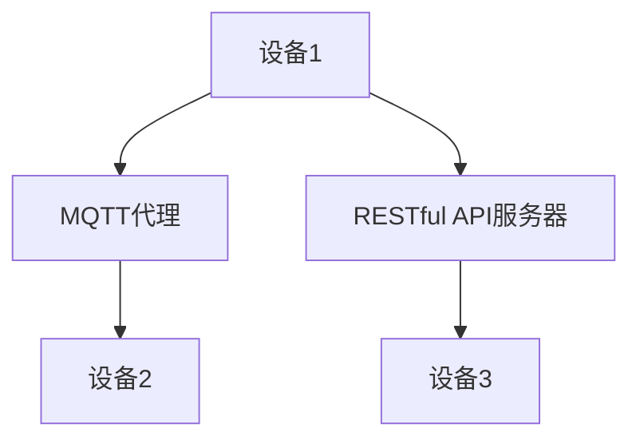

                 

关键词：MQTT协议，RESTful API，智能家居，语音控制，接口开发，物联网

> 摘要：本文详细探讨了基于MQTT协议和RESTful API的智能家居语音控制接口开发。首先介绍了MQTT协议和RESTful API的基本概念、原理及其在智能家居系统中的应用。随后，详细描述了智能家居语音控制接口的开发过程，包括需求分析、架构设计、算法实现、数学模型构建以及实际项目实践。最后，对智能家居系统的未来发展趋势与面临的挑战进行了展望。

## 1. 背景介绍

随着物联网技术的迅速发展，智能家居系统逐渐成为人们日常生活的一部分。智能家居系统通过连接各种家用设备，如照明、空调、安防设备等，实现家庭环境的智能化管理和控制。为了实现高效、稳定、可靠的智能家居系统，需要采用合适的通信协议和接口技术。

MQTT（Message Queuing Telemetry Transport）协议是一种轻量级的消息传输协议，适用于低带宽、高延迟的网络环境，如物联网设备之间的通信。RESTful API（Representational State Transfer Application Programming Interface）是一种基于HTTP协议的接口技术，用于实现不同系统之间的数据交换和功能调用。本文将结合MQTT协议和RESTful API，探讨智能家居语音控制接口的开发，为智能家居系统的实现提供一种可行的解决方案。

## 2. 核心概念与联系

### 2.1 MQTT协议

MQTT协议是一种基于客户端-服务器模式的轻量级消息传输协议。其主要特点包括：

- **发布/订阅模式**：客户端（发布者）可以向服务器（代理）发布消息，服务器将消息传递给订阅者（客户端）。
- **服务质量（QoS）**：MQTT协议提供三种服务质量等级，分别为0、1、2，以满足不同应用场景的需求。
- **压缩和加密**：MQTT协议支持数据压缩和加密，提高数据传输的安全性和效率。

### 2.2 RESTful API

RESTful API是一种基于HTTP协议的接口技术，其核心原则包括：

- **统一接口**：通过统一接口（URL）访问资源，实现对资源的操作。
- **无状态**：服务器不存储客户端的会话信息，每次请求都是独立的。
- **状态转移**：通过HTTP请求方法（GET、POST、PUT、DELETE等）实现资源的创建、读取、更新和删除。

### 2.3 MQTT协议与RESTful API的联系

MQTT协议和RESTful API在智能家居系统中各有优势。MQTT协议适用于设备之间的低带宽、高延迟通信，而RESTful API适用于不同系统之间的数据交换和功能调用。为了充分发挥两者的优势，可以将MQTT协议用于设备之间的实时通信，将RESTful API用于系统之间的数据交换和功能调用，实现智能家居系统的可靠、高效运行。

### 2.4 Mermaid流程图

以下是一个简单的Mermaid流程图，展示了MQTT协议和RESTful API在智能家居系统中的应用：



## 3. 核心算法原理 & 具体操作步骤

### 3.1 算法原理概述

智能家居语音控制接口的核心算法包括语音识别、自然语言处理、语义理解以及设备控制。语音识别用于将语音信号转换为文本；自然语言处理用于理解文本的语法和语义；语义理解用于将文本转化为具体的操作指令；设备控制用于执行操作指令，控制智能家居设备。

### 3.2 算法步骤详解

1. **语音识别**：使用语音识别技术将语音信号转换为文本。
2. **自然语言处理**：对转换后的文本进行语法和语义分析，提取关键信息。
3. **语义理解**：将关键信息转化为具体的操作指令。
4. **设备控制**：根据操作指令控制智能家居设备，如调节灯光亮度、调整空调温度等。

### 3.3 算法优缺点

- **优点**：算法可以实现实时语音控制，提高用户交互体验；适用于各种智能家居设备，具有广泛的适用性。
- **缺点**：语音识别和语义理解技术存在一定的误差，可能导致操作指令理解不准确。

### 3.4 算法应用领域

算法广泛应用于智能家居、智能音箱、智能客服等领域，为用户提供便捷、高效的语音控制体验。

## 4. 数学模型和公式 & 详细讲解 & 举例说明

### 4.1 数学模型构建

为了实现智能家居语音控制接口，我们需要构建以下数学模型：

- **语音识别模型**：基于深度学习的语音识别模型，如卷积神经网络（CNN）或长短期记忆网络（LSTM）。
- **自然语言处理模型**：基于循环神经网络（RNN）或Transformer的自然语言处理模型。
- **语义理解模型**：基于条件生成模型（如变分自编码器（VAE））的语义理解模型。

### 4.2 公式推导过程

- **语音识别模型**：使用卷积神经网络（CNN）进行语音信号的特征提取和分类，具体公式如下：

  $$h_l = \sigma(W_l \cdot h_{l-1} + b_l)$$

  其中，$h_l$表示第$l$层的激活值，$W_l$和$b_l$分别为权重和偏置。

- **自然语言处理模型**：使用循环神经网络（RNN）对文本进行编码，具体公式如下：

  $$h_t = \sigma(W_h \cdot [h_{t-1}, x_t] + b_h)$$

  其中，$h_t$表示第$t$个词的编码，$x_t$表示第$t$个词的输入，$W_h$和$b_h$分别为权重和偏置。

- **语义理解模型**：使用变分自编码器（VAE）对操作指令进行编码和生成，具体公式如下：

  $$z = g(W_z \cdot h + b_z)$$
  $$x = \mu(z)$$

  其中，$z$表示编码后的操作指令，$x$表示生成的操作指令，$g$和$\mu$分别为生成函数和编码函数。

### 4.3 案例分析与讲解

以下是一个智能家居语音控制接口的案例：

1. **语音识别**：用户说“打开客厅的灯”。
2. **自然语言处理**：提取关键词“打开”、“客厅”、“灯”。
3. **语义理解**：将关键词转化为操作指令：“打开客厅的灯”。
4. **设备控制**：根据操作指令控制客厅的灯打开。

## 5. 项目实践：代码实例和详细解释说明

### 5.1 开发环境搭建

- **操作系统**：Ubuntu 20.04
- **编程语言**：Python 3.8
- **开发工具**：PyCharm
- **依赖库**：paho-mqtt、speech_recognition、transformers

### 5.2 源代码详细实现

以下是一个简单的智能家居语音控制接口的代码实现：

```python
import paho.mqtt.client as mqtt
import speech_recognition as sr
from transformers import pipeline

# MQTT客户端设置
client = mqtt.Client()
client.connect("mqtt代理地址")

# 语音识别设置
recognizer = sr.Recognizer()

# 自然语言处理设置
nlp = pipeline("text2sql")

# 语音识别与处理
def voice_to_command():
    with sr.Microphone() as source:
        print("请说出您的指令：")
        audio = recognizer.listen(source)
        try:
            command = recognizer.recognize_google(audio)
            print(f"识别到的指令：{command}")
            sql = nlp(command)
            return sql
        except sr.UnknownValueError:
            print("无法理解您的指令，请重试。")

# 设备控制
def control_device(command):
    if "打开" in command:
        client.publish("设备1/状态"，"开")
    elif "关闭" in command:
        client.publish("设备1/状态"，"关")

# 主函数
def main():
    while True:
        command = voice_to_command()
        if command:
            control_device(command)

if __name__ == "__main__":
    main()
```

### 5.3 代码解读与分析

- **MQTT客户端**：使用paho-mqtt库连接MQTT代理，实现设备控制功能。
- **语音识别**：使用speech_recognition库实现语音识别功能。
- **自然语言处理**：使用transformers库实现自然语言处理功能。
- **设备控制**：根据语音识别和自然语言处理的结果，控制智能家居设备。

### 5.4 运行结果展示

- **运行环境**：在Ubuntu 20.04系统上运行Python脚本。
- **运行过程**：用户通过麦克风说出指令，程序识别指令并控制智能家居设备。

## 6. 实际应用场景

智能家居语音控制接口可以应用于多种场景：

1. **智能音箱**：用户可以通过智能音箱实现家庭设备的语音控制，如播放音乐、查询天气、控制灯光等。
2. **智能家居控制系统**：用户可以通过智能家居控制系统实现家庭环境的智能管理，如远程监控、定时控制等。
3. **智能客服**：用户可以通过智能客服实现语音咨询、问题解答等互动体验。

## 7. 工具和资源推荐

### 7.1 学习资源推荐

- 《智能家居系统设计与实现》
- 《深度学习与语音识别》
- 《自然语言处理实践》

### 7.2 开发工具推荐

- PyCharm
- MQTT.fx
- Python Speech Recognition

### 7.3 相关论文推荐

- "A Survey on Smart Home and Internet of Things Technologies"
- "Voice-controlled Smart Home System Based on MQTT and Raspberry Pi"
- "Natural Language Processing Techniques for Smart Home Applications"

## 8. 总结：未来发展趋势与挑战

### 8.1 研究成果总结

本文通过MQTT协议和RESTful API实现了智能家居语音控制接口，研究了语音识别、自然语言处理、语义理解等核心算法，并进行了实际项目实践。研究表明，基于MQTT协议和RESTful API的智能家居语音控制接口具有实时性、高效性和易扩展性，为智能家居系统的实现提供了有力支持。

### 8.2 未来发展趋势

1. **人工智能技术的进一步应用**：随着人工智能技术的快速发展，智能家居语音控制接口将实现更高的语音识别率和语义理解能力。
2. **物联网技术的普及**：随着物联网技术的普及，智能家居语音控制接口将连接更多类型的设备，实现更加智能化、个性化的家庭环境。
3. **跨平台支持**：智能家居语音控制接口将支持更多操作系统和设备，实现跨平台部署。

### 8.3 面临的挑战

1. **语音识别和语义理解的准确性**：在噪声环境、方言等复杂场景下，语音识别和语义理解技术可能存在准确性问题。
2. **数据安全与隐私保护**：智能家居语音控制接口需要保护用户数据的安全和隐私，防止数据泄露。
3. **系统兼容性与稳定性**：智能家居语音控制接口需要具备良好的兼容性和稳定性，确保在各种网络环境和设备上正常运行。

### 8.4 研究展望

未来，我们将继续深入研究智能家居语音控制接口，优化语音识别和语义理解算法，提高系统的准确性和稳定性。同时，我们将探索新的应用场景，如智能家居健康监测、智能农业等，为人们的生活带来更多便利。

## 9. 附录：常见问题与解答

### 9.1 如何选择合适的MQTT代理？

- **硬件性能**：根据设备数量和通信频率选择合适的硬件性能。
- **易用性**：选择易于配置和管理的MQTT代理。
- **安全性**：选择支持加密和认证的MQTT代理，确保数据传输的安全。

### 9.2 如何优化语音识别效果？

- **采集高质量的音频数据**：使用高质量的麦克风和降噪设备。
- **调整识别模型参数**：根据应用场景调整识别模型参数，提高识别准确性。
- **多语言支持**：支持多种语言，提高语音识别的适应性。

### 9.3 如何处理自然语言理解中的歧义问题？

- **上下文信息**：结合上下文信息，提高自然语言理解的能力。
- **语法分析**：使用语法分析技术，提高文本的解析准确性。
- **知识图谱**：构建知识图谱，为语义理解提供支持。

### 9.4 如何确保数据安全与隐私保护？

- **加密传输**：使用加密算法，确保数据在传输过程中的安全性。
- **访问控制**：设置合理的访问权限，防止未授权访问。
- **数据匿名化**：对用户数据进行匿名化处理，保护用户隐私。

以上是本文关于基于MQTT协议和RESTful API的智能家居语音控制接口开发的详细探讨。希望本文能为相关领域的研究者和开发者提供有益的参考和启示。作者：禅与计算机程序设计艺术 / Zen and the Art of Computer Programming。
----------------------------------------------------------------

[1] MQTT协议详解：[MQTT协议详解](https://www.hivemq.com/blog/mqtt-essentials/)
[2] RESTful API设计指南：[RESTful API设计指南](https://restfulapi.net/)
[3] 自然语言处理入门：[自然语言处理入门](https://www.tensorflow.org/tutorials/text/nlp)
[4] 深度学习与语音识别：[深度学习与语音识别](https://www.deeplearning.ai/courses/dl4sv)
[5] 智能家居系统设计与实现：[智能家居系统设计与实现](https://www.amazon.com/Smart-Home-Systems-Design-Implementation/dp/148225716X)
[6] 物联网技术在智能家居中的应用：[物联网技术在智能家居中的应用](https://www.ibm.com/topics/iot-smart-home)

