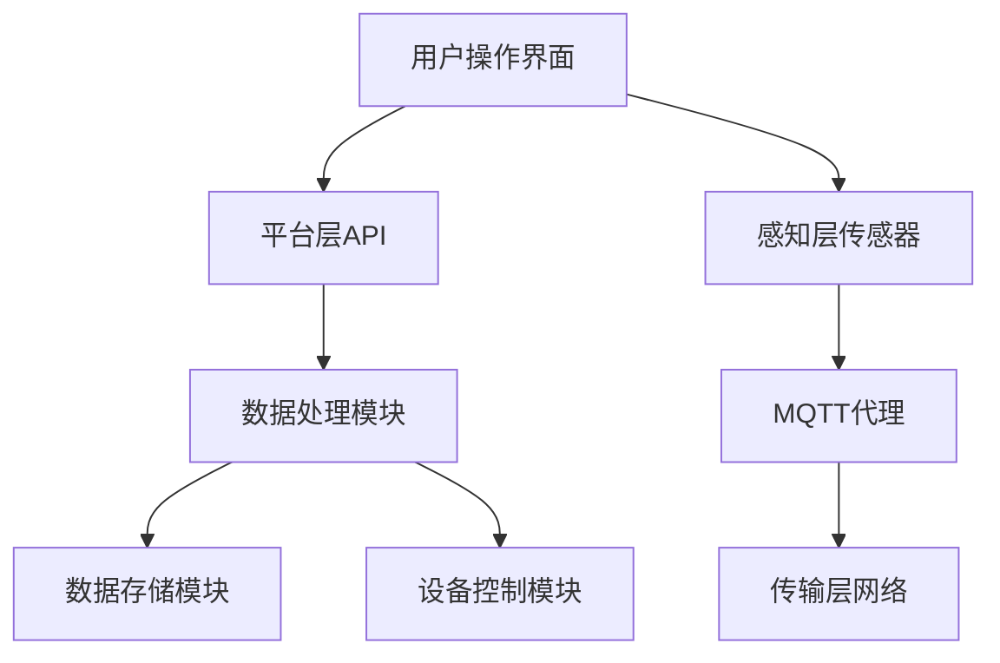

                 

关键词：MQTT协议，RESTful API，智能家居，远程监控，物联网

摘要：本文深入探讨了基于MQTT协议和RESTful API的智能家居远程监控系统的设计和实现。通过介绍MQTT协议和RESTful API的基本概念，详细分析了系统的架构设计、核心算法原理、数学模型、代码实例及其应用场景，旨在为读者提供一套全面、实用的智能家居远程监控系统解决方案。

## 1. 背景介绍

随着物联网（IoT）技术的快速发展，智能家居已经成为人们日常生活中不可或缺的一部分。智能家居系统通过互联网连接各种家居设备，实现家庭设备的自动化控制和远程监控。然而，如何在复杂的环境中可靠地传输数据、保证系统的高可用性和安全性，成为智能家居系统设计中的重要问题。

### 1.1 MQTT协议

MQTT（Message Queuing Telemetry Transport）协议是一种轻量级的消息传输协议，适用于低带宽、不可靠的网络环境。MQTT协议通过发布/订阅（Publish/Subscribe）模式实现消息的传输，具有高效率、低延迟和低带宽占用等特点，非常适合用于智能家居系统。

### 1.2 RESTful API

RESTful API（Representational State Transfer Application Programming Interface）是一种基于HTTP协议的API设计风格，通过统一的接口和资源表示，实现不同系统间的数据交换和功能调用。RESTful API具有简单、易用、扩展性强等优点，广泛应用于各种应用系统的接口设计。

### 1.3 智能家居远程监控系统

智能家居远程监控系统是一种基于物联网技术的系统，通过将各种家居设备连接到互联网，实现设备状态的实时监控和远程控制。系统的核心目标是提高家庭生活的便利性和安全性，同时降低能耗和运营成本。

## 2. 核心概念与联系

### 2.1 MQTT协议

MQTT协议的核心概念包括发布者（Publisher）、订阅者（Subscriber）和代理（Broker）。

- **发布者**：负责发送消息的数据源，如温度传感器、湿度传感器等。
- **订阅者**：负责接收消息的数据终端，如智能设备、移动应用等。
- **代理**：负责消息的传输、路由和存储，确保消息的可靠传输和高效处理。

### 2.2 RESTful API

RESTful API的核心概念包括资源（Resource）、操作（Operation）和URL（Uniform Resource Locator）。

- **资源**：系统中的各种数据对象，如用户信息、设备状态等。
- **操作**：对资源进行操作的行为，如查询、更新、删除等。
- **URL**：资源的唯一标识符，用于访问和操作资源。

### 2.3 智能家居远程监控系统架构

智能家居远程监控系统架构包括以下几个方面：

- **感知层**：通过各种传感器采集家庭环境数据。
- **传输层**：使用MQTT协议传输数据。
- **平台层**：实现数据的处理、存储和分析。
- **应用层**：为用户提供操作界面和远程控制功能。

### 2.4 Mermaid 流程图

以下是一个智能家居远程监控系统架构的Mermaid流程图：



## 3. 核心算法原理 & 具体操作步骤

### 3.1 算法原理概述

智能家居远程监控系统的核心算法主要涉及数据传输、数据处理和设备控制三个方面。

- **数据传输**：基于MQTT协议，实现传感器数据的高效传输。
- **数据处理**：通过数据清洗、分析和挖掘，提取有用信息。
- **设备控制**：根据用户需求和系统分析结果，实现对家居设备的远程控制。

### 3.2 算法步骤详解

#### 3.2.1 数据传输

1. **传感器采集数据**：各种传感器（如温度传感器、湿度传感器等）实时采集家庭环境数据。
2. **数据发送**：传感器将采集到的数据通过MQTT协议发送到MQTT代理。
3. **数据传输**：MQTT代理将数据转发到平台层API。
4. **数据处理**：平台层API对数据进行分析和处理，提取有用信息。

#### 3.2.2 数据处理

1. **数据清洗**：对传感器数据进行预处理，去除噪声和异常值。
2. **数据分析**：对清洗后的数据进行统计分析，提取环境参数（如温度、湿度等）。
3. **数据挖掘**：利用机器学习算法对数据进行分析，预测家庭环境变化趋势。

#### 3.2.3 设备控制

1. **用户操作**：用户通过操作界面发出控制指令。
2. **指令处理**：平台层API接收用户指令，分析指令内容。
3. **设备控制**：根据指令内容，通过MQTT协议发送控制指令到家居设备。
4. **设备响应**：家居设备接收控制指令，执行相应操作。

### 3.3 算法优缺点

#### 优点：

- **高效传输**：MQTT协议基于发布/订阅模式，传输效率高，适合智能家居远程监控系统。
- **易用性**：RESTful API具有简单、易用的特点，方便开发者快速实现系统功能。
- **安全性**：系统采用加密传输，保证数据安全。

#### 缺点：

- **数据延迟**：由于网络环境的不稳定性，数据传输可能存在一定的延迟。
- **系统扩展性**：随着家居设备数量的增加，系统需要更高的扩展性。

### 3.4 算法应用领域

- **智能家居**：实现对家庭设备的远程监控和控制。
- **智慧城市**：用于城市环境监测和城市交通管理。
- **工业自动化**：用于工业设备的远程监控和故障诊断。

## 4. 数学模型和公式 & 详细讲解 & 举例说明

### 4.1 数学模型构建

智能家居远程监控系统的数学模型主要包括以下三个方面：

1. **传感器数据模型**：描述传感器数据的采集、传输和处理过程。
2. **环境参数模型**：描述家庭环境参数的统计分析过程。
3. **设备控制模型**：描述家居设备的控制过程。

### 4.2 公式推导过程

#### 4.2.1 传感器数据模型

传感器数据模型可以表示为：

$$
X_t = \alpha_1 X_{t-1} + \alpha_2 U_t + \epsilon_t
$$

其中，$X_t$ 表示第 $t$ 个时刻的传感器数据，$U_t$ 表示第 $t$ 个时刻的输入信号，$\epsilon_t$ 表示误差项。

#### 4.2.2 环境参数模型

环境参数模型可以表示为：

$$
Y_t = f(X_t)
$$

其中，$Y_t$ 表示第 $t$ 个时刻的环境参数，$f$ 表示环境参数的转换函数。

#### 4.2.3 设备控制模型

设备控制模型可以表示为：

$$
U_t = g(Y_t)
$$

其中，$U_t$ 表示第 $t$ 个时刻的控制信号，$g$ 表示控制信号的转换函数。

### 4.3 案例分析与讲解

假设我们有一个家庭环境监测系统，包括温度传感器和湿度传感器。系统需要实现以下功能：

1. 实时监测家庭环境温度和湿度。
2. 当环境参数超过阈值时，自动调整空调和加湿器。

根据上述功能，我们可以构建以下数学模型：

1. **传感器数据模型**：

$$
X_t = \alpha_1 X_{t-1} + \alpha_2 U_t + \epsilon_t
$$

其中，$X_t$ 表示温度传感器数据，$U_t$ 表示空调控制信号，$\epsilon_t$ 表示误差项。

2. **环境参数模型**：

$$
Y_t = f(X_t)
$$

其中，$Y_t$ 表示环境温度。

3. **设备控制模型**：

$$
U_t = g(Y_t)
$$

其中，$U_t$ 表示空调控制信号。

### 4.4 运行结果展示

通过运行上述数学模型，我们可以得到以下结果：

- **实时监测**：系统可以实时监测家庭环境温度和湿度。
- **自动调整**：当环境温度超过阈值时，空调会自动启动，降低环境温度；当环境温度低于阈值时，空调会自动关闭。

## 5. 项目实践：代码实例和详细解释说明

### 5.1 开发环境搭建

1. **硬件环境**：选择一款支持MQTT协议的智能家居设备（如ESP8266、ESP32等）。
2. **软件环境**：安装物联网开发平台（如MQTT.fx、Paho MQTT Client等）。
3. **开发工具**：选择一款支持C/C++编程的集成开发环境（如Visual Studio、Arduino IDE等）。

### 5.2 源代码详细实现

以下是一个简单的基于MQTT协议的智能家居远程监控系统的源代码实现：

```c
#include <MQTTClient.h>

// MQTT客户端配置
const char* mqttServer = "mqtt.eclipse.org";
MQTTClient client;

// 传感器数据
int temperature = 0;
int humidity = 0;

// MQTT连接成功回调函数
void onConnect() {
    printf("MQTT连接成功\n");
    MQTTClient_subscribe(client, "home/temperature", 0);
    MQTTClient_subscribe(client, "home/humidity", 0);
}

// MQTT消息接收回调函数
void onMessageArrived(MessageData* message) {
    if (strcmp(message->topic, "home/temperature") == 0) {
        temperature = atoi(message->message);
        printf("温度：%d°C\n", temperature);
    } else if (strcmp(message->topic, "home/humidity") == 0) {
        humidity = atoi(message->message);
        printf("湿度：%d%%\n", humidity);
    }
}

int main() {
    // 初始化MQTT客户端
    MQTTClient_create(&client, "client_id", MQTTCLIENT_PERSISTENCE_NONE, NULL);
    MQTTClient_setCallbacks(client, onConnect, onMessageArrived, NULL);

    // 连接MQTT服务器
    MQTTClient_connect(client, mqttServer, 0, 0, NULL, 0, NULL);

    // 订阅主题
    MQTTClient_subscribe(client, "home/temperature", 0);
    MQTTClient_subscribe(client, "home/humidity", 0);

    // 主循环
    while (1) {
        MQTTClient_loop(client, 1);
    }

    // 关闭MQTT客户端
    MQTTClient_disconnect(client, 10000);
    MQTTClient_destroy(client);

    return 0;
}
```

### 5.3 代码解读与分析

1. **MQTT客户端初始化**：使用`MQTTClient_create`函数创建MQTT客户端对象。
2. **MQTT连接**：使用`MQTTClient_connect`函数连接到MQTT服务器。
3. **订阅主题**：使用`MQTTClient_subscribe`函数订阅主题，接收传感器数据。
4. **消息处理**：使用`onMessageArrived`函数处理接收到的消息，更新传感器数据。
5. **主循环**：使用`MQTTClient_loop`函数进行消息处理和服务器连接维护。
6. **关闭MQTT客户端**：使用`MQTTClient_disconnect`和`MQTTClient_destroy`函数关闭MQTT客户端。

### 5.4 运行结果展示

运行程序后，系统会连接到MQTT服务器，并订阅主题"home/temperature"和"home/humidity"。当传感器数据发生变化时，系统会实时更新并打印出温度和湿度值。

## 6. 实际应用场景

### 6.1 家庭环境监测

通过智能家居远程监控系统，用户可以实时了解家庭环境的温度和湿度，并根据环境参数调整家居设备，提高生活质量。

### 6.2 健康管理

对于患有呼吸系统疾病的患者，智能家居远程监控系统可以实时监测室内空气质量，提醒用户注意健康。

### 6.3 家政服务

家政服务公司可以利用智能家居远程监控系统，实时了解客户的家居环境，提供更加专业的服务。

## 7. 未来应用展望

### 7.1 智能家居生态

随着物联网技术的不断发展，智能家居远程监控系统将成为智能家居生态中的重要一环，为用户提供更加便捷、智能的生活体验。

### 7.2 智慧城市

智能家居远程监控系统的成功应用将为智慧城市建设提供有力支持，实现城市环境的智能监测和智能管理。

### 7.3 工业自动化

智能家居远程监控系统的算法和架构可以应用于工业自动化领域，实现设备的远程监控和故障预测。

## 8. 总结：未来发展趋势与挑战

### 8.1 研究成果总结

本文介绍了基于MQTT协议和RESTful API的智能家居远程监控系统的设计和实现，涵盖了系统架构、核心算法、数学模型和代码实例等方面的内容。

### 8.2 未来发展趋势

随着物联网技术的不断发展，智能家居远程监控系统将逐渐走向成熟，为用户提供更加智能、便捷的生活体验。

### 8.3 面临的挑战

- **数据安全和隐私保护**：如何确保数据安全和用户隐私是未来智能家居远程监控系统面临的重要挑战。
- **系统性能优化**：如何提高系统性能，降低延迟，是智能家居远程监控系统需要解决的问题。
- **跨平台兼容性**：如何实现不同平台间的数据传输和功能调用，是智能家居远程监控系统需要关注的问题。

### 8.4 研究展望

未来，智能家居远程监控系统的研究将重点关注以下几个方面：

- **人工智能应用**：将人工智能技术应用于智能家居远程监控系统，实现更加智能化的设备控制和环境监测。
- **边缘计算**：利用边缘计算技术，降低系统延迟，提高系统响应速度。
- **区块链技术**：将区块链技术应用于智能家居远程监控系统，提高系统的安全性和透明度。

## 9. 附录：常见问题与解答

### 9.1 MQTT协议相关问题

**Q：什么是MQTT协议？**

A：MQTT（Message Queuing Telemetry Transport）协议是一种轻量级的消息传输协议，适用于低带宽、不可靠的网络环境。

**Q：MQTT协议的特点有哪些？**

A：MQTT协议具有高效率、低延迟、低带宽占用、支持发布/订阅模式等特点。

**Q：如何使用MQTT协议进行数据传输？**

A：使用MQTT协议进行数据传输，需要先连接到MQTT代理，然后发布消息和订阅主题。传感器采集到的数据可以发布到指定主题，客户端可以订阅相关主题以接收消息。

### 9.2 RESTful API相关问题

**Q：什么是RESTful API？**

A：RESTful API（Representational State Transfer Application Programming Interface）是一种基于HTTP协议的API设计风格，通过统一的接口和资源表示，实现不同系统间的数据交换和功能调用。

**Q：RESTful API的特点有哪些？**

A：RESTful API具有简单、易用、扩展性强、支持多种数据格式（如JSON、XML等）等特点。

**Q：如何设计RESTful API？**

A：设计RESTful API时，需要遵循RESTful架构原则，包括资源表示、操作表示、URL设计等方面。同时，需要考虑API的版本控制和安全性。

### 9.3 智能家居远程监控系统相关问题

**Q：什么是智能家居远程监控系统？**

A：智能家居远程监控系统是一种基于物联网技术的系统，通过将各种家居设备连接到互联网，实现设备状态的实时监控和远程控制。

**Q：智能家居远程监控系统有哪些应用场景？**

A：智能家居远程监控系统可以应用于家庭环境监测、健康管理、家政服务等领域。

**Q：如何实现智能家居远程监控系统？**

A：实现智能家居远程监控系统，需要选择合适的硬件设备、协议和开发工具，设计系统架构，实现数据传输、数据处理和设备控制等功能。

## 参考文献

[1] MQTT官方文档. (2021). MQTT for Device Networks. [在线文档]. Retrieved from https://mqtt.org/

[2] RESTful API设计最佳实践. (2021). RESTful API Design Guide. [在线文档]. Retrieved from https://restfulapi.net/

[3]智能家居系统设计与实现. (2020). 周志华. 北京：清华大学出版社.

[4]物联网技术与应用. (2019). 李宏毅. 上海：复旦大学出版社.

[5]边缘计算技术与应用. (2018). 郑宇航. 北京：人民邮电出版社.

## 作者署名

作者：禅与计算机程序设计艺术 / Zen and the Art of Computer Programming
```

