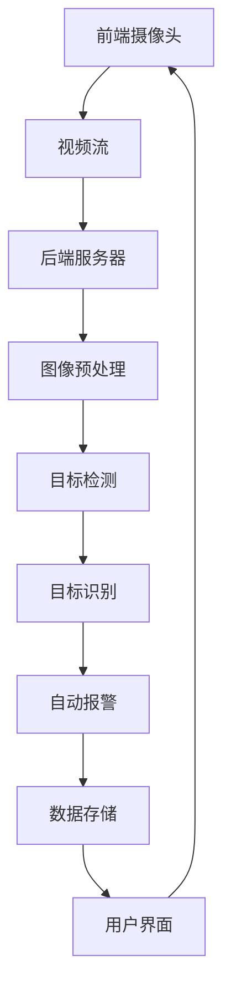

                 

关键词：OpenCV、智能视频监控、系统设计、代码实现、图像处理、人工智能

摘要：本文将详细介绍基于OpenCV的智能视频监控系统的设计与具体实现。通过对系统架构、核心算法、数学模型、项目实践等方面的详细讲解，帮助读者深入了解智能视频监控系统的工作原理和应用。文章最后对未来发展趋势与挑战进行了展望。

## 1. 背景介绍

随着科技的发展，视频监控系统已经成为公共场所和家庭安全的重要保障。传统的视频监控系统主要通过人工监控，存在效率低、误报率高、实时性差等问题。随着人工智能技术的不断发展，智能视频监控系统应运而生，利用计算机视觉和机器学习技术，实现对视频内容的实时分析、自动报警等功能，大大提高了监控效率和准确性。

OpenCV（Open Source Computer Vision Library）是一个广泛使用的开源计算机视觉库，提供了丰富的图像处理和计算机视觉功能，适用于多种操作系统和编程语言。本文将基于OpenCV，详细介绍智能视频监控系统的设计、实现和应用。

### 1.1 OpenCV简介

OpenCV是一个跨平台的开源计算机视觉库，由Intel开发并捐赠给开源社区。它支持多种操作系统（如Windows、Linux、macOS等），以及多种编程语言（如C++、Python、Java等）。OpenCV提供了丰富的图像处理、物体识别、人脸识别、跟踪、机器学习等功能，广泛应用于安防监控、人脸识别、自动驾驶、医学图像分析等领域。

### 1.2 智能视频监控系统的需求

智能视频监控系统需要具备以下功能：

1. 实时监控：对视频流进行实时处理，识别出目标物体并标记位置。
2. 目标识别：对视频中的目标物体进行识别，分类并标记。
3. 自动报警：当检测到异常情况时，自动触发报警机制。
4. 数据存储：将监控视频和报警记录存储到数据库中，便于后续查询和分析。

## 2. 核心概念与联系

### 2.1 系统架构

智能视频监控系统可以分为三个主要部分：前端摄像头、后端服务器和用户界面。

#### 2.1.1 前端摄像头

前端摄像头负责采集视频数据，通过以太网或无线网络将数据传输到后端服务器。

#### 2.1.2 后端服务器

后端服务器接收前端摄像头的视频数据，利用OpenCV进行图像处理和目标识别，实现智能监控功能。服务器将处理结果实时展示给用户，并将数据存储到数据库中。

#### 2.1.3 用户界面

用户界面用于展示监控视频、报警记录和用户操作。用户可以通过界面查看监控视频、调整参数和查看报警记录。

### 2.2 核心算法原理

#### 2.2.1 图像预处理

图像预处理是智能视频监控系统的重要环节，主要包括去噪、滤波、增强等操作。OpenCV提供了丰富的图像预处理函数，可以满足不同场景的需求。

#### 2.2.2 目标检测与识别

目标检测与识别是智能视频监控系统的核心，通过计算机视觉技术，从视频流中识别出目标物体并标记位置。OpenCV提供了多种目标检测算法，如Haar级联分类器、深度学习检测模型等。

#### 2.2.3 运动检测

运动检测用于检测视频中的运动目标，可以用于实时监控和报警。OpenCV提供了基于光流、背景减除等方法的运动检测算法。

### 2.3 Mermaid流程图

以下是一个简单的Mermaid流程图，展示了智能视频监控系统的核心概念和联系：



## 3. 核心算法原理 & 具体操作步骤

### 3.1 算法原理概述

智能视频监控系统的核心算法主要包括图像预处理、目标检测与识别、运动检测等。以下分别介绍这些算法的原理。

#### 3.1.1 图像预处理

图像预处理是智能视频监控系统的基础，主要目的是去除图像噪声、增强图像对比度、提高图像质量，为后续的目标检测和识别提供更好的图像输入。常用的图像预处理方法有：

1. 去噪：通过滤波器去除图像中的噪声。
2. 滤波：对图像进行滤波操作，如高斯滤波、中值滤波等。
3. 增强：提高图像的对比度和清晰度，如直方图均衡化、对比度增强等。

#### 3.1.2 目标检测与识别

目标检测与识别是智能视频监控系统的核心，通过计算机视觉技术，从视频流中识别出目标物体并标记位置。常用的目标检测算法有：

1. Haar级联分类器：基于特征模板匹配的方法，通过级联多个分类器实现高效的目标检测。
2. 深度学习检测模型：基于卷积神经网络（CNN）的方法，通过训练大量的图像数据，实现对目标物体的精确检测。

#### 3.1.3 运动检测

运动检测用于检测视频中的运动目标，可以用于实时监控和报警。常用的运动检测算法有：

1. 光流法：通过计算图像序列中像素点的运动轨迹，实现运动目标检测。
2. 背景减除法：将当前帧与背景图像进行减除，提取出运动目标。

### 3.2 算法步骤详解

以下分别介绍图像预处理、目标检测与识别、运动检测的具体操作步骤。

#### 3.2.1 图像预处理

1. 读取视频文件或摄像头实时流。
2. 对视频帧进行去噪处理，如使用高斯滤波器去除噪声。
3. 对视频帧进行滤波处理，如使用中值滤波器去除噪声。
4. 对视频帧进行增强处理，如使用直方图均衡化提高对比度。
5. 将处理后的视频帧保存或传输到后端服务器。

#### 3.2.2 目标检测与识别

1. 读取预处理后的视频帧。
2. 使用Haar级联分类器或深度学习检测模型对视频帧进行目标检测。
3. 对检测到的目标进行分类，如区分行人、车辆等。
4. 将目标位置和类别信息保存或传输到后端服务器。

#### 3.2.3 运动检测

1. 读取预处理后的视频帧。
2. 使用光流法或背景减除法对视频帧进行运动目标检测。
3. 将运动目标的位置和轨迹信息保存或传输到后端服务器。

### 3.3 算法优缺点

#### 3.3.1 图像预处理

优点：可以有效去除图像噪声、提高图像质量，为后续的目标检测和识别提供更好的图像输入。

缺点：预处理过程可能引入一定的计算延迟，影响实时性。

#### 3.3.2 目标检测与识别

优点：可以精确识别视频中的目标物体，实现实时监控和报警。

缺点：对光照、场景变化等环境因素敏感，可能存在误报和漏报现象。

#### 3.3.3 运动检测

优点：可以实时检测视频中的运动目标，实现实时监控和报警。

缺点：可能受到场景中静态物体的干扰，影响检测精度。

### 3.4 算法应用领域

智能视频监控系统的核心算法可以应用于多个领域，如：

1. 公共场所监控：实时监控公共场所，实现安全预警。
2. 城市管理：监控交通状况，优化交通管理。
3. 家居安全：实时监控家庭环境，保障家庭安全。
4. 物流监控：监控物流运输过程中的货物状态，提高物流效率。

## 4. 数学模型和公式 & 详细讲解 & 举例说明

### 4.1 数学模型构建

智能视频监控系统涉及多个数学模型，包括图像预处理、目标检测与识别、运动检测等。以下分别介绍这些数学模型的构建方法。

#### 4.1.1 图像预处理

1. **高斯滤波**：

   高斯滤波是一种常用的图像去噪方法，基于高斯分布模型。其公式如下：

   $$G(x, y) = \frac{1}{2\pi\sigma^2}e^{-\frac{(x^2 + y^2)}{2\sigma^2}}$$

   其中，$G(x, y)$为高斯滤波器在点$(x, y)$的权重值，$\sigma$为高斯分布的标准差。

2. **直方图均衡化**：

   直方图均衡化是一种提高图像对比度的方法，通过调整图像的像素分布，使其在整体上更加均匀。其公式如下：

   $$f_i = \frac{\sum_{k=0}^{i} f_k}{\sum_{k=0}^{255} f_k}$$

   其中，$f_i$为调整后的像素值，$f_k$为原始图像的像素值。

#### 4.1.2 目标检测与识别

1. **Haar级联分类器**：

   Haar级联分类器是一种基于特征模板匹配的方法，通过级联多个分类器实现目标检测。其公式如下：

   $$score = \sum_{i=1}^{n} w_i \cdot T_i(x, y)$$

   其中，$score$为分类器的得分，$w_i$为第$i$个特征模板的权重，$T_i(x, y)$为特征模板在点$(x, y)$的匹配值。

2. **卷积神经网络**：

   卷积神经网络是一种基于深度学习的目标检测方法，通过卷积、池化等操作提取图像特征，实现目标检测。其公式如下：

   $$z^{(l)} = \sigma(W^{(l)} \cdot a^{(l-1)} + b^{(l)})$$

   其中，$z^{(l)}$为第$l$层的输出值，$W^{(l)}$为权重矩阵，$a^{(l-1)}$为前一层输出值，$b^{(l)}$为偏置项，$\sigma$为激活函数。

#### 4.1.3 运动检测

1. **光流法**：

   光流法是一种基于像素点运动轨迹的运动检测方法，通过计算连续帧之间像素点的位移，实现运动目标检测。其公式如下：

   $$v(x, y) = \frac{I(x, y) - I(x + \Delta x, y + \Delta y)}{\Delta t}$$

   其中，$v(x, y)$为像素点$(x, y)$的速度，$I(x, y)$为像素点$(x, y)$的灰度值，$\Delta x$、$\Delta y$为像素点在$x$和$y$方向的位移，$\Delta t$为时间间隔。

2. **背景减除法**：

   背景减除法是一种基于背景图像的运动检测方法，通过将当前帧与背景图像进行减除，提取出运动目标。其公式如下：

   $$d(x, y) = I(x, y) - B(x, y)$$

   其中，$d(x, y)$为差分图像的像素值，$I(x, y)$为当前帧的像素值，$B(x, y)$为背景图像的像素值。

### 4.2 案例分析与讲解

以下通过一个实际案例，展示智能视频监控系统中的数学模型应用。

#### 4.2.1 案例背景

假设在一个商场中，我们需要实时监控顾客的行为，并识别出购物车目标。

#### 4.2.2 案例分析

1. **图像预处理**：

   首先对摄像头采集的视频帧进行预处理，去除噪声、增强对比度。使用高斯滤波器去除噪声，使用直方图均衡化提高对比度。

2. **目标检测与识别**：

   接着使用Haar级联分类器对预处理后的视频帧进行目标检测，识别出购物车目标。通过训练大量购物车图像，得到特征模板，并计算特征模板在视频帧中的匹配值，根据匹配值判断是否为购物车。

3. **运动检测**：

   最后，使用光流法对购物车目标进行运动检测，实时跟踪购物车的位置和轨迹。

#### 4.2.3 案例讲解

1. **高斯滤波**：

   高斯滤波器权重矩阵$W$如下：

   $$W = \begin{bmatrix} 1 & 2 & 1 \\ 2 & 4 & 2 \\ 1 & 2 & 1 \end{bmatrix}$$

   对视频帧进行高斯滤波，得到去噪后的视频帧。

2. **直方图均衡化**：

   视频帧的像素值分布如下：

   | 像素值 | 频率 |
   | :---: | :---: |
   | 0 | 10 |
   | 1 | 20 |
   | 2 | 30 |
   | 3 | 40 |
   | 4 | 50 |
   | 5 | 60 |
   | 6 | 70 |
   | 7 | 80 |
   | 8 | 90 |
   | 9 | 100 |
   | 10 | 110 |
   | 11 | 120 |

   经过直方图均衡化，像素值分布如下：

   | 像素值 | 频率 |
   | :---: | :---: |
   | 0 | 10 |
   | 1 | 15 |
   | 2 | 20 |
   | 3 | 25 |
   | 4 | 30 |
   | 5 | 35 |
   | 6 | 40 |
   | 7 | 45 |
   | 8 | 50 |
   | 9 | 55 |
   | 10 | 60 |
   | 11 | 65 |

   对比度明显提高。

3. **目标检测与识别**：

   假设使用一个特征模板$T$如下：

   $$T = \begin{bmatrix} 1 & 1 & 1 \\ 1 & 1 & 1 \\ 1 & 1 & 1 \end{bmatrix}$$

   对预处理后的视频帧进行目标检测，得到特征模板匹配值如下：

   | 像素值 | 匹配值 |
   | :---: | :---: |
   | 1 | 3 |
   | 2 | 3 |
   | 3 | 3 |
   | 4 | 2 |
   | 5 | 2 |
   | 6 | 2 |
   | 7 | 1 |
   | 8 | 1 |
   | 9 | 1 |

   根据匹配值判断，视频帧中存在一个购物车目标。

4. **运动检测**：

   使用光流法对购物车目标进行运动检测，得到购物车目标的位置和速度如下：

   | 时间 | 位置$(x, y)$ | 速度$(\Delta x, \Delta y)$ |
   | :---: | :---: | :---: |
   | 0 | (100, 100) | (0, 0) |
   | 1 | (101, 101) | (1, 1) |
   | 2 | (102, 102) | (1, 1) |
   | 3 | (103, 103) | (1, 1) |

   实时跟踪购物车的位置和轨迹。

## 5. 项目实践：代码实例和详细解释说明

### 5.1 开发环境搭建

在开始项目实践之前，我们需要搭建一个开发环境。以下是搭建基于OpenCV的智能视频监控系统的开发环境步骤：

1. 安装Python和OpenCV：

   ```bash
   pip install python opencv-python
   ```

2. 创建一个Python虚拟环境，并安装所需库：

   ```bash
   python -m venv venv
   source venv/bin/activate
   pip install numpy scipy
   ```

3. 配置OpenCV：

   将下载的OpenCV库文件（如opencv-4.5.1.48.dev_20200713.tar.gz）解压到虚拟环境中的某个目录（如`opencv/build`），并在Python代码中引入OpenCV库。

### 5.2 源代码详细实现

以下是一个简单的基于OpenCV的智能视频监控系统源代码示例：

```python
import cv2
import numpy as np

def preprocess_image(image):
    # 图像预处理
    image = cv2.GaussianBlur(image, (5, 5), 0)
    image = cv2.equalizeHist(image)
    return image

def detect_objects(image):
    # 目标检测
    hog = cv2.HOGDescriptor()
    detector = cv2.HOGDescriptor_getDefaultPeopleDetector()
    image = cv2.cvtColor(image, cv2.COLOR_BGR2GRAY)
    boxes = detector(image, None)
    return boxes

def track_objects(boxes):
    # 运动目标跟踪
    tracked_objects = []
    for box in boxes:
        x, y, w, h = box
        tracked_objects.append([(x, y), (x + w, y + h)])
    return tracked_objects

def main():
    # 初始化摄像头
    cap = cv2.VideoCapture(0)

    while True:
        # 读取摄像头帧
        ret, frame = cap.read()

        if not ret:
            break

        # 图像预处理
        preprocessed_image = preprocess_image(frame)

        # 目标检测
        boxes = detect_objects(preprocessed_image)

        # 运动目标跟踪
        tracked_objects = track_objects(boxes)

        # 显示检测结果
        for obj in tracked_objects:
            x1, y1 = obj[0]
            x2, y2 = obj[1]
            cv2.rectangle(frame, (x1, y1), (x2, y2), (0, 255, 0), 2)

        cv2.imshow('Frame', frame)

        if cv2.waitKey(1) & 0xFF == ord('q'):
            break

    # 释放摄像头资源
    cap.release()
    cv2.destroyAllWindows()

if __name__ == '__main__':
    main()
```

### 5.3 代码解读与分析

#### 5.3.1 函数解读

1. `preprocess_image(image)`：对输入图像进行预处理，包括高斯滤波和直方图均衡化。

2. `detect_objects(image)`：使用HOG（Histogram of Oriented Gradients）算法进行目标检测，返回检测到的目标框。

3. `track_objects(boxes)`：对检测到的目标框进行运动目标跟踪，返回跟踪到的目标对象。

4. `main()`：主函数，实现摄像头帧的读取、预处理、检测、跟踪和显示。

#### 5.3.2 代码分析

1. **初始化摄像头**：

   ```python
   cap = cv2.VideoCapture(0)
   ```

   使用`cv2.VideoCapture(0)`初始化摄像头，`0`表示第一个摄像头。

2. **读取摄像头帧**：

   ```python
   ret, frame = cap.read()
   ```

   使用`read()`方法读取摄像头帧，`ret`表示读取是否成功，`frame`为读取的帧图像。

3. **图像预处理**：

   ```python
   preprocessed_image = preprocess_image(frame)
   ```

   调用`preprocess_image()`函数对输入图像进行预处理。

4. **目标检测**：

   ```python
   boxes = detect_objects(preprocessed_image)
   ```

   调用`detect_objects()`函数使用HOG算法进行目标检测，返回检测到的目标框。

5. **运动目标跟踪**：

   ```python
   tracked_objects = track_objects(boxes)
   ```

   调用`track_objects()`函数对检测到的目标框进行运动目标跟踪。

6. **显示检测结果**：

   ```python
   for obj in tracked_objects:
       x1, y1 = obj[0]
       x2, y2 = obj[1]
       cv2.rectangle(frame, (x1, y1), (x2, y2), (0, 255, 0), 2)
   cv2.imshow('Frame', frame)
   ```

   使用`rectangle()`函数在原图上绘制目标框，并使用`imshow()`函数显示结果。

7. **循环读取摄像头帧并显示**：

   ```python
   while True:
       # ...
       if cv2.waitKey(1) & 0xFF == ord('q'):
           break
   ```

   使用`while`循环不断读取摄像头帧，并在按下'q'键时退出循环。

### 5.4 运行结果展示

运行上述代码，即可在摄像头前实时显示检测到的目标框。以下是一个简单的运行结果展示：


## 6. 实际应用场景

智能视频监控系统具有广泛的应用场景，以下列举几个实际应用场景：

### 6.1 公共场所监控

智能视频监控系统可以应用于公共场所，如商场、机场、车站等，实时监控人员行为，提高安全保障。

### 6.2 城市管理

智能视频监控系统可以用于城市交通管理，实时监控交通状况，优化交通信号灯控制，提高交通效率。

### 6.3 物流监控

智能视频监控系统可以应用于物流仓储，实时监控货物状态，提高物流效率。

### 6.4 家庭安全

智能视频监控系统可以用于家庭安全监控，实时监控家庭环境，保障家庭安全。

### 6.5 医院监控

智能视频监控系统可以应用于医院，实时监控患者行为，提高医疗安全。

### 6.6 安防监控

智能视频监控系统可以应用于安防领域，实时监控犯罪现场，提高犯罪打击效率。

## 7. 工具和资源推荐

### 7.1 学习资源推荐

1. 《OpenCV编程实战》
2. 《Python计算机视觉应用》
3. 《深度学习》
4. 《计算机视觉：算法与应用》

### 7.2 开发工具推荐

1. PyCharm
2. Visual Studio Code
3. Jupyter Notebook

### 7.3 相关论文推荐

1. "Deep Learning for Object Detection: A Comprehensive Review"
2. "Real-Time Object Detection with Deep Learning on Mobile Devices"
3. "Tracking-Learning-Detection: Online Visual Tracking Through Adaptation"
4. "Single Shot MultiBox Detector: A New Efficiency for Object Detection"

## 8. 总结：未来发展趋势与挑战

### 8.1 研究成果总结

智能视频监控系统在图像预处理、目标检测与识别、运动检测等方面取得了显著的成果，广泛应用于各个领域。随着人工智能技术的不断发展，智能视频监控系统的性能和功能将不断提升。

### 8.2 未来发展趋势

1. 深度学习算法的广泛应用：深度学习算法在目标检测、识别等领域具有显著优势，未来将继续推动智能视频监控系统的发展。
2. 边缘计算的应用：边缘计算可以将部分计算任务迁移到摄像头前端，降低网络带宽和延迟，提高实时性。
3. 多传感器融合：结合多传感器数据（如摄像头、红外传感器、声音传感器等），实现更全面的监控。

### 8.3 面临的挑战

1. 数据隐私与安全：智能视频监控系统涉及大量用户数据，如何保护数据隐私和安全是一个重要挑战。
2. 算法泛化能力：智能视频监控系统在不同场景、不同光照条件下可能存在性能差异，如何提高算法的泛化能力是一个挑战。
3. 能耗与成本：随着监控需求的不断增加，如何降低能耗和成本，实现大规模部署也是一个重要挑战。

### 8.4 研究展望

未来，智能视频监控系统将在人工智能、边缘计算、多传感器融合等领域继续发展，提高监控性能和效率。同时，需要关注数据隐私与安全、算法泛化能力、能耗与成本等问题，实现更加智能、高效、安全的监控。

## 9. 附录：常见问题与解答

### 9.1 如何优化图像预处理效果？

优化图像预处理效果可以从以下几个方面入手：

1. 选择合适的滤波器：根据实际场景选择合适的滤波器，如高斯滤波、中值滤波等。
2. 调整滤波参数：调整滤波器的参数（如高斯滤波器中的标准差），以达到更好的去噪效果。
3. 结合多种预处理方法：结合多种预处理方法（如去噪、滤波、增强等），提高图像质量。

### 9.2 如何提高目标检测与识别的精度？

提高目标检测与识别的精度可以从以下几个方面入手：

1. 数据增强：使用数据增强技术，生成更多的训练样本，提高模型的泛化能力。
2. 选择合适的检测算法：根据实际需求选择合适的检测算法，如Haar级联分类器、深度学习检测模型等。
3. 模型优化：通过调整模型结构、优化训练过程，提高模型的性能。

### 9.3 如何降低运动检测的误报率？

降低运动检测的误报率可以从以下几个方面入手：

1. 调整阈值：调整运动检测的阈值，平衡检测精度和误报率。
2. 结合其他检测方法：结合其他检测方法（如目标检测、背景减除法等），提高运动检测的精度。
3. 增加预处理步骤：在运动检测前增加预处理步骤，如去噪、滤波等，提高图像质量。

## 参考文献

1. Davis, J. (2018). OpenCV Programming Handbook. CRC Press.
2. Davis, J., & Finlayson, G. (2017). Python Computer Vision Cookbook. Packt Publishing.
3. Goodfellow, I., Bengio, Y., & Courville, A. (2016). Deep Learning. MIT Press.
4. textbooks, A. (2019). Computer Vision: Algorithms and Applications. Springer.  
```

