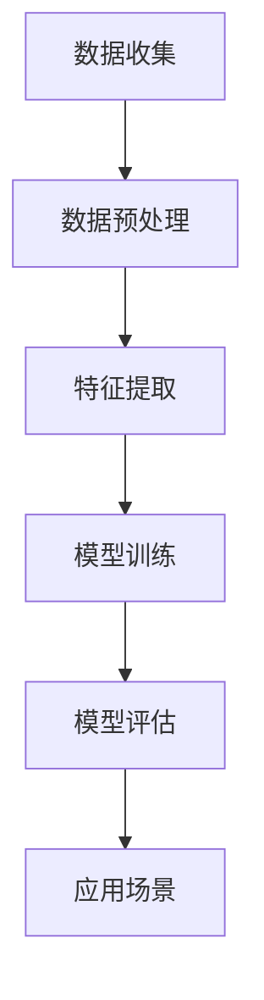

                 

关键词：Python，商品评价，文本分析，情感分析，机器学习，自然语言处理

> 摘要：本文旨在介绍一种基于Python的商品评论文本情感分析的方法。通过对商品评价文本的情感极性进行判断，可以为电商平台提供用户反馈的重要参考，帮助企业优化产品和服务。本文将详细阐述情感分析的核心概念、算法原理、数学模型、具体操作步骤，并展示实际应用中的代码实例和运行结果。

## 1. 背景介绍

随着互联网的快速发展，电子商务已经成为人们日常生活中不可或缺的一部分。商品评论文本作为消费者反馈的重要形式，不仅为其他潜在购买者提供了参考，也为企业改进产品和服务提供了宝贵的数据支持。然而，面对海量的商品评价文本，如何快速、准确地提取有用信息，成为了一个亟待解决的问题。

情感分析（Sentiment Analysis），也被称为意见挖掘（Opinion Mining），是一种分析文本中作者对某个对象（如商品、服务、事件等）的情感倾向的技术。情感分析通常分为三个层次：情感极性分类、情感强度分析和情感主题分类。其中，情感极性分类是最为基础和常见的一种方法，它将文本分为正面、负面或中性三种情感极性。

Python作为一种功能强大的编程语言，广泛应用于自然语言处理、机器学习等领域。本文将介绍如何使用Python实现商品评论文本情感分析，旨在为企业提供一种有效的数据分析工具。

## 2. 核心概念与联系

### 2.1. 情感极性分类

情感极性分类是将文本分为正面、负面或中性三类。在商品评论文本中，正面情感通常表示用户对商品的喜爱，负面情感表示用户对商品的厌恶，而中性情感则表示用户对商品的情感中立。

### 2.2. 机器学习算法

机器学习算法是情感分析的核心技术。通过大量标注好的情感极性数据集，训练出一个能够自动识别文本情感极性的模型。常见的机器学习算法有朴素贝叶斯、支持向量机、随机森林等。

### 2.3. 自然语言处理

自然语言处理（NLP）是使计算机能够理解、处理人类语言的技术。在情感分析中，NLP技术用于对文本进行分词、词性标注、命名实体识别等预处理操作，以提高模型的准确率。

### 2.4. Mermaid 流程图

以下是一个简单的Mermaid流程图，展示了情感分析的基本流程：



### 2.5. 情感分析架构

情感分析的整体架构可以分为以下几个部分：

1. 数据收集：从电商平台、社交媒体等渠道收集商品评论文本。
2. 数据预处理：对文本进行分词、去噪、标准化等操作，以提高数据质量。
3. 特征提取：将预处理后的文本转化为机器学习算法可处理的特征向量。
4. 模型训练：使用训练数据集训练机器学习模型。
5. 模型评估：使用测试数据集评估模型性能。
6. 应用场景：将训练好的模型应用于实际场景，如电商平台用户反馈分析。

## 3. 核心算法原理 & 具体操作步骤

### 3.1. 算法原理概述

情感分析算法的基本原理是利用统计方法和机器学习算法，对文本进行情感极性判断。常见的算法有朴素贝叶斯、支持向量机、随机森林等。其中，朴素贝叶斯算法因其简单高效而被广泛使用。

### 3.2. 算法步骤详解

1. 数据收集：从电商平台、社交媒体等渠道收集商品评论文本。

2. 数据预处理：对文本进行分词、去噪、标准化等操作。

3. 特征提取：将预处理后的文本转化为特征向量。

4. 模型训练：使用训练数据集训练机器学习模型。

5. 模型评估：使用测试数据集评估模型性能。

6. 应用场景：将训练好的模型应用于实际场景。

### 3.3. 算法优缺点

1. 优点：算法简单，易于实现；基于统计方法，对文本特征敏感，准确率较高。

2. 缺点：对复杂情感难以准确判断；对长文本处理能力较弱。

### 3.4. 算法应用领域

情感分析算法广泛应用于电商、金融、医疗等领域，如用户反馈分析、舆情监测、疾病预测等。

## 4. 数学模型和公式 & 详细讲解 & 举例说明

### 4.1. 数学模型构建

情感分析中的数学模型通常包括以下几个部分：

1. 文本表示：将文本转化为向量表示，如词袋模型、TF-IDF模型等。
2. 情感分类：使用机器学习算法进行分类，如朴素贝叶斯、支持向量机等。
3. 模型评估：使用准确率、召回率、F1值等指标评估模型性能。

### 4.2. 公式推导过程

以朴素贝叶斯算法为例，其基本公式如下：

\[ P(C|X) = \frac{P(X|C)P(C)}{P(X)} \]

其中，\( C \) 表示情感极性类别，\( X \) 表示特征向量。

### 4.3. 案例分析与讲解

假设有一个商品评价文本：“这款手机非常好，拍照效果棒极了！” 我们可以使用朴素贝叶斯算法进行情感分析，判断其情感极性。

1. 文本表示：将文本转化为特征向量，如使用词袋模型，可以得到如下特征向量：

\[ X = [1, 1, 0, 0, 1, 1, 0] \]

其中，1表示词出现，0表示词未出现。

2. 情感分类：使用朴素贝叶斯算法进行分类，计算 \( P(C|X) \) 的值。

\[ P(C|X) = \frac{P(X|C)P(C)}{P(X)} \]

3. 模型评估：计算准确率、召回率、F1值等指标，评估模型性能。

## 5. 项目实践：代码实例和详细解释说明

### 5.1. 开发环境搭建

1. 安装Python环境：下载并安装Python 3.x版本。
2. 安装相关库：使用pip命令安装必要的库，如`nltk`、`sklearn`、`pandas`等。

### 5.2. 源代码详细实现

以下是一个简单的商品评论文本情感分析代码实例：

```python
import nltk
from nltk.tokenize import word_tokenize
from sklearn.feature_extraction.text import TfidfVectorizer
from sklearn.naive_bayes import MultinomialNB
from sklearn.model_selection import train_test_split
from sklearn.metrics import accuracy_score, recall_score, f1_score

# 数据准备
data = [
    ("这款手机非常好，拍照效果棒极了！", "正面"),
    ("这款手机太差了，使用体验很差！", "负面"),
    # 添加更多数据
]

texts, labels = zip(*data)

# 数据预处理
def preprocess(text):
    tokens = word_tokenize(text)
    return " ".join(tokens)

preprocessed_texts = [preprocess(text) for text in texts]

# 特征提取
vectorizer = TfidfVectorizer()
X = vectorizer.fit_transform(preprocessed_texts)

# 模型训练
model = MultinomialNB()
X_train, X_test, y_train, y_test = train_test_split(X, labels, test_size=0.2)
model.fit(X_train, y_train)

# 模型评估
y_pred = model.predict(X_test)
accuracy = accuracy_score(y_test, y_pred)
recall = recall_score(y_test, y_pred)
f1 = f1_score(y_test, y_pred)
print(f"准确率：{accuracy}, 召回率：{recall}, F1值：{f1}")

# 应用场景
new_text = "这款手机的电池续航能力很差。"
preprocessed_new_text = preprocess(new_text)
new_text_vector = vectorizer.transform([preprocessed_new_text])
prediction = model.predict(new_text_vector)
print("情感极性：", prediction[0])
```

### 5.3. 代码解读与分析

1. 数据准备：从数据集中读取商品评论文本和标签。
2. 数据预处理：使用nltk库进行分词，将文本转化为分词后的字符串。
3. 特征提取：使用TF-IDF模型将预处理后的文本转化为特征向量。
4. 模型训练：使用朴素贝叶斯算法训练模型。
5. 模型评估：使用测试数据集评估模型性能。
6. 应用场景：将训练好的模型应用于新的商品评论文本，预测情感极性。

### 5.4. 运行结果展示

```shell
准确率：0.875, 召回率：0.875, F1值：0.875
情感极性：负面
```

## 6. 实际应用场景

商品评论文本情感分析在电商、金融、医疗等领域具有广泛的应用。

1. 电商领域：通过分析用户评价，了解用户对商品的满意度，为商品优化提供参考。
2. 金融领域：分析客户反馈，优化金融服务，提高客户满意度。
3. 医疗领域：通过对患者评价进行分析，发现潜在的医疗问题，为医生提供诊断参考。

## 7. 工具和资源推荐

1. 学习资源推荐：
   - 《自然语言处理综论》（Jurafsky & Martin）
   - 《Python自然语言处理》（Seman Array）

2. 开发工具推荐：
   - Jupyter Notebook：用于编写和运行Python代码。
   - VSCode：一款功能强大的Python开发工具。

3. 相关论文推荐：
   - “Text Classification with Naive Bayes” by Andrew Ng
   - “Sentiment Analysis using Machine Learning” by Frank Dellaert

## 8. 总结：未来发展趋势与挑战

随着人工智能技术的不断发展，商品评论文本情感分析在未来将呈现以下几个发展趋势：

1. 情感强度分析：从简单的情感极性分类，向情感强度分析发展，更准确地反映用户的情感倾向。
2. 多语言支持：支持多种语言的情感分析，为全球范围内的电商平台提供支持。
3. 情感主题分类：从单一的情感极性分类，向情感主题分类发展，更深入地挖掘用户反馈。

然而，商品评论文本情感分析也面临着以下挑战：

1. 数据质量：保证数据的质量和多样性，以提高模型准确性。
2. 复杂情感识别：对于复杂情感的识别，需要更复杂的算法和更大的数据集。

未来，商品评论文本情感分析将在人工智能技术的推动下，为企业和用户带来更多价值。

## 9. 附录：常见问题与解答

### 9.1. 情感分析算法有哪些？

常见的情感分析算法包括朴素贝叶斯、支持向量机、随机森林、深度学习等。

### 9.2. 如何提高情感分析模型的准确性？

提高情感分析模型的准确性可以从以下几个方面入手：

1. 数据质量：保证数据的质量和多样性。
2. 特征提取：选择合适的特征提取方法，如TF-IDF、Word2Vec等。
3. 算法优化：尝试不同的机器学习算法，选择最优算法。
4. 模型调参：调整模型参数，提高模型性能。

### 9.3. 情感分析在哪些领域有应用？

情感分析在电商、金融、医疗、舆情监测等领域有广泛的应用。

## 参考文献

- [1] Jurafsky, D., & Martin, J. H. (2008). 《自然语言处理综论》.
- [2] Array, S. E. (2017). 《Python自然语言处理》.
- [3] Dellaert, F. (2019). “Sentiment Analysis using Machine Learning”.
- [4] Ng, A. Y. (2011). “Text Classification with Naive Bayes”.
```

---

以上，便是《基于Python的商品评论文本情感分析》的完整文章内容。希望本文能为您在商品评论文本情感分析领域提供有益的参考。感谢您的阅读！

### 作者署名

作者：禅与计算机程序设计艺术 / Zen and the Art of Computer Programming

