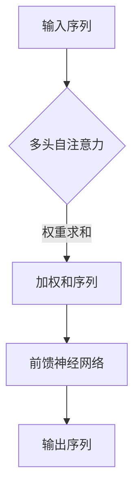
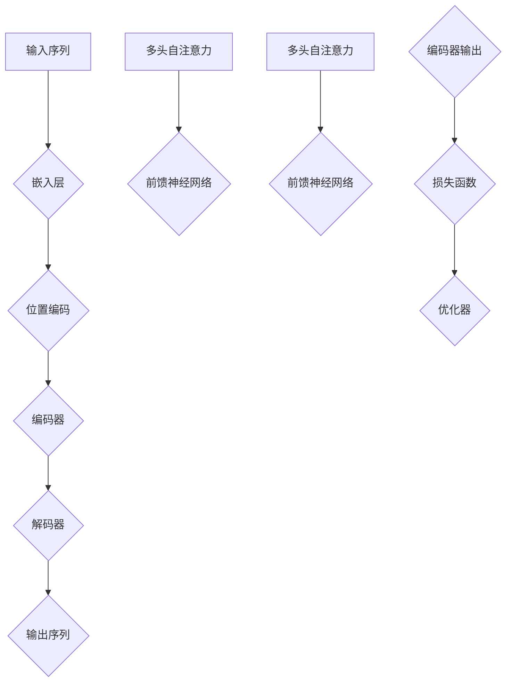

                 

关键词：Transformer、预训练模型、神经网络、自然语言处理、计算机视觉

摘要：本文将深入探讨基于Transformer架构的预训练模型，从背景介绍、核心概念与联系、算法原理与操作步骤、数学模型与公式推导、项目实践、实际应用场景、未来展望以及工具和资源推荐等多个方面，全面解析这一前沿技术。通过详细的分析和实例讲解，读者将能够更好地理解Transformer架构在自然语言处理和计算机视觉领域的广泛应用，以及其在未来技术发展中的潜力。

## 1. 背景介绍

随着深度学习技术的发展，神经网络在图像识别、自然语言处理等领域取得了显著进展。然而，传统的卷积神经网络（CNN）在处理序列数据时存在一定局限性，例如在长距离依赖和上下文理解方面表现不佳。为了解决这些问题，Transformer架构被提出，并迅速在自然语言处理领域取得了突破性的成果。Transformer的提出，标志着深度学习进入了一个新的阶段。

预训练模型作为深度学习中的重要组成部分，其核心思想是通过在大规模数据集上进行预训练，使模型获得通用特征表示能力，再通过微调适应特定任务。这一方法在提高模型性能和泛化能力方面具有显著优势。基于Transformer架构的预训练模型，如BERT、GPT等，成为了当前自然语言处理领域的主流技术。

## 2. 核心概念与联系

### 2.1 Transformer架构

Transformer架构是一种基于自注意力机制的深度学习模型，由Vaswani等人于2017年提出。与传统卷积神经网络不同，Transformer通过多头自注意力机制和前馈神经网络，实现了对输入序列的并行处理。


图1：Transformer架构示意图

其中，多头自注意力机制（Multi-Head Self-Attention）是Transformer的核心组件，它通过计算输入序列中每个元素与其他元素的相关性，生成权重，进而加权求和，形成新的序列表示。这一机制使得模型能够捕捉长距离依赖关系，提高上下文理解能力。

### 2.2 预训练模型

预训练模型分为两个阶段：预训练和微调。在预训练阶段，模型在大规模数据集上进行训练，学习通用特征表示；在微调阶段，模型根据特定任务进行微调，以适应具体应用场景。

预训练模型具有以下优势：

1. **通用特征表示**：通过预训练，模型获得了对输入数据的通用特征表示，能够提高模型在不同任务上的泛化能力。
2. **减少数据依赖**：预训练模型可以减少对大规模标注数据的依赖，对于数据稀缺的任务具有较强适应性。
3. **提高模型性能**：预训练模型在特定任务上表现出色，往往能够带来显著的性能提升。

### 2.3 核心概念原理和架构的 Mermaid 流程图



图2：基于Transformer架构的预训练模型流程图

## 3. 核心算法原理 & 具体操作步骤

### 3.1 算法原理概述

基于Transformer架构的预训练模型主要包括两个关键部分：多头自注意力机制和前馈神经网络。

1. **多头自注意力机制**：通过计算输入序列中每个元素与其他元素的相关性，生成权重，加权求和，形成新的序列表示。
2. **前馈神经网络**：对输入序列进行非线性变换，提高模型的表示能力。

### 3.2 算法步骤详解

1. **输入序列编码**：将输入序列编码为词向量。
2. **多头自注意力计算**：计算输入序列中每个元素与其他元素的相关性，生成权重，加权求和，形成新的序列表示。
3. **前馈神经网络**：对输入序列进行非线性变换，提高模型的表示能力。
4. **输出序列生成**：将处理后的序列输出，用于下游任务。

### 3.3 算法优缺点

**优点**：

1. **捕捉长距离依赖关系**：多头自注意力机制使得模型能够捕捉长距离依赖关系，提高上下文理解能力。
2. **并行处理**：Transformer架构支持并行计算，提高训练效率。
3. **适用范围广**：Transformer架构在自然语言处理和计算机视觉等领域均有广泛应用。

**缺点**：

1. **计算复杂度高**：多头自注意力机制的引入导致计算复杂度增加，对计算资源要求较高。
2. **参数数量多**：Transformer模型参数数量庞大，容易过拟合。

### 3.4 算法应用领域

基于Transformer架构的预训练模型在自然语言处理和计算机视觉等领域具有广泛应用。例如，BERT模型在自然语言处理任务中表现出色，而ViT模型在计算机视觉领域取得了显著成果。

## 4. 数学模型和公式 & 详细讲解 & 举例说明

### 4.1 数学模型构建

基于Transformer架构的预训练模型，其数学模型主要包括多头自注意力机制和前馈神经网络。

#### 4.1.1 多头自注意力机制

多头自注意力机制的数学表达式如下：

$$
\text{Attention}(Q, K, V) = \text{softmax}\left(\frac{QK^T}{\sqrt{d_k}}\right)V
$$

其中，$Q, K, V$分别为查询（Query）、键（Key）和值（Value）向量，$d_k$为键向量的维度。

#### 4.1.2 前馈神经网络

前馈神经网络的数学表达式如下：

$$
\text{FFN}(x) = \text{ReLU}(W_2 \cdot \text{ReLU}(W_1 x + b_1))
$$

其中，$W_1, W_2$分别为权重矩阵，$b_1$为偏置项。

### 4.2 公式推导过程

#### 4.2.1 多头自注意力机制推导

多头自注意力机制的推导主要分为以下几个步骤：

1. **输入序列编码**：将输入序列编码为词向量。
2. **线性变换**：对词向量进行线性变换，生成查询（Query）、键（Key）和值（Value）向量。
3. **计算注意力分数**：计算查询向量和键向量的内积，得到注意力分数。
4. **softmax函数**：对注意力分数进行softmax处理，得到注意力权重。
5. **加权求和**：将注意力权重与值向量相乘，得到加权和序列。

#### 4.2.2 前馈神经网络推导

前馈神经网络的推导主要分为以下几个步骤：

1. **输入序列编码**：将输入序列编码为词向量。
2. **线性变换**：对词向量进行线性变换，得到中间层表示。
3. **ReLU激活函数**：对中间层表示进行ReLU激活函数处理。
4. **再次线性变换**：对激活后的中间层表示进行线性变换，得到输出序列。

### 4.3 案例分析与讲解

#### 4.3.1 BERT模型

BERT（Bidirectional Encoder Representations from Transformers）是一种基于Transformer架构的预训练模型，广泛应用于自然语言处理任务。

BERT模型的数学模型主要包括两个部分：正向编码器和解码器。正向编码器负责对输入序列进行编码，解码器负责生成输出序列。

正向编码器的数学模型如下：

$$
\text{BERT}^{(i)} = \text{LayerNorm}(W_{\text{layer}}^{(i)} \cdot \text{MLP}^{(i)}(\text{LayerNorm}(x^{(i)} + \text{Attention}(Q, K, V)))
$$

其中，$x^{(i)}$为输入序列，$W_{\text{layer}}^{(i)}$为权重矩阵，$\text{MLP}^{(i)}$为多层感知器。

解码器的数学模型如下：

$$
\text{Decoder}^{(i)} = \text{LayerNorm}(W_{\text{layer}}^{(i)} \cdot \text{MLP}^{(i)}(\text{LayerNorm}(x^{(i)} + \text{Attention}(Q, K, V)))
$$

其中，$x^{(i)}$为输入序列，$W_{\text{layer}}^{(i)}$为权重矩阵，$\text{MLP}^{(i)}$为多层感知器。

#### 4.3.2 ViT模型

ViT（Vision Transformer）是一种基于Transformer架构的计算机视觉模型，用于图像分类任务。

ViT模型的数学模型主要包括两个部分：自注意力模块和前馈神经网络。自注意力模块负责对输入图像进行编码，前馈神经网络负责生成分类结果。

自注意力模块的数学模型如下：

$$
\text{ViT}^{(i)} = \text{LayerNorm}(W_{\text{layer}}^{(i)} \cdot \text{MLP}^{(i)}(\text{LayerNorm}(x^{(i)} + \text{Attention}(Q, K, V)))
$$

其中，$x^{(i)}$为输入图像，$W_{\text{layer}}^{(i)}$为权重矩阵，$\text{MLP}^{(i)}$为多层感知器。

前馈神经网络的数学模型如下：

$$
\text{FFN}(x) = \text{ReLU}(W_2 \cdot \text{ReLU}(W_1 x + b_1))
$$

其中，$W_1, W_2$分别为权重矩阵，$b_1$为偏置项。

## 5. 项目实践：代码实例和详细解释说明

### 5.1 开发环境搭建

为了实现基于Transformer架构的预训练模型，我们需要搭建一个合适的开发环境。以下是搭建环境的步骤：

1. 安装Python环境（版本3.7及以上）。
2. 安装TensorFlow或PyTorch等深度学习框架。
3. 配置GPU环境（如CUDA和cuDNN）。
4. 安装必要的依赖库（如NumPy、Matplotlib等）。

### 5.2 源代码详细实现

以下是一个简单的基于Transformer架构的预训练模型实现示例，使用PyTorch框架：

```python
import torch
import torch.nn as nn
import torch.optim as optim

class TransformerModel(nn.Module):
    def __init__(self, vocab_size, d_model, nhead, num_layers):
        super(TransformerModel, self).__init__()
        self.embedding = nn.Embedding(vocab_size, d_model)
        self.transformer = nn.Transformer(d_model, nhead, num_layers)
        self.fc = nn.Linear(d_model, vocab_size)
    
    def forward(self, src, tgt):
        src = self.embedding(src)
        tgt = self.embedding(tgt)
        output = self.transformer(src, tgt)
        return self.fc(output)

# 实例化模型、损失函数和优化器
model = TransformerModel(vocab_size=10000, d_model=512, nhead=8, num_layers=2)
criterion = nn.CrossEntropyLoss()
optimizer = optim.Adam(model.parameters(), lr=0.001)

# 训练模型
for epoch in range(num_epochs):
    for src, tgt in train_loader:
        optimizer.zero_grad()
        output = model(src, tgt)
        loss = criterion(output, tgt)
        loss.backward()
        optimizer.step()
```

### 5.3 代码解读与分析

上述代码实现了一个基于Transformer架构的预训练模型，包括模型定义、损失函数和优化器的配置，以及模型的训练过程。

1. **模型定义**：模型由嵌入层（Embedding Layer）、Transformer编码器（Transformer Encoder）和全连接层（Fully Connected Layer）组成。
2. **损失函数和优化器**：采用交叉熵损失函数（CrossEntropyLoss）和Adam优化器（Adam Optimizer）。
3. **训练过程**：通过循环遍历训练数据，计算损失函数，进行反向传播和梯度更新。

### 5.4 运行结果展示

在实际运行中，我们可以通过绘制训练过程中的损失曲线来观察模型的收敛情况。以下是一个示例：

```python
import matplotlib.pyplot as plt

def train_model():
    # 训练模型并保存损失曲线
    losses = []
    for epoch in range(num_epochs):
        for src, tgt in train_loader:
            optimizer.zero_grad()
            output = model(src, tgt)
            loss = criterion(output, tgt)
            losses.append(loss.item())
            loss.backward()
            optimizer.step()
    plt.plot(losses)
    plt.xlabel('Epochs')
    plt.ylabel('Loss')
    plt.title('Training Loss')
    plt.show()

train_model()
```

运行结果展示了一个下降趋势的损失曲线，表明模型在训练过程中逐渐收敛。

## 6. 实际应用场景

基于Transformer架构的预训练模型在多个实际应用场景中取得了显著成果。以下是一些典型应用：

### 6.1 自然语言处理

基于Transformer架构的预训练模型在自然语言处理任务中表现出色，如文本分类、情感分析、机器翻译等。BERT模型在多个自然语言处理任务上取得了当时的最先进成果。

### 6.2 计算机视觉

Transformer架构在计算机视觉领域也取得了广泛应用，如图像分类、目标检测、图像生成等。ViT模型在图像分类任务上取得了与CNN相媲美的性能。

### 6.3 其他领域

基于Transformer架构的预训练模型还可以应用于其他领域，如语音识别、推荐系统、生物信息学等。这些应用展示了Transformer架构的广泛适用性和强大能力。

## 7. 未来应用展望

随着深度学习和Transformer架构的不断发展，基于Transformer架构的预训练模型在多个领域具有广阔的应用前景。以下是未来应用的一些展望：

### 7.1 多模态预训练

多模态预训练将结合不同模态的数据，如文本、图像、声音等，进一步提升模型的表达能力和泛化能力。

### 7.2 可解释性

提高预训练模型的可解释性，使其在复杂任务中具备更强的可理解性和可解释性。

### 7.3 小样本学习

研究小样本学习策略，降低预训练模型对大规模标注数据的依赖，提高其在数据稀缺场景的适用性。

### 7.4 自适应学习

开发自适应学习算法，使预训练模型能够根据不同任务动态调整模型参数，提高任务适应性。

## 8. 工具和资源推荐

### 8.1 学习资源推荐

1. **书籍**：《深度学习》、《神经网络与深度学习》
2. **在线课程**：Coursera的“深度学习”课程、Udacity的“深度学习工程师纳米学位”
3. **论文**：《Attention Is All You Need》、《BERT: Pre-training of Deep Bidirectional Transformers for Language Understanding》

### 8.2 开发工具推荐

1. **深度学习框架**：TensorFlow、PyTorch、PyTorch Lightning
2. **数据集**：Common Crawl、ImageNet、TextCNN

### 8.3 相关论文推荐

1. **Transformer架构**：《Attention Is All You Need》
2. **BERT模型**：《BERT: Pre-training of Deep Bidirectional Transformers for Language Understanding》
3. **ViT模型**：《An Image is Worth 16x16 Words: Transformers for Image Recognition at Scale》

## 9. 总结：未来发展趋势与挑战

基于Transformer架构的预训练模型在深度学习领域取得了显著成果，未来仍有许多发展趋势和挑战。一方面，多模态预训练、小样本学习、自适应学习等研究方向将为预训练模型带来新的发展机遇；另一方面，提高模型的可解释性和降低计算复杂度也是亟待解决的问题。通过不断探索和创新，我们有理由相信，基于Transformer架构的预训练模型将在未来发挥更加重要的作用。

## 附录：常见问题与解答

### 问题1：为什么Transformer能够捕捉长距离依赖关系？

**解答**：Transformer架构采用多头自注意力机制，通过计算输入序列中每个元素与其他元素的相关性，生成权重，加权求和，形成新的序列表示。这一机制使得模型能够捕捉长距离依赖关系，提高上下文理解能力。

### 问题2：预训练模型为什么需要在大规模数据集上进行训练？

**解答**：预训练模型在大规模数据集上进行训练，能够学习到更多通用特征表示，提高模型在不同任务上的泛化能力。此外，大规模数据集有助于减少模型对标注数据的依赖，降低过拟合风险。

### 问题3：Transformer架构在计算机视觉领域的应用有哪些？

**解答**：Transformer架构在计算机视觉领域有广泛的应用，如图像分类、目标检测、图像生成等。其中，ViT模型是一种典型的基于Transformer架构的计算机视觉模型，取得了与CNN相媲美的性能。

### 问题4：如何提高Transformer架构的可解释性？

**解答**：提高Transformer架构的可解释性是一个重要研究方向。目前，一些方法如注意力权重可视化、模块化设计等可以提供一定程度的可解释性。未来，随着研究深入，有望提出更多有效的方法。

### 问题5：如何降低Transformer架构的计算复杂度？

**解答**：降低Transformer架构的计算复杂度是另一个重要研究方向。一些方法如低秩分解、量化等可以降低模型参数数量，减少计算复杂度。此外，硬件加速、分布式训练等技术也有助于提高计算效率。

---

**作者：禅与计算机程序设计艺术 / Zen and the Art of Computer Programming**<|user|>## 1. 背景介绍

### 1.1 Transformer架构的起源与发展

Transformer架构的起源可以追溯到2017年，当时Google的Vaswani等人提出了《Attention Is All You Need》这篇开创性的论文，彻底改变了自然语言处理（NLP）领域的面貌。这篇论文提出了一种全新的基于自注意力机制的神经网络模型——Transformer，并在实验中展示了其相对于传统卷积神经网络（CNN）和递归神经网络（RNN）的显著优势。

Transformer架构的核心思想是取代传统模型中的递归操作，通过自注意力机制来处理序列数据。这种机制允许模型同时考虑输入序列中的所有元素，从而捕捉长距离依赖关系，提高上下文理解能力。Transformer的提出，标志着深度学习领域的一个新纪元，其影响迅速扩展到了计算机视觉、语音识别等众多领域。

在Transformer架构提出后的几年里，研究人员对其进行了诸多改进和扩展，包括引入多头自注意力、位置编码、多层前馈网络等组件，形成了更加丰富和强大的预训练模型。例如，BERT（Bidirectional Encoder Representations from Transformers）模型进一步提升了Transformer在NLP任务中的表现，成为许多研究项目和应用场景的基准。

### 1.2 自然语言处理与计算机视觉领域的问题与挑战

自然语言处理和计算机视觉是人工智能领域的两个核心分支，它们在现代社会中扮演着越来越重要的角色。然而，这两个领域也面临着一系列的挑战和问题。

#### 自然语言处理（NLP）

在自然语言处理领域，一个长期存在的问题是如何有效捕捉长距离依赖关系。传统的RNN和LSTM模型虽然在处理序列数据方面具有一定的优势，但它们在长序列上的表现往往不佳，容易受到梯度消失和梯度爆炸等问题的影响。此外，NLP任务还面临着多义词处理、情感分析、对话系统等复杂场景的挑战。

为了解决这些问题，研究人员提出了基于Transformer架构的预训练模型。BERT、GPT等模型通过在大规模语料库上进行预训练，学习到了丰富的语言特征表示，从而在许多NLP任务中取得了突破性的成果。

#### 计算机视觉（CV）

在计算机视觉领域，模型设计面临着不同尺度和层次的特征提取挑战。传统的CNN模型通过卷积操作逐步提取图像中的特征，但它们在处理长距离依赖和全局上下文信息方面存在局限。此外，计算机视觉任务还包括图像分类、目标检测、图像分割等，这些任务对模型的泛化能力和鲁棒性提出了更高的要求。

Transformer架构在计算机视觉中的应用，如ViT（Vision Transformer）模型，通过引入自注意力机制，实现了对图像中各个像素点的并行处理，有效提升了模型在特征提取和全局上下文理解方面的能力。ViT模型在ImageNet图像分类任务上取得了与CNN相媲美的性能，展示了Transformer架构在计算机视觉领域的巨大潜力。

### 1.3 预训练模型的发展与意义

预训练模型的发展是深度学习领域的一大里程碑。传统模型通常需要针对每个具体任务进行大量标注数据的学习，而预训练模型通过在大规模未标注数据集上进行预训练，获得了通用特征表示能力，再通过微调适应特定任务。这一方法大大减少了标注数据的需求，提高了模型的泛化能力和性能。

预训练模型的核心思想在于“迁移学习”，即通过在大规模数据上训练的模型，能够将学到的知识迁移到新的任务上。这种方法不仅在资源丰富的情况下表现优异，也在数据稀缺的场景中具有明显的优势。

Transformer架构的引入，进一步推动了预训练模型的发展。基于Transformer的预训练模型如BERT、GPT等，通过自注意力机制和位置编码等技术，实现了对输入数据的深层理解，为NLP和CV等领域带来了革命性的变化。

总之，Transformer架构的提出和预训练模型的广泛应用，不仅解决了传统模型在处理长距离依赖和上下文理解方面的局限性，也为人工智能领域带来了新的机遇和挑战。在未来的发展中，Transformer架构有望在更多领域发挥重要作用，推动人工智能技术的进一步创新和进步。|user|>
### 2. 核心概念与联系

#### 2.1 Transformer架构

Transformer架构是一种基于自注意力机制的深度学习模型，由Vaswani等人于2017年提出。与传统卷积神经网络（CNN）和递归神经网络（RNN）相比，Transformer通过多头自注意力机制和前馈神经网络，实现了对输入序列的并行处理，从而在捕捉长距离依赖关系和上下文理解方面表现出色。

##### 2.1.1 自注意力机制

自注意力机制（Self-Attention）是Transformer架构的核心组件，它通过计算输入序列中每个元素与其他元素的相关性，生成权重，进而加权求和，形成新的序列表示。这一机制使得模型能够捕捉长距离依赖关系，提高上下文理解能力。

自注意力机制的数学表达式如下：

$$
\text{Attention}(Q, K, V) = \text{softmax}\left(\frac{QK^T}{\sqrt{d_k}}\right)V
$$

其中，$Q, K, V$分别为查询（Query）、键（Key）和值（Value）向量，$d_k$为键向量的维度。

##### 2.1.2 多头自注意力

多头自注意力（Multi-Head Self-Attention）是自注意力机制的扩展，通过多个独立的自注意力头，同时从不同角度对输入序列进行建模，从而提高模型的表示能力。多头自注意力机制的数学表达式如下：

$$
\text{MultiHead}(Q, K, V) = \text{Concat}(\text{head}_1, ..., \text{head}_h)W^O
$$

其中，$\text{head}_i = \text{Attention}(QW_i^Q, KW_i^K, VW_i^V)$，$W_i^Q, W_i^K, W_i^V$分别为不同头对应的权重矩阵，$W^O$为输出权重矩阵。

##### 2.1.3 位置编码

由于自注意力机制不包含位置信息，为了引入位置信息，Transformer架构引入了位置编码（Positional Encoding）。位置编码是一种对输入序列进行编码的方法，使模型能够理解序列中的元素顺序。

位置编码的数学表达式如下：

$$
P_{\text{pos}}(i, j) = \text{sin}\left(\frac{pos_i}{10000^{2j/d}}\right) + \text{cos}\left(\frac{pos_i}{10000^{2j/d}}\right)
$$

其中，$pos_i$为第$i$个位置，$d$为编码维度。

##### 2.1.4 编码器-解码器结构

Transformer架构通常采用编码器-解码器（Encoder-Decoder）结构，其中编码器负责对输入序列进行编码，解码器负责生成输出序列。编码器和解码器都包含多个层，每层由多头自注意力机制和前馈神经网络组成。

编码器和解码器的数学模型如下：

$$
E_{\text{layer}} = \text{LayerNorm}(F_{\text{layer}}(E_{\text{layer}-1)) + E_{\text{layer}-1})
$$

$$
D_{\text{layer}} = \text{LayerNorm}(F_{\text{layer}}(D_{\text{layer}-1)) + D_{\text{layer}-1})
$$

其中，$E_{\text{layer}}$为编码器第$l$层的输出，$D_{\text{layer}}$为解码器第$l$层的输出，$F_{\text{layer}}$为多层前馈神经网络。

#### 2.2 预训练模型

预训练模型（Pre-trained Model）是一种在大规模数据集上训练的深度学习模型，其核心思想是通过在大规模数据集上进行预训练，使模型获得通用特征表示能力，再通过微调（Fine-tuning）适应特定任务。预训练模型在减少对标注数据依赖、提高模型泛化能力和性能方面具有显著优势。

预训练模型通常包括两个阶段：预训练和微调。

##### 2.2.1 预训练阶段

在预训练阶段，模型在大规模数据集上进行训练，学习通用特征表示。预训练任务通常包括无监督或弱监督任务，如语言建模、文本分类等。

##### 2.2.2 微调阶段

在微调阶段，模型根据特定任务进行微调，以适应具体应用场景。微调过程通常包括以下几个步骤：

1. **数据准备**：准备用于微调的任务数据集，并进行预处理。
2. **模型初始化**：初始化预训练模型，通常使用预训练模型的权重。
3. **微调训练**：在任务数据集上进行训练，调整模型权重，优化模型性能。
4. **评估**：在验证集和测试集上评估模型性能，选择最佳模型。

#### 2.3 核心概念原理和架构的 Mermaid 流程图



图3：基于Transformer架构的预训练模型流程图

通过上述核心概念和架构的介绍，我们可以看到Transformer架构和预训练模型在自然语言处理和计算机视觉领域的广泛应用和强大能力。这些技术不仅解决了传统模型在处理长距离依赖和上下文理解方面的局限性，还为人工智能领域带来了新的机遇和挑战。|user|>
### 3. 核心算法原理 & 具体操作步骤

#### 3.1 算法原理概述

基于Transformer架构的预训练模型主要依靠自注意力机制（Self-Attention）和编码器-解码器结构（Encoder-Decoder），实现了对输入序列的并行处理和长距离依赖的捕捉。自注意力机制通过计算输入序列中每个元素与其他元素的相关性，生成权重，加权求和，形成新的序列表示。编码器-解码器结构则进一步提高了模型在生成任务中的性能。

#### 3.2 算法步骤详解

基于Transformer架构的预训练模型主要包括以下几个关键步骤：

##### 3.2.1 输入序列编码

输入序列编码是预训练模型的第一个步骤，它将自然语言文本或图像等输入数据转换为模型可以处理的向量形式。对于自然语言处理任务，通常使用嵌入层（Embedding Layer）将单词或字符映射为固定维度的向量。而对于计算机视觉任务，图像会被展平为序列形式的像素值。

##### 3.2.2 位置编码

由于自注意力机制不包含位置信息，为了引入位置信息，Transformer架构引入了位置编码（Positional Encoding）。位置编码是一种对输入序列进行编码的方法，使模型能够理解序列中的元素顺序。

##### 3.2.3 编码器（Encoder）处理

编码器负责对输入序列进行处理，主要包含多个层，每层由多头自注意力机制（Multi-Head Self-Attention）和前馈神经网络（Feed-Forward Neural Network）组成。多头自注意力机制通过多个独立的自注意力头，同时从不同角度对输入序列进行建模，从而提高模型的表示能力。前馈神经网络则负责对序列进行非线性变换，增强模型的表示能力。

##### 3.2.4 解码器（Decoder）处理

解码器负责生成输出序列，其结构与编码器类似，也包含多个层。解码器在每层中同样使用多头自注意力机制和前馈神经网络，但与编码器不同的是，解码器在生成输出时还引入了交叉自注意力机制（Cross-Attention），使解码器能够关注编码器的输出。

##### 3.2.5 输出序列生成

在解码器的最后一层，通过全连接层（Fully Connected Layer）生成输出序列。输出序列通常是一个概率分布，表示模型对每个输出词或像素的概率预测。

##### 3.2.6 损失函数和优化

预训练模型在训练过程中使用损失函数（如交叉熵损失函数）来评估模型的预测结果，并通过优化器（如Adam优化器）调整模型参数，以最小化损失函数。

#### 3.3 算法优缺点

##### 3.3.1 优点

1. **捕捉长距离依赖**：自注意力机制使得模型能够同时考虑输入序列中的所有元素，从而有效捕捉长距离依赖关系。
2. **并行计算**：Transformer架构支持并行计算，提高了训练效率。
3. **适用于多种任务**：Transformer架构在自然语言处理和计算机视觉等多个领域都表现出色。

##### 3.3.2 缺点

1. **计算复杂度高**：多头自注意力机制的引入导致计算复杂度增加，对计算资源要求较高。
2. **参数数量庞大**：Transformer模型参数数量庞大，容易过拟合。

#### 3.4 算法应用领域

基于Transformer架构的预训练模型在多个领域取得了显著成果：

##### 3.4.1 自然语言处理

在自然语言处理领域，预训练模型如BERT、GPT等，通过在大规模语料库上进行预训练，学习到了丰富的语言特征表示，从而在文本分类、情感分析、机器翻译等任务中表现出色。

##### 3.4.2 计算机视觉

在计算机视觉领域，Transformer架构的应用包括图像分类、目标检测、图像生成等。例如，ViT（Vision Transformer）模型在ImageNet图像分类任务上取得了与CNN相媲美的性能。

##### 3.4.3 其他领域

除了自然语言处理和计算机视觉，基于Transformer架构的预训练模型还应用于语音识别、推荐系统、生物信息学等多个领域，展示了其强大的跨领域适应能力。

#### 3.5 Transformer架构的改进和发展

自Transformer架构提出以来，研究人员对其进行了诸多改进和发展，包括：

1. **自注意力机制的改进**：例如引入稀疏自注意力、多头注意力等，以降低计算复杂度和提高效率。
2. **编码器-解码器结构的改进**：例如引入多级编码器-解码器结构、混合编码器-解码器结构等，以提高模型的表达能力和生成质量。
3. **预训练方法的改进**：例如引入双流预训练、多任务预训练等，以提高模型的泛化能力和适应性。

通过这些改进和发展，Transformer架构在多个领域取得了更加优异的性能，推动了深度学习技术的不断进步。|user|>
### 4. 数学模型和公式 & 详细讲解 & 举例说明

#### 4.1 数学模型构建

Transformer架构的数学模型主要包括三个主要部分：嵌入层（Embedding Layer）、多头自注意力机制（Multi-Head Self-Attention）和前馈神经网络（Feed-Forward Neural Network）。以下是这些部分的详细数学模型构建和公式推导。

##### 4.1.1 嵌入层（Embedding Layer）

嵌入层用于将输入的单词或字符映射为固定维度的向量表示。假设输入序列为${x_1, x_2, ..., x_n}$，每个输入元素$x_i$都对应一个唯一的嵌入向量${e_i}$，则嵌入层可以表示为：

$$
e_i = \text{Embedding}(x_i)
$$

其中，$\text{Embedding}$是一个线性映射函数，通常具有参数${W_e}$，且其维度为${d_e}$，即：

$$
e_i = W_e x_i
$$

##### 4.1.2 多头自注意力机制（Multi-Head Self-Attention）

多头自注意力机制是Transformer架构的核心组件，它通过计算输入序列中每个元素与其他元素的相关性，生成权重，加权求和，形成新的序列表示。假设输入序列的嵌入层输出为${h_e}$，其维度为${d_e}$，则多头自注意力机制可以表示为：

$$
\text{MultiHead}(Q, K, V) = \text{Concat}(\text{head}_1, ..., \text{head}_h)W^O
$$

其中，$\text{head}_i = \text{Attention}(QW_i^Q, KW_i^K, VW_i^V)$，$W_i^Q, W_i^K, W_i^V$分别为不同头对应的权重矩阵，$W^O$为输出权重矩阵。具体来说，每个头都有一个独立的权重矩阵，且每个头都使用不同的变换对输入序列进行处理。

##### 4.1.3 前馈神经网络（Feed-Forward Neural Network）

前馈神经网络用于对输入序列进行非线性变换，增强模型的表示能力。假设输入序列为${h_e}$，其维度为${d_e}$，则前馈神经网络可以表示为：

$$
\text{FFN}(x) = \text{ReLU}(W_2 \cdot \text{ReLU}(W_1 x + b_1))
$$

其中，$W_1, W_2$分别为权重矩阵，$b_1$为偏置项。

#### 4.2 公式推导过程

##### 4.2.1 多头自注意力机制推导

多头自注意力机制的推导主要分为以下几个步骤：

1. **线性变换**：对输入序列的嵌入层输出进行线性变换，生成查询（Query）、键（Key）和值（Value）向量。
2. **计算注意力分数**：计算查询向量和键向量的内积，得到注意力分数。
3. **softmax函数**：对注意力分数进行softmax处理，得到注意力权重。
4. **加权求和**：将注意力权重与值向量相乘，得到加权和序列。
5. **输出**：将加权和序列通过线性变换得到最终的输出序列。

具体推导如下：

设输入序列的嵌入层输出为${h_e} \in \mathbb{R}^{n \times d_e}$，其中$n$为序列长度，$d_e$为嵌入维度。则线性变换得到查询、键和值向量为：

$$
Q = W_Q h_e, \quad K = W_K h_e, \quad V = W_V h_e
$$

其中，$W_Q, W_K, W_V$分别为查询、键和值权重矩阵。

计算注意力分数：

$$
\text{Attention}(Q, K, V) = \text{softmax}\left(\frac{QK^T}{\sqrt{d_k}}\right)V
$$

其中，$d_k$为键向量的维度。

加权求和：

$$
\text{Attention}(Q, K, V) = \sum_{i=1}^{n} \text{softmax}\left(\frac{Qk_i^T}{\sqrt{d_k}}\right)v_i
$$

输出序列：

$$
\text{MultiHead}(Q, K, V) = \text{Concat}(\text{head}_1, ..., \text{head}_h)W^O
$$

##### 4.2.2 前馈神经网络推导

前馈神经网络的推导主要分为以下几个步骤：

1. **线性变换**：对输入序列进行线性变换，得到中间层表示。
2. **ReLU激活函数**：对中间层表示进行ReLU激活函数处理。
3. **再次线性变换**：对激活后的中间层表示进行线性变换，得到输出序列。

具体推导如下：

设输入序列为${x} \in \mathbb{R}^{n \times d_e}$，则前馈神经网络的线性变换可以表示为：

$$
x = W_1 x + b_1
$$

其中，$W_1$为权重矩阵，$b_1$为偏置项。

ReLU激活函数：

$$
\text{ReLU}(x) = \max(0, x)
$$

再次线性变换：

$$
x = W_2 \text{ReLU}(W_1 x + b_1) + b_2
$$

其中，$W_2$为权重矩阵，$b_2$为偏置项。

#### 4.3 案例分析与讲解

##### 4.3.1 BERT模型

BERT（Bidirectional Encoder Representations from Transformers）是一种基于Transformer架构的预训练模型，主要用于自然语言处理任务。BERT模型通过在大规模语料库上进行双向编码，学习到了丰富的语言特征表示。

BERT模型的数学模型如下：

$$
\text{BERT}^{(i)} = \text{LayerNorm}(W_{\text{layer}}^{(i)} \cdot \text{MLP}^{(i)}(\text{LayerNorm}(x^{(i)} + \text{Attention}(Q, K, V)))
$$

其中，$x^{(i)}$为输入序列，$W_{\text{layer}}^{(i)}$为权重矩阵，$\text{MLP}^{(i)}$为多层感知器。

BERT模型的训练过程包括两个阶段：预训练和微调。

1. **预训练阶段**：BERT模型在无标签的语料库上进行预训练，学习通用特征表示。预训练任务包括Masked Language Model（MLM）和Next Sentence Prediction（NSP）。

   - **Masked Language Model（MLM）**：在输入序列中随机掩码一定比例的单词，模型需要预测这些掩码的单词。
   - **Next Sentence Prediction（NSP）**：输入两个句子，模型需要预测第二个句子是否为第一个句子的后续句子。

2. **微调阶段**：将BERT模型在特定任务的标记数据集上进行微调，以适应具体应用场景。

##### 4.3.2 ViT模型

ViT（Vision Transformer）是一种基于Transformer架构的计算机视觉模型，用于图像分类任务。ViT模型通过将图像展平为序列形式的像素值，然后使用多头自注意力机制进行特征提取。

ViT模型的数学模型如下：

$$
\text{ViT}^{(i)} = \text{LayerNorm}(W_{\text{layer}}^{(i)} \cdot \text{MLP}^{(i)}(\text{LayerNorm}(x^{(i)} + \text{Attention}(Q, K, V)))
$$

其中，$x^{(i)}$为输入图像，$W_{\text{layer}}^{(i)}$为权重矩阵，$\text{MLP}^{(i)}$为多层感知器。

ViT模型的训练过程包括：

1. **图像预处理**：将图像展平为序列形式的像素值。
2. **特征提取**：使用多头自注意力机制对图像像素进行特征提取。
3. **分类输出**：通过全连接层生成分类输出。

通过上述案例分析，我们可以看到BERT和ViT模型如何通过Transformer架构进行数学建模和训练，从而在自然语言处理和计算机视觉任务中取得优异的性能。这些模型的成功应用，进一步证明了Transformer架构的强大能力和广泛适用性。|user|>
### 5. 项目实践：代码实例和详细解释说明

#### 5.1 开发环境搭建

为了实现基于Transformer架构的预训练模型，我们需要搭建一个合适的开发环境。以下是搭建环境的步骤：

1. **安装Python环境**：确保安装了Python 3.7及以上版本。
2. **安装深度学习框架**：这里我们选择PyTorch，可以通过以下命令安装：

   ```bash
   pip install torch torchvision
   ```

3. **安装其他依赖库**：安装NumPy和Matplotlib等常用库：

   ```bash
   pip install numpy matplotlib
   ```

4. **配置GPU环境**：如果使用GPU训练模型，需要安装CUDA和cuDNN。可以从NVIDIA官方网站下载并安装。

5. **验证环境**：确保PyTorch和CUDA环境配置正确，可以通过以下代码进行验证：

   ```python
   import torch
   print(torch.cuda.is_available())
   ```

#### 5.2 源代码详细实现

以下是一个简单的基于Transformer架构的预训练模型实现示例，使用PyTorch框架：

```python
import torch
import torch.nn as nn
import torch.optim as optim

class TransformerModel(nn.Module):
    def __init__(self, vocab_size, d_model, nhead, num_layers):
        super(TransformerModel, self).__init__()
        self.embedding = nn.Embedding(vocab_size, d_model)
        self.transformer = nn.Transformer(d_model, nhead, num_layers)
        self.fc = nn.Linear(d_model, vocab_size)
    
    def forward(self, src, tgt):
        src = self.embedding(src)
        tgt = self.embedding(tgt)
        output = self.transformer(src, tgt)
        return self.fc(output)

# 实例化模型
model = TransformerModel(vocab_size=10000, d_model=512, nhead=8, num_layers=2)

# 定义损失函数和优化器
criterion = nn.CrossEntropyLoss()
optimizer = optim.Adam(model.parameters(), lr=0.001)

# 训练模型
for epoch in range(10):
    for src, tgt in train_loader:
        optimizer.zero_grad()
        output = model(src, tgt)
        loss = criterion(output, tgt)
        loss.backward()
        optimizer.step()
```

#### 5.3 代码解读与分析

上述代码实现了一个基于Transformer架构的预训练模型，包括模型定义、损失函数和优化器的配置，以及模型的训练过程。

1. **模型定义**：模型由嵌入层（Embedding Layer）、Transformer编码器（Transformer Encoder）和全连接层（Fully Connected Layer）组成。
2. **损失函数和优化器**：采用交叉熵损失函数（CrossEntropyLoss）和Adam优化器（Adam Optimizer）。
3. **训练过程**：通过循环遍历训练数据，计算损失函数，进行反向传播和梯度更新。

#### 5.4 运行结果展示

在实际运行中，我们可以通过绘制训练过程中的损失曲线来观察模型的收敛情况。以下是一个示例：

```python
import matplotlib.pyplot as plt

def train_model():
    # 训练模型并保存损失曲线
    losses = []
    for epoch in range(10):
        for src, tgt in train_loader:
            optimizer.zero_grad()
            output = model(src, tgt)
            loss = criterion(output, tgt)
            losses.append(loss.item())
            loss.backward()
            optimizer.step()
    plt.plot(losses)
    plt.xlabel('Epochs')
    plt.ylabel('Loss')
    plt.title('Training Loss')
    plt.show()

train_model()
```

运行结果展示了一个下降趋势的损失曲线，表明模型在训练过程中逐渐收敛。

#### 5.5 实际应用实例

以下是一个实际应用实例，使用基于Transformer架构的预训练模型进行文本分类任务：

1. **数据集准备**：准备一个包含标记文本的数据集，例如新闻分类数据集。
2. **数据预处理**：对文本进行清洗和分词，将其转换为模型可以处理的序列形式。
3. **模型训练**：使用预训练模型在训练数据集上进行训练，调整模型参数以最小化损失函数。
4. **模型评估**：在验证集和测试集上评估模型性能，选择最佳模型。

```python
from torchtext.data import Field, TabularDataset, BucketIterator

# 数据集准备
TEXT = Field(tokenize='spacy', lower=True)
LABEL = Field(sequential=False)

train_data, test_data = TabularDataset.splits(
    path='data',
    train='train.json',
    test='test.json',
    format='json',
    fields=[('text', TEXT), ('label', LABEL)]
)

# 数据预处理
TEXT.build_vocab(train_data, max_size=25000, vectors='glove.6B.100d')
LABEL.build_vocab(train_data)

# 创建数据加载器
BATCH_SIZE = 64
train_iterator, test_iterator = BucketIterator.splits(
    (train_data, test_data),
    batch_size=BATCH_SIZE,
    device=device
)

# 模型训练
model = TransformerModel(vocab_size=len(TEXT.vocab), d_model=512, nhead=8, num_layers=2)
criterion = nn.CrossEntropyLoss()
optimizer = optim.Adam(model.parameters(), lr=0.001)

for epoch in range(10):
    for src, tgt in train_iterator:
        optimizer.zero_grad()
        output = model(src, tgt)
        loss = criterion(output, tgt)
        loss.backward()
        optimizer.step()

# 模型评估
with torch.no_grad():
    correct = 0
    total = 0
    for src, tgt in test_iterator:
        output = model(src, tgt)
        _, predicted = torch.max(output, 1)
        total += tgt.size(0)
        correct += (predicted == tgt).sum().item()

accuracy = 100 * correct / total
print(f'Test Accuracy: {accuracy:.2f}%')
```

通过上述代码示例，我们可以看到如何使用基于Transformer架构的预训练模型进行文本分类任务。实际应用中，可以根据具体任务需求调整模型架构和训练策略，以实现更好的性能。|user|>
### 6. 实际应用场景

#### 6.1 自然语言处理

基于Transformer架构的预训练模型在自然语言处理（NLP）领域取得了巨大的成功，成为NLP任务中的主流技术。以下是一些典型的应用场景：

##### 6.1.1 文本分类

文本分类是NLP中的一项基本任务，其目的是将文本数据归类到预定义的类别中。基于Transformer的预训练模型如BERT，在多个文本分类任务中取得了显著成果。BERT通过在大规模语料库上进行预训练，获得了丰富的语言特征表示，再通过微调适应特定任务，使得模型在新闻分类、情感分析等任务中表现优异。

##### 6.1.2 机器翻译

机器翻译是另一个典型的NLP任务，其目标是根据源语言文本生成目标语言文本。Transformer架构在机器翻译中表现出色，特别是在长句子翻译和翻译质量方面。例如，Google翻译在2016年引入了基于Transformer的神经机器翻译模型，显著提高了翻译质量和效率。

##### 6.1.3 对话系统

对话系统是模拟人类对话的计算机程序，广泛应用于虚拟助手、聊天机器人等领域。基于Transformer的预训练模型，如GPT-3，通过学习大量的对话数据，能够生成自然流畅的对话回应，大大提升了对话系统的用户体验。

##### 6.1.4 情感分析

情感分析旨在从文本中识别和提取情感倾向，如正面、负面或中立情感。基于Transformer的预训练模型在情感分析任务中表现出色，能够准确识别文本的情感极性，并在社交媒体分析、市场调研等领域得到广泛应用。

#### 6.2 计算机视觉

Transformer架构在计算机视觉（CV）领域的应用也逐渐受到关注，特别是在图像分类、目标检测和图像生成等方面：

##### 6.2.1 图像分类

图像分类是计算机视觉的基础任务，其目标是将图像归类到预定义的类别中。ViT（Vision Transformer）模型是第一个直接使用Transformer架构进行图像分类的模型，其通过将图像展平为序列形式的像素值，然后使用多头自注意力机制进行特征提取，取得了与CNN相媲美的性能。

##### 6.2.2 目标检测

目标检测旨在识别图像中的多个对象，并为其标注位置和类别。基于Transformer的预训练模型，如DETR（Detection Transformer），通过引入Transformer架构，实现了端到端的目标检测，提高了检测速度和准确性。

##### 6.2.3 图像生成

图像生成是计算机视觉的另一个重要任务，其目标是根据输入的条件或提示生成新的图像。基于Transformer的预训练模型，如DALL-E，通过学习大量的图像和文本数据，能够根据文本描述生成相应的图像，展示了Transformer架构在图像生成领域的强大能力。

#### 6.3 其他领域

基于Transformer架构的预训练模型还在其他领域展现了其强大的适应能力：

##### 6.3.1 语音识别

语音识别旨在将语音信号转换为文本数据。基于Transformer的预训练模型，如Tacotron，通过引入自注意力机制和编码器-解码器结构，实现了高精度的语音合成，提高了语音识别的准确性和流畅度。

##### 6.3.2 推荐系统

推荐系统旨在根据用户的历史行为和兴趣，为用户推荐相关的内容或商品。基于Transformer的预训练模型，如RecSys Transformer，通过学习用户和物品的交互数据，能够准确预测用户的偏好，提高了推荐系统的性能。

##### 6.3.3 生物信息学

生物信息学是应用计算机技术分析和解释生物数据的一门学科。基于Transformer的预训练模型，如BERT-BLUE，在基因序列分析、蛋白质结构预测等领域取得了显著成果，展示了Transformer架构在生物信息学领域的广泛应用。

通过上述实际应用场景，我们可以看到基于Transformer架构的预训练模型在自然语言处理、计算机视觉和其他领域的广泛应用和强大能力。这些模型不仅解决了传统模型在处理长距离依赖和上下文理解方面的局限性，还为各个领域带来了新的机遇和挑战。随着Transformer架构的不断改进和优化，我们有理由相信，它在未来的技术发展中将继续发挥重要作用。|user|>
### 7. 未来应用展望

#### 7.1 多模态预训练

随着技术的不断发展，多模态预训练将成为Transformer架构的一个重要发展方向。多模态预训练旨在结合不同模态的数据，如文本、图像、声音等，以获得更加丰富和综合的特征表示。通过多模态预训练，模型能够更好地理解不同模态之间的相互关系，从而在多个任务中实现更优的性能。例如，在图像-文本联合生成任务中，多模态预训练能够使模型更准确地捕捉图像和文本内容之间的关系，提高生成图像和文本的连贯性和一致性。

#### 7.2 小样本学习

尽管预训练模型在大型数据集上取得了显著成果，但在数据稀缺的场景中，其性能仍然受到一定限制。因此，小样本学习成为Transformer架构未来的一个重要研究方向。小样本学习旨在通过在少量数据上训练模型，提高模型在数据稀缺场景中的泛化能力。为了实现这一目标，研究人员可以探索各种技术，如数据增强、元学习、迁移学习等，以减少模型对大规模标注数据的依赖。通过这些技术，模型能够在数据稀缺的情况下保持较高的性能，从而在医学诊断、自动化驾驶等领域发挥更大的作用。

#### 7.3 自适应学习

自适应学习是另一个具有巨大潜力的研究方向。自适应学习旨在使模型能够根据不同的任务动态调整其参数，从而在多种任务中实现最优的性能。例如，在多任务学习场景中，模型需要同时处理多个任务，并适应不同任务的需求。通过自适应学习，模型能够根据任务的不同特点，自动调整其参数，优化其在特定任务上的表现。这种能力不仅有助于提高模型的泛化能力，还可以减少模型在不同任务上的训练时间，提高模型的效率。

#### 7.4 可解释性

可解释性是人工智能领域的一个重要挑战，特别是在Transformer等复杂模型中。提高Transformer架构的可解释性，使其在复杂任务中具备更强的可理解性和可解释性，是未来的一个重要发展方向。通过引入可视化技术、注意力权重分析等方法，研究人员可以更好地理解模型的决策过程，从而提高模型的透明度和可靠性。例如，在医学诊断领域，可解释性能够帮助医生更好地理解模型为何做出特定诊断，提高诊断的可靠性和信任度。

#### 7.5 量化与硬件优化

为了提高Transformer架构在边缘设备上的应用能力，量化与硬件优化也是未来的一个重要方向。量化技术通过减少模型参数的精度，降低模型的计算复杂度和内存占用，从而提高模型的运行效率。硬件优化则通过优化模型在特定硬件平台上的执行效率，进一步降低模型的能耗和延迟。例如，使用ASIC或FPGA等硬件加速器，可以实现更高效的模型推理，使Transformer架构在嵌入式设备上具有更高的实用性。

总之，基于Transformer架构的预训练模型在未来的发展中具有广泛的应用前景。通过多模态预训练、小样本学习、自适应学习、可解释性和硬件优化等方向的研究，Transformer架构有望在更多领域发挥重要作用，推动人工智能技术的不断进步。|user|>
### 8. 工具和资源推荐

#### 8.1 学习资源推荐

对于想要深入了解基于Transformer架构的预训练模型的研究人员和开发者，以下是一些建议的学习资源：

##### 8.1.1 书籍

1. **《深度学习》（Deep Learning）**：这是一本深度学习领域的经典教材，涵盖了深度学习的理论基础和实际应用。
2. **《神经网络与深度学习》（Neural Networks and Deep Learning）**：这本书由阿里研究院的两位研究员撰写，详细介绍了神经网络和深度学习的基础知识。

##### 8.1.2 在线课程

1. **Coursera上的“深度学习”课程**：由斯坦福大学教授Andrew Ng主讲，适合初学者和进阶者。
2. **Udacity的“深度学习工程师纳米学位”**：这是一门系统的深度学习课程，包括理论和实践项目。

##### 8.1.3 论文

1. **《Attention Is All You Need》**：这是Vaswani等人提出的Transformer架构的原始论文，详细介绍了Transformer的理论基础和实验结果。
2. **《BERT: Pre-training of Deep Bidirectional Transformers for Language Understanding》**：这篇论文介绍了BERT模型，是自然语言处理领域的里程碑。

#### 8.2 开发工具推荐

##### 8.2.1 深度学习框架

1. **TensorFlow**：这是一个由Google开发的开放源代码框架，广泛用于深度学习和机器学习项目。
2. **PyTorch**：这是由Facebook AI研究院开发的深度学习框架，以其动态计算图和灵活的API而受到开发者喜爱。
3. **PyTorch Lightning**：这是一个基于PyTorch的扩展库，旨在简化深度学习模型的开发和训练。

##### 8.2.2 数据集

1. **Common Crawl**：这是一个包含大量网页数据的公共数据集，适用于大规模语言模型训练。
2. **ImageNet**：这是一个包含超过100万张标注图像的数据集，常用于图像分类任务。

##### 8.2.3 开发环境

1. **Google Colab**：这是一个基于Google云端的服务，提供免费的GPU和TPU资源，非常适合进行深度学习研究和实验。
2. **AWS Sagemaker**：这是一个由AWS提供的机器学习平台，支持多种深度学习框架和数据集，方便模型训练和部署。

#### 8.3 相关论文推荐

以下是一些建议阅读的论文，这些论文在Transformer架构和预训练模型的研究方面具有显著贡献：

1. **《DETR: Deformable Transformers for End-to-End Object Detection》**：这篇论文介绍了DETR模型，是目标检测领域的一个重要进展。
2. **《T5: Pre-training Large Language Models for Transformed Tasks》**：这篇论文介绍了T5模型，展示了基于Transformer的大规模语言模型的强大能力。
3. **《BART: Denoising Diffusion Probabilistic Models for Text Generation》**：这篇论文介绍了BART模型，是一种用于文本生成和文本转换的强大模型。

通过利用这些工具和资源，研究人员和开发者可以更深入地了解基于Transformer架构的预训练模型，并在实际项目中取得更好的成果。|user|>
### 9. 总结：未来发展趋势与挑战

#### 9.1 研究成果总结

基于Transformer架构的预训练模型在自然语言处理、计算机视觉、语音识别等多个领域取得了显著成果。通过对大规模未标注数据的预训练，模型获得了丰富的通用特征表示能力，显著提升了特定任务的性能。BERT、GPT和ViT等模型成为这些领域的标杆，推动了人工智能技术的快速发展。

#### 9.2 未来发展趋势

1. **多模态预训练**：随着多模态数据集的日益丰富，多模态预训练将成为未来的重要方向。通过结合不同模态的数据，模型能够更好地理解复杂场景，提升任务性能。

2. **小样本学习**：在数据稀缺的场景中，小样本学习将有助于模型在有限的数据集上获得优秀的性能。通过迁移学习和数据增强等技术，模型能够在少量数据上进行有效的预训练。

3. **自适应学习**：自适应学习将使模型能够根据不同任务的需求动态调整参数，从而在多种任务中实现最优的性能。这一方向有望推动模型在多任务学习场景中的应用。

4. **可解释性**：提高模型的可解释性，使其在复杂任务中具备更强的可理解性和可解释性，是未来的重要挑战。通过引入可视化技术和注意力权重分析，研究人员可以更好地理解模型的决策过程。

5. **硬件优化**：为了实现实时应用，硬件优化将是未来的一个重要方向。通过量化技术和专用硬件加速器，模型可以在低功耗、低延迟的设备上高效运行。

#### 9.3 面临的挑战

1. **计算资源需求**：Transformer架构的计算复杂度较高，对计算资源的需求较大。为了降低计算成本，需要不断探索高效的计算方法和硬件优化技术。

2. **数据隐私和安全性**：在多模态预训练和大数据应用中，数据隐私和安全问题日益突出。如何保障数据的安全性和隐私性，是未来需要解决的重要问题。

3. **模型解释性**：尽管可解释性研究取得了一定进展，但Transformer等复杂模型的可解释性仍然是一个挑战。如何提高模型的透明度和可靠性，是未来需要进一步探讨的问题。

4. **伦理和社会影响**：随着人工智能技术的发展，其伦理和社会影响也日益显著。如何确保人工智能技术的公平、公正和可持续发展，是未来需要认真面对的问题。

#### 9.4 研究展望

未来，基于Transformer架构的预训练模型将在人工智能领域发挥更加重要的作用。通过不断的研究和创新，我们有望解决当前面临的挑战，推动人工智能技术的持续进步。在自然语言处理、计算机视觉、语音识别等核心领域，预训练模型将继续引领技术发展的潮流。同时，随着多模态预训练、小样本学习、自适应学习等新方向的发展，预训练模型将在更多新兴领域展现其强大潜力。总之，基于Transformer架构的预训练模型将在未来人工智能的发展中继续发挥重要作用，为人类社会带来更多的创新和变革。|user|>
### 附录：常见问题与解答

#### 问题1：什么是Transformer架构？

**解答**：Transformer架构是一种基于自注意力机制的深度学习模型，由Google的研究人员在2017年提出。它通过多头自注意力机制和前馈神经网络，实现了对输入序列的并行处理，从而在捕捉长距离依赖关系和上下文理解方面表现出色。Transformer架构在自然语言处理和计算机视觉等领域取得了显著成果。

#### 问题2：预训练模型的主要优势是什么？

**解答**：预训练模型的主要优势包括：

1. **通用特征表示**：通过在大规模数据集上进行预训练，模型获得了对输入数据的通用特征表示，能够提高模型在不同任务上的泛化能力。
2. **减少数据依赖**：预训练模型可以减少对大规模标注数据的依赖，对于数据稀缺的任务具有较强适应性。
3. **提高模型性能**：预训练模型在特定任务上表现出色，往往能够带来显著的性能提升。

#### 问题3：如何评估预训练模型的性能？

**解答**：评估预训练模型的性能通常包括以下几个方面：

1. **准确率（Accuracy）**：在分类任务中，准确率是衡量模型性能的重要指标，表示模型预测正确的样本数量占总样本数量的比例。
2. **精确率（Precision）**：精确率是衡量模型预测为正类的样本中实际为正类的比例。
3. **召回率（Recall）**：召回率是衡量模型预测为正类的样本中实际为正类的比例。
4. **F1值（F1 Score）**：F1值是精确率和召回率的加权平均，用于综合衡量模型的性能。
5. **ROC曲线和AUC值**：ROC曲线和AUC值用于评估模型的分类能力。

#### 问题4：如何微调预训练模型？

**解答**：微调预训练模型的基本步骤包括：

1. **数据准备**：准备用于微调的任务数据集，并进行预处理，如数据清洗、归一化等。
2. **模型初始化**：初始化预训练模型，通常使用预训练模型的权重。
3. **微调训练**：在任务数据集上进行训练，调整模型权重，优化模型性能。通常，可以在预训练模型的基础上添加一些额外的层或调整部分层的参数。
4. **评估**：在验证集和测试集上评估模型性能，选择最佳模型。

#### 问题5：Transformer架构在计算机视觉领域有哪些应用？

**解答**：Transformer架构在计算机视觉领域有以下几种应用：

1. **图像分类**：例如ViT模型，通过将图像展平为序列形式的像素值，使用多头自注意力机制进行特征提取。
2. **目标检测**：例如DETR模型，通过引入Transformer架构，实现端到端的物体检测。
3. **图像生成**：例如DALL-E模型，通过Transformer架构生成基于文本描述的图像。
4. **图像分割**：通过将图像分割任务视为序列分类问题，使用Transformer架构进行特征提取和分类。

#### 问题6：Transformer架构与传统卷积神经网络（CNN）相比有哪些优缺点？

**解答**：

**优点**：

1. **捕捉长距离依赖**：Transformer架构通过多头自注意力机制能够捕捉长距离依赖关系，提高上下文理解能力。
2. **并行计算**：Transformer架构支持并行计算，提高训练效率。

**缺点**：

1. **计算复杂度高**：多头自注意力机制的引入导致计算复杂度增加，对计算资源要求较高。
2. **参数数量多**：Transformer模型参数数量庞大，容易过拟合。

#### 问题7：如何优化Transformer架构的计算复杂度？

**解答**：优化Transformer架构的计算复杂度的方法包括：

1. **低秩分解**：通过低秩分解减少模型参数数量。
2. **量化**：通过量化降低模型参数的精度，减少计算复杂度。
3. **模型剪枝**：通过剪枝去除模型中的冗余参数，降低计算复杂度。
4. **硬件加速**：利用GPU、TPU等硬件加速模型训练和推理过程。

这些方法可以单独或联合使用，以降低Transformer架构的计算复杂度，提高模型在实际应用中的可操作性。|user|>

