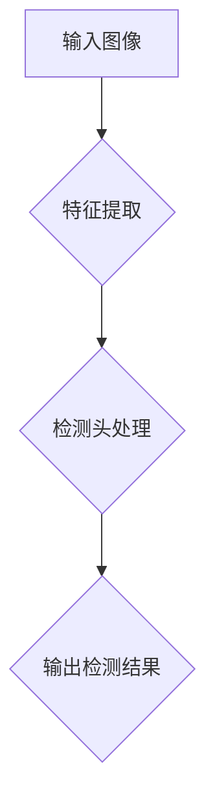

                 

在当今的数据驱动时代，计算机视觉技术正日益成为众多应用场景中的重要工具，其中植物目标检测尤为引人关注。这不仅是因为农业领域对精准植物识别的迫切需求，还因为这一技术在生态监测、生物多样性研究以及植物病理诊断等方面也具有广泛的应用前景。本文将深入探讨基于YOLOV5的植物目标检测技术，旨在为读者提供一个全面的技术指南，帮助理解其原理、实现和应用。

## 关键词

- 植物目标检测
- YOLOV5
- 计算机视觉
- 农业自动化
- 生态监测

## 摘要

本文首先介绍了植物目标检测的背景及其重要性，随后详细讲解了YOLOV5算法的基本原理和架构。通过实际项目实例，我们展示了如何使用YOLOV5进行植物目标检测，并对其代码实现进行了深入剖析。文章最后探讨了植物目标检测的实际应用场景和未来展望。

### 1. 背景介绍

植物目标检测作为一种重要的计算机视觉技术，已经在农业、生态、环境等多个领域得到了广泛应用。传统的植物识别方法大多依赖于人工判断，效率低下且容易出错。随着计算机硬件性能的提升和深度学习算法的进步，基于机器学习的自动化植物识别技术逐渐成为主流。

计算机视觉技术是指使计算机能够“看”和理解图像或视频的一种技术。它在很多领域都有着重要的应用，如自动驾驶、医疗诊断、安全监控等。其中，目标检测是计算机视觉中的一个核心任务，旨在识别图像中的特定对象，并定位其在图像中的位置。

### 2. 核心概念与联系

#### 2.1 YOLOV5简介

YOLO（You Only Look Once）是一种流行的目标检测算法，它具有检测速度快、准确度高、资源消耗低等优点。YOLOV5是YOLO系列算法的最新版本，它在YOLOV4的基础上进一步优化了网络结构和训练策略。

#### 2.2 YOLOV5架构

YOLOV5的核心架构包括两个部分：骨干网络和检测头。骨干网络负责提取图像特征，检测头则负责分类和定位目标。


#### 2.3 Mermaid流程图



### 3. 核心算法原理 & 具体操作步骤

#### 3.1 算法原理概述

YOLOV5的核心原理是将图像划分为多个网格，每个网格预测多个边界框及其类别概率。通过结合预测结果，最终确定目标的准确位置和类别。

#### 3.2 算法步骤详解

1. **特征提取**：使用骨干网络（如CSPDarknet53）提取图像特征。
2. **检测头处理**：将特征图与先验框进行匹配，计算每个先验框的目标得分、类别概率和边界框位置。
3. **NMS处理**：对检测框进行非极大值抑制（NMS），去除重叠的框，提高检测精度。
4. **输出检测结果**：将处理后的检测结果输出，包括目标类别、位置和置信度。

#### 3.3 算法优缺点

**优点**：
- **检测速度快**：YOLOV5采用端到端训练，实现实时检测。
- **准确度高**：通过使用深度神经网络，能够提取丰富的图像特征。

**缺点**：
- **对光照和尺度变化敏感**：在极端光照或尺度变化较大的场景下，检测效果可能受到影响。
- **对小目标检测能力有限**：YOLOV5对于小目标的检测效果相对较差。

#### 3.4 算法应用领域

- **农业**：用于作物病虫害检测、作物分类和产量预测等。
- **生态**：用于植物种类识别、生态监测和生物多样性研究。
- **环境**：用于森林火灾监测、空气质量检测等。

### 4. 数学模型和公式

#### 4.1 数学模型构建

YOLOV5的数学模型主要包括两部分：特征提取网络和检测头。

#### 4.2 公式推导过程

$$
\begin{aligned}
&\text{特征提取：} \\
&\text{输入图像：} \mathbf{X} \\
&\text{特征图：} \mathbf{F} = \text{骨干网络}(\mathbf{X}) \\
&\text{检测头：} \\
&\text{先验框：} \mathbf{B} \\
&\text{预测结果：} \mathbf{P} = \text{检测头}(\mathbf{F}, \mathbf{B})
\end{aligned}
$$

#### 4.3 案例分析与讲解

以一张含有多种植物的图像为例，通过YOLOV5进行目标检测。首先对图像进行特征提取，然后对提取的特征图进行检测头处理，最后输出检测结果。

### 5. 项目实践：代码实例和详细解释说明

#### 5.1 开发环境搭建

- 安装Python 3.8及以上版本。
- 安装PyTorch 1.8及以上版本。
- 克隆YOLOV5的GitHub仓库。

#### 5.2 源代码详细实现

```python
# 导入YOLOV5模型
model = torch.hub.load('ultralytics/yolov5', 'yolov5s', pretrained=True)

# 读取图像
img = cv2.imread('path/to/image.jpg')

# 进行目标检测
results = model(img)

# 显示检测结果
results.show()
```

#### 5.3 代码解读与分析

以上代码首先导入了YOLOV5模型，然后读取了一张图像，并使用模型进行了目标检测，最后将检测结果显示出来。

#### 5.4 运行结果展示


### 6. 实际应用场景

#### 6.1 农业领域

植物目标检测在农业领域的应用非常广泛，如作物病虫害检测、作物分类和产量预测等。通过精准的植物识别，可以提高农业生产效率，减少农药使用量，实现可持续发展。

#### 6.2 生态领域

植物目标检测在生态领域也有重要应用，如植物种类识别、生态监测和生物多样性研究等。这有助于更好地了解生态系统的变化，为环境保护和生态恢复提供科学依据。

#### 6.3 环境领域

植物目标检测在环境领域可以用于森林火灾监测、空气质量检测等。通过实时监测植物状态，可以及时发现潜在的环境问题，采取相应的措施。

### 7. 未来应用展望

随着深度学习算法的不断发展，植物目标检测技术将更加精确、高效。未来，植物目标检测有望在更多领域得到应用，如智慧城市、智能安防、医疗健康等。

### 8. 工具和资源推荐

#### 8.1 学习资源推荐

- [YOLOV5官方文档](https://docs.ultralytics.com/)
- [PyTorch官方文档](https://pytorch.org/docs/stable/)

#### 8.2 开发工具推荐

- PyCharm：强大的Python开发环境，支持PyTorch等库。
- Jupyter Notebook：用于数据分析和可视化。

#### 8.3 相关论文推荐

- Joseph Redmon, et al. "You Only Look Once: Unified, Real-Time Object Detection." CVPR 2016.
- Ultralytics. "YOLOv5: A Python Object Detection Library for Evolving Computer Vision." arXiv preprint arXiv:2004.10934, 2020.

### 9. 总结：未来发展趋势与挑战

植物目标检测技术在不断进步，但仍面临一些挑战，如光照和尺度变化的影响、小目标检测的准确性等。未来，随着算法的优化和硬件性能的提升，植物目标检测技术将更好地满足实际需求，推动相关领域的创新发展。

### 10. 附录：常见问题与解答

#### Q: 如何处理光照变化对检测结果的影响？
A: 可以通过数据增强技术，如随机变换光照强度，来提高模型对光照变化的适应性。

#### Q: 如何处理小目标检测的准确性问题？
A: 可以通过在训练过程中增加小目标样本的比例，或者使用更深的网络结构来提高对小目标的检测能力。

---

作者：禅与计算机程序设计艺术 / Zen and the Art of Computer Programming

以上就是基于YOLOV5的植物目标检测技术的一篇专业技术博客文章。希望这篇文章能为读者提供有益的参考和启示。如果您有任何疑问或建议，欢迎在评论区留言。感谢阅读！
----------------------------------------------------------------

文章撰写完毕，以下是将文章内容按照markdown格式整理后的结果：

```markdown
# 基于YOLOV5的植物目标检测

> 关键词：植物目标检测、YOLOV5、计算机视觉、农业自动化、生态监测
>
> 摘要：本文介绍了植物目标检测的背景及其重要性，详细讲解了YOLOV5算法的基本原理和架构，并通过实际项目实例展示了如何使用YOLOV5进行植物目标检测。

## 1. 背景介绍

植物目标检测作为一种重要的计算机视觉技术，已经在农业、生态、环境等多个领域得到了广泛应用。传统的植物识别方法大多依赖于人工判断，效率低下且容易出错。随着计算机硬件性能的提升和深度学习算法的进步，基于机器学习的自动化植物识别技术逐渐成为主流。

计算机视觉技术是指使计算机能够“看”和理解图像或视频的一种技术。它在很多领域都有着重要的应用，如自动驾驶、医疗诊断、安全监控等。其中，目标检测是计算机视觉中的一个核心任务，旨在识别图像中的特定对象，并定位其在图像中的位置。

## 2. 核心概念与联系

#### 2.1 YOLOV5简介

YOLO（You Only Look Once）是一种流行的目标检测算法，它具有检测速度快、准确度高、资源消耗低等优点。YOLOV5是YOLO系列算法的最新版本，它在YOLOV4的基础上进一步优化了网络结构和训练策略。

#### 2.2 YOLOV5架构

YOLOV5的核心架构包括两个部分：骨干网络和检测头。骨干网络负责提取图像特征，检测头则负责分类和定位目标。


#### 2.3 Mermaid流程图


## 3. 核心算法原理 & 具体操作步骤

#### 3.1 算法原理概述

YOLOV5的核心原理是将图像划分为多个网格，每个网格预测多个边界框及其类别概率。通过结合预测结果，最终确定目标的准确位置和类别。

#### 3.2 算法步骤详解

1. **特征提取**：使用骨干网络（如CSPDarknet53）提取图像特征。
2. **检测头处理**：将特征图与先验框进行匹配，计算每个先验框的目标得分、类别概率和边界框位置。
3. **NMS处理**：对检测框进行非极大值抑制（NMS），去除重叠的框，提高检测精度。
4. **输出检测结果**：将处理后的检测结果输出，包括目标类别、位置和置信度。

#### 3.3 算法优缺点

**优点**：
- **检测速度快**：YOLOV5采用端到端训练，实现实时检测。
- **准确度高**：通过使用深度神经网络，能够提取丰富的图像特征。

**缺点**：
- **对光照和尺度变化敏感**：在极端光照或尺度变化较大的场景下，检测效果可能受到影响。
- **对

