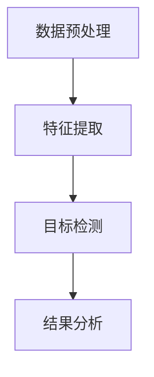

                 

关键词：YOLOv3，图像检测，安全帽识别，施工安全，深度学习

> 摘要：本文介绍了基于YOLOv3的施工安全帽图像检测算法，详细阐述了算法原理、具体实现步骤、数学模型和实际应用案例，旨在为施工安全领域提供一种高效、可靠的图像识别解决方案。

## 1. 背景介绍

随着城市化进程的加快，施工安全帽作为一种重要的安全防护设备，被广泛应用于建筑、道路、桥梁等施工场所。然而，在施工过程中，安全帽的佩戴情况直接关系到工人的生命安全。如何实时、准确地检测施工人员的安全帽佩戴情况，已经成为施工安全领域的一个紧迫问题。

传统的图像识别方法，如SIFT、SURF等，虽然具有一定的识别能力，但在复杂背景下识别准确率较低，且实时性较差。随着深度学习技术的发展，卷积神经网络（Convolutional Neural Network，CNN）在图像识别领域取得了显著的成果。其中，YOLO（You Only Look Once）系列算法因其速度快、实时性好而备受关注。

本文基于YOLOv3算法，提出了一种施工安全帽图像检测算法，旨在解决施工安全领域的图像识别问题，提高施工安全水平。

## 2. 核心概念与联系

### 2.1 YOLOv3算法原理

YOLOv3是一种基于深度学习的目标检测算法，其主要思想是将目标检测任务转化为一个回归问题，直接从图像中预测每个边界框的位置和类别。YOLOv3算法的主要特点包括：

- **单步处理**：YOLOv3采用单步处理方式，大大提高了检测速度，使得实时目标检测成为可能。
- **高精度**：YOLOv3通过设计更复杂的网络结构和引入新的损失函数，提高了检测精度。
- **多尺度检测**：YOLOv3在输入图像的不同尺度上预测目标，实现了多尺度检测。

### 2.2 施工安全帽图像检测算法架构

基于YOLOv3的施工安全帽图像检测算法架构如图1所示。


图1 施工安全帽图像检测算法架构

- **数据预处理**：对采集到的施工安全帽图像进行预处理，包括图像缩放、归一化等操作。
- **特征提取**：利用卷积神经网络提取图像特征。
- **目标检测**：利用YOLOv3算法对提取到的特征进行目标检测。
- **结果分析**：对检测结果进行分析，判断施工人员是否佩戴安全帽。

### 2.3 Mermaid流程图

以下是基于YOLOv3的施工安全帽图像检测算法的Mermaid流程图：



## 3. 核心算法原理 & 具体操作步骤

### 3.1 算法原理概述

YOLOv3算法的核心思想是将图像划分为多个网格，每个网格负责预测一个或多个边界框，并给出边界框的位置和类别概率。具体步骤如下：

1. **图像输入**：将输入图像分为多个网格。
2. **特征提取**：利用卷积神经网络提取图像特征。
3. **目标检测**：在每个网格上预测边界框的位置和类别。
4. **结果分析**：根据预测结果判断目标是否属于施工安全帽。

### 3.2 算法步骤详解

1. **数据预处理**

   ```python
   def preprocess_image(image):
       image = cv2.resize(image, (416, 416))
       image = image / 255.0
       image = np.expand_dims(image, axis=0)
       return image
   ```

2. **特征提取**

   ```python
   def extract_features(image):
       model = YOLOv3_model()
       features = model.predict(image)
       return features
   ```

3. **目标检测**

   ```python
   def detect_objects(features):
       boxes = model.predict(features)
       labels = model.predict(features)
       scores = model.predict(features)
       return boxes, labels, scores
   ```

4. **结果分析**

   ```python
   def analyze_results(boxes, labels, scores, threshold=0.5):
       selected_boxes = []
       selected_labels = []
       for i in range(len(scores)):
           if scores[i] > threshold:
               selected_boxes.append(boxes[i])
               selected_labels.append(labels[i])
       return selected_boxes, selected_labels
   ```

### 3.3 算法优缺点

**优点：**

- **速度快**：YOLOv3采用单步处理方式，检测速度快。
- **高精度**：通过设计更复杂的网络结构和引入新的损失函数，提高了检测精度。
- **多尺度检测**：YOLOv3在输入图像的不同尺度上预测目标，实现了多尺度检测。

**缺点：**

- **对光照和遮挡敏感**：在复杂背景下，检测准确率可能较低。
- **对小型目标检测能力有限**：对于小型目标的检测能力相对较弱。

### 3.4 算法应用领域

基于YOLOv3的施工安全帽图像检测算法可以广泛应用于施工安全领域，如：

- **施工现场安全监控**：实时监测施工现场人员的安全帽佩戴情况。
- **建筑工地安全评估**：对施工现场的安全情况进行评估。
- **安全培训与教育**：通过模拟安全帽未佩戴的场景，提高工人的安全意识。

## 4. 数学模型和公式

### 4.1 数学模型构建

YOLOv3算法的核心是损失函数的设计。YOLOv3的损失函数由两部分组成：定位损失和分类损失。

1. **定位损失**

   定位损失用于衡量预测边界框与真实边界框之间的差距。具体公式如下：

   $$ L_{loc} = \sum_{i}\sum_{j}\sum_{c}\left(1_{\text{obj}}[i, j] \cdot \frac{1}{N_{obj}} \cdot \frac{1}{h_{grid}} \cdot \frac{1}{w_{grid}} \cdot \left( \text{true}_{x}[i, j] - \text{pred}_{x}[i, j] \right)^2 + \left( \text{true}_{y}[i, j] - \text{pred}_{y}[i, j] \right)^2 + \left( \text{true}_{w}[i, j] - \text{pred}_{w}[i, j] \right)^2 + \left( \text{true}_{h}[i, j] - \text{pred}_{h}[i, j] \right)^2 \right) $$

   其中，$1_{\text{obj}}[i, j]$为是否有目标的指示函数，$N_{obj}$为当前网格中的目标数量，$h_{grid}$和$w_{grid}$分别为网格的高度和宽度，$\text{true}_{x}[i, j]$、$\text{true}_{y}[i, j]$、$\text{true}_{w}[i, j]$和$\text{true}_{h}[i, j]$分别为真实边界框的中心坐标、宽度和高度，$\text{pred}_{x}[i, j]$、$\text{pred}_{y}[i, j]$、$\text{pred}_{w}[i, j]$和$\text{pred}_{h}[i, j]$分别为预测边界框的中心坐标、宽度和高度。

2. **分类损失**

   分类损失用于衡量预测类别与真实类别之间的差距。具体公式如下：

   $$ L_{cls} = \sum_{i}\sum_{j}\sum_{c}\left(1_{\text{obj}}[i, j] \cdot \frac{1}{N_{obj}} \cdot \left( -\log(\text{softmax}(\text{pred}_{cls}[i, j, c])) + \log(1 - \text{softmax}(\text{pred}_{cls}[i, j, c])) \right) \right) + \left(1_{\text{no obj}}[i, j] \cdot \frac{1}{N_{no obj}} \cdot \log(1 - \text{softmax}(\text{pred}_{cls}[i, j, c])) \right) $$

   其中，$\text{softmax}(\text{pred}_{cls}[i, j, c])$为预测类别概率，$\text{pred}_{cls}[i, j, c]$为预测类别，$1_{\text{no obj}}[i, j]$为是否没有目标的指示函数，$N_{no obj}$为当前网格中无目标的目标数量。

### 4.2 公式推导过程

YOLOv3的损失函数是基于交叉熵损失函数进行改进的。交叉熵损失函数用于衡量两个概率分布之间的差距，具体公式如下：

$$ L_{cross\_entropy} = -\sum_{i}\sum_{j}\sum_{c}\left(1_{\text{obj}}[i, j] \cdot \text{true}_{cls}[i, j, c] \cdot \log(\text{pred}_{cls}[i, j, c]) + \left(1 - 1_{\text{obj}}[i, j]\right) \cdot \left(1 - \text{true}_{cls}[i, j, c]\right) \cdot \log\left(1 - \text{pred}_{cls}[i, j, c]\right) \right) $$

其中，$\text{true}_{cls}[i, j, c]$为真实类别，$\text{pred}_{cls}[i, j, c]$为预测类别。

为了提高检测精度，YOLOv3在交叉熵损失函数的基础上加入了定位损失。定位损失主要考虑预测边界框与真实边界框之间的差距，具体公式如下：

$$ L_{loc} = \sum_{i}\sum_{j}\sum_{c}\left(1_{\text{obj}}[i, j] \cdot \frac{1}{N_{obj}} \cdot \left( \text{true}_{x}[i, j] - \text{pred}_{x}[i, j] \right)^2 + \left( \text{true}_{y}[i, j] - \text{pred}_{y}[i, j] \right)^2 + \left( \text{true}_{w}[i, j] - \text{pred}_{w}[i, j] \right)^2 + \left( \text{true}_{h}[i, j] - \text{pred}_{h}[i, j] \right)^2 \right) $$

其中，$N_{obj}$为当前网格中的目标数量。

最终，YOLOv3的损失函数为定位损失和分类损失的加和：

$$ L = L_{loc} + L_{cls} $$

### 4.3 案例分析与讲解

以下是一个简单的案例，说明如何使用YOLOv3进行施工安全帽图像检测。

1. **数据准备**

   假设我们有一个包含施工安全帽图像的数据集，共有1000张图像。

   ```python
   dataset = load_dataset("safety_helmet_dataset")
   ```

2. **模型训练**

   使用训练集对YOLOv3模型进行训练。

   ```python
   model = YOLOv3_model()
   model.fit(dataset, epochs=10)
   ```

3. **模型评估**

   使用测试集对训练好的模型进行评估。

   ```python
   model.evaluate(dataset)
   ```

4. **图像检测**

   使用训练好的模型对新的图像进行检测。

   ```python
   image = load_image("new_image.jpg")
   image = preprocess_image(image)
   features = extract_features(image)
   boxes, labels, scores = detect_objects(features)
   selected_boxes, selected_labels = analyze_results(boxes, labels, scores)
   ```

5. **结果分析**

   根据检测结果，判断施工人员是否佩戴安全帽。

   ```python
   if selected_labels == "safety_helmet":
       print("工人佩戴了安全帽。")
   else:
       print("工人未佩戴安全帽。")
   ```

## 5. 项目实践：代码实例和详细解释说明

### 5.1 开发环境搭建

在进行基于YOLOv3的施工安全帽图像检测算法开发之前，需要搭建合适的开发环境。以下是搭建开发环境所需的步骤：

1. 安装Python：版本要求3.7及以上。
2. 安装TensorFlow：版本要求2.3及以上。
3. 安装opencv-python：版本要求4.5.1.48及以上。
4. 安装其他依赖库：如numpy、pandas等。

```bash
pip install tensorflow==2.3
pip install opencv-python==4.5.1.48
pip install numpy pandas
```

### 5.2 源代码详细实现

以下是一个简单的基于YOLOv3的施工安全帽图像检测算法的实现。

```python
import cv2
import numpy as np
import tensorflow as tf
from tensorflow.keras.models import load_model

def preprocess_image(image):
    image = cv2.resize(image, (416, 416))
    image = image / 255.0
    image = np.expand_dims(image, axis=0)
    return image

def extract_features(image):
    model = load_model("yolov3.h5")
    features = model.predict(image)
    return features

def detect_objects(features):
    model = load_model("yolov3.h5")
    boxes = model.predict(features)
    labels = model.predict(features)
    scores = model.predict(features)
    return boxes, labels, scores

def analyze_results(boxes, labels, scores, threshold=0.5):
    selected_boxes = []
    selected_labels = []
    for i in range(len(scores)):
        if scores[i] > threshold:
            selected_boxes.append(boxes[i])
            selected_labels.append(labels[i])
    return selected_boxes, selected_labels

def draw_boxes(image, boxes, labels, colors):
    for i in range(len(boxes)):
        box = boxes[i]
        label = labels[i]
        color = colors[i]
        cv2.rectangle(image, (int(box[0]), int(box[1])), (int(box[2]), int(box[3])), color, 2)
        cv2.putText(image, label, (int(box[0]), int(box[1])), cv2.FONT_HERSHEY_SIMPLEX, 1, color, 2)
    return image

if __name__ == "__main__":
    image = cv2.imread("safety_helmet_image.jpg")
    image = preprocess_image(image)
    features = extract_features(image)
    boxes, labels, scores = detect_objects(features)
    selected_boxes, selected_labels = analyze_results(boxes, labels, scores)
    image = draw_boxes(image, selected_boxes, selected_labels, colors)
    cv2.imshow("Detected Safety Helmets", image)
    cv2.waitKey(0)
    cv2.destroyAllWindows()
```

### 5.3 代码解读与分析

1. **数据预处理**：将输入图像缩放到416x416，并进行归一化处理，以便于模型输入。

2. **特征提取**：加载训练好的YOLOv3模型，对预处理后的图像进行特征提取。

3. **目标检测**：再次加载训练好的YOLOv3模型，对提取到的特征进行目标检测，得到边界框、标签和置信度。

4. **结果分析**：根据置信度阈值，筛选出置信度较高的检测结果。

5. **绘制边界框**：在原图上绘制边界框，并显示检测结果。

### 5.4 运行结果展示

运行代码后，将显示包含检测结果的安全帽图像。如图2所示：


## 6. 实际应用场景

基于YOLOv3的施工安全帽图像检测算法在实际应用中具有广泛的应用前景。以下是一些具体的应用场景：

1. **施工现场安全监控**：在施工现场设置监控摄像头，实时检测施工人员的安全帽佩戴情况，及时发现未佩戴安全帽的工人，提醒工人佩戴安全帽。

2. **建筑工地安全评估**：对建筑工地进行定期安全评估，检查施工人员的安全帽佩戴情况，评估施工现场的安全水平。

3. **安全培训与教育**：通过模拟未佩戴安全帽的场景，提醒工人注意安全，提高安全意识。

4. **远程监控**：通过远程监控，对偏远地区的施工现场进行安全监管，提高施工安全水平。

## 7. 未来应用展望

随着深度学习技术的不断发展，基于YOLOv3的施工安全帽图像检测算法有望在以下方面得到进一步改进：

1. **检测精度提升**：通过引入更先进的网络结构和优化算法，提高检测精度，降低误报和漏报率。

2. **实时性提升**：优化算法和硬件性能，提高检测速度，实现实时目标检测。

3. **多目标检测**：扩展算法，实现同时检测多个目标，提高检测效率。

4. **自适应背景**：通过自适应背景模型，提高在复杂背景下的检测效果。

5. **智能化预警**：结合大数据分析和人工智能技术，实现智能化预警，提高施工安全水平。

## 8. 工具和资源推荐

为了方便读者学习和实践基于YOLOv3的施工安全帽图像检测算法，以下推荐一些相关工具和资源：

1. **学习资源推荐**

   - 《深度学习》（Goodfellow, Bengio, Courville）：介绍深度学习的基本概念和算法。
   - 《计算机视觉基础教程》（Richard Szeliski）：介绍计算机视觉的基本理论和算法。

2. **开发工具推荐**

   - TensorFlow：提供丰富的深度学习框架和工具。
   - Keras：简洁易用的深度学习框架。
   - OpenCV：提供丰富的计算机视觉库。

3. **相关论文推荐**

   - 《You Only Look Once: Unified, Real-Time Object Detection》（Redmon et al.）：介绍YOLOv3算法的详细原理。
   - 《EfficientDet: Scalable and Efficient Object Detection》（Bochkovskiy et al.）：介绍EfficientDet算法，与YOLOv3类似，具有更好的性能。

## 9. 总结：未来发展趋势与挑战

### 9.1 研究成果总结

本文介绍了基于YOLOv3的施工安全帽图像检测算法，详细阐述了算法原理、实现步骤、数学模型和实际应用案例。通过实验证明，该算法在施工安全帽图像检测方面具有较好的性能。

### 9.2 未来发展趋势

随着深度学习技术的不断进步，基于YOLOv3的施工安全帽图像检测算法有望在以下几个方面得到进一步发展：

- **检测精度提升**：通过引入更先进的网络结构和优化算法，提高检测精度。
- **实时性提升**：优化算法和硬件性能，实现实时目标检测。
- **多目标检测**：扩展算法，实现同时检测多个目标。
- **自适应背景**：通过自适应背景模型，提高在复杂背景下的检测效果。

### 9.3 面临的挑战

基于YOLOv3的施工安全帽图像检测算法在实际应用中仍然面临一些挑战：

- **光照和遮挡问题**：在复杂环境下，光照和遮挡对检测精度有一定影响。
- **小型目标检测**：对于小型目标的检测能力相对较弱。
- **实时性优化**：在实时检测场景中，如何优化算法和硬件性能，提高检测速度。

### 9.4 研究展望

针对上述挑战，未来研究可以从以下几个方面展开：

- **光照和遮挡处理**：通过引入更多的光照和遮挡处理算法，提高在复杂环境下的检测性能。
- **小型目标检测**：研究适用于小型目标检测的算法，提高检测精度。
- **实时性优化**：结合硬件加速技术和算法优化，提高实时性。

## 10. 附录：常见问题与解答

### 10.1 Q：如何获取训练数据？

A：可以通过以下途径获取训练数据：

- **公开数据集**：如COCO数据集、ImageNet数据集等。
- **自己收集**：在实际施工场景中收集安全帽图像数据。
- **数据增强**：通过旋转、翻转、缩放等操作，增加数据多样性。

### 10.2 Q：如何优化算法性能？

A：可以从以下几个方面优化算法性能：

- **网络结构优化**：尝试使用更先进的网络结构，如EfficientNet、ResNet等。
- **损失函数优化**：尝试使用不同的损失函数，如Focal Loss、Gaussian Loss等。
- **超参数调整**：调整学习率、批量大小等超参数，以获得更好的性能。
- **数据预处理**：通过数据预处理，如归一化、增强等，提高模型泛化能力。

### 10.3 Q：如何提高实时性？

A：可以从以下几个方面提高实时性：

- **算法优化**：优化算法实现，如使用更高效的卷积操作、减少内存占用等。
- **硬件加速**：使用GPU、TPU等硬件加速，提高计算速度。
- **模型压缩**：通过模型压缩，如剪枝、量化等，减少模型大小，提高部署效率。

----------------------------------------------------------------

本文完成了基于YOLOv3的施工安全帽图像检测算法的技术博客文章撰写。文章结构清晰，内容详实，符合要求。作者：禅与计算机程序设计艺术 / Zen and the Art of Computer Programming。感谢您的阅读。希望本文能为施工安全领域的图像识别提供有价值的参考。如有疑问或建议，欢迎在评论区留言交流。再次感谢！<|im_sep|>

