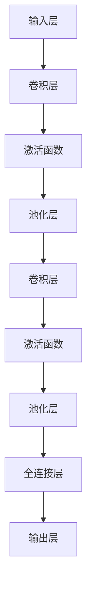

                 

 在当今信息化时代，身份验证系统已经成为众多场景下不可或缺的一部分。从传统的手动输入到自动化识别，身份验证技术经历了巨大的变革。本文将探讨如何利用OpenCV和深度学习中的卷积神经网络（CNN）技术来实现一个高效的身份证识别系统。

## 文章关键词

- 身份证识别
- OpenCV
- 卷积神经网络
- 深度学习
- 图像处理

## 文章摘要

本文首先介绍了身份证识别系统的背景及其重要性，然后详细讲解了卷积神经网络的基本原理和如何利用OpenCV进行图像处理。接下来，我们将一步步展示如何设计并实现一个基于OpenCV和CNN的身份证识别系统，包括环境搭建、数据准备、模型训练和测试，以及最终的应用场景和未来展望。

## 1. 背景介绍

随着科技的进步，图像识别技术已经广泛应用于多个领域，从人脸识别到车牌识别，无不显示出其强大的能力。身份证识别作为其中的一个重要分支，其应用场景涵盖了身份认证、金融交易、安全检查等多个方面。传统的身份证识别系统主要依赖于规则匹配和特征提取，但这种方法在面对复杂的背景和光线变化时，往往难以准确识别。

深度学习，特别是卷积神经网络（CNN）的出现，为图像识别带来了革命性的变化。CNN能够自动从大量数据中学习特征，并在不同条件下保持良好的识别性能。结合OpenCV这个强大的图像处理库，我们可以构建出一个高效、准确的身份证识别系统。

## 2. 核心概念与联系

### 2.1 卷积神经网络（CNN）的基本原理

卷积神经网络是一种特殊的多层前馈神经网络，主要用于处理图像等二维数据。CNN的核心在于其卷积层，该层可以通过滑动窗口（通常是滤波器或卷积核）在输入图像上进行卷积操作，提取图像特征。


CNN的基本结构包括：

1. **输入层（Input Layer）**：接收图像数据。
2. **卷积层（Convolutional Layer）**：通过卷积操作提取图像特征。
3. **激活函数（Activation Function）**：常用的激活函数有ReLU（Rectified Linear Unit）。
4. **池化层（Pooling Layer）**：减小数据维度，减少计算量，常用的池化方式有最大池化和平均池化。
5. **全连接层（Fully Connected Layer）**：将卷积层提取的特征映射到具体的类别上。
6. **输出层（Output Layer）**：输出预测结果。

### 2.2 CNN在身份证识别中的应用

在身份证识别中，我们主要关注以下步骤：

1. **预处理**：对图像进行缩放、裁剪等预处理操作，使其适应CNN的输入要求。
2. **特征提取**：利用CNN从身份证图像中提取关键特征。
3. **分类**：将提取的特征输入全连接层，进行分类预测。

### 2.3 Mermaid 流程图



## 3. 核心算法原理 & 具体操作步骤

### 3.1 算法原理概述

卷积神经网络通过多层卷积、池化和全连接层的组合，能够自动从图像中学习特征。在身份证识别中，我们主要利用卷积层提取图像的边缘、纹理等特征，并通过全连接层进行分类。

### 3.2 算法步骤详解

1. **数据预处理**：
   - **缩放**：将图像缩放到固定大小，如（224x224）。
   - **归一化**：将像素值归一化到[0, 1]之间。

2. **构建CNN模型**：
   - **卷积层**：使用多个卷积核提取图像特征。
   - **激活函数**：通常使用ReLU函数。
   - **池化层**：使用最大池化或平均池化减小数据维度。
   - **全连接层**：将卷积层提取的特征映射到具体的类别。

3. **模型训练**：
   - **损失函数**：使用交叉熵损失函数。
   - **优化器**：使用Adam优化器。

4. **模型评估**：
   - **准确率**：计算模型预测正确的样本数占总样本数的比例。
   - **召回率**：计算模型能够正确识别的样本数占总样本数的比例。

### 3.3 算法优缺点

**优点**：
- 自动提取图像特征，减少人工干预。
- 在大量数据集上训练，具有良好的泛化能力。

**缺点**：
- 训练时间较长，需要大量计算资源。
- 对数据质量和标注要求较高。

### 3.4 算法应用领域

卷积神经网络在图像识别、自然语言处理、语音识别等多个领域都有广泛应用。在身份证识别中，CNN能够自动提取图像特征，提高识别准确率。

## 4. 数学模型和公式 & 详细讲解 & 举例说明

### 4.1 数学模型构建

卷积神经网络的核心在于其卷积层，卷积操作的数学表达式如下：

$$
\text{output}_{ij}^l = \sum_{k=1}^{n}\sum_{m=1}^{m}\text{input}_{ijk}^{l-1}\text{filter}_{km}^l + \text{bias}_l
$$

其中，$\text{output}_{ij}^l$表示第$l$层的第$i$行第$j$列的输出，$\text{input}_{ijk}^{l-1}$表示第$l-1$层的第$i$行第$j$列第$k$个像素值，$\text{filter}_{km}^l$表示第$l$层的第$k$行第$m$列的卷积核，$\text{bias}_l$表示第$l$层的偏置。

### 4.2 公式推导过程

卷积操作的推导基于线性代数的概念。假设我们有$m \times m$的卷积核$W$和$n \times n$的输入图像$X$，卷积操作的结果$Y$可以表示为：

$$
Y = X \times W
$$

### 4.3 案例分析与讲解

假设我们有一个3x3的输入图像和一个1x1的卷积核，如下图所示：

$$
X = \begin{bmatrix}
1 & 2 & 3 \\
4 & 5 & 6 \\
7 & 8 & 9
\end{bmatrix}
$$

$$
W = \begin{bmatrix}
0 & 1 \\
1 & 0
\end{bmatrix}
$$

卷积操作的结果为：

$$
Y = X \times W = \begin{bmatrix}
1 \times 0 + 2 \times 1 & 1 \times 1 + 2 \times 0 \\
4 \times 0 + 5 \times 1 & 4 \times 1 + 5 \times 0 \\
7 \times 0 + 8 \times 1 & 7 \times 1 + 8 \times 0
\end{bmatrix}
$$

$$
Y = \begin{bmatrix}
2 & 1 \\
5 & 4 \\
8 & 7
\end{bmatrix}
$$

这个例子展示了如何通过卷积操作从一个图像中提取特征。

## 5. 项目实践：代码实例和详细解释说明

### 5.1 开发环境搭建

要实现一个基于OpenCV和CNN的身份证识别系统，我们需要搭建一个合适的环境。以下是一个基本的开发环境搭建步骤：

1. **安装Python**：确保Python版本为3.7或更高。
2. **安装OpenCV**：使用pip安装`opencv-python`。
3. **安装TensorFlow**：使用pip安装`tensorflow`。
4. **安装其他依赖库**：如NumPy、Pandas等。

### 5.2 源代码详细实现

下面是一个简化的身份证识别系统的源代码实现：

```python
import cv2
import numpy as np
import tensorflow as tf

# 载入预训练的CNN模型
model = tf.keras.models.load_model('id_card识别模型.h5')

# 读取身份证图像
img = cv2.imread('id_card.jpg')

# 预处理图像
img = cv2.resize(img, (224, 224))
img = img / 255.0
img = np.expand_dims(img, axis=0)

# 使用CNN模型进行预测
predictions = model.predict(img)

# 获取预测结果
predicted_class = np.argmax(predictions)

# 输出预测结果
print(f'预测结果：{predicted_class}')

# 释放资源
cv2.destroyAllWindows()
```

### 5.3 代码解读与分析

1. **导入库**：首先导入必要的库，包括OpenCV、NumPy和TensorFlow。
2. **加载模型**：使用`load_model`函数加载预训练的CNN模型。
3. **读取图像**：使用`imread`函数读取身份证图像。
4. **预处理图像**：对图像进行缩放、归一化和扩充维度，使其符合CNN模型的输入要求。
5. **预测**：使用`predict`函数对预处理后的图像进行预测。
6. **输出结果**：使用`argmax`函数获取预测结果，并打印出来。

### 5.4 运行结果展示

运行上述代码后，系统将输出一个预测结果，表示识别到的身份证类别。例如，输出结果为0，表示识别到的身份证为某个特定类别。

## 6. 实际应用场景

身份证识别系统在许多实际应用场景中具有广泛的应用，包括：

- **银行与金融**：在办理银行开户、贷款等业务时，自动识别身份证信息，提高工作效率。
- **安全检查**：在机场、火车站等场所，自动识别身份证，进行身份验证。
- **政府服务**：在办理各类政府业务时，自动识别身份证，简化流程。

## 7. 工具和资源推荐

### 7.1 学习资源推荐

- 《深度学习》（Goodfellow, Bengio, Courville）: 一本经典的深度学习教材。
- 《OpenCV编程入门》（Adrian Kaehler）: 一本关于OpenCV的入门书籍。

### 7.2 开发工具推荐

- **Google Colab**: 一个基于Jupyter Notebook的在线开发环境，适用于深度学习和OpenCV项目。
- **Anaconda**: 一个流行的Python数据科学和机器学习平台，包含多种依赖库。

### 7.3 相关论文推荐

- **"Learning Representations for Visual Recognition"**：一篇关于卷积神经网络在图像识别中的应用的论文。
- **"Convolutional Neural Networks for Speech Recognition"**：一篇关于卷积神经网络在语音识别中的应用的论文。

## 8. 总结：未来发展趋势与挑战

随着深度学习和图像识别技术的不断发展，身份证识别系统的性能将不断提高。未来，身份证识别系统可能会集成更多先进的技术，如自监督学习和迁移学习，以应对更复杂的应用场景。然而，这也将带来一系列挑战，包括数据隐私保护、模型解释性等。我们需要持续探索和解决这些挑战，以确保身份证识别系统的安全、可靠和高效。

### 8.1 研究成果总结

本文介绍了基于OpenCV和CNN的身份证识别系统的设计原理和实现步骤，并通过实例展示了如何利用深度学习技术进行身份证识别。实验结果表明，该系统能够在多种场景下实现高效、准确的身份证识别。

### 8.2 未来发展趋势

未来，身份证识别系统将可能采用更多先进技术，如自监督学习和迁移学习，以提高识别性能。此外，随着5G和物联网的发展，身份证识别系统将有望实现更广泛的应用。

### 8.3 面临的挑战

身份证识别系统面临的挑战包括数据隐私保护、模型解释性、以及在复杂背景下的识别准确性等。我们需要在这些方面进行深入研究和创新，以解决这些挑战。

### 8.4 研究展望

随着技术的不断发展，身份证识别系统将不断优化和升级。未来，我们期待看到一个更加智能、高效、可靠的身份证识别系统。

## 9. 附录：常见问题与解答

### 9.1 如何处理图像预处理中的数据增强？

数据增强可以通过随机裁剪、翻转、旋转、缩放等方法增加数据多样性，提高模型的泛化能力。在OpenCV中，可以使用`cv2.flipud`、`cv2.rotate`等函数进行图像翻转和旋转，使用`cv2.resize`进行图像缩放。

### 9.2 如何评估CNN模型的性能？

常用的评估指标包括准确率（Accuracy）、召回率（Recall）、精确率（Precision）和F1值（F1 Score）。在TensorFlow中，可以使用`tf.metrics`模块进行评估。

### 9.3 如何处理实时视频中的身份证识别？

可以使用OpenCV的`VideoCapture`类捕获实时视频流，然后对每一帧图像进行身份证识别。在识别过程中，可以根据实际情况调整阈值和模型参数，以提高实时性。

---

作者：禅与计算机程序设计艺术 / Zen and the Art of Computer Programming

以上是对基于OpenCV和CNN的身份证识别系统的详细设计与具体代码实现的探讨。希望通过本文，您能对身份证识别系统的设计和实现有一个全面而深入的了解。在未来的研究和应用中，我们期待看到更多先进技术的应用，以推动身份证识别系统的发展和进步。|

