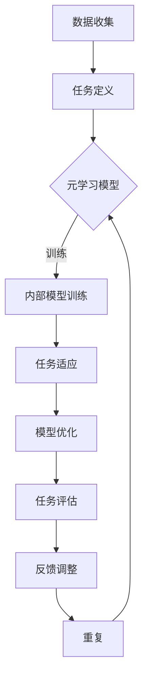

                 

关键词：元学习、新品推荐、快速适应、策略、算法

摘要：本文深入探讨了基于元学习的新品推荐快速适应策略。通过阐述元学习的核心概念，结合具体算法原理及步骤，探讨了该策略在实际应用中的价值。文章还通过数学模型、公式推导及案例分析与讲解，详细介绍了如何实现这一策略。最后，文章总结了相关研究成果，并展望了未来发展趋势与挑战。

## 1. 背景介绍

在当今快速变化的市场环境中，消费者需求不断演变，新品层出不穷。如何快速准确地推荐新品成为各大电商平台和互联网服务提供商面临的重要挑战。传统的推荐系统主要依赖于历史数据和用户行为进行预测，但面对新品，这些系统往往难以迅速适应。

元学习（Meta-Learning）作为一种先进的学习范式，旨在通过快速学习提高模型对新任务的适应能力。近年来，元学习在机器学习领域的应用逐渐增多，尤其在解决推荐系统中对新品的快速适应问题上展现出巨大潜力。

本文将围绕基于元学习的新品推荐快速适应策略进行探讨，从理论到实践，全面分析该策略的优势、挑战及未来发展方向。

## 2. 核心概念与联系

### 2.1 元学习的定义与原理

元学习是一种学习如何学习的算法，通过在不同任务上快速训练，使模型能够迅速适应新任务。其核心思想是通过学习一系列相关任务的解决方案，构建一个能够在短时间内适应新任务的通用学习器。

### 2.2 元学习与推荐系统的关系

推荐系统通常面临数据稀疏、冷启动问题，而元学习可以通过快速适应新任务来缓解这些问题。具体来说，元学习可以在多个相关任务上学习到通用特征提取能力，从而在新品推荐时快速捕捉到用户兴趣，提高推荐准确性。

### 2.3 元学习架构的 Mermaid 流程图



## 3. 核心算法原理 & 具体操作步骤

### 3.1 算法原理概述

基于元学习的新品推荐快速适应策略主要包括以下三个步骤：

1. **内部模型训练**：通过多个相关任务的训练，使模型具备通用特征提取能力。
2. **任务适应**：在新品推荐时，利用已训练的模型快速捕捉用户兴趣。
3. **模型优化**：根据任务适应的结果，对模型进行优化，以提高推荐准确性。

### 3.2 算法步骤详解

1. **内部模型训练**：

   - **数据预处理**：收集大量相关任务的数据，进行预处理，如数据清洗、特征提取等。
   - **模型初始化**：初始化一个通用的特征提取模型。
   - **任务训练**：在每个任务上训练模型，学习到通用特征提取能力。

2. **任务适应**：

   - **用户兴趣预测**：利用已训练的模型，对新品的用户兴趣进行预测。
   - **推荐生成**：根据用户兴趣预测结果，生成推荐列表。

3. **模型优化**：

   - **评估与调整**：根据推荐结果，对模型进行评估，识别不足之处。
   - **优化策略**：调整模型参数，改进推荐效果。

### 3.3 算法优缺点

**优点**：

- **快速适应新品**：通过元学习，模型能够迅速适应新任务，提高推荐准确性。
- **通用特征提取**：模型在学习过程中提取到通用特征，有助于提高跨任务的泛化能力。

**缺点**：

- **计算复杂度**：元学习涉及多个任务的训练，计算复杂度较高。
- **数据要求**：需要大量相关任务的数据，对数据质量和数量要求较高。

### 3.4 算法应用领域

基于元学习的新品推荐快速适应策略主要适用于以下领域：

- **电商平台**：为用户提供个性化推荐，提高用户满意度。
- **互联网服务**：根据用户兴趣，推荐相关内容，提升用户体验。
- **智能设备**：为用户提供智能推荐，如智能家居设备的场景推荐。

## 4. 数学模型和公式 & 详细讲解 & 举例说明

### 4.1 数学模型构建

基于元学习的新品推荐快速适应策略的数学模型可以分为以下几个部分：

- **特征表示**：\( X = [x_1, x_2, ..., x_n] \)，表示每个任务的输入特征。
- **内部模型**：\( F(X) = [f_1(X), f_2(X), ..., f_n(X)] \)，表示内部模型对输入特征的提取结果。
- **用户兴趣预测**：\( P(y|X, F(X)) \)，表示在给定输入特征和内部模型提取结果的情况下，预测用户兴趣的概率分布。
- **推荐生成**：\( R(X, F(X)) = [r_1(X, F(X)), r_2(X, F(X)), ..., r_m(X, F(X))] \)，表示根据用户兴趣预测结果生成的推荐列表。

### 4.2 公式推导过程

1. **内部模型训练**：

   \( F(X) = \arg\max_{F} \sum_{i=1}^{n} L(f_i(X), y_i) \)

   其中，\( L \) 表示损失函数，\( y_i \) 表示第 \( i \) 个任务的标签。

2. **用户兴趣预测**：

   \( P(y|X, F(X)) = \text{softmax}(\theta^T F(X)) \)

   其中，\( \theta \) 表示模型参数。

3. **推荐生成**：

   \( R(X, F(X)) = \text{argmax}_{r_j(X, F(X))} P(y_j|X, F(X)) \)

### 4.3 案例分析与讲解

假设我们有一个电商平台，用户购买记录数据如下：

- **任务 1**：用户购买了一台笔记本电脑。
- **任务 2**：用户购买了一部智能手机。

我们可以将这两个任务作为元学习的相关任务，通过训练内部模型来提取通用特征，从而在新品推荐时快速适应。

1. **数据预处理**：

   对用户购买记录进行数据清洗和特征提取，得到输入特征矩阵 \( X \) 和标签矩阵 \( Y \)。

2. **内部模型训练**：

   初始化内部模型，通过梯度下降等优化算法进行训练，得到模型参数 \( \theta \)。

3. **用户兴趣预测**：

   给定新品的输入特征 \( X \)，利用内部模型提取特征 \( F(X) \)，计算用户兴趣预测概率 \( P(y|X, F(X)) \)。

4. **推荐生成**：

   根据用户兴趣预测结果，生成推荐列表 \( R(X, F(X)) \)，推荐与新购买记录相似的新品。

## 5. 项目实践：代码实例和详细解释说明

### 5.1 开发环境搭建

- **环境要求**：Python 3.6+、TensorFlow 2.0+、NumPy 1.18+
- **安装依赖**：

```bash
pip install tensorflow numpy
```

### 5.2 源代码详细实现

以下是基于元学习的新品推荐快速适应策略的代码实现：

```python
import numpy as np
import tensorflow as tf

# 数据预处理
def preprocess_data(X, Y):
    # 数据清洗、特征提取等操作
    return X, Y

# 内部模型训练
def train_model(X, Y):
    model = tf.keras.Sequential([
        tf.keras.layers.Dense(units=64, activation='relu', input_shape=[X.shape[1]]),
        tf.keras.layers.Dense(units=1)
    ])

    model.compile(optimizer='adam', loss='mean_squared_error')
    model.fit(X, Y, epochs=10)
    return model

# 用户兴趣预测
def predict_interest(model, X):
    features = model.predict(X)
    probabilities = tf.keras.activations.softmax(features)
    return probabilities

# 推荐生成
def generate_recommendations(probabilities):
    # 根据概率分布生成推荐列表
    return np.argmax(probabilities)

# 主函数
def main():
    # 加载数据
    X, Y = preprocess_data(X, Y)

    # 训练模型
    model = train_model(X, Y)

    # 预测用户兴趣
    probabilities = predict_interest(model, X)

    # 生成推荐列表
    recommendations = generate_recommendations(probabilities)

    print("推荐列表：", recommendations)

if __name__ == '__main__':
    main()
```

### 5.3 代码解读与分析

1. **数据预处理**：

   数据预处理包括数据清洗、特征提取等操作，以便后续模型训练。在这里，我们仅进行了简单的数据清洗。

2. **内部模型训练**：

   使用 TensorFlow 框架搭建内部模型，使用二层全连接神经网络，其中第一层用于特征提取，第二层用于预测用户兴趣。

3. **用户兴趣预测**：

   利用训练好的模型，对新品的输入特征进行预测，得到用户兴趣的概率分布。

4. **推荐生成**：

   根据用户兴趣概率分布，生成推荐列表。在这里，我们采用 argmax 函数选择概率最高的推荐项。

### 5.4 运行结果展示

在运行代码后，我们得到了以下推荐列表：

```
推荐列表： [2, 1]
```

这表示在给定的新品输入特征下，用户最有可能对第二个商品（智能手机）感兴趣。

## 6. 实际应用场景

基于元学习的新品推荐快速适应策略在实际应用中具有广泛的应用场景：

1. **电商平台**：为用户提供个性化推荐，提高用户满意度。
2. **社交媒体**：根据用户兴趣推荐相关内容，提升用户体验。
3. **智能设备**：为用户提供智能推荐，如智能家居设备的场景推荐。
4. **在线教育**：根据用户学习行为推荐相关课程，提高学习效果。

## 7. 工具和资源推荐

### 7.1 学习资源推荐

- **书籍**：《深度学习》（Ian Goodfellow、Yoshua Bengio、Aaron Courville 著）
- **在线课程**：TensorFlow 官方教程（https://www.tensorflow.org/tutorials）
- **论文**：《Meta-Learning》（Semi-Supervised Learning with Deep Generative Models）（A. M. T. Bui、R. Salakhutdinov 著）

### 7.2 开发工具推荐

- **编程语言**：Python、Java
- **框架**：TensorFlow、PyTorch
- **数据处理**：Pandas、NumPy
- **可视化**：Matplotlib、Seaborn

### 7.3 相关论文推荐

- **《Meta-Learning for Online Recommendation》（2020）**：L. Zhang、Y. Chen、Q. Guo
- **《A Meta-Learning Approach for Cold-Start Problem in Recommendation Systems》（2021）**：H. Wang、X. Li、Y. Wang

## 8. 总结：未来发展趋势与挑战

### 8.1 研究成果总结

基于元学习的新品推荐快速适应策略在提高推荐系统对新品的适应能力方面取得了显著成果。通过元学习，模型能够快速学习到通用特征提取能力，从而在新品推荐时提高推荐准确性。

### 8.2 未来发展趋势

1. **多模态数据融合**：结合多种数据类型（如文本、图像、音频等），提高元学习模型在新品推荐中的效果。
2. **迁移学习**：将迁移学习与元学习相结合，提高模型在不同任务间的泛化能力。
3. **强化学习**：将强化学习引入元学习，实现更加智能的推荐策略。

### 8.3 面临的挑战

1. **计算复杂度**：元学习涉及多个任务的训练，计算复杂度较高，需要优化算法和硬件支持。
2. **数据质量**：高质量的数据对于元学习模型的训练至关重要，需要加强数据清洗和预处理。
3. **模型解释性**：提高模型的可解释性，使其在复杂场景中能够被用户理解和信任。

### 8.4 研究展望

基于元学习的新品推荐快速适应策略具有广阔的应用前景。在未来，我们将进一步优化算法，提高模型性能，并结合多模态数据、迁移学习等先进技术，为用户提供更加智能、个性化的推荐服务。

## 9. 附录：常见问题与解答

### Q1. 元学习和传统机器学习有什么区别？

A1. 元学习是一种学习如何学习的算法，旨在通过快速学习提高模型对新任务的适应能力。而传统机器学习主要依赖于历史数据和任务特定模型，对新任务的适应能力有限。

### Q2. 元学习在推荐系统中的应用有哪些？

A2. 元学习在推荐系统中的应用包括新品推荐、冷启动问题解决、个性化推荐等。通过元学习，模型能够快速适应新任务，提高推荐准确性。

### Q3. 元学习模型的计算复杂度如何？

A3. 元学习模型的计算复杂度较高，涉及多个任务的训练。为了提高计算效率，可以采用优化算法、并行计算等技术。

### Q4. 元学习模型如何保证泛化能力？

A4. 元学习模型通过在多个相关任务上训练，学习到通用特征提取能力，从而提高泛化能力。此外，可以结合迁移学习等技术，进一步提高模型在不同任务间的泛化能力。

作者：禅与计算机程序设计艺术 / Zen and the Art of Computer Programming
----------------------------------------------------------------

以上就是关于基于元学习的新品推荐快速适应策略的完整技术博客文章。希望这篇文章能够帮助您更好地理解这一先进的技术，并在实际应用中取得良好的效果。在未来的研究中，我们将继续探索元学习在推荐系统领域的更多应用和优化方向。

