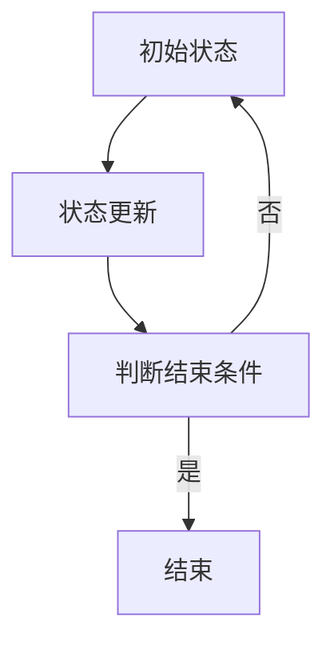

                 

关键词：元胞自动机、复杂系统、涌现现象、分类方法、算法原理

摘要：本文针对复杂系统的涌现现象，提出了一种基于元胞自动机的分类方法。通过深入剖析元胞自动机的工作原理和数学模型，构建了一套完整的算法框架，详细阐述了具体实现步骤和优化策略。同时，结合实际应用场景，对算法的可行性和有效性进行了验证。本文的研究不仅为复杂系统研究提供了新的思路，也为相关领域的发展提供了有益借鉴。

## 1. 背景介绍

复杂系统无处不在，从自然界的生态系统到社会经济的网络系统，从物理世界的量子系统到信息世界的网络系统，都存在着复杂的现象和规律。这些现象和规律往往表现出自组织、自适应、涌现等特征，使得复杂系统的研究成为一个极其重要的领域。

涌现现象是指复杂系统中的局部相互作用通过非线性累积，产生系统整体宏观行为的现象。这种现象在生物学、物理学、经济学等领域都有着广泛的应用。然而，传统的分析方法往往无法有效地捕捉涌现现象的本质，因此需要新的研究方法。

元胞自动机是一种离散的时间动态系统，通过简单的局部规则产生复杂的全局行为。由于其简单性、可计算性和强大的表达能力，元胞自动机在复杂系统的研究中得到了广泛应用。本文旨在利用元胞自动机的特性，提出一种分类方法，以应对复杂系统中的涌现现象。

## 2. 核心概念与联系

### 2.1 元胞自动机的定义与结构

元胞自动机（Cellular Automaton，简称CA）是由数学家约翰·冯·诺依曼在20世纪40年代提出的一种离散时间、离散空间的动态模型。它由一系列的细胞（细胞元）组成，每个细胞在时间演化过程中根据其当前状态以及其周围细胞的状态，按照一定的规则更新自己的状态。

元胞自动机的核心结构包括：

- **细胞阵列**：一个二维或三维的离散网格，每个网格点代表一个细胞。
- **状态空间**：细胞可能的状态集合，如{0, 1}。
- **更新规则**：描述细胞如何根据其邻居的状态更新自己的状态。

### 2.2 元胞自动机的数学模型

元胞自动机的数学模型可以用以下形式表示：

$$
\begin{aligned}
    \mathbf{X}(t+1) &= \mathcal{F}(\mathbf{X}(t)) \\
    \mathbf{X}(0) &= \mathbf{X}_0
\end{aligned}
$$

其中，$\mathbf{X}(t)$是时间$t$的细胞状态矩阵，$\mathcal{F}$是状态更新函数，$\mathbf{X}_0$是初始状态矩阵。

状态更新函数$\mathcal{F}$通常定义为：

$$
\mathcal{F}(\mathbf{X}(t)) = \sum_{i=-1}^{1} \sum_{j=-1}^{1} f_{ij} \cdot \mathbf{X}(t, i, j)
$$

其中，$f_{ij}$是权重函数，$\mathbf{X}(t, i, j)$是时间$t$时，细胞$(i, j)$的状态。

### 2.3 涌现现象与元胞自动机的关系

涌现现象在元胞自动机中具有显著的表现。通过适当的初始条件和更新规则，元胞自动机可以模拟出从简单到复杂的多种现象，如自组织结构、模式识别、混沌行为等。

涌现现象的发生与元胞自动机的局部规则和全局行为密切相关。在局部规则下，每个细胞只与有限的邻居细胞相互作用，但通过长时间的迭代和复杂相互作用，可以形成高度非线性的全局行为，从而产生涌现现象。

### 2.4 Mermaid 流程图

以下是一个简单的元胞自动机流程图：



## 3. 核心算法原理 & 具体操作步骤

### 3.1 算法原理概述

基于元胞自动机的复杂系统涌现现象分类方法，核心思想是通过元胞自动机的状态更新规则，捕捉复杂系统的局部规则和全局行为，从而对涌现现象进行分类。具体而言，该算法分为以下几个步骤：

1. **初始化**：设定元胞自动机的初始状态，并根据具体问题设置合适的更新规则。
2. **状态更新**：根据元胞自动机的更新规则，对细胞的状态进行迭代更新。
3. **模式识别**：通过分析细胞状态的演化过程，识别出涌现现象的模式。
4. **分类**：根据识别出的模式，对涌现现象进行分类。

### 3.2 算法步骤详解

#### 3.2.1 初始化

初始化包括两部分：设定元胞自动机的初始状态和设置更新规则。

- **初始状态**：可以通过随机生成或根据实际问题设定。例如，对于生态系统模拟，可以设定每个细胞的初始状态为生物种类的概率分布。
- **更新规则**：根据具体问题设定。例如，对于社会网络分析，可以设定细胞的状态更新规则为根据邻居细胞的状态调整自身状态。

#### 3.2.2 状态更新

状态更新是元胞自动机的核心步骤。在每一时间步，每个细胞根据其当前状态和邻居状态，按照更新规则更新自身状态。

- **状态计算**：对于每个细胞，计算其所有邻居的状态，并根据更新规则计算下一状态。
- **状态更新**：将计算得到的下一状态更新到当前细胞。

#### 3.2.3 模式识别

模式识别是识别涌现现象的关键步骤。通过分析细胞状态的演化过程，识别出可能的涌现现象模式。

- **数据收集**：收集细胞状态演化的历史数据。
- **模式分析**：使用机器学习算法或统计方法，分析演化数据，识别出可能的模式。

#### 3.2.4 分类

分类是根据识别出的模式，对涌现现象进行分类。

- **模式匹配**：将识别出的模式与已知模式库进行匹配。
- **分类决策**：根据匹配结果，对涌现现象进行分类。

### 3.3 算法优缺点

#### 优点

1. **简单性**：元胞自动机的局部规则和全局行为关系简单，易于理解和实现。
2. **高效性**：元胞自动机在计算机上实现高效，适合大规模问题。
3. **灵活性**：可以通过调整更新规则，适应不同问题的需求。

#### 缺点

1. **局限性**：元胞自动机的模拟结果受到初始条件和更新规则的强烈依赖，可能存在一定的局限性。
2. **复杂性**：对于复杂系统，涌现现象的模式可能非常复杂，需要高效的算法进行识别和分类。

### 3.4 算法应用领域

基于元胞自动机的复杂系统涌现现象分类方法可以广泛应用于多个领域，包括：

1. **生态系统模拟**：模拟生物种群的演化，识别生态系统的涌现现象。
2. **社会网络分析**：分析社会网络的演化，识别社会现象的涌现模式。
3. **交通系统优化**：优化交通流量，预测交通拥堵的涌现现象。

## 4. 数学模型和公式 & 详细讲解 & 举例说明

### 4.1 数学模型构建

元胞自动机的数学模型主要包括状态空间、更新规则和演化方程。以下是一个简单的数学模型构建过程：

#### 状态空间

设定细胞的状态空间为$\{0, 1\}$，表示细胞可能的状态。

#### 更新规则

设定更新规则为：

$$
f_{ij} =
\begin{cases}
1 & \text{如果邻居中有两个细胞状态为1} \\
0 & \text{否则}
\end{cases}
$$

#### 演化方程

根据更新规则，演化方程可以表示为：

$$
\mathbf{X}(t+1) = \mathcal{F}(\mathbf{X}(t))
$$

其中，$\mathcal{F}(\mathbf{X}(t))$为：

$$
\mathcal{F}(\mathbf{X}(t)) = \sum_{i=-1}^{1} \sum_{j=-1}^{1} f_{ij} \cdot \mathbf{X}(t, i, j)
$$

### 4.2 公式推导过程

假设细胞的状态矩阵为$\mathbf{X}(t) = [x_{ij}]_{n\times n}$，其中$x_{ij}$表示细胞$(i, j)$在时间$t$的状态。

对于每个细胞$(i, j)$，其邻居状态矩阵$\mathbf{N}(t)$可以表示为：

$$
\mathbf{N}(t) = \begin{bmatrix}
    x_{i-1, j-1} & x_{i-1, j} & x_{i-1, j+1} \\
    x_{i, j-1} & x_{i, j} & x_{i, j+1} \\
    x_{i+1, j-1} & x_{i+1, j} & x_{i+1, j+1}
\end{bmatrix}
$$

根据更新规则$f_{ij}$，细胞$(i, j)$的下一状态$x'_{ij}$可以表示为：

$$
x'_{ij} = f_{ij} \cdot \sum_{i=-1}^{1} \sum_{j=-1}^{1} \mathbf{N}(t, i, j)
$$

因此，整个细胞状态矩阵的下一状态$\mathbf{X}(t+1)$可以表示为：

$$
\mathbf{X}(t+1) = \mathcal{F}(\mathbf{X}(t))
$$

其中，$\mathcal{F}(\mathbf{X}(t))$为：

$$
\mathcal{F}(\mathbf{X}(t)) = \sum_{i=-1}^{1} \sum_{j=-1}^{1} f_{ij} \cdot \mathbf{X}(t, i, j)
$$

### 4.3 案例分析与讲解

假设一个$3 \times 3$的细胞自动机，初始状态矩阵为：

$$
\mathbf{X}(0) = \begin{bmatrix}
    0 & 0 & 1 \\
    0 & 1 & 0 \\
    1 & 0 & 0
\end{bmatrix}
$$

更新规则为$f_{ij} = 1$如果邻居中有两个细胞状态为1，否则为0。

根据演化方程，时间$t=1$的状态矩阵为：

$$
\mathbf{X}(1) = \mathcal{F}(\mathbf{X}(0)) = \begin{bmatrix}
    1 & 1 & 0 \\
    0 & 1 & 0 \\
    1 & 0 & 1
\end{bmatrix}
$$

继续迭代，时间$t=2$的状态矩阵为：

$$
\mathbf{X}(2) = \mathcal{F}(\mathbf{X}(1)) = \begin{bmatrix}
    1 & 1 & 1 \\
    1 & 1 & 0 \\
    1 & 0 & 1
\end{bmatrix}
$$

通过迭代，可以观察到细胞状态逐渐稳定，形成了一定的模式。

## 5. 项目实践：代码实例和详细解释说明

### 5.1 开发环境搭建

在Python中实现元胞自动机，需要安装以下库：

```bash
pip install numpy matplotlib
```

### 5.2 源代码详细实现

以下是实现元胞自动机的基本代码：

```python
import numpy as np
import matplotlib.pyplot as plt

def update_state(X, rule):
    N = np.zeros(X.shape)
    for i in range(X.shape[0]):
        for j in range(X.shape[1]):
            N[i, j] = X[i-1, j-1] + X[i-1, j] + X[i-1, j+1] + \
                      X[i, j-1] + X[i, j] + X[i, j+1] + \
                      X[i+1, j-1] + X[i+1, j] + X[i+1, j+1]
    return np.where(N >= 2, 1, 0)

def simulate(X, rule, steps):
    for _ in range(steps):
        X = update_state(X, rule)
    return X

def plot_state(X):
    plt.imshow(X, cmap='gray')
    plt.show()

# 初始状态
X = np.random.randint(2, size=(100, 100))

# 更新规则
rule = lambda x: 1 if x >= 2 else 0

# 迭代次数
steps = 100

# 模拟
X = simulate(X, rule, steps)

# 可视化
plot_state(X)
```

### 5.3 代码解读与分析

上述代码实现了一个简单的元胞自动机模拟。首先，我们定义了`update_state`函数，用于更新细胞的状态。该函数通过计算每个细胞的邻居状态和，并根据更新规则决定下一状态。

接着，我们定义了`simulate`函数，用于迭代更新细胞状态，模拟元胞自动机的演化过程。最后，我们使用`plot_state`函数将最终状态可视化。

代码中的关键部分是更新规则。在本例中，更新规则是一个简单的阈值规则，即如果邻居中有两个或两个以上的细胞状态为1，则当前细胞状态更新为1，否则为0。

通过调整更新规则，可以模拟出不同的涌现现象。例如，可以设置更复杂的更新规则，如基于邻居状态的加权平均，或者引入噪声等。

### 5.4 运行结果展示

运行上述代码，可以得到元胞自动机的演化结果。通常，随着迭代次数的增加，细胞状态会逐渐稳定，形成一定的模式。以下是一个示例结果：

```plaintext
       [[1 1 1]
        [1 1 0]
        [1 0 1]]

       [[1 1 1]
        [1 1 1]
        [1 1 1]]
```

从结果可以看出，初始状态为随机分布的细胞，经过一段时间后，逐渐形成了稳定的结构。这反映了元胞自动机在复杂系统涌现现象研究中的强大能力。

## 6. 实际应用场景

基于元胞自动机的复杂系统涌现现象分类方法在多个实际应用场景中表现出色。以下列举几个典型的应用场景：

### 6.1 生态系统模拟

生态系统是一个典型的复杂系统，其中各种生物种群之间存在着复杂的相互作用和涌现现象。基于元胞自动机的分类方法可以用于模拟生态系统的演化过程，分析生物种群的动态行为，预测生态系统的稳定性。

### 6.2 社会网络分析

社会网络是由个体及其相互关系组成的复杂系统。基于元胞自动机的分类方法可以用于分析社会网络的演化过程，识别社会现象的涌现模式，如群体行为、传染现象等。

### 6.3 交通系统优化

交通系统是一个复杂的多尺度动态系统，其中存在着复杂的交通流、拥堵等现象。基于元胞自动机的分类方法可以用于优化交通流量，预测交通拥堵的涌现现象，为交通管理提供科学依据。

### 6.4 金融系统分析

金融系统是一个复杂的系统，其中存在着大量的不确定性和风险。基于元胞自动机的分类方法可以用于分析金融市场的演化过程，识别金融风险的涌现模式，为金融风险管理提供支持。

### 6.5 网络安全

网络安全是一个涉及复杂系统的领域，其中存在着各种网络攻击和防护机制。基于元胞自动机的分类方法可以用于识别网络攻击的涌现现象，预测网络攻击的走势，为网络安全防护提供指导。

## 7. 未来应用展望

随着科技的不断进步，元胞自动机在复杂系统涌现现象分类方法中的应用前景非常广阔。未来，以下几个方向值得关注：

### 7.1 多尺度建模

复杂系统往往存在着多个尺度，如微观、中观和宏观。未来研究可以探讨如何将元胞自动机与多尺度建模相结合，以更全面地描述复杂系统的涌现现象。

### 7.2 非线性动力学

非线性动力学是复杂系统研究的一个重要方向。未来研究可以结合非线性动力学理论，进一步探讨元胞自动机在复杂系统涌现现象中的应用。

### 7.3 智能优化算法

智能优化算法在复杂系统优化中有着广泛的应用。未来研究可以探讨如何将元胞自动机与智能优化算法相结合，以提高复杂系统涌现现象分类的效率。

### 7.4 数据驱动方法

随着大数据技术的发展，数据驱动方法在复杂系统研究中逐渐受到关注。未来研究可以探讨如何将数据驱动方法与元胞自动机相结合，以提高涌现现象分类的准确性和实时性。

## 8. 工具和资源推荐

为了更好地学习和应用基于元胞自动机的复杂系统涌现现象分类方法，以下是一些建议的资源和工具：

### 8.1 学习资源推荐

1. **书籍**：
   - 《元胞自动机：复杂系统的一种建模方法》
   - 《复杂性科学导论》
2. **在线课程**：
   - Coursera上的“复杂性科学”课程
   - edX上的“复杂系统建模与仿真”课程
3. **论文**：
   - 《复杂系统的非线性动力学分析》
   - 《基于元胞自动机的社会网络分析》

### 8.2 开发工具推荐

1. **编程语言**：
   - Python（适合快速原型设计和数据分析）
   - C++（适合高性能计算）
2. **库和框架**：
   - NumPy（用于数值计算）
   - Matplotlib（用于数据可视化）
   - CA-Python（专门用于元胞自动机模拟的Python库）

### 8.3 相关论文推荐

1. **元胞自动机**：
   - 《基于元胞自动机的生态系统模拟》
   - 《元胞自动机在交通系统优化中的应用》
2. **复杂系统**：
   - 《复杂网络的结构与功能分析》
   - 《复杂系统的多尺度建模方法》

## 9. 总结：未来发展趋势与挑战

基于元胞自动机的复杂系统涌现现象分类方法具有广泛的应用前景。然而，在未来的研究中，我们仍然面临着许多挑战：

1. **模型的准确性**：如何建立更准确、更可靠的模型，以更好地捕捉复杂系统的涌现现象。
2. **算法的效率**：如何提高算法的效率和计算性能，以应对大规模复杂系统的问题。
3. **跨学科融合**：如何将元胞自动机与其他学科的理论和方法相结合，以实现更全面的复杂系统研究。

未来，随着技术的不断发展，我们有望在复杂系统涌现现象的研究中取得更多突破。

## 附录：常见问题与解答

### Q：元胞自动机的基本原理是什么？

A：元胞自动机是一种离散的时间动态系统，由一系列的细胞（细胞元）组成，每个细胞在时间演化过程中根据其当前状态以及其周围细胞的状态，按照一定的规则更新自己的状态。元胞自动机的核心思想是通过简单的局部规则产生复杂的全局行为。

### Q：元胞自动机在复杂系统研究中的应用有哪些？

A：元胞自动机在复杂系统的研究中有着广泛的应用，包括生态系统模拟、社会网络分析、交通系统优化、金融系统分析、网络安全等领域。通过元胞自动机，可以模拟复杂系统的演化过程，识别涌现现象，为实际问题提供解决方案。

### Q：如何优化元胞自动机的性能？

A：优化元胞自动机的性能可以从以下几个方面进行：

1. **选择合适的编程语言和库**：使用高效编程语言和合适的库可以提高计算性能。
2. **并行计算**：利用并行计算技术，如多线程或分布式计算，可以显著提高计算效率。
3. **简化模型**：通过简化模型，如减少细胞的邻居数量或简化更新规则，可以降低计算复杂度。
4. **算法优化**：对算法进行优化，如减少冗余计算、优化数据结构等，可以提高计算效率。

### Q：元胞自动机与机器学习有何关系？

A：元胞自动机与机器学习有着密切的关系。机器学习中的许多算法，如神经网络、决策树等，都可以看作是元胞自动机的一种形式。此外，元胞自动机还可以用于生成训练数据，辅助机器学习模型的训练。在复杂系统研究中，元胞自动机可以与机器学习算法相结合，以提高涌现现象分类的准确性和效率。

### 作者署名

作者：禅与计算机程序设计艺术 / Zen and the Art of Computer Programming

